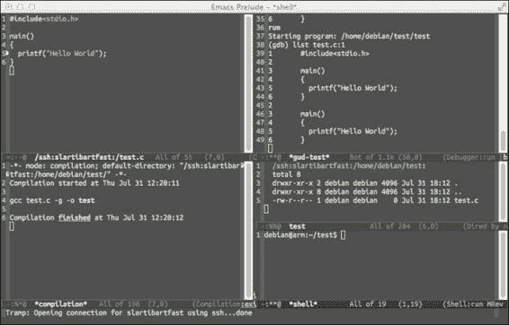
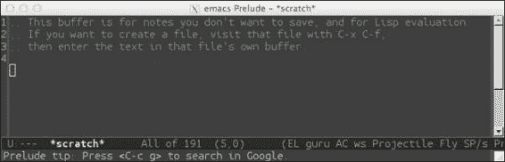
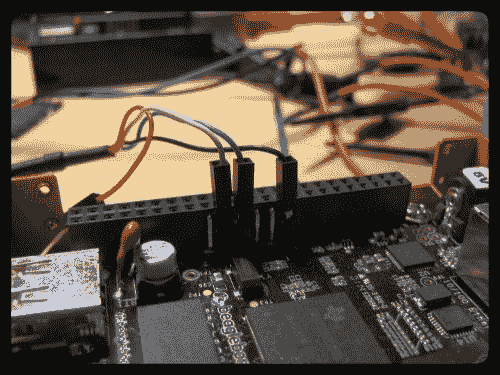
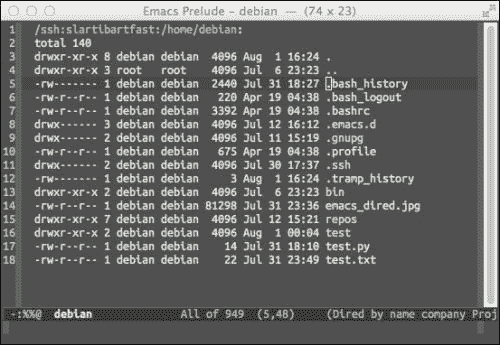

# 第一章：创建你的 BeagleBone Black 开发环境

本书是为秘密特工编写的。詹姆斯·邦德是最容易想到的秘密特工，但在今天这个高度互联的世界中，真正的秘密特工应该是在 Q 部门。诸如伪装、窃听设备和掌纹武器等间谍技巧对现场特工有用，但在网络环境中我们需要其他工具。这些工具就像现场特工所使用的工具一样，使你能够在人群中隐藏、保护秘密通信，并验证其他特工的身份。本书中的软件和硬件项目使用了那些被举报人、保护消息来源的记者以及在高度审查的国家寻求访问未经过滤信息的普通公民所依赖的工具。

**BeagleBone Black**（**BBB**）是一个完整的计算机，体积可以放进一个 Altoid 的薄荷糖铁盒里。它的小巧外形、低功耗和强大的性能使得这个设备能够帮助你保护隐私并确保在线通信的安全。在我们构建这些工具之前，我们首先需要了解如何与 BBB 互动。本章将介绍 BBB，并建议一个开发环境，你可以在其中构建后续项目。

本章内容包括：

+   了解 BBB 及其背后的开源原则

+   安装并使用 Emacs 编辑器

+   将 Emacs 配置为嵌入式开发环境

+   为可用性定制你的 SSH 配置

+   调查加密学、电子学和 Linux 的背景信息资源

# 介绍 BBB

从 BeagleBoard 网站（[BeagleBoard.org](http://BeagleBoard.org)）上获取，BeagleBoard 是 BeagleBoard-xM、BeagleBone 和 BBB 背后的非营利基金会，BBB 是*一个低成本、社区支持的开发平台，适用于开发人员和爱好者*。最新版本 Rev C 的规格令人印象深刻，包括 TI Sitara AM3358 1GHz ARM Cortex-A8 处理器、512MB DDR3 内存以及 4GB **嵌入式多媒体卡**（**eMMC**）作为板载闪存。当你查看这块板时，你会看到两个 46 引脚的扩展头。如果你将它与其他同价位的爱好者板进行比较，你会得出结论，其他板的扩展能力远不如 BBB。BBB 支持更多的 **输入/输出**（**IO**）选项，包括三条 I2C 总线、多个串口、65 个 **通用输入输出**（**GPIO**）、多个 **脉冲宽度调制**（**PWM**）和七个带有内置 **模拟到数字转换器**（**ADC**）的模拟输入。如果你不懂这些术语，没关系，我们将在项目中逐步解释所使用的系统。

来自[BeagleBoard.org](http://BeagleBoard.org)的文档质量非常出色。你应该阅读 BBB 的**系统参考手册**（**SRM**），这是 BBB 的官方手册，位于[`github.com/CircuitCo/BeagleBone-Black/blob/master/BBB_SRM.pdf?raw=true`](https://github.com/CircuitCo/BeagleBone-Black/blob/master/BBB_SRM.pdf?raw=true)。这是一本完整的手册，涵盖了连接 BBB、电源选项和启动顺序。许多在 BeagleBoard 邮件列表和 IRC 频道上提出的问题，可以在这本手册中快速找到答案。本书的作者假设你至少浏览过 SRM 的第 3、4 和 5 章，这意味着你已经了解了 BBB 的基本功能并熟悉其物理连接器。没有比这份文档更好的 BBB 参考资料了。

## 欣赏 BBB 对开源硬件的承诺

BBB 还有一个非常重要的特点：它是**开源硬件**（**OSHW**）。OSHW 是一个相对较新的概念，其确切定义可能会让人感到困惑。然而，有一个组织——**开源硬件协会**（**OSHWA**），其使命是教育和推广 OSHW。他们的定义可以在他们的网站上找到：[`www.oshwa.org/definition/`](http://www.oshwa.org/definition/)。和大多数组织一样，达成统一的定义可能会非常困难。OSHW 的定义内容超过了一页。将 OSHW 从开源软件中区分出来的难点在于，硬件是一个*物理存在*。硬件的设计文件用于制造硬件，但同时也有物理组件。为了做一个类比，硬件的编译器就是制造商。因此，OSHW 的定义是精心构建的，通常适用于硬件的设计文件。

### 注意

OSHWA 的执行董事 Alicia Gibb 在 TEDx 上做了一个名为*专利的死亡及其后果*的演讲([`www.youtube.com/watch?v=z__Sbw1Ax4o`](https://www.youtube.com/watch?v=z__Sbw1Ax4o))。演讲阐述了硬件设计如何跨越版权和专利法的界限。Alicia 还提供了一些关于专利和 OSHW 背后动机的有趣见解。

BBB 是 OSHW，因为它发布了文档、原理图、**计算机辅助设计**（**CAD**）文件、**物料清单**（**BOM**）和生产文件（Gerber 文件），所有这些都在 Creative Commons 许可下发布。这意味着你不仅可以研究完整的设计，还可以自由制作你自己的衍生版 BBB。

## 开箱 BBB 并提供电源

与树莓派不同，BBB 开箱即用。最近的 BBB 会预装 Debian 发行版的 GNU/Linux（以下简称 Debian）在 eMMC 中。eMMC 是 BBB 上的闪存内存。当电源接入主板时，BBB 将开始从 eMMC 启动。如 SRM 的第三节所示，你可以用随附的 USB 线将 BBB 直接连接到你的 PC。BBB 还可以通过 5V 的圆形插孔供电，此时你需要一个能提供最大 1A 电流的墙面适配器。如果你计划将一个迷你**液晶显示器**（**LCD**）连接到 BBB，你可能需要使用一个 2A 的适配器。你通常可以在适配器上找到输出电压和电流的规格。如果蓝色用户**发光二极管**（**LED**）闪烁，你就可以判断主板是否已经通电并在运行。具体来说，LED USER0 会以心跳模式闪烁。

### 注意

每个用户 LED 都有一个默认含义，表示特定的 BBB 活动。为了进一步激励你阅读 SRM，含义在第 3.4.3 节第 6 步*启动主板*中定义。

### 提示

在选择电源时要非常小心。BBB 需要 5VDC ±0.25V。连接更高电压的电源会损坏主板。

BBB 可以支持多种外设，例如键盘、鼠标和显示器。然而，在本书中，我们将以*无头*配置使用 BBB，这意味着*没有*显示器。SRM 的第三部分详细介绍了各种连接场景。

# 使用 Emacs 创建嵌入式开发环境

在启用 BBB 电源后，我们需要找到一种与其互动的方式。我们需要一套可以连接到 BBB、发送 Shell 命令并传输文件的工具。这套工具就是你的**开发环境**。开发环境是个人的选择，选择很多。找到一个合适的环境非常值得花时间去做，因为它将是你与 BBB 交互的主要工具。你的环境需要具备执行你所需任务的技术能力，同时还需要具有可配置性和可扩展性。这里描述的环境完全包含在 Emacs 编辑器中。

### 注意

如果你更愿意使用一个特定的**集成开发环境**（**IDE**），例如 Eclipse，你可以查看一些有用的教程：[`derekmolloy.ie/beaglebone/setting-up-eclipse-on-the-beaglebone-for-c-development/`](http://derekmolloy.ie/beaglebone/setting-up-eclipse-on-the-beaglebone-for-c-development/) 和 [`janaxelson.com/eclipse1.htm`](http://janaxelson.com/eclipse1.htm)。

## 理解嵌入式开发的复杂性

Emacs 的历史几乎与现代计算的历史一样长。作为一个编辑器，Emacs 常常被忽视，因为它有过时和难以学习的名声。由于其界面与大多数现代界面不同，Emacs 可能让人感觉不知所措。而且，快捷键是在现代**图形用户界面**（**GUI**）发明之前就创建的，因此这些快捷键与通常使用的快捷键不太相同。然而，针对各种 Emacs 的*启动包*正在积极开发，它们能提供更顺畅的 Emacs 体验。如果你记住 Emacs 早于你的操作系统，你可能会更容易接受 Emacs 的工作方式。

### 注意

许多早期著名的程序员曾在 Emacs 上工作，包括盖·斯蒂尔（Guy Steele）、理查德·斯托尔曼（Richard Stallman）、詹姆斯·高斯林（James Gosling）和杰米·扎温斯基（Jamie Zawinski）。Emacs 的设计由理查德·斯托尔曼于 1981 年在 ACM 文本处理会议上提出；完整文本可在[`www.gnu.org/software/emacs/emacs-paper.html`](https://www.gnu.org/software/emacs/emacs-paper.html)获取。

嵌入式开发比网页或桌面开发稍微复杂一些，因为通常涉及两台机器：主机（你的计算机）和目标机（你的嵌入式平台）。嵌入式系统的能力各不相同，有些系统甚至没有操作系统，这种情况下当然无法支持运行编译器。在这种情况下，用户需要在主机上为目标机交叉编译代码。虽然可以在 BBB 上进行交叉编译，但在 BBB 上本地编译小程序并不会花费太长时间。

对于在 BBB 上的开发，常见的建议是通过**安全外壳**（**SSH**）连接到设备，并使用命令行工具。这是一种有效的技术，但它将你限制在命令行和终端仿真器中。这些工具非常强大，在这种情况下，限制并不意味着功能受限，而是界面受限。

Emacs 在嵌入式开发中的一个有用特性是**透明远程访问多协议**（**TRAMP**）模式。简而言之，TRAMP 模式允许你在主机计算机上运行 Emacs，而主机计算机通常比 BBB 更强大，但你可以像访问本地文件一样访问 BBB 上的文件并运行命令。在 TRAMP 模式中，这是透明的；在这种环境下工作，就像是在主机上工作，而不是在嵌入式平台上。以下截图展示了 Emacs 的 TRAMP 功能：



这张截图是在 Mac OS X 上运行 Emacs 时拍摄的，但连接到了主机名为 `slartibartfast` 的 BBB 上。屏幕上的一切都在 BBB 上运行。左上角的框显示了与 **GNU 调试器**（**GDB**）进行的一个简单 C 程序的实时调试会话。左下角的框显示了从 BBB 上运行 `gcc` 得到的编译结果。右上角的框显示了交互式的 `gdb` 会话。最后，右下角的框显示了当前目录和一个 shell。接下来的章节将提供如何安装 Emacs 并设置此开发环境的详细信息。

### 提示

要为你的 BBB 命名，你需要修改两个文件。第一个文件是 `/etc/hostname`，然后你需要在 `/etc/hosts` 中进行相同的更改。如果你在选择合适的名称时遇到困难，可以参考以下 XKCD 漫画来得到些许安慰：

[`xkcd.com/910/`](https://xkcd.com/910/)

## 安装 Emacs 24

我们需要 Emacs 24.x 版本来使用 Bozhidar Batsov 的 **prelude** 启动包。Prelude 由 Batsov 和专注的 prelude 用户持续维护。代码托管在 GitHub 上（[`github.com/bbatsov/prelude`](https://github.com/bbatsov/prelude)），那里有详细的 README 文档。该软件是可选的，但它提供了许多便捷的功能和合理的默认配置设置。Emacs 的安装程序因操作系统不同而大不相同，但你可以参考以下表格来查找软件的位置：

| 操作系统 | 链接 |
| --- | --- |
| Windows | [`ftp.gnu.org/gnu/emacs/windows/`](http://ftp.gnu.org/gnu/emacs/windows/) |
| Mac OS X | [`emacsformacosx.com/builds`](http://emacsformacosx.com/builds) |
| 来源 | [`ftp.gnu.org/gnu/emacs/emacs-24.3.tar.gz`](http://ftp.gnu.org/gnu/emacs/emacs-24.3.tar.gz) |

如果你是 Windows 用户并且在安装 Emacs 时遇到问题，请参考 [`www.gnu.org/software/emacs/manual/html_mono/efaq-w32.html`](https://www.gnu.org/software/emacs/manual/html_mono/efaq-w32.html) 中的指南。Mac 用户应该会发现前一节列出的二进制文件足够使用。如果你使用 *nix 系统，可以通过包管理器安装 Emacs，或者从源代码编译。如果你使用包管理器，确保安装 Emacs 的主版本 24。在基于 Debian 的系统中，命令是 `apt-get install emacs24`。

## 安装 prelude

可以通过输入以下命令来安装 Emacs prelude 软件：

```
curl -L http://git.io/epre | sh

```

### 提示

**下载示例代码**

你可以从你的账户中下载所有购买的 Packt 图书的示例代码文件，访问 [`www.packtpub.com`](http://www.packtpub.com)。如果你是从其他地方购买的这本书，你可以访问 [`www.packtpub.com/support`](http://www.packtpub.com/support) 注册并将文件直接通过电子邮件发送给你。

如果你对缩短的 URL 感到不放心，请查看引言 README，其中包含备用安装说明，可在 [`github.com/bbatsov/prelude`](https://github.com/bbatsov/prelude) 获取。安装程序会报告任何缺少的需要安装的软件包。完成后，应运行 Emacs。如果已为您的操作系统安装了二进制版本，则双击图标即可。在命令行上，只需输入 `emacs` 即可启动程序。在初始启动时，Emacs 将尝试访问 Emacs 包管理器并下载额外的软件。然后将源文件进行字节编译，因此需要一两分钟的时间。完成后，请关闭 Emacs 并重新打开；您应该看到类似以下屏幕的内容：



### 注意

是的，Emacs 拥有自己的包管理器和专用于 Emacs 的仓库，提供 Emacs Lisp Package。查看 Batsov 的以下博文，深入了解 Emacs 包管理：

[`batsov.com/articles/2012/02/19/package-management-in-emacs-the-good-the-bad-and-the-ugly/`](http://batsov.com/articles/2012/02/19/package-management-in-emacs-the-good-the-bad-and-the-ugly/)

## 学习如何学习 Emacs

Emacs 有太多功能了。这里有一个开玩笑的笑话：*Emacs 是一个需要好编辑器的操作系统*。本节将展示使用 Emacs 所需的基本技能，更重要的是，学习如何使用 Emacs。Emacs 最好的功能之一是其庞大的内置帮助系统。如果您以前从未运行过 Emacs，请按 *Ctrl-h t*，缩写为 *C-h t*。这意味着在按住 *Ctrl* 键的同时，按 *h*，然后释放它，然后按 *t*。还请注意，Emacs 命令区分大小写。*C-H T* 意味着按下 *Ctrl + Shift + H*，然后按 *Shift + T*，而 *C-h t* 则不需要按下 Shift 键。您将看到交互式的 Emacs 教程。在教程中，您将看到关于元键的引用，这在您的键盘上可能很难找到。命令序列，如 *M-x*，意味着按住元键并同时按下 *x*。根据您的系统，元键可能是 *Alt* 或 *Option*。如果这两者都不起作用，您可以按下 *Esc* 键并释放它以提供元键功能。

教程非常好，本章的其余部分假设您已经完成了此教程或具备了相当水平的知识，以理解更高级的功能。

### 注意

学习 Emacs 的其他一些有用资源包括 Sacha Chua 的*如何学习 Emacs*图示（[`sachachua.com/blog/wp-content/uploads/2013/05/How-to-Learn-Emacs-v2-Large.png`](http://sachachua.com/blog/wp-content/uploads/2013/05/How-to-Learn-Emacs-v2-Large.png)）和官方的*Emacs 24 参考卡*（[`www.gnu.org/software/emacs/refcards/pdf/refcard.pdf`](https://www.gnu.org/software/emacs/refcards/pdf/refcard.pdf)）。

### 提示

如果您是 vi 用户，Emacs 中有一种模式可以模拟大多数 vi 键绑定，称为 viper 模式（[`www.emacswiki.org/emacs/ViperMode`](http://www.emacswiki.org/emacs/ViperMode)）。

## 精简 SSH 连接

即使您不使用 Emacs，您也会经常通过 SSH 连接到 BBB。如果您通过连接到 PC 的 USB 电缆运行 BBB，那么 BBB 的默认 IP 地址将是`192.168.7.2`。然而，如果您想直接将软件下载到 BBB，就像您完成这些项目所需的那样，您必须将 PC 的互联网连接转发到 BBB。另外，当通过 USB 直接供电时，通常会有限制 500mA 的电流。当 BBB 为扩展板或其他外设供电时，需要通过能够提供最多 1A 电流的 5V 直流插头来供电。由于这两个问题，您可能会发现通过 5V 电源运行 BBB，并将以太网电缆直接连接到您的家庭网络中会更方便。

当您这样做时，IP 地址通常会由您的路由器分配，并且只有路由器知道该地址。这将使您一直盯着 BBB，琢磨着它的 IP 地址。

### 发现您的网络中 BBB 的 IP 地址

有几种方法可以发现设备的 IP 地址。第一种方法是登录到路由器并查找 IP 地址。这是一个快速方法，但由于路由器种类繁多，您需要查阅路由器的文档，了解如何实现这一操作。

您还可以使用`nmap`工具在网络上执行快速**ping 扫描**。假设您已经熟悉自己网络的 IP 地址，您应该能看到一个新的设备。如果您使用的是基于 apt 的发行版，您可以通过`sudo apt-get install nmap`来安装`nmap`。如果您使用 Mac，您可以使用 homebrew 包管理器（[`brew.sh/`](http://brew.sh/)），并通过`brew install nmap`来安装它。Windows 用户应该从[`nmap.org/download.html#windows`](http://nmap.org/download.html#windows)下载二进制文件。安装后，您可以运行类似以下的命令：

```
nmap -sn 192.168.1.0/24

```

将`192.168.1.0`替换为您网络的相应地址。`/24`是**无类域间路由**（**CIDR**）表示法，用于子网掩码。在这种情况下，`/24`表示使用 24 位 1 的子网掩码，即`255.255.255.0`。`-sn`选项指示`nmap`执行 ping 扫描。

如果你仍然无法确定 IP 地址，可以购买一根 USB 到串口的适配器电缆。BBB 有一个串口调试头，位于 P9 头针的内部。你可以将 USB 到串口适配器连接到 BBB 的串口调试头，如下图所示：



在此图中，针脚 1（黑色线）为接地，针脚 4 为接收，针脚 5 为发送。连接好后，你需要一个终端仿真器通过串口连接。GNU Screen 是一款广泛可用、免费的强大软件，可以通过以下命令进行连接；只需将 `/dev/tty.XXXX` 替换为你的连接文件：

```
screen /dev/tty.PL2303-004014FA 115200

```

最后，你可以为你的 BBB 设置静态 IP。你的路由器可能支持静态租约功能，这将在设备进行 **动态主机配置协议**（**DHCP**）请求时将你选择的 IP 分配给设备。此请求的租约可以是无限期的，因此实际上提供了一个 *静态* IP。你也可以在设备上静态设置 IP，但那样你就必须手动管理冲突。因此，推荐的方法是让路由器来处理这种情况。

### 提示

要查找串口调试电缆，请参阅 eLinux 页面：[`elinux.org/Beagleboard:BeagleBone_Black_Serial`](http://elinux.org/Beagleboard:BeagleBone_Black_Serial)。

为了充分利用下一节中的 SSH 配置选项，建议设置静态 IP。否则，每当路由器重启或 BBB 断开连接几天后，你都需要重复前面的步骤来确定设备的 IP 地址。

### 提示

如果你更喜欢使用 WiFi 连接而非以太网，请注意某些 USB 网卡可能存在问题。请参考这个 eLinux 页面以了解支持的适配器：[`elinux.org/Beagleboard:BeagleBoneBlack#WIFI_Adapters`](http://elinux.org/Beagleboard:BeagleBoneBlack#WIFI_Adapters)。

### 编辑 SSH 配置文件

为了连接到 BBB，你需要输入类似以下的命令，但要使用前面章节中的 BBB 的 IP 地址：

```
ssh debian@192.168.1.10

```

### 提示

如果你是 Windows 用户，考虑在主机上使用更多类似 Unix 的工具，因为 BBB 运行的是 Debian 系统。你可以安装 Cygwin ([`www.cygwin.com/`](https://www.cygwin.com/))，它将为你提供一个不错的 shell 以及相关的命令行工具。或者，你也可以考虑下载 VirtualBox ([`www.virtualbox.org/`](https://www.virtualbox.org/)) 并在虚拟机中安装一个 GNU/Linux 发行版。

默认的用户名是 `debian`，默认密码是 `temppwd`。如果你只有一个设备，输入此命令可能是可以管理的。一旦你开始收集多个 BBB、Raspberry Pi、pcDuino、Cubieboard、带 WiFly Shield 的 Arduino 等设备，你就需要记住每个设备的 IP 地址、用户名和密码。这样会很麻烦。幸运的是，有一些技巧可以帮助你改善这种情况。

首先，您需要一个 SSH 私钥。如果您还没有密钥，可以使用以下命令在您的主机上生成一个：

```
ssh-keygen -t rsa -b 4096

```

现在编辑`~/.ssh/config`文件。如果您在 Emacs 中进行此操作，可以按*C-x C-f*，然后键入`~/.ssh/config`。Emacs 键绑定都绑定到 Emacs Lisp 命令（技术上，有几个基本命令是用 C 实现的）。键绑定*C-x C-f*绑定到`find-file`函数。打开文件的另一种，尽管更长的方式是按*M-x*，输入`find-file`，然后打开您选择的文件。

在您的`~/.ssh/config`文件中添加以下部分，将 HostName 替换为 BBB 的 IP 地址：

```
Host bbb
 HostName 192.168.1.10
 User debian

```

```
http://www.cyberciti.biz/faq/howto-regenerate-openssh-host-keys/:
```

```
rm /etc/ssh/ssh_host_*
dpkg-reconfigure openssh-server

```

这将删除您现有的 SSH 主机密钥，并从头开始生成它。由于主机密钥已更改，我们需要更新您主计算机上的 SSH 客户端。如果您再次登录到 BBB，可能会收到警告，指纹不匹配，因为您已更改。您可以通过输入以下内容从您的客户端中删除旧条目（您可能需要使用 IP 地址而不是`bbb`）：

```
ssh-keygen -R bbb

```

或者，您可以直接编辑`~/.ssh/known_hosts`并删除条目。

有了新的 SSH 密钥，并删除了`known_hosts`中的旧条目，请务必重新登录到 BBB，以确保一切正常。重新退出并返回到您主机上的终端。执行以下命令后，您将不再需要输入密码：

```
cat .ssh/id_rsa.pub | ssh bbb 'cat >> .ssh/authorized_keys'

```

这将复制您的公共 SSH 密钥到 BBB 上，在 SSH 握手中被识别为授权密钥，因此不需要您输入`debian`用户的密码。

很可能您需要再次执行此操作，而您可能不想参考本书来查找此命令。您可以将此功能添加到您的`.bashrc`文件或其他等效文件以进一步提高使用便捷性：

```
ssh_upload(){
  if [[ $# -ne 1 ]]; then
    echo "usage: host\nNOTE: host should be set in ~/.ssh/config"
    else
    cat ~/.ssh/id_rsa.pub | ssh $1 'cat >> ~/.ssh/authorized_keys'
    fi
}
```

然后，您可以将您的密钥添加到服务器中：

```
ssh_upload bbb

```

别忘了重新加载您的`.bashrc`文件以获得此功能：

```
source ~/.bashrc
```

退出并重新登录也将起作用。

### 运行 SSH 代理程序以控制对 SSH 密钥的访问。

现在，您不必每次登录到 BBB 时输入`debian`账户密码，但现在您需要输入 SSH 私钥密码。这同样令人讨厌。但是，我们可以通过运行`ssh-agent`来解决这个问题。安装和配置`ssh-agent`取决于操作系统，并且在线上很容易找到说明。一旦`ssh-agent`运行，通常情况下，当您登录时需要输入 SSH 私钥密码，如果在一定时间内进行 SSH 连接，您将立即连接到远程服务器，无需额外输入密码。

## 使用 TRAMP 连接到 BBB

现在我们已经配置了 SSH，连接到 BBB 将变得更容易。Emacs 内置了一个目录编辑器，叫做`dired`，可以通过按*C-x d*来调用。我们想要在 BBB 上打开`dired`以查看远程文件。按*C-x d*，然后输入目录`/ssh:bbb:/home/debian`。应该会立即打开一个类似下面的屏幕，显示你主目录的内容：



所有基本的 Emacs 导航命令都适用于`dired`，因此你可以在目录中导航并按下回车键来打开文件或另一个目录。*^*键将带你到父目录。你也可以点击目录或文件来打开它们。

### 提示

如果`tramp-default-method`变量被设置为`ssh`，你可以将 URL 简化为`/bbb:/home/debian`。你可以通过评估该变量来查看其状态。要评估 Emacs Lisp，按*M-:*，然后输入`tramp-default-method`，迷你缓冲区应该会显示`ssh`。

如果你想了解更多关于`dired`或任何 Emacs 相关的内容，可以按下*C-h r*来查看内置文档。如果你滚动或搜索（按下*C-s*），你会在页面上找到`dired`手册。该手册使用信息查看器，你可以按*C-h i*来获取主信息页面，然后按*h*来了解相关内容。

Emacs 的一个特点是其可扩展性。假设你将经常连接到 BBB，按*C-x d*并输入`/ssh:bbb:/home/debian`可能会觉得有些麻烦。我们可以定义一个新的键序列来简化这一过程。切换到 Emacs 中的 scratch 缓冲区。按*C-x b*，输入`*scratch`，然后按*Tab* + *Enter*。粘贴以下代码：

```
(global-set-key
 [(control x) (control y)]
 (lambda ()
   "Open a dired buffer on the BBB"
   (interactive)
   (dired "/ssh:bbb:/home/debian")))
```

```
 press *C-x C-y* and you should see the home directory of BBB. Congratulations! You've just customized Emacs! If you restart Emacs, however, you'll lose this convenient function, so you need to save it. If you are using the Emacs prelude, customizations should go in ~/.emacs.d/personal/foo.el. You can save this buffer with *C-x C-s* and specify the filename.
```

如果你喜欢使用 Emacs，你可能也会喜欢修改 Emacs，而这可以通过 Emacs Lisp 来实现。当然，Emacs 包含了一本非常好的手册来学习 Emacs Lisp，*Emacs Lisp 编程入门*。你可以通过按*C-h i d*来访问，然后你可以滚动到手册部分，或者按 m，输入`Emacs Lisp`，然后按*Tab*进行自动补全，找到*Emacs Lisp Intro*。

### 从 Emacs 运行命令

如果你当前在 Emacs 中查看`dired`缓冲区，那么 Emacs 就知道你正在使用远程机器。某些命令是 TRAMP 感知的，会远程执行。例如，*M-!*将执行一个 shell 命令。当在 TRAMP 上使用时，它将远程执行 shell 命令。尝试使用*M-!*执行`touch` `test.txt`命令。现在按*g*刷新`dired`，你应该能看到`test.txt`。如果你通过在`dired`中导航到该文件并按*Enter*来编辑它，你实际上是在远程编辑该文件。从技术上讲，你是在编辑该缓冲区的本地副本，但当你按*C-x C-s*保存时，修改会被传输到 BBB。

这个系统有一个好处。如果 SSH 连接因某种原因断开，缓冲区仍然保存在你本地机器的内存中。一旦连接恢复，Emacs 会保存该缓冲区。Emacs 充当你远程连接的会话管理器，并在需要时自动重新连接。

如果你在 Emacs 中打开一个 C 文件，Emacs 会应用 C 语言语法高亮，但它也可以通过 TRAMP 进行编译和调试。要进行编译，按 *M-x*，输入 `compile`，并提供编译命令。如果有 makefile，`make` 就足够了；否则，提供完整的 `gcc` 编译命令。使用编译功能的好处是 Emacs 会识别编译错误，并且你可以通过 *C-x*` 跳转到每个错误。最后，如果你在 BBB 上安装了 `gdb`，你可以从主机计算机上使用 `gdb` 进行调试。假设你已经使用调试符号编译了程序，如果你在当前缓冲区查看源代码，你可以按 *M-x*，然后输入 `gdb`。

你需要提供`gdb`命令，类似于`gdb nameofexec -i=mi`。Emacs 会远程启动 `gdb` 并打开交互式会话。如果你设置了断点，Emacs 会切换到代码缓冲区，并显示指令指针在代码中停止的位置。

最后，你还可以在 Emacs 中运行远程系统上的 shell。如果你在一个支持 TRAMP 的缓冲区中，按下 *M-x* 然后输入 `shell` 将打开一个远程 shell。你可以在不离开 Emacs 的情况下进行所有开发操作。Emacs 还可以充当你的邮件阅读器、计算器、IRC 客户端，甚至可以玩俄罗斯方块（通过按 *M-x* 然后输入 `Tetris`）。Emacs 是一个跨平台的编辑器，因此一旦你学会了如何使用 Emacs，你就可以在任何机器上将其作为开发环境使用。

### 小贴士

XKCD 漫画 378 的粉丝，应按 *M-x* 然后输入 `butterfly`。务必回答 `yes`，以确认是否真的想释放蝴蝶的力量。关于 *M-x* 蝴蝶的背景，请参见 [`xkcd.com/378/`](https://xkcd.com/378/)

### 使用 Emacs dired 从 BBB 复制文件

另一个常规且繁琐的任务是从主机复制文件到目标机器或反之。你可能会使用命令行工具，如 `scp`，来来回回地传输文件。Emacs 的 `dired` 配合 TRAMP 会使这个任务变得更加简单。在 `dired` 缓冲区中，按 *C* 调用 `dired-do-copy` 功能。这会提示你输入目标地址。如果你指定了像 `/ssh:bbb:/home/debian` 这样的远程地址，那么 `dired` 会通过 SSH 复制文件。你可以通过按 *m* 标记多个文件，然后按 *C* 进行复制。反向操作，即从 BBB 复制文件到主机，也是同样的过程。这避免了你必须跳转到 shell 使用 `scp`。

网上有很多资源可以用来学习 Emacs。如果你是 IRC 用户，那么在 `Freenode` 上的 `#emacs` 频道是许多经验丰富的 Emacs 用户聚集的地方。Emacs 维基也是学习 Emacs 的一个很好的起点，其中有一个 Emacs 新手条目（[`www.emacswiki.org/emacs/EmacsNewbie`](http://www.emacswiki.org/emacs/EmacsNewbie)）。内建的帮助系统也非常全面。要获取帮助，可以按 *C-h ?*。

# 查找更多背景信息

本书中的项目大多数都是自包含的。然而，它们假设你具备一定的 GNU/Linux 系统、电子学和加密学概念的背景知识。以下部分列出了一些每个领域的资源，供那些希望深入了解的读者参考。

## 查找更多加密学资源

本书中的项目都涉及某种形式的加密技术。如果你熟悉像非对称加密、数字签名和消息认证码等术语，那么你应该没问题。如果不熟悉，你仍然可以完成项目，但可能无法理解其中的理论背景。

由于这本书不是关于加密学的书籍，因此这里的入门内容不足以为初学者提供足够的细节，对于已经熟悉这些材料的人来说也远远不够。如果加密学对你来说是新领域，你仍然可以继续阅读本书。在每一章的开始部分，都会提供一些量身定制的背景知识，以帮助你理解本章的内容，这应该足够让你明白项目的目标。完成后，希望你能对加密学产生兴趣，并可以通过以下资源进一步学习。

对于该主题的温和入门，*Fred Piper 和 Sean Murphy* 合著的 *Cryptography: A Very Short Introduction*（*Oxford University Press*, *2002*）是一个不错的起点。然而，正如书名所示，它缺乏技术深度。*Christof Paar 等人* 编写的 *Understanding Cryptography: A Textbook for Students and Practitioners*（*Springer, 2010*）是一个更详细的介绍。对于那些更具探索精神的读者，*Jonathan Katz 和 Yehuda Lindell* 合著的 *Introduction to Modern Cryptography*（*Chapman and Hall/CRC*, *2007*）是一本最新的参考书。

如果你更喜欢讲座，运气不错。Khan Academy 提供了一些有趣且免费的迷你讲座，内容涵盖从古代密码学到 RSA（[`www.khanacademy.org/computing/computer-science/cryptography`](https://www.khanacademy.org/computing/computer-science/cryptography)）。另一个免费的资源是 Coursera，它提供了三门密码学课程，*《密码学 I 和 II》* 由斯坦福大学教授 *Dan Boneh* 授课，以及一门关于现代密码学的课程，由 *Jonathan Katz* 授课。这些课程的链接分别是 [`www.coursera.org/course/crypto`](https://www.coursera.org/course/crypto)，[`www.coursera.org/course/crypto2`](https://www.coursera.org/course/crypto2)，和 [`www.coursera.org/course/cryptography`](https://www.coursera.org/course/cryptography)。

## 寻找额外的电子学资源

类似地，本书假设读者具备一些基本的电子学知识。如果你在寻找一本书，*《发明者实用电子学》第三版*，由*Paul Scherz*和*Simon Monk*编著，*Tab Books*出版，*2013 年*，是一本扎实且易于理解的参考书。Khan Academy 提供了关于电学和磁学基本概念的系列课程（[`www.khanacademy.org/science/physics/electricity-and-magnetism`](https://www.khanacademy.org/science/physics/electricity-and-magnetism)）。Dave Jones 的 EEVBlog 是一个有趣且富有信息的视频博客，涵盖了电子学的多个领域，应该对电子爱好者很有吸引力（[`www.eevblog.com/`](http://www.eevblog.com/)）。

## 寻找额外的 Debian 资源

对于 Debian 新手，网上有一本全面且免费的手册，名为*《Debian 管理员手册》*，由*Raphaël Hertzog*和*Roland Mas*编写，*Freexian SARL*出版，*2014 年*，可在 [`debian-handbook.info/browse/stable/`](http://debian-handbook.info/browse/stable/) 查阅。至少，你应该阅读本书的*第六章，维护和更新：APT 工具*，该章节详细介绍了如何使用 apt 工具集进行包管理。Linux Foundation 和 edX 还提供了一门免费的课程，叫做*Linux 入门*（[`www.edx.org/course/linuxfoundationx/linuxfoundationx-lfs101x-introduction-1621`](https://www.edx.org/course/linuxfoundationx/linuxfoundationx-lfs101x-introduction-1621)）。这门课程比较新，似乎并没有使用 Debian 发行版，但看起来它是关于通用 Linux 信息的代表性课程。最后，Debian 社区在 OFTC IRC 网络上有几个 IRC 频道。大多数频道以 `#debian` 开头，你可以在那里提问。BeagleBoard 的频道是 `#beagle`，位于 `Freenode`，你也可以在那里找到帮助回答问题的人。

# 摘要

在本章中，你学习了如何连接到你的 BBB。[BeagleBoard.org](http://BeagleBoard.org) 已简化了开箱体验，因此设备本身的设置非常简便。你了解了 BBB 的权威参考手册是*系统参考手册*，它应当是你查找关于 BBB 硬件相关问题的第一站。你还了解了 Emacs，以及如何使用 Emacs 创建嵌入式开发环境。最后，我们列出了几种资源，帮助你获取关于密码学、电子学和 Linux 的额外信息。

在本书的其余部分，你将围绕最流行且信任的软件安全包构建项目：Tor、GNU 隐私指南和离线消息，这些软件都在积极使用并维护中。在下一章中，我们将使用 Tor 和 BBB 来帮助增强一个抗审查的网络。
