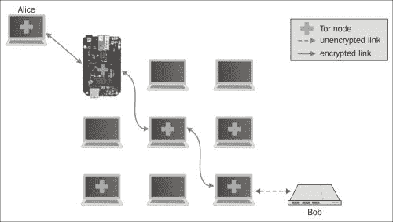
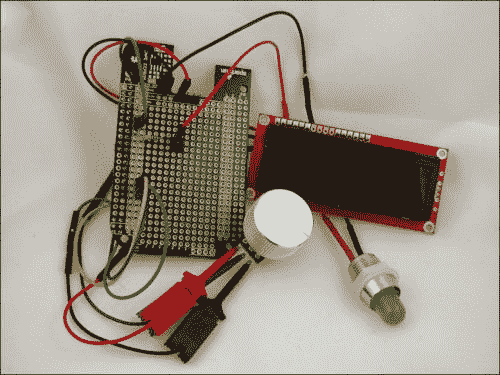
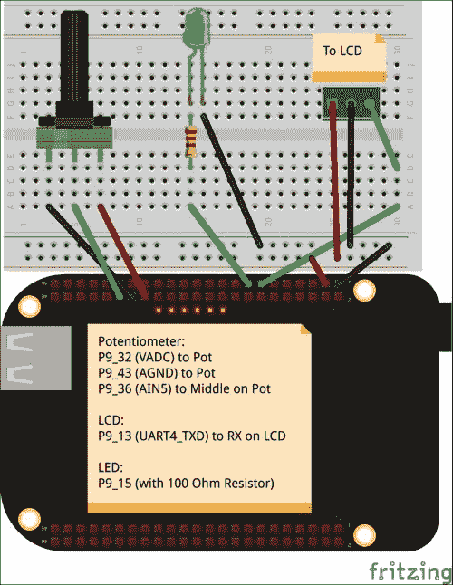
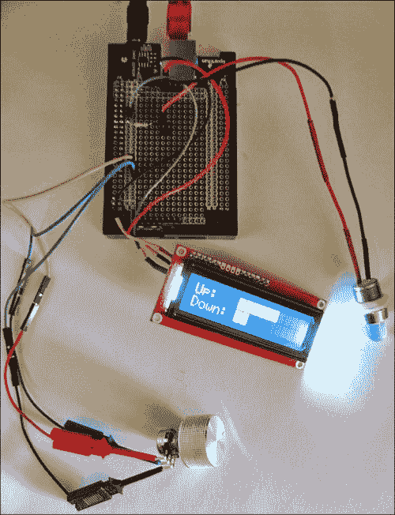
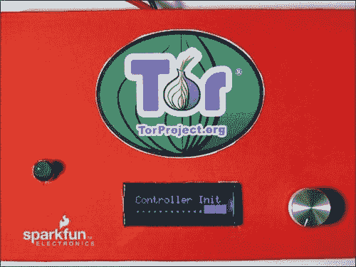

# 第二章：通过 Tor 桥接绕过审查

在本章中，你将配置你的**BeagleBone Black**（**BBB**）以在 Tor 网络中运行一个桥接。这个桥接将允许你和其他人更加匿名地访问互联网，并提供一个反审查的网关。我们将为 BBB 添加一个简单的硬件控制界面，以便我们实时查看和调整桥接的带宽使用情况。我们将这个项目命名为 BeagleBridge。

本章将讨论以下内容：

+   Tor 简介

+   Tor 中继与桥接的区别

+   混淆 Tor 代理

+   如何在 BBB 上下载和安装 Tor

+   如何配置 BBB 作为运行混淆代理的 Tor 桥接

+   如何向前面板添加硬件控制来调整桥接

# 了解 Tor

在本项目中，你将学习如何使用 Tor，这是一个旨在保护你在线匿名性的工具和网络。Tor 最初源自美国海军研究实验室资助的关于**洋葱路由**的研究（Dingledine, Mathewson, 和 Syverson，2004）。在洋葱路由中，客户端在一个覆盖网络中建立一个节点电路，覆盖网络是建立在现有网络之上的网络。Tor 网络是一个运行在互联网中的覆盖网络，尽管它也可以运行在单独的网络上。客户端将消息发送给每个节点，该消息是专门为该节点加密的，请求该节点将消息转发给电路中的下一个节点。每个节点解开一层加密并将结果转发给电路中的下一个跳点，因此有了**洋葱类比**。最后一个节点包含客户端的实际消息，并将其转发给目标服务器。

洋葱路由提供匿名性，因为目标服务器无法知道客户端的 IP 地址。通常，当你使用浏览器访问互联网时，浏览器会创建一个**传输控制协议**（**TCP**）连接，该连接从你的系统发起，并在你尝试访问的网站处终止。TCP 的地址由**互联网协议**（**IP**）提供。每个 IP 数据报包含源 IP 地址和目标 IP 地址。当数据报到达服务器时，服务器可以读取源 IP 地址。这通常是有用的，因为服务器需要这个地址来返回你的数据。然而，这也意味着服务器知道你的 IP 地址，即你在互联网上的位置。仅仅是你的 IP 地址就能透露你的一些信息，比如你所在的国家和你的**互联网服务提供商**（**ISP**）。通过 IP 地址进行地理定位可以准确到邮政编码级别，以美国为例。

### 注意

**Tor**，最初是**洋葱路由器**（**The Onion Router**）的缩写，现在简单地称为*Tor*，而不是*TOR*。当你在 Tor 邮件列表或 IRC 频道上提问时，Tor 开发者会很感激你注意到这一细微差别。

下图展示了这一路由过程。在这个例子中，Alice 是一个客户端，她连接到她电路中的第一个节点，这个节点恰好运行在你的 BBB 上。这个 BBB 解开一层并将 Alice 的通信转发到中间节点。中间节点也执行相同的操作，将信息转发到最终（出口）节点。出口节点将 Alice 的原始消息发送到名为 Bob 的目标服务器。从图中绿色箭头所示，表明 Tor 内部的连接是加密的。出口节点到 Bob 的连接则显示为未加密连接，因为这部分流量不属于 Tor 网络的一部分。从 Bob 的角度来看，这个连接的 IP 发起者是出口节点。然而，真正的发起者是 Alice，她的 IP 地址被 Tor 网络隐藏了。



许多个人对此信息的反应是：

> *"那又怎样？为什么我关心我访问的网站知道我的 IP 地址？"*

该网站现在知道了你请求的数据，并且还知道了你的位置信息。这些信息可能与其他公共信息结合使用，例如，进行**关联攻击**。关联攻击是通过将来自多个来源的信息结合起来进行的去匿名化尝试。例如，假设你在寻找有关某种罕见疾病的信息。你在一个论坛上以化名发布问题，询问相关信息。然而，该网站以及任何被动监控你连接的人（如果连接没有加密）都知道你的大致位置以及你提出的问题。你的疾病在七十多岁的西班牙裔女性中最为常见。通过将你的 IP 地址与疾病信息结合起来，可以进行关联攻击，可能使用公共人口普查数据来揭示你的身份。

Tor 通过加密你的流量并通过 Tor 网络进行传输，同时隐藏你的 IP 地址，从而防范此类攻击。对于远程网站来说，你的 IP 地址将是 Tor 网络中最后一个节点的 IP 地址，这个节点被称为出口中继。

## 欣赏 Tor 的各种用户

各种各样的人使用 Tor 进行日常的互联网访问。那些不希望 ISP 收集他们访问网站信息的人，可能是因为他们正在寻求敏感话题的信息，使用 Tor。政府代理人和军方也使用 Tor。毕竟，如果你连接的 IP 地址是`fbi.gov`，那么在网上卧底就很困难。像爱德华·斯诺登这样的举报人也使用 Tor 向媒体披露信息。当政府封锁互联网访问时，普通公民也会使用 Tor。例如，在 2014 年 3 月底，当土耳其政府试图封锁 Twitter 时，土耳其的 Tor 用户数量从约 25,000 人激增至不到 70,000 人，仅用了大约两周时间。

### 注释

Tor 通过各种交互式图表发布了关于谁在使用 Tor 以及他们来自哪里的大量指标。在[`metrics.torproject.org/users.html?graph=userstats-relay-country&start=2014-01-04&end=2014-04-04&country=tr&events=off#userstats-relay-country`](https://metrics.torproject.org/users.html?graph=userstats-relay-country&start=2014-01-04&end=2014-04-04&country=tr&events=off#userstats-relay-country) 上的图表中可以看到土耳其的用户激增。

## 了解 Tor 中继

**Tor 中继**是 Tor 网络中的单独节点。一个节点是运行 Tor 软件的计算机。 这些中继将消息在整个网络中传递。出口节点是电路中的最后一个节点，将客户端的消息发送到目标服务。Tor 的一个有趣之处在于，大多数节点都是由志愿者运行的。这些中继操作员自愿提供带宽、时间和能源费用，以增加 Tor 网络的容量。Tor 项目鼓励个人运行中继，以增加网络的多样性。该建议背后的动机是，藏身在一个人群中更容易——在一个只有一个人的人群中藏身是很困难的。

## 了解 Tor 桥接

2006 年，随着互联网审查的加强，Tor 项目增加了一个反审查功能，叫做桥接中继，简称为桥接（Dingledine, 2006）。桥接是一种特殊形式的中继——它不会出现在公共中继目录中。强大的互联网审查者能够通过几种方法阻止访问 Tor。其中一个有效的方法是查找所有公共中继，那时大约只有一千个左右，并拒绝访问那些 IP 地址。因此，桥接中继是通过不太公开的方式创建和分发的，以便用户能够访问 Tor 网络。如果客户端能够访问桥接（它已经连接到 Tor），那么客户端就可以访问互联网。在这种情况下，不太公开意味着一种不通过公共中继列表的分发机制。

## 使用混淆代理和可插拔传输

审查者仍然能够阻止访问 Tor；一种技术是识别由 Tor 生成的流量模式并阻止连接。在 2010 年，Tor 项目的 Jacob Appelbaum 和 Nick Mathewson 提出了一个方法，通过混淆客户端和桥接之间的 Tor 流量，以应对深度包检测。由于混淆机制可能需要变化，实际上也发生了变化，Tor 项目希望有一个通用协议，以允许不同的混淆代理运行。这种抽象被称为 **可插拔传输**。

在本章中，我们将设置您的 BBB 作为 Tor 桥接运行，运行一个混淆代理，使用 obfs3 可插拔传输。

## 意识到 Tor 的局限性

Tor 是目前保护匿名性最好的工具之一。然而，像本书中讨论的所有安全工具一样，它的保护也有局限性。首先，Tor 的威胁模型无法应对全球被动对手。这样的对手可以被动地监视整个互联网。如果对手能够监视整个互联网，那么他们就可以将进入 Tor 网络的流量与离开网络的流量进行关联，从而可能揭露 Tor 客户端的身份。这种设计的一个折衷是，Tor 是一个低延迟系统，这意味着你可以使用像 HTTP 这样的正常协议访问互联网，而不会遇到太多的延迟。这也是 Tor 网络中多样性重要的原因之一。如果所有的中继节点都在某个特定国家，那么这个国家可能会更容易监视流量。然而，尽管最近爱德华·斯诺登提供了泄露的信息，目前仍认为这样的对手很难监视整个互联网。

### 注意

Tor 项目的 Roger Dingledine 就 NSA 利用 Tor 漏洞做出如下评论：

*"好消息是，他们[NSA]利用了浏览器漏洞，这意味着没有迹象表明他们能够破解 Tor 协议或对 Tor 网络进行流量分析。感染笔记本、手机或桌面仍然是了解键盘背后人的最简单方法。"*

完整文本和更多评论可见于 Tor 网站（[`blog.torproject.org/blog/yes-we-know-about-guardian-article`](https://blog.torproject.org/blog/yes-we-know-about-guardian-article)）。

此外，Tor 并不会自动加密你所有的流量。如果你请求的是未加密的 HTTP 信息，那么你使用的 Tor 退出节点会将这些未加密的信息转发到目标地址。恶意的退出节点可能会监视或操控你的流量；因此，最好在 Tor 上使用加密的会话，如 HTTPS。Tor 并不会仅仅因为你运行了 Tor 就保护你所有的流量。应用程序通常需要配置以使用 Tor。即使你在家庭网络上设置了一个透明代理，并将所有流量通过该代理路由，浏览器中的恶意软件或漏洞也可能泄露你的身份。这就是为什么 Tor 项目建议你使用 Tor 浏览器的原因，Tor 浏览器本质上是 Mozilla Firefox 的一个分支版本，经过特别修补以避免泄露你的身份。最后，如果你选择揭示你的身份，Tor 就无法保护你的身份。如果你决定通过 Tor 登录 Facebook，你就等于告诉了 Facebook 你是谁，而且你正在使用 Tor，因为所有 Tor 退出节点都是公开的。

### 提示

使用 Tor 更安全的一个简单方法是仅从 Tails（[`tails.boum.org/`](https://tails.boum.org/)）使用它，Tails 是一个定制的 Linux 发行版，可以从各种媒体启动。Tails 是一套免费的软件，并包含多个已正确配置的工具，帮助保护你的隐私和匿名性。

## 运行 Tor 桥接的影响和好处

那么，为什么要在 BBB 上运行 Tor 桥接呢？Tor 的影响力和好处体现在网络中。Tor 服务器越多，网络中的资源就越丰富。许多发达国家的用户拥有比在互联网受限的国家更快的互联网连接速度，这种差距是数量级别的。桥接节点的流量通常会比中继节点少，因为桥接用户比正常的 Tor 用户少。桥接的性能瓶颈很可能是家庭网络的上传速度。如果你运行的是中继节点，这可能会成为限制因素，但作为桥接节点，你很可能是在帮助那些面临不稳定互联网环境的人，任何捐赠的带宽都是值得感激的。最后，在 BBB 上运行桥接的额外优势是对电费的影响较小，因为根据 BeagleBone Black 系统参考手册，BBB 加载网页时的功耗大约为 460mA。

# 在 BBB 上安装 Tor

以下章节提供的指令是针对在家庭网络上运行 BeagleBridge 的用户。桥接节点会消耗一些本来未使用的带宽，并将其捐赠给 Tor 网络。在运行服务器之前，你应该检查你的 ISP 的服务条款，确认是否允许运行此类服务。此外，你还需要配置家用路由器的端口转发。由于有各种各样的设备，每个设备都有不同的配置方式，你应该查阅路由器手册，了解如何启用端口转发。

## 从开发库安装 Tor

官方 Debian 仓库中的 Tor 镜像版本并不如 Tor 项目提供的版本更新。我们将使用 Tor 项目的开发仓库来获取最新的软件。这对于运行桥接节点特别重要，因为桥接节点和可插拔传输软件的更新频率较高。

### 注意

最新的指令以及最新的 GPG 指纹可以在 Tor 项目官网找到（[`www.torproject.org/docs/debian`](https://www.torproject.org/docs/debian)）。以下步骤解释了安装过程，但你应该与发布的官方指令进行对比。

编辑 `/etc/apt/sources.list`，添加以下内容：

```
deb http://deb.torproject.org/torproject.org wheezy main
deb http://deb.torproject.org/torproject.org tor-experimental-0.2.5.x-wheezy main

```

接下来，添加用于签名这些 Tor 软件包的 GPG 密钥：

```
gpg --keyserver keys.gnupg.net --recv 886DDD89
gpg --export A3C4F0F979CAA22CDBA8F512EE8CBC9E886DDD89 | sudo apt-key add -

```

然后，输入以下命令：

```
sudo apt-get update

```

Tor 项目建议你通过以下命令添加 GPG 密钥环：

```
sudo apt-get install deb.torproject.org-keyring

```

Tor 需要更新的时间，因为它会对证书进行时间有效性检查。在后续章节中，我们将向您展示如何使用专用的 **实时时钟**（**RTC**）保持时间。现在，您可以通过 **网络时间协议**（**NTP**）来更新您的时钟，方法如下：

```
sudo ntpdate -b -u pool.ntp.org

```

安装 Tor：

```
sudo apt-get install tor

```

然后，安装 `obfsproxy`。Obfsproxy 是实现混淆代理的软件，支持各种可插拔传输。Obfsproxy 使用 Python Twisted 库，这是一个事件驱动的网络引擎，总共会安装大约 17 MB 的软件包：

```
sudo apt-get install obfsproxy

```

在安装软件时，让我们安装 Stem Python 包。Stem 是一个用于 Tor 的 Python 控制库，我们稍后将使用它与我们的桥接进行交互。最简单的方法是通过 `pip` 安装：

```
sudo pip install stem

```

## 配置 Tor 以支持 BBB

在 Debian 系统中，Tor 的配置文件是 `/etc/tor/torrc`。在编辑 `/etc/tor/torrc` 之前，您应该先进行备份。此 `torrc` 文件可以在 [`github.com/jbdatko/beagle-bone-for-secret-agents/blob/master/ch2/torrc`](https://github.com/jbdatko/beagle-bone-for-secret-agents/blob/master/ch2/torrc) 下载。我们将在后续章节中讨论此配置文件的更多有趣方面。当你准备好时，将 `/etc/tor/torrc` 替换为以下内容：

```
# We are running a relay, no need for the SocksPort
SocksPort 0
# Extra logging is nice
Log notice file /var/log/tor/notices.log
# Run in the background
RunAsDaemon 1
# The following two lines are so we can connect with the
## Tor Stem library over the control port
ControlPort 9051
CookieAuthentication 1
# The is the Onion Router (OR) Port for normal relay operation
ORPort 9001
# Your bridge's nickname, change!
Nickname changeme
# Bandwidth settings
RelayBandwidthRate 520 KB # Throttle traffic to 520 KB/s
RelayBandwidthBurst 640 KB # But allow burts up to 640 KB/s
# You put a real email here, but consider making a new account
## or alias address
ContactInfo Random Person <nobody AT example dot com>
# Do not exit traffic
ExitPolicy reject *:* # no exits allowed
# Yes, we want to be a bridge
BridgeRelay 1
# Use the obfs3 pluggable transport
ServerTransportPlugin obfs3 exec /usr/bin/obfsproxy managed
# Enable extra bridge statistics collection
ExtORPort auto
# A nice option for embedded platforms to minimize writes
# to eMMC or SD card
AvoidDiskWrites 1
```

### 将联系信息添加到 torrc 文件

至少，您应该更改 `Nickname` 字段和 `ContactInfo`。`Nickname` 字段是对您的桥接节点的简短引用；不过，您的桥接指纹始终是最好的方法，因为它是唯一的。`ContactInfo` 字段允许 Tor 项目在您的桥接出现问题时向您发送电子邮件。如果您担心收到垃圾邮件，可以创建一个电子邮件别名。只需确保定期查看该账户，以便接收 Tor 项目偶尔发送的邮件。

### 调整桥接的带宽使用

Tor 的手册页将详细描述大多数这些设置，但其中一些设置需要额外的解释。带宽设置 `RelayBandwidthRate` 和 `RelayBandwidthBurst` 是可调的带宽设置，稍后我们将连接硬件控制来操作这些设置。速率和突发带宽单位是千字节每秒，而不是更常见的千位或 *兆位* 每秒，因此请注意单位。

# 理解 Tor 出口策略

桥接节点，按照定义，是 Tor 网络的入口点。因此，出口策略应允许流量从服务器退出 Tor 网络，应该如下设置：

```
ExitPolicy reject *:*

```

这可以防止您的服务器作为出口节点运行。如果您决定运行出口节点，请准备好收到来自您的 ISP 的一些投诉，尤其是当您在家庭网络上运行时。因此，Tor 项目和电子前沿基金会（EFF）建议您 *不要* 在家庭网络上运行出口中继。电子前沿基金会准备的详细法律常见问题解答可以在 [`www.torproject.org/eff/tor-legal-faq.html.en`](https://www.torproject.org/eff/tor-legal-faq.html.en) 找到。

# 设置桥接特定的配置

有三个与桥接相关的设置：`BridgeRelay`、`ServerTransportPlugin`和`ExtORPort`。`BridgeRelay`设置是关键设置，用来定义你的中继节点为桥接节点。你的桥接节点的元数据信息将发布到桥接数据库，而不是公共目录服务器，从而使桥接节点的 IP 地址比 Tor 中继节点的 IP 更不容易暴露。`ServerTransportPlugin`定义了你的桥接节点支持的可插拔传输代理。目前，ScrambleSuit 是最新的有前景的可插拔传输技术。然而，obfs3（在我们的桥接配置示例中启用的传输方式）略微成熟一些，是更保守的推荐方式。最后，`ExtORPort`允许 Tor 项目收集并报告桥接节点的统计数据。

### 注意

对于那些有兴趣运行 ScrambleSuit obfsproxy 的人，可以查看以下链接，了解如何配置桥接：[`lists.torproject.org/pipermail/torrelays/ 2014-February/003886.html`](https://lists.torproject.org/pipermail/torrelays/%202014-February/003886.html)。

# 启动你的新 Tor 桥接

随着时间的更新和配置的设置，现在是启动桥接的时候了。此时，桥接应该能够连接到 Tor 网络，但由于尚未从你的路由器配置端口转发，它无法接受传入连接。不过，`obfsproxy`端口是随机分配的，因此我们需要先启动桥接，才能找到该端口。使用以下命令重新启动 Tor 服务：

```
sudo service tor restart

```

接下来，让我们检查日志，看看 Tor 是否已正确启动：

```
tail -n 20 /var/log/tor/notices.log

```

如果你看到类似以下的内容，那么你的 Tor 客户端行为正常：

```
Mar 25 21:37:43.000 [notice] Tor has successfully opened a circuit. Looks like client functionality is working.
Mar 25 21:37:43.000 [notice] Bootstrapped 100%: Done.

```

# 启用端口转发

我们知道需要转发`9001`端口，因为它是 ORPort，但我们需要知道 obfsproxy 软件运行在哪个端口上。这将在同一个日志文件中记录，并可以通过以下命令搜索 Tor 日志来发现：

```
grep obfs3 /var/log/tor/notices.log

```

上述命令应该会返回以下搜索结果：

```
Mar 05 01:56:04.000 [notice] Registered server transport 'obfs3' at '0.0.0.0:59519'

```

我们的 obfs3 服务的`obfsproxy`端口是`59519`。从你的家庭路由器配置端口转发，从`9001`端口进行转发，同时从外部 IP 向 BBB 转发`59519`端口。如果给你的 BBB 分配一个静态内部 IP，也会有所帮助。请查阅路由器手册以获取详细指导。或者，你也可以在`/etc/tor/torrc`文件中使用以下行来指定端口：

```
ServerTransportListenAddr obfs3 0.0.0.0:xxxx
```

用所需的端口地址替换 x。不过，最好让 obfsproxy 随机选择一个地址；否则，Tor 项目可能会在某些端口上运行桥接节点过多，这样更容易阻止对桥接节点的访问。

一旦你转发了所需的端口，重新启动路由器。你应该能看到以下信息，表示成功：

```
Mar 25 21:37:43.000 [notice] Now checking whether ORPort xxx.xxx.xxx.xxx:9001 is reachable... (this may take up to 20 minutes -- look for log messages indicating success)
Mar 25 21:37:44.000 [notice] Self-testing indicates your ORPort is reachable from the outside. Excellent. Publishing server descriptor.

```

恭喜！你现在正在 BBB 上运行 Tor 桥接器，并且正在帮助改善互联网自由。你还在为代理，无论是秘密代理还是其他代理，提供访问未过滤互联网的能力。

# 向桥接器添加物理接口

现在你已经成功运行了一个 Tor 桥接器，你可以在这里停下来。如果你停下来了，你就错过了将软件与定制硬件结合使用的机会。我们的 BBB Tor 桥接器目前没有视觉反馈，所以并不明显它是否在工作。此外，控制桥接器的唯一方式是通过 SSH 登录到 BBB 并操作配置选项。Tor 桥接器是一个设备，它需要设备控制。在这一部分，我们将添加一个前面板，它将为我们提供一个简单的方法来控制桥接器的带宽，并快速指示软件是否崩溃。在接下来的部分，我们将添加软件来与桥接器进行交互并控制硬件。

### 注意

如果你决定运行 Tor 中继器，有一些网站可以生成带宽图并显示有关你中继器的其他信息，比如 Tor atlas ([`atlas.torproject.org/`](https://atlas.torproject.org/))。另一个也能显示桥接器信息的工具是 Globe ([`globe.torproject.org/`](https://globe.torproject.org/))。

## 收集前面板组件

由于这是我们的第一个项目，我们将使用一些基本组件：**发光二极管**（**LED**）、旋转电位器和**液晶显示器**（**LCD**），它们都显示在下面的电路图中：



LCD 显示器可能有点棘手，但 SparkFun Electronics 将一个 16x2 的 LCD 与微控制器结合起来，使其可以使用串行接口，而不是更复杂的并行接口。串行接口更简单，因为它只需要一条数据线连接到设备，而并行接口则需要更多的连接线。

## 使用 LCD 显示状态信息

我们的 Tor 桥接器会生成大量元数据，例如带宽使用情况、连接数量以及一些 Tor 特有的统计信息。对于家庭网络来说，了解桥接器使用的带宽量非常有用，而且最好能够在不每次都登录 BBB 的情况下获取这些信息。在串行 LCD 显示器中，我们将绘制带宽使用的图形表示。我们将使用十个条形图，每个条形图代表可用带宽的十分之一。如果你看到五个条形图，那么桥接器正在使用一半的可用带宽。此项目选用的 LCD 是 LCD-09067（SparkFun Electronics）。

### 注意

SparkFun 电子公司是一个国际分销商，位于美国科罗拉多州博尔德，负责发货。本书推荐的一些常见组件，如果你想节省运费，可以用当地电子商店的等效组件替代。你无需逐个输入每个组件，它们都已列在一个汇总的*愿望清单*中，地址是 [`www.sparkfun.com/wish_lists/93119`](https://www.sparkfun.com/wish_lists/93119)。

## 使用电位器控制带宽

电位器就像是一个可变电阻。如果你曾调整过收音机或扬声器的音量旋钮，你大概使用过电位器。通过调整旋钮，你可以调整电位器中的电阻，从而改变输出端感应到的电压。电位器有三个引脚：一个用于电压输入，一个用于接地，最后一个是输出。

这个旋钮连接到 BeagleBridge，将控制分配给 Tor 的带宽。当旋钮调到最大时，桥接器将报告所有带宽都可用来路由流量到 Tor 网络。当旋钮调到中间位置时，桥接器将报告一半的带宽可用。如果你注意到桥接器消耗的带宽超过你想要的量（LCD 显示出来的），你可以调低桥接器的*音量*。这个项目的电位器和旋钮分别是 COM-09939 和 COM-10001（SparkFun 电子公司）。

你的桥接器不会立刻吸引到用户；这需要一些时间。开始时将桥接器设置为最大带宽；如果你发现它消耗的带宽超过了你的需求，可以将其调低。为了得到 Tor 桥接器是否正常工作的指示，我们将使用一个由 BBB 的 GPIO 控制的 LED，它会定期闪烁。这样你就可以查看面板，判断软件是否仍在运行。SparkFun 的 LED 是 COM-10633，LED 支架是 COM-11148。

## 设计 BeagleBridge 电路

以下是本项目的 Fritzing 电路图。



电位器通过 BBB 的**模拟到数字转换器**（**ADC**）引脚连接。BBB 的模拟输入只能承受最高 1.8V，因此非常重要的是使用专用的模拟电压引脚，即 P9_32 引脚（P9 接口的第 32 引脚），它提供这个电压。*不要*将电位器连接到普通的 3.3V 或 5V 电源轨，因为这样会损坏处理器。我们将随意选择 P9_36 上的模拟输入 AIN5 作为输入引脚，并将其连接到电位器的中间引脚或输出端。最后，将电位器的最后一个引脚连接到专用的模拟地引脚 P9_34。

LED 和 LCD 都使用 3.3V 电压和共地。LCD 需要一个串行传输引脚，所以我们将随意选择 P9_13，它是 UART4 的传输引脚。P9_24 上的 UART1 传输或者 P9_21 上的 UART2 传输也都能正常工作。

最后，我们需要一个 GPIO 来控制 LED。同样，任何 GPIO 都可以，但我选择了 P9_15 插针。你需要一个电阻来限制 LED 的电流。根据欧姆定律计算电阻的大小非常简单；我们只需要知道 LED 的正向电压降和最大电流。这个信息可以在数据手册中找到。如果你使用的是 SparkFun 的 5mm 绿色 LED，它的最大电流为 20mA，正向电压降为 2.2V。

欧姆定律指出，电压等于电流与电阻的乘积，或者*V = IR*。从我们的电源电压 3.3V 中减去 2.2V，再将结果除以 0.020 安培，得到 55 欧姆。55 欧姆不是标准值，但 56 欧姆是，所以你可以使用这个值。但是，你始终可以使用更高的电阻值，LED 的亮度将会降低。这个项目中使用的电阻值为 100 欧姆。

## 使用原型板连接硬件

在布线这个项目时有一些特殊的考虑，因为它是为了放入一个外壳中并提供前面板。与实心线相比，绞线具有更好的弯曲和柔韧性。外壳一旦安装好，我们不期望电线会承受拉力或移动，但当你尝试将面板安装到外壳时，它们肯定会移动！我们也有几种方法将我们的项目连接到 BBB。我们可以使用带公头插针的跳线插入母头扩展插针，但这些插针很容易脱落，尤其是在你把项目放入外壳时。

我们将使用 SparkFun 的 BeagleBone Black 原型板 DEV-12774，轻松地将电路与 BBB 结合。该板将电源、接地和其他插针信号引出，以便扩展。它包括一个 EEPROM，这不仅对想要在板上存储持久数据的人有用，而且如果你要构建一个 BeagleBone Cape，它也是必需的，后者将在下一章详细讨论。原型板的优势，特别是 Beagle 原型帽的优势在于，我们可以在板上焊接公头插针，然后使用母头接线，这种方式连接会更牢固。此外，通过使用公头插针，我们可以轻松地将原型板重复用于后续项目。然而，这些原型板并不是必须的，如果你想省钱，通过一些创意布线，你也可以不使用它。

如果你使用的是原型板方法，你不必填充所有的插针。只有我们需要的公头插针被焊接到原型板 P9 插针上的相应焊盘。原型板的工作原理是每个插针旁边都会有一个相同的焊盘。将 100 欧姆电阻从 P9_15 焊接到板中间一个公头插针的底部。然后，将一根电线从公头插针连接到 LED 的正极。

完成后，您的项目应该看起来像下面的电路图。我们还没有运行控制软件，但您可以看到 LCD 显示了带宽使用情况。下图为了方便测试，未将电位器焊接连接，而是使用了 *IC Hooks*。在最终安装中，您将需要焊接线缆，以确保更好的机械和电气连接。



## 使用 Python 库开发软件

该项目的软件可以免费下载，网址为 [`github.com/jbdatko/beagle-bone-for-secret-agents/`](https://github.com/jbdatko/beagle-bone-for-secret-agents/)。在本节中，我们将突出显示使用现有库的细节，并概述项目的架构。由于有多个并发活动：Tor 桥接、带宽旋钮、LCD 写入和 LED 闪烁，代码使用了这些库中的许多异步回调。为了与桥接进行交互，我们将使用 Tor 的 `Stem` 库 ([`stem.torproject.org/`](https://stem.torproject.org/))，而为了与硬件进行交互，我们将使用 Adafruit 的 BeagleBone Python 库 ([`github.com/adafruit/adafruit-beaglebone-io-python`](https://github.com/adafruit/adafruit-beaglebone-io-python))。

## 使用 pyBBIO 控制硬件

我们在安装 Tor 时已经安装了 `Stem` 库；因此，现在我们需要通过执行以下命令来安装 `Adafruit` 的 BBIO 库：

```
sudo apt-get install build-essential python-dev python-setuptools python-pip python-smbus -y
sudo pip install Adafruit_BBIO
sudo pip install pyserial

```

`Adafruit` 库方便地启用了设备树覆盖文件，这些文件在运行时将 BBB 的硬件配置描述给内核。因此，您无需通过 `sysfs` 操作配置，因为一切都在 Python 库中处理。代码将每个硬件组件建模为其自己的 Python 类。由 `TorFreedomLED` 类建模的 LED 是最简单的。我们需要让 LED 闪烁；这是通过切换输出为高电平、让执行线程稍作休眠，然后再切换输出为低电平来关闭 LED 实现的。为了设置 GPIO，我们只需调用 `GPIO.setup`，并传入引脚和方向：

```
import Adafruit_BBIO.GPIO as GPIO
class TorFreedomLED(object):
  def __init__(self):
    self.pin = 'P9_15'
    GPIO.setup(self.pin, GPIO.OUT)

  def on(self):
    GPIO.output(self.pin, GPIO.HIGH)

  def off(self):
    GPIO.output(self.pin, GPIO.LOW)

  def blink(self):
    self.on()
    sleep(.5)
    self.off()
```

由 `FrontPanelDisplay` 类控制的 LCD 写入 BBB 的 UART 4 上的串口 `/dev/ttyO4`，波特率为 9600。LCD 仅接收信息；因此，我们只使用 BBB 的传输线。命令被写入附加的微控制器，后者驱动显示器。数据手册可在 SparkFun 网站上找到，描述了所有命令。一般而言，过程是先在显示器上移动虚拟光标，然后发送文本。

### 注意

SparkFun 在[`www.sparkfun.com/tutorials/246`](https://www.sparkfun.com/tutorials/246)提供了一个更完整的串行 LCD 快速入门指南。示例代码是针对 Arduino 的，但如果你参考本章中的桥接 LCD 示例，将其移植到 Python 是非常直接的。

类似于 GPIO 示例，`Adafruit` 库中的串行端口可以按如下方式使用：

```
import Adafruit_BBIO.UART as UART
import serial
class FrontPanelDisplay(object):

  def __init__(self):
    self.uart = 'UART4'
    UART.setup(self.uart)
 self.port = serial.Serial(port="/dev/ttyO4", baudrate=9600)
    self.port.open()
```

如果你尝试显示的文本超过了 16 个字符，显示屏会自动换行。因此，你需要管理 LCD，以确保它正确显示。例如，让我们来看一下负责生成带宽图的 `display_graph` 方法：

```
self.clear_screen()
up_str = '{0:<16}'.format('Up:   ' + self.block_char * up)
dn_str = '{0:<16}'.format('Down: ' + self.block_char * down)

self.port.write(up_str)
self.port.write(dn_str)
```

第一行清除屏幕并将光标重置到 16x2 显示屏的左上角。接下来，我们格式化两行文本，使用 LCD 上的特殊块字符来显示图形。这一行是左对齐的，并且用空白填充，直到达到 16 个字符。最后，使用串行 `write` 方法将行写入 LCD。因为写入第一行后，光标会自动跳到第二行，所以不需要在每行之间重置光标。

最后，带宽调节旋钮在 `BandwidthKnob` 类中建模。此类使用 `ADC` 模块，并作为线程实现。模拟输入每次读取时都会产生一个值，我们将这个值与桥接器的可用带宽做比率。`Adafruit` 库将值归一化到 `0.0` 到 `1.0` 之间；因此，当旋钮处于中点时，调用 `ADC.read(pin)` 应返回 `0.5`。模拟信号中会有一些抖动，而我们不需要对带宽进行精确的分辨率调整。每秒采样一次应该就足够了，因为我们预计旋钮不会频繁变化。我们会四舍五入到下一个整数，这样旋钮就会有十个离散的设置。`run` 方法会通过消息队列向调用者报告 *音量* 设置是否发生了变化。然后，调用线程可以相应地更新 Tor 桥接带宽限制。

这段代码示例向你展示了如何在 BBB 上使用 `Adafruit` 库设置 ADC，以及如何通过消息队列将结果传递给一个等待的线程：

```
import Adafruit_BBIO.ADC as ADC
import threading
from time import sleep
from math import ceil, floor
import Queue
class BandwidthKnob(threading.Thread):

  def __init__(self, pin, *args, **kwargs):

    threading.Thread.__init__(self, *args, **kwargs)
    self.pin = pin
    self.setup_adc()
    self.kill = False
    self.prev_value = -1
    self.q = Queue.Queue()

  def setup_adc(self):
    'Load the Adafruit device tree fragment for ADC pins'
 ADC.setup()

  def read_value(self):
    return ceil(10 * ADC.read(self.pin))

  def stop(self):
    self.kill = True

  def run(self):
    knob = self.prev_value

    while knob != 0 and not self.kill:
      sleep(1)
      knob = self.read_value()
      if knob != self.prev_value:
 self.q.put(knob)
        self.prev_value = knob
```

# 使用 speedtest-cli 确定你的带宽

为了调整带宽速率，我们首先需要知道我们的桥接器拥有多少带宽。幸运的是，有一个很方便的脚本可以从命令行运行速度测试，它被称为 `speedtest-cli`。你可以使用以下命令安装它：

```
sudo pip install git+https://github.com/sivel/speedtest-cli.git

```

使用以下命令运行测试：

```
speedtest-cli --simple > speedtest.txt

```

如果你检查输出文件，你应该会看到如下内容：

```
Ping: 107.686 ms
Download: 28.23 Mbit/s
Upload: 5.37 Mbit/s

```

我们将使用该文件中的结果作为我们带宽调整的基础。目前，我们只需要记住它的位置以备后用。

# 使用 Stem 库控制桥接器

桥接使用 `Stem` 库进行控制，该库通过 Tor 控制协议与 Tor 进程进行通信。设置由 `BeagleBridge` 类管理。在与 Tor 进程建立连接后，此类注册两个事件监听器，用于监听 `Bandwidth` 和 `Configuration` 变更事件。带宽事件每秒触发一次，并通过 `print_bw` 回调报告上秒使用的字节数。此信息用于绘制带宽图表。以下回调函数显示了回调与 LCD 的交互：

```
def make_bw_callback(test,lcd):
  '''Returns a callback function for the bandwidth event'''
  def print_bw(event):
    '''Obtains the bandwidth used from the last second from the
       bridge, normalizes it to the total bandwidth, and draw 
       that information to the display'''
    up = int(test.get_up_ratio(event.written))
    down = int(test.get_down_ratio(event.read))
    lcd.display_graph(up, down)

  return print_bw
```

### 注意

对于那些希望深入了解 `Stem` 库和 Tor 控制协议的用户，`Stem` 库提供了详细的在线文档和示例（[`stem.torproject.org/tutorials.html`](https://stem.torproject.org/tutorials.html)）。对于想要更深入了解控制协议的用户，可以参考[`gitweb.torproject.org/torspec.git?a=blob_plain;hb=HEAD;f=control-spec.txt`](https://gitweb.torproject.org/torspec.git?a=blob_plain;hb=HEAD;f=control-spec.txt)。

`Configuration Changed` 事件是一个回调，用于通知进程桥接的配置已被更改。这发生在带宽旋钮被调整时，从而触发 `update_rate` 方法，该方法向桥接发送更新配置的命令。最终结果是，通过调整旋钮，您直接影响桥接的带宽限制。当回调发生时，它将在 LCD 上显示新的带宽速率，以便您知道您的限制已发生变化。此回调如下所示：

```
def make_conf_callback(lcd):
  '''Returns a callback function for the configuration changed
     event'''
  def conf_changed(event):
    '''Reads the new bandwidth rates from the bridge and draws
       that information to the display'''
    rate = str(int(event.config['RelayBandwidthRate']) / 1024)
    burst = str(int(event.config['RelayBandwidthBurst']) / 1024)
    lcd.display_rates(rate, burst)

  return conf_changed
```

Python 脚本的主要部分执行类的实例化，同时向 LCD 显示一次性启动画面。它会显示桥接传输的总字节数、已建立的电路数，以及桥接指纹的最后 24 个字节。只要带宽旋钮的值不为零，桥接控制器将永远运行。当您将旋钮调到零时，程序将退出，LCD 将显示块状图案。

最后，要运行桥接控制器，请执行以下命令，第一个参数是速度测试结果的所在位置：

```
sudo python beaglebridge.py ~/speedtest.txt &

```

为了避免以 root 身份运行，您需要操作用户组和权限。Tor 进程以 `debian-tor` 用户身份运行，而 `Adafruit` 库（为您启用设备树覆盖）需要在具有启用这些功能权限的用户级别运行。您可以创建一个自定义组，并将一个用户加入到 `debian-tor` 组中，然后赋予该组修改设备树文件的权限，以避免以 root 身份运行。

# 连接到您的混淆桥接

使用 BeagleBridge，你拥有自己的 Tor 网络入口点。你可以下载并安装 Tor 浏览器，并配置它使用你的桥接。这在你处于受限或不友好的网络中时非常有用，可以更匿名地访问互联网。然而，如果你使用 *你的* BeagleBridge，旁路攻击者可能会通过你连接的 IP 地址发现你的家庭网络。虽然流量是经过混淆的，但随着时间推移可能会显得可疑。最好使用通过 Tor 获取的随机桥接地址。即使你没有直接连接到自己的桥接，你的桥接仍然在为 Tor 网络提供资源，帮助大家访问一个没有审查的互联网。要连接到你的桥接，启动 Tor 浏览器并在启动时点击 **打开设置**。然后，回答关于你的连接是否被审查的问题时选择 `是`。选择 **输入自定义桥接**，然后按如下方式输入你的桥接地址，但请将 x 替换为你的 IP 地址和桥接的端口号：

`bridge obfs3 XXX.XXX.XXX.XXX:59519`

# 继续进行与 Tor 相关的项目

这个项目只是学习 Tor 的第一步。如果你想通过 BBB 路由更多的流量，你可以将桥接更换为公共中继。中继接收更多流量，但也更加公开。你的 IP 地址将被列为公共桥接，并且即使你正在运行非出口中继，一些网站也可能拒绝为你提供内容。

你也可以在 BeagleBone 上运行 Tor **隐藏服务**。使用 Tor 客户端有助于将你的 IP 地址匿名化，从而保护客户端的隐私，但 Tor 隐藏服务可以隐藏服务器的 IP 地址，避免客户端获知。如果你有一个仅希望通过 Tor 访问的服务，这将是一个非常有趣的 BeagleBone 项目。

在硬件方面，考虑将 BeagleBone 和前面板放入一个专用的外壳中。看看你附近是否有黑客空间，他们可能能帮你制作一个漂亮的激光切割外壳！如果你没有激光切割机，也可以使用像下面截图中那样的 SparkFun Electronics 盒子：



### 注意

洋葱标志是 Tor 项目的注册商标，经许可使用。本章中描述的 BeagleBridge 项目与 Tor 项目无关。

# 摘要

本章中，你了解了 Tor 以及如何通过在 BBB 上运行 Tor 桥接来绕过互联网审查。我们还展示了如何为 BBB 添加一些基本的硬件控制，以便创建前面板接口。最后，通过一些 Python 代码，我们成功地将硬件控制和 Tor 桥接结合起来。

在下一章中，我们将更深入地了解 BBB 可用的专用加密硬件，并展示如何使用这些设备。
