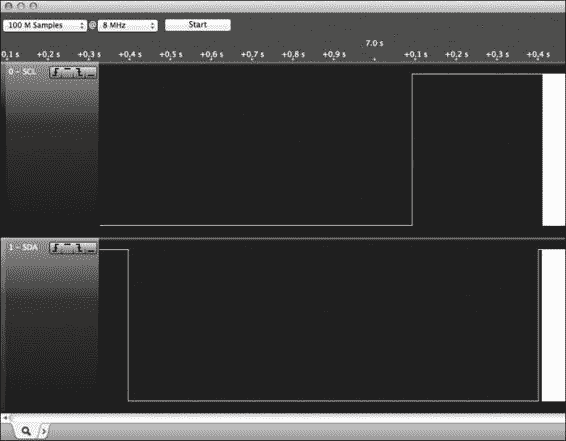

# 第三章. 使用 CryptoCape 添加硬件安全

本章继续我们的定制安全硬件之旅，使用**BeagleBone Black（BBB）cape**。在 BeagleBone 术语中，**cape**是一个附加到 BBB 的子板。我们将简要介绍硬件加密设备，然后探索 CryptoCape，这是一个包含众多安全特性的 BBB cape。我们将描述如何以 CryptoCape 为例创建自己的 cape。本章介绍了 cape 上的加密芯片，并展示了如何使用 CryptoCape 和指纹扫描仪实现生物识别认证设备。

本章将讨论以下主题：

+   基于硬件的加密技术的利与弊

+   CryptoCape 概述

+   如何通过 Cape EEPROM 实现 BBB 的自动硬件配置

+   如何使用 CryptoCape 的实时钟表

+   如何从 BBB 编程 ATmega328p

+   如何实现生物识别认证系统

# 探索硬件加密和软件加密的差异

在接下来的章节中，我们将讨论使用基于硬件的加密技术的优缺点。本书中的其余项目将使用嵌入式硬件加密设备，因此了解它们的功能和局限性非常重要。有关加密技术和本节中使用的术语的更多资源，请参考第一章，*创建您的 BeagleBone Black 开发环境*。

## 了解基于硬件的加密技术的优势

关于硬件加密的优点，我们将重点讨论嵌入式环境，因为这正是 BBB 的目标使用场景。虽然芯片制造商可能提供一长串优点，但主要有两个类别：加密加速和密钥隔离功能。

### 将计算任务卸载到独立的处理器上

使用专用加密协处理器的一个优势是可以卸载计算任务，从而减少 CPU 使用率。一个典型的例子是使用硬件执行**高级加密标准**（**AES**）的加密和解密操作，在**传输层安全协议**（**TLS**）会话中进行。

TLS 通常与**超文本传输安全协议**（**HTTPS**）一起使用。每次在线购物时，您都会使用 HTTPS 来保护您的信用卡信息。根据您的浏览器设置，您可能会注意到锁形图标或绿色条，以指示网页是否通过 HTTPS 传输。在 TLS 会话中，客户端（即您的浏览器）和服务器将协商使用相同的对称密钥。虽然可以协商多种对称加密算法，但 AES 是其中一个常用的选择。

### 注释

尽管一些网站会自动将你重定向到 HTTPS 版本的站点，但通常你必须手动指定。记得输入`https://`往往让人感到麻烦，但幸运的是，有一个跨浏览器插件可以自动将你重定向到 HTTPS 站点（如果有的话）。这个插件叫做**HTTPS Everywhere**，由电子前沿基金会（Electronic Frontier Foundation）维护。有关信息和软件下载链接请访问：[`www.eff.org/https-everywhere`](https://www.eff.org/https-everywhere)。

在加密加速器角色中，一个加密协处理器会执行每个 TLS 记录的加密和解密。这将主 CPU 的负担转移到处理网络流量和执行预定应用程序上。BBB 实际上具有这样一个加密协处理器。**德州仪器**（**TI**）为 AM335x 处理器提供的加密性能页面显示了他们使用 OpenSSL 进行基准测试的结果。使用 256 位密钥大小的 AES，并对 8192 字节的块进行操作，未使用加密加速时，测得的数据吞吐量为 8129.19 kB/sec。此测试导致 CPU 使用率为 69%。然而，使用 AM335x 上的加密协处理器时，测得的数据吞吐量为 24376.66 kB/sec，CPU 使用率降至 41%。这几乎是吞吐量性能的 200%的提升，同时 CPU 使用率下降了 40%！

### 注意

更多关于 AM335x 上加密加速器的信息可以在 TI 的加密性能页面找到：[`processors.wiki.ti.com/index.php/AM335x_Crypto_Performance`](http://processors.wiki.ti.com/index.php/AM335x_Crypto_Performance)。

如果你的嵌入式应用程序的目的是执行计算密集型的计算，使用一个旨在卸载加密处理的加密协处理器，可以将 CPU 周期节省给你的主程序。

### 通过物理隔离保护密钥

使用硬件加密设备的一个主要优势是，密钥可以在设备内部生成，并且设计上难以被移除。在 Web 服务器的世界中，这些设备被称为**硬件安全模块**（**HSMs**）。在 2014 年 4 月，宣布了一个影响 OpenSSL 软件的重大漏洞，通俗地称为**Heartbleed**。这个漏洞本身并不是加密漏洞*本身*，而是由于一种叫做**缓冲区溢出**的编程错误造成的。不幸的是，这种漏洞在 C 语言中比较常见，而 OpenSSL 正是用 C 语言编写的，因为 C 语言没有自动的数组边界检查。攻击者可以利用这个错误，查看服务器的内部内存，可能会发现敏感信息。修复这个问题的代码比这个段落还要短。

### 注意

以下`xkcd`漫画简明且有趣地解释了 Heartbleed 漏洞：

[`xkcd.com/1354/`](https://xkcd.com/1354/)

这个漏洞的规模和严重性是无法过分强调的。最具破坏性的攻击是如果服务器的私钥被泄露。知道私钥后，攻击者可以冒充服务器，客户端可能会不知不觉地向伪造者披露私人信息。然而，在配备硬件安全模块（HSM）的服务器上，心脏出血漏洞的影响则更为有限。像会话 cookie 这样的敏感信息依然可能通过软件漏洞泄露，但服务器的私钥由于保存在 HSM 中，则不会泄露。

由于硬件加密协处理器作为一个物理上独立的机器运行，软件漏洞很难通过主处理器泄露硬件模块中的秘密。在嵌入式世界中，有几种芯片执行了这种密钥隔离功能。

## 了解硬件加密设备的缺点

添加硬件加密设备并不自动让你的项目变得*安全*。在接下来的章节中，我们将讨论使用加密硬件的一些缺点以及在项目中使用它们时需要解决的一些问题。

### 缺乏加密灵活性

硬件加密设备通常不可配置。通常这是设计使然，但其含义是很难（如果不是不可能的话）改变设备的加密行为。如果你选择了一款采用有限密钥大小进行加密的芯片，你将无法以后将设备升级为更强的密钥大小。相较而言，更新基于软件的加密系统通常更容易。

### 暴露硬件特定的攻击向量

虽然独立的加密处理器可能减少软件攻击或漏洞，但它往往允许更复杂的基于硬件的攻击。硬件攻击分为三类：非侵入性、侵入性和半侵入性（Skoroboga，2011）。非侵入性攻击将芯片视为黑箱，并试图操控周围的环境以进行攻击。成功的非侵入性攻击包括执行**差分功率分析**（**DPA**），以监控芯片在执行加密算法时的行为。通过测量加密操作中的功率使用情况，可以通过不同的功率特征看到密钥。侵入性攻击通常涉及以某种方式物理破坏芯片，以访问其内部。半侵入性攻击可能涉及某种激光成像技术来观察或干扰芯片。

### 注意

要执行故障攻击，攻击者尝试通过注入故障来操控执行指令（Bar-El，2004）。安全研究员 Colin O'Flynn 提供了一个简洁明了的示例，展示了故障攻击如何导致密码验证微处理器失败：[`www.youtube.com/watch?v=Ruphw9-8JWE&list=UUqc9MJwX_R1pQC6A353JmJg`](https://www.youtube.com/watch?v=Ruphw9-8JWE&list=UUqc9MJwX_R1pQC6A353JmJg)。

### 混淆实现细节

需要考虑的一个最终因素是，尽管芯片供应商可能会发布其设备的接口，内部细节通常是专有的。这类似于软件供应商发布软件编程接口，但仅提供已编译的二进制文件，而不提供源代码。在这种情况下，芯片被视为黑盒子，且没有验证设备的机制，你只能信任它正确运行。随着开源社区将加密库移植到独特的微控制器上，这种情况希望能够得到改善。

## 总结硬件与软件的争论

那么，哪个选择更好呢？像大多数复杂的技术一样，正确的答案是：*这取决于具体情况*。对于一个真正嵌入式系统，即使是几个字节也不能浪费，如果你不能升级你的微处理器，那么硬件安全芯片可能是唯一的选择。另外，如果由于软件漏洞导致密钥泄露的风险较高，那么独立的加密协处理器可能会有所帮助。然而，如果攻击者能够物理接触你的设备，他们可能会通过硬件攻击提取密钥。最后，如果你非常注重透明度，想要验证是否存在后门，那么只有完全开源的软件和硬件设备才能满足你的需求。

# 游览 CryptoCape

CryptoCape 是 BeagleBone 的首个专用安全子板。由于 BBB 已经具备了加密加速功能，CryptoCape 上的芯片提供了上一节讨论的*密钥隔离*特性。在 BeagleBone 社区中，子板被称为 *capes*，类似于 Arduino 的 *shields*。CryptoCape 包含了几个可以在项目中使用的加密 IC。其设计为开源硬件，因此你也可以访问 SparkFun 网站来获取设计文件。CryptoCape 包含以下主要组件：

| 组件 | 制造商 | 特性 |
| --- | --- | --- |
| AT97SC3205T | Atmel | TPM—RSA 2048 加密和 SHA1 哈希 |
| ATAES132 | Atmel | 带有 AES-128-CCM 的加密 EEPROM |
| ATSHA204 | Atmel | SHA-2 哈希（SHA-256，HMAC-256） |
| ATECC108 | Atmel | 使用 NIST 曲线的 ECDSA |
| ATmega328p | Atmel | 微控制器 |
| DS3231M | Maxim 集成 | 带电池的实时时钟 |
| CAT24C256 | ON 半导体 | EEPROM |

如果你把 BBB 的以太网连接器想象成脖子，那么附加的子板的切口就像围绕着它一样，仿佛它穿着一件披风，因此得名“CryptoCape”。另外，[BeagleBoard.org](http://BeagleBoard.org) 的比格犬吉祥物 Boris，穿上披风后看起来更加可爱。

这些芯片及其相关电路在 CryptoCape 板上都有清晰的标记：


在接下来的章节中，我们将简要介绍每个组件，并提供一些示例项目想法。

# 探索 I2C 协议

CryptoCape 上的每个芯片都使用 **集成电路互联** (**I2C**) 总线。I2C 是由飞利浦半导体公司在 20 多年前开发的，但它今天仍在电子设计中广泛应用。I2C 需要两条信号线，一条用于 **串行时钟** (**SCL**)，另一条用于 **串行数据** (**SDA**)。连接到总线的设备可以是主设备或从设备。每个从设备都有一个地址，且可以有多个主设备。I2C 协议支持碰撞检测，并且是真正的多主协议。

SDA 和 SCL 线被 *上拉* 到系统电压 VCC，通常通过连接从 VCC 到 SDA 和 VCC 到 SCL 的电阻来实现。BBB 上的处理器 AM335x 包含总线的内部上拉电阻。数据通过操控 SDA 和 SCL 线的逻辑电平来编码到总线上。例如，开始发送数据时，主设备将 SDA 拉低，同时将 SCL 保持在逻辑高电平。停止条件是通过将 SDA 从低电平拉到高电平，同时保持 SCL 高电平来发送。

### 注意

I2C 总线规范的第六版可以在 NXP 半导体（前身为飞利浦）的网站上找到，网址为 [`www.nxp.com/documents/user_manual/UM10204.pdf`](http://www.nxp.com/documents/user_manual/UM10204.pdf)。

以下截图展示了逻辑分析仪捕获的正常 I2C 操作。**逻辑分析仪** 是一种可以采样电气连接并且常常解码信号以生成人类可读格式的仪器。


# 理解扩展板 EEPROM 的好处

一眼看去，CAT24C256 **电可擦可编程只读存储器** (**EEPROM**) 似乎并没有为主板带来太多的价值。毕竟，BeagleBone 在早期版本上配备了 2GB eMMC，在 C 版本中配备了 4GB eMMC。额外的 256 kB 内存对比格尔狗来说几乎不值一提。然而，它却有着更重要的作用；它使得 BBB 能够自动检测扩展板。

BBB 配备了两个 46 针女性扩展端口，提供比市场上任何其他爱好者开发板更强大的 I/O 能力。某些引脚实际上可以支持八种不同的模式，从模式 0 到模式 7。引脚功能与模式的映射被称为 **引脚复用**，即引脚多路复用。为了在某个模式下使用引脚，软件必须通过内核接口启用并配置该引脚。这可以手动执行或通过脚本进行，但最简单的方法是使用 BeagleBone 扩展板。

在内核启动过程中，软件会探测 I2C 总线，查找 Cape EEPROM。Cape EEPROM 有四个有效地址，范围是 0x54 到 0x57。因此，BBB 支持最多连接四个 Cape。BBB 会读取 Cape EEPROM，EEPROM 必须使用 **BBB 系统参考手册**（**SRM**）中的格式进行编程。BBB 使用一个名为 **capemgr** 的软件包，**capemgr** 是 **Cape Manager** 的简称，来读取 Cape EEPROM 中的板卡名称和版本信息。然后，它会尝试将名称和版本与 BBB 上编译的设备树片段进行匹配。如果匹配成功，它会加载该片段。

### 注意

BBB 的最新生产文件，包括原理图和 SRM，位于 BBB Wiki 上：[`elinux.org/Beagleboard:BeagleBoneBlack`](http://elinux.org/Beagleboard:BeagleBoneBlack)。

这个自动配置提供了两个好处。第一个是 BBB 上的引脚会自动为 Cape 配置。第二个是设备树可以指定用于 Cape 硬件的内核驱动，这意味着你的硬件驱动可以被自动加载。`capemgr` 提供了一种类似即插即用的体验，适用于嵌入式 Linux。

如果你正在开发一个 BeagleBone Cape，你应该考虑将你的 Cape 纳入 BeagleBone 镜像的支持中。这是一个三步过程。首先，你需要创建一个 Cape EEPROM 文件。该文件应该在制造时写入到你的 Cape 中。第二，你需要创建一个 **设备树源文件**（**DTS**），遵循之前讨论的 Cape 命名规范，并在 GitHub 上向 BeagleBoard.org 提交拉取请求。最后，你需要创建一个 eLinux Wiki 网站，讨论你的 Cape。在接下来的章节中，我们将简要描述构建 BeagleBone Cape 所需的软件和硬件，并以 CryptoCape 为例。

## 创建一个 Cape EEPROM

如果你为 BeagleBone 开发了任何半复杂的硬件，增加一个支持 Cape 的 EEPROM 会带来好处。填充 EEPROM 的基本参考是 BeagleBone SRM 中的 *Cape 板卡支持* 部分。该部分包含 EEPROM 格式。为了快速开始创建你的 EEPROM 文件，你可以使用一个名为 **EEPROM Cape 生成器** 的工具，访问地址是：[`github.com/picoflamingo/BBCape_EEPROM`](https://github.com/picoflamingo/BBCape_EEPROM)。这个工具具有简单的命令行界面，会为你的 Cape EEPROM 提供一个框架。目前，它还没有完全实现 Cape 规格，因此你需要使用二进制编辑器设置 EEPROM 的其余值。创建 EEPROM 二进制文件的过程涉及阅读 SRM，并在正确的偏移量处写入适当的值。

你可以通过以 root 身份执行以下命令来查看 CryptoCape 的 EEPROM：

```
cat /sys/bus/i2c/devices/1-0057/eeprom | hexdump -C

```

默认情况下，CryptoCape EEPROM 位于 I2C 总线的地址 0x57。如果你有多个 cape，你可以通过在 EEPROM 旁边的 A0 或 A1 地址垫上放置焊接跳线或焊接*球*来更改 CryptoCape EEPROM 的地址。使用之前命令读取 EEPROM 的结果将产生以下内容：

```
00000000  aa 55 33 ee 41 31 42 42  2d 42 4f 4e 45 2d 43 52 
 |.U3.A1BB-BONE-CR|
00000010  59 50 54 4f 00 00 00 00  00 00 00 00 00 00 00 00 
 |YPTO............|
00000020  00 00 00 00 00 00 30 30  41 30 53 70 61 72 6b 46 
 |......00A0SparkF|
00000030  75 6e 00 00 00 00 00 00  00 00 42 42 2d 42 4f 4e 
 |un........BB-BON|
00000040  45 2d 43 52 59 50 54 4f  00 00 00 11 32 30 31 34 
 |E-CRYPTO....2014|
00000050  30 30 30 30 30 30 30 30  00 00 00 00 00 00 00 00 
 |00000000........|
00000060  00 00 00 00 00 00 00 00  00 00 e0 73 e0 73 00 00 
 |...........s.s..|
00000070  00 00 00 00 00 00 00 00  00 00 00 00 a0 26 c0 06 
 |.............&..|
00000080  00 00 00 00 00 00 00 00  00 00 00 00 00 00 00 00 
 |................|
00000090  00 00 a0 2f 00 00 00 00  00 00 c0 17 00 00 00 00 
 |.../............|
000000a0  00 00 00 00 00 00 00 00  00 00 00 00 00 00 00 00 
 |................|
*
000000e0  00 00 00 00 00 00 00 00  00 00 00 00 01 f4 00 00 
 |................|
000000f0  00 00 00 00 47 50 47 20  46 69 6e 67 65 72 70 72 
 |....GPG Fingerpr|
00000100  69 6e 74 3a 20 30 78 42  35 39 31 39 42 31 41 43 
 |int: 0xB5919B1AC|
00000110  37 31 33 35 39 30 35 46  34 36 36 39 43 38 34 37 
 |7135905F4669C847|
00000120  42 46 41 35 30 33 31 42  44 32 45 44 45 41 36 0a 
 |BFA5031BD2EDEA6.|
00000130  ff ff ff ff ff ff ff ff  ff ff ff ff ff ff ff ff 
 |................|
*
00008000

```

如果你浏览 SRM EEPROM 数据格式，你应该能够将字段与 CryptoCape EEPROM 中的字段对应起来。两个最重要的字段是`Board Name`，它从偏移量 6 开始，长度为 32 字节，以及`Version`，它从字节 38 开始，长度为 4 字节。从之前的示例来看，板载名称是`BB-BONE-CRYPTO`，版本是`00A0`。这两个组件在下一节中命名 DTS 文件时是必需的。从偏移量 244 开始，制造商可以放置任何非易失性信息。CryptoCape 包含了**GNU 隐私保护**（**GPG**）指纹，它是作者的 GPG 公钥，用于签署软件包和电子邮件。在你的 cape 中，你可以使用软件的初始值或类似的内容来填充它。

## 创建 cape DTS 文件

除了 EEPROM，你还需要创建一个 DTS 文件。该文件向 Linux 内核定义你的硬件属性。CryptoCape 版本 00A0 的 DTS 文件位于 GitHub：[`github.com/beagleboard/linux/blob/3.8/firmware/capes/BB-BONE-CRYPTO-00A0.dts`](https://github.com/beagleboard/linux/blob/3.8/firmware/capes/BB-BONE-CRYPTO-00A0.dts)。在为你的硬件创建新的 DTS 文件时，最好先查看现有的 BeagleBone DTS 文件。随着 cape 数量的增加，很可能已经存在一个符合你硬件配置的批准 DTS 文件。

BBB 设备树覆盖系统是正在积极开发的领域之一，重要的技术细节迅速变化。如果你需要构建自己的 DTS 文件，最好查看 BeagleBoard.org 的邮件列表：[`groups.google.com/forum/#!forum/beagleboard`](https://groups.google.com/forum/#!forum/beagleboard)。

### 注意

2013 年 11 月，Thomas Petazzoni 在欧洲嵌入式 Linux 大会上详细介绍了 Linux 内核中的设备树系统。该演讲可以在 YouTube 上观看，链接：[`www.youtube.com/watch?v=m_NyYEBxfn8`](https://www.youtube.com/watch?v=m_NyYEBxfn8)。

让我们简要看一下 CryptoCape 的 DTS 文件的一部分。`capemgr`将加载该文件的已编译版本以配置硬件。由于 DTS 文件中指定了部分芯片的驱动程序，这些驱动程序也会自动加载，如以下代码所示：

```
fragment@2 {
        target = <&i2c2>;

        __overlay__ {
          #address-cells = <1>;
          #size-cells = <0>;

          /* Real Time Clock */
          ds1307@68 {
            compatible = "ds1307";
            reg = <0x68>;
          };

          /* TPM  */
          tpm_i2c_atmel@29 {
            compatible = "tpm_i2c_atmel";
            reg = <0x29>;
          };
        };
};
```

```
ds1307 driver. The second is the TPM driver, tpm_i2c_atmel, which is located at address 0x29\. The EEPROM driver is automatically loaded and the other chips currently do not have a native Linux kernel driver.
```

如果你已经完成了 DTS 文件，并希望将其包含在官方 BBB 镜像中，你可以向之前提到的包含 CryptoCape DTS 文件的仓库提交一个 pull 请求。由于这个仓库包含了 BeagleBone 固件的现有 DTS 文件，如果你正在构建自己的 cape，研究它是非常值得的。

# 创建一个 eLinux wiki 网站

最后一步是在[eLinux.org](http://eLinux.org)上创建一个 Wiki 网站，并通过电子邮件`<support@circuitco.com>`通知他们将其链接到主 BeagleBone Cape 页面。该页面是所有 BeagleBone capes 的主站点，也是社区期望查找 cape 信息的地方。CryptoCape 页面，包含所有支持软件和数据表的链接，位于[`elinux.org/Cryptotronix:CryptoCape`](http://elinux.org/Cryptotronix:CryptoCape)。

EEPROM 是定义 cape 组件的关键。即使你没有制造 cape，仍然可以通过添加 EEPROM 并为自己的设计创建 DTS 文件，从而利用 BeagleBone 的自动硬件配置功能。

# 使用实时钟保持时间

在系统中同步所有时钟通常是一个假设，这对嵌入式设备来说并不成立。专用设备可能不需要知道时间来执行它们的功能。然而，在安全协议中，准确的时间保持往往是非常重要的。例如，在 TLS 中，用于证明 Web 服务器身份的 X.509 证书包含一个有效期范围。证书中有一个*not before*和*not after*时间，指定了该证书的有效时间。如果没有准确的时间保持系统，设备无法强制执行这个日期范围，可能会接受过期或尚未生效的证书。

如果你在离线环境中使用 BBB，但仍需要准确的时间，那么你可以将一个纽扣电池插入 CryptoCape 的电池仓。当 BBB 断开电源时，RTC 将从电池获得足够的电力以保持准确的时间。

BBB 已经包含一个 RTC；然而，它缺少专用电池。虽然可以通过位于 DC 插座适配器附近的电池接入垫为整个 BBB 供电，但由于整个板子都从这些垫供电，因此需要一个更大容量的电池。

RTC 驱动程序会自动加载，你可以通过运行以下命令进行验证：

```
dmesg | grep rtc

```

这应该会导致以下结果：

```
[    0.729101] omap_rtc 44e3e000.rtc: rtc core: registered 44e3e000.rtc as rtc0
[    0.748605] rtc-ds1307 1-0068: rtc core: registered ds1307 as rtc1
[    0.748627] rtc-ds1307 1-0068: 56 bytes nvram
[    0.977426] [drm] Cannot find any crtc or sizes - going 1024x768
[    1.048851] omap_rtc 44e3e000.rtc: setting system clock to 2000-01-01 00:00:01 UTC (946684801)

```

之前的示例展示了 BBB 的 RTC，`omap_rtc`，注册为`rtc0`，并且设置了一个不太准确的时间 2000-01-01。CryptoCape 的 RTC 是`rtc1`，而时间值没有被修改。

安装 CryptoCape 后，你需要首先设置 RTC 时间。首先，你需要一个准确的系统时间。请参考第二章中的项目，*绕过审查与 Tor 桥接*，了解如何操作。使用以下命令从系统时间设置 RTC 时间：

```
hwclock -w -f /dev/rtc1

```

交叉检查时间，以确保其设置正确：

```
hwclock -r -f /dev/rtc1

```

这应该产生类似于以下的结果：

```
Tue 13 May 2014 07:29:27 PM UTC  -0.198319 seconds

```

如果你使用的是 SparkFun 电子产品的纽扣电池，它的标称容量为 47mAh。DS3231m 在电池工作时会消耗 2 *微* 安培的电流。理想情况下，这将使电池有 23,500 小时的运行时间，约为 2.7 *年*。实际上，你会看到电池的运行时间远低于理想时间，但即使电池的寿命只有理想时间的一半，你仍然能从 RTC 中获得足够的电池续航。

# 使用受信计算设备与受信平台模块

**受信平台模块**（**TPM**）在芯片上执行 RSA 算法。然而，它的功能远不止是一个加密芯片。TPM 规范由**受信计算组织**（**TCG**）制定和维护，这是一个国际行业标准机构。

多家主要厂商的笔记本电脑都包含 TPM，包括戴尔、惠普，甚至是谷歌 Chromebook。笔记本电脑上的 TPM 通常位于**低引脚计数**（**LPC**）封装中，并通过 BIOS 启用。嵌入式设备通常不支持 LPC 总线；CryptoCape 上的 TPM 通过 I2C 总线进行通信。

与 TPM 的软件下载接口是通过**受信计算组织软件栈**（**TSS**）。在 Linux 中，TSS 由 TrouSerS 软件包提供。在下一章中，我们将使用 TPM 并进一步探讨 CryptoCape 上的 TPM。

# 使用 ATSHA204 和 ATECC108 提供硬件身份验证

ATSHA204 和 ATECC108 都是身份验证设备。**身份验证**是保证通信双方身份并确保数据完整性的过程。每个芯片采用不同的身份验证方法。ATECC108 设备使用椭圆曲线加密提供**椭圆曲线数字签名算法**（**ECDSA**）。ATSHA024 设备使用哈希算法 SHA-256 提供**基于哈希的消息认证码**（**HMAC**）。

### 注意

本书中没有使用这两种设备，但你可以从[`github.com/cryptotronix/hashlet`](https://github.com/cryptotronix/hashlet)和[`github.com/cryptotronix/eclet`](https://github.com/cryptotronix/eclet)下载软件，查看 ATSHA204 和 ATECC108 的示例用法。

# 使用 ATAES132 加密 EEPROM 数据

ATAES132 是一个 32kb 的 EEPROM，可以使用 128 位密钥通过 AES 加密，采用 **Counter with CBC-MAC** (**CCM**) 模式。CCM 提供了一种经过认证的加密模式。通过加密的 EEPROM，你可以更安全地存储少量静态数据。ATAES132 还具有加密和解密最大 32 字节的小数据包的能力，并通过总线返回结果。AES 密钥始终保存在设备中。

写这篇文章时，ATAES132 设备还没有 Linux 驱动程序，但 Atmel 在他们的网站上提供了完整的文档和基于 AVR 的库，地址是 [`www.atmel.com/devices/ataes132.aspx`](http://www.atmel.com/devices/ataes132.aspx)。

# 将 BBB 与 ATmega328p 结合

最后，CryptoCape 包含一个独立的微控制器。这个微控制器是 **ATmega328p**，它与 Arduino UNO 上的微控制器相同。然而，由于供电电压是 3.3V，而不是像 Arduino UNO 那样的 5V，处理器的时钟速度为 8MHz，而不是 16MHz。从这个角度来看，它更像是 3.3V 的 Arduino Pro Mini。CryptoCape 由 SparkFun 出货，包含 3.3V 的 Arduino Pro Mini 启动加载程序。像其他任何基于 Arduino 的板子一样，你可以通过将 **In-System Programming** (**ISP**) 编程器连接到 ATmega328p 旁边的 ISP 头部来重新烧录启动加载程序。SparkFun 的口袋编程器是执行此任务的廉价工具。只需确保将开关设置为 *无电源目标*，因为 CryptoCape 是由 BBB 提供电源的。

虽然你可以使用 ISP 编程器，也可以使用 BBB 作为编程器。BBB 包含串行 UART 和 SPI；然而，只有串行 UART，UART 4，连接到板载的 ATmega328p。就像 Arduino UNO 一样，如果微处理器被重置，它会接受通过串行线路上传的程序。

一个简单的脚本，切换连接到 ATmega 复位线的 BBB GPIO（对于 CryptoCape 是 GPIO 49），然后使用 `avrdude` 上传 hex 文件，便能完成任务。该脚本是 GitHub 仓库的一部分，可以使用以下命令进行克隆：

```
git clone https://github.com/jbdatko/BBB_ATmega328P_flasher.git

```

在这个代码库中，有一个 `upload.sh` 脚本，其主要逻辑包含以下代码片段：

```
(echo 0 > /sys/class/gpio/gpio49/value \
    && sleep $tts \
    && echo 1 > \
    /sys/class/gpio/gpio49/value) &

avrdude -c arduino -p m328p -b 57600 -v \
    -P /dev/ttyO4 -U flash:w:$1
```

第一部分将 ATmega 的复位线拉低并睡眠 `$tts`，目前定义为 0.9 秒。然后，脚本将复位线设置回高电平，允许 ATmega 运行。接下来的这一行是用于上传 hex 文件的 `avrdude` 命令。你需要使用以下命令安装 `avrdude`：

```
sudo apt-get install avrdude

```

然后，运行脚本，执行以下操作：

```
sudo ./upload Blink.cpp.hex

```

在烧录 Arduino 草图之前，你必须拥有一个要烧录的草图。根据你的开发偏好，有几种选择。你可以在 BBB 上使用 makefile 和 `gcc-avr` 构建 AVR 程序，或者你可以使用 Atmel 的免费 AVR Studio 或 Arduino IDE 构建程序。无论你选择哪种方式，你都需要找到编译后的 `hex` 文件，并使用 `sftp` 或类似的工具将其下载到 BBB 上。

在将草图上传到 CryptoCape 的 ATmega 之前，你需要执行一个非常重要的步骤：你需要将跳线连接到两个 *Program Jumper* 引脚。如果没有跳线，ATmega 将无法与 BBB 串行线路电气连接。这是一个安全功能。使用 Arduino 启动加载程序，可以通过串行 UART 上传 `hex` 文件。因此，在安装跳线后，CryptoCape 上 ATmega 的草图可以随时进行修改。现在想象一下，如果 BBB 被感染了恶意软件，但跳线被拆除了，这个恶意软件就无法更改 ATmega 上的软件。它仍然可以做很多其他恶意事情，包括重置 ATmega，但除非跳线连接，否则无法上传新的固件。

# 构建一个双重身份验证的生物识别系统

由于 CryptoCape 上有独立的处理器，我们可以创建一些有趣的应用程序。由于 ATmega 只有在物理跳线连接到板上时才能从 BeagleBone 刷写，我们可以将其视为 *受信任* 处理器。在本项目中，我们将实现一个带指纹传感器和 CryptoCape 的生物识别身份验证系统。我们将使用 ATmega 来防止在你用指纹 *向 ATmega* 进行身份验证之前访问 CryptoCape 上的安全 IC。

在消费电子设备中，指纹生物识别的一个著名例子是苹果在 iPhone 5s 上的 Touch ID 技术。iPhone 上使用的传感器比我们在本项目中使用的传感器更为复杂且昂贵。但通过完成本项目，你应该能够理解使用生物识别技术的能力与挑战。在 Touch ID 支持页面上，苹果通过以下论点说明了该技术的使用理由：用指纹解锁手机比没有密码更安全，而且比每次输入密码更为便捷。在后续章节中，我们将讨论生物识别系统的弱点。

本项目所需的主要组件列在下表中。列出的 SparkFun 零件是实际使用的零件，但你可以自由替换为等效的组件。CryptoCape 仅由 SparkFun Electronics 生产，是开源硬件，其板卡设计文件采用 Creative Commons 许可协议，因此你也可以根据需要制作自己的 CryptoCape。你还需要一个基本的焊接工具和相关配件。

| 组件 | SparkFun SKU |
| --- | --- |
| 指纹传感器 | SEN-11792 |
| CryptoCape | DEV-12773 |
| JST 跳线连接线 | PRT-10359 |
| 母头跳线 | PRT-11710 |
| 公头断开头排 | PRT-00116 |
| 2 针跳线 | PRT-09044 |

以下组件是可选的，但有的话会更好：

| 组件 | SparkFun SKU |
| --- | --- |
| 热缩套件 | PRT-09353 |
| 第三只手 | TOL-09317 |
| Heaterizer XL-3000 | TOL-10326 |

## 指纹传感器概述

指纹传感器是来自 ADH 科技的 GT-511C3 设备。该设备包含一个光学传感器用于读取指纹，还配备了一个 ARM Cortex M3 处理器用于进行图像识别。与该设备的接口是通过串行 UART 连接，使用 3.3V 电平逻辑，波特率为 9600 bps。通过 JST 连接器有四根线需要连接：发送、接收、GND 和电源。

数据表中指出，误接受率小于 0.001%，误拒绝率小于 0.1%。简而言之，这是一个非常强大的指纹传感器。指纹数据被分析并存储在该设备上。我们将使用现有的库与此硬件进行通信。

## 理解指纹生物识别的局限性

请注意，这种指纹传感器认证机制的安全性仅与您的指纹强度相关。关于使用指纹传感器的常见批评集中在这样一个事实：指纹一旦被复制，您就无法像更改密码一样撤销或更改它。使用指纹作为两因素认证机制稍微降低了认证漏洞的风险，因为仍然需要输入 PIN 码或密码。您还可以通过安排一名武装警卫守卫传感器来降低假指纹攻击的风险，正如安全技术专家布鲁斯·施奈尔（Bruce Schneier）在 2013 年 9 月《WIRED》杂志的一篇评论文章中所指出的那样。这样的奢侈措施通常只限于资金雄厚的政府。

### 注

*科学突破者*，一档在探索频道播出的流行科学和工程节目，揭穿了指纹无法复制的神话，并展示了如何绕过指纹传感器：[`www.youtube.com/watch?v=3Hji3kp_i9k`](https://www.youtube.com/watch?v=3Hji3kp_i9k)。此外，在苹果 iPhone 5s 发布几天后，**混乱计算机俱乐部**（**CCC**）的生物识别黑客团队展示了如何绕过指纹传感器：[`www.ccc.de/en/updates/2013/ccc-breaks-apple-touchid`](http://www.ccc.de/en/updates/2013/ccc-breaks-apple-touchid)。

也许生物识别系统最大的危险是可能引发严重的隐私泄露。一旦指纹数据被暴露，它们将不再对任何其他生物识别系统有用，*永远*。2014 年 8 月，信息安全取证公司 Hold Security 向*纽约时报*报告称，一家俄罗斯犯罪组织窃取了超过 12 亿个用户名和密码。虽然这个泄露事件造成了极大的损害，但如果使用指纹生物识别，数据将无法恢复。希望公司不会直接存储指纹，而是存储类似哈希摘要的指纹表示。然而，如果实现不当，结果可能像存储原始指纹一样灾难性。

考虑到这些警告，我们将继续在本项目中使用指纹传感器。你将了解指纹传感器如何工作以及它如何融入身份验证系统中。然而，完成此项目后，你可能需要从传感器的数据库中删除你的指纹。

## 准备 CryptoCape

为了使 CryptoCape 更具*可破解性*，我们需要将 I/O 信号的焊盘焊接上公头插针。这将使我们能够连接各种外部组件。虽然你可以直接焊接到焊盘，但最好是焊接一个 0.1 英寸的公头引脚，这样你就可以轻松连接带母端的跳线，以便你的项目使用，之后还能重复使用。

完全焊接好的 CryptoCape 应如下图所示。31 个引脚或更多的断开式插针足以填充每个焊盘。从技术上讲，除非你打算写入 EEPROM，否则不需要填充 EEPROM 写保护焊盘。不过，如果你覆盖了 EEPROM 的外设信息，BBB 可能无法加载正确的驱动程序。


## 准备连接

在连接任何线缆之前，我们需要物理方法将 JST 电缆的端连接到 CryptoCape。CryptoCape 具有 0.1 英寸的焊盘，可以容纳 0.1 英寸的公头插针，并且母对母的跳线也能完美匹配该连接。JST 连接器的一端是四根裸线。如果你将每根线焊接到一个 4x1 0.1 英寸的公头插针上，你就能制作一个简单的连接器。使用第三只手，你可以将 JST 电缆焊接到插针上，最后在电线和公头引脚周围加热缩管。记住，在焊接前一定要先把热缩管套上！完成的连接器应该像这样：


## 将扫描仪连接到 CryptoCape

我们将把指纹扫描仪连接到 CryptoCape。该传感器的 Arduino 兼容库由 Josh Hawley 开发。该库配置为使用数字引脚 4 作为 ATmega 的接收引脚，数字引脚 5 作为 ATmega 的发送引脚。这些引脚在 CryptoCape 上被标记为*D4*和*D5*，位于 ATmega 下方。剩余的两个引脚分别是 3.3V 电源和地，它们也与 D4 和 D5 引脚在同一排。将跳线的母端连接到这些引脚。如果你使用 SparkFun 的 JST 连接器，指纹扫描仪的引脚顺序如下，从黑色线开始：D4、D5、GND、电源。

## 准备指纹传感器

必须通过一个叫做 **注册** 的过程来训练指纹传感器识别您的指纹。有几种方法可以注册您的指纹。SparkFun 网站提供了如何使用 ADH-Tech 提供的基于 Windows 的软件来编程传感器的说明。然而，您需要额外的组件，即 FTDI 基本分离板，将电脑的 USB 转换为扫描仪所需的串口。您也可以直接使用 Arduino，但如果使用 5V 的 Arduino，还必须使用逻辑电平转换器。由于 CryptoCape 配备了兼容 Arduino 的处理器，我们将展示如何在 BBB 和 CryptoCape 上执行此操作。包含 ATmega 固件的仓库可以通过以下命令克隆到您的 BBB 上：

```
git clone https://github.com/jbdatko/Fingerprint_Scanner-TTL.git

```

在这个仓库中，`FPS_Enroll.ino` 文件将会将指纹注册到传感器的数据库中。正如之前提到的，您需要单独编译此文件。或者，您也可以使用仓库中的预编译版本。

上传注册脚本：

```
sudo ./upload.sh FPS_Enroll.cpp.hex

```

您应该看到类似下面的文字滚动：

```
Reading | ################################################## | 100% 0.00s

avrdude: Device signature = 0x1e950f
avrdude: safemode: lfuse reads as 0
avrdude: safemode: hfuse reads as 0
avrdude: safemode: efuse reads as 0
avrdude: NOTE: FLASH memory has been specified, an erase cycle will be performed
 To disable this feature, specify the -D option.
avrdude: erasing chip
avrdude: reading input file "FPS_Enroll.cpp.hex"
avrdude: input file FPS_Enroll.cpp.hex auto detected as Intel Hex
avrdude: writing flash (11458 bytes):

Writing | ################################################## | 100% 3.09s

avrdude: 11458 bytes of flash written
avrdude: verifying flash memory against FPS_Enroll.cpp.hex:
avrdude: load data flash data from input file FPS_Enroll.cpp.hex:
avrdude: input file FPS_Enroll.cpp.hex auto detected as Intel Hex
avrdude: input file FPS_Enroll.cpp.hex contains 11458 bytes
avrdude: reading on-chip flash data:

Reading | ################################################## | 100% 2.21s

avrdude: verifying ...
avrdude: 11458 bytes of flash verified

avrdude: safemode: lfuse reads as 0
avrdude: safemode: hfuse reads as 0
avrdude: safemode: efuse reads as 0
avrdude: safemode: Fuses OK

avrdude done.  Thank you.

```

如果出现问题，首先检查跳线是否连接好，然后再试一次。

该脚本将在 `9600` 波特率下输出到串口，因此我们需要将 `/dev/ttyO4` 更改为反映此波特率：

```
sudo stty -F /dev/ttyO4 9600

```

最后，让我们通过以下命令显示串口的输出：

```
cat /dev/ttyO4

```

脚本会耐心地等待您注册指纹。将您的指纹放在读卡器上，查看串口输出并按照提示操作。成功注册的输出看起来是这样的：

```
Remove finger
Press same finger again
Remove finger
Press same finger yet again
Remove finger
Enrolling Successful

```

如果出现问题，且注册过程有些挑剔，您需要重置 ATmega 并重新尝试注册。在同一个仓库中有一个脚本，`reset.sh`，它简单地切换 ATmega 的复位线。如果您遇到问题，请重置您的 ATmega 并重新尝试。

## 上传生物识别检测草图

现在传感器已经训练好识别您的指纹，我们将上传一个草图，该草图将在您出示指纹之前锁定 CryptoCape。具体来说，它将防止 BBB 访问 CryptoCape 上的芯片。我们将通过*干扰* I2C 总线上的 SCL 线来实现这一点。

I2C 的一个弱点是，一个未对齐的设备就能干扰整个总线。在 CryptoCape 上，每个 IC 都连接到同一条 I2C 总线上。我们将在此项目中利用这一点。ATmega 将保持 SCL 低电平，直到成功接收到指纹。这实际上会干扰总线，因为主设备 BBB 无法生成启动条件。

在 BBB 上运行的软件会暂停，直到 ATmega 释放锁定。通常来说，这种效果是非常不希望出现的。然而，对于这个项目来说，它展示了两个微处理器如何相互作用甚至干扰对方。在下图中，您可以看到 Salee 逻辑分析软件中这种干扰的效果。一旦 SCL 被释放，BBB 就终于能够发送启动条件。



在 `FPS_CryptoCape.ino` 文件中，这是通过将数字输出 2 设置为输出并拉低线路来实现的。当识别到指纹时，针脚被配置为输入，这防止了 ATmega 拉高或拉低线路，并允许正常的 I2C 操作。

从 ATmega 引脚板上的 *D2* 到 CryptoCape 上靠近 TPM 的 *SCL* 引脚添加一根跳线。这是唯一的一根额外线路，它将允许 ATmega 锁定 BBB 对 I2C 总线的访问。一旦添加了该线路，上传 `FPS_CryptoCape.cpp.hex` 文件，你可以自己编译或使用预编译版本。你 CryptoCape 上的线路应该如下图所示：


像之前一样上传草图，然后使用相同的 `cat /dev/ttyO4` 命令监听串口。你将看到 ATmega 正在等待传感器的指纹。将你的指纹放到传感器上，完成后它会打印出验证结果：

```
Please press finger
Verified ID:0

```

你还会注意到，CryptoCape 上的绿色 LED 会熄灭。当 LED 点亮时，ATmega 正在阻止你的 BBB 访问 CryptoCape。

## 生物识别系统的安全分析

我们的生物识别系统有多安全？虽然它确实阻止 BBB 上的软件在接受有效指纹之前使用 CryptoCape，但通过拉断（或切断）D2 到 SCL 线路，系统可以很容易被攻破。没有电气连接，ATmega 无法干扰 I2C 总线。然而，根据你的安装情况，攻击者可能很难物理接触到硬件。评估漏洞及其缓解措施的过程被称为 **威胁建模**。在上一章中，Tor 的设计指出它无法防御全球被动对手。在你实施我们的生物识别系统时，可能访问干扰线路并不是威胁，因为你已经把 BBB 放进了一个金刚石盒子。没有完美的安全系统，所以威胁模型帮助我们理解系统的优缺点和假设。在最后两章中，我们将看到更多的威胁建模内容。

# 总结

本章提供了对 BeagleBone cape 和 CryptoCape 的深入了解。我们介绍了可信计算的概念，并建立了一个生物识别认证系统。我们展示了 I2C 设备的正常使用场景，并说明了一个恶意设备如何破坏整个总线。

在下一章，我们将使用 BBB 来保护 **Pretty Good Privacy** (**PGP**) 及其免费软件实现 GPG 的电子邮件加密和签名密钥。
