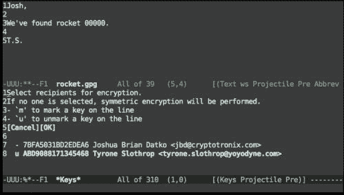

# 第四章：使用受信平台模块保护 GPG 密钥

在我们对 BBB 硬件安全性进行调查后，我们将利用该技术来保护你在流行的 GPG 软件中的个人加密密钥。GPG 是 OpenPGP 标准的免费实现。这个标准是基于菲利普·齐默曼和他的**非常好的隐私**（**PGP**）软件的工作而开发的。PGP 有一个复杂的社会政治背景，我们会在进入项目之前简要介绍。对于本项目，我们将把 BBB 视为一个独立的加密协处理器，并使用带有数字键盘输入设备的 CryptoCape 来保护我们在不使用时的 GPG 密钥。

具体来说，我们将执行以下操作：

+   简要介绍 PGP 软件的历史和重要性

+   执行基本的威胁建模来分析你的项目

+   使用免费的 GPG 软件创建一个强大的 PGP 密钥

+   教你如何使用 TPM 保护加密密钥

# PGP 的历史

本章中使用的软件曾经被美国政府视为军火。如果没有政府许可就出口它，将违反**国际武器贸易条例**（**ITAR**）。直到 1990 年代初，密码学仍受到严格控制和限制。虽然 90 年代初期充斥着密码活动家的诸多记载，这些都在史蒂文·莱维（Steven Levy）的《加密》（*Crypto*）一书中有详细记载，但有一个人尤其是本项目软件背后的推动力量：菲利普·齐默曼。

菲利普·齐默曼（Philip Zimmerman）在 1990 年左右有一个小型的个人项目，他称之为**非常好的隐私**（Pretty Good Privacy）。受到儿时对密码和密码学的强烈兴趣以及对能够进行强大电子监控的政府的政治反感的驱使，他着手为人民创建一个强加密程序（Levy 2001）。

有一个事件特别促使齐默曼完成 PGP 并发布了他的工作。那就是当时的美国参议员约瑟夫·拜登（Joseph Biden）在第 266 号参议院法案中添加的语言，该法案将要求：

> *“电子通信服务提供商和电子通信服务设备制造商应确保通信系统允许政府在法律授权的情况下，获得语音、数据和其他通信的明文内容。”*

1991 年，为了在 PGP 1.0 被宣布非法之前赶紧发布，齐默曼将他的软件作为免费软件发布到互联网。随后，随着 PGP 的传播，美国政府对齐默曼进行了刑事调查，指控他违反了美国的出口法。齐默曼通过一种可以称之为*法律破解*的方式，将 PGP 的整个源代码，包括如何将其扫描回数字形式的说明，作为一本书发布。正如齐默曼所描述的：

|   | *“政府要禁止出口任何人都可以在公共图书馆或书店找到的书籍，在政治上是很困难的。”* |   |
| --- | --- | --- |
|   | --*(Zimmerman, 1995)* |

一本公开领域出版的书籍将不再受到 ITAR 出口管制的限制。魔 genie 已经从瓶子里放了出来；政府在 1996 年放弃了对 Zimmerman 的指控。

## 反思加密战争

Zimmerman's 的斗争被认为是一次顽强的胜利。许多其他强烈支持强加密技术的人，也就是被称为 **密码朋克** 的人，也赢得了普及和传播加密技术的战斗。但是，如果加密战争在九十年代初就已胜利，为什么加密技术还没有变得无处不在呢？嗯，在某种程度上，它已经变得普及。当您在网上购物时，应该受到强加密技术的保护。几乎没有人会坚持要求他们的银行或在线商店 *不* 使用加密技术，大多数人可能会觉得它们使用加密技术更安全。但个人隐私保护软件呢？对于这些工具，必须改变习惯，因为普通的电子邮件、聊天和网页浏览工具默认情况下是不安全的。这种变化引起了紧张情绪和对采用的抵制。

此外，安全工具通常难以使用。在关于安全可用性的开创性论文中，研究人员得出结论，当时的 PGP 5.0 版本，尽管有 **图形用户界面** (**GUI**)，也未能防止那些对加密学没有经验但至少具有大学教育的用户犯下灾难性的安全错误（Whitten 1999）。Glenn Greenwald 因为认为 GPG *太复杂*，所以推迟了大约两个月才与 Edward Snowden 取得初步联系（Greenwald，2014）。Snowden 坚决拒绝与 Greenwald 分享任何信息，直到他安装了 GPG。

GPG 和 PGP 使个人能够保护自己的通信。隐含地，您还必须信任接收方不会转发您的明文通信。GPG 期望您保护自己的私钥，并不依赖于第三方。虽然这增加了一些复杂性和维护过程，但信任第三方持有您的私钥可能是灾难性的。2013 年 8 月，Ladar Levison 决定关闭他自己的公司 Lavabit（一家电子邮件提供商），而不是将用户的数据交给当局。Levison 勇敢地关闭了公司，而不是交出数据。

Lavabit 服务生成并存储了您的私钥。尽管该密钥已加密为用户的密码，但它仍然使服务器能够访问原始密钥。尽管 Lavabit 服务减轻了用户自己管理私钥的负担，但却让 Levison 处于尴尬的境地。要正确使用 GPG，您绝不应交出您的私钥。要了解 Lavabit 的完整分析，请参阅 Moxie Marlinspike 在 [`www.thoughtcrime.org/blog/lavabit-critique/`](http://www.thoughtcrime.org/blog/lavabit-critique/) 上的博客文章。

鉴于国家监控能力的广泛性和深度，保护个人隐私的兴趣重新升温。研究人员现在正在设计安全协议，考虑到这些威胁（Borisov, 2014）。Philip Zimmerman 在《*为何需要 PGP？*》章节的*官方 PGP 用户指南*中以以下语句作结，这句话今天依然如当初写下时一样真实：

> *“PGP 赋予人们掌控自己隐私的能力。社会对这种需求的关注日益增加。”*

# 开发威胁模型

在上一章结束时，我们介绍了威胁模型的概念。**威胁模型**是对系统安全性的一种分析，旨在识别资产、威胁、漏洞和风险。像任何模型一样，分析的深度可以有所不同。在接下来的章节中，我们将提供一个简要分析，帮助你开始思考这个过程。此分析还将帮助我们理解项目的能力和局限性。

## 描述密钥保护系统

我们分析的第一步是清楚地描述我们要保护的系统。在这个项目中，我们将使用 BBB 和 CryptoCape 构建一个逻辑 GPG 协处理器。我们将在 BBB 上存储 GPG 密钥，然后通过**安全外壳**（**SSH**）连接到 BBB 使用密钥并运行 GPG。CryptoCape 将用于在不使用时加密你的 GPG 密钥，称为**静态加密**（at rest）。我们将添加一个数字键盘，用于收集一个数字代码，该代码将传递给 TPM。这将允许 TPM 解包你的 GPG 密钥。

### 注

本项目的想法来源于 Peter Gutmann 对开源加密协处理器的研究工作（Gutmann, 2000）。当 BBB 作为主机的协处理器时，具有极高的灵活性，考虑到功耗，性能也相对较高。通过将敏感代码运行在一个能够访问明文加密密钥的独立硬件上，我们获得了额外的保护层（或者至少是一层间接性保护）。

## 识别我们需要保护的资产

在我们保护任何东西之前，我们必须知道需要保护的是什么。最重要的资产是 GPG 私钥。拥有这些密钥，攻击者可以解密过去加密的消息、恢复未来的消息，并利用密钥冒充你。通过保护你的私钥，我们也在保护你的声誉，这是另一个资产。我们解密后的消息也是一种资产。如果攻击者能够轻松访问你解密的消息，他/她可能不会在乎你的密钥。BBB 本身也是一个需要保护的资产。如果 BBB 变得无法使用，那么攻击者就成功阻止了你访问私钥，这种攻击被称为**拒绝服务**（**DOS**）。

## 威胁识别

要识别针对我们系统的威胁，我们需要对敌人的能力进行分类。这是一个高度个人化的分析，但我们可以将敌人概括为三种原型：资金充足的国家行为者、技术高超的黑客和心怀嫉妒的前任。国家行为者拥有几乎无限的资源，无论是从财务还是人力资源角度来看。黑客是一个技术高超的操作者，但缺乏国家行为者的资金和资源。心怀嫉妒的前任不是一个复杂的计算机攻击者，但他非常有动机伤害你。

不幸的是，如果你成为国家行为者定向监视的目标，你可能面临比 GPG 密钥更严重的问题。这个行为者可以将你的一生都置于监控之下，为什么要费力去窃取你的 GPG 密钥呢？墙壁中的隐藏摄像头早已记录下你屏幕上的一切。

同时，合理的假设是，你与之沟通的每个人也都在被监视，只需要一个人的一个小错误，就可能暴露你征服世界的计划。

### 提示

本杰明·富兰克林的格言在这里非常适用：*三个人能守住一个秘密，前提是其中两个已经死了*。

然而，正确使用 GPG 将保护你免受全球被动监控。当正确使用时，既不会你的互联网服务提供商，也不会你的电子邮件服务提供商或任何被动攻击者能够了解你消息的内容。被动攻击者不会直接攻击你的系统，但他们可能会监控大量的互联网流量，试图*收集所有信息*。因此，你消息的机密性应该得到保护。

我们假设试图伤害你的黑客是远程攻击，且没有物理访问你 BBB 的权限。我们还假设最坏的情况，即黑客已经攻破了你的主机。在这种情况下，不幸的是，黑客能够执行很多操作。他可以安装键盘记录器，捕捉到所有内容，包括你在电脑上输入的密码。虽然他无法获取我们将在 BBB 上输入的代码，但他可以在密钥可用时登录 BBB。

心怀嫉妒的前任并不太懂计算机，但他不需要懂，因为他知道如何使用高尔夫球棒。他知道，与你的计算机连接的这个 BBB 对你来说非常重要，因为你曾经滔滔不绝地向他讲述过一本书里那项非常酷的项目。他可以物理摧毁 BBB，连同它里面的你的私钥（也许这段关系也会一起破裂！）。

## 识别风险

前述风险的可能性有多大？幸运的是，在大多数国家，政府的主动监控风险较低。然而，这种攻击的后果非常严重。正如我们从爱德华·斯诺登事件中了解到的，被国家行为者卷入被动监控的风险是非常可能的。然而，通过使用 GPG，我们能为此类威胁增加一层保护。一个主动的黑客试图伤害你是比较不太可能的。但感染键盘记录恶意软件的风险，可能并非不合理。微软在 2013 年的一项研究中得出结论，每 1000 台计算机中就有 8 台感染了恶意软件。你或许会尝试冒这些风险，但让我们换个说法：在一组 125 台计算机中，就有一台感染了恶意软件。一个学校或大学的计算机数目远远超过这个数字。最后，只有你自己可以评估被嫉妒的前任伤害的风险。

### 注释

欲了解完整的微软报告，请参考[`blogs.technet.com/b/security/archive/2014/03/31/united-states-malware-infection-rate-more-than-doubles-in-the-first-half-of-2013.aspx`](http://blogs.technet.com/b/security/archive/2014/03/31/united-states-malware-infection-rate-more-than-doubles-in-the-first-half-of-2013.aspx)。

## 减轻已识别的风险

如果你发现自己成为国家的目标，这个项目单独并不能提供太大帮助。我们可以通过两种策略在一定程度上保护自己免受黑客攻击。第一种是，不将 BBB 连接到你的笔记本或计算机，而是将 BBB 作为独立机器使用，通过 microSD 卡传输文件。这被称为**空气隔离**。配备专用的显示器和键盘时，软件漏洞破坏隔离并感染 BBB 的可能性大大降低。然而，这会带来较高的个人不便，具体取决于你加密文件的频率。如果你认为将 BBB 连接到计算机的风险太高，可以创建一个空气隔离的 BBB 以获得最大保护。如果你认为风险较低，因为你已经加固了计算机并有其他保护机制，那么可以将 BBB 连接到计算机。

### 注释

空气隔离的计算机仍然可能受到攻击。2010 年，一种名为 Stuxnet 的高度专业化蠕虫能够通过 USB 闪存驱动器传播到网络隔离的计算机。

第二种策略是通过某种方式将 GPG 密码直接输入 BBB，而不使用主机的键盘。完成项目后，我们将建议一种机制来实现这一点，但它稍微复杂一些。这将消除键盘记录器的威胁，因为密码直接输入。

针对前任的防护措施是像保护自己的钱包一样保护你的 BBB，不要让它离开你的视线。它比你想象的稍大一些，但足够小，可以放进一个小背包或公文包里。

## 总结我们的威胁模型

我们的威胁模型虽然简略，但展示了在使用或开发安全技术之前应经过的思考过程。威胁模型这个术语是安全行业的专用词汇，但它其实就是合适的规划。这个分析的目的是发现*逻辑漏洞*，防止你花费数千美元为前门安装高科技锁，却忽视了后门的安全。现在我们明白了我们要保护什么以及为什么使用 GPG 很重要，接下来让我们构建项目。

# 生成 GPG 密钥

首先，我们需要在 BBB 上安装 GPG。它很可能已经安装好了，但你可以通过以下命令检查并安装它：

```
sudo apt-get install gnupg gnupg-curl

```

接下来，我们需要添加一个密钥。对于已经拥有密钥的人，你可以将密钥环`secring.gpg`导入到你的`~/.gnupg`文件夹中。对于想要创建新密钥的人，在 BBB 上请继续执行接下来的步骤。

### 注意

本项目假设你对 GPG 有所了解。如果 GPG 对你来说是新鲜事物，Free Software Foundation 维护了一份**电子邮件自我防护**指南，这是一个非常易于理解的 GPG 入门介绍，指南可以在[`emailselfdefense.fsf.org/en/index.html`](https://emailselfdefense.fsf.org/en/index.html)找到。

## 生成熵

如果你决定在 BBB 上创建新密钥，我们需要考虑一些技术细节。首先，GPG 需要大量的随机数据来生成密钥。内核中可用的随机数据量与可用的熵量成正比。你可以使用以下命令检查可用的熵量：

```
cat /proc/sys/kernel/random/entropy_avail

```

如果这个命令返回一个较低的数字，低于 200，那么 GPG 将没有足够的熵来生成密钥。在 PC 上，人们可以通过与计算机交互来增加熵，例如敲击键盘或移动鼠标。然而，这种熵来源对于嵌入式系统来说比较困难，在我们当前的设置中，我们没有奢侈的条件去移动鼠标。

幸运的是，有一些工具可以帮助我们。如果你的 BBB 运行的是 3.13 或更高版本的内核，我们可以利用 AM3358 上的硬件随机数生成器来帮助我们。你需要安装`rng-tools`包。安装完成后，你可以编辑`/etc/default/rng-tools`，并添加以下行来注册硬件随机数生成器以供`rng-tools`使用：

```
HRNGDEVICE=/dev/hwrng

```

完成此操作后，你应该启动`rng-tools`守护进程，命令如下：

```
/etc/init.d/rng-tools start

```

如果你没有`/dev/hwrng`——目前，CryptoCape 上的芯片还不支持字符设备，也无法访问`/dev/hwrng`——那么你可以安装`haveged`。这个守护进程实现了**硬件易失性熵收集与扩展**（**HAVEGE**）算法，详细信息可以参考[`www.irisa.fr/caps/projects/hipsor/`](http://www.irisa.fr/caps/projects/hipsor/)。这个守护进程将确保 BBB 保持熵池，这对于在 BBB 上生成 GPG 密钥是足够的。

## 创建一个好的 gpg.conf 文件

在你生成密钥之前，我们需要为 GPG 建立一些更安全的默认设置。正如我们之前讨论的，使用电子邮件加密仍然不像应该的那样简单。[Riseup.net](http://Riseup.net) 是一家具有强烈社会责任感的电子邮件提供商，它在[`help.riseup.net/en/security/message-security/openpgp/best-practices`](https://help.riseup.net/en/security/message-security/openpgp/best-practices)上维护着一份 OpenPGP 最佳实践指南。该指南详细说明了如何加固你的 GPG 配置，并为每个选项提供了背后的动机。阅读这份指南非常值得，它可以帮助你理解 GPG 密钥管理的复杂性。

Jacob Applebaum 维护了这些最佳实践的实现，你可以从[`github.com/ioerror/duraconf/raw/master/configs/gnupg/gpg.conf`](https://github.com/ioerror/duraconf/raw/master/configs/gnupg/gpg.conf)下载并保存为你的`~/.gnupg/gpg.conf`文件。该配置文件有详细注释，你可以参考[Riseup.net](http://Riseup.net)提供的最佳实践指南以获取更多信息。然而，有三个条目需要你进行修改。第一个是`default-key`，它是你主 GPG 密钥的指纹。在本章稍后，我们将向你展示如何检索该指纹。现在我们无法执行此操作，因为我们还没有密钥。第二个是`keyserver-options ca-cert-file`，它是**密钥服务器池**的证书授权。密钥服务器托管你的公钥，密钥服务器池是多个冗余的密钥服务器集合。[Riseup.net](http://Riseup.net)上的说明提供了如何下载和安装该证书的详细信息。最后，你可以使用 Tor 来获取密钥更新。

你向密钥服务器请求公钥的行为表明你可能有兴趣与该密钥的所有者进行通信。对于一个被动的对手而言，这些元数据可能比你的消息内容更有价值，因为它揭示了你的社交网络。正如我们在第二章中学到的，*使用 Tor 桥接绕过审查*，Tor 在保护流量分析方面表现出色。你可能不希望将你的 GPG 密钥存储在与桥接相同的 BBB 上，因此第二个 BBB 会有所帮助。在你的 GPG BBB 上，你只需要将 Tor 作为客户端运行，这是其默认配置。然后，你可以更新`keyserver-options http-proxy`，指向你在`localhost`上运行的 Tor SOCKS 代理。

### 注意

**电子前沿基金会** (**EFF**) 提供了一些关于元数据揭示性质的假设性例子，例如，*他们（政府）知道你曾从金门大桥拨打自杀预防热线。但通话的内容依然是机密*。更多细节请参阅 EFF 博客文章：[`www.eff.org/deeplinks/2013/06/why-metadata-matters`](https://www.eff.org/deeplinks/2013/06/why-metadata-matters)。

## 生成密钥

现在你可以生成你的 GPG 密钥了。按照屏幕上的指示进行操作，不要包含评论。根据你的熵源，这可能需要一段时间。这个例子使用 `haveged` 作为熵收集器花费了 10 分钟。关于设置过期日期存在不同意见。如果这是你第一次使用 GPG，先尝试设置一年。你随时可以创建一个新密钥或延长现有密钥的有效期。如果你将密钥设置为永不过期，而你又丢失了密钥（例如忘记了密码），别人仍然会认为它是有效的，除非你撤销它。此外，务必将用户 ID 设置为与某种身份认证匹配的名字，这样更容易验证持有私钥的人与认证文件上的姓名一致。创建新密钥的命令是 `gpg --gen-key`：

```
Please select what kind of key you want:
 (1) RSA and RSA (default)
 (2) DSA and Elgamal
 (3) DSA (sign only)
 (4) RSA (sign only)
Your selection? 1
RSA keys may be between 1024 and 4096 bits long.
What keysize do you want? (2048) 4096
Requested keysize is 4096 bits
Please specify how long the key should be valid.
 0 = key does not expire
 <n>  = key expires in n days
 <n>w = key expires in n weeks
 <n>m = key expires in n months
 <n>y = key expires in n years
Key is valid for? (0) 1y
Key expires at Sat 06 Jun 2015 10:07:07 PM UTC
Is this correct? (y/N) y

You need a user ID to identify your key; the software constructs the user ID
from the Real Name, Comment and Email Address in this form:
 "Heinrich Heine (Der Dichter) <heinrichh@duesseldorf.de>"

Real name: Tyrone Slothrop
Email address: tyrone.slothrop@yoyodyne.com
Comment:
You selected this USER-ID:
 "Tyrone Slothrop <tyrone.slothrop@yoyodyne.com>"

Change (N)ame, (C)omment, (E)mail or (O)kay/(Q)uit? O
You need a Passphrase to protect your secret key.

We need to generate a lot of random bytes. It is a good idea to perform some other action (type on the keyboard, move the mouse, utilize the disks) during the prime generation; this gives the random number generator a better chance to gain enough entropy.
......+++++
..+++++

gpg: key 0xABD9088171345468 marked as ultimately trusted
public and secret key created and signed.

gpg: checking the trustdb
gpg: 3 marginal(s) needed, 1 complete(s) needed, PGP trust model
gpg: depth: 0  valid:   1  signed:   0  trust: 0-, 0q, 0n, 0m, 0f, 1u
gpg: next trustdb check due at 2015-06-06
pub   4096R/0xABD9088171345468 2014-06-06 [expires: 2015-06-06]
 Key fingerprint = CBF9 1404 7214 55C5 C477  B688 ABD9 0881 7134 5468
uid                 [ultimate] Tyrone Slothrop <tyrone.slothrop@yoyodyne.com>
sub   4096R/0x9DB8B6ACC7949DD1 2014-06-06 [expires: 2015-06-06]

gpg --gen-key  320.62s user 0.32s system 51% cpu 10:23.26 total

```

从这个例子中，我们知道我们的密钥是 `0xABD9088171345468`。如果你创建了多个密钥，但更常使用其中的一个，你可以编辑 `gpg.conf` 文件并添加以下行：

```
default-key 0xABD9088171345468

```

## 生成后维护

为了让他人可以向你发送加密信息，他们需要知道你的公钥。设置公钥服务器有助于分发你的公钥。你可以按照以下方式发布你的公钥，并将指纹替换为你的主密钥 ID：

```
gpg --send-keys 0xABD9088171345468

```

### 注意

GPG 不依赖第三方，期望你自行管理密钥。为了简化这一工作，OpenPGP 标准定义了“信任网络”机制，用于验证其他用户的密钥。关于如何参与信任网络的详细信息可以在 GPG 隐私手册中找到：[`www.gnupg.org/gph/en/manual/x334.html`](https://www.gnupg.org/gph/en/manual/x334.html)。

你还需要创建一个撤销证书。撤销证书在你想撤销密钥时是必要的。比如说，如果密钥被盗，你需要撤销它。或者更可能的情况是，如果 BBB 发生故障，你无法再访问密钥。生成证书并按照提示操作，将 ID 替换为你的密钥 ID：

```
gpg --output revocation-certificate.asc --gen-revoke 0xABD9088171345468

sec  4096R/0xABD9088171345468 2014-06-06 Tyrone Slothrop <tyrone.slothrop@yoyodyne.com>

Create a revocation certificate for this key? (y/N) y
Please select the reason for the revocation:
 0 = No reason specified
 1 = Key has been compromised
 2 = Key is superseded
 3 = Key is no longer used
 Q = Cancel
(Probably you want to select 1 here)
Your decision? 0
Enter an optional description; end it with an empty line:
>
Reason for revocation: No reason specified
(No description given)
Is this okay? (y/N) y

You need a passphrase to unlock the secret key for
user: "Tyrone Slothrop <tyrone.slothrop@yoyodyne.com>"
4096-bit RSA key, ID 0xABD9088171345468, created 2014-06-06

ASCII armored output forced.
Revocation certificate created.

Please move it to a medium which you can hide away; if Mallory gets access to this certificate he can use it to make your key unusable.
It is smart to print this certificate and store it away, just in case your media become unreadable.  But have some caution:  The print system of your machine might store the data and make it available to others!

```

请听从建议，将此文件移出 BeagleBone。将其打印并存放在安全地方是一个不错的选择，或者将其刻录到 CD 上。

### 注意

CD 或 DVD 的使用寿命可能不像你想象的那么长。美国国家档案馆关于光学存储介质的常见问题页面指出：

*“CD/DVD 的实际使用寿命为 2 到 5 年，尽管发布的预期寿命通常标称为 10 年、25 年或更长。”*

参考他们的网站[`www.archives.gov/records-mgmt/initiatives/temp-opmedia-faq.html`](http://www.archives.gov/records-mgmt/initiatives/temp-opmedia-faq.html)获取更多详细信息。

最后，创建你的加密备份密钥，并考虑将其存储在耐用介质上的安全位置。

## 使用 GPG

有了你创建或导入的 GPG 私钥，你现在可以在 BBB 上像在任何其他计算机上一样使用 GPG。在第一章中，*创建你的 BeagleBone Black 开发环境*，你在主机计算机上安装了 Emacs。如果你按照 GNU/Linux 的指示操作，你也可以在 BBB 上安装 Emacs。如果你这样做，你将享受自动的 GPG 文件加密和解密功能，用于以`.gpg`扩展名结尾的文件。例如，假设你想给你的好朋友 Pirate Prentice 发送一条消息，他的 GPG 密钥你已经有了。在 Emacs 中撰写你的消息，然后以`.gpg`扩展名保存。Emacs 将提示你选择用于加密的公钥，并自动加密缓冲区。如果一个 GPG 加密消息是加密给你有相应私钥的公钥，当以`.gpg`结尾时，Emacs 将自动解密消息。在从终端使用 Emacs 时，加密的提示应该看起来像以下截图：



# 用 TPM 保护你的 GPG 密钥

如果你愿意，你可以现在停止项目并愉快地在你的 BBB 上使用 GPG。但是如果你这样做，你将错过使用 CryptoCape 提供的一些额外保护，特别是**可信平台模块**（**TPM**）。在接下来的部分中，我们将使用 TPM 来保护我们的 GPG 私钥。

## 介绍可信计算

TPM 是一个密码协处理器。CryptoCape 上的 TPM 是 Atmel 的嵌入式 I2C 版本，符合由**可信计算组**（**TCG**）发布的 TPM 规范 1.2 版。TCG 是一个行业联盟，负责维护和开发可信计算的开放规范。在 RFC 4949 中，*可信*的定义是：*按设计和政策预期运行的系统*。

从密码学角度看，TPM 1.2 存在一些限制。它实现了 RSA 算法，SHA-1，具有内部随机数生成器和一些有限的存储空间。它不提供任何对称加密算法。这些限制是为了设计成本低廉、可嵌入模块的设计目标。对称加密算法被排除在外，因为使用 TPM，可以保护静态对称密钥，并允许更强大的主机计算机对其进行操作。

TPM 1.2 规范总共有 700 多页。我们将关注 TPM 的一个独特特性，这个特性使得它的许多安全功能成为可能：**平台控制寄存器** (**PCRs**)。PCRs 是 TPM 寄存器，始终可以读取，但只能通过**扩展操作**写入。扩展操作获取当前的 20 字节 PCR 值，与一个 20 字节的输入值组合，并将新的 PCR 值设置为这个组合的 SHA-1 结果。关键点在于一旦 PCR 被设置，就无法逆转。它只能在未来的扩展操作中继续组合。

起初，这个功能可能不明显有何帮助。让我们考虑一个例子。在启动时，您的计算机的 BIOS 在加载引导加载程序之前，首先将引导加载程序的 SHA-1 哈希发送到 TPM 以扩展一个 PCR。然后加载引导加载程序。引导加载程序在您的内核上执行相同的操作。然后内核在各种启动系统上执行相同的操作，最后允许正常用户操作。在这个过程结束时，PCRs 将填充一系列哈希值。

这些寄存器的值代表您系统的可信度量。现在，假设恶意软件已经感染了您的计算机并修改了启动过程。在下次启动时，至少一个 PCR 的值与之前记录的值有显著不同。PCRs 使得可以对启动过程进行测量，从而提供关于启动过程的断言。

有几个与 TPM 保护启动过程相关的术语。如果 PCR 值与已知配置不匹配，安全启动将停止启动过程。经过认证的启动只是测量启动过程，并允许远程方对启动过程的来源进行断言。受信启动指的是同时使用经过认证和安全启动的系统。

## 加密数据到一个 PCR 状态

TPM 支持另一个建立在 PCR 状态之上的功能。如前所述，TPM 可以执行 RSA 加密。然而，TPM 还可以将 PCR 状态与加密结合在一起，这个过程称为**封存**。一旦数据被封存到 PCR 值，只有当 PCR 与加密时相同的值匹配时，才能解密数据。

这将如何帮助我们保护 GPG 密钥？我们将 GPG 密钥加密到已知的 PCR 状态。我们将使用从连接到 CryptoCape 的键盘输入的数字代码作为这个 PCR 状态的输入。当 TPM 解密 GPG 私钥时，它将像通常一样可供 GPG 使用。虽然 GPG 私钥已经受到密码短语的保护，但 TPM 在静止时提供额外的密钥保护。密码短语仍然可能被键盘记录器捕获，但在 BBB 启动并连接 CryptoCape 并直接输入代码之前，我们的密钥将不可用。

该系统还有助于防止对数字代码的离线攻击。一旦使用正确的代码扩展了 PCR 值，就可以解锁数据。但是，如果输入错误的代码，PCR 值将不正确，若该 PCR 是*不可重置*的 PCR 之一，唯一的重置方法是重启。

# 添加键盘

我们需要一种方法将此代码输入到 BBB 中。此代码用于填充 TPM 的 PCR 之一，该 PCR 将用于密封 GPG 密钥。这个键盘将连接到 CryptoCape 上的 ATmega328p。虽然 BBB 完全能够处理键盘的 I/O，但通过使用 ATmega328p，我们可以充分利用代码重用。对于 SparkFun 目录中的大多数硬件产品，至少有一个非官方的 Arduino 库。如果这些组件在 SparkFun 上没有，你应该能够从产品描述中找到类似的部件。就键盘而言，有一个官方库。该项目的硬件列在下表中：

| 设备 | SparkFun 编号 |
| --- | --- |
| CryptoCape | DEV-12773 |
| 键盘 | COM-08653 |
| F/F 跳线 | PRT-08430 |
| 公头断开连接器 | PRT-00116 |

要构建这个 Arduino 库，你首先需要从 Arduino Playground 网站安装`Keypad`库：[`playground.arduino.cc/code/Keypad`](http://playground.arduino.cc/code/Keypad)。然后从 GitHub 克隆以下仓库：

```
git clone https://github.com/jbdatko/beagle-bone-for-secret-agents.git

```

在`ch4`代码文件夹中，你会找到`keypad.ino`源代码和已编译好的 hex 文件，准备加载到 328p 中。从第三章，*通过 CryptoCape 添加硬件安全*，记住可以通过以下命令将编译好的草图上传到 ATmega328p，只要确保安装了程序跳线：

```
sudo ./upload.sh keypad_cryptocape.cpp.hex

```

该程序将 328p 连接到 I2C 总线的十六进制地址 0x42。它会等待从 I2C 主设备——BBB 接收数据，然后从键盘收集五位数字代码。你有十秒钟的时间输入五位数字代码，计时器一旦 CryptoCape LED 亮起就开始。每按下一次键，LED 会瞬间闪烁。收集完五个字符后，LED 会熄灭。

要将键盘连接到 CryptoCape，你首先需要将 0.1"的公头引脚焊接到键盘上。同时，你还需要将 0.1"的公头引脚焊接到 CryptoCape ATmega328p 的焊盘上。安装好引脚后，你需要使用跳线将键盘连接到 CryptoCape。请注意，键盘有九个引脚，但只有七个会用到。将第一个引脚（最靠近`*`字符的引脚）视为*引脚 0*。按以下表格连接跳线：

| 键盘引脚 | Arduino 数字引脚 |
| --- | --- |
| 3 | D2 |
| 1 | D3 |
| 5 | D4 |
| 2 | D5 |
| 7 | D6 |
| 6 | D7 |
| 4 | D8 |

将键盘连接到 CryptoCape 后，应该看起来如下图所示：


### 注意

图像中显示的情况是逻辑供应的镀钢机箱。您可以在他们的网站上找到这些信息：[`www.logicsupply.com/components/beaglebone/boards-cases-kits/bb100-orange/`](http://www.logicsupply.com/components/beaglebone/boards-cases-kits/bb100-orange/)。

现在，我们需要一些软件，它将启动 ATmega328p 上的代码收集过程。请记住，软件需要收集代码，然后扩展 PCR。在前面列出的存储库中有一个文件，`keypad.c`，它正是这样做的。要构建此程序，您需要开源 TCG 软件堆栈的开发包：

```
sudo apt-get install libtspi-dev

```

然后，您应该能够使用以下命令编译程序：

```
gcc keypad.c -o getgpgpin -ltspi

```

# 拥有 TPM 的所有权

在使用 TPM 之前，我们必须首先拥有它。拥有 TPM 会为维护操作建立一个所有者密码和一个 TPM 内部的根密钥之一，即**存储根密钥**（**SRK**）（发音为*shark*）。您可以将管理员密码设置为任何密码，但是为了与传统软件一起使用，您会想将 SRK 设置为二十个零的*众所周知的密码*。如果您想要设置一个唯一的 SRK 密码，但是用于控制 TPM 的 TrouSerS 软件包括一个命令行参数，用于将密码设置为其众所周知的值。首先安装`tpm-tools`：

```
sudo apt-get install tpm-tools

```

然后，您应该重新启动带有 CryptoCape 连接的 BBB。这将确保 TPM 内核驱动程序和相关软件正确加载。要检查一切是否正常工作，请发出以下命令：

```
dmesg | grep TPM

```

应返回：

```
[    5.370109] tpm_i2c_atmel 1-0029: Issuing TPM_STARTUP

```

然后，通过发出以下命令检查守护程序：

```
ps aux | grep tcsd

```

此命令应返回类似于以下内容：

```
tss  799  0.0  0.1  11492   980 ?  Ss Jun08 0:00 /usr/sbin/tcsd

```

然后，您可以按以下方式拥有 TPM：

```
tpm_takeownership -z -l debug

```

您将被提示输入所有者密码。 `-z` 选项将 SRK 设置为众所周知的密码短语。回应应为：

```
Tspi_Context_Create success
Enter owner password:
Confirm password:
Tspi_Context_Connect success
Tspi_Context_GetTpmObject success
Tspi_GetPolicyObject success
Tspi_Policy_SetSecret success
Tspi_Context_CreateObject success
Tspi_GetPolicyObject success
Tspi_Policy_SetSecret success
Tspi_TPM_TakeOwnership success
tpm_takeownership succeeded
Tspi_Context_CloseObject success
Tspi_Context_FreeMemory success
Tspi_Context_Close success

```

现在您已经准备好使用 TPM。

### 注意

如果您有 CryptoCape v02，则需要执行一些额外步骤。版本号位于板的底层，在 P8 标头上方，靠近开源硬件标志的图标上方，看起来像一个齿轮。此修订版上的 TPM 以合规模式发货，这意味着加载在其上的密钥是测试密钥。这有助于在制造过程中测试 TPM，但需要最终用户更改密钥。有关详细信息，请参阅页面[`cryptotronix.com/cryptocape-tpm/`](http://cryptotronix.com/cryptocape-tpm/)。

# 扩展 PCR

我们需要扩展一个 PCR 以便加密我们的 GPG 密钥。我们将随意选择 PCR 号码 9。首先让我们查看 PCR 状态，以确保它是空白的：

```
cat /sys/class/misc/tpm0/device/pcrs | grep PCR-09

```

这应返回 PCR 的当前状态，在不使用安全启动的情况下是：

```
PCR-09:00 00 00 00 00 00 00 00 00 00 00 00 00 00 00 00 00 00 00 00

```

现在，从以下部分运行`getgpgpin`程序。你应该会看到 CryptoCape 上的 LED 灯变为绿色，并且你有 10 秒钟的时间输入一个五位数字的 PIN 码。每次按下一个键时，LED 灯应该会闪烁，当输入完五个数字时，LED 灯会熄灭。10 秒钟后，`getgpgpin`程序将悄无声息地退出。如果你在编译程序时启用了`#define DEBUG`并设置为`1`，你应该会看到如下信息：

```
54321
(Line 53, extend_pcr)  Create a Context
 returned 0x00000000\. Success.
(Line 55, extend_pcr)  Connect to TPM
 returned 0x00000000\. Success.
(Line 59, extend_pcr)  GetTPM Handle
 returned 0x00000000\. Success.
(Line 62, extend_pcr)  Owner Policy
 returned 0x00000000\. Success.
36987(Line 73, extend_pcr)  extend
 returned 0x00000000\. Success.

```

现在，再次检查你的 PCR 状态：

```
cat /sys/class/misc/tpm0/device/pcrs | grep PCR-09

```

你现在应该有一个填充的 PCR9：

```
PCR-09:2B 1E 41 10 EB A0 91 9E B4 89 0E 04 83 0B 70 C5 C2 AA 23 44

```

你只能输入代码一次。如果你再次尝试，程序将使用现在错误的 PCR 状态作为输入，再次扩展 PCR9。现在，让我们封存我们的 GPG 秘密密钥环：

```
tpm_sealdata -p 9 -i secring.gpg -o secring.gpg.tpm -z -l debug

```

如果你愿意，可以删除`-l debug`，命令将悄无声息地完成。现在让我们测试解密：

```
tpm_unsealdata -i secring.gpg.tpm -o deleteme -z

```

如果成功，它应该悄无声息地完成。你现在可以删除临时文件`deleteme`和原始的`secring.gpg`。你做了加密备份对吧？你可能想要以更安全的方式删除这个文件。安全删除工具`srm`可以做到这一点，它会在删除之前多次覆盖文件。要安装它，可以使用以下命令：

```
sudo apt-get install secure-delete

```

然后像使用`rm`一样使用它。

### 注意

Bunnie Huang 和 Sean Cross（也被称为 *xobs*）在**第 30 届混沌通信大会**（**30C3**）上展示了一场关于破解 SD 卡的讲座。你的 SD 卡或 eMMC 包含一个小型微控制器，用于管理附加的闪存。这款微控制器非常适合充当中间人攻击者，并操控你存储在设备上的数据。例如，这个微控制器可能会保存你数据的备份，因为它向你的计算机报告的存储容量是 8GB，但实际上它包含的是 16GB 的闪存芯片。更多信息可以在 Bunnie 的博客上找到，[`www.bunniestudios.com/blog/?p=3554`](http://www.bunniestudios.com/blog/?p=3554)。

# 启动时解锁你的密钥

最后，我们需要自动化这个过程。当 BBB 启动时，我们希望它收集代码，扩展 PCR，并解锁 GPG 密钥，以便它们可以准备使用。我们将制作一个`init.d`脚本来处理这个过程，但我们仍然需要处理 GPG 密钥。我们不希望解锁的 GPG 密钥留在磁盘上，即使它已通过密码保护。相反，我们将把 GPG 密钥保存在一个`ramfs`中，它永远不会触及持久存储。

要创建`ramfs`，请将以下内容添加到`/etc/fstab`：

```
ramfs    /mnt/ramdisk ramfs nodev,nosuid,noexec,nodiratime,size=1M,uid=1000,gid=1002   0 0

```

确保将你的 uid 和 gid 替换为适合你用户的值。你可以通过运行`id`命令来获取这些值。可以选择重启或运行`mount -a`来重新加载`fstab`。由于 GPG 期望`secring.gpg`文件位于`~/.gnupg/secring.gpg`，我们将创建一个从该位置到 ramdisk 的链接。创建以下符号链接：

```
ln -s /mnt/ramdisk/secring.gpg ~/.gnupg/secring.gpg

```

现在，我们需要一个在启动时运行的脚本。在`beagle-bone-for-secret-agents/ch4`仓库中，有一个名为`tpm_gpg`的脚本，您可以将其复制到`/etc/init.d/`。此脚本期望`getgpgpin`位于`/usr/local/bin`，并且您的`secring.gpg`文件应该放在正常的位置。根据需要进行编辑。要注册此脚本，请以 root 身份运行：

```
update-rc.d tpm_gpg defaults

```

在脚本已经就绪、虚拟磁盘设置为启动时挂载、ATmega 已编程以收集代码且硬件已连接的情况下，再次重启设备。注意观察 CryptoCape LED 灯是否亮起，输入您的 PIN 码，然后重新登录到 BBB。如果您的 GPG 密钥位于`/mnt/ramdisk`，恭喜您，您刚刚使用 TPM 来保护您的 GPG 密钥！由于符号链接的存在，所有与 GPG 相关的程序将像往常一样使用这些密钥。如果没有，请重新编译`keypad.c`，将调试模式设置为`1`，确保一切正常运行。

### 注意

虽然 ramfs 旨在确保仍然通过密码保护的 GPG 密钥在断电后被销毁，但过去有研究人员从 RAM 中恢复了密钥。请参考[`citp.princeton.edu/research/memory/`](https://citp.princeton.edu/research/memory/)上的冷启动攻击。

# 威胁模型的迭代

威胁建模和系统设计是一个迭代过程。本章中我们构建的系统是一个良好的起点，但它仍然可以改进。我们在本章开始时识别出一个问题，那就是我们仍然需要在可能已被攻破的计算机上输入 GPG 密码。键盘上的代码输入目前仅在 BBB 关闭电源时保护 GPG 密钥。如果一个不知情的攻击者启动 BBB，它也可以保护密钥，因为在 10 秒的时间窗口后，PCR 将不再具有正确的值。为了防止密钥记录攻击，我们希望能够直接在 BBB 上输入密码短语。

有一款名为**gpg-agent**的软件，它管理每个登录会话的密码短语。它可以支持不同类型的*PIN 码输入*程序。例如，一个 PIN 码输入程序是基于 X-Windows 的，另一个则支持命令行接口。您当然可以创建一个支持自定义硬件的 PIN 码输入程序。然而，当您创建这个自定义 PIN 码输入程序时，您需要考虑密码短语的强度问题，如果仅由数字组成，可能会导致 GPG 密钥的安全性降低。这展示了随着新特性的加入，我们需要重新评估威胁模型，以确保最初的假设仍然有效。

此外，您可能还想考虑为您的项目添加一个外壳。您所在的黑客空间可以帮助您制作一个专业外观的外壳。如果您想要便宜一点的选择，可以找到一个小型半透明容器，并按以下图示切割出键盘和连接器的空间：


# 总结

在本章中，你学习了如何通过 GPG 来保护电子邮件的机密性。我们为我们的系统创建了一个威胁模型，并展示了如何通过这个分析帮助我们理解设计的能力和局限性。最后，我们成功构建了一个 BBB GPG 协处理器，使用 TPM 来帮助保护静态的 GPG 密钥，并获得了更多将微控制器与嵌入式 Linux 平台结合的实践。

在下一章中，我们将研究另一种用于保护实时聊天的主要隐私增强技术。你将了解 **Off-the-Record** (**OTR**) 的独特加密特性，以及如何在你的 BBB 主机上托管的 Internet Relay Chat 网关上使用 OTR。
