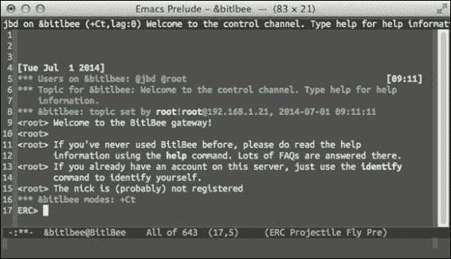
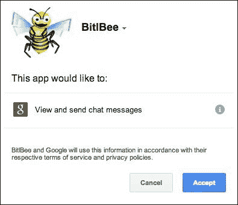
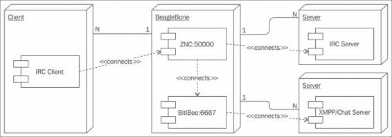

# 第五章 离线聊天

在本章中，我们将使用**BeagleBone Black**（**BBB**）来保护您在线生活的最后堡垒：实时聊天。通过 GPG 保护您的电子邮件，使用 Tor 保护您的浏览，我们将使用名为**Off-the-Record**（**OTR**）的软件来保护即时消息聊天。OTR 解决了 PGP 威胁模型中的一个弱点，我们将在构建项目之前概述 OTR 的设计目标。我们还将整合所有聊天网络，通过 Internet Relay Chat 接口进行管理，该接口将运行在您的 BBB 上。尽管这个项目不需要除 BBB 以外的任何额外硬件，但加密概念和网络交互比前几章稍微更具挑战性。在本章和本书结束时，您将接触并熟悉三种最有效的在线隐私保护工具。

在这一章中，您将执行以下操作：

+   学习 PGP 和 OTR 之间加密设计的区别

+   使用 BitlBee 运行 IRC 聊天网关

+   将您的 IRC 网络与 IRC 中继器 ZNC 结合使用

+   在 BitlBee 和 ZNC 上设置并使用 OTR 聊天

# 离线通信背景

在我们研究 OTR 之前，让我们考虑如何加密我们的聊天会话。我们可以使用 GPG 进行聊天。我们需要知道通信对象的公钥，每次输入信息时，它都会加密和/或签名该信息并发送出去。一些聊天网络没有类似电子邮件地址的东西，所以找到并验证公钥可能会比较麻烦。然而，您完全可以想象出一种这样的聊天系统；它是 GPG 与电子邮件的一个稍微同步的版本。

即使解决了那些技术问题，PGP 的设计中仍然存在一个更大的问题。让我们回到我们的朋友 Alice 和 Bob。Alice 和 Bob 已经使用 GPG 进行通信一段时间了。他们使用 GPG 毫无瑕疵，并且始终如一地践行最佳的安全卫生习惯。直到有一天，有人获取了 Bob 的私钥。现在，这种情况可能有多种方式发生。尽管 Bob 有强烈的意志力，也许他就是无法抗拒点击*Watch cuTe kittys [sic]*链接，导致恶意软件感染了他的计算机。也许有人偷走了他定制的 GPG 硬件令牌，并猜出了他的 GPG 密码。无论 Bob 的私钥是如何泄露的，重要的是现在别人已经拥有了它。

Bob，作为一名警觉的 GPG 用户，立即撤销了他的密钥，通知大家该密钥已经被泄露。这警告其他人不要再使用该密钥，并且在未来的通信中应使用新的密钥。但我们不能忘记 Alice 和她与 Bob 之间的许多通信。那 Alice 怎么办？这个攻击者，拥有 Bob 的私钥，可以解密 Alice 和 Bob 之间的所有过往通信。所有内容。突然间，他们的对话似乎不再那么私密，正如 OTR 设计者 Ian Goldberg 所提到的关于 GPG 通信隐私的问题。

## 引入 Off-the-Record 通信

虽然 GPG 有其作用，但如果你担心失去对私钥的控制，那么你可能需要考虑其他工具。一个专门考虑到这一威胁的工具叫做**Off-the-Record**（**OTR**），最初发布在论文《*Off-the-Record Communication, or, Why Not To Use PGP*》（Borisov 2004）中。OTR 包含一些与 PGP 不同的加密功能和设计目标。例如，OTR 被设计为包含*完美前向保密性*，确保**会话密钥**（即加密通信流量的密钥）在长期身份密钥泄露的情况下不会被重新推导出来。同时，OTR 只在初始认证步骤中使用数字签名；单个消息不会被签名。

会话密钥通过**Diffie-Hellman 密钥交换**协议由双方独立推导。Diffie-Hellman 协议有助于解决密钥分发问题。Alice 和 Bob 想要用对称加密算法保护他们的通信，但他们都需要相同的密钥。通过使用 Diffie-Hellman，他们可以在不安全的信道上独立推导出共享密钥，而无需将密钥暴露给第三方。OTR 使用 Diffie-Hellman 密钥交换中的非对称加密，使得双方能够在计数模式下推导出共享的 AES 密钥。**AES 计数模式**（**AES-CTR**）使用 AES 作为流密码，本节稍后会讨论其重要性。

### 注意

Khan Academy 网站上提供了 Diffie-Hellman 密钥交换的简化版两分钟描述，链接：[`www.khanacademy.org/computing/computer-science/cryptography/modern-crypt/v/diffie-hellman-key-exchange--part-2`](https://www.khanacademy.org/computing/computer-science/cryptography/modern-crypt/v/diffie-hellman-key-exchange--part-2)。

OTR 的另一个与 PGP 不同的特点是，OTR 被设计为具有信息否认性，即能够否认消息的作者身份或有效性。PGP 则是为了不可否认性而设计的，它通过你的数字签名提供一个证明，证明你确实创建了那条消息。然而，在 OTR 中，Alice 和 Bob 都无法证明对方或自己创建了某一特定的消息。这个功能的细节稍微有些技术性，但我们将提供一个高级总结，因为这是**消息认证码**（**MACs**）的巧妙应用。

MAC 是一个附加在数据块上的小标签。标签由发送方计算，并发送给接收方，接收方重新计算该值以检查数据在传输过程中是否被篡改，这验证了数据的完整性。此外，MAC 涉及到双方的共享密钥。因此，Alice 和 Bob 拥有相同的 MAC 密钥。因此，当 Bob 验证消息上的 MAC 时，他可以确定发送者和他自己拥有相同的 MAC 密钥。在 OTR 中，由于 Alice 和 Bob 使用相同的 MAC 密钥应用于每条独立的消息，因此其中任何一方都可以创建消息来模仿对方。因此，他们都无法证明自己或通信伙伴确实创建了某条消息。这就提供了 OTR 中的否认功能。

OTR 设计者还加入了一个加密系统中额外的不常规特性：可伪造性。OTR 的设计使得在消息解密时，能够轻松地改变加密文本，从而产生一个有意义的输出。这之所以能实现，是因为设计者选择了一种易于变动的加密方案，使用的是流密码；在 OTR 中，它使用的是 128 位密钥长度的 AES-CTR。流密码的*核心*是生成密钥流，但实际的加密通常是通过对明文应用异或操作来进行的。解密则是通过对相同的密钥流应用相同的异或运算来进行的。一个能够猜测消息明文的攻击者，可以修改加密文本，从而生成一个不同的明文消息，且长度相同。因此，消息可以被伪造。

### 注意

异或（Exclusive-OR，或称 XOR）由于其逻辑定义，可以用于加密和解密：当且仅当 A 或 B 为真时，A 与 B 的 XOR 为真。数字消息被表示为二进制流。消息的明文与密钥流进行 XOR 操作以生成密文，当密文与相同的密钥流再次进行 XOR 操作时，明文会被恢复。例如，如果明文位为 1，且密钥流位为 1，那么密文将返回 0。当密文位 0 与密钥流 1 进行 XOR 操作时，明文位 1 会被恢复。可参考可汗学院关于 XOR 在加密中的交互式视觉系列：[`www.khanacademy.org/computing/computer-science/cryptography/ciphers/a/xor-bitwise-operation`](https://www.khanacademy.org/computing/computer-science/cryptography/ciphers/a/xor-bitwise-operation)。

艾丽丝和鲍勃仍然能够防止第三方篡改他们的即时对话，因为第三方并不知道 MAC 密钥。然而，OTR 加入了另一个复杂因素。当 OTR 重新生成新的 MAC 密钥时，它会发布先前对话的 MAC 密钥。发布 MAC 密钥意味着任何被动监听对话的人都可以更改密文，从而操控过去消息的明文内容。这为对话增加了另一层否认性，因为任何记录下来的对话都可以被轻松操控，并且看起来可能是合法的。艾丽丝和鲍勃只会发布*旧的*MAC 密钥，当前正在使用的密钥会被保密，直到协议要求他们重新密钥。

## 关于 OTR 的可用性

设计加密系统并不足以确保它们的采纳；它们还需要是稳健且易于使用的。OTR 不仅作为学术论文发布，而且还提供了一个库。OTR 被设计成可以在任何现有的**即时消息**（**IM**）协议上工作，并与任何能够集成该库或插件的客户端兼容。你最喜欢的 IRC 客户端可能已经有一个插件或库，可以轻松集成 OTR。在本章中，我们将使用在我们将要检查的两个 IRC 应用程序中内置的 OTR 插件。

OTR 的设计，特别是完美的前向保密性和否认性功能，启发了对其他协议的衍生，除了实时聊天之外。例如，Open WhisperSystems 为移动设备开发的 TextSecure 应用程序在短信和其他异步即时消息通道上使用了类似 OTR 的协议。

此外，OTR（即时消息加密协议）与 Tor 和 GPG 一样，得到了美国非盈利组织“新闻自由基金会”的推荐，该基金会*支持并捍卫公共利益新闻*。该组织提供了关于如何使用这些工具的教育和教程。虽然这些工具最初是为保护记者的消息来源而设计的，正如格伦·格林沃尔德和劳拉·波伊特拉斯所使用的（格林沃尔德 2014 年），但该信息对任何使用隐私增强技术的用户都适用。

## 使用 BeagleBone 来保护你的在线聊天

在本章中，我们将使用 BBB 在各种 IRC 网关上运行 OTR。BBB 非常适合充当您的个人 IRC 网关。它可以轻松处理 IRC 连接，并充当一个始终在线的服务器，而不会显著增加您的电费。虽然 IRC 看起来可能有些过时，但它提供了一种客户端独立且模块化的界面。我们最终将构建一个完整的 IRC 解决方案，管理您的所有 IRC 网络。首先，我们将介绍软件 BitlBee，它将您的聊天网络，如 Google Talk 和 Jabber，合并到 IRC 中。

# 在 BeagleBone 上安装 BitlBee

BitlBee 是一个*IRC 到其他聊天网络的网关*。这意味着，如果您使用现有的聊天程序，如 Google Talk、Jabber、Twitter、AIM 或 Facebook，您可以通过 IRC 使用 BitlBee 进行这些协议的聊天。当非 IRC 用户听说 BitlBee 时，第一个问题是，*为什么要这样做？* 而 IRC 用户则会兴奋地响应。主要的好处是，通过使用 IRC，您可以通过相同的客户端软件与 Google Talk 上的朋友聊天，就像在 IRC 上聊天一样。这减少了您需要学习的程序数量。虽然乍一看这可能并不令人印象深刻，但请考虑到每个程序通常都有自己独特的快捷键和界面。此外，每个厂商经常更改应用程序的外观，迫使您重新学习如何使用该工具。另一方面，IRC 客户端的用户界面相对简单，而且 IRC 交互也相对标准化。

BitlBee 的另一个用途是作为您聊天网络的代理服务器。您的聊天网络身份是持久的，但您可以随时附加或分离您的客户端。重新连接时，您可以查看错过的即时消息。这可以防止您在一个客户端（例如手机）收到消息，但由于之后在计算机上登录聊天网络而错过消息。此外，BitlBee 支持 OTR，因此我们可以使用 BitlBee 管理我们的 OTR 保护的对话。

BitlBee 和 OTR 插件可以通过 Debian 软件库获取，因此安装过程非常简单：

```
sudo apt-get install bitlbee bitlbee-plugin-otr

```

安装过程会自动启动 BitlBee 守护进程，运行在端口 6667 上，这是默认的 IRC 端口。此时，您可以使用您喜欢的 IRC 客户端连接到 BitlBee 服务器。这是将 BitlBee 在本地网络上运行的一个优势，它始终在线，并可以从任何其他内部计算机或智能手机访问。由于 BitlBee 正在管理您的账户，它不会表现得像是您在不断上线和下线。

在这一章中，我们将使用的 IRC 客户端是 ERC，它是 Emacs 的 IRC 客户端。ERC 是一个运行在 Emacs 实例内的客户端，相比传统的 IRC 客户端有几个优点。首先，也是最重要的，如果你已经在使用 Emacs，那么你可以通过使用 Emacs 来完成其他任务，提高效率。不仅省去了在任务切换时的认知摩擦，而且 Emacs 的布局和键盘命令你已经非常熟悉。此外，ERC 和 Emacs 一样，非常模块化和灵活。当然，它是一个自由软件程序，而且有许多现有的模块可供使用，从昵称高亮到自动离线等功能。最后，它自然是跨平台的；任何能够运行 Emacs 的平台都能运行 ERC。

### 提示

对于 Emacs 用户来说，在 Emacs 中运行 IRC 客户端是合情合理的。毕竟，忠实的 Emacs 用户认为 Emacs 是最具可移植性的操作系统。如果你坚持不使用 Emacs，irssi 是一个备受尊敬的 IRC 客户端替代品：[`www.irssi.org/`](http://www.irssi.org/)

要通过 ERC 连接到你的 BBB BitlBee 服务器，在 Emacs 中输入 `M-x erc`。系统会提示你输入 IP 地址。然后按回车键选择默认端口号，再次按回车键输入密码。你应该加入 `&bitlbee` 频道，在这个频道中你将会和一个其他用户（root）一起交流。下面的截图展示了 root 如何与你在 `&bitlbee` 频道中互动，同时也展示了 Emacs 内部的 IRC 客户端界面：



## 创建 BitlBee 账户

第一个任务是创建一个账户在你的 BitlBee 服务器上。这是一个新的账户，用于管理你的 BitlBee 连接。以后我们可以用这个账户重新登录以加载我们的配置。否则，每次连接时都需要重复以下步骤。由于 BitlBee 是一个 IRC 网关，所有对 BitlBee 的命令都带有 IRC 的感觉。注册可以通过在 `&bitlbee` 频道中输入以下命令来完成：

```
register <password>

```

你的密码会被回显出来，root 用户应该回复：

```
Account successfully created

```

在使用 BitlBee 时，养成经常保存的习惯非常重要。否则，所做的更改不会持久保存。保存操作很简单，只需在 `&bitlbee` 频道中输入 `save` 即可。现在就保存吧。

## 将 Google Talk 账户添加到 BitlBee

仅仅拥有一个 BitlBee 账户并不太有用。我们需要将你的其他社交媒体账户添加到 BitlBee 才能使其发挥作用。我们将添加的第一个账户是 Google Talk 账户。BitlBee 支持其他聊天服务，如 Yahoo、AIM、XMPP、MSN、Facebook 和 Twitter，因此你不一定非要使用 Google 账户。完整列表请参考 [`wiki.bitlbee.org/FrontPage`](http://wiki.bitlbee.org/FrontPage)。

不幸的是，2013 年 5 月，Google 宣布推出了新的通讯产品 *Hangouts*，它不支持 XMPP（这是 IETF 标准），而是使用了一个专有协议。具体来说，Google Hangout 不支持与 XMPP 的服务器到服务器联邦支持。如果你有一个独立的 XMPP 服务器，或者在 Jabber.org 或自由软件基金会的服务器上有账户，将不再能够与 Google Hangout 用户进行通信。你仍然可以使用完全支持 XMPP 的 Google Talk，但尚不清楚 Google 何时会停止支持 Google Talk。

### 注意

如果你没有 Google 账户，出于有效的隐私考虑，你应该阅读 Benjamin Mako Hill 的 *Google has most of my e-mail because it has all of yours* [`mako.cc/copyrighteous/google-has-most-of-my-email-because-it-has-all-of-yours`](http://mako.cc/copyrighteous/google-has-most-of-my-email-because-it-has-all-of-yours)。作者没有使用 Gmail，但超过 50% 的电子邮件通信都去了 Google 的服务器。除非你加密了邮件，否则 Google 服务器会保存你的通信内容。

要在 BitlBee 中添加你的 Gmail 账户，请在 `&bitlbee` 频道输入以下内容：

```
account add jabber you@gmail.com

```

BitlBee 根账户会回复如下内容：

```
<root> Account successfully added with tag gtalk
<root> You can now use the /OPER command to enter the password
<root> Alternatively, enable OAuth if the account supports it: account gtalk set oauth on

```

我们将继续启用 `OAuth`：

```
acc gtalk set oauth on

```

### 注意

OAuth 是一个*授权框架*，它允许第三方访问其他 Web 服务，而不需要第三方应用知道你的凭证，例如密码。为第三方应用提供了有限的使用访问令牌，以限制对托管服务的访问。更多信息可以参考 OAuth 官网 [`oauth.net`](http://oauth.net)。

由于大多数人现在都有 Google+ 账户，我们需要将昵称的格式设置为全名。否则，我们会看到随机字符串作为昵称：

```
account gtalk set nick_format %full_name

```

最后，使用以下命令启用账户：

```
acc gtalk on

```

BitlBee 会向一个 URL 发送私信，用于你的 OAuth 登录：

```
<jabber_oauth> Open this URL in your browser to authenticate:
https://...
<jabber_oauth> Respond to this message with the returned authorization token.

```

点击链接将提示你接受 BitlBee 的权限，应该会显示如下截图。点击 **接受** 后，你将收到一个代码，然后可以将其粘贴回私信窗口。



完成后，回到 `&bitlbee` 窗口，你应该会看到以下信息，表示你正在登录 GTalk：

```
<root> jabber - Logging in: Starting OAuth authentication
<root> jabber - Logging in: Requesting OAuth access token
<root> jabber - Logging in: Connecting
<root> jabber - Logging in: Connected to server, logging in
<root> jabber - Logging in: Converting stream to TLS
<root> jabber - Logging in: Connected to server, logging in
<root> jabber - Logging in: Authentication finished
<root> jabber - Logging in: Server changed session resource string to `BitlBee301D65C5'
<root> jabber - Logging in: Authenticated, requesting buddy list
<root> jabber - Logging in: Logged in

```

别忘了保存！

## 将 Jabber 账户添加到 BitlBee

如果你有一个 Jabber (XMPP) 账户，你可以继续将其添加到 BitlBee。语法与之前的示例类似：

```
account add jabber username@jabber.org password

```

根用户应返回类似如下内容：

```
Account successfully added with tag jabber

```

用以下命令启用账户：

```
acc jabber on

```

现在，当你输入 `account list` 时，应该能看到两个账户。最后，记得保存你的数据！

### 注意

你还可以添加 Twitter 账户，并通过 IRC 发推。不过，你需要 BitlBee 版本 3.2.1 或更高版本；否则，当你尝试连接 Twitter 时会遇到 SSL 错误。

加入自由软件基金会成为会员的众多好处之一是使用 FSF 的 XMPP 服务器。通过联合，用户可以在 member.fsf.org 服务器上通过您的 FSF 用户名与您联系。同样，自由软件基金会欧洲的成员也享有 XMPP 特权。欲了解更多信息，请访问各自的 FSF 网站：[`www.fsf.org/associate/benefits`](https://www.fsf.org/associate/benefits) 和 [`fsfe.org/fellowship/index.en.html`](https://fsfe.org/fellowship/index.en.html)。

# 向 BitlBee 服务器添加 OTR

我们已经为 BitlBee 安装了 OTR 插件，因此它已准备好支持 OTR。在加密对话之前，我们必须先生成一对密钥。对于您在 BitlBee 注册的每个账户，您都可以拥有唯一的密钥对。查看您的账户列表，然后使用以下命令生成 OTR 密钥：

```
otr keygen 0

```

几秒钟后，root 将通知您 OTR 密钥生成完成。在任何时候，您都可以使用以下命令查看您的 OTR 密钥信息：

```
otr info

```

这将为每个账户提供密钥指纹。您现在已准备好进行加密聊天。

## 在 BitlBee 中管理联系人

您的联系人或好友列表应在 BitlBee 验证您的账户时已经可用。您可以在 `&bitlbee` 窗口中使用 `blist` 命令查看您的好友列表。此表将显示昵称、特定账户的用户名以及每个联系人的状态。BitlBee 会将用户名转换为 IRC 友好的名称，这些名称在第一列是 "nicks"。当多人在不同账户上使用相同用户名时，这可能会导致混淆。BitlBee 允许您重命名昵称来帮助管理此问题。例如，BitlBee 会在重复昵称后附加下划线，但您可以使用以下命令对其进行重命名：

```
rename gabriel_ice_ gabriel_ice_jabber

```

添加联系人也可以使用熟悉的命令语法：

```
add 0 gabriel.ice@gmail.com

```

只需记得查看您的账户列表，以了解使用哪个账户号码。

## 与 BitlBee 聊天

聊天可以直接在`&bitlbee`频道进行。使用 IRC 语法指定昵称，BitlBee 会将其定向到适当的服务。一个基本的聊天会话，`maxine` 和 `gabriel_ice_japper` 之间的聊天，看起来会是这样的：

```
<maxine> gabriel_ice_jabber: when can we meet to talk about DeepArcher?
<gabriel_ice_jabber> maxine: Tuesday at 10.

```

或者，您可以使用 `/query` 命令打开一个新窗口，直接与用户聊天。通过这种方式，您无需每次都指定用户的昵称，因为您和您的好友在一个私人聊天中。

### 提示

对于 IRC 新手，以下教程是一个很好的入门：[`www.irchelp.org/irchelp/irctutorial.html`](http://www.irchelp.org/irchelp/irctutorial.html)。对于寻找 ERC 特定帮助的用户，Emacs Wiki 提供了一些资源：[`www.emacswiki.org/emacs/ErcBasics`](http://www.emacswiki.org/emacs/ErcBasics)。

## 在 BitlBee 中使用 OTR 进行聊天

要启动 OTR 保护的聊天，请输入：

```
otr connect gabriel_ice_jabber

```

尽管我们此时已经连接并且聊天会话会被加密，但我们仍然面临一个问题，那就是如何真正知道我们在与谁聊天？这个问题看起来可能很抽象，但它是一个重要问题。通信协议常见的一种攻击是**中间人攻击**（**MITM**）。MITM 攻击的经典设置涉及两个希望通信的双方——艾丽斯和鲍勃，以及恶意干扰者马洛里。艾丽斯与鲍勃发起连接，但被马洛里篡改，鲍勃与艾丽斯之间的连接也同样被篡改。艾丽斯认为自己在与鲍勃交谈，但实际上她在与马洛里交谈，马洛里把消息转发给鲍勃，反之亦然。此时，马洛里可以随意引导和操控对话。

为了防止这种情况，我们需要验证接收方的身份。在 OTR 中，你可以验证你伙伴的密钥指纹。这要求你们事先交换过 OTR 指纹，并且可能不太方便随时携带你的 OTR 指纹。另一种机制是使用**社会主义百万富翁问题**来验证你的朋友。社会主义百万富翁问题将在以下小节中详细讨论，现在可以把它当作一个问答游戏，答案只有与你通信的人才知道。

要在 BitlBee 中发起协议，请输入类似以下内容：

```
otr smpq gabriel_ice_jabber "What beer did I order last night, one word, lowercase?" ipa

```

假设昨晚你和加布里埃尔·艾斯一起吃晚餐，他应该知道你点了什么类型的啤酒。在提问时，最好给出如何输入问题的说明。否则，可能会导致不正确的回答，并可能让你的伙伴困惑，尽管喝了几杯酒，他仍然清楚地记得你喝的是 IPA。如果你的伙伴正确回答，你应该会看到：

```
<root> smp: initiating with gabriel_ice_jabber_...
<root> smp gabriel_ice_jabber_: secrets proved equal, fingerprint trusted

```

这个机制是单向的；加布里埃尔必须首先发起协议，才能完全信任你。这部分交换流程如下所示：

```
<root> smp: initiated by gabriel_ice_jabber with question: "What did I have for lunch yesterday, one word, lowercase?"
<root> smp: respond with otr smp gabriel_ice_jabber <answer>
<jbd> otr smp gabriel_ice_jabber pizza
<root> smp: responding to gabriel_ice_jabber...
<root> smp gabriel_ice_jabber: correct answer, you are trusted

```

恭喜！你已成功连接并完成身份验证，现在可以通过 OTR 和 BitlBee 进行聊天了！如果你使用的是 GTalk 并且也通过浏览器登录了 Google，你可能会注意到加密消息在不断传输。你可能会选择退出浏览器中的 GTalk，但为了好玩，如果你仍然登录，你将看到 OTR 消息，它们看起来像这样：

```
?OTR:AAIDAAAAAAQAAAAFAAAAwBPAdyxNJT7MYxOFBPfmPRCbW3yE6gADfimB7wikaf/r9/DVQ3hZfJXj+c7HSddySk77fJi3csbRIIxKCSXGLO/9cOw7SJ+u10d8D6Wp2scCAi7TzO/YGkZmeGlef3lYUbwaVkH5VoYfLSo+i90McmLrgEfM9kgZuXLtDA1H2f4jWdtBJh1XxdK/GyZBZvTcncMs/e3rRrKpSNZiJq0kijMhIK6N4NRdaNK1URipDJai1d2bnGJ2Pk0rihXc5yzCrgAAAAAAAAACAAAAEUw6xZ+tJrdEG/+yqaiwoDi0Fc9eloiWtIc1UWQ8JTIT3eaKvuMAAAAA.

```

### 理解社会主义百万富翁问题

即使是像 OTR 这样的设计精良的协议，也可能存在一些微妙的设计缺陷。对于那些希望在项目中加入加密技术的人，有一句著名的警告，*不要自创加密技术*，意思是不要自己发明加密技术，因为概率不利于你，且一旦犯错，可能会破坏你的安全性。而且，即便是经验丰富的加密专家也不可能一开始就做对所有事情。幸运的是，发布研究、设计和代码有助于同行评审过程。

针对一些关于 OTR 认证阶段的批评，作者改进了他们的协议（Alexander 2007）。在这篇论文之前，OTR 用户需要通过带外的方式验证 OTR 密钥的指纹。虽然这种方式可行，但由于其不便和扩展性差，存在一个人为因素的缺点，因为你可能需要向你想要进行安全通信的人分发 OTR 密钥。然而，双方可能共享更多关于彼此的亲密知识来验证他们的真实性。问题就变成了，爱丽丝和鲍勃如何在不互相透露的情况下共享某些秘密信息。研究人员发现，这个问题是社会主义百万富翁问题的再表述，其中两个百万富翁想知道他们是否同样富有，但又不能互相透露他们的财富数量。

这个问题背后的数学原理依赖于一种叫做**零知识证明**的技术。零知识证明允许某人证明一个陈述的正确性，而无需提供关于该陈述的任何额外信息。OTR 的零知识证明的详细信息和证明超出了本书的范围，并在（Alexander 2007）中进行了详细描述。

在 OTR 中使用社会主义百万富翁问题的含义是，爱丽丝可以问鲍勃一个只有鲍勃知道的特定问题。如果马洛里假装成鲍勃，并且爱丽丝选择了一个马洛里不知道答案的好问题，马洛里如果猜错了将无法获得任何额外的信息。例如，爱丽丝问马洛里（假装成鲍勃）她最喜欢的吉他手是谁。鲍勃知道爱丽丝是*Who*乐队的粉丝，答案自然是皮特·汤申德。马洛里并不知道这个细节，所以她给出了一个令人钦佩但错误的答案——吉米·佩奇。爱丽丝会看到协议失败，并知道鲍勃并非他所表现出来的那个人。但马洛里不会知道关于答案的其他信息，除了吉米·佩奇是不正确的。然而，马洛里已经晚了，因为爱丽丝不再信任她并终止了连接。

# 使用中继器管理你的 IRC 连接

现在 BitlBee 已经在 BeagleBone 上运行，你可以享受 OTR 保护的即时消息传递，但我们可以改进这个设置。目前，我们是直接通过你的 IRC 客户端连接到 BitlBee。如果你只有一个客户端，这样做没问题。但是，如果你正在用笔记本聊天，然后站起来走开，你可能希望在手机上继续对话。为此，我们需要一个更持久的代理连接。这个问题可以更一般地表述：我们如何保持与所有 IRC 网络（包括 BitlBee）的持久连接。为此，我们需要一个 IRC 中继器（Bouncer）。

IRC 代理服务器充当代理服务器并维持你与 IRC 服务器的连接。这在那些不支持昵称注册且你希望保持昵称的服务器上非常有用。如前面使用案例所述，代理服务器通常支持多个客户端，这将使你在切换设备时能几乎无缝地进行 IRC 对话。由于我们正在使用 BitlBee 作为我们的 IRC 网关，连接到 XMPP 和即时消息网络，我们也可以将 IRC 连接合并，并由代理服务器来管理这一切。

## IRC 的现代用途

IRC 发明于 1988 年，它是全球首批实时聊天网络之一。尽管社交网络可能已取代了互联网上许多随意的对话，IRC 仍然占有一席之地。尽管这些对话依然在 IRC 上进行，但有一个群体定期聚集在 IRC 上，他们应该是本书读者感兴趣的：开源开发者。大多数维护良好的开源项目都有一个对应的 IRC 频道，你可以在任何时候寻求帮助。

对于开源项目，两个最大的 IRC 网络是**freenode**和**oftc**。实际上，本书中每一个主要的软件和硬件包都有一个对应的 IRC 频道，你可以在其中寻求帮助。使用 IRC 相较于其他媒介有一些优势。对于活跃的频道，在参与对话之前，通常建议并鼓励先**潜水**。潜水就是被动地观察对话。你可能会，也很可能会，仅仅通过阅读现有对话就学到一些东西。此外，如果你有问题或疑问，IRC 是一个实时聊天，因此你可能能够迅速解决你的问题。它也是一个比公共邮件列表更为非正式的媒介。如果你对在邮件列表上提问有所顾虑，IRC 是一个更合适的提问平台。

### 注意

在 freenode 上，相关频道包括：`#sparkfun`，用于一般电子学问题，以及与一些 SparkFun 员工和客户聊天，`#beagle`，这是 BeagleBone 爱好者的聚集地，`#gnupg`，用于 GPG 相关问题，和`#cryptotronix`，这是作者关于开源加密硬件的频道。在 oftc（[irc.oftc.net](http://irc.oftc.net)）上，你可以查看`#bitlbee`频道以获取关于 BitlBee 的帮助，或者`#tor`讨论 Tor。

IRC，像任何共享的通信媒介一样，拥有一定的**网络礼仪**，用户期望每个人都遵守这些礼仪。令人惊讶的是，有一份 RFC 定义了网络礼仪的指南（RFC 1855）。这篇文档确实值得一读，但如果你遵循以下建议，应该就没有问题。首先，*不要询问是否可以提问*。这意味着，在 IRC 频道中不要问是否可以提问。你可以直接提出你的问题。虽然频道中有管理员，但 IRC 通常不遵循举手等待被叫到的方式。其次，*不要刷屏*。这意味着不要将大量文本粘贴到频道中，因为这会导致所有连接的客户端快速滚动文本，文本很快就会消失在屏幕之外。你可以使用像 Debian 提供的粘贴服务（[`paste.debian.net/`](http://paste.debian.net/)），然后将链接粘贴到 IRC 频道中，同时解释链接中包含的内容。最后，要有耐心。正如前面所说，许多人在 IRC 上背景潜伏，可能不会立刻看到你的问题。根据你提问的时间，等待大约 30 分钟是合理的。在活跃的频道中，你可能会更快得到回应，但不要反复提问同样的问题。

## 下载并安装 IRC 跳板 ZNC

我们将使用名为 ZNC 的 IRC 跳板软件包。ZNC 是一个维护良好且与时俱进的软件包，像所有优秀的开源软件一样，它也有一个 IRC 频道：`#znc`，位于 freenode 上。Debian 仓库中的软件包略显陈旧，因此我们将从源代码安装 ZNC。通过执行以下命令下载源代码压缩包：

```
wget http://znc.in/releases/znc-1.4.tar.gz

```

我们想培养检查下载软件签名的良好习惯。1.4 版本的签名者是 Alexey Sokolov，他的 GPG 指纹是：`D582 3CAC B477 191C AC00 7555 5AE4 20CC 0209 989E`。你可以使用以下命令下载他的公钥：

```
gpg –recv-key  D5823CACB477191CAC0075555AE420CC0209989E

```

接下来，下载发布版本的签名文件：

```
wget http://znc.in/releases/znc-1.4.tar.gz.sig

```

最后，验证下载软件的签名：

```
gpg --verify znc-1.4.tar.gz.sig znc-1.4.tar.gz
You should see something like the following:
gpg: Signature made Thu 08 May 2014 08:21:40 PM UTC using RSA key ID 0209989E
gpg: Good signature from "Alexey Sokolov <alexey@alexeysokolov.co.cc>"
gpg:                 aka "Alexey Sokolov <ktonibud@gmail.com>"
gpg:                 aka "Alexey Sokolov <alexey@asokolov.org>"
gpg: WARNING: This key is not certified with a trusted signature!
gpg:          There is no indication that the signature belongs to the owner.
Primary key fingerprint: D582 3CAC B477 191C AC00  7555 5AE4 20CC 0209 989E

```

虽然这个过程增加了一些步骤，但很快就会变成一种第二天性。如果你不执行这些步骤，当有签名文件可用时，你就假设下载的软件就是发布的软件。尽管 TCP 内置了校验和，你在使用`wget`时会使用它，但这并不能保证文件是正确的，因为存在 MITM 攻击的可能性。无论你的疑虑有多大，验证每次下载的软件都是个好习惯。事实上，一个简单的 bash 脚本可以帮助你，因为标准做法是将`.sig`附加到文件的末尾：

```
wgetsig(){
    wget $1
    wget $1.sig
    fn=$(basename $1)
    gpg --verify $fn.sig $fn
}
```

如果你将该功能添加到你的`.bashrc`或等效文件中，你只需输入`wgetsig <url>`来抓取文件、签名，并通过 GPG 进行验证。现在，你可以相信下载的软件就是发布的那个软件，可以开始解压软件包了：

```
tar -zxvf znc-1.4.tar.gz

```

要从源代码构建 ZNC，您需要安装以下依赖项：

```
sudo apt-get install libssl-dev libperl-dev

```

大多数软件 tar 包都支持`configure-make-make install`的操作流程，这个也不例外。您可以使用以下命令构建和安装：

```
cd znc-*
./configure
make
sudo make install

```

在 BBB 上构建 ZNC 会花费一些时间，因为它还会构建每个 ZNC 模块，所以去享受一些咖啡吧。

## 配置 ZNC 以管理您的 IRC 连接

在我们配置 ZNC 之前，让我们退后一步，检查我们的系统架构。我们至少有三个不同的硬件部件参与其中：运行您的 IRC 客户端的机器，BBB 以及运行 IRC 服务器的机器。其中一个机器是 BBB，因为它运行 BitlBee IRC 服务器。查看以下部署图：



让我们从 BBB 开始，由中心方块表示。BBB 正在运行两个模块：ZNC 和 BitlBee。ZNC 是多个 IRC 客户端可以连接的模块。ZNC 连接到 BitlBee 模块，后者也是在同一硬件上运行的进程。ZNC 还连接到一个或多个不同的 IRC 服务器。BitlBee 维护与各种 XMPP 或聊天服务器的连接，但由于 BitlBee 本身是 IRC 服务器，您通过 ZNC 连接到它。一旦一切设置好，您只需担心连接到 ZNC。

ZNC 需要一个配置文件，生成配置文件的最简单方法是运行以下命令：

```
znc --makeconf

```

这将启动一个交互式命令行界面。您需要创建一个新的 ZNC 用户名，该用户名与任何 BitlBee 或 IRC 系统都没有关联。您还需要决定运行服务的端口号。如果选择私有范围内的端口号，即`49152`到`65535`，则与其他服务发生冲突的可能性较小。在此示例中，选择了端口`50000`。ZNC 有许多模块，但您需要启用`webadmin`模块以便轻松配置 ZNC。最后，请确保启用 SSL。它将生成一个自签名证书，大多数浏览器连接时会抱怨。或者，您可以创建一个完整的**公钥基础设施**（**PKI**），并向 ZNC 提供服务器证书。

### 注意

PKI 是一个值得写书的子主题。关于 PKI 复杂性的介绍由 Peter Gutmann 在*Everything you Never Wanted to Know about PKI but were Forced to Find Out*中有详细记录，链接为[`www.cs.auckland.ac.nz/~pgut001/pubs/pkitutorial.pdf`](http://www.cs.auckland.ac.nz/~pgut001/pubs/pkitutorial.pdf)。

示例配置会话如下所示：

```
[ .. ] Checking for list of available modules...
[ >> ] ok
[ ** ] Building new config
[ ** ]
[ ** ] First let's start with some global settings...
[ ** ]
[ ?? ] What port would you like ZNC to listen on? (1025 to 65535): 50000
[ ?? ] Would you like ZNC to listen using SSL? (yes/no) [no]: yes
[ ?? ] Would you like ZNC to listen using both IPv4 and IPv6? (yes/no) [yes]: yes
[ .. ] Verifying the listener...
[ >> ] ok
[ ** ] Unable to locate pem file: [/home/debian/.znc/znc.pem], creating it
[ .. ] Writing Pem file [/home/debian/.znc/znc.pem]...
[ >> ] ok
[ ** ]
[ ** ] -- Global Modules --
[ ** ]
[ ** ] +-----------+----------------------------------------------------------+
[ ** ] | Name      | Description 
[ ** ] +-----------+---------------------------------------+ 
[ ** ] | partyline | Internal channels and queries for users 
 connected to znc |
[ ** ] | webadmin  | Web based administration module       |
[ ** ] +-----------+---------------------------------------+
[ ** ] And 10 other (uncommon) modules. You can enable those
 later.
[ ** ]
[ ?? ] Load global module <partyline>? (yes/no) [no]: yes
[ ?? ] Load global module <webadmin>? (yes/no) [no]: yes
[ ** ]
[ ** ] Now we need to set up a user...
[ ** ]
[ ?? ] Username (AlphaNumeric): zncbeagle
[ ?? ] Enter Password:
[ ?? ] Confirm Password:
[ ?? ] Would you like this user to be an admin? (yes/no) [yes]:
 yes
[ ?? ] Nick [zncbeagle]:
[ ?? ] Alt Nick [zncbeagle_]:
[ ?? ] Ident [zncbeagle]:
[ ?? ] Real Name [Got ZNC?]: ZNC Admin
[ ?? ] Bind Host (optional):
[ ?? ] Number of lines to buffer per channel [50]:
[ ?? ] Would you like to clear channel buffers after replay?
 (yes/no) [yes]:
[ ?? ] Default channel modes [+stn]:
[ ** ]
[ ** ] -- User Modules --
[ ** ]
[ ** ] +--------------+------------------------------------------+
[ ** ] | Name         | Description                              |
[ ** ] +--------------+------------------------------------------+
[ ** ] | chansaver    | Keep config up-to-date when user         |
 |              | joins/parts                              |
[ ** ] | controlpanel | Dynamic configuration through IRC. Allows editing only yourself if you're not ZNC admin. |
[ ** ] | perform      | Keeps a list of commands to be executed when ZNC connects to IRC.                        |
[ ** ] | webadmin     | Web based administration module                                                          |
[ ** ] +--------------+------------------------------------------------------------------------------------------+
[ ** ] And 21 other (uncommon) modules. You can enable those later.
[ ** ]
[ ?? ] Load module <chansaver>? (yes/no) [no]:
[ ?? ] Load module <controlpanel>? (yes/no) [no]:
[ ?? ] Load module <perform>? (yes/no) [no]:
[ ?? ] Load module <webadmin>? (yes/no) [no]: yes
[ ** ]
[ ?? ] Would you like to set up a network? (yes/no) [no]:
[ ** ]
[ ?? ] Would you like to set up another user? (yes/no) [no]:
[ .. ] Writing config [/home/debian/.znc/configs/znc.conf]...
[ >> ] ok
[ ** ]
[ ** ]To connect to this ZNC you need to connect to it as your IRC server
[ ** ]using the port that you supplied.  You have to supply your login info
[ ** ]as the IRC server password like this: user/network:pass.
[ ** ]
[ ** ]Try something like this in your IRC client...
[ ** ]/server <znc_server_ip> +50000 zncbeagle:<pass>
[ ** ]And this in your browser...
[ ** ]https://<znc_server_ip>:50000/
[ ** ]
[ ?? ] Launch ZNC now? (yes/no) [yes]: yes
[ .. ] Opening config [/home/debian/.znc/configs/znc.conf]...
[ >> ] ok
[ .. ] Loading global module [partyline]...
[ >> ] [/usr/local/lib/znc/partyline.so]
[ .. ] Loading global module [webadmin]...
[ >> ] [/usr/local/lib/znc/webadmin.so]
[ .. ] Binding to port [+50000]...
[ >> ] ok
[ ** ] Loading user [zncbeagle]
[ .. ] Loading user module [webadmin]...
[ >> ] [/usr/local/lib/znc/webadmin.so]
[ .. ] Forking into the background...
[ >> ] [pid: 7019]
[ ** ] ZNC 1.4 - http://znc.in

```

## 在您的 ZNC 服务器上添加 OTR

虽然 BitlBee 已为我们的 XMPP 和聊天网络提供了 OTR 支持，但我们的 IRC 网络目前没有 OTR 支持。如果你不打算使用 OTR，那么仍然可以将 BBB 作为 IRC 网关，并享受一个统一的 IRC 平台。由于 OTR 必须由通讯的一方启动，因此此聊天配置将与任何 IRC 系统兼容。但如果你希望在其他 IRC 频道上使用 OTR，那么有两种方法可以解决这个问题。首先，你可以在 IRC 客户端中使用 OTR。这将为你的客户端和通讯方之间提供端到端的 OTR 会话，前提是他们也在客户端使用 OTR。不过，大多数客户端（但不是所有客户端）都带有 OTR 插件。另一种方法，就是本文将介绍的方法，是在 ZNC 内部使用 OTR。

这种方法有其优缺点。好处是，对于所有的聊天网络，无论你使用哪个客户端，你都会拥有相同的 OTR 密钥。因此，一旦你的朋友验证并信任了你的密钥，即使你切换到不同的 IRC 网络，他们也能继续信任你。此外，你不再需要在客户端上运行 OTR 插件。然而，OTR 会话会在 ZNC 处终止。因此，从客户端到 ZNC 的连接必须非常安全。至少，你应该像之前提到的那样启用 SSL 选项。不过，使用自签名证书时，你仍然可能面临中间人攻击（MITM），因此可能值得花时间生成一个证书颁发机构（CA），并为你的 ZNC 服务器签发证书。你面临风险的原因是，生成自签名证书比较简单，而 ZNC 也是如此。至少，你应该记下自签名证书中生成的公钥，并且只有当 ZNC 服务器提供该已知密钥时，才信任 SSL 连接。这种技术被称为**证书钉扎**。正如之前提到的，生成 PKI 是一个细致的任务，因此我将把这个（适度困难的）练习留给读者。

另一个选择是，如果你不想处理 SSL，你可以通过`ssh`连接到你的 BBB，并在 localhost 上运行 IRC 客户端。这仍然可以为你和服务器（BBB）之间的消息提供机密性，但它将限制你使用的 IRC 客户端，因为 IRC 客户端会运行在 BBB 上。在本章的剩余部分，我们将继续使用 SSL 方法。

ZNC 的 OTR 模块相对较新，因此必须从源代码编译。它还依赖于一个在 Debian wheezy 中不可用的 OTR 版本，但可以通过回溯仓库获取。请编辑你的 apt-sources 文件，添加回溯仓库：

```
sudo nano /etc/apt/sources.list

```

在文件末尾添加以下行：

```
deb http://http.debian.net/debian wheezy-backports main

```

然后执行：

```
sudo apt-get update

```

要安装更新版本的 OTR，请输入以下命令：

```
sudo apt-get -t wheezy-backports install "libotr5" "libotr5-dev"

```

克隆`znc-otr`模块的代码库：

```
git clone https://github.com/mmilata/znc-otr.git

```

进入目录并键入`make`。你应该会看到：

```
LIBS="-lotr" znc-buildmod otr.cpp
Building "otr.so" for ZNC 1.4... [ ok ]

```

将`otr.so`复制到`~/.znc/modules`目录，并注意，你可能需要创建该 modules 目录。`znc-otr`模块现在已经安装，但尚未加载。

## 将你的网络添加到 ZNC

在安装所有组件后，我们现在可以配置 ZNC。由于我们已经启用了 ZNC 的 `webadmin` 模块，因此可以使用浏览器来配置我们的代理并添加账户。你可以通过输入 BBB 的 URL 后跟 ZNC 的端口号来访问 `webadmin` 模块，格式如下：

```
https://192.168.1.42:50000

```

使用你的用户名和密码登录。在页面的右侧，会显示如下截图中的导航菜单：


点击**你的设置**。然后向下滚动到**网络**部分，点击**添加**。在这里，你可以添加之前创建的 BitlBee 设置。**网络名称**为 BitlBee，**昵称**为你创建的 BitlBee 用户名。在**此 IRC 网络的服务器**下，输入以下内容并将密码替换为你的 BitlBee 密码：

`localhost 6667 password`

滚动到页面底部，点击**添加网络**来保存。现在你可以返回**你的设置**页面，以类似的方式添加其他 IRC 网络。在本章中，我们将添加一个 freenode 账户，因为我们将用它来演示如何在 IRC 上使用 OTR。如果你没有，可以编造一个昵称，并在**此 IRC 网络的服务器**部分输入以下内容：

`chat.freenode.net +6697`

+6697 表示你希望通过 SSL 使用端口 6697 连接到 freenode，这也是半官方的 IRC TLS 端口。你可以通过点击**频道**下的“添加”来添加频道，ZNC 不仅会在客户端断开时将你保留在频道内，还会回放频道的对话内容。你可以通过在**频道信息**页面更改**缓冲区计数**设置来指定回放的行数。

### 从你的 IRC 客户端连接到 ZNC

现在你可以从你的 IRC 客户端连接到 ZNC。根据客户端的不同，你应该能够在 `server password` 字段中设置用户名和密码。如果你收到*密码错误*的警告，并且确认密码输入正确，请将密码设置为 `username:password`。如果使用 ERC，必须这样做。更具体地说，你应该使用 `M-x erc-tls` 连接，并提供 BBB 的 IP 地址、ZNC 的端口号、用户名和之前格式的密码。

如果你添加了多个网络，当你连接到 BBB 时，首先应该看到以下信息：

```
-*status- You have several networks configured, but no network was specified for the connection.
-*status- Selecting network [bitlbee]. To see list of all configured networks, use /znc ListNetworks
-*status- If you want to choose another network, use /znc JumpNetwork <network>, or connect to ZNC with username zncbeagle/<network> (instead of just zncbeagle)

```

这些消息来自**虚拟用户**。虚拟用户的前缀是 `*`，这个用户是 `status`。虽然 ZNC 已连接到多个网络，但你目前只看到 BitlBee 网络。在这里，你可以像之前的章节中一样与 BitlBee 进行互动。只要 ZNC 和 BitlBee 运行，ZNC 将保持与 BitlBee 的连接，你可以随时附加或分离。要在实际的 IRC 网络（如 freenode）上使用 OTR，我们需要将 ZNC 附加到其他网络。有两种方法可以做到这一点。正如 `status` 提醒我们的，假设你将 freenode 网络命名为 *freenode*，可以通过以下命令跳转到该网络：

```
/msg *status JumpNetwork freenode

```

这将把你现有的会话 *跳转* 到 freenode。虽然你可能仍在同一个客户端窗口中，但现在你正通过一个不同的 IRC 网络聊天，因为我们已经从 BitlBee 切换到了 freenode。如果你使用 GNU screen 或 tmux，我们刚刚执行了一个类似的操作，就像切换到一个新的屏幕一样。会话仍在运行，我们只是查看了不同的实例。这种方法的好处是只使用了一个从客户端到 ZNC 的连接，但可能会有些混淆。

或者，你可以打开另一个 ZNC 连接。为了让 ZNC 知道你希望新的会话连接到不同的网络，你必须使用不同的语法。你的用户名必须是 `username/network` 形式，如果你像在 ERC 中那样把用户名发送到密码字段中，则格式为 `username/network:password`。所以，在这个例子中，用户名是：

```
zncbeagle/freenode

```

使用任一方法，通过 IRC 连接到 freenode。

## 通过 ZNC 建立 OTR 连接

现在我们正在使用 ZNC 来管理 IRC 流量，接下来我们来建立一个 OTR 会话。这个过程与我们在 BitlBee 上所做的类似，完成后你应该能熟练地使用 OTR 来建立身份验证。在这个实验中，你需要一个懂加密的朋友、一个不情愿的另一半，或者一个单独的 IRC 账户。基本上，你需要一个可以通过 OTR 与其聊天的人。

现在你已经登录到 freenode 或你喜欢的 IRC 网络，可以与其他用户发起聊天。在大多数客户端中，当你输入以下命令时，这将会在新窗口中打开对话：

```
/query username

```

现在，你可以与朋友享受一场传统的、未加密的聊天。要进行 OTR 聊天，我们首先需要生成一个密钥，就像我们在 BitlBee 中所做的那样。在 ZNC 中，有一个虚拟用户 `*otr`，与 `*status` 用户类似，你可以向该用户发出 OTR 命令。首先，你应该输入以下命令来生成一个密钥对：

```
/msg *otr genkey

```

记住，ZNC 中所有虚拟用户都有 `*` 前缀。这可能会打开一个新窗口，显示 `*otr` 用户，你应该看到类似这样的内容：

```
<*otr> Starting key generation in a background thread.
<*otr> Key generation finished.

```

现在你可以发起一个 OTR 会话。如果你想发起 OTR 会话，输入以下命令：

```
?OTR?

```

否则，你的好友可以启动 OTR 对话，ZNC-OTR 会自动继续协议。与 BitlBee 不同，问题不是身份验证命令的一部分，因此你必须先自行输入问题。如果 Alice 和 Bob 正在交谈，身份验证步骤之前的对话可能是这样的：

```
<alice> When prompted, answer the question: What was printed on my t-shirt which I wore yesterday? One word, lowercase.
<bob> got it.

```

启动身份验证的命令格式为：`/msg *otr auth username answer`。继续我们之前的例子，命令如下，其中问题的答案是 *tworkeffx*：

```
/msg *otr auth bob tworkeffx

```

这将提示你的好友参与 OTR 身份验证阶段，他在屏幕上看到的内容取决于他使用的 IRC 客户端。`*otr` 用户应该用类似以下的消息回应：

```
<*otr> [bob] Gone SECURE. Please make sure logging is turned off on your IRC
<*otr> [bob] Peer is not authenticated. There are two ways of verifying their identity:
<*otr> [bob] 1\. Agree on a common secret (do not type it into the chat), then type auth bob <secret>.
<*otr> [bob] 2\. Compare their fingerprint over a secure channel, then type trust bob.
<*otr> [bob] Your fingerprint:  E8949490 D0326A85 1049EE79 DF111C0A BCC68D42
<*otr> [bob] Their fingerprint: 00694775 3945FA05 B2E0DA61 5416DFFC 4F9C5936
<*otr> [bob] Initiated authentication.
<*otr> [bob] Peer replied to authentication request.
<*otr> [bob] Successfully authenticated.

```

正如`*otr`所提示的那样，身份验证有两种方法。我们使用的是第一种方法，即社会主义百万富翁协议。你的好友 Bob 给出了你的答案，你已经验证了他。Bob 也应该进行类似的交换，答案的格式是：

```
/msg *otr auth bob <answer>

```

现在，你可以享受加密的聊天会话了。

# 扩展项目

当前，你的 BeagleBone 仅服务于你的本地网络。你可以像设置 Tor 服务器时那样启用端口转发，将其开放到互联网，让你在外出时也能访问 ZNC。如果你这么做，务必确保使用 SSL，并考虑使用动态 DNS 服务，这样你就不必记住 IP 地址。

ZNC 和 BitlBee 软件包具有很强的扩展性。此外，由于它们是 IRC 服务器，你可以在 ZNC 服务器上运行一个 IRC **机器人**。有几个流行的 IRC 机器人软件包，可能最著名的是 Eggdrop（[`www.eggheads.org/`](http://www.eggheads.org/)）。在你的 BBB IRC 服务器上定制一个机器人可以让它在 IRC 和硬件之间进行交互。例如，如果你在 BBB 上添加了一个温度传感器，你可以查询机器人以了解房间的温度。如果你在 BBB 上添加了 ZigBee 无线电，并将相同的温度传感器连接到一个由电池供电的 ZigBee 无线电上，机器人就能告诉你外面的温度。如果你成为一个热衷的 IRC 用户，你会喜欢将硬件电子项目与 BBB 机器人结合起来。

如果你想使用 CryptoCape 来增加一些硬件保护，你可以将 ZNC 的 SSL 证书存储在 TPM 中。TPM 可以存储 RSA 密钥，并且可以生成私钥保持在 TPM 中。虽然连接各个组件需要进行大量编程，但这无疑会是一个有趣且具有挑战性的项目！

# 总结

本章中，你学习了如何使用另一个隐私工具——OTR。我们将 OTR 用于两个不同的应用，并研究了 OTR 身份验证的工作原理。我们还设置了 BBB，将其作为 IRC 网关连接到我们的聊天网络，并管理所有的 IRC 通信。

在本书中，我们挑选了三款最受欢迎且备受尊重的隐私与安全应用，并在 BeagleBone Black 上使用它们。BBB 的小巧体积、低功耗以及扩展性使其成为理想的隐私助手。本书所用的软件和硬件大量依赖密码学，而密码学本身是一个社会化且常常具争议的技术。我们也在过程中了解到了一些现代密码学的社会政治斗争。最后，你无需成为一名特工就能进行私密且安全的通信；最好的工具是免费提供的。你可以通过使用这些工具并向开发者提供反馈来改进它们。

快乐黑客！

# 附录 A. 参考文献精选

# 第一章

+   Gibb, Alicia. "The death of patents and what comes after." 访问于 2014 年 9 月 3 日。 [`www.youtube.com/watch?v=z__Sbw1Ax4o`](https://www.youtube.com/watch?v=z__Sbw1Ax4o)。TEDx Stockholm, 2012 年。

+   BeagleBone Black Wiki. "WIFI 适配器。" 访问于 2014 年 9 月 3 日。 [`elinux.org/Beagleboard:BeagleBoneBlack#WIFI_Adapters`](http://elinux.org/Beagleboard:BeagleBoneBlack#WIFI_Adapters)。

+   Batsov, Bozhidar. "Package Management in Emacs: The Good, the Bad and the Ugly." 访问于 2014 年 9 月 3 日。 [`batsov.com/articles/2012/02/19/package-management-in-emacs-the-good-the-bad-and-the-ugly/`](http://batsov.com/articles/2012/02/19/package-management-in-emacs-the-good-the-bad-and-the-ugly/)。2012 年。

+   Batsov, Bozhidar. "Prelude." 访问于 2014 年 9 月 3 日。 [`github.com/bbatsov/prelude`](https://github.com/bbatsov/prelude)。2014 年。

+   Cygwin. 访问于 2014 年 9 月 3 日。 [`www.cygwin.com`](https://www.cygwin.com)。

+   Boneh, Dan. "Cryptography I." 访问于 2014 年 9 月 3 日。 [`www.coursera.org/course/crypto`](https://www.coursera.org/course/crypto)。

+   Boneh, Dan. "Cryptography II." 访问于 2014 年 9 月 3 日。 [`www.coursera.org/course/crypto2`](https://www.coursera.org/course/crypto2)。

+   Molloy, Derek. "Setting up a C++ Cross-Development Platform." 访问于 2014 年 9 月 3 日。 [`derekmolloy.ie/beaglebone/ setting-up-eclipse-on-the-beaglebone-for-c-development/`](http://derekmolloy.ie/beaglebone/%20setting-up-eclipse-on-the-beaglebone-for-c-development/)。2013 年。

+   edX. "Introduction to Linux." 访问于 2014 年 9 月 3 日。 [`www.edx.org/course/linuxfoundationx/linuxfoundationx-lfs101x-introduction-1621`](https://www.edx.org/course/linuxfoundationx/linuxfoundationx-lfs101x-introduction-1621)。

+   eLinux Wiki. "BeagleBone Black Serial." 访问于 2014 年 9 月 3 日。 [`elinux.org/Beagleboard:BeagleBone_Black_Serial`](http://elinux.org/Beagleboard:BeagleBone_Black_Serial)。

+   EmacsWiki. "Emacs Newbie." 访问于 2014 年 9 月 3 日。 [`www.emacswiki.org/emacs/EmacsNewbie`](http://www.emacswiki.org/emacs/EmacsNewbie)。

+   EmacsWiki. "Viper Mode." 访问于 2014 年 9 月 3 日。 [`www.emacswiki.org/emacs/ViperMode`](http://www.emacswiki.org/emacs/ViperMode)。2014 年。

+   Corey, Gerald. "BeagleBone Black 系统参考手册. Beagleboard.org." 访问日期：2014 年 9 月 3 日。 [`github.com/CircuitCo/BeagleBone-Black/ blob/master/BBB_SRM.pdf?raw=true`](https://github.com/CircuitCo/BeagleBone-Black/%20blob/master/BBB_SRM.pdf?raw=true). 2014 年。

+   Hertzog, Raphael, 和 Roland Mas. *Debian 管理员手册*. Freexian SARL. 2013 年。

+   Homebrew. 访问日期：2014 年 9 月 3 日。 [`brew.sh/`](http://brew.sh/).

+   Axelson, Jan. "使用 Eclipse 为嵌入式系统交叉编译应用程序." 访问日期：2014 年 9 月 3 日。 [`janaxelson.com/eclipse1.htm`](http://janaxelson.com/eclipse1.htm). 2014 年。

+   Katz, Jonathan. "密码学." 访问日期：2014 年 9 月 3 日。 [`www.coursera.org/course/cryptography`](https://www.coursera.org/course/cryptography).

+   Katz, Jonathan, 和 Yehuda Lindell. *现代密码学导论（Chapman & Hall/Crc 密码学与网络安全系列）*. Chapman & Hall/CRC. 2007 年。

+   Khan Academy. "电学与磁学." 访问日期：2014 年 9 月 3 日。 [`www.khanacademy.org/science/physics/electricity-and-magnetism`](https://www.khanacademy.org/science/physics/electricity-and-magnetism).

+   Khan Academy. "密码学入门." 访问日期：2014 年 9 月 3 日。 [`www.khanacademy.org/computing/computer-science/cryptography`](https://www.khanacademy.org/computing/computer-science/cryptography).

+   Murphy, Sean, 和 Fred Piper. *密码学：极短的介绍.* 牛津大学出版社. 2002 年。

+   nixCraft. "Ubuntu / Debian Linux 重新生成 OpenSSH 主机密钥." 访问日期：2014 年 9 月 3 日。 [`www.cyberciti.biz/faq/howto-regenerate-openssh-host-keys/`](http://www.cyberciti.biz/faq/howto-regenerate-openssh-host-keys/).

+   Nmap.org. "微软 Windows 二进制文件." 访问日期：2014 年 9 月 3 日。 [`nmap.org/download.html#windows`](http://nmap.org/download.html#windows).

+   OSHWA. [`www.oshwa.org/definition/`](http://www.oshwa.org/definition/). 2013 年。

+   Paar, Christof, 和 Jan Pelzl. *理解密码学：学生与从业者的教材*. 施普林格出版公司. 2009 年。

+   Munroe, Randall. "永恒性." 访问日期：2014 年 9 月 3 日。 [`xkcd.com/910/`](https://xkcd.com/910/). 2008 年。

+   Munroe, Randall. "真正的程序员." 访问日期：2014 年 9 月 3 日。 [`xkcd.com/378/`](https://xkcd.com/378/). 2008 年。

+   Chua, Sacha. "如何学习 Emacs." 访问日期：2014 年 9 月 3 日。 [`sachachua.com/blog/wp-content/uploads/2013/05/How-to-Learn-Emacs-v2-Large.png`](http://sachachua.com/blog/wp-content/uploads/2013/05/How-to-Learn-Emacs-v2-Large.png). 2013 年。

+   Scherz, Paul. *发明者的实用电子学*. 麦格劳-希尔. 第三版. 2013 年。

+   Stallman, Richard M. "Emacs：可扩展的、可定制的自文档化显示编辑器." *收录于 ACM SIGPLAN SIGOA 文本操作研讨会论文集*: 147–56. ACM, 纽约, 美国. 1981 年. 也可以通过 [`doi.acm.Org/10.1145/800209.806466`](http://doi.acm.Org/10.1145/800209.806466) 获取。

+   Stallman, Richard M. *Gnu Emacs 手册：版本 24.3*. 自由软件基金会，第 17 版。2013 年。

+   VirtualBox.org. 访问日期：2014 年 9 月 3 日。 [`www.virtualbox.org/`](https://www.virtualbox.org/).

# 第二章

+   Adafruit Industries. "Adafruit 的 BeagleBone IO Python 库". 访问日期：2014 年 9 月 3 日。 [`github.com/adafruit/adafruit-beaglebone-io-python`](https://github.com/adafruit/adafruit-beaglebone-io-python).

+   Appelbaum, Jacob 和 Nick Mathewson. *用于规避的可插拔传输*. 2010 年。访问日期：2014 年 9 月 3 日。 [`gitweb.torproject.org/torspec.git/blob/refs/heads/master:/proposals/180-pluggable-transport.txt`](https://gitweb.torproject.org/torspec.git/blob/refs/heads/master:/proposals/180-pluggable-transport.txt)。

+   Dingledine, Roger. "是的，我们知道《卫报》文章。". 访问日期：2014 年 9 月 3 日。 [`blog.torproject.org/blog/yes-we-know-about-guardian-article`](https://blog.torproject.org/blog/yes-we-know-about-guardian-article). 2013 年。

+   Dingledine, Roger 和 Nick Mathewson. *阻止抗性匿名系统的设计*. 技术报告 2006-11-001，Tor 项目，[`research.torproject.org/techreports/blocking-2006-11.pdf`](https://research.torproject.org/techreports/blocking-2006-11.pdf)。2006 年 11 月。

+   Dingledine, Roger, Nick Mathewson, 和 Paul Syverson. "在第 13 届 USENIX 安全会议——第 13 卷 SSYM'04 上发表的论文。" *Tor: 第二代洋葱路由器*：21。USENIX 协会。美国加利福尼亚州伯克利市。2004 年。 [`dl.acm.org/citation.cfm?id=1251375.1251396`](http://dl.acm.org/citation.cfm?id=1251375.1251396).

+   电子前沿基金会. "Tor 中继操作员的法律常见问题解答." 访问日期：2014 年 9 月 3 日。 [`www.torproject.org/eff/tor-legal-faq.html.en`](https://www.torproject.org/eff/tor-legal-faq.html.en). 2014 年

+   Fuss, Juergen, Tobias Pulls, 和 Philipp Winter. "Scramblesuit：一种多态网络协议，用于规避审查。" *第 12 届 ACM 隐私工作坊，WPES'13*：213-24。纽约，美国：ACM。2013 年。也可在 [`doi.acm.org/10.1145/2517840.2517856`](http://doi.acm.org/10.1145/2517840.2517856) 获取。

+   Grusin, Mike. "串行 LCD 快速入门." 访问日期：2014 年 9 月 3 日。 [`www.sparkfun.com/tutorials/246`](https://www.sparkfun.com/tutorials/246). 2011 年。

+   Kadianakis, George. "新型 obfsproxy 传输：scramblesuit." 访问日期：2014 年 9 月 3 日。 [`lists.torproject.org/pipermail/tor-relays/2014-February/003886.html`](https://lists.torproject.org/pipermail/tor-relays/2014-February/003886.html). 2014 年

+   speedtest-cli. 访问日期：2014 年 9 月 3 日。 [`github.com/sivel/speedtest-cli`](https://github.com/sivel/speedtest-cli).

+   Tails. 访问日期：2014 年 9 月 3 日。 [`tails.boum.org/`](https://tails.boum.org/).

+   Tor Atlas. 访问日期：2014 年 9 月 3 日。 [`atlas.torproject.org/`](https://atlas.torproject.org/).

+   Tor Globe. 访问时间：2014 年 9 月 3 日。 [`globe.torproject.org/`](https://globe.torproject.org/).

+   Tor Metrics. "直接连接来自土耳其的用户。" 访问时间：2014 年 9 月 3 日。 [`metrics.torproject.org/users.html?graph=userstats-relay-country&start=2014-01-04&end=2014-04-04&country=tr&events=off#userstats-relay-country`](https://metrics.torproject.org/users.html?graph=userstats-relay-country&start=2014-01-04&end=2014-04-04&country=tr&events=off#userstats-relay-country).

+   Tor Project. "在 Debian/Ubuntu 上安装 Tor。" 访问时间：2014 年 9 月 3 日。 [`www.torproject.org/docs/debian`](https://www.torproject.org/docs/debian).

+   Tor Project. *Tc: 一个 Tor 控制协议（版本 1）*。 访问时间：2014 年 9 月 3 日。 [`gitweb.torproject.org/torspec.git?a=blob_plain;hb=HEAD;f=control-spec.txt`](https://gitweb.torproject.org/torspec.git?a=blob_plain;hb=HEAD;f=control-spec.txt).

+   Tor Stem. 访问时间：2014 年 9 月 3 日。 [`stem.torproject.org/`](https://stem.torproject.org/).

+   Tor Stem. "教程。" 访问时间：2014 年 9 月 3 日。 [`stem.torproject.org/tutorials.html`](https://stem.torproject.org/tutorials.html).

# 第三章

+   Atmel. "ATAES 132." 访问时间：2014 年 9 月 3 日。 [`www.atmel.com/devices/ataes132.aspx`](http://www.atmel.com/devices/ataes132.aspx).

+   Beagleboard 论坛。 访问时间：2014 年 9 月 3 日。 [`groups.google.com/forum/#!forum/beagleboard`](https://groups.google.com/forum/#!forum/beagleboard).

+   eLinux Wiki. "BeagleBone Black." 访问时间：2014 年 9 月 3 日。 [`elinux.org/Beagleboard:BeagleBoneBlack`](http://elinux.org/Beagleboard:BeagleBoneBlack).

+   Chaos Computer Club. "Chaos Computer Club 破解了 Apple TouchID。" 访问时间：2014 年 9 月 3 日。 [`www.ccc.de/en/updates/2013/ccc-breaks-apple-touchid`](http://www.ccc.de/en/updates/2013/ccc-breaks-apple-touchid). 2013 年。

+   Datko, Josh. "BeagleBone Black ATmega Flasher." 访问时间：2014 年 9 月 3 日。 [`github.com/jbdatko/BBB_ATmega328P_flasher`](https://github.com/jbdatko/BBB_ATmega328P_flasher). 2014 年。

+   Datko, Josh. "Cryptotronix:CryptoCape." 访问时间：2014 年 9 月 3 日。 [`elinux.org/Cryptotronix:CryptoCape`](http://elinux.org/Cryptotronix:CryptoCape). 2014 年。

+   Datko, Josh. "CryptoCape 设备树源文件。" 访问时间：2014 年 9 月 3 日。 [`github.com/beagleboard/linux/blob/3.8/firmware/capes/BB-BONE-CRYPTO-00A0.dts`](https://github.com/beagleboard/linux/blob/3.8/firmware/capes/BB-BONE-CRYPTO-00A0.dts). 2014 年。

+   Datko, Josh. "EClet" 访问时间：2014 年 9 月 3 日。 [`github.com/cryptotronix/eclet`](https://github.com/cryptotronix/eclet). 2014 年。

+   Datko, Josh. "Hashlet。" 访问时间：2014 年 9 月 3 日。 [`github.com/cryptotronix/hashlet`](https://github.com/cryptotronix/hashlet). 2014 年。

+   电子前沿基金会. "Https Everywhere." 访问时间：2014 年 9 月 3 日。 [`www.eff.org/https-everywhere`](https://www.eff.org/https-everywhere). 2014 年。

+   Gellesaug, David 和 Nicole Perlroth. "俄罗斯黑客窃取超过十亿条互联网密码。纽约时报." [`www.nytimes.com/2014/08/06/technology/russian-gang-said-to-amass-more-than-a-billion-stolen-internet-credentials.html`](http://www.nytimes.com/2014/08/06/technology/russian-gang-said-to-amass-more-than-a-billion-stolen-internet-credentials.html)。2014 年。

+   德州仪器公司. "AM335x 加密性能." 访问日期：2014 年 9 月 3 日。[`processors.wiki.ti.com/index.php/AM335x_Crypto_Performance`](http://processors.wiki.ti.com/index.php/AM335x_Crypto_Performance)。

+   Munroe, Randall. "Heartbleed 解释." 访问日期：2014 年 9 月 3 日。[`xkcd.com/1354/`](https://xkcd.com/1354/)。2014 年。

+   MythBusters. "犯罪与神话诋毁 2." 第 59 集。访问日期：2014 年 9 月 3 日。[`www.youtube.com/watch?v=3Hji3kp_i9k`](https://www.youtube.com/watch?v=3Hji3kp_i9k)。2006 年。

+   NXP 半导体公司. *I2C 总线规范和用户手册*. [`www.nxp.com/documents/user_manual/UM10204.pdf`](http://www.nxp.com/documents/user_manual/UM10204.pdf)。2014 年。

+   O'Flynn, Colin. "时钟故障攻击示例 - 绕过密码检查." 访问日期：2014 年 9 月 3 日。[`www.youtube.com/watch?v=Ruphw98JWE&list=UUqc9MJwX_R1pQC6A353JmJg`](https://www.youtube.com/watch?v=Ruphw98JWE&list=UUqc9MJwX_R1pQC6A353JmJg)。2014 年。

+   Oliveira, David. "BeagleBone Cape EEPROM 生成器." 访问日期：2014 年 9 月 3 日。[`github.com/picoflamingo/BBCape_EEPROM`](https://github.com/picoflamingo/BBCape_EEPROM)。2013 年。

+   Petazzoni, Thomas. "Dummies 的设备树." 嵌入式 Linux 大会欧洲站。[`www.youtube.com/watch?v=m_NyYEBxfn8`](https://www.youtube.com/watch?v=m_NyYEBxfn8)。2013 年。

+   Skorobogatov, Dr Sergei. *物理攻击与防篡改技术：进展与教训*. 第二届 ARO 硬件保障专题研讨会。[`www.cl.cam.ac.uk/~sps32/ARO_2011.pdf`](http://www.cl.cam.ac.uk/~sps32/ARO_2011.pdf)。2011 年。

# 第四章

+   Appelbaum, Jacob. "GPG 配置." 访问日期：2014 年 9 月 3 日。[`github.com/ioerror/duraconf/raw/master/configs/gnupg/gpg.conf`](https://github.com/ioerror/duraconf/raw/master/configs/gnupg/gpg.conf)。

+   Appelbaum, Jacob, Joseph A. Calandrino, William Clarkson, Edward W. Felten, Ariel J. Feldman, J. Alex Halderman, Nadia Heninger, Seth D. Schoen 和 William Paul. *愿我们记住：冷启动攻击对加密密钥的影响*. 52(5): 91-98\. 《计算机协会通信》. 2009 年。也可以在 [`doi.acm.org/10.1145/1506409.1506429`](http://doi.acm.org/10.1145/1506409.1506429) 上获取。

+   Borisov, Nikita, George Danezis 和 Ian Goldberg. DP5: *私人存在服务*. 技术报告 2014-10\. Tor 项目。[`cacr.uwaterloo.ca/techreports/2014/cacr2014-10.pdf`](http://cacr.uwaterloo.ca/techreports/2014/cacr2014-10.pdf)。2014 年。

+   Datko, Josh. "CryptoCape 受信平台模块." 访问日期：2014 年 9 月 3 日。[`cryptotronix.com/cryptocape-tpm/`](http://cryptotronix.com/cryptocape-tpm/)。2014 年。

+   自由软件基金会。"电子邮件自我防护。" 访问日期：2014 年 9 月 3 日。[`emailselfdefense.fsf.org/en/index.html`](https://emailselfdefense.fsf.org/en/index.html)。2014 年。

+   自由软件基金会。*GNU 隐私手册*。[`www.gnupg.org/gph/en/manual.html`](https://www.gnupg.org/gph/en/manual.html)。1999 年。

+   Greenwald, Glenn。*无处可藏：爱德华·斯诺登、NSA 与美国监控国家*。2014 年。大都会出版社，美国。

+   Gutmann, Peter. "一个开源加密协处理器。" *第九届 USENIX 安全会议论文集 - 第 9 卷，SSYM'00*：8-8。USENIX 协会，加利福尼亚州伯克利市，美国。2000 年。也可以在[`dl.acm.org/citation.cfm?id=1251306.1251314`](http://dl.acm.org/citation.cfm?id=1251306.1251314)找到。

+   HAVEGE。 访问日期：2014 年 9 月 3 日。[`www.irisa.fr/caps/projects/hipsor/`](http://www.irisa.fr/caps/projects/hipsor/)。

+   Huang, Bunnie。"关于破解 MicroSD 卡。" 访问日期：2014 年 9 月 3 日。[`www.bunniestudios.com/blog/?p=3554`](http://www.bunniestudios.com/blog/?p=3554)。2013 年。

+   Langner, Ralph。*Stuxnet：解剖一款网络战武器*。9(3)：49-51。IEEE 安全与隐私。2011 年。也可以在[`dx.doi.org/10.1109/MSP.2011.67`](http://dx.doi.org/10.1109/MSP.2011.67)找到。

+   Levy, Steven。*加密：代码叛逆者如何击败政府：在数字时代拯救隐私*。企鹅出版社，美国纽约。2001 年。

+   Marlinspike, Moxie。 "对 Lavabit 的批评。" 访问日期：2014 年 9 月 3 日。[`www.thoughtcrime.org/blog/lavabit-critique/`](http://www.thoughtcrime.org/blog/lavabit-critique/)。2013 年。

+   微软。"2013 年上半年美国恶意软件感染率翻倍。" 访问日期：2014 年 9 月 3 日。[`blogs.technet.com/b/security/archive/2014/03/31/united-states-malware-infection-rate-more-than-doubles-in-the-first-half-of-2013.aspx`](http://blogs.technet.com/b/security/archive/2014/03/31/united-states-malware-infection-rate-more-than-doubles-in-the-first-half-of-2013.aspx)。2014 年。

+   国家档案馆。"关于光学存储介质的常见问题。" 访问日期：2014 年 9 月 3 日。[`www.archives.gov/records-mgmt/initiatives/temp-opmedia-faq.html`](http://www.archives.gov/records-mgmt/initiatives/temp-opmedia-faq.html)。

+   Opsahl, Kurt. "为什么元数据很重要。" 访问日期：2014 年 9 月 3 日。[`www.eff.org/deeplinks/2013/06/why-metadata-matters`](https://www.eff.org/deeplinks/2013/06/why-metadata-matters)。

+   riseup.net。"OpenPGP 最佳实践。" 访问日期：2014 年 9 月 3 日。[`help.riseup.net/en/security/message-security/openpgp/best-practices`](https://help.riseup.net/en/security/message-security/openpgp/best-practices)。

+   Shirey, R. "互联网安全词汇表。RFC 4949（信息性）。" 访问日期：2014 年 9 月 3 日。[`www.ietf.org/rfc/rfc4949.txt`](http://www.ietf.org/rfc/rfc4949.txt)。2007 年。

+   Trusted Computing Group. "TPM 1.2 规范。" 访问日期：2014 年 9 月 3 日。[`www.trustedcomputinggroup.org/resources/tpm_main_specification`](http://www.trustedcomputinggroup.org/resources/tpm_main_specification)，2011 年。

+   Tygar, J. D. 和 Alma Whitten. "为什么 Johnny 不能加密：PGP 5.0 的可用性评估。" *第 8 届 USENIX 安全研讨会会议记录 - 第 8 卷，SSYM'99*：14-14。USENIX 协会，伯克利，加利福尼亚州，美国，1999 年。也可在[`dl.acm.org/citation.cfm?id=1251421.1251435`](http://dl.acm.org/citation.cfm?id=1251421.1251435)获取。

+   Zimmermann, Philip R. *PGP 源代码与内部实现*。麻省理工学院出版社，剑桥，马萨诸塞州，美国，1995 年。

+   Zimmermann, Philip R. *PGP 官方用户指南*。麻省理工学院出版社，剑桥，马萨诸塞州，美国，1995 年。

# 第五章

+   Alexander, Chris 和 Ian Goldberg. "在 Off-the-Record 消息中改进用户身份验证。" *2007 年 ACM 电子社会隐私研讨会论文集，WPES '07*：41-47，纽约，纽约州，美国。ACM，2007 年。也可在[`doi.acm.org/10.1145/1314333.1314340`](http://doi.acm.org/10.1145/1314333.1314340)获取。

+   Borisov, Nikita, Eric Brewer 和 Ian Goldberg. "Off-the-Record 通信，或者，为什么不使用 PGP。" *2004 年 ACM 电子社会隐私研讨会论文集，WPES '04*：77-84，纽约，纽约州，美国。ACM，2004 年。也可在[`doi.acm.org/10.1145/1029179.1029200`](http://doi.acm.org/10.1145/1029179.1029200)获取。

+   Cruise, Brit. "Diffie-Gellman 密钥交换的操作指南。" 访问日期：2014 年 9 月 3 日。[`www.khanacademy.org/computing/computer-science/cryptography/modern-crypt/v/diffie-hellman-key-exchange—part-2`](https://www.khanacademy.org/computing/computer-science/cryptography/modern-crypt/v/diffie-hellman-key-exchange%E2%80%94part-2)。

+   EggHEADS.ORG. "Eggdrop." 访问日期：2014 年 9 月 3 日。[`www.eggheads.org/`](http://www.eggheads.org/)。

+   EmacsWiki. "ERC 基础。" 访问日期：2014 年 9 月 3 日。[`www.emacswiki.org/emacs/ErcBasics`](http://www.emacswiki.org/emacs/ErcBasics)。

+   fellowship. "加入 FSFE 的社区。" 访问日期：2014 年 9 月 3 日。[`fsfe.org/fellowship/index.en.html`](https://fsfe.org/fellowship/index.en.html)。

+   Google. "什么是 Google Talk？" 访问日期：2014 年 9 月 3 日。[`developers.google.com/talk/`](https://developers.google.com/talk/)，2013 年。

+   Gutmann, Peter. *你从未想知道的关于 PKI 的一切，但你被迫了解的*。访问日期：2014 年 9 月 3 日。[`www.cs.auckland.ac.nz/~pgut001/pubs/pkitutorial.pdf`](https://www.cs.auckland.ac.nz/~pgut001/pubs/pkitutorial.pdf)。

+   Hill, Benjamin. "Google 拥有我大部分的电子邮件，因为它也拥有你所有的电子邮件。" 访问日期：2014 年 9 月 3 日。[`mako.cc/copyrighteous/google-has-most-of-my-email-because-it-has-all-of-yours`](http://mako.cc/copyrighteous/google-has-most-of-my-email-because-it-has-all-of-yours)，2014 年。

+   IRC 帮助. "IRC 教程." 访问日期：2014 年 9 月 3 日 [`www.irchelp.org/irchelp/irctutorial.html`](http://www.irchelp.org/irchelp/irctutorial.html).

+   irssi. "Irssi IRC 客户端." 访问日期：2014 年 9 月 3 日 [`www.irssi.org/`](http://www.irssi.org/).

+   可汗学院. "XOR 位运算." 访问日期：2014 年 9 月 3 日 [`www.khanacademy.org/computing/computer-science/cryptography/ciphers/a/xor-bitwise-operation`](https://www.khanacademy.org/computing/computer-science/cryptography/ciphers/a/xor-bitwise-operation).

+   OAuth. 访问日期：2014 年 9 月 3 日 [`oauth.net/`](http://oauth.net/).

+   Rasata, Jeanne. 自由软件基金会. "会员权益." 访问日期：2014 年 9 月 3 日 [`www.fsf.org/associate/benefits`](https://www.fsf.org/associate/benefits). 2012 年.

+   ZNC Wiki. "ZNC." 访问日期：2014 年 9 月 3 日 [`wiki.znc.in/ZNC`](http://wiki.znc.in/ZNC).
