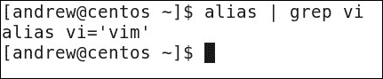

# 第一章。驾驭 vi

你可能对 vi 有一些了解，或者现在被称为 Vim（简单来说，vi 的改进版）。我常常发现，很多人第一次接触 vi 时的经历并不愉快，回想起来也没有什么好感。带领你走过最初难以理解的 vi 使用过程，我们会确保你成为 vi 的大师，并且渴望使用这个神奇的工具。vi 就像其他一切一样，你只需要在早期坚持下去，不断练习。还记得小时候你骑自行车时，尽管膝盖被摔伤过，你仍坚持了许久，最终成为了高手吗？我希望你也能在 vi 上坚持下去。我们将从一些命令行魔法开始，使整个**命令行界面**（**CLI**）体验更好。然后，我们就可以开始我们的 vi 黑带之旅了。

在本章中，我们将讨论以下主题：

+   **CLI 魔法**——你将喜欢的快捷方式

+   **Vim 和 vi**：在这一部分，你将学会区分这对双胞胎，并认识它们的图形化“表亲”

+   **获取你喜欢的 .vimrc 设置**

+   **查找和替换**：在这一部分，你将学会如何快速在文件中查找并替换文本，无论是在 Vim 内部还是外部

+   **学习用几次巧妙的按键删除文件中的多余注释**

# CLI 魔法——你将喜欢的快捷方式

所以，在我们深入探讨 vi 的精彩文本编辑世界之前，我们将先通过一些键盘练习来热身。Linux 是我的激情所在，自动化也是如此。我总是热衷于创建脚本来执行任务，使这些任务能够重复正确地完成。一旦脚本创建并测试通过，我们就会知道它每次都能以相同的方式运行，我们也不会犯错或遗漏关键步骤，不管是因为任务变得无聊，还是因为我们在周五晚上的加班时，只想早点回家。脚本编写本身就是对命令行的深入了解，并能够以最佳方式使用它。这一点在你将使用的所有系统中都适用。

在命令行中，我们可能会通过执行以下命令来尝试一些黑魔法：

```
$ cd dir1 || mkdir dir1 && cd dir1

```

这样，我们使用了 `cd` 命令进入 `dir1` 目录。双竖线（或管道符）表示只有在第一个命令失败时，我们才会执行下一个命令。这意味着如果我们无法切换到 `dir1` 目录，我们将运行 `mkdir dir1` 命令来创建该目录。如果目录创建成功，我们会进入该目录。

### 提示

`||` 部分表示只有在第一个命令失败时，第二个命令才会执行。`&&` 部分表示只有在第一个命令成功时，第二个命令才会执行。

命令历史记录比仅仅使用上箭头键要更强大得多！请看以下命令：

```
$ mkdir dir1
$ cd !$

```

`!$` 部分表示最后一个参数，因此第二行的命令会被解析为以下内容：

```
$ cd dir1

```

这样，我们可以通过结合这两个概念，重写最初的命令序列，生成以下命令：

```
$ cd dir1 || mkdir !$ && cd !$

```

我们可以重复上一个命令以及最后一个参数。更重要的是，我们可以指定最后命令的起始字符。如果只是最后一条命令，按上箭头键就足够了。如果我们正在处理网络服务器的配置，可能需要用 vi 编辑配置文件，启动服务，然后用命令行浏览器进行测试。我们可以通过以下三个命令来表示这些任务：

```
# vi /etc/httpd/conf/httpd.conf
# service httpd restart
w3m localhost

```

在正确顺序下运行这三条命令，并希望成功后，我们可能会注意到我们仍然遇到问题，需要重新编辑 Apache（网络服务器）的配置文件。现在我们可以将命令列表缩短为以下内容：

```
# !v
# !s
# !w

```

`!v` 命令将重新运行我历史记录中以 `v` 开头的最后一条命令，`s` 和 `w` 同理。通过这种方式，我们看起来非常熟练，工作得也很迅速，从而可以有更多时间做我们真正感兴趣的事情，也许打个短的 9 洞高尔夫？

类似于我们第一次查看历史记录时，使用 `!$` 符号表示最后一个参数，我们可以使用 `!?73`。这将查找 `73` 作为参数或参数的一部分。在我当前的历史记录中，这将与我们之前运行的 `date` 命令相关。我们来看一下：

```
$ !?73

```

使用我的历史记录，序列将扩展并运行以下命令：

```
$ date --date "73 days ago"

```

从我执行的最后一条命令到第一条命令查看我的命令历史记录，我们搜索 `73` 作为命令参数。我们注意到，我们只搜索 `73`，意味着我们在寻找字符 `7` 后跟字符 `3`。我们还必须记住，如果历史记录中存在 `273` 或 `733`，也会匹配到它们。

掌握了 Bash shell 历史功能后，我们应该练习使其成为第二天性。

# Vim 和 vi

啊，是的，Vim 和 vi！它们听起来像是某种古老的神秘药水，能够确保长寿和智慧。然而，它们并非如此。

命令行文本编辑器 vi 最早写于 1976 年，并在 1978 年成为 BSD Unix 首次发布的一部分。尽管它是基于命令行的，没有 **图形用户界面** (**GUI**) 或菜单，但 Linux Journal 在 2009 年进行的调查发现，vi 是最受欢迎的编辑器，甚至超过了图形界面的 GNOME 编辑器 gedit，排在第二位。我并不反对 GUI，但我发现 GUI 编辑器限制多，速度较慢。我可以诚实地说，大部分甚至是所有任务，在 vi 中我能更快速地完成。

话虽如此，在 CentOS 中，你不会找到 vi；vi 只是一个默认的别名，提供给用户方便使用，并链接到 `vim` 命令。我们可以通过以下命令在我的 CentOS 6.5 控制台上查看这一点：

```
$ alias | grep vi

```

命令的输出应类似于以下屏幕截图：



Vim 是**Vi IMproved**的缩写，最初由 Bram Moolenaar 在 1991 年发布，最初针对 Amiga 系统。自 2000 年代初以来，它在 Linux 平台上变得非常流行。顾名思义，它基于 vi 并加以改进；在 CentOS 中，它通过`vim-enhanced`包分发。这些改进最常用的功能是针对 PERL、Python 和 PHP 等语言的语法高亮功能。另一个改进是它可以在命令行上传统使用，或者使用 GUI 前端。要安装 Vim 的图形界面，你需要添加`vim-X11`包，方法如下：

```
# yum install -y vim-X11

```

### 提示

当然，有一个限制，你需要运行 X11 服务器。在企业环境中，服务器通常不带 GUI，你可以通过安全外壳连接仅提供命令行的环境。

如果你是 vi 的新手，那么使用图形版本可能会很有帮助，因为菜单中还会显示命令行快捷键。要在命令行中用 vi 或 Vim 编辑文件，我们可以简单地使用类似下面的命令：

```
$ vi <filename-to-edit>

```

当你在 CentOS 桌面上工作时，可以通过以下方式使用编辑器的图形版本：

```
$ gvim <filename-to-edit>

```

或者

```
$ vimx -g <filename-to-edit>

```

我建议使用`gvim`命令，因为它不需要额外的选项，也更少引起混淆。直接启动`vimx`而不加`-g`选项，只会启动普通的 Vim 程序。

# 设置`.vimrc`文件以符合你的喜好

和许多 Linux 程序一样，Vim 也可以从运行控制文件中读取设置。设置可以通过`/etc/vimrc`文件集中管理，或者通过`~/.vimrc`文件为每个用户配置。通过这个文件，尤其是我们的个人版本，你可以自定义 Vim 的外观并控制其功能。

首先，我们来看看行号。当我们编辑文件时，通常是在控制台报告某一行出错之后，我们刚尝试运行脚本或启动服务时；我们知道我们有语法错误。假设我们想直接跳转到`test.php`文件中的第`97`行。那么，我们应该输入：

```
$ vi +97 test.php

```

这是假设我们在与文件相同的目录中。类似地，如果我们想直接跳转到`readme`文件中第一次出现的`install`单词，我们可以执行以下命令：

```
$ vi +/install readme

```

然后，仿佛凭空魔力，我们就被带到了所需的正确行。不过，在`search`这个词的情况下，`search`这个词会被高亮显示。如果不希望这样，可以简单地关闭这个功能。在 Vim 中，我们可以输入：

```
:nohlsearch

```

如果我们想在 Vim 中做一些永久性的设置，可以编辑我们家目录下的`.vimrc`文件。这是我们个人的设置文件，因此，做出的更改不会影响到其他人。如果我们想影响全系统的设置，则可以使用`/etc/vimrc`文件。尝试在`~/.vimrc`文件中添加以下行，来持久地禁用高亮显示`search`功能：

```
set nohlsearch

```

有了这个设置，每次启动 Vim 时，设置都会为我们准备好。然而，在我们查看文件时，可能会更倾向于开启行号显示。有时这会让工作变得更加简单，但有时我们可能更希望关闭行号显示，特别是当文件中某些行以数字开头时（因为显示可能会变得混乱）。要启用行号显示，请运行以下命令：

```
:set number

```

要关闭行号显示，我们可以使用以下命令：

```
:set nonumber

```

如之前所述，我们始终可以将期望的启动值放入 `.vimrc` 文件中。然而，在此之前，让我们看看 Vim 中的键映射以及如何创建一个快捷键来切换行号的显示与隐藏。我们希望为 Vim 中的普通模式创建一个映射。这是我们首次进入 Vim 时的模式，在此模式下我们并不进行编辑，只是浏览文件；通过按 *Esc* 键，我们始终可以返回到普通模式。执行以下命令：

```
:nmap <C-N> : set invnumber<CR>

```

`nmap` 命令表示我们仅为普通模式创建一个映射。我们将 *Ctrl* + *N* 键映射为运行子命令 `:set invnumber`，然后按 `<CR>`。

配置好这些后，我们可以使用 *Ctrl* + *N* 的组合键来切换行号的显示与隐藏。现在我们已经开始在这个工具上有所进展，你也许能体会到它为什么如此受欢迎。在我们对 `.vimrc` 文件进行最终编辑之前，我们将看到如何在 vi 或 Vim 中按行号跳转。确保我们处于普通模式下（通过按 *Esc* 键），我们可以使用 `2G` 或 `2gg` 跳转到当前文件的第 2 行；同样，`234G` 或 `234gg` 会跳转到第 234 行，`G` 或 `gg` 会跳转到文件的末尾。这很简单，但仍不够简单；我更希望输入行号并按 *Enter* 键。为此，我们将 *Enter* 键映射为 *G*。如果我们选择在没有数字前缀的情况下按 *Enter* 键，那么将直接跳转到文档的末尾，就像单独使用 *G* 键一样。执行以下命令：

```
:nmap <CR> G

```

现在，我们只需输入期望的行号并按 *Enter* 键。此操作会被解释为输入的行号后跟 *G*。通过这种方式，我们可以轻松跳转到正确的行。我们可以通过将以下内容添加到 `.vimrc` 文件来保存这个设置，当我们查看这个子章节中所做的所有设置时，文件内容应该类似如下：

```
set nohlsearch number
nmap <C-N> : set invnumber<CR>
nmap <CR> G

```

现在坐下来享受你所取得的成就，但请记住，练习是知识保持的关键。

# 查找与替换

所以我们并不是在执行“搜索并摧毁”任务，但如果这能增加学习的乐趣，我们也可以开始一个搜索和替换任务。Linux 的命令行上有大量的强大功能，其中之一就是流编辑器 sed。即使不进入 Vim 编辑器，我们也可以在单个文件甚至多个文件中搜索和替换文本。无需使用交互式编辑器为我们提供了更多的管理范围，能够在单个或多个服务器上脚本化更新。`sed`命令中的功能可以在 Vim 中使用，也可以作为独立应用程序使用。在本小节中，我们将学习如何使用 sed 和 Vim 在文件中搜索和替换文本，掌握在 CentOS 及其他操作系统（包括 Mac 上的 OS X）中使用的技能。

首先，假设我们最近更改了公司名称，并且需要将文本文件中所有的`Dungeons`引用替换为`Dragons`。使用 sed，我们可以直接从控制台运行命令：

```
$ sed -i 's/Dungeons/Dragons/g' /path/file

```

这将逐行读取文件，并将所有出现的`Dungeons`替换为`Dragons`。`-i`选项允许就地编辑，意味着我们可以直接编辑文件，而不需要将 sed 的输出重定向到新文件。`g`选项允许替换在每行中出现的所有`Dragon`实例，即使它出现多次。

在 Vim 中打开文件并做相同的操作，运行以下命令：

```
:%s/Dungeons/Dragons/g

```

百分号符号用于指定范围为整个文档；而如果我们使用以下命令，则只会搜索包含搜索字符串的第 3 到第 12 行。在这种情况下，范围被称为第 3 到第 12 行，而使用`%`时，范围是整个文档。

```
:3,12s/Dungeons/Dragons/g

```

当我们想要缩进文件中的某些代码时，范围非常有用。在以下的代码中，我们再次搜索第 3 到第 12 行，并在每行的开始处添加一个 Tab：

```
:s/3,12s/^/\t/

```

我们已经在上一个命令中将 Vim 中的范围设置为表示第`3`到`12`行。这些行可能代表我们想要缩进的`if`语句的内容。例如，我们首先搜索符号`^`（行的开始），并将其替换为一个 Tab（`\t`）。由于每行的开始位置显然只有一次，因此不需要使用全局选项。使用这种方法，我们可以根据需要快速为文件添加缩进，再次成为 Vim 的 Zen 超级英雄。

# 学会用几下巧妙的按键删除文件中的多余注释

既然我们是管理员，搜索和替换的禅宗大师，我们可以利用这些技巧来整理那些通常包含数百行注释的配置文件。我不介意文档，但当它成为压倒性的多数时，它会占据一切。考虑一下 `/etc/httpd/conf/` 下的 `httpd.conf` Apache 配置文件。这个文件有 675 行注释。我们或许希望保留原始文件作为参考。于是我们首先通过执行以下命令来做个备份；我们从本书的*前言*中已经学会了如何做，如果你还没有阅读前言，现在是时候阅读它了，免得以后收到父母的来信。

```
# cd /etc/httpd/conf
# cp httpd.conf   httpd.conf.$(date +%F)

```

我们可以轻松地使用以下命令列出注释行，该命令统计以 `#` 符号开头的行，即注释：

```
# egrep -c '^#' httpd.conf

```

在我的系统中，我们发现有 675 行这样的注释。使用 `sed` 或 Vim，我们可以首先通过 sed 删除注释，方法如下：

```
# sed  -i '/^#/d' httpd.conf

```

然后，在 Vim 中打开文件时，操作会稍有不同：

```
:g/^#/d

```

两个示例中的结果是相同的，我们都通过大约三分之二的行数减少了文件的行数。

# 总结

在每一章中，我都希望确保你至少能获得一项有价值的内容，能带走并应用到实际中；这一章我做得如何？如果你还记得，我们回顾了一些有助于有效导航命令历史的快捷键。接着，我们迅速了解了文本编辑器 vi 或更常用的 Vim。对于那些需要一些帮助才能入门 Vim 的人，我们还有 gVim 可供使用，如果我们在桌面上工作的话。定制任何系统都很重要，它能让我们感觉自己拥有这个系统，并且它为我们服务。使用 Vim 时，我们可以编辑位于主目录中的 `.vimrc` 文件。通过一些额外的按键映射和期望的选项，我们为 Vim 添加了一些装饰。从那时起，我们就直奔工作，看看 Vim 能做什么，如何使用我们之前复习过的搜索、替换和删除选项。
