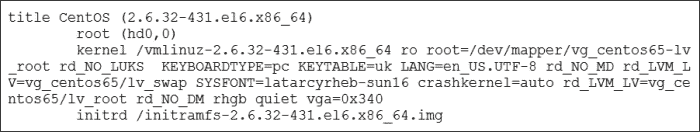
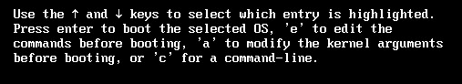

# 第二章。冷启动

在北半球，我想我们都能理解冷启动的比喻：那些寒冷的 1 月早晨，你拼命尝试启动汽车。当它最终勉强发动时，我们还得忍受方向盘冰冷得无法握住。幸运的是，启动 Linux 系统并不那么不愉快；或许空调服务器房间与此有关系，我也不太确定……

在本章的学习过程中，我们将基于你已掌握的内容，帮助你更好地理解你的 Linux 系统。你将学习以下主题：

+   **GRUB 与 MBR**：在这一节中，你将学习**GRand Unified Bootloader**（**GRUB**）与**主引导记录**（**MBR**）之间的关系，GRUB 能够轻松地将它那仅有的 466 字节放入 512 字节的限制内。

+   **当根文件系统不是根文件系统时？**：在这一节中，我们将理解在 GRUB 配置段中使用的*root*指令的含义，这是我们需要克服的小障碍。

+   **在 GRUB 控制台工作**：在这一节中，你将学习如何启用一些强大的恢复工具。

+   **用密码保护 GRUB 菜单**：在这一节中，你将学习如何加强系统的物理安全性：无论是桌面还是服务器。

+   **通过 plymouth 进行启动界面显示**：为了让本节内容更加有趣，我们将看看可以在 CentOS 中使用的启动界面。到本章结束时，你的 Linux 系统将变得前所未有地“华丽”。

# GRUB 与 MBR

这不仅仅是一场比赛，看看我们能在章节标题中塞进多少个首字母缩略词，尽管在四个单词中，已经用了两个也算是一个不错的开始。**GRUB**是 CentOS 和 Red Hat Enterprise Linux 6 自带的引导加载程序。这个小小的启动代码用来加载内核，并允许我们双启动不同的 Linux 版本，甚至是与 Microsoft Windows 操作系统的双启动。GRUB 多年来一直是首选的引导加载程序，尽管也存在其他引导加载程序。这些包括：

+   **Lilo**：这是最早的 Linux 加载程序

+   **EXTLinux**：这是 SYSLinux 家族的一部分，包括以下内容：

    +   使用 EXTLinux 从固定磁盘启动

    +   使用 ISOLinux 从 CD 和 DVD 启动

    +   使用 SYSLinux 从 USB 设备启动

    +   使用 PXELinux 从网络启动

+   **GRUB2**：最近，GRUB2 开始作为 GRUB 的替代品出现，或者说作为现在所称的传统 GRUB 的替代。预计 GRUB2 将在 2014 年的 CentOS 7 中首次亮相。

GRUB 引导加载程序通常存储在可启动磁盘的 MBR 中。

### 提示

尽管通常存储在 MBR 中，但也可以将 GRUB 安装到分区的超级块中，或分区的前 512 字节中。

MBR 构成了磁盘的前 512 字节，允许最多存储 466 字节的引导加载程序；其余的空间将用来存储该驱动器的分区表。

我们可以使用 `dd` 命令将 MBR 备份到文件中，如下所示：

```
# dd if=/dev/sda of=/tmp/sda.mbr count=1 bs=512

```

`dd` 命令用于复制磁盘。在前面的命令中，我们从第一个磁盘 `/dev/sda` 读取数据，并将其备份到 `/tmp/sda.mbr` 文件中。我们没有复制整个磁盘，而是将备份限制为一个 512 字节大小的块。

现在我们已经有了 MBR 的备份，可以通过运行以下命令进一步调查此事实：

### 提示

以下命令可能会有破坏性，因为它们将销毁 MBR，所以如果你将在自己的系统上运行这些命令，请小心。我建议仅在测试系统上运行以下演示命令。

```
# dd if=/dev/zero of=/dev/sda count=1 bs=512

```

使用前述命令，我们已清除了磁盘 `/dev/sda` 中前 512 字节存储的数据。现在，MBR 已有效清除。我们可以使用以下命令来验证这一点：

```
$ lsblk /dev/sda

```

输出应该显示一个空的分区表。系统仍然可以使用，因为分区表驻留在运行系统的 RAM 中；然而，直到我们能够恢复 MBR，重新启动时将很快显示出我们面临的灾难。别担心，我们可以从备份中恢复 MBR。`dd` 删除的东西，`dd` 也能恢复，只需使用如下的 `dd` 命令。赶快，在别人注意到之前！

```
# dd if=/tmp/sda.mbr of=/dev/sda

```

我们不需要限制从指定文件读取的数据量。请记住，它仅包含组成 MBR 的 512 字节。稍微幸运一些，使用 `fdisk` 命令现在应该能正确显示以前的分区表，你可以开始松一口气了：

```
$ fdisk /dev/sda

```

### 提示

使用 `dd` 命令将磁盘完全擦除，并使用 `/dev/zero` 输入文件是非常有用的，尤其是当你希望在出售计算机之前清除磁盘，确保操作系统、应用程序，以及最重要的数据不随设备一起出售时。我们在第二个示例中使用 `fdisk`，因为 `lsblk` 从内存读取数据，而不是从磁盘。

一旦进入 GRUB，菜单将会显示，允许用户选择要进入的**操作系统**（**OS**）。通常，默认选择会在没有用户交互的情况下加载。我们可以使用 `/boot/grub/menu.lst` 文件来配置菜单选项。稍后你将了解更多关于此文件的信息。

# 根文件系统何时不是根文件系统？

现在我们需要分解文件中的菜单条目，识别出核心组件，以便理解它们如何与系统相关联，最重要的是，如何修正错误。

## 编辑 GRUB 诗句

GRUB 菜单中的每个条目被称为**诗句**，每个诗句将以 `title` 单词开头，包含以下三个指令：

+   `root`

+   `kernel`

+   `initd`

诗句的标题也将成为菜单中显示的项目。我们来考虑一个以以下标题开始的诗句：

```
title CentOS 6.5 OS
```

菜单将显示`CentOS 6.5 OS`作为可选择项，重要的是要注意，我们不会在文本周围添加引号，因为它们也会显示给用户。当然，除非你希望或需要显示这些引号；在 Packt Publishing，我们绝对不反对使用引号！

## 向节中添加根分区条目

紧接着节标题后面会有一行以`root`指令开始。这会告诉 GRUB 根文件系统的位置，而不是操作系统的根文件系统；简单来说，这应该指向分区表中被标记为可启动的分区。

我们可以使用`fdisk`或`parted`命令显示可启动分区。如果你使用`fdisk`命令显示分区信息，命令会类似于以下内容，我们希望列出系统中第一块硬盘的分区：

```
# fdisk -l /dev/sda

```

被标记为可启动的分区会用星号（`*`）表示。如果你使用`parted`命令显示分区表，你可以通过执行以下命令，按照启动标志来识别可启动的分区：

```
# parted /dev/sda print

```

### 提示

`fdisk`会用`*`标记可启动分区，而`parted`则会标记为`boot`。

可启动的分区可以是`/boot`，也可以是实际的根文件系统`/`。这与系统在安装时的配置方式有关。通常情况下，`/boot`会有自己的分区，以便引导加载程序更方便地访问。例如，传统的 GRUB 无法访问基于**逻辑卷管理**（**LVM**）构建的文件系统；这是 CentOS 6 中的默认分区方案。**冗余阵列的廉价磁盘**（**RAID**）阵列也适用相同的情况。

考虑以下节：

```
title CentOS 6.5 OS
  root (hd0,0)
```

从中我们可以确定，GRUB 应该将第一块硬盘上的第一个分区（驱动器和分区编号都从 0 开始）作为可启动分区。

总结来说，GRUB 节中的`root`指令指示 MBR 标记为可启动的分区。

## 向节（stanza）中添加内核条目

`kernel`指令将引导加载程序指向目标操作系统内核。该内核的路径将与 GRUB 根分区或可启动分区相关。如果路径是`/vmlinuz.version`，则表示内核位于可启动分区的根目录下，而路径`/boot/vmlinuz.version`则表示可启动分区是 Linux 或操作系统根分区。路径必须包含`/boot`目录，才能找到内核。

在内核文件名之后是加载内核时使用的参数，通常被称为内核选项。这些选项包括：真实根文件系统所在的设备名称和交换文件系统的设备名称，这些选项可以用于挂起系统，例如在笔记本电脑上构建。操作系统根的一个例子是 `root=/dev/sda2`；这是第一块硬盘上的第二个分区，或者 `root=/dev/mapper/vg_centos-vg_root`。这表示操作系统根是基于 LVM 构建的。需要挂起的交换文件系统通过 `resume` 选项进行指示。

以下是一个条目的摘录，表示启动分区是 `/dev/sda1 (hd0,0)`，操作系统根是 `/dev/sda2`，交换分区位于 `/dev/sda3`：

```
title CentOS 6.5 OS
  root (hd0,0)
  kernel /vmlinuz.version root=/dev/sda2 resume=/dev/sda3
```

如果操作系统根分区同时也是可启动分区，则相应的 GRUB 条目将类似如下：

```
title CentOS 6.5 OS
  root (hd0,0)
  kernel /boot/vmlinuz.version root=/dev/sda1 resume=/dev/sda2
```

我们可以看到，现在内核的路径是完整的操作系统路径，GRUB 根和操作系统根对应的是同一个分区。

在启动过程完成并且我们已登录的运行系统中，可以使用以下任一命令查看内核版本：

+   `$ cat /proc/version`

+   `$ uname -r`

你应该查看这两个命令，看看哪个最适合你的需求；`/proc/version` 文件会提供更多信息。不过，`uname -r` 命令总结了信息。这个系统是属于你的，你可以做出选择。

如果我们需要列出内核启动时使用的选项，可以通过以下命令显示这些选项：

```
$ cat /proc/cmdline

```

到这个阶段，我希望你对什么时候根文件系统实际上并不是真正的根文件系统，以及什么时候它可以是根文件系统有了更多的理解。现在，你准备好随时使用这个谜题来困惑你的同事了。实际上，这只是知道存储内核的分区在哪儿的问题；它将成为可启动分区的根。操作系统根是我们通常认为的根文件系统，但只有当系统完成启动过程后，才会这样认为。内核指令简单地指向内核文件，其路径是相对于启动分区根的路径，可能还包括我们希望在加载内核时传递给内核的任何选项。

### 提示

`/proc` 目录是一个伪文件系统，这意味着它是临时的，只存在于内存中。它包含当前运行系统的最新信息。这个目录值得你去熟悉。

## 向一个条目中添加 initrd

与`kernel`指令类似，`initrd`指令将指向初始化 RAM 磁盘；它是一个与访问操作系统根文件系统所需的驱动程序一起编译的迷你操作系统。RAM 磁盘在内核之前加载，并将操作系统根文件系统以只读模式挂载。在将其交给内核继续启动过程并挂载为读写之前，会执行文件系统完整性检查。这意味着内核不必将根文件系统的驱动程序内部编译，从而允许对操作系统根目录进行更多灵活的更改，并且内核更加精简。如果根文件系统发生变化或需要访问硬件的驱动程序发生变化，可以使用`mkinitrd`命令重新编译 RAM 磁盘。

继续我们的示例配置段，我们可以插入一行`initrd`指令，如下所示：

```
title CentOS 6.5 OS
  root (hd0,0)
  kernel /boot/vmlinuz.version root=/dev/sda1 resume=/dev/sda2
  initrd /boot/initramfs.version
```

为了不被前面简单的文本超越，以下截图展示了我的 CentOS 6.5 系统中一个实际 GRUB 配置段的摘录。



# 在 GRUB 控制台工作

当看到 GRUB 菜单时，除了选择我们希望启动的项外，我们还可以编辑现有项或进入 GRUB 控制台。通过在 GRUB 控制台工作，我们可以输入自己的一组命令。记住每个配置段应伴随的三部曲：

+   root

+   kernel

+   initrd

我们可以输入这些命令，但如果需要，也可以重新安装 GRUB。更简单地说，在控制台中，我们还可以编辑或附加到现有条目；使用*e*键，我们可以编辑一个条目，*a*键可以用来将选项附加到内核行。从以下截图中，我们可以查看这些选项：



编辑内核参数允许你指定要启动的运行级别目标；使用此方法，可以重置 root 用户的密码。

为了恢复忘记的 root 密码，我们可以将系统启动到运行级别 1；默认情况下，这将直接以 root 身份登录。

1.  首先，我们必须选择菜单中要启动的项。如果有多个选项，请不要按*Enter*键。

1.  高亮菜单项后，选择字母*a*。

1.  这将直接带你到内核行的末尾，在那里你可以添加数字 1 以启动到运行级别 1。

    ### 注意

    需要注意的是，*CentOS 系统管理要点*假设内核参数中尚未指定先前的运行级别。

添加数字后，只需按*Enter*键，系统将启动到单用户模式并以 root 身份登录。一旦系统启动后，你可以使用`passwd`命令有效地更改密码。

是可以防止这种行为的；我们必须小心，以避免阻止服务器的真正恢复机制。如果服务器有足够的物理保护，或许我们不需要做任何修改。然而，如果我们无法确保服务器的物理安全性，我们可以编辑`/etc/sysconfig/init`文件，将`SINGLE=/sbin/sushell`行更改为以下内容：

```
SINGLE=/sbin/sulogin
```

`sulogin`命令将提示输入 root 用户的密码。

### 提示

如果已设置`sulogin`并且你仍然需要以 root 身份进行紧急访问，可以通过将运行级别指定为`init=/bin/bash`而不是 1 来实现。

如果我们的启动情况有点严重，或者用人话说，系统无法启动，那么我们可以使用选项`c`进入 GRUB 命令提示符。通过使用`help`命令，我们可以确定在最小化的 shell 中可以使用哪些命令。要重新安装 GRUB 并正确加载驱动程序以访问启动分区，可以执行以下命令：

```
grub> setup(hd0)

```

上述命令将检查`/boot/grub/stage1`或`/grub/stage1`是否存在于可启动分区上。通过这种方式，它确定要使用哪个分区作为根，并将`stage1`文件复制到 MBR 中，并附带访问可启动分区所需的驱动程序。然后，我们可以选择通过`reboot`命令重新启动系统。

我们不仅可以使用 GRUB 控制台来修复 GRUB，还可以用它来启动系统并验证菜单项。通过指定用于启动的根文件系统，我们可以检查访问内核和`initrd`所需的路径。我们可以在 GRUB shell 中使用正常的 Tab 键补全来查看目录和文件名。

# 用密码保护 GRUB 菜单

现在我可以想象，所有关于从物理服务器获取 root 访问权限的谈话可能会让人感到相当震惊；事实是，这其实不应该让人担心，因为保护物理服务器的访问通常并不难或繁重。然而，如果希望或需要进一步加强安全性，可以通过 GRUB 密码轻松实现。任何密码设置通常会添加到在任何小节之前的全局部分。首先，让我们在设置密码之前回顾一些 GRUB 的全局选项。

在访问 CentOS 中的`/boot/grub/menu.lst`文件时，我们会看到文件的第一行是被注释掉的，并且是由安装程序**anaconda**生成的，文件名为`grub.conf`。

`menu.lst`文件确实存在于 Red Hat 和 CentOS 中，但它是作为指向`/boot/grub/grub.conf`的符号链接。根据传统 GRUB 文档，文件应该是`menu.lst`；CentOS 提供了这个链接，但我认为这个文件更合理的名称应该是`grub.conf`。

为了方便访问，符号链接`/etc/grub.conf`通过`/boot/grub/grub.conf`文件链接。然后，可以按如下方式访问该文件：

```
/boot/grub/grub.conf
/boot/grub/menu.lst
/etc/grub.conf
```

`default`指令将在超时前如果没有做出选择时，指引 GRUB 到默认的小节或条目。

```
default=0
timeout=5
hiddenmenu
```

在此，如果菜单加载后 5 秒内没有做出选择，我们将选择第一个段落，即段落 0。指令 `hiddenmenu` 会阻止菜单显示，除非按下 *Esc* 键。这在菜单中只有一个条目时尤为有用，这种情况很常见，因此非常合理且实用。

如果你需要防止用户选择菜单以外的选项，那么我们可以在全局设置中添加密码。这将确保，除非输入密码，否则只能选择菜单中提供的条目，且进入 GRUB shell 或附加、编辑条目的选项将被限制。以下代码片段演示了如何实现这一点：

```
default=0
timeout=5
hiddenmenu
password=secret
```

如果你不喜欢在 GRUB 菜单文件中看到明文密码，那么可以使用 `grub-md5-crypt` 命令。你可以按如下方式添加加密的密码：

```
default=0
timeout=5
hiddenmenu
password --md5 <password-hash>
```

你也可以直接为某个段落添加密码。为段落添加密码确保用户只有在知道密码的情况下才能从菜单中选择该选项。这样，如果你愿意，你总可以在菜单中设置一个运行级别 1 的条目，但可以通过密码进行保护，如下所示。

```
title CentOS 6.5 Single User
  password --md5 <password-hash>
  root (hd0,0)
  kernel /boot/vmlinuz.version root=/dev/sda1 resume=/dev/sda2 1
initrd /boot/initramfs.version
```

# 使用 plymouth 启动画面

一旦我们开始引导过程，并在将控制权交给内核之前，就可以显示启动画面。如其名所示，这控制了你在启动过程中可能看到的启动画面。在 CentOS 中，默认使用的是 plymouth 主题：rings。Plymouth 是启动画面管理器；如果需要，我们可以使用其他主题。部分主题是作为标准预装的，其他则包含在标准仓库中。更多主题可以在第三方仓库中找到。

当然，你可以构建自己的主题。实际上，一个最小的主题仅仅是一个壁纸。

## 应用不同的主题

在大多数启动过程中，除非 CentOS 是你的桌面机器，否则你不会看到启动画面。然而，我仍然建议使用 plymouth 将默认启动画面从 rings 更改为 basic。使用 basic 主题时，我们可以看到在启动过程中加载的服务，而不是仅仅显示启动进度的圆环。我谦虚地建议，如果你在启动过程中看到服务器界面，可能表示有问题，你可能希望看到加载的服务及其返回的消息。如果你想采取更轻松的方式，可以尝试 solar 主题。这个主题展示了一个行星和一些绕行的陨石，以说明启动过程。

在命令行中，我们显示默认主题如下所示：

```
$ plymouth-set-default-theme

```

要显示系统上可用的主题，我们可以使用如下命令：

```
$ plymouth-set-default-theme --list

```

CentOS 默认提供三个主题，如下所示：

+   **details**：此主题显示我们加载的服务

+   **rings**：这是默认主题，包含 CentOS 标志，标志下方有一个旋转的圆环

+   **text**：这是一个空白启动画面，只有显示器底部的水平进度条

所有这些主题都位于路径 `/usr/share/plymouth/themes` 的子目录中。如果我们想要将主题更改为`details`，可以使用以下命令进行。请注意，此命令需要几分钟来运行，因为该过程会重新构建 RAM 磁盘以包含新主题。

```
# plymouth-set-default-theme --rebuild-initrd details

```

完成这些步骤后，您可以重新启动系统，看到系统关闭时的不同之处。不再是无尽的环形进度条，我们将看到来自服务的有意义的关闭消息。

如果我们想要更加冒险，那么标准的 CentOS 软件仓库中还包括额外的主题：

+   渐显

+   太阳

+   spinfinity

要安装并设置主题`spinfinity`，请执行以下命令：

```
# yum -y install plymouth-theme-spinfinity
# plymouth-set-default-theme --rebuild-initrd spinfinity

```

从 spinfinity 主题的部分截图如下所示：


# 摘要

好了，我们到了又一个辉煌章节的结尾！你，我亲爱的读者，是的，就是你（这里只有你一个人），离进入 Linux 名人堂又近了一步。

我们现在应该已经能够理解，GRUB 是企业版 Linux 中常用的引导加载程序，它将包含用于启动操作系统的各种段落。每个段落包括三个命令。这三个命令组成的三巨头分别是 root、kernel 和 initrd。我们还确保能够编辑 GRUB 菜单并通过加密和非加密的密码牢固保护 GRUB 控制台。

最后，我们来到了浅水池，一个夏日傍晚的 Linux 水上游泳池，在这里，学习使用 plymouth 启动画面。这为 Linux 一天的黎明和黄昏增添了一抹色彩，或者在 spinfinity 的情况下增添了大量红色。

在接下来的部分中，我们将进入 CentOS 中的 Linux 文件系统，了解它们的组成和结构。从基于磁盘或逻辑卷的传统系统开始，我们将调查文件名与索引节点之间的关系，以及索引节点与数据之间的关系。然后，我们将深入研究链接、管道和套接字，最后，以查看**Better FS**（**btrfs**）结束。
