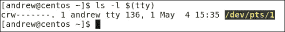
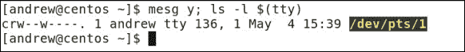
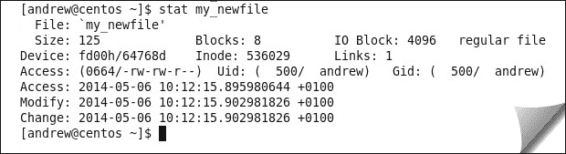

# 第三章 CentOS 文件系统——更深入的探索

所以我们知道我们的文件系统由文件和目录组成；它们都是文件，只是类型不同。那么，链接、管道和套接字呢？它们是什么，又是如何使用的？为什么我们要谈论链接？硬链接和软链接有什么区别？我想我需要坐下来思考一下。我能感觉到一阵晕眩即将来临。

让我们也挑战传统的文件系统设计；你可能曾经使用过**逻辑卷管理器**（**LVM**），但是让我告诉你那已经是上个世纪的事了。你将会被 BTRFS（Better FS）强大和简便的企业级文件系统管理所震撼。我们将在本章涵盖以下几个部分：

+   **魔术师的秘密**：我们揭示如何在不实际计算的情况下计算子目录的数量。

+   **特殊权限**：这将涵盖`wall`命令的尾部以及它如何与 GUID 位结合使用。

+   **命名你的管道**：我敢肯定你不希望没有名字，而你的管道也是如此。我们来探讨如何使用命名管道来实现**进程间通信**（**IPC**）。

+   **理解命令 stat**：这将涵盖你需要了解的所有有关 inode 和文件元数据的知识。

+   **企业级文件系统对决**：在 BTRFS 与 LVM 的对决中，BTRFS 毫无悬念地获胜。我们将看看 BTRFS 中的新特性，并探讨如何使用快照和扩展卷。

# 一个魔术师的秘密

我们知道这个世界上有很多团体的人可以也常常让我们烦恼；魔术师可能就是这些人之一。他们让我们烦恼是因为我们不知道他们是如何做到他们所做的；简单来说，我们知道自己被愚弄了，但却不知道具体怎么回事。好了，让我来打破魔术师圈子的荣耀，揭示一个可以用来愚弄你同事的小技巧，确保你会觉得这个技巧值得知道。

让我给你演示一下，如果我在我的 CentOS 6.5 系统上运行以下命令，我将看到指定的`doc`目录的长列表：

```
$ ls -ld /usr/share/doc

```

我系统上的输出如下：

```
drwxr-xr-x. 758 root root 36864 May 1 09:09 /usr/share/doc

```

显示的第一个数字，`758`，是*链接*计数。这表示与文件元数据硬链接的文件名数量；简单来说，这个目录有 758 个不同的名称。

从这个值出发，我可以明确地声明这个目录有 756 个子目录！

> *“这不是火箭科学，就是从一个数字中减去 2”*

公式很简单！对于给定的目录，子目录的数量等于硬链接计数的两倍。

我想是时候进一步调查一下了。当一个新目录被创建时，它的链接计数会初始化为 2；换句话说，每个新目录必须有两个指向它的名称。这包括目录名和名为` .`（就是一个句点）的文件。

事实上，在一个新目录中，通常会同时创建两个新文件：` .` 和 `..` 文件。

+   `.` 文件代表目录本身

+   `..` 文件代表父目录

自己试试；这样理解会更容易，也许能防止你过于迷惑：

```
$ cd
$ mkdir newdir 
$ ls -a newdir #Note the two files
$ ls -ld newdir # Note the hard link count of 2

```

以下截图显示了新目录以及其中两个隐藏文件的列表。BASH 中的颜色编码将这两个文件突出显示为蓝色，表示它们代表目录：


我相信，当你仔细思考时，你会发现我们总是使用点符号作为一种简写形式。请看以下使用 `cp` 复制命令的代码：

```
$ cp /etc/hosts .

```

在这里，我们使用单点符号从 `/etc` 目录复制 `hosts` 文件到当前目录。在下面的示例中，我们使用 `cd` 命令切换到父目录：

```
$ cd ..

```

现在我们可以开始理解目录的链接计数是如何与子目录数量相关的。如果文件名由两个点组成，表示父目录，那么对于我们在给定目录中创建的每个子目录，我们将会有一个新文件指向父目录。这些双点文件是硬链接到子目录的父目录的。

## 硬链接

在 Linux 文件系统中，我们有两种类型的链接：硬链接和软链接（或符号链接）。硬链接，正如我们所见，是文件的名称或多个名称。一个普通文件在首次创建时只有一个名称。我们可以使用 `ln` 命令为文件添加更多名称：

```
$ cd
$ echo "Hello" > my_newfile
$ ln my_newfile the_samefile
$ ls -li my_newfile the_samefile

```

我们将按照以下步骤演示我们在系统上执行的操作：

1.  我们移动到主目录。

1.  然后，我们创建一个新文件，内容是 `Hello`。

1.  `ln` 命令将原始文件链接到一个新名称 `the_samefile`。现在我们有两个文件名指向相同的元数据。两个文件的硬链接计数将为二；这两个名称指向相同的元数据。

1.  使用 `ls` 命令并带上长列表选项 `-l`，将显示硬链接计数。选项 `-i` 将显示文件的 inode 号。两个文件的 inode 号将是相同的。由于硬链接共享相同的 inode 号，源文件和目标文件必须位于同一个文件系统中。inode 是单个文件系统中的一个条目。

## 符号链接

符号链接，或有时称为软链接，是完全独立的文件，其数据指向另一个文件名；因此，它们可以跨越文件系统边界，比硬链接更有用。符号链接的文件类型为`l`，表示它们是一种特殊类型的文件。硬链接是常规文件，仅能通过硬链接计数来识别为链接。符号链接不会影响文件的硬链接计数；它们是完全独立的文件，拥有自己的名称、inode 和数据。符号链接的数据是指向目标文件的指针。在以下代码段中，我们可以看到符号链接的创建和显示：

```
$ cd
$ ln -s my_newfile the_linkedfile
$ ls -l the_linkedfile

```

让我们按照以下步骤在我们的主目录中创建一个符号链接：

1.  我们首先移动到我们的主目录。

1.  `ln`命令将原始文件链接到一个新名称`the_linkedfile`。选项`-s`将创建一个软链接。

1.  使用`ls`命令，其中选项`-l`用于长列表格式，我们可以从输出中看到，第一个字符表示文件类型，显示`l`表示该文件是符号链接。扩展输出还会显示目标文件的位置。

# 特殊权限

文件的权限或*模式*是我们熟悉的**读取、写入和执行**（**RWX**）。这些权限可以应用于三个对象：

+   用户

+   组

+   其他用户

标准权限通过其八进制表示形式展示，如果你想快速复习，可以参考如下：


在用户、组和其他权限之前，还有一个权限块。这一块用于特殊权限；但是，它并不表示 RWX，而是包含以下内容：

+   设置用户 ID 位（SUID）

+   设置组 ID 位（SGID）

+   Sticky 位

使用符号表示法，这些权限可以添加到`file1`，在接下来的演示中`file1`充当文件名的公理：

```
$ chmod u+s file1 #adding the SUID Bit
$ chmod g+s file1 #adding the SGID Bit
$ chmod o+t file1 #adding the Sticky Bit

```

## 设置用户 ID 位（SUID）

设置用户 ID 位（SUID）用于程序需要以除运行该程序的用户之外的其他用户 ID 运行时。当设置该位时，程序将以文件所有者的权限运行，而不是当前用户的用户 ID。这通常应用于某些简单程序；例如，密码程序`/usr/bin/passwd`就设置了这个权限。这样做是因为普通用户可以更改自己的密码，但没有权限写入`/etc/shadow`文件，密码正是存储在该文件中。无论谁启动该程序，程序都将始终以 root 用户身份执行。

如果你感到好奇，想看看系统中有多少文件包含此权限，那么`find`命令可能会对你有所帮助：

```
$ find / -perm +4000

```

命令会按原样搜索操作系统根目录`/`，查找包含 SUID 位的文件，`-perm +4000`。

## 设置组 ID 位（SGID）

与设置 UID 位类似，如果在可执行文件上设置了 SGID 权限，则程序将以文件所属组的组 ID 而不是当前用户的组 ID 来运行。这在 `/usr/bin/wall` 文件中默认设置，我们将通过执行以下命令再次深入了解：

```
$ ls -l /usr/bin/wall

```

从输出结果来看，权限为 `r-xr-sr-x`。小写字母 `s` 表示已经设置了 SGID 和执行权限。如果是大写字母 `S`，则表示没有为组设置执行权限。

查看 `/usr/bin/wall` 程序时，我们应该理解，这个程序用于向用户控制台发送消息；它是由 `tty` 组拥有的。通过设置 SGID 位，当任何用户执行这个程序时，他或她将以 `tty` 组的权限来运行。

登录到控制台的用户可以通过在 `mesg` 命令中使用 `y` 或 `n` 选项来控制这些消息：

```
$ mesg   #without options displays the current messaging state
$ mesg y #enables messages to be received in the console
$ mesg n #disables messages from being received in the console

```

我们本可以在这里结束，理解我们只是在启用和禁用控制台的消息传递功能。我们可以这么做，但这样我们就无法学习到与 SGID 位和 wall 程序之间的关系，也无法解锁理解所带来的知识泉源。在控制台中，我们将确定当前连接的是哪个控制台；`tty` 命令将在这里帮助我们。我的系统输出显示 `/dev/pts/1`。使用以下命令获取该设备文件的详细列表，将显示文件类型和权限。文件类型为 `c`，表示这是一个字符设备：

```
$ ls -l /dev/pts/1

```

从输出结果来看，我们可以看到文件的权限；组所有者是 `tty`，如果启用了消息传递，组将具有写权限。如果禁用了消息传递，组将没有权限。我们可以结合两条命令，使用我们在第一章*《驯服 vi》*中首次看到的括号扩展：

```
$ ls -l $(tty)

```

括号中的内容会首先被计算；计算结果会通过`ls -l`命令进一步处理。

在下图中，由于组没有写权限，消息传递已被禁用：



当我们启用消息传递并查看以下截图中的输出时，我们可以看到，神奇的是，现在组权限中已经显示了写权限：



我们现在已经稍微了解了一下本章开头提到的 Linux 魔法。此外，我们还看到了如何通过 `/usr/bin/mesg` 命令控制 `/usr/bin/wall` 命令的使用，从而将其应用于实际的 Linux 问题。

然而，SGID 的作用不仅仅局限于可执行文件。SGID 位也可以设置在目录上。当设置在目录上时，SGID 位确保目录中创建的所有新文件都由目录中的组所有。为了更好地理解这一点，假设我们的网页服务器的文档根目录（即网页存放位置）设置为 `/var/www/html/` 目录。如果我们将该目录的组所有权设置为 `apache` 组，那么我们就可以使用 SGID 位来保持所有创建文件的正确所有权。以下命令展示了这个复杂的操作：

```
# chgrp apache /var/www/html
# chmod g+s /var/www/html
# ls -ld /var/www/html

```

现在，每个在 `/var/www/html` 中创建的新网页将自动由 `apache` 组拥有。我们现在已经看到了 SGID 位在可执行文件和目录上的有效性。

## 粘滞位

最后的特殊权限是粘滞位。它用于目录，并在 CentOS 默认安装时设置在 `/tmp` 目录上。删除文件的能力由目录权限控制，而不是如一些人所想的那样，由文件的权限控制。当你创建或删除文件时，你实际上是在对目录进行操作。这意味着，在一个像 `/tmp` 这样的共享目录中，所有用户都可以写入该目录，因此，用户有可能删除任何文件。为了将删除权限限制为用户拥有的文件，粘滞位被应用于该目录。要将粘滞位权限添加到 `/data` 目录，我们可以使用以下命令：

```
# chmod +t /data

```

# 给管道命名

我相信我们都遇到过竖线或管道字符 `|`；我们可以使用它来创建命令管道，将一个命令的输出传递到另一个命令的输入。作为简单示范，我们可以使用以下命令，来说明我们通常会如何使用无名管道：

```
$ yum list installed | grep plymouth

```

第一个命令 `yum list installed` 列出所有已安装的软件包，结果会非常庞大；为了减少内容，我们使用第二个命令 `grep` 搜索 `plymouth` 字符串。两行代码通过一个无名管道连接在一起。之所以说它是无名的，是因为它是暂时的，只在两个命令运行的实例中存在，而这段时间的长度要比蜉蝣的寿命还短。

这种短暂的特性在每种情况下可能并不总是有用，这时我们可以创建命名管道，它是具有管道类型的文件。文件可以是以下几种类型之一：

+   普通文件

+   目录

+   符号链接

+   套接字

+   命名管道

+   字符设备

+   块设备

你应该对前三种类型非常熟悉，但我们通常较少看到其他类型，尽管我们在前一节中看到过字符设备文件`/dev/pts/1`，当时我们在查看 SGID 位时。字符设备实际上就是我们可以访问的终端。在这里，我们希望将焦点保持在管道的文件类型上，其中一些可能已经存在于你的文件系统中。我们可以使用`find`命令来查找它们，搜索文件类型为`p`的文件：

```
$ find / -type p 2>/dev/null

```

作为标准用户运行此命令时，你可能会遇到与我们没有权限的目录相关的错误；在这种情况下，通常更容易将错误重定向到`/dev/null`，正如我们在这里所做的那样。系统上运行`autofs`服务将创建命名管道：`/var/run/autofs.fifo-misc`和`/var/run/autofs.fifo-net`。

命名管道允许不同的进程相互通信或进行进程间通信。使用无名管道时，进程总是运行在同一父级层次结构中，换句话说，它们运行在相同的 BASH shell 中。因此，它们有用，但仅限于我们和我们狭隘的世界。然而，命名管道则打开了一个命令的输入，允许任何在该系统上运行的进程访问，而不考虑进程层级结构。这或许类似于你第一次意识到，世界上有比怀特岛更多的度假地的那一刻。像`autofs`服务这样的服务进程可能会连接到命名管道的输出，等待系统上客户端的输入，将我们从面对内向的小圈子（即无名管道）解放出来，进入更广阔的通信空间。

解释命名管道如何工作的最简单方法是通过演示它们。那么，为什么不打开两个终端窗口呢？如果更方便的话，这些可以是桌面上的图形终端。我将通过我的标准帐户保持登录状态，进入这两个窗口。

在第一个终端窗口中，我们可以输入以下一组命令：

```
$ cd  #move to your home directory
$ mkfifo my-pipe #create a named pipe called "my-pipe"
$ ls -l my-pipe #will list the file as type p
$ wc -l < my-pipe #We read in from the pipe and count the lines. As nothing is connected to the input we wait for something to process.

```

当第一个窗口等待输入时，我们可以切换到第二个终端窗口，并将数据输入到管道的输入端：

```
$ cd #move to your home directory where the pipe is located
$ ls > my-pipe #send the output of the ls command to the pipe

```

当我们在第二个终端中输入`ls`命令并查看输出时，第一个窗口将立刻显示结果。通过这样做，我们已经使两个独立的进程能够相互通信。

# 理解命令 stat

CentOS 命令行充满了工具，尝试学习它们所有的工具可能是一辈子的工作。就像所有任务一样，到达终点线的第一步始于第一步。我们的第一步将是深入了解`/usr/bin/stat`命令的世界。通过使用此命令，我们可以查询文件的元数据。CentOS 中的文件由以下部分组成：

+   文件名（硬链接）

+   文件元数据（inode）

+   数据

仅使用`stat`命令和文件名，我们可以查看完整的 inode 元数据。通过以下命令组可以演示这一点：

```
$ cd #move to your home directory
$ ls > my_newfile #list the contents and redirect the output to the new file
$ stat my_newfile #display the inode metadata

```

以下截图显示了`stat`命令的输出：



我们可以看到完整的元数据被显示出来，但如果我们选择的话，也可以只显示元数据的某些元素；例如，要以八进制格式显示文件权限，请运行以下命令：

```
$ stat -c%a my_newfile

```

要以人类可读的格式显示权限，请运行以下命令：

```
$ stat -c%A my_newfile

```

输出将显示`664`和`-rw-rw-r`，分别表示权限。inode 始终以八进制格式存储权限，但许多命令，如`ls`和`stat`，可以将其转换为更友好的格式。

inode 中存储了三个时间戳：

+   最后访问时间

+   最后修改时间

+   最后更改时间

## 最后访问时间

文件的最后访问时间列出了文件最后被读取的时间。这取决于文件系统是否维护最后访问时间；有一个挂载选项`noatime`可以防止最后访问时间被更新。要列出文件的最后访问时间，可以运行以下命令：

```
$ stat -c%x my_newfile

```

对我来说，当前时间是 10:12。如果我现在读取文件并再次运行命令，时间将发生变化：

```
$ less my_newfile
$ stat -c%x my_newfile

```

当前时间显示为 10:28。这对于了解系统中文件是否被读取非常有用。如果没有被读取，则可能意味着这些文件不再需要，可以归档到其他设备上。

## 最后修改时间

文件的最后修改时间表示文件本身何时被更改，即文件的数据。如果我们编辑文件然后检查最后修改时间，它将发生变化。

```
$ ls >> my_newfile #we now append another listing to the file
$ stat -c%y my_newfile #displays the last modified time

```

现在的时间是 10:36，而原始内容创建时是 10:12。

### 提示

`ls -l`命令的输出还会显示文件的最后修改时间。

## 最后更改时间

文件的最后更改时间与元数据更改的时间相关，而不是文件数据的更改时间。例如，改变文件权限将会更改最后更改时间：

```
$ chmod 640 my_newfile
$ stat -c%z my_newfile

```

我的系统现在显示文件的元数据在 10:41 时被更改。

# 企业文件系统对抗

LVM 已经是管理磁盘增长的方式多年，允许逻辑卷跨多个磁盘并通过快照进行备份。尽管 LVM 非常好，但仍然需要文件系统放在逻辑卷之上，因此会涉及额外的管理层级；需要记住的是，LVM 系统本身有三层管理：

+   **物理卷**：这些是提供给 LVM 系统的磁盘空间。

+   **卷组**：这些用于组织物理卷，以便提供给用户使用。

+   **逻辑卷**：这些占用了通过卷组提供的磁盘空间，并被呈现给文件系统工具进行格式化。

现在，仅仅因为我们在过去的十年左右使用过这些软件，并不意味着它可以毫无挑战地继续存在，即便是在企业中。我们现在看到**B 树文件系统**（**BTRFS**）被称为**更好的文件系统**，正在 Linux 中逐步普及。BTRFS 在版本 0.20 中可以安装，并且可以在 CentOS 6.5 上使用，尽管需要注意，它被标记为实验性。

## BTRFS 的优势

目前 Linux 内核树中有超过 55 种基于内核的文件系统，我们真的需要另一个吗？这里的第一个问题是，许多文件系统有着有限的或非常特定的使用场景；只有像 ext2、ext3 和 ext4 这样的 extN 文件系统才是通用的，尽管这些文件系统的最新版本 ext4 的大小限制为 16TB。BTRFS 扩展到 16 **艾字节**（**EB**），并带来了以前未曾出现的可靠性功能，具体如下：

+   非常快速的文件系统创建

+   数据和元数据校验和

+   快照功能

+   在线修复以解决问题

## 安装 BTRFS

在我使用的 CentOS 6.5 演示系统上，我们首先需要安装 BTRFS：

```
# yum install -y btrfs-progs

```

现在我们已经安装了相关工具，可以开始体验 BTRFS 的强大与简洁。我的实验室计算机当前在第二块硬盘上有四个额外的空闲分区；每个分区大小为 1GB，用于以下演示。

## 创建 BTRFS 文件系统

为了开始今天的演示，我们首先将在一个 1GB 的单一分区上创建一个 BTRFS 文件系统，将其挂载到`/data`目录，并按如下方式复制一些数据：

```
# mkfs.btrfs /dev/sdb5 
# mount /dev/sdb5 /data 
# find /usr/share/doc -name '*.pdf' -exec cp {} /data \; 
# btrfs filesystem show /dev/sdb5 

```

从这些命令中，你会看到我们复制了一些现有的 PDF 文件，为演示提供了真实数据，确保在演练过程中不会丢失数据。最后的命令行显示了文件系统并确认其大小为 1GB。

## 扩展 BTRFS 文件系统

我们可能会发现`/data`结构中的空间即将用完；虽然目前还没有用完，但我们可以设想一下。如果我们使用的是 LVM 结构，我们就必须运行几个命令来扩展现有文件系统，跨越新的分区或磁盘。这将是 LVM 中的过程：

旧方式的卷管理要求我们执行以下命令：

```
# pvcreate /dev/sdb6
# vgextend vg1 /dev/sdb6
# lvextend -L+1000M /dev/vg1/data_lv
# resize2fs /dev/vg1/data

```

## 使用 BTRFS 进行卷管理

如我们所见，执行这些命令时有四个步骤，所有命令都有一定的语法难度，容易让我们出错。我们现在可以看到如何使用 BTRFS 来完成这一过程：

```
# btrfs add device /dev/sdb6 /data

```

就是这样！我们所需要做的就是这些，现在我们已经有了一个 2GB 的卷。我们可以通过以下命令确认这一点：

```
# df -h /data
# btrfs filesystem show /dev/sdb5

```

两个命令将确认我们现在在卷中有 2GB 的可用磁盘空间，数据仍然存在且可以访问。卷的元数据被复制到两个分区中。通过这种方式，我们可以从任意设备查看卷信息：

```
# btrfs filesystem show /dev/sdb5
# btrfs filesystem show /dev/sdb6

```

两个命令将显示相同的数据，因为它们的元数据存储在两个设备上。

## 平衡文件系统

如果我们真的因为原始卷的磁盘空间不足而添加了额外的分区，那么我们现在可以按照以下方式平衡整个卷中的数据：

```
# btrfs balance start -d -m /data

```

`-m` 参数表示元数据，`-d` 表示数据。通过这种方式，磁盘会均衡使用。

## 添加条目到 /etc/fstab

一般来说，我们希望 `/data` 目录在启动时挂载，因此我们会在 `/etc/fstab` 文件中添加条目。在从该文件挂载时，我们必须引用所有的设备：

```
/dev/sdb5  /data  btrfs  device=/dev/sdb5,device=/dev/sdb6  0 0

```

通过这种方式，我们在 BTRFS 扫描不可用时指示设备构建的早期挂载过程。

## 创建一个 RAID1 镜像

软件**冗余便宜磁盘阵列**（**RAID**）也被 BTRFS 支持。目前支持的 RAID 级别如下：

+   RAID 0: 没有冗余的条带化

+   RAID 1: 磁盘镜像

+   RAID 10: 条带化镜像

如果需要，我们可以使用 BTRFS 软件镜像创建一个镜像设备。这并不会为我们提供额外的磁盘空间，但在磁盘故障的情况下提供容错能力。我们可以在我们的设置中模拟这一点，但因为所有分区都在同一块磁盘上，它对磁盘故障没有帮助，但这个概念是成立的。

```
# mkfs.btrfs -m raid1 -d raid1 /dev/sdb7 /dev/sdb8
# mount /dev/sdb7 /mirror

```

创建镜像时，我们分别使用 RAID1 为元数据和数据 `-m` 和 `–d`。可用的磁盘空间是 1 GB。我们写入`/dev/sdb7`的内容会镜像到`/dev/sdb8`；使用镜像时，我们失去 50% 的数据存储，但获得了较高的冗余性。

我们需要再次向 `/etc/fstab` 文件添加条目，如前所见，以确保系统在启动时正确挂载：

```
/dev/sdb7  /mirror  btrfs  device=/dev/sdb7,device=/dev/sdb8  0 0

```

# 使用 BTRFS 快照

分析到目前为止，BTRFS 还是挺酷的，你不觉得吗？不过，我们还没有完全挖掘它所能提供的所有优势。快照可以作为只读或读/写的数据副本来使用。实际上，没必要复制数据，因为它们在未改变的情况下是有效链接的。通过这种方式，可以瞬间创建一个大型文件系统的快照。你可以通过以下方式使用快照：

+   作为备份解决方案的一部分，如果你担心打开的文件会影响备份，可以创建只读快照，随后你可以备份该快照。通过这种方式，备份将是快照创建时主机文件系统的状态。

+   快照在你知道很多文件会在某个结构中发生变化，并且你可能希望快速恢复原始文件的情况下非常有用。比如当你使用脚本修改多个文件时，如果脚本的效果不如你预期、想象或希望的那样，你可以轻松地恢复到快照副本。

快照*必须*在与目标数据相同的文件系统中创建；正如我们之前提到的，快照的快速创建受到文件系统内部链接方式的影响。在 BTRFS 文件系统中，我们可以创建子卷。子卷允许在 BTRFS 文件系统中进行独立的管理标识。我们将对一个 BTRFS 子卷进行快照，并将其存储在同一文件系统中的另一个子卷中。

为了实现这一点，我们将在`/data` BTRFS 文件系统中定义两个子卷。定义子卷将创建文件系统中的目录以及 BTRFS 子卷实体。我们将创建第一个子卷的快照，并将其存储在同一`/data`文件系统中的第二个子卷中。我们不能对整个文件系统创建快照，因为快照的更改需要写回自身，这会导致无限递归；相信我，无限递归不是一件好事，不是好事，不是好事……

让我们首先创建这两个子卷：

```
# btrfs subvolume create /data/working
# btrfs subvolume create /data/backup

```

我们可以使用以下命令轻松列出子卷：

```
# btrfs subvolume list /data

```

在子卷到位之后，我们可以将现有数据移动到`/data/working`目录，从而让一些数据准备好进行快照。顾名思义，工作目录应该是存储我们实际数据的地方，它是我们组织的命脉。如果这些数据发生故障，我们的组织也会随之崩溃，我们也会失去工作。因此，理应小心管理这些数据。

```
# mv /data/*.pdf  /data/working

```

我们的场景是测试可能根据最后访问时间删除文件的脚本；我意识到我们不应该使用实时数据，但生活在边缘的感觉能让我们原本单调的生活充满活力。话虽如此，我们还没有完全失去对这些数据重要性的感知。在运行脚本之前，我们会创建一个数据的只读快照。

要创建工作子卷的只读快照，请执行以下命令：

```
# btrfs subvolume snapshot -r /data/working /data/backup/first-run

```

我们可以像之前一样使用以下命令列出可用的子卷：

```
# btrfs subvolume list /data

```

从输出中，我们可以看到快照显示为一个新的子卷。列出两个目录的内容应该表明它们的内容是相同的：

```
# ls /data/working
# ls /data/backup/first-run

```

`first-run`这个名称并不重要，但也许我们可以根据脚本第一次运行前、第二次运行前的数据创建多个快照。在这个阶段，快照实际上并没有占用任何空间，因为源和目标中的数据是相同的。如果我们删除了`/data/working`中的所有文件，那么 BTRFS 中的**写时复制**（**COW**）技术将会在`/data/backup/first-run`中创建这些文件。如果这些文件以任何方式被修改而不是删除，情况也是一样的；快照会保留文件在创建快照时的状态。在发生灾难时，我们可以简单地将文件复制回原始位置。

# 摘要

本章带领我们深入了解了 CentOS Linux 中的文件系统结构，并使我们能够探索像 BTRFS 这样的新技术。我们从了解如何通过`ls`或`stat`命令查看硬链接数量开始。这个数量显示了多少个文件名与一个 inode 或文件元数据相关联。理解文件的元数据使我们进一步研究了`/usr/bin/stat`以及它提供的选项，包括三种时间戳，它们不是末日预兆，而是文件本身的时间戳：最后访问时间、最后修改时间和最后更改时间。

一点关于特殊权限的探讨让我们了解了用户如何启用和禁用控制台消息，控制台文件由`tty`组拥有，写入权限可以被添加或移除。

最后，我们沐浴在 BTRFS 文件系统的荣耀中。这真的是一个现在就开始使用的技术，因为它将是未来几年内企业级文件系统的首选。将文件系统和卷管理合并在一个任务中，简化并极大地提升了管理效率。

现在你需要为 YUM 以及软件仓库管理工具 Yellowdog Update Manager 的盛宴做好准备，确保我们掌握的不仅仅是`yum install`这一点。
