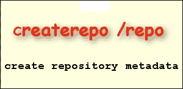

# 第四章 YUM – 软件如此美妙

现在是时候全面了解 **Yellowdog Updater Modified**（**YUM**）软件仓库系统，以及我们可以使用的各种工具来使其为我们服务。YUM 提供了 **Red Hat 包管理器**（**RPM**）软件包背后的强大动力。没有 YUM，你作为管理员需要自己找到 RPM 文件进行安装，并且所有的依赖 RPM 也需要手动处理；而 YUM 会为你做这一切。你将学习到有价值的、不为人知的选项，创建你自己的 RPM 文件，并将其添加到本地仓库中。在本章中，我们将涵盖以下内容：

+   **使用 RPM 文件管理软件安装**：我们将回顾 RPM 包管理的基础知识。

+   **创建你自己的 RPM 文件**：你将学习如何创建一个 RPM 文件，在此过程中了解 RPM 软件安装的工作原理。

+   **使用 YUM**：我们将发现 YUM 的强大，并学习所需的技能，以帮助我们更好地利用系统和网络。

+   **YUM 插件**：我们将概述 YUM 插件及可以添加到此系统的扩展功能。

+   **创建 YUM 仓库**：我们将使用 CentOS 的标准软件和我们自己的自定义 RPM 创建自己的仓库。拥有自己的仓库意味着安装源是我们系统的一部分，我们不需要依赖外部连接来安装软件。我们也可以选择与网络中的其他主机共享此仓库，从而增加我们自己仓库的好处。

# 使用 RPM 文件管理软件安装

Linux 管理中的一个元素，可以提供几乎每天的娱乐体验，就是管理你在 CentOS 桌面和服务器上的软件生命周期；这包括安装、更新和删除软件，软件的形式可以是程序、文档、驱动程序，或者任何在 Linux 中由一个或多个文件组成的内容。使用 RPM 文件安装软件比使用安装脚本更为推荐。通过基于 RPM 的安装，我们始终可以查询数据库，获取当前系统上已安装软件的信息。软件删除变得更加简化，因为我们有一个软件包添加的清单，并且知道哪些内容需要被删除。RPM 管理的一个大缺点是我们在安装需要其他软件的 RPM 文件时可能遇到的*依赖地狱*。我们可能能够找到所需的 RPM 文件，但在尝试安装第一个依赖包时，肯定会有更多的依赖关系需要追踪。

一个简单的演示可以是尝试安装 Foxit PDF 阅读器；它是 Adobe Reader 的轻量级替代品。如果我们直接从 Foxit 网站下载 RPM 文件[`www.foxitsoftware.com/downloads/`](http://www.foxitsoftware.com/downloads/)，我们可以在 CentOS 桌面上安装或尝试安装它。由于缺少依赖项，下面的命令几乎肯定会失败：

```
# rpm -i FoxitReader-1.1-0.fc9.i386.rpm

```

我们可以使用以下命令列出依赖项：

```
 # rpm -qpR FoxitReader-1.1-0.fc9.i386.rpm

```

当我统计系统中的依赖项时，发现直接从这个 RPM 包中需要解决 32 个依赖项；安装这些包时可能还会出现其他依赖项。仅使用`rpm`命令安装将需要很长时间。如果我们选择使用以下`yum`命令来维护安装，并且连接到具有所需依赖包的仓库，我们会发现整个过程变得容易得多，我也可以回去打高尔夫了！

```
# yum install FoxitReader-1.1-0.fc9.i386.rpm

```


回顾一些常用的基本 RPM 命令行语法，我们可以列出以下常用选项：

+   从 RPM 文件安装软件：`rpm -i <example.rpm>`

+   卸载 RPM：`rpm -e <example>`

+   更新现有的 RPM 或在未安装的情况下安装它。同时，显示进度为哈希标记或百分比：`rpm -Uvh <example.rpm>` 或 `rpm -Uv --percent <example.rpm>`

+   列出所有已安装的基于 RPM 的软件：`rpm -qa`

+   列出某个文件所属的 RPM：`rpm -qf /etc/hosts`

+   列出已安装包中的所有文件：`rpm -ql <example>`

+   列出 RPM 文件中的所有文件：`rpm -qpl <example.rpm>`

+   查看 RPM 版本：`rpm --version`

如果你需要定位 RPM 数据库，它位于`/var/lib/rpm`目录下。

你可能注意到，当引用已安装的包时，可以单独使用 RPM 名称，而在使用`rpm`命令与 RPM 文件时，必须使用完整的文件名和扩展名。文件名由以下组件组成：

```
<package><version><release><architecture>.rpm

```

例如，来看一下**Z shell**（**ZSH**）包的 RPM 文件。文件名为：

```
zsh-4.3.10-7.el6.x86_64.rpm

```

+   包名称：`zsh`

+   版本：`4.30.10`

+   版本：`7-el6`

+   架构：`x86_64`

要验证这一点，可以使用`-i`或*信息*选项查询包文件。在下面的命令中，我们使用`-q`进行查询，`-p`表示包，前面提到的`–i`。

```
$ rpm -qpi zsh-4.3.10-7.el6.x86_64.rpm

```

# 创建你自己的 RPM 文件

尽管我提倡使用 YUM 来管理软件安装，但我们仍然需要 RPM 文件。YUM 完全依赖于底层的 RPM 文件和基础设施；RPM 文件仍然是`yum`命令安装的软件包，这些 RPM 文件是 CentOS 软件管理的核心部分。

你可能会想起本书中的第二章，*冷启动*，当时我们在引导过程中研究了 Plymouth 主题；现在我们将创建一个简单的主题，在系统启动和关机时为我们的桌面或服务器添加公司品牌的壁纸。创建主题后，将其作为 RPM 文件分发到多个系统是最简单的安装方式。本章稍后我们将把 RPM 添加到 YUM 仓库中。

## 创建 Plymouth 主题

首先，我们必须创建主题，完成后，我们可以将其打包为 RPM 文件。我们的主题将包含三个文件，这些文件将位于一个目录内。该目录需要与它包含的三个文件一起添加到目标 CentOS 系统的`/usr/share/plymouth/themes`中的`themes`文件夹。

包含主题三个文件的顶级目录通常会以它所属的主题命名。我们正在创建`tup`目录来表示我们的主题，如下所示：

```
# mkdir /usr/share/plymouth/themes/tup

```

该主题，**The Urban Penguin**（**tup**），将包含三个文件：

+   `800.png`：这是将在启动画面中显示的壁纸。它必须是一个 PNG 文件。

+   `tup.plymouth`：这是包含主题清单的主主题文件。

+   `tup.script`：这是主题将运行的操作。这是最简单的基于脚本的主题形式，因此我们需要这个指令文件。

### tup.plymouth

`tup.plymouth`文本文件是主要的主题文件。

```
[Plymouth Theme]
Name=tup
Description=The Urban Penguin
ModuleName=script
[script]
ImageDir=/usr/share/plymouth/themes/tup
ScriptFile=/usr/share/plymouth/themes/tup/tup.script
```

正如我们在之前的示例中看到的，`ModuleName`设置为`script`意味着我们需要确保在自己的 RPM 中列出 RPM `plymouth-plugin-script`作为依赖项。在构建过程中，我们将使用所需的指令将其构建到 RPM 中。

### tup.script

Plymouth 脚本模块将在主题运行时执行`tup.script`文件。我们创建的脚本将只有一个精灵。精灵会将元素放置到启动画面或在系统启动和关机时看到的壁纸上。壁纸将根据屏幕的大小进行缩放，并确保每一行的末尾包括分号。这里使用的图片是`800.png`文件，但你可以使用任何添加到`theme`文件夹中的 PNG 文件。以下是一个示例脚本：

```
wallpaper_image=Image("800.png");
screen_width=Window.GetWidth();
screen_height=Window.GetHeight();
resized_wallpaper_image=wallpaper_image.Scale(screen_width,screen_height);
wallpaper_sprite=Sprite(resized_wallpaper_image);
wallpaper_sprite.SetZ(-100);
```

## 创建主题 RPM

为了构建 RPM，我们将作为标准用户工作，可以通过你自己的账户或专门用于构建 RPM 的账户（如果创建该账户，只需添加具有标准权限的本地或网络账户）。不过，最初我们需要 root 权限来安装构建环境所需的包：

```
# yum install -y rpm-build rpmdevtools

```

上述命令将安装我们用来创建 RPM 的工具。通过 YUM，我们需要能够连接到一个包含软件的仓库，但无需关心仓库的位置。设置好这些后，我们可以切换到用于打包 RPM 的账户。登录后，我们必须确保自己在主目录中，在那里我们将创建顶级目录，如下所示：

```
$ cd
$ rpmdev-setuptree

```

这将创建一个名为`rpmbuild`的目录，其中包含五个子目录，可以在下图中看到：


这些目录在构建 RPM 时成为工作目录。

首先，我们将在`SOURCES`目录下创建我们需要的目录结构：

```
$ cd ~/rpmbuild/SOURCES
$ mkdir -p plymouth-theme-tup-1/usr/share/Plymouth/themes/tup

```

我们创建的顶级文件夹基于将表示最终 RPM 的名称和版本号。名称将是`plymouth-theme-tup`，版本将是`1`。以下目录代表目标文件系统中的结构；我们需要将目标指向`/usr/share/plymouth/themes/tup`目录。

在目录设置好后，我们现在可以将构成主题的三个文件复制到新创建的目录中：

```
$ cp /usr/share/plymouth/themes/tup/* \
 plymouth-theme-tup-1/usr/share/plymouth/themes/tup 

```

现在我们需要创建一个包含文件夹结构的 gzipped 压缩包；在`~/rpmbuild/SOURCES/`目录下，我们可以运行以下命令来创建压缩包：

```
$ tar -czvf plymouth-theme-tup-1.tar.gz  plymouth-theme-tup-1/

```

构建阶段之前的最后一步是创建指令或规格文件。我们可以使用自己喜欢的文本编辑器在`~/rpmbuild/SPECS/`目录中创建此文件。我们将命名为`~/rpmbuild/SPECS/tuptheme.spec`文件：

```
Name: plymouth-theme-tup
Version: 1  
Release: 0
Summary: TUP Corporate Theme 
Group: System Environment/Base
License: GPL
URL: http://theurbanpenguin.com   
Source0: plymouth-theme-tup-1.tar.gz
BuildArch: noarch
BuildRoot: %{_tmppath}/%{name}-buildroot
Requires: plymouth-plugin-script
%description
Corporate Plymouth theme displaying the TUP wallpaper

%prep
%setup -q

%install
mkdir -p "$RPM_BUILD_ROOT"
cp -R * "$RPM_BUILD_ROOT"

%clean
rm -rf "$RPM_BUILD_ROOT"

%post
echo ..
echo "Adding theme…"
%files
%defattr(-,root,root,-)
/usr/share/plymouth/themes/tup/800.png
/usr/share/plymouth/themes/tup/tup.script
/usr/share/plymouth/themes/tup/tup.plymouth
```

这个文件看起来可能很复杂，但大多数设置都很直观。更重要的是？这可以作为任何交付文本文件、脚本、文档或几乎任何不需要编译的内容的 RPM 的模板。如果有需要编译的 C 源文件，我们需要添加一个`%build`部分。

有关 SPEC 文件的更多信息，请参阅可以在[`www.rpm.org/max-rpm/s1-rpm-build-creating-spec-file.html`](http://www.rpm.org/max-rpm/s1-rpm-build-creating-spec-file.html)找到的文档。

现在让我们来构建一个 RPM！

```
$ cd
$ rpmbuild -bb rpmbuild/SPECS/tuptheme.spec

```

RPM 文件将被创建在`~/rpmbuild/RPMS/noarch/`目录中。我们可以通过命令树的输出查看这个结构，如下图所示：


我们可以验证这些文件是否已正确添加到 RPM 中。这些文件是我们在本章早些时候查看过的主题，并且在 SPEC 文件的`%files`部分中进行了引用：

```
$ rpm -qpl ~/rpmbuild/RPMS/noarch/plymouth-theme-tup-1-0.noarch.rpm

```

我们还应该验证通过`Requires`指令添加到 SPEC 文件中的依赖项：

```
$ rpm -qpR ~/rpmbuild/RPMS/noarch/plymouth-theme-tup-1-0.noarch.rpm

```

如果没有脚本插件，RPM 现在无法安装。如果通过 YUM 安装，则依赖项会自动解析并根据需要安装。

## 使用 YUM

正如我们已经看到的，使用 YUM 管理 RPM 依赖关系要求大大简化了软件管理；几乎可以肯定，CentOS 的软件管理将像 **高级打包工具** (**APT**) 在基于 Debian 的系统中的作用一样，依赖于 YUM。

使用 YUM 安装软件时，不需要知道文件系统路径，甚至不需要知道 RPM 文件的位置。所需的软件包位于软件仓库中，仓库位置配置在 `/etc/yum.repos.d/` 目录下。该目录中创建的任何文件都应具有 `.repo` 扩展名。

在标准构建中，这些文件将被指向基于互联网的软件仓库；然而，你可以在自己的网络、文件系统或 CD-ROM 上配置本地仓库。稍后我们会讨论这一点。现在，我们将专注于 YUM 命令：

+   `yum install nmap`：从仓库中安装 `nmap` 包。我们知道这是从仓库而非本地文件中安装的。对于本地文件，需包括完整的文件名及 `.rpm` 扩展名，若需要，路径也应包括。在本节前面，我们已经看过如何使用 YUM 安装 Foxit PDF 阅读器的 RPM。

+   `yum list nmap`：这将显示包的信息，以及它是否已安装或可用。输出中还将列出安装该包或可用包的仓库。

+   `yum list installed`：这将列出所有已安装的软件包。

+   `yum check-update`：这将显示可用的更新。

+   `yum update nmap`：如果有更新可用，这将仅更新 `nmap`。

+   `yum update`：这将更新系统中的所有软件。

+   `yum remove nmap`：这将卸载 `nmap` 包。

## YUM 插件

尽管 YUM 是最常用的打包系统之一，许多用户和管理员并未意识到通过插件扩展可以使用更多的功能。

使用 CentOS，并阅读本书后，你将非常熟悉使用 `yum` 命令来安装包和更新系统。我们已经看到如何通过 YUM 扩展 RPM 系统，但这并不意味着我们可以忽略其他更多的功能。

插件是扩展 YUM 功能的 Python 脚本或程序。你可以在 `/usr/lib/yum-plugins` 中找到插件，而其配置文件位于 `/etc/yum/pluginconf.d/` 下。要使用任何插件，必须在 YUM 配置文件 `/etc/yum.conf` 中启用插件指令，如下所示：

```
plugins=1

```

要搜索可用的插件，可以使用以下命令：

```
$ yum search yum-plugin

```

在标准构建中，CentOS 会包含最快镜像插件等。这款插件的作用正如你所想，它会在下载包时自动寻找最快的镜像仓库。如果启用此插件，它会在使用 `yum` 命令时自动调用。

如果你只需要禁用单个插件，而不是所有插件，那么你需要确保在插件的配置文件中，`enabled` 指令被设置为 `0`。例如，要禁用最快镜像插件，你需要编辑 `/etc/yum/pluginconf.d/fastestmirror.conf` 文件，并将 `enabled` 行配置如下：

```
enabled=0

```

最快镜像插件已被禁用。要启用该插件，设置应如下所示：

```
enabled=1

```

另一个常安装的命令插件是 `security` 插件。它旨在与 `yum` 更新命令配合使用：

+   `yum --security check-update #仅列出安全更新`

+   `yum --security update #仅安装安全更新`

# 创建 YUM 仓库

创建 YUM 仓库的理由有很多。你可以想象一种情况，假设你的网络中有多个服务器。在这种情况下，本地获取软件会比让所有服务器都通过 WAN 访问包更有意义。同样的理由适用于 CentOS 桌面系统普及的环境。集中化软件分发是绝对必要的，它可以标准化所使用的软件，并确保你的支持团队只需要支持软件包的单一版本。

在一个仅用于测试和开发的虚拟机上建立本地仓库也非常有意义，这样就不需要依赖网络来安装软件包。我确保我的课堂虚拟机始终拥有一个本地文件系统仓库，这样系统就可以作为一个独立身份使用，而不依赖于网络或外部组件。



在这个小实验中，我们将使用产品 DVD 中的 RPM 文件创建一个本地仓库，并使用命令行工具 `/usr/bin/yumdownloader` 来添加以下所需的额外 RPM 文件：

1.  首先，我们将创建一个本地目录作为本地仓库；为了简化操作，我们只需在文件系统的根目录下创建一个目录，并将 RPM 文件直接放入该文件夹：

    ```
    # mkdir /repo

    ```

1.  在产品 DVD 被挂载后，我们可以将 DVD 中的 RPM 文件填充到该目录中：

    ```
    # rsync -av /media/<volume name>/Packages/  /repo

    ```

1.  我们可以添加本章前面为 Plymouth 主题创建的 RPM 文件：

    ```
    # cp /home/user/rpmbuild/RPMS/noarch/plymouth-theme-tup-1-0.noarch.rpm  /repo

    ```

1.  在有网络连接的情况下，我们将下载（而不是安装）那些不在 DVD 上的额外 RPM 文件，这些文件是我们仓库所需要的。实现这一目标的最简单方法是使用 `yumdownloader` 命令：

    ```
    # cd /repo;  yumdownloader --resolve kernel-source

    ```

1.  `--resolve` 选项将确保依赖包也被下载。默认情况下，它们会被下载到当前目录，因此请注意先将它们移入 `/repo` 目录：

1.  我们需要安装 `createrepo` 包：

    ```
    # yum install createrepo

    ```

1.  现在我们准备好创建仓库元数据，将文件目录转变为仓库：

    ```
    # createrepo /repo

    ```

现在我们已经能够创建本地仓库；在 YUM 客户端引用之前，该仓库不会被使用。这是通过在`/etc/yum.repos.d/`目录下创建一个扩展名为`.repo`的文件来实现的。现在，我们可以陶醉于我们创建的成功。这里的真正重要性在于通过使用`yumdownloader`获得的知识，以及它为仓库创建带来的力量，它可以将多个来源的选定软件包结合到自定义仓库中，供您和您的客户使用。

## /etc/yum.repos.d/

客户端系统需要告知它们的软件源或仓库的位置，这通过使用`.repo`文件来实现。虽然可以在单一文件`/etc/yum.conf`中定义所有仓库，但更合理的做法是将它们作为单独的文件添加到目录中，正如下面`yum.conf`文件中的摘录所示：


文件的名称其实并不重要，但扩展名必须是`.repo`。我们将创建一个名为`/etc/yum.repos.d/local.repo`的文件：

```
[c6-local]
name=CentOS-6.5 - Local
baseurl=file:///repo
gpgcheck=0
enabled=1
```

方括号定义了仓库的简短名称，name 指令更像是描述。`baseurl`指令使用了三个正斜杠：两个用于访问方法，此处为文件协议，第三个则是文件系统路径的斜杠。我们已经禁用了公钥检查（`gpgcheck=0`），但如果愿意，我们还可以为仓库元数据签名。该仓库已启用。

如果这是我们想要使用的唯一仓库，那么我们可以将现有的仓库文件移动到备份目录；这可能比通过为每个仓库添加`enabled=0`指令来禁用仓库更容易。通常，每个文件定义了多个仓库，因此任务并不简单。正如我所说，最简单的方法是将它们移动到另一个目录，然后在以后需要访问外部仓库时再将其添加回来。

现在，我们已经在`/etc/yum.repos.d/local.repo`文件中定义了本地仓库，我们现在可以通过 YUM 访问我们自己目录中添加的所有 RPM。如果我们需要通过网络将其共享给内部网络中的其他主机，只需添加一个 Web 服务器来提供仓库访问即可。客户端将使用`http://`协议作为访问方法。

第八章，*Nginx – 部署以性能为中心的 Web 服务器*，我们将学习 NGINX web 服务器，除了其他内容外，我们还将学习如何将**通用资源标识符**（**URI**）定向到这个仓库。

# 总结

恭喜你！你已经成功迈过了本章的另一个里程碑，离成为最精英管理员专属的圣殿又近了一步。接下来，我们将回顾本章的内容，通过这次回顾，我们获得了宝贵的经验，使我们能够更有效地管理系统上的软件。从原始的 RPM 文件开始，我们能够看到它们在管理和库存方面的强大优势，但烦恼在于必须定位它们的依赖关系。喜欢 RPM 的概念后，我们开始着手创建自己的 RPM 文件，用于分发和安装 Plymouth 主题；这是我们为了塑造系统品牌并强化身份而创作的主题。

不久之后，我们便更加熟悉了 YUM 仓库管理系统，该系统让我们可以充分利用 RPM 库系统，并结合自动解析依赖项的功能。本章的高潮是创建我们自己的本地仓库，构建一个能够在没有任何网络连接的情况下安装软件的独立系统。

在下一章，我们将获得宝贵的技能，用于维护 CentOS 6.5 系统上的服务和进程管理。我们将确保理解传统的 System V 服务脚本，以及新的 upstart 系统用于服务控制。此外，我们还将研究能够有效管理 CentOS 主机上运行的进程的工具。
