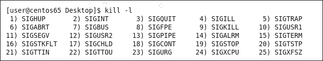

# 第五章。驯猫术 – 控制进程

很多 Linux 管理员，如果没有你这样的洞察力，通常会在 CentOS 的原生安装后就直接运行服务，而没有进行适当的配置。我们知道，能够证明我们所管理系统中的每个运行进程和服务的重要性是至关重要的，在这一章中，你将获得管理这些服务的深刻理解。与此同时，我们将看看替代了我们习惯使用的 System V 脚本的新 Upstart 服务。以下是我们将在本章中讨论的章节列表：

+   **使用 Upstart 管理服务**：研究如何在 CentOS 6.5 中使用 Upstart 和 `/etc/init` 与 `/etc/event.d` 目录来控制服务

+   **创建你自己的 Upstart 脚本**：学习如何为 Upstart 创建自定义启动脚本，以便在系统启动时管理你自己的需求

+   **管理进程**：通过练习来自 procps 包的一系列工具来管理运行中的进程：ps、pstree、pgrep、pmap 和 pkill

# 使用 Upstart 管理服务

多年来，我们一直习惯于使用 System V 初始化脚本来管理服务，这些脚本可以追溯到很多年前。然而，如果没有开放源代码社区中那么多人的努力和持续改进的精神，我们就无法前进和提升。在 CentOS 6.5 中，我们现在看到一些服务通过 `/etc/init` 目录中的配置来管理。这些服务使用了 Upstart。虽然这可能是短期的，因为 Red Hat Enterprise Linux 7 的测试版版本使用了类似的服务管理器 systemd，systemd 很可能会取代 Upstart。不过，Upstart 和 systemd 的管理方式非常相似，因此在这里讨论 Upstart 并没有问题。

首先，我们可以通过以下命令检查是否正在使用 `upstart`：

```
# yum list upstart

```

上述命令的输出应该会列出安装的包。该服务使用 `/etc./init` 目录作为其配置，我们可以在这里查看使用 Upstart 的服务。通过 `rpm` 命令，我们可以检查哪个包创建了这个目录：

```
# rpm -qf /etc/init

```

输出显示该目录属于 `upstart` 包。在 CentOS 中，我们只有少数几个服务是通过 Upstart 管理的；然而，我们会发现，使用这种机制配置自己的服务非常容易。

在`/etc/init`目录中，我们可以看到控制台屏幕由`upstart`通过`tty.conf`文件进行管理，还可以看到`splash-manager.conf`文件。该服务启用了重启和关机功能，在运行级别 0 和 6 时，请求 Plymouth 启动画面（记得 Plymouth 来自于第二章，*冷启动*）。Upstart 和 systemd 的一个优点是，我们不再需要像旧的 System V 脚本那样管理运行控制目录中的符号链接。查看`/etc/init/spash-manager.conf`文件，我们可以看到服务何时启动，而且这一切都直接提供，而不依赖于旧的符号链接。以下是一个 Upstart 指令的示例：

```
start on starting rc RUNLEVEL=[06]
```

上述行表示，Upstart 将在启动时以及切换到运行级别 0 和 6 时执行配置文件中的脚本。就这么简单。配置文件也可以包含运行服务所需的所有内容；这个文件成为我们寻找的独立服务，所有内容都包含在这个单一的配置文件中。

# 创建您自己的 Upstart 脚本

学习这些服务的最佳方法之一是创建自己的配置文件，包含 Upstart 脚本和与服务相关的所有条件。配置文件需要以`.conf`扩展名结尾，并且必须在`/etc/init`目录中创建。为了演示，我们将创建一个简单的服务，名称为经过充分研究和富有创意的`sample`。

使用文本编辑器 vi 创建`/etc/init/sample.conf`文件，服务开始初具雏形：

```
#/etc/init/sample.conf
description "Simple demonstration upstart script"
author "The Urban Penguin"
start on runlevel [35]
script
  logger -p local1.info "Starting upstart service"
end script
```

该服务本身仅使用 logger 程序写入 syslog 守护进程；我们可以从`/var/log/messages`日志文件中读取输出。当然，您可以调整服务以做更多的事情；但是，这为我们展示了服务如何简洁。

我们可以使用`/sbin/initctl`命令来测试服务：

```
# initctl start sample
# tail -n 1 /var/log/messages

```

如果像我们这里展示的那样，服务可以手动启动，如果没有手动启动，它将自动启动，或者至少在系统进入运行级别 3 或 5 时，发送消息到日志文件。


除了我们在这里使用的脚本选项外，我们还可以运行前置或后置脚本，尤其在服务是二进制文件时非常有用，我们需要确保它可以在某些环境中运行。可以使用`exec`指令来代替`script`指令，单个二进制文件将在脚本的位置运行。Upstart 服务的完整生命周期包括：

+   Pre-start

+   Post-start

+   主体（使用 exec 或 script）

+   Pre-stop

+   Post-stop

使用 Upstart 和/或 systemd 的优势在于，我们不再仅仅局限于为给定的运行级别启动服务；我们还可以为诸如磁盘（或块设备）添加或其他服务启动等事件启动这些服务。许多基于事件的服务可以在`/etc/event.d`目录中找到。

我们可以使用`/sbin/initctl`命令来控制 Upstart 服务。要查看可用的选项，可以使用带有`help`选项的以下命令：

```
# initctl help

```

输出将显示可以使用`version`选项检查正在使用的 Upstart 版本，如下图所示：


# 管理进程

本章的大部分内容将介绍`procps`软件包和一系列我们可以使用的 p 命令，以帮助我们管理进程，确保我们能充分理解这些工具从命令行中提供的强大功能。

许多管理员习惯使用`ps`命令来确定正在运行的进程，并且经常将输出通过管道传递给`grep`来搜索给定的进程名称。虽然这样做没有错，但我们可能更倾向于使用能简化这些步骤、专门为此目的设计的工具。目前，我们将忽略`/ps`命令，而倾向于使用具有明确用途的更专业工具。

## 使用`pgrep`命令

`/usr/bin/pgrep`命令实际上成为了我们经常使用的`ps`和`grep`管道的轻松替代。例如，如果我启动了 Apache Web 服务器，我可以轻松检查该服务正在使用的**进程 ID**（**PID**）：

```
# service httpd start
# pgrep httpd

```

命令的输出如下：


从输出中，我可以看到最低的 PID，在我的例子中是**3950**。这将是主要的守护进程，它将生成子进程。考虑到我们喜欢轻松的生活，可以看出通过将父进程作为参数，使用`pstree`命令，我们可以毫不费力地将子进程添加到父进程。在我的例子中有八个子进程，根本不需要用拇指去数它们。

```
# pstree 3950

```

这是前一个命令的输出：


## 使用`pstree`命令

这个工具被低估了；我相信许多管理员只知道执行命令而不加任何参数或选项。我们已经看到在前面的示例中它有多强大，但当然还有更多功能。

`pstree`命令在没有任何参数或选项的情况下运行时，将列出从 PID 1 开始的所有正在运行的进程树，以层级结构的形式显示每个进程，并通过**父进程 ID**（**PPID**）和 PID 相互连接。

更进一步，我们可以使用`-h`选项，它将高亮显示我们运行`pstree`的进程树：

```
$ pstree -h

```

以下截图显示了从`pstree`中高亮显示的摘录：


从之前的截图中可以看到，我们是在`gnome-terminal`中运行`pstree`命令的，并且我们曾在**替代用户**（**SU**）环境中运行 Bash shell；这一切都清晰地展现在我们眼前。

执行类似的命令，我们可以用以下命令高亮显示运行在 PID `3950`的`httpd`进程树：

```
$ pstree -h 3950

```

在我的系统上，可以从下面的截图摘录中看到这一点：


使用`pstree`命令并加上`-a`选项，会显示进程及其启动时使用的任何参数。这对于查看某个服务是否使用了正确的配置选项非常有用：

```
$ pstree -a

```

## 使用 pkill 命令

当我们从本章开始的地方重新考虑时，了解到许多管理员习惯使用`ps`命令并将其与`grep`结合使用，我们应该质疑首先运行`ps`命令的必要性。也许我们这么做是为了终止一个进程。我们之前已经展示了如何通过`pgrep`简化和精简`ps`/`grep`管道；然而，现实是，我们可以通过`pkill`进一步简化这一过程。假设我们正在运行 CentOS 桌面，并且在使用 Firefox 浏览器时注意到它变得没有响应，我们可以直接使用`pkill`命令来解决这个问题：

```
$ pkill firefox

```

当然，Linux 中的进程名称是区分大小写的，但你会习惯那些你可能经常需要通过`pkill`来清理的进程名称。

我们也可以终止某个特定用户所拥有的所有进程。也许他们做了什么很糟糕的事情，他们的会话完全没有响应。我们可以尝试：

```
# pkill -9 -U bob

```

上述命令将向用户`bob`所拥有的所有进程发送`-9`终止信号。

如果我们只需要关注一个终端中的进程，那么我们可以使用以下命令：

```
# pkill -9 -t tty2

```

这将终止在`tty2`控制台中运行的所有进程。如果我们拥有这些正在运行的进程，我们可以以自己的账户执行`pkill`命令。如果我们没有拥有这些进程，那么命令需要以 root 用户身份运行。在之前的示例中，我们一直使用`-9`信号，因为我们希望确保删除所有进程。为了最佳实践，最好以以下方式运行命令：

```
# pkill -15 -t tty2
# pkill -9 -t tty2

```

这样，我们首先发送终止信号（`-15`），然后再发送杀死信号（`-9`）。这样，如果进程响应初始的终止请求，则会优雅地关闭；那些对终止信号没有反应的进程，则会在最终的终止信号下被清理。

仅仅因为一个进程没有响应终止请求，并不意味着该进程已经挂起；例如，bash shell 不会响应终止请求，它必须被直接杀死。这就是程序的编写方式。

要查看可以发送的信号列表，我们应该使用`/usr/bin/kill`命令并加上`-l`（列出）选项，如下所示：

```
$ kill -l

```

以下屏幕截图中可以看到部分输出：



尽管存在许多可能的信号，但如果程序要响应信号，必须将它们写入程序中。这就是 `-9` 或 `-sigkill` 选项有用的地方，尽管它比较突然，但该信号直接与 `init` 交互来移除进程，而不是依赖应用程序做出响应。

## 使用 pmap 命令

`procps` 包中的另一个有用工具是 `pmap` 命令，我们可以用它来获取正在运行的进程的信息。简而言之，它会显示进程正在使用多少内存，以及它使用的任何库模块。

要获取当前 shell 的 PID 信息，我们可以使用特殊变量 `$$`；因此，`pmap $$` 将显示我当前 shell 的进程映射：

```
$ pmap $$

```

输出看起来非常令人印象深刻；首先，我们看到在此系统中，`$$` 被解析为 PID 7259 和 `/bin/bash`。随着进程映射的继续，我们看到地址列，接着是 `/bin/bash` 每个组件所使用的内存大小。

从以下部分截图中，我们可以看到从 `pmap` 命令获取的输出：


# 总结

在本章中，我们花了一些时间了解 CentOS Linux 中的 `procps` 包及其能揭示的所有宝贵资源。包中的工具对管理员来说是一个金矿，在我们选择最有效的工具来检查进程时，它们可以节省我们大量宝贵的时间。通过实践，我们已经看到了如何轻松使用 `pgrep` 和 `pkill` 命令来简化我们的进程管理，而像 `pmap` 这样的工具则更适用于诊断系统资源的使用。

在我们准备进入下一章之前，我们将了解一些在 CentOS 6.5 系统上管理用户时可以使用的宝贵快捷方式。
