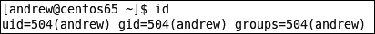
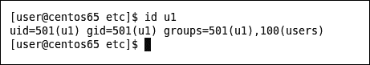
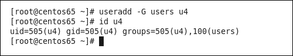
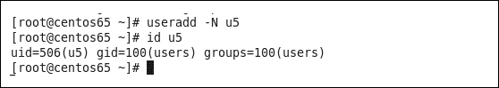
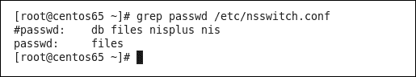
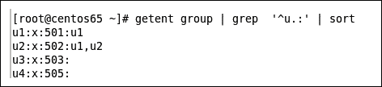
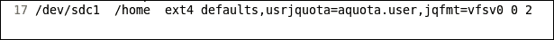
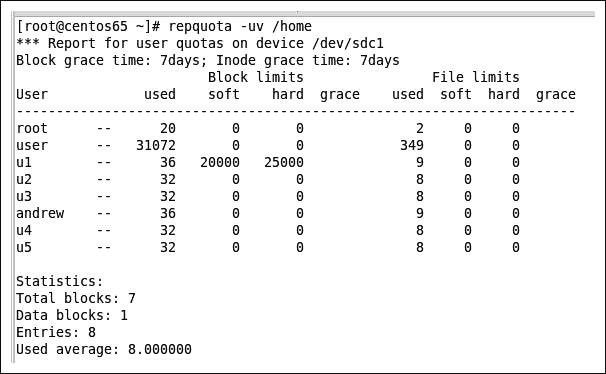

# 第六章。用户——我们真的想要他们吗？

我承认，这个问题有点儿反问的意味，但有时候我们会幻想，如果没有麻烦的用户干扰，生活会有多么美好，系统的运作也会更加顺畅；然而，我们越是有效地管理 Linux 系统上的用户，CentOS 对我们来说就越好。实际上，我们对用户的控制越多，他们的工作就越不受系统停机的干扰，生活也就越好。

本章中，我们将开发一些技巧来保持对系统的低调控制，让我们保持理智，同时让用户感到满意。这将包括：

+   **管理公共组和私有组**：了解如何使用公共组以及覆盖 CentOS 默认的私有组，可以让我们在为用户分配权限时有更多选择。我们需要注意每种解决方案的潜在陷阱。

+   **Getent**：它可以为我们提供关于用户和组的全局视图，并在本章中为我们打开 `nsswitch.conf` 文件（名称服务切换文件）的理解之门。

+   **配额**：使用配额可以让我们监控并在必要时限制用户的空间分配，这在用户的主目录所在位置尤为重要。

+   **脚本化用户创建**：在创建用户时，我们需要设置密码，并可能设置用户的磁盘配额限制；因此，将这些活动组合成一个脚本是有意义的，这样就不会遗漏任何内容。

# 管理公共组和私有组

Red Hat 和因此也包括 CentOS 的用户管理系统采用了私有用户组系统。每个创建的用户都会属于一个同名的主组；换句话说，创建用户 bob 时，也会创建一个名为 bob 的组，而该用户是唯一的成员。

## Linux 组

首先，我们需要了解一些关于 Linux 组的知识。每个用户有一个主组和多个次级组。

**用户 ID 和组 ID**（**UID/GID**）用于 Linux 的权限管理结构。任何文件的所有者和所属组都是通过将 UID 和 GID 存储在文件的元数据中来实现的。权限可以分配给用户、组或其他人。

每个用户都有一个 UID 和 GID，但只能属于一个组，这有些限制，因此用户还可以加入次级组。用户可以使用`/usr/bin/newgrp`命令将当前的 GID 改为其次级组中的一个，从而有效地切换他们的 GID。在实际操作中，这并不是必需的，接下来我们将描述用户的主组和次级组之间的区别。

创建新文件时，用户的 UID 和当前的 GID 用于创建新文件的所有权。如果用户创建新文件，用户将是该文件的所有者，并且该文件将由其自己的私有组作为组所有。这样就能创建一个固有安全的系统，无需用户干预。次级组在访问*当前*存在的资源时被使用。用户在访问资源时会显示其所有的次级组。因此，一个对`users`组可读但对`others`不可读的文件，将能够被其 GID 设置为私有组的用户访问，但他们所属的次级组列表中包括了`users`组。

在评估用户的 ID 时，设置`/usr/bin/id`命令非常有用。若不带任何选项或参数运行，输出将显示与您关联的 ID。在下图中，我们可以看到用户`andrew`仅属于私有用户组，并没有额外的次级组成员资格：

```
$ id

```



我们将使用相同的命令，但这次我们将使用用户`u1`作为参数。输出将显示该帐户的关联 ID；此命令可以作为标准用户运行：

```
$ id u1

```

从下图中，我们可以看到用户`u1`的主组或 GID 被分配给私有组`u1`；然而，`u1`还属于`users`组。



对于当前设置的`u1`用户 ID，任何新创建的文件将由 GID 501（`u1`）作为组所有；但`u1`可以访问任何`users`和`u1`组可访问的资源，无需`u1`做任何额外操作。从管理员的角度来看，我们需要确保为用户分配正确的次级 ID。

这点与我们查看的第一个例子不同。用户`andrew`目前仅属于`andrew`的私有组，因此他只能访问权限设置为：

+   他们的 UID（`andrew`）

+   他们的私有 GID（`andrew`）

+   其他

用户帐户`andrew`无法像用户`u1`那样访问`users`组分配的权限。

## 将用户添加到组中

现在我们可以看到用户`u1`已经获得了共享给`users`组的资源访问权限，那么`andrew`呢？我们该如何帮助他呢？

如果用户已存在，并且我们需要将其添加到一个公共组中，那么可以使用`usermod`命令将用户添加到额外的组中。当我们将`andrew`添加到`users`组时，我们还需要保持其任何现有的次级组成员资格。

运行以下命令：

```
# usermod -G users andrew

```

如果我们选择运行上述命令，那么`andrew`将被添加到`users`组中，但与他的主要组一起，这将是他唯一的二级组成员。换句话说，如果`andrew`属于多个二级组，`-G`选项会覆盖这个组列表，这是不好的做法。

`id`命令可以通过`-G`选项显示当前的二级组：

```
# id -G andrew

```

如果我们将这两个命令结合在一起，那么我们可以有效地将`users`组附加到`andrew`当前的组列表中。为此，我们还需要将`id`命令提供的组列表中的空格转换为逗号：

```
# usermod -G$(id -G andrew | tr ' ' ','),users

```

括号中的命令首先会被评估。`id`命令会生成一个由空格分隔的二级组列表，`tr`命令会将空格转换为逗号（在这种情况下）。我们提供给`usermod`的组列表需要用逗号分隔，但可以使用组名或 ID。不过，更简单的方法是使用`usermod`的附加选项，如下所示的代码示例：

```
# usermod -a -G users andrew

```

创建新用户时，我们只需指定用户应属于的二级组。我们无需关注现有的组成员身份：

```
# useradd -G users u4
# id u4

```

从以下输出可以看出，新用户`u4`已被创建并添加到二级组`users`中。



## 评估私有组使用情况

你不需要使用私有`groups`方案。它们是默认的，但与所有默认设置一样，我们可以指定选项来修改它。使用`useradd`命令的`-N`选项将不会创建私有组，并且如果未指定，用户的主要组或 GID 将是`users`组。让我们执行以下命令：

```
# useradd -N u5
# id u5

```

输出结果显示在下面的截图中，我们可以看到用户的主要组是`users`组：



我们可能需要面对的唯一安全问题是，现在默认情况下，用户`u5`创建的任何文件将由一个共享组拥有。根据具体情况，这可能是不希望的；然而，默认将所有文件设为用户私有也并不是理想选择。最终，由管理员团队决定哪种模型最适合组织的需求。

# Getent

`/usr/bin/getent`命令将显示一个条目列表，*获取条目*。这些条目由*名称服务切换库*解析，这些库在`/etc/nsswitch.conf`文件中进行配置。该文件包含一个数据库和库的列表，用于访问这些数据库。

例如，我们可以使用`getent passwd`命令显示所有用户，或者使用`getent group`显示所有组。然而，我们也可以将其扩展到诸如`getent hosts`来显示主机文件条目，和`getent aliases`来显示系统上的用户别名等命令。

`nsswitch.conf`文件将定义用于访问`passwd`数据库的库。在标准 CentOS 系统上，`/etc/passwd`通常是唯一的本地文件，但企业系统可能包括**轻量级目录访问协议**（**LDAP**）模块。在下一章中，我们将学习如何使用目录服务。

我们使用`grep`命令在`/etc/nsswitch`文件中搜索`passwd`数据库：

```
# grep passwd /etc/nsswitch.conf

```

我们可以看到在我的系统上，我们只是使用本地文件来解析用户名：



`getent`命令是一个非常有用的工具，可以快速列出系统中的用户或组，输出可以根据需要通过`grep`和`sort`命令进行过滤或排序。例如，如果我们想查看系统中所有以字母`u`开头并且名称中只有一个额外字符的组，可以使用以下命令：

```
# getent group | grep 'u.:' | sort

```

以下截图展示了这个命令：



# 配额

在几乎所有用户管理的领域，我们都必须为磁盘空间分配某种配额，以便将磁盘空间管理的责任交还给用户。如果我们不这么做，用户将永远无法了解我们在为他们提供无限磁盘空间时所面临的困难。让用户看到他们的空间正在填满，可能会促使他们进行一些清理工作。

在 Linux 中，磁盘配额应用于挂载点；如果你想限制用户在其主目录中的空间，则`/home`目录需要有自己的分区。如果它是根文件系统的一部分，那么用户的空间将被限制在该分区内的所有目录中。

配额限制是通过`quota`包中的工具实现的。你可以使用`yum`命令来验证它是否已安装：

```
$ yum list quota

```

如果命令的输出显示它可用而不是已安装，那么请使用以下命令安装配额：

```
# yum install quota

```

## 设置配额

我的系统包含一个`/home`分区并安装了`quota`包。现在，我们需要为`/home`分区设置正确的挂载选项。目前，它没有启用配额。

为了启用此功能，我们需要编辑`/etc/fstab`文件并为`/home`分区设置挂载选项。以下两个挂载选项应该被添加以启用选定分区的日志配额：

```
usrjquota=aquota.user,jqfmt=vfsv0

```

`usrjquota=aquota.user`部分指定了配额文件，而`jqfmt=vfsv0`指定了配额格式。

问题行在以下截图中显示：



我们已启用基于日志的用户配额，因为我们使用的是`ext4`，一种基于日志的文件系统。用户空间限制是在写入日志时检查的，而不是等到更改刷新到磁盘时才检查。我们还设置了日志配额的格式。

为了使这些设置生效，我们可以使用以下命令重新挂载`/home`分区：

```
# mount -o remount /home

```

现在我们需要初始化配额数据库；它在挂载选项中被引用为`aquota.user`，并将位于启用配额的分区根目录下。启用文件系统的配额可能需要一些时间，具体取决于文件系统中的数据量：

```
#quotacheck -muv /home

```

使用这些选项和`/sbin/quotacheck`命令，我们可以设置以下选项：

+   `-m`：这表示在操作过程中不重新挂载为只读模式

+   `-u`：这是用于用户配额的选项

+   `-v`：这是详细输出

+   `/home`：这是要操作的分区，或者使用`-a`来处理所有启用配额的分区

可能值得将`quotacheck`命令和选项添加到你的`crontab`中，以确保`quotacheck`命令每天至少执行一次。尽管日志配额比传统配额更可靠，但定期重新评估文件空间的使用情况仍然有助于确保维护的数据准确。

配额可以通过`edquota`或`setquota`命令设置；我更喜欢`setquota`命令，但传统上`edquota`会教授给新管理员。`/usr/sbin/edquota`命令将带你进入编辑器进行更改，而`/usr/sbin/setquota`命令则直接在命令行中设置配额：

```
# setquota -u u1 20000 25000 0 0 /home

```

上述命令将为用户`u1`设置配额。为该用户设置软限制，当超过 20 M（20 x 1k 块）时仅给出警告，并设置硬限制为 25 M，超出此限制时用户将无法再在`/home`目录中保存数据。我没有限制用户`u1`的文件数量，只限制了他们使用的磁盘空间。

`/usr/sbin/repquota`命令可以用来显示磁盘使用情况：

```
# repquota -uv /home

```

我的系统输出如下所示的屏幕截图：



# 脚本化用户创建

用户创建现在将包括三个步骤：

+   `useradd`：这用来创建用户

+   `passwd`：这用于设置密码

+   `setquota`：这用于设置磁盘配额

我们可以通过脚本确保这些操作的正确性和一致性，以确保用户创建过程的程序完整性。这还将节省时间。作为一种非常快速的解决方案，以下脚本提供了我们所需的一切：

```
#!/bin/bash
useradd -m -G users $1 
echo Password123 | passwd --stdin $1
passwd -e $1
setquota -u $1 20000 25000 0 0 /home

```

我们需要使用新用户名作为参数来运行脚本，如下例所示：

```
# userscript.sh bob

```

按行阅读脚本可以解释脚本内容如下：

+   `#!/bin/bash`：这是要使用的脚本解释器

+   `useradd -m -G users $1`：这将创建作为脚本第一个参数`$1`传入的用户。用户的主目录将被创建，并且会被加入到`users`组。

+   `echo Password123 | passwd --stdin $1`：这将用户的密码设置为一个标准密码。

+   `passwd -e $1`：密码已过期，因此用户在第一次登录时需要设置自己的密码。

+   `setquota -u $1 20000 25000 0 0 /home`：最后，配额将为用户实现。

当然，我们可以在脚本中加入更多功能来设置不同的群组和配额；然而，作为程序完整性和功能脚本的示范，这已经是一个很好的起步。

# 总结

当我们结束这一章节时，可以总结一下我们在过程中学到的所有内容。本节的主要任务是更加熟悉 CentOS 群组管理的变化，并能够正确区分用户的主群组和次群组。在此过程中，我们花时间评估了公共和私人群组方案的使用，以及在用户创建时使用`-N`选项禁用用户的私人群组。

不久后，我们便深入到了`/etc/nsswitch.conf`和`getent`命令（获取条目）。从这里，我们直接开始实施用户磁盘限制或配额，然后再通过脚本将这一切串联起来。

在下一章中，我们仍然围绕用户这一主题，但将目光投向将我们的账户集中在一个中央 LDAP 目录中，通过实现 CentOS 6.5 上的 389 目录服务器，使用来自 Red Hat 目录服务器的开源代码。
