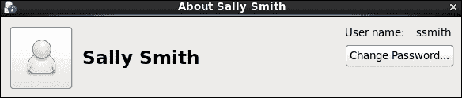

# 第七章：LDAP——一种更好的用户类型

在每个服务器和工作站上定义本地用户账户和密码来进行访问并不是很实际。想象一下，当你可能需要在你使用的 10 或 12 个系统中实施密码更改时，要强制执行密码更改会是多么麻烦。你可能还会想考虑当用户离开时会发生什么；你真认为每次都会从每个系统中删除账户吗？现实情况是，当有多个系统时，必须有某种形式的目录解决方案；这可能是 OpenLDAP，也可能是 Active Directory。是的，CentOS 可以加入 Windows 域。我们将探讨 389-ds，这是 CentOS 对 Red Hat 目录服务器的实现。389-ds 基于 OpenLDAP，但有一些非常聪明的管理工具。我们将在本章中讨论以下主题：

+   **LDAP 概念**：在本节中，您将了解在谈论目录服务时使用的术语

+   **安装 389-ds**：本节涉及安装 389 目录服务器，确保所有的基础设施就绪

+   **LDAP 用户账户管理**：本节包含目录中用户生命周期的管理

+   **LDAP 认证**：本节将介绍如何认证第二台 CentOS 服务器到共享目录

# LDAP 概念

LDAP 代表轻量级目录访问协议；顾名思义，它最初是一个用于访问目录的客户端-服务器协议，但由于目录发展的非常缓慢，它很快就承担了整个目录服务器的角色。如果我们分解一个目录，**目录访问协议** (**DAP**) 只是 LDAP 服务器众多组成部分中的一小部分：

+   **目录信息数据库** (**DIB**)：这是存储目录的数据库

+   **目录信息树** (**DIT**)：这是表示 DIB 中条目、组织、组织单位等的层次结构

+   **目录系统协议** (**DSP**)：它代表服务器与服务器之间的通信

+   **目录访问协议** (**DAP**)：这代表客户端到服务器的通信

+   **目录服务器代理** (**DSA**)：这是服务器软件

+   **目录用户代理** (**DUA**)：这是客户端软件

+   **目录信息影射协议** (**DISP**)：这是目录的复制

+   **架构**：这些是条目数据定义

这些元素在所有 LDAP 目录和常见目录中都有一定的表示方式，包括 OpenLDAP、Red Hat 目录服务器和 389-ds。我们将重点关注基于 Red Hat 目录服务器的 389-ds，它是 OpenLDAP 的实现，并具备一些增强功能。最终，目录被用于创建通常所说的身份管理，集中存储用户账户，以减轻账户管理的负担并提升安全性。如果用户只需记住一组凭证，那么他/她更有可能记住强密码。

# 安装 389-ds

在接下来的章节中，我们将看到安装 389-ds 所涉及的步骤。

## 配置 DNS 或主机名记录

在安装 OpenLDAP 或 389-DS 时，必须确保能够解析安装目录的系统主机名。我的系统名为 `ldap1.tup.com`，我为此配置了本地 DNS 记录，但也可以通过主机系统上的 `/etc/hosts` 文件中的条目来维护。我可以使用 `host` 命令或类似命令验证名称是否正确：

```
$ host ldap1.tup.com

```

你应该能看到返回的 IP 地址。你可以在我的系统上执行此命令时看到结果，如下截图所示：


## 设置 TCP 保活

TCP 连接的默认超时时间为 120 分钟。我们将其配置为五分钟。这样做可以减少由于丢失 TCP 连接所带来的开销；连接将更快速地关闭。编辑 `/etc/sysctl` 文件，添加以下行：

```
net.ipv4.tcp_keepalive_time = 300
```

使用 `sysctl` 加载设置，使其生效并成为下次重启时的默认设置：

```
# sysctl -p

```

## 设置文件描述符

编辑 Linux 系统上的文件描述符数量可以帮助目录服务器更高效地访问文件，因此我们将从查看当前设置开始：

```
# cat /proc/sys/fs/file-max

```

如果值小于 64,000，则需要在 `/etc/sysctl` 文件中增加限制：

```
fs.file-max = 64000

```

运行以下命令以读取我们刚刚设置的新值，无需重启系统：

```
# sysctl -p

```

为了使此设置生效，我们还必须允许所有用户拥有足够的打开文件权限。编辑 `/etc/security/limits.conf` 文件，添加以下行：

```
*   soft   nofiles   8192
*   hard   nofiles   8192
```

这允许所有用户（`*`）最多有 8,192 个打开文件（`nofiles`）。我们将两者的限制设置为相同的值，但软限制可以通过警告超出，而硬限制则无法超出。

## 创建目录服务器用户和组

在配置目录时，我们需要为服务分配一个用户和组 ID；默认是 `nobody` 账户，但我们应当为目录创建一个非特权的用户和组，具体如下：

```
# useradd -m ldap389

```

`useradd` 命令将创建 `ldap389` 用户和组。

在此阶段，最好重新启动系统，以确保设置已生效，然后再开始安装目录服务器。有了这些准备，我们可以进一步准备安装。

## EPEL 仓库

我们需要实现 EPEL 仓库。使用`wget`命令，你可以下载 RPM 文件来配置仓库：

```
$ wget http://epel.mirror.net.in/epel/6/i386/epel-release-6-8.noarch.rpm

```

下载后，以 root 用户身份安装 RPM。这将为你创建仓库文件。运行`yum repolist`命令的输出应该显示 EPEL 仓库。以下截图来自我的演示系统：


## 安装和配置 389-ds

配置好仓库后，我们可以使用`yum`来安装目录服务器：

```
# yum install -y 389-ds openldap-clients

```

其中，你会发现会安装 Java，因为有一个 Java 管理控制台，它简化了连接到目录并管理目录中的条目。

通过实施一个脚本，使得配置变得简单，这个脚本将引导我们完成 CentOS 上管理和目录服务的配置。管理服务代表 LDAP 服务器；目录服务本身代表托管在管理服务器上的单个目录。一台管理服务器可以管理公司 A 和公司 B 的目录。两个目录可以分别管理。

设置通过运行脚本`setup-ds-admin.pl`来完成。该脚本已安装在你的 PATH 中。默认情况下，脚本是交互式运行的，但特别是在频繁设置服务器的情况下，你可以使用回答文件来配合脚本使用。

运行以下命令将交互式配置目录和管理服务：

```
# setup-ds-admin.pl

```

运行该命令后，会进入一个菜单，具体内容如下：

1.  **继续设置**：在第一个提示时选择`yes`以继续脚本。

1.  **dsktune**：将运行调整分析，以检查你的 RAM 是否大于 1024 MB，并确保其他预检项都已设置好。

1.  **选择设置类型**：

    1.  **快速安装**

    1.  **典型设置**

    1.  **自定义**

    我们将选择`2`作为**典型**配置。

1.  **设置计算机名称**：接下来，我们设置计算机名称。这个名称默认应该与你的主机名相同；在我的例子中是`ldap1.tup.com`。

1.  **设置目录服务器运行的用户**：在我们的案例中，我们将其设置为`ldap389`，这是我们创建的专用用户。

1.  **设置目录服务器运行的组**：我们将使用`ldap389`组。

1.  **将新目录服务器注册到现有服务器**：我们选择`No`，因为这是第一台服务器。如果已有其他服务器，可以将此安装与该服务器注册。

1.  **为配置目录服务器设置用户名和密码**：我们可以接受默认的管理员名称。我们使用该账户登录目录服务器。

1.  **配置目录服务器域**：我使用的域名是 `tup.com`。我们将创建一个 LDAP 域来反映这一点。

1.  **设置目录服务器端口**：LDAP 的默认端口是 `389`，我们将保持此默认设置。

1.  **设置目录服务器标识符**：接下来，我们将被提示输入一个唯一的服务器名称，这将默认为主机名的第一部分，在我的情况是 `ldap1`。

1.  **设置目录后缀**：LDAP 名称由逗号分隔。LDAP 后缀现在将显示如下，并将构成 LDAP 树中的顶部容器：

    +   `dc=tup, dc=com`

1.  **设置目录管理器 ID**：这是 LDAP 目录管理器，默认名称为 `cn=Directory Manager`。我们需要为此设置一个安全的密码。

1.  **设置管理服务器端口**：管理端口可用于通过 Java 控制台管理服务器。我们将保持默认端口 `9830`。

交互式设置现在已完成，配置将与默认条目一起创建。在最后阶段，服务应启动，并且会显示成功消息。我们应确保服务在启动时能够正确启动，使用 `chkconfig`：

```
# chkconfig dirsrv on
# chkconfig dirsrv-admin on

```

### 提示

请记住，`dirsrv` 运行在端口 `389` 上，是 LDAP 目录；`dirsrv-admin` 是管理服务器，监听端口 `9830`。

## 测试安装

恭喜！现在你已经拥有了一个 LDAP 服务器，我们可以通过几种方式测试配置。首先，我们可以使用 `ldapsearch` 命令显示目录中的条目，然后我们将使用 389-console，这是一个可以管理 LDAP 的 GUI 工具。在以下命令中，`-x` 选项用于简单身份验证，`-b` 选项指定搜索基础：

```
$ ldapsearch -x -b dc=tup,dc=com

```

这个输出将列出以 **轻量级目录交换格式**（**LDIF**）显示的某些容器和在配置过程中创建的组。以下截图显示了我的系统输出中的一个组：


389-ds 的一个大优势是 GUI。我们可以从服务器上运行它，或者我们可以将控制台安装在客户端机器上。我们将从服务器上使用以下命令运行它：

```
$ 389-console -a http://ldap1.tup.com:9830

```

我们将看到一个图形化控制台，如以下截图所示，在此我们可以以管理员身份登录：


# LDAP 用户账户管理

目录的目的是存储用户账户。这些账户不一定用于身份验证，但我们可以用它们进行身份验证。这可能适用于其他 CentOS 或 Linux 系统，以及如 Apache 这样的服务。现在我们将查看如何通过命令行和 GUI 控制台在目录中创建用户账户。如果从 GUI 控制台开始，我们可以创建并导出用户，再从命令行重新导入。

## 使用 GUI 控制台添加用户

我们可以像之前一样使用管理员帐户登录到控制台。从主欢迎页面，我们应该选择**用户和组**选项卡，然后选择**搜索**按钮。在搜索对话框中没有任何内容时，搜索将返回所有用户、组和容器。我们可以看到的容器对象是组织单位；**组织单位**（**OU**）有点像文件系统中的文件夹。在目录中，OU 用于组织对象。导航到名为"people"的 OU，我们可以使用菜单**创建** | **用户**（位于屏幕底部）。这将打开一个表单，供我们填写用户的详细信息。在用户表单上，我们将添加以下数据：

| **名字** | `Bob` |
| --- | --- |
| **姓氏** | `Bloggs` |
| **常用名称** | `Bob Bloggs` |
| **用户 ID** | `bbloggs`（建议全部小写） |
| **密码** | `Password1` |
| **确认密码** | `Password1` |

如果我们只需要一个用户来支持应用程序登录，例如来自 Apache Web 服务器的登录，这些就足够了。由于我们最终想要从 Linux 登录，我们还将完成如下的**Posix 用户**表单：

+   **启用 Posix 用户属性**: `已选择`

+   **UID 号码**: `5000`

+   **GID 号码**: `100`

+   **主目录**: `/home/bbloggs`

+   **登录 Shell**: `/bin/bash`

这些属性然后结合起来创建我们的用户。它将在 389-console 以及`ldapsearch`中显示。如果我们重新运行之前的搜索，这次我们将添加一个筛选器，仅显示与`posixAccount`匹配的对象：

```
$ ldapsearch -x -b dc=tup,dc=com objectClass=posixAccount

```

这应该只显示一个条目。

## 从命令行添加用户

要从命令行创建用户，我们有一个类似于`ldapsearch`的工具。`ldapadd`命令将创建目录中的用户。用户帐户的详细信息将在一个 LDIF 文件中定义，并作为`ldapadd`命令的参数使用。我们还需要进行身份验证才能执行此操作，因为匿名连接无法在目录中创建条目。我们将首先确保身份验证正确，方法是使用`ldapsearch`；这也将允许我们查看新用户`bbloggs`的所有属性。编辑此输出后，我们将在导入时使用`ldapadd`创建新用户。

```
$ ldapsearch -x -D "cn=directory manager" -w Password1 -b dc=tup,dc=com objectClass=posixAccount > /tmp/user.ldif

```

使用此搜索，我们现在以目录管理器身份进行身份验证，并将输出重定向到`/tmp/user.ldif`文件中。使用`-W`选项代替`-w`，可以在操作过程中请求密码，而不是将其放在命令行上。

我们应该使用你喜欢的文本编辑器编辑该文件，使其看起来类似于以下内容：

```
dn: uid=ssmith,ou=People,dc=tup,dc=com
givenName: Sally
sn: Smith
loginShell: /bin/bash
uidNumber: 5001
gidNumber: 100
objectClass: top
objectClass: person
objectClass: organizationalPerson
objectClass: inetorgperson
objectClass: posixAccount
uid: ssmith
cn: Sally Smith
homeDirectory: /home/ssmith
userPassword: Password1
```

### 提示

我们手动设置`uidNumber`，并且它必须随着其他基于名称的字段的更改而递增。

编辑文件后，我们可以使用命令行中的`ldapadd`命令创建用户：

```
$ ldapadd -x -D "cn=directory manager" -w Password1 -f /tmp/user.ldif

```

如果你输入正确，你应该会看到类似于以下截图的成功信息，这张截图来自我的系统：


新用户的密码将以加密形式存储，尽管我们从 LDIF 文件中添加时是以明文形式输入的。

我们现在已经看到如何使用标准的 OpenLDAP 工具来搜索和添加目录条目，并且如果我们愿意，也可以使用图形化工具。现在系统中有两个用户，可以将其配置到客户端 Linux 系统上。

# LDAP 身份验证

我们将使用另一台 CentOS 6.5 服务器，在该服务器上配置 OpenLDAP 客户端进行身份验证，以便使用我们在 389-ds 服务器上建立的中央账户数据库。

从客户端机器上，我们需要安装以下软件包：

+   `openldap`

+   `openldap-client`

+   `nss-pam-ldapd`

这将通过标准的`yum`仓库进行管理：

```
# yum install openldap openldap-clients  nss-pam-ldapd

```

安装完成后，我们需要对`/etc/sysconfig/authconfig`文件进行一次更改。我们将编辑其中的`FORCELEGACY=no`这一行，将其改为`FORCELEGACY=yes`。此更改将允许我们使用 LDAP 而非 LDAPS。尽管使用 LDAPS 更安全，因为它加密了数据交换，但使用 LDAP 可以避免为服务器创建证书，这在局域网环境中已足够。

配置身份验证时，我们可以使用`authconfig`命令：

```
# authconfig --enableldap --enableldapauth --enablemkhomedir \
--enablemkhomedir --ldapserver=ldap://192.168.0.76:389/ \ 
--ldapbasedn="dc=tup,dc=com" \
--enablecache -- disablefingerprint --update

```

这将配置身份验证并将配置写入正确的文件。你会注意到，我们包括了创建用户家目录的选项`--enablemkhomedir`；如果用户的家目录不存在，登录时将会创建该目录。在创建用户时我们添加了家目录路径，但这并没有创建实际的家目录。除非我们将客户端机器上的`/home`目录重新映射到一个中央位置，否则这些家目录不会被共享。

我们现在可以使用上一章提到的`getent`命令来验证配置：

```
# getent passwd

```

这应该会列出来自中央 LDAP 服务器的`bbloggs`和`ssmith`账户。可以在我的系统输出中看到这一点：


现在我们可以注销并以我们的一个用户身份重新登录。选择`ssmith`账户后，我们登录到图形化的 gnome 桌面，进入**系统** | **首选项**，并点击**关于我**按钮。我们可以看到我们以**Sally**身份登录。以下是我的系统输出的截图：



# 总结

在本章中，我们向您介绍了身份管理的概念，并展示了如何在 CentOS 上使用 389-ds，即增强版 OpenLDAP 服务器。它通过简化的设置脚本和图形化工具进行了增强；然而，我们也展示了如何使用传统的 OpenLDAP 工具在目录中创建和搜索条目。我们通过允许第二台 CentOS 服务器使用由 389-ds 共享的账户数据库来结束本章，使得我们能够在多个系统之间实现单点登录。

在下一章，我们将讨论 Nginx web 服务器，作为新兴的竞争者，它是 Apache 的一种清新替代方案。
