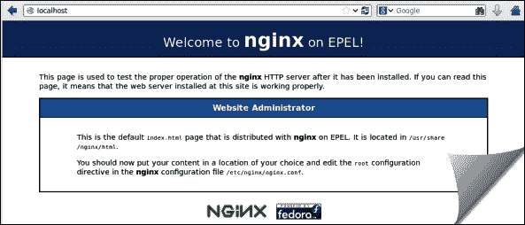
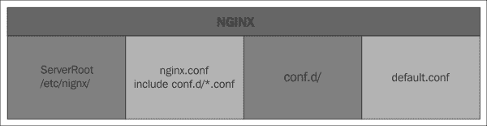
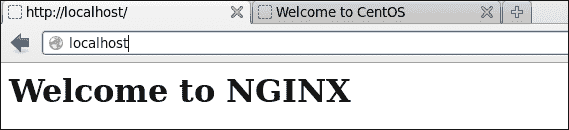
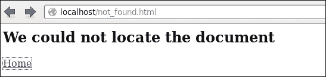
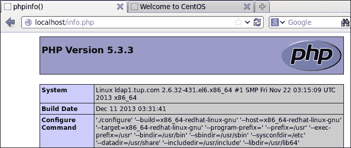
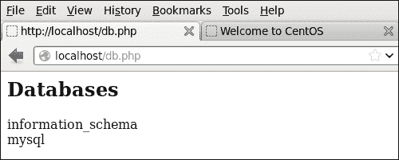

# 第八章 Nginx – 部署一个以性能为中心的 Web 服务器

在谈到 web 服务器时，似乎 Apache 总是占据着所有的关注点，你可能会被引导认为几乎没有竞争对手；因此让我来向你介绍一下 Nginx。我们已经看过很多实现**Linux Apache MySQL 和 PHP**（**LAMP**）技术的文章。我们将在此稍作调整，看看**Linux Nginx MySQL 和 PHP**（**LEMP**）；LEMP 中的 E 来自于该 web 服务器的发音版本 *engine-x*，这个发音让我们得以为这个首字母缩写加上一个必要的元音字母。该 web 服务器首次推出是在 2004 年，Nginx 开始逐步进入企业级 web 空间，并且在提供 web 内容的速度上超过了相同的 Apache 服务器。

本章将涵盖以下主题：

+   **安装和配置 Nginx**：我们将安装并配置 Nginx web 服务器

+   **安装 PHP**：我们将安装 PHP5 并与 Nginx 集成

+   **安装 MySQL**：我们将安装并配置 MySQL 数据库服务器

+   **创建动态 web 内容**：使用 LEMP 堆栈，我们将学习创建简单的动态网页

# 安装和配置 Nginx

为了开始本章内容，我们需要在 CentOS 系统上安装 web 服务器 Nginx。Nginx 是 web 服务器的新星，但根据 NetCraft 最近的调查，[`www.netcraft.com`](http://www.netcraft.com)，我们看到互联网对 Apache 的喜爱有所减少，自 2004 年 Nginx 推出以来，它稳步增长。尽管如此，在 2014 年 5 月，Apache 仍然占有 37% 的 web 服务器份额，微软占 33%，而 Nginx 占 14%。

## 安装 Nginx

Nginx 并不包含在标准的软件仓库中，但我们可以使用在安装 第七章中提到的 EPEL 仓库，*LDAP – 一种更好的用户类型*。有了 **企业 Linux 扩展包**（**EPEL**）仓库后，我们可以使用 yum 安装，然后在安装了 Nginx 后，我们可以启动服务并使用 `chkconfig` 配置它在系统启动时自动启动：

```
# yum install nginx
# service nginx start
# chkconfig nginx on

```

默认站点的配置中已配置了一个欢迎页面，该页面指向 `/usr/share/nginx/html/`。我们将保留此设置，但很快会创建我们自己的文档根目录。我们可以通过访问 `http://localhost` 来测试 web 服务器的功能，如下图所示：



这真的非常简单，不是吗！我们可能需要用我们自己的网页替换这个页面，并整理一些其他配置；但这个简单的测试足以证明网站已经启动并运行了。

## 配置 Nginx

Nginx 的配置目录，或称为 `ServerRoot`，是 `/etc/nginx`。主配置文件是 `/etc/nginx/nginx.conf`；但是，Web 服务器采取了一种非常模块化的配置方法，主配置文件中有一个包含语句，它会引用 `conf.d` 中的所有 `.conf` 文件。`nginx.conf` 中的语句如下：

```
include /etc/nginx/conf.d/*.conf
```

通过这种方式，可以轻松地添加其他配置，而无需编辑现有文件，也不会冒犯代价高昂的错误。定义初始服务器的默认配置文件是 `/etc/nginx/conf.d/default.conf`。为了帮助理解 Nginx 配置文件的一些结构，让我们看一下以下的图示：



为了更好地理解 Nginx 的配置，通常最好从自己的配置开始。先从简单的配置开始，然后逐步添加。为此，我们将 `default.conf` 重命名为其他名称，并创建我们自己的配置。对于一个简单的服务器配置，我们只需要不到五行代码：

```
server {
    listen 80;
    root /var/www/html;
    index index.html;
}
```

前面的几行可以将此配置保存到新文件 `/etc/nginx/conf.d/main.conf`。然后，我们将原始配置 `/etc/nginx/conf.d/default.conf` 重命名为 `/etc/nginx/conf.d/default.conf.old`。只有 `.conf` 文件会被包含进来，因此通过这种方式，我们可以保持原始配置而不影响 Web 服务器的运行。

我们的新配置非常简单且稀疏，我们可以解释有限的指令：

+   `listen`：我们将监听所有接口的 TCP 80 端口。

+   `root`：在这里，我们将文档根目录设置为 `/var/www/html`。最好将像这样的变量内容放在 `/var` 结构中，而不是默认的 `/usr` 位置。

+   `index`：我们将默认页面（通常称为欢迎页面）设置为 `index.html`。如果客户端的 URL 只输入服务器名称，或者是服务器名称加上目录路径而没有指定网页，那么服务器将寻找名为 `index.html` 的页面。

我们需要为文档根目录创建目录结构，并制作一个简单的网页：

```
# mkdir /var/www/html 
#echo '<h1>Welcome to NGINX</h1>' > /var/www/html/index.html

```

在理想情况下，在重新启动 Nginx 服务器之前，我们应该尽量测试任何配置更改。通过这种方式，我们可以避免因配置异常导致的服务器重启中断的尴尬问题。当我们发出重启命令时，首先需要停止服务然后再启动 Nginx。停止服务不会有问题，但如果我们遗漏了分号或其他小错误，启动时可能会出现问题。因此，可能需要几分钟才能找出问题并恢复正常服务。在对 Nginx 配置做出任何更改后，我们应始终测试这些修改的完整性，然后再重启。使用 `/usr/sbin/nginx -t` 命令，我们可以进行此检查，确保如果停止服务器，我们能够重新启动它。如果你更喜欢，也可以通过使用 `service nginx configtest` 命令来进行相同的测试。

`nginx` 命令的其他选项包括 `-v` 用于显示 Nginx 的版本，`-V` 显示版本和配置选项。如果我们遇到错误，可以检查日志文件 `/var/log/nginx/error.log`。`tail` 命令通常对这个很有用，因为它只会显示最后 10 行。错误日志的路径在 `/etc/nginx/nginx.conf` 中配置，以下行进行设置：

```
error_log /var/log/nginx/error.log
```

如果需要，你可以将其更改为其他日志文件；但默认设置似乎是合理的。现在，我们可以确保配置正常并通过以下方式重新启动服务：

```
# nginx -t && service nginx restart

```

### 提示

在这个命令序列中，`&&` 运算符确保只有在第一个命令成功且配置检查没有错误时才会重新启动。

我们现在可以重新访问我们的网站了。它可能看起来不那么华丽，但正如我们在以下截图中看到的那样，它完全是我们自己的工作：



## 配置 404 文档未找到错误页面

另一个我们将实现的小改动是控制“页面未找到”或 HTTP 404 错误。如果用户输入了一个不存在的页面，那么他们将看到一个非常简单的错误页面。我们可以稍微自定义一下，至少给用户提供一个返回主索引页面的链接。如果我们重新编辑配置文件 `/etc/nginx/conf.d/main.conf`，它现在会显示如下：

```
server {
    listen 80;
    root /var/www/html;
    index index.html;
    error_page 404 not_found.html;
}
```

额外的 `error_page` 行会查找 HTTP 404 错误并返回 `not_found.html` 页面。我们当然需要创建该页面，它可能看起来像这样，作为一个非常简单的示例，提供错误信息和返回首页的链接：

```
<h2>We could not locate the document</h2>
<a href='/index.html'>Home</a>
```

记得测试配置；我们可以通过以下方式重新启动 Web 服务器：

```
# nginx -t && service nginx restart

```

然后，访问一个我们知道不存在的页面，例如 `http://localhost/page1.html`。我们应该能看到新的错误页面，如果你使用了我的示例，它可能看起来像这样：



虽然网页的设计简单且裸露，但我们并不是在这里教 HTML 或 CSS 技巧，而是更多地探讨如何通过 Nginx 指令实现自定义错误页面的思路。

# 安装 PHP

现在我们已经让 Web 服务器启动并运行，我们可以添加需要的 PHP 处理器，从而能够在页面中添加 PHP 元素，并随后创建动态的 Web 内容。Nginx 使用 PHP FastCGI 进程管理器，这个也可以从 EPEL 仓库中获取。我们已经在 Nginx 安装时以及之前安装 389-ds 时设置好了它。为了安装 PHP 和 PHP-FPM，我们可以使用 `yum`：

```
# yum install php-fpm

```

安装完成后，我们需要编辑 FPM，以便它使用正确的 Nginx 账户。为此，我们可以编辑`/etc/php-fpm.d/www.conf`文件。我们需要将用户和组的行从`apache`修改为`nginx`：

```
user = nginx
group = nginx
```

我们还需要确保 Nginx Web 服务器知道将 PHP 文件转发到 FPM 服务的 9000 端口。我们可以重新编辑`/etc/nginx/conf.d/main.conf`文件并将其添加到服务器部分：

```
server {
 listen 80;
 root /var/www/html;
 index index.html;
 error_page 404 not_found.html;
 location ~ \.php$  {
  fastcgi_pass 127.0.0.1:9000;
  fastcgi_index index.php;
  fastcgi_param SCRIPT_FILENAME $document_root$fastcgi_script_name
  include fastcgi_params;
 }

}
```

我们添加的代码都在原始服务器块内。文件会以两个右括号正确结束。我们正在关闭新的 location 块和原始的服务器代码块。回顾一下编辑内容，我们可以看到我们定义了一个 `location` 块。这个块在我们访问以 `.php` 结尾的网页时使用，或者更简单地说，访问 PHP 页面。location 块的定义看起来有点像漫画书中的脏话，这应该能让你识别出它实际上是一个正则表达式；波浪符号（`~`）表示我们在寻找正则表达式匹配。我们要查找的表达式是以 `.php` 结尾的 URL。`$` 符号表示字符串的结束。完整的表达式以转义字符`\`开始；这是必要的，因为句点（dot）在正则表达式中有特殊含义。为了保护它，我们使用 `\` 告诉 Nginx 将其视为字面上的句点，而不是正则表达式语言元素。接下来的代码块则表示我们应该通过本地主机的 9000 端口将 PHP 代码传递给 PHP 解释器。`include` 语句用于读取一个预配置的 PHP 文件，以设置各种参数值。

现在我们可以测试并重启 Nginx Web 服务器，并启动 FPM 服务，配置它为自动启动：

```
# nginx -t && service nginx restart
# service php-fpm start
# chkconfig php-fpm on

```

凭借一点运气和顺风，一切都已成功，但当然，我们现在需要测试一个 PHP 页面；这可以通过调用一个简单的`phpinfo()`函数轻松实现。这是一个非常简单的测试，它将证明 PHP 在你的 CentOS 系统上正常运行。我们将返回到 Nginx 的文档根目录`/var/www/html`并创建一个新页面`info.php`。PHP 扩展很重要，因为这是我们在位置块中寻找的：它将指引我们进入 PHP 解释器。我们将创建的页面再简单不过了；然而，这个功能背后的强大作用将在你的网页浏览器中展示出很多内容，输入几行代码就能实现。我们可以在同一个文件中混合 HTML 代码和 PHP 代码，但在这里我们只使用 PHP。PHP 代码块以`<?php`开始，并以关闭标签`?>`结束。每行 PHP 代码后面都需要加一个分号。编辑后的`/var/www/html/info.php`文件将如下所示：

```
<?php
    phpinfo();
?>
```

当我们将浏览器指向`http://127.0.0.1/info.php`页面时，我们应该看到一个详细的页面，展示了 PHP 在我们 CentOS 主机上的配置。请看以下截图，展示了我系统的输出：



很快，我们就通过这个简单的测试展示了 PHP 背后的强大功能。我们也可以确信，PHP 已经在我们的系统上正确配置并与 Nginx 一起运行。接下来我们将添加 MySQL 数据库。

# 安装 MySQL

MySQL 是由 Oracle 管理的开源数据库解决方案，当然，这也是我们实现的 LEMP 栈中的关键组件。MySQL 服务器可以存储数据，稍后在我们的网页中显示。我们将通过 PHP 与数据库服务器进行 Nginx 的通信。我们可以使用`yum`来安装 MySQL 及 PHP 模块：

```
# yum install php-mysql mysql-server
# service mysqld start
# chkconfig mysqld on

```

一旦安装了 MySQL，我们需要进一步确保安装的安全性；即使只是设置 MySQL 的 root 密码。许多系统的开箱安全性通常有些薄弱。通过`mysql_secure_installation`命令，我们可以增加一些额外的安全性。运行该程序将引导你进入一个简单的交互式提示会话：

```
# mysql_secure_installation

```

生成的向导将引导你完成以下过程：

+   **输入当前 root 密码**：目前为空，所以直接按 *Enter* 键。

+   **设置 root 密码**：我们将选择`Y`。

+   **新密码**：输入新密码并确认。

+   **删除匿名用户**：选择`Y`。这样，只有配置好的账户才能访问。

+   **禁止远程 root 登录**：这通常是一个好主意，可以防止远程 MySQL root 访问。我们只需要从此主机进行访问，所以我们将回答`Y`。

+   **删除测试数据库及其访问权限**：有一个空的数据库测试。如果我们不需要它，应该删除它。

+   **现在重新加载权限表**：我们将回答`Y`以使这些设置生效。

如果仅仅为了这个目的，这是设置 MySQL 根账户密码的最简单方法之一，并提醒我们在执行简单脚本时验证其他设置。当我们准备好时，我们可以通过 Linux 命令行测试数据库服务器的运行：

```
$ mysql -u root -p -e 'show databases;'

```

我们以 root 身份进行身份验证，并且系统会提示我们输入之前设置的密码。`-e`选项允许我们直接从命令行执行 MySQL 查询，随后的查询将列出所有数据库。当然，这些将是系统数据库，因为我们还没有创建自己的数据库。我们可以在网页中使用相同的查询，稍后用来显示我们是否能够从 Nginx 连接到数据库。从查询结果中，我们应该看到列出两个数据库：`information_schema` 和 `mysql`。

# 创建动态网页内容

为了展示我们如何轻松地创建动态网页，并通过 PHP 从 Nginx 服务器连接到数据库，我们将在`/var/www/html`中创建一个新的 PHP 页面。所以，启动你最喜欢的编辑器，我们将在文档根目录下创建页面，路径为`/var/www/html/db.php`：

```
<h2>Databases</h2>
<?php
      $dbh=mysqli_connect("localhost","root","Password1");
      $result=mysqli_query($dbh, "SHOW DATABASES");
      while ($row = mysqli_fetch_assoc($result)) {
        echo $row['Database'] . "<BR>";
      }
?>
```

代码再次保持尽可能简单，理想情况下，我们会将连接凭证存储在另一个无法被 Web 服务器访问的文件中，只允许 PHP 进程访问；然而，在这个早期阶段，保持代码简洁有助于学习过程。

在这个 PHP 文件中，你可以看到我们将一些 HTML 代码与 PHP 代码混合使用，先使用标题标签，然后进入 PHP 代码块。PHP 代码首先连接到 MySQL 服务器，然后我们执行之前在命令行中演示过的相同查询。在我们进行测试之前，我们需要重新启动 Nginx 和`php-fpm`服务：

```
# service nginx restart
# service php-fpm restart

```

这一次，结果将在网页浏览器中显示，并说明我们已经创建了一个简单的动态页面，内容来自数据库。在这个阶段，我们可以为自己已经启动并运行的 LEMP 服务器感到高兴。有了这个概念验证，我们现在可以考虑在 LEMP 堆栈上构建进一步的项目，我也真心希望你能带着一些热情离开，去阅读更多关于你可以通过 PHP 和 MySQL 实现的内容。

这是你将看到的主页：



# 总结

在本章中，我们了解了如何基于 CentOS 主机和 LEMP 堆栈构建，并实现 Nginx、MySQL 和 PHP。Nginx 配置起来相当简单，但比 Apache 提供更快的网页内容访问速度，同时也可以配置与 PHP 和 MySQL 进行后台通信。掌握 PHP 和 MySQL 与 Web 服务器一起工作的基本知识，可以为你进一步开发 Web 应用程序打下基础。

在接下来的章节中，我们将看到如何在 CentOS 上实现 Puppet 作为中央配置服务器，允许在一台服务器上进行配置更改，然后将其复制到其他配置的客户端。
