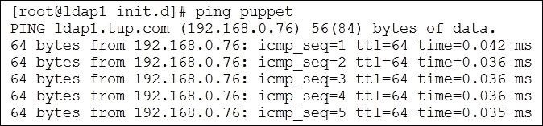
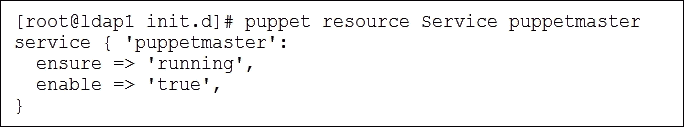
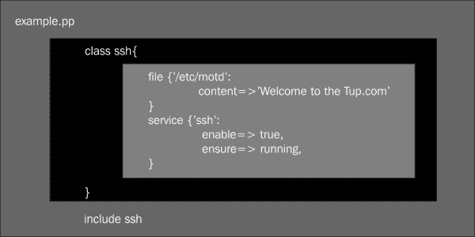
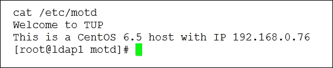
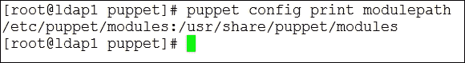
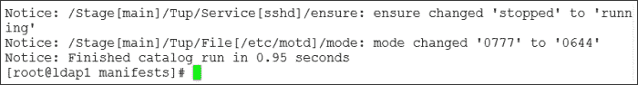
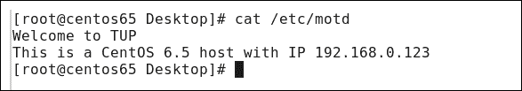

# 第九章 Puppet – 现在您是 Puppet Master

Puppet 来自 Puppet Labs，允许集中管理您的 Linux 设备。中央 Puppet 服务器被称为 Puppet master，延续了木偶戏的类比。这个主设备当然可以让您通过单一设备控制服务器和桌面（在 Puppet 术语中称为节点），尽管不需要用线操控木偶。Puppet master 向每个节点指定所需状态，每隔 30 分钟，节点会连接到 Puppet master 并发送关于其资源的事实；如果不符合所需状态，节点将自行修复以达成目标。在本章过程中，我们将研究 Puppet 配置，包括：

+   **安装 Puppet master**：我们将从 Puppet Labs 仓库安装和配置 Puppet master。Puppet master 将作为中央配置服务器，并存储每个节点所需的配置状态。

+   **Puppet 资源**：我们将使用 `puppet resource` 命令手动管理节点上的资源。资源代表所需状态的基本构建块，包括文件、用户、服务、定时任务和软件包等。

+   **管理软件包、服务和文件**：这三种资源代表了 Puppet 管理中的主要三要素，如果我们能管理这些，就几乎能够管理整个节点。我们将在清单文件中创建资源声明，并在本地和远程的 Puppet 代理上进行测试。

# 安装 Puppet master

正如我们所知，许多必须在 CentOS 上安装的服务，开始之前我们必须确保基础配置正确。在 Puppet master 的情况下，基础配置包括：

+   必须通过防火墙开放 TCP 端口 `8140`

+   Puppet master 应该能够通过 DNS 或本地主机文件解析为主机名 `puppet`

+   时间应同步

+   配置好的 Puppet Labs yum 仓库

我已在以下部分详细说明了这些内容。

## 配置防火墙

我在演示机上没有使用基于主机的防火墙。您的系统可能不是这样，如果您使用防火墙，则需要允许 TCP 端口 `8140` 通过 INPUT 链。可以使用以下命令检查防火墙的状态：

```
# iptables -L

```

这将列出已设置的规则以及默认策略。如果没有规则且默认策略是 ACCEPT，则您将不会遇到与防火墙相关的问题，可以放心。

## DNS

Puppet 代理在每个客户端或节点上运行，并将尝试使用默认主机名`puppet`与 Puppet 主服务器进行通信。此设置可以在`/etc/puppet.conf`文件中更改。此更改需要在每个代理上实施，因此通常最简单的方法是在本地 DNS 中创建一个 ADDRESS 记录或 CNAME 记录，以便将主机名 puppet 解析到你想要的 Puppet 主服务器的 IP 地址。在示范实验室中，我已经设置了正确的 CNAME 记录。使用`ping`命令，我们可以看到主机名是可解析的，输出如下所示：



## 网络时间协议

如果你尚未配置 Puppet 主服务器和代理节点的时间，那么你应该使用**网络时间协议**（**NTP**）进行配置。这将确保它们都共享相同的准确时间。所有设备都需要准确的时间，因为 Puppet 主服务器将作为证书服务器，向受信任的节点发放证书，并且证书上的时间戳不能位于未来。为了在 Puppet 主服务器上设置 NTP，我们将首先将时间与 NTP 服务器同步，然后使用 NTP 和存储在`/etc/ntp.conf`文件中的条目配置定期更新时间，如下所示：

```
# ntpdate uk.pool.ntp.org

```

之前的命令使用一个基于英国的 NTP 服务器进行了一次性更新时间。这将设置时间，以便可以进行定期更新。如果没有设置这一点，时间可能无法同步，因为 NTP 客户端必须与 NTP 服务器的时间误差不超过 1000 秒，才能进行定期更新。现在我们可以启动 NTP 服务并配置它为自动启动。如果我们没有对配置文件`/etc/ntp.conf`进行任何更改，那么时间将与来自 NTP 池的服务器进行同步。如果你已经在网络中有本地的时间服务器，那么使用该设备作为时间源是值得的，具体如下：

```
# service ntpd start
# chkconfig ntpd on

```

## Puppet 实验室仓库

Puppet 主服务器在标准的 CentOS 仓库中不可用，也不幸地在我们已经配置的 EPEL 仓库中。这要求我们添加 Puppet Labs 软件仓库。这些仓库将提供最新的 Puppet 代理和主服务器软件。所有节点都需要安装 Puppet 代理，服务器则需要安装主服务器软件。我们将通过从 Web URL 安装 RPM 直接创建 Puppet 的 YUM 仓库。该 RPM 将仅在`/etc/yum.repos.d`中定义仓库文件。

```
#  rpm -ivh http://yum.puppetlabs.com/puppetlabs-release-el-6.noarch.rpm

```

这个过程会很快完成，因为它只需要创建一个仓库定义文件。仓库设置好后，我们现在可以准备安装 Puppet 主服务器。以下命令将安装最新版本的 Puppet 主服务器和代理，版本来自 Puppet Labs 仓库：

```
# yum install puppet-server

```

如常，我们应启动服务并启用自动启动。当完成此操作后，我们可以使用`netstat`命令显示 Puppet 主节点正在监听 TCP 端口`8140`：

```
# service puppetmaster start
# chkconfig puppetmaster on
# netstat -antl | grep :8140

```

# Puppet 资源

从 Puppet 2.6 版本及以后的版本（当前版本为 3.6）开始，使用单一的`puppet`二进制文件并通过子命令处理特定任务。早期版本为所有子命令提供了单独的二进制文件。在之前的命令集中，我们使用传统的 CentOS 语法启动 Puppet 主节点，并启用服务以实现自动启动；我们也可以通过`/usr/bin/puppet`命令和`resource`子命令实现相同的结果：

```
# puppet resource Service puppetmaster enable=true ensure=running

```

使用此命令，我们将关注`puppetmaster`服务，启用它的自动启动（`enable=true`），并在需要时启动它（`ensure=running`）。这代表了 Puppet 工作的本质。当然，为了管理多个客户端，我们将创建具有类似资源规则的清单文件来强制执行期望状态。但就其本身而言，我们将通过使用`puppet resource`命令来配置节点的期望状态。

除了设置期望状态外，我们还可以使用类似的命令查看所有服务或单个命名服务的状态；以下是两个这样的命令，第一个命令将显示所有服务，第二个命令将只显示`puppetmaster`服务：

```
# puppet resource Service
# puppet resource Service puppetmaster

```

`puppetmaster`服务的命令输出如以下屏幕截图所示：



如前所述，在本章的介绍中，我们通过 Puppet 管理的三个主要资源包括：

+   服务

+   文件

+   软件包

除了这些主要资源外，我们还有其他资源，包括以下内容：

+   用户

+   用户组

+   定时任务

+   通知

+   Yum 仓库

+   `ssh_authorized_key`

+   接口

为了了解 Puppet 如何管理这些资源，我们将通过一个示例来演示，使用`puppet resource`命令手动强制将节点的状态设置为期望状态。即使我们运行命令的节点是 Puppet 主节点，但就目的而言，我们仅使用客户端，即在此阶段的 Puppet 代理。我们之前使用`puppet resource`的示例展示了使用 Puppet 可以实现的目标，然后将期望的状态配置移动到 Puppet 主节点的清单文件中。

使用`puppet resource user`，我们可以确保系统上存在某个用户帐户，通过引用一个不存在的帐户，Puppet 会创建该帐户并设置给定属性的密码。如果需要删除一个帐户，我们可以使用`ensure=>absent`属性。

首先，我们必须获取新用户帐户的加密密码。可以使用不同的机制来实现这一点，但在这里我将使用命令行中的 Python 来生成密码：

```
# python -c 'import crypt; print crypt.crypt("Password1","$5$RA")'

```

该命令的输出将是新用户使用的 SHA-256 密码。我们现在准备好使用 Puppet 创建用户：

```
# puppet resource User newuser ensure=present uid='2222' gid='100' home='/home/newuser' managehome=true shell='/bin/bash' password='<encrypted password>'

```

### 提示

像这样描述资源的代码块称为**资源声明**。

这将使用一组期望的属性值创建用户。用户的主目录将会与用户帐户一同创建。此行为由 `managehome` 属性控制；将其设置为 `true` 将创建目录。

尽管我们不希望手动在所有服务器上设置这个集合，就像在这种情况下一样，但我们可以使用类似的方法来允许所有节点上的 root 账户定期更改密码，并确保其他系统账户存在。

# 管理软件包、服务和文件

我们将从手动配置转向将 Puppet 作为中央配置服务器，并在清单文件中定义需要分发到所需节点的设置。为了开始这个过程，我们将创建清单文件；这些只是文本文件，并且在 Puppet 主控服务器上使用 `puppet apply` 进行本地应用。一旦验证了清单的工作状态并强制执行所需状态，我们将注册客户端并看到真正的 Puppet 自动化工作。

Puppet 的构建块始于我们已经查看过的资源声明。这些声明被写入具有扩展名 `.pp` 的清单文件中。在清单文件中，资源可以被分组成类。一个类通常表示相关的资源，例如 `openssh-server` 软件包、`sshd` 服务以及 `/etc/ssh/sshd_config` 配置文件。将这些资源组合到类定义中似乎是合理的做法。

我们可以通过查看示例清单文件的内部来查看这些构建块，如下图所示：



## 类

类是可重用的，因为一个类可以被多个节点定义使用，并且在某个节点上使用过给定类之后，它只能使用一次，不能重新声明。我们在这里创建的类名为 `ssh`。必须先定义类，然后才能声明。以下代码块是一个类定义的示例：

```
class web-servers {
  code……
}
```

下面的示例代码展示了同一类的声明方式：

```
include web-servers
```

## 资源定义

资源定义，比如我们之前为用户资源所看到的内容，不需要被包含在类中；然而，通常通过类的方式将相关资源组合起来，以便于分配给节点。在这个例子中，我们定义了一个文件资源和一个服务资源。服务资源的名称必须与将要分配到的节点上的服务名称匹配；在 CentOS 的情况下，OpenSSH 服务器是 `sshd` 服务。

在 Puppet 中，资源是特定资源类型的实例。要列出 CentOS 中所有可用的类型，我们可以使用 `describe` 子命令：

```
# puppet describe -l

```

资源类型有一个定义的模式，说明了哪些属性是可用的。要列出资源类型的模式详细信息，我们可以再次使用 `describe` 子命令：

```
# puppet describe -s User
# puppet describe User

```

使用 `-s` 选项和不使用 `-s` 选项时都会显示简短描述；资源类型模式的完整列表将列出。在前面的命令中，我们显示了 `user` 资源类型的信息。

在本章早些时候，我们通过命令行使用 `puppet resource` 创建了一个新用户账户。如果我们需要在多个节点上创建系统账户，并希望 Puppet 为其配置账户，我们可以在类似于以下的清单文件中创建 `user` 资源定义：

```
user { 'puppetuser' :
  ensure => present,
  uid => '99',
  gid => '99',
  shell => '/bin/false',
  password => '$5$RA$e7cMcsFNqvFkZrlm62fnzy0vpN2GxrOjzpsLaVQzIc4',
  home => '/tmp',
  managehome => false,
}
```

## Puppet 事实

在我们之前列出的示例清单中，我们为 `/etc/motd` 文件定义了一个文件资源。当用户登录系统时，无论是本地登录还是通过远程 SSH 连接，都会显示该文件。Puppet 代理将比较节点配置中的事实，以查看是否与期望的状态匹配。这些事实通过 `/usr/bin/facter` 命令从机器配置中收集。我们可以通过以下方式显示这些事实：

```
$ facter

```

上述命令将显示所有事实，而以下命令仅显示 IP 地址：

```
$ facter ipaddress

```

我们可以通过使用附加属性来进一步扩展资源定义，并用一些事实填充内容，如下所示：

```
file {'/etc/motd' :
  ensure => file,
  mode => 0644,
  content => "Welcome to TUP
This is a ${operatingsystem}  ${operatingsystemrelease} host with IP ${ipaddress}
",
}
```

如果此资源定义应用于某个节点，它将确保该文件类型为“文件”；而不是目录，权限将设置为 `rw- r-- r--`，并且内容将随着三个基于事实的变量扩展。这将创建如下所示的内容：



请记住，我们只需要创建一次资源定义。在 Puppet 服务器上，这个定义将应用于所有分配给它的节点。然而，通过使用基于每个节点的事实的变量，我们可以为每个独立的 `/etc/motd` 文件创建独特的内容。

## 使用 include

`include` 语句声明了类的使用。如果我们定义了一个类，但没有使用 `include` 语句，那么任何资源定义都不会被使用。类可以在声明它的同一个清单中定义，但更常见的是，类定义在单独的清单文件中，这些文件是通过 Puppet 模块路径创建的。`modulepath` 默认指向 `/etc/puppet/modules` 和 `/usr/share/puppet/modules` 目录。你可以使用以下命令查看模块路径，它是以冒号分隔的：

```
# puppet config print modulepath

```

我在 CentOS 系统上的输出显示了默认设置，如以下屏幕截图所示：



## 创建和测试清单

清单是具有`.pp`扩展名的 ASCII 文本文件。这些文件包含类声明和/或资源定义。类也在清单中定义和声明；然而，正如前面所提到的，它们通常在与声明它们的清单文件不同的独立文件中定义。这允许代码具有更大的模块化。清单文件可以作为本地文件提供，并通过 Puppet 的`apply`子命令调用，或者更常见的是通过 Puppet 主服务器进行调用。我们将使用`puppet apply`在本地应用清单。我们将创建的文件将与客户端-服务器部署一致，这样一旦在本地测试完成，我们可以重用相同的文件；为此，我们将创建文件`/etc/puppet/manifests/site.pp`。节点在连接到 Puppet 主服务器时，将查找`site.pp`文件以获取其配置。示例清单如下所示：

```
class tup {
  file {'/etc/motd' :
  ensure => file,
  mode => 0644,
  owner => 'root',
  group => 'root',
  content => "Welcome to TUP
This is a ${operatingsystem}  ${operatingsystemrelease} host with IP ${ipaddress}
",
 }
service {'sshd':
   ensure => running,
   enable => true,
 }
package { 'openssh-server' :
    ensure => installed,
 }
}
include tup
```

在清单已创建并保存在`/etc/puppet/manifests/site.pp`后，我们可以使用以下命令验证文件的语法：

```
# puppet parser validate  /etc/puppet/manifests/site.pp

```

如果看到错误，可以重新编辑文件以修正这些错误，当输出没有错误时，我们可以手动应用该文件：

```
# puppet apply /etc/puppet/manifests/site.pp

```

使用`cat`命令，我们可以验证`/etc/motd`文件的内容：

```
$ cat /etc/motd

```

如果现在停止`sshd`服务并更改文件的权限，我们可以看到 Puppet 如何确保配置的一致性：

```
# service sshd stop
# chmod 777 /etc/motd

```

由于所做的更改，我们已偏离所需的状态，现在可以重新应用清单；在正常的客户端-服务器操作中，Puppet 代理每 30 分钟会检查一次服务器。

```
# puppet apply /etc/puppet/manifests/site.pp

```

输出应包括类似以下截图的通知，表明服务已经启动并且模式已更改：



## 注册远程 Puppet 代理

如我们所见，Puppet 在保持一致的配置方面非常有效，但我们不希望在每台设备上创建清单并手动运行 Puppet 命令。为了看到 Puppet 作为中央配置服务器的真正强大功能，我们需要注册客户端，并让 Puppet 代理作为服务运行。正如我们之前提到的，当代理服务运行时，代理将每 30 分钟自动检查其期望的状态。

从远程 CentOS 6.5 系统，我们将使用以下命令检查是否能够解析 Puppet 主服务器的主机名：

```
$ host puppet

```

如前所述，我们需要确保在远程节点上进行时间同步：

```
# ntpdate uk.pool.ntp.org
# service ntpd start
# chkconfig ntpd on

```

我们将把远程 Puppet Labs 仓库添加到远程客户端 CentOS 系统：

```
# rpm -ivh http://yum.puppetlabs.com/puppetlabs-release-el6.noarch.rpm

```

最后，我们将在客户端系统上安装 Puppet 代理并显示 Puppet 的版本：

```
# yum install puppet
# puppet --version

```

在撰写本文时，Puppet Labs 仓库的版本为 3.6.2。

我们现在准备测试客户端。第一步是手动启动代理，这样我们可以将节点注册到服务器。这将向 Puppet 主节点提交证书签名请求，因为该节点尚未注册：

```
# puppet agent test

```

现在返回到 Puppet 主节点的控制台，我们可以检查代理签名请求的证书颁发机构：

```
# puppet ca list

```

我们应该能在我们的实验室设置中看到来自客户端机器的请求；客户端请求显示`centos65.tup.com`。我们可以使用以下命令接受并签署此请求：

```
 #  puppet ca --sign centos65.tup.com

```

现在我们返回到客户端机器并重新运行测试代理；这将下载签名证书，代理随后将下载并应用`site.pp`清单：

```
# puppet agent test

```

现在我们可以检查`/etc/motd`文件的内容。我们应该能看到之前看到的内容，但加上了该节点的 IP 地址。从远程客户端机器使用`cat`命令，输出将类似于以下截图：



现在我们已经在客户端安装了签名证书，可以启动代理服务并让系统自我管理；现在我们可以有更多时间去高尔夫球场了！

```
# service puppet start
# chkconfig puppet on

```

在 CentOS 上，代理服务就是 Puppet，并且在服务运行时，代理每 30 分钟检查一次配置。

# 总结

本章中，我们探讨了如何使用 Puppet 实现中央配置管理。虽然我们仅在 CentOS 上进行了演示，但该配置可以在多个操作系统上工作，包括 Linux、Windows 和 Unix。主服务器是 Puppet 主节点，代理通过 TCP 端口`8140`连接以下载站点清单。该清单可以包括其他类，但会确定节点的期望配置。

在进入下一个章节时，我们将探讨如何使用**可插拔认证模块**（**PAM**）来帮助强化 CentOS 主机，并进一步了解 SELinux 的世界。
