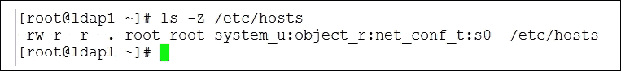

# 第十章 安全中心

Linux 安全不仅仅是书中的一章，它是一种生活方式。在你执行 CentOS 中的每一项任务时，你都应该考虑安全影响，以及如何让你的操作变得更加安全。当然，安全有很多形式，其中很多都很简单（例如，服务器房里上锁的物理安全等等）。在这一部分，我们将深入了解 **可插拔认证模块**（**PAM**）和 **SELinux**。不要害怕这两者，尤其是 SELinux；它们是你的朋友。在本章中，我们将涵盖以下内容：

+   **理解 PAM 配置文件**：PAM 的核心是位于 `/etc/pam.d` 中的文件；我将带你了解它们的语法和含义。

+   **PAM 的限制**：通过 PAM 的限制模块，我们可以限制用户会话中可以使用的系统资源。

+   **SELinux**：这是一个快速指南，涵盖了 SELinux 从文件系统到用户视角的内容。

+   **加固 Linux**：这是一个关于如何保护你的 Linux 服务器的检查清单。

# 理解 PAM 配置文件

与其将认证功能构建到每一个需要它的应用程序中，大多数 Linux 服务会使用如 PAM 这样的模块。这些模块具有 `.so` 扩展名，用于标识它们是标准模块，并且是由程序而不是内核直接使用的。它们通常位于 `/lib/security` 或 `/lib64/security` 目录下，具体位置取决于你的系统是 32 位还是 64 位。每个具有 PAM 功能的服务或程序都有自己的配置文件，规定如何强制执行认证和会话设置；这些文件位于 `/etc/pam.d` 中。快速查看这个文件夹，你会看到一些熟悉的名称，如 `sshd`、`sudo`、`su` 和 `login`，它们都代表了具有一定认证功能的服务。

`/etc/pam.d/login` 文件将由控制台登录程序使用，`/etc/pamd/sshd` 则由 OpenSSH 服务器使用。每个配置文件中会有多行内容，每一行都包含类型、控制、模块路径以及可选的模块参数设置。

从下图中，你可以对文件语法有所了解，并看到四种类型的设置：账户、认证、会话和密码。


以以下这一行作为例子：

```
account  required  pam_nologin.so
```

这一行来自 `/etc/pam.d/login` 文件，并且已为指定模块 `pam_nologin.so` 设置了 `account` 类型，控制设定为 `required`：此模块会检查 `/etc/nologin` 文件的存在情况；如果该文件存在，即使身份验证成功，用户也无法访问系统。他或她将看到 `/etc/nologin` 文件的内容或一个通用消息，说明无法登录。此方法本身成为一种临时禁用登录服务器的简单方式，只需创建 `nologin` 文件；删除文件即可重新启用登录。

PAM 配置文件的每个元素如下所示。

## 类型

类型定义了模块何时会被调用。共有四种有效的类型：

+   **账户**: 通常用于根据一天中的时间、最大用户数、并发登录等条件来限制或允许访问服务。可以将这些视为账户限制。

+   **认证**: 用于确定用户身份，通常是通过提示输入密码。此模块也可以用于授予用户组成员资格。

+   **密码**: 此类型用于更新用户的认证令牌；通常是密码。通常，每个挑战和响应认证方法需要加载一个模块。

+   **会话**: 关联于在用户访问服务器之前必须完成的事件，例如创建主目录（如果需要）。

## 控制

控制字段表示基于模块返回的成功或失败，PAM-API 的行为。

+   **required** (`success=ok new_authtok_reqd=ok ignore=ignore default=bad`): 失败最终会导致 API 返回 `failure`，但只有在其他模块执行完后才会返回。

+   **必需** (`success=ok new_authtok_reqd=ok ignore=ignore default=die`): 类似于“required”，但是控制和失败会立即返回给调用服务。

+   **足够** (`success=done new_authtok_reqd=done default=ignore`): 此类型模块的成功足以满足认证要求，除非先前的必需模块失败。此类型模块的失败不会致命。

+   **可选** (`success=ok new_authtok_reqd=ok default=ignore`): 此模块的成功或失败不重要。

### 提示

最近，第二种标记（括号内的内容）用于表示控制值，认为这是对含义更好的解释。

## 模块路径

模块路径将包括引用模块的完整文件系统路径，路径以 `/` 文件系统开头，或者是相对于 `/lib/security` 或 `/lib64/security` 目录的路径。

## 模块参数

模块参数是一个以空格分隔的标记列表，可以修改模块的行为。以下是一个示例：

```
silent umask=077 skel=/etc/skel
```

我们可以将参数组合在一起，举个例子，在用户首次登录时为他们创建家目录。这在我们一次性创建许多账户时很有用，可以避免同时创建家目录时过载服务器。这在大学等地方非常常见，很多账户是批量创建的。

用户很可能通过 SSH 连接到服务器，因此我们应该考虑将以下行添加到 `/etc/pam.d/sshd` 文件中：

```
session  required  pam_mkhomedir.so  umask=0077 skel=/etc/skel
```

该机制利用 PAM 在用户登录时创建家目录。

# PAM 的限制

目前我们继续使用 SSH 登录。许多用户可能只通过 SSH 访问服务器，可能在 Windows 上使用 PuTTY SSH 客户端。如果我们想控制对系统资源的访问，可以通过 PAM 和 `pam_limits.so` 来实施限制。我们应该将以下行添加到 `/etc/pam.d/sshd` 文件中：

```
session required pam_limits.so
```

这将实现该模块，但我们仍然需要在 `/etc/security/limits.conf` 文件中设置限制；该模块从此文件中读取。文件的结构如下，以下元素构成 limits 文件中的一行：

```
<domain> <type> <item> <value>
```

## 域

域表示限制适用的对象。通常，这是一个用户名，例如 `user1`，或者一个组条目，例如 `@users`；`@` 符号用于区分用户名和组名。要对所有没有自己条目的账户应用默认限制，可以使用通配符 `*`。

## 类型

类型可以设置为 `soft`、`hard` 或两者的组合（用 `-`）。使用 `hard` 限制来强制执行硬资源限制。这些限制由 root 用户设置并由内核强制执行。用户不能将其系统资源需求提高到这些值之上。强制执行限制前请小心测试，因为如果无法创建足够的进程，可能会导致系统崩溃。

`soft` 限制用于强制执行软资源限制。这些限制是用户可以在允许的范围内上下调整的，前提是没有预设的硬性限制。使用这个标记指定的值可以视为正常系统使用的默认值。使用 `-` 符号则是同时强制执行软性和硬性资源限制。

## 项

项表示正在进行限制的系统资源。可以限制的命令项包括以下内容：

+   **nofile**: 这设置了最大打开文件数

+   **maxlogins**: 这是除 uid=0 用户外，此用户的最大登录次数

+   **maxsyslogins**: 这是系统上所有登录的最大数量

+   **priority**: 这是运行用户进程的优先级（负值提升进程优先级）

+   **nice**: 这是允许提升的最大优先级（适用于 Linux 2.6.12 及更高版本）值：[-20,19]

从前面的部分项目列表中可以看到，确实可以为某些用户分配比其他用户更高的 CPU 优先级，这对于那些访问时间要求较高的呼叫中心群体非常有用。以下示例会给销售团队分配比普通用户更高的优先级，普通用户的优先级通常为 0：

```
*            -   priority    0
@telesales   -   priority   -5
```

限制并发登录也可能会很有用，类似于以下条目的设置：

```
@users  -   maxlogins   1
```

这些限制对于服务器的运行和安全可能非常重要。因此，请花时间研究在你的环境中最适合的设置，更多信息可以参考手册页面：

```
$ man 5 limits.conf

```

# SELinux

我不太确定我是否能量化在互联网上我所读到的多少博客，其中“解决方案”是禁用 SELinux，或者至少将其设置为宽容模式。虽然我并不反对即时问题可能因此得到解决，但这有点像将文件系统权限设置为所有用户都可以读写执行，无论是否经过认证。同样，我们也开玩笑说用户把密码写在便签纸上贴在屏幕上；管理员不当禁用 SELinux 与此没有太大区别。

**强制访问控制**（**MAC**）列表存在是有原因的，我们作为管理员应该利用它。传统上，我们习惯于使用**自主访问控制**（**DAC**）列表，这些列表可以由用户或 root 设置。MAC 被称为强制性的，因为它只能由 root 应用或撤销。

首先应用 DAC 列表，然后是 MAC 列表。SELinux 永远不会赋予本来没有的额外权限。我们真正的优势在于，可以根据进程启动时的 SELinux 上下文或它访问的内容，赋予同一进程不同的权限。因此，通过`init`守护进程启动的服务进程，可以拥有与普通用户在非`init`进程中启动的相同进程不同的权限。SELinux 非常强大，我们只需要了解如何有效利用它的力量。

## 查看当前 SELinux 模式

SELinux 有两种模式，但如果包括禁用模式，它可以在三种模式下运行。操作模式如下：

+   强制

+   宽容

SELinux 在这两种模式下都是启用的，但只有`强制`模式会应用并执行 SELinux 策略。在`宽容`模式下，策略会被读取，但不会被执行；不过，我们仍然可以从审计日志中查看任何拒绝的记录。即使在`宽容`模式下没有强制执行这些拒绝，日志条目仍然会显示为拒绝。可以使用`/usr/sbin/getenforce`命令来显示当前的 SELinux 模式：

```
$ getenforce

```

这个设置也可以从`/selinux/enforce`文件中读取：

```
$ cat  /selinux/enforce

```

整数 1 和 0 分别代表 SELinux 模式：`Enforcing` 和 `Permissive`。请注意，`/selinux` 目录是 CentOS 中的 SELinux 挂载点；在其他系统中，可能是 `/sys/fs/selinux`，或者可以检查 `sestatus` 的输出，如以下截图所示：


可以通过 `sestatus` (`/usr/bin/sestatus`) 命令读取模式；此命令返回更多信息，包括当前模式以及在 `/etc/selinux/config` 中配置的模式。

## 设置 SELinux 模式

与 Linux 中的大多数任务一样，设置 SELinux 模式非常灵活，可以通过多种方式设置。首先，我们将看看使用 `setenforce` (`/usr/sbin/setenforce`) 的方法：

```
# setenforce 1
# setenforce Enforcing
# setenforce 0
# setenforce Permissive

```

前两个选项用于将模式设置为 `Enforcing`，底部两个选项用于设置为 `Permissive`，这两种方法都可以使用，因为单词和数字与 `setenforce` 命令的含义相同。

我们也可以通过直接写入 SELinux 挂载点中的控制文件来设置模式：

```
# echo 1 > /selinux/enforce
# echo 0 > /selinux/enforce

```

如果我们需要更多设置方式，还可以在启动时使用内核选项。向 GRUB 配置文件中的内核条目追加内容将覆盖 `/etc/selinux/config` 文件中的默认模式：

```
enforcing=1
enforcing=0
```

最后，我们可以在 `/etc/selinux/config` 文件中配置模式。

## 防止从命令行更改模式

我知道很多系统管理员会轻易将系统设置为 `Permissive` 以便提供一个 *快速修复*；如果这与你的管理政策相悖，则可以在启动时使用 `setsebool` (`/usr/sbin/setsebool`) 命令强制设置模式；也许在系统启动时作为脚本：

```
# setsebool secure_mode_policyload on

```

一旦设置，模式就不能从启动过程中的文件或内核启动参数更改。这可以通过以下截图看到，当尝试更改模式时。


以这种方式设置的设置将持续到下次启动。如果我们希望此设置始终生效，可以通过 `-P` 选项将其设置为真正持久。使用时要小心，因为它的作用就是按照字面意思操作，设置将被持久化。

### 提示

实施以下命令时需要小心：

```
# setsebool -P secure_mode_policyload on

```

## 理解 SELinux 上下文

SELinux 将尝试将进程的上下文与正在访问的资源的上下文匹配；生效的 SELinux 策略将指定从给定上下文访问资源时允许的权限。SELinux 上下文由四个字段组成，请注意，用户是 SELinux 用户，而非标准 Linux 用户：

+   用户

+   角色

+   类型

+   敏感度

### 提示

从技术上讲，文件有一个类型，而用户或进程有一个域，但实际上，类型和域都以 `-t` 结尾。

我们可以使用 `ls -Z` 查看文件的上下文，如下所示：

```
$ ls -Z /etc/hosts

```

请参阅以下截图：



输出显示 `/etc/hosts` 文件的 SELinux 用户、角色、类型和敏感度：

+   `system_u`

+   `object_r`

+   `net_conf_t`

+   `s0`

我们可以使用 ID 命令查看用户的 SELinux 上下文：

```
$ id -Z

```

请参阅以下截图：


从命令输出中我们可以看到，当前该用户（`user`）的 SELinux 上下文是：

+   `unconfined_u`

+   `unconfined_r`

+   `unconfined_t`

+   `s0` 敏感度（`s0` 从 `s0` 开始并停止）和任何类别（`c0` 到 `c1023`）

要查看进程的 SELinux 上下文，我们可以使用 `ps` 命令。在这个示例中，进程 ID 为 `1629` 表示 Nginx 服务器：

```
# ps -Z 1629

```

超过 90% 的 SELinux 策略与类型 (`_t`) 一起工作，因此通常我们会在这里进行故障排除。

## 故障排除 SELinux

现在我们来看看当文件资源和进程的上下文与 SELinux 策略不匹配时会发生什么。

为了演示，我将使用 CentOS 6.5 和 Apache httpd web 服务器。为了制造 SELinux 命令问题，web 服务器将配置为访问一个别名目录，这个目录位于正常的 `/var/www` 结构之外。这个设置可以模拟一个常见的过程，即你希望通过 HTTP 提供 kickstart 文件，以帮助自动安装工作站和服务器。

当然，一旦我们在 `/var/www/` 目录之外工作，文件的上下文或标签将不再与 web 服务器的预期匹配，尽管我们满足 DAC（文件权限）的要求，访问仍会被拒绝。

### 提示

web 服务器配置正确，允许 URL `/ks` 指向 `/install/ks`，因为它已经通过别名添加了这一点。

请考虑以下命令：

```
# mkdir  -m 755 -p /install/ks
# cp /root/anaconda-ks.cfg /install/ks
# chmod 644 /install/ks/anaconda-ks.cfg

```

配置完成后，我们可以重启 web 服务器并测试访问正常的 web 根目录以及 URL `/ks`。为了演示方便，我安装了命令行浏览器 `w3m`：

```
$ w3m localhost

```

这个操作有效并显示标准的欢迎页面。现在使用以下命令：

```
$ w3m localhost/ks

```

我们将看到一个相当不祥的 **禁止访问** 页面，如下图所示：


如果我们启用了审计，SELinux 拒绝的信息将写入审计日志文件 `/var/log/audit/audit.log`。我们可以使用 `ausearch`（位于 `/sbin/ausearch`）来查询此文件：

```
# ausearch -m avc -ts recent

```

我们在命令中使用的选项解释如下：

+   `-m`：这是要搜索的消息。我们查找 `avc`，即 SELinux 拒绝的信息。

+   `-ts`：这是时间开始。如果我们使用 `recent`，意味着从 10 分钟前开始。输入 `today` 也可以常用。

`ausearch` 命令的输出如以下截图所示：


从输出结果来看，我们被拒绝了对 PID 为 `1731` 的进程的读取访问。在访问 `/ks` 目录时，我们正在运行 `httpd` 命令，而该目录在 `sda3` 文件系统中的 inode 为 `22341`。这一细节给我留下了深刻印象！主体上下文是 `httpd_t` 类型，目标是 `default_t` 类型。主体是进程 1731，目标是文件，在这种情况下它们的上下文不匹配，因此访问被拒绝。

我们可以使用命令`chcon`（位于`/usr/bin/chcon`），通过直接修改目标的 SELinux 上下文或通过引用我们已知有效的目录上下文（例如 `/var/www/html`）来改变目标的 SELinux 上下文。

```
# chcon -Rv --reference /var/www/html /install/ks

```

+   `-v`：这使文件变得详细。

+   `-R`：这个选项会递归所有文件和子目录。

+   `--reference`：这意味着从此文件复制上下文。

或者，我们可以直接设置上下文；不过，为了准确和简便起见，我更倾向于使用 `--reference` 方法。

```
# chcon -Rv --type httpd_sys_content_t  /install.ks

```

`httpd_t` 类型的进程可以访问包括 `httpd_sys_content_t` 在内的资源，因此通过这个简单的更改，我们现在应该可以通过 Web 服务器访问 `/ks` 目录，而不需要禁用 SELinux。

# 加固 Linux

我们可以通过前面使用 SELinux 的例子来探讨“加固 Linux”的含义，但这通常并非简单的选择。以 SELinux 为例，简单的做法是设置为 `Permissive` 模式，但这并不符合我们系统的最佳安全要求。

从密码开始，问问自己：你的系统上密码多久更换一次？root 密码上次更换是什么时候？多少人可以访问 root 密码？我遇到过许多情况，root 密码从未更改过，所有管理员似乎都有 root 密码的访问权限。尽管这种做法可能在短期内有助于管理系统，但这并不是一种安全的操作方式。想想有多少曾经在你公司工作过的人仍然能够访问 root 用户密码。

当然，系统安全必须为你和公司服务，但安全系统的需求永远不应被低估。对于 root 访问，考虑使用 `sudo` 而不是 `su`，并且不要将 root 密码提供给每个管理员。

同样，要确保对具有`sudo`权限的账户以及 root 账户使用强密码。

## 密码审计

我将使用“密码审计”这个术语，因为我确实认为这个工具突出了对密码策略进行充分监控的必要性。你可以要求用户使用强密码，在一定程度上我们可以通过使用 PAM 模块来强制执行这一点。然而，有多少用户使用相同的密码呢？也许是经理们的密码是由助理设置的。也有可能你没有意识到禁止使用弱密码的重要性，通常为了避免遗忘用户出现的问题。Openwall 的 `john` 包（[`www.openwall.com`](http://www.openwall.com)）是一个不容错过的工具，帮助你理解强密码和密码算法的必要性。

RPM 不在仓库中，但可以从 Openwall 网站获得。

## 准备密码文件

密码审计工具 john 会期待用户和密码在一个文件中，因此我们将使用`pwunconv`（`/usr/sbin/pwunconv`）命令将`/etc/shadow`文件中的密码添加到`/etc/passwd`文件中。虽然这并非理想做法，但你拥有密码文件；你可以将其复制到自己的目录，并使用`pwconv`切换回`/etc/shadow`文件。john 的目的是展示如果密码安全不到位，可能发生的情况，而获得服务器的恶意 root 权限并非闻所未闻。即使 john 是作为演示运行，它也成了展示弱密码可能造成后果的一个好工具，实验室机器用作演示完全没问题。

`pwunconv`命令以 root 身份运行足以将密码从 shadow 文件读取到`/etc/passwd`文件中。

## 破解密码

现在我们已经准备好了密码文件，可以将其复制到我们自己的主目录中：

```
# cp /etc/passwd /root/passwd

```

这一步并非严格要求，但如果这不是实验室机器，执行该操作将使你能够尽可能快速地转换回 shadow 文件。运行以下`john`命令，指定你希望破解的密码文件路径。密码文件应包含用户和密码。

```
# john /root/passwd

```

这将开始破解它找到的密码。在我的文件中，只有一个用户有密码，并且使用的是默认的 SHA512 加密。

### 提示

在我的系统上，一个简单的密码`Password1`只用了 1 分钟 45 秒就被破解了。

## 削弱算法

密码足够弱，但如果我们也削弱了算法呢？MD5 只有 128 位或 16 字节加密；这会对结果产生什么影响？我们可以使用`chpasswd`（位于`/usr/sbin/chpasswd`）命令生成使用 MD5 而非 SHA512 加密的密码：

```
# echo andrew:Password | chpasswd  -c MD5

```

该命令会写入`/etc/passwd`文件；如果你需要写入到自己的文件中，可以使用`-S`将输出发送到`stdout`，并将显示的文本添加到自己的密码文件中：

```
# echo andrew:Password | chpasswd -S  -c MD5

```

现在我们可以再次尝试运行 john。然而，为了确保新密码能够公平破解，请删除包含原始密码的`john.pol`文件：

```
# rm ~/.john/john.pot

```

`john.pot`文件包含以前破解的密码；因此，为了进行真实的比较，我们应该确保该文件不存在。现在，在我的系统上运行相同的测试，使用相同的密码设置，但仅使用 128 位加密，破解只花了 0.8 秒。

## 强化密码

设置了更安全的密码后，我们可以看到破解密码所需的时间差异，因为这将需要暴力破解攻击。在这个示例中，我们使用的密码是`27csg0TNWoUS`。对我来说，这更像是一个密码短语，因为我会记住它作为*美国西北部第 27 侦察小组*。无论如何，我相信你有自己的方式来记住复杂的密码，而不需要用便签纸。

设置了密码并启用了 MD5 加密后，我让程序运行了 20 分钟，程序仍未破解密码。随着时间的推移，从 0.8 秒（使用简单密码）到 20 分钟的变化，充分展示了使用安全密码的意义，以及与依赖强算法相比，强密码的效果要强大得多。

从这几步开始，你的 Linux 系统将从一开始就更加安全。

# 概述

在这一章中，我们走在了安全的路上。从了解 PAM 模块如何工作开始，探索我们如何利用这些模块帮助我们进行管理和安全性。我们看到，我们可以创建用户的主目录，因为他们是通过 PAM 和即时创建方法登录的。我们还看了如何使用 `/etc/security/limits.conf` 限制或授予用户和组更多的访问权限。随后，我们花了一些时间了解 SELinux 并保护我们的 CentOS 主机。

下一章将讨论一些通用的最佳实践指南，涵盖本书中介绍的一些元素。
