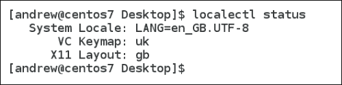
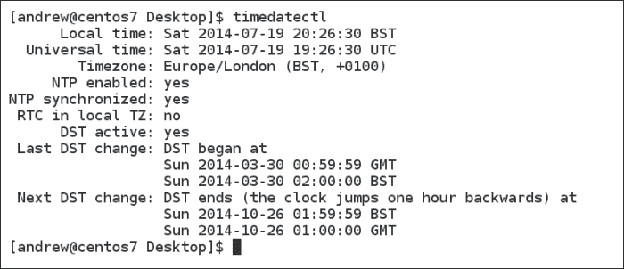
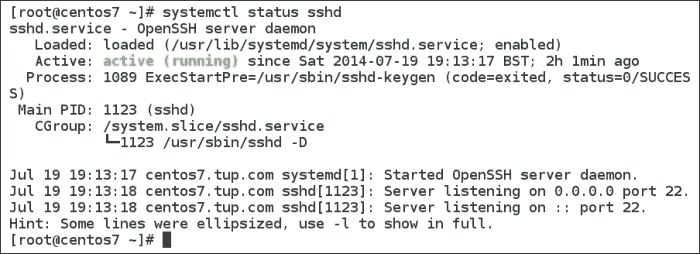

# 第十一章 毕业日

我们已经到达了 *CentOS 系统管理精要* 的最后一章，你已经接近 Linux 忍者；然而，在你可以大获成功之前，你将学习一些在部署 CentOS Linux 时需要考虑的最佳实践。本章将涵盖我们专门研究过的主题以及一些其他更通用的 CentOS 最佳实践。此外，我们还将快速浏览 Red Hat 和 CentOS 的企业版 Linux 7 中的新功能。

+   **保护远程访问您的系统**：在这里，我们将查看 OpenSSH 和您可能需要审查的一些考虑因素

+   **OpenLDAP 最佳实践**：在这里，我们确保您的目录服务按您的意愿运行

+   **Nginx 最佳实践**：配置 web 服务器时 dos 和 don'ts 的快速指南

+   **精通 Puppet**：在您的 Linux 服务器上安全的事项和如何进行安全设置的清单。

+   **CentOS 7 的新特性**：这份指南主要针对 CentOS 6.5，但现在 Red Hat 和 CentOS 都已推出企业版 Linux 7，我们将快速浏览其亮点

# 保护远程访问您的系统

使用 **安全外壳**（**SSH**）是一种通过命令方法远程访问您的服务器的方式。安全性主要通过数据加密来实现，但默认情况下还通过服务器认证进行增强。客户端可以将服务器提供的公钥与信任主机列表（或 SSH 称为 `known_hosts`）进行比较。这有点像使用您的 Web 浏览器访问 HTTPS 站点；有时我们可能会收到警告，说远程主机不受信任或无法识别。对于 SSH，我们不是像浏览器保存服务器的公钥那样，而是使用 `~/.ssh/known_hosts` 文件存储我们连接到的主机的 SSH 公钥。

## SSH 公钥

CentOS 和大多数 Linux 发行版上 SSH 客户端的默认行为是，在用户首次连接到远程主机时，提示用户接受远程主机的公共 SSH 密钥。除非密钥已经存在并且可能已经预共享，否则一旦接受，远程 SSH 主机的公钥将存储在该用户的 SSH 客户端存储中。在任何后续的连接中，只要是同一用户连接到同一远程主机，客户端将无需提示即可连接，因为主机已经是可信的。

## 分析默认设置的风险

默认设置提供了一个方便且大多安全的机制，用于获取远程主机的公钥。但有一个潜在问题，即我们在首次连接时连接的远程主机可能不是我们希望连接的受信任主机。由于没有认证机制，我们必须依赖信任和概率，在第一次连接时，连接将与正确的主机建立而不是冒名顶替者。

为了更安全地工作，我们可以调整客户端设置，使其仅连接到已经信任的主机，或者换句话说，只有当主机的公钥存储在本地密钥库中时才能连接。为了做出此调整，我们需要编辑`/etc/ssh/ssh_config`文件。`StrictHostKeyChecking`指令默认设置为`ask`，应该编辑为`yes`，以确保只有在我们拥有预共享密钥时才进行连接。

## 填充密钥库

如果我们选择后者方法，要求密钥已经预共享，那么我们需要解决填充密钥库的方法。我们可以手动将服务器的公钥复制到客户端存储，或者更容易地使用`ssh-keyscan`命令。虽然这个命令很方便，但它也带来了客户端提示接受密钥时固有的风险。如果在扫描过程中有恶意服务器，我们就会存储错误的密钥。现实情况是，唯一安全的方法是将密钥的物理副本发送给客户端。能够集中管理客户端密钥库无疑会使生活更加轻松，这可以通过`/etc/ssh/ssh_known_hosts`文件来实现。这样就能更方便地手动填充密钥库，因为我们只需要一个客户端文件，而不是每个用户在客户端机器上都有一个。

## 公钥认证

用户密码可能会对你的 SSH 服务器构成另一个安全风险。虽然密码在传输过程中是加密的，但用户——是的，我们都知道并喜爱他们——确实共享密码，并且可能会使用简单的密码，尽管不应该使用。对此的设置是哪些认证类型被允许，这由服务器上的`/etc/ssh/sshd.conf`文件控制。我们可以禁用基于密码的认证，使得用户必须使用客户端密钥。要禁用用户使用密码进行认证，你需要在远程主机上编辑该文件；查找`PasswordAuthentication`指令，并确保其设置为`no`；同时`PubKeyAuthentication`的设置应为`yes`。

在此设置完成后，用户需要在客户端设备上生成自己的公钥和私钥对，可以使用`ssh-keygen`命令。将公钥复制到服务器上的`~/.ssh/authorized_keys`文件中；可以使用`ssh-copy-id`命令来完成此操作：

```
ssh-copy-i <idfile>  user@server

```

## Root 登录

永远不应该允许以 root 身份登录 SSH 服务器；对于生产服务器来说，我认为这完全没有争议。需要管理设备的用户可以作为标准用户登录，并使用`sudo`或`su`来获取权限。这个设置同样存在于`/etc/ssh/sshd.conf`文件中的`PermitRootLogin`指令里。

## 结论

SSH 提供了一种安全的加密机制，以维护网络中的数据安全。启用客户端的 `StrictHostKeyChecking` 还可以实现主机认证，这样我们就可以确保将安全信息发送到正确的服务器。为了增强客户端认证，禁用服务器的 root 登录，并只允许具有预共享用户密钥的客户端进行身份验证。

# OpenLDAP 最佳实践

我们在本书中看到过，我们可以将用户账户集中管理在 OpenLDAP 服务器上，或者，如果我们想简化 CentOS 上的一些管理功能，可以使用 389-ds。无论哪种方式，底层目录都是 OpenLDAP。当然，如果用户账户存在于目录中，那么我们的认证令牌（密码）也会存在。我们需要确保这既安全又有效。OpenLDAP 支持不同的认证机制，每种机制当然有其优缺点，如下所示：

+   **简单绑定**：使用简单绑定认证机制时，客户端将明文密码传递给服务器进行身份验证。这带来了三种潜在威胁：密码可能会被网络抓包收集，密码可能会被伪造服务器地址的主机收集，密码也可能通过对服务器的恶意攻击被获取。使用 LDAPS 可以防范前两种威胁，但无法防范第三种。最好尽可能避免使用简单绑定认证。

+   **简单认证与安全层** (**SASL**) **外部**：这允许使用外部认证，如客户端 X.509 证书（TLS 公钥）来验证用户身份，并且可以克服固有的密码问题。如果 LDAP 客户端和 LDAP 服务器在同一台机器上，也可以使用 **LDAP over IPC** (**LDAPI**) 的 SASL 认证方法，在该方法中，用户的 Linux 凭证用于访问目录。

+   **SASL 密码**：可以使用基于密码的认证与 SASL，但随之而来的威胁类似于简单绑定。

如果你使用基于密码的身份验证，通常认为在多次失败的尝试后实现账户锁定是谨慎的做法。虽然在 OpenLDAP 密码策略中可以实现这一点，但现实情况是，在当今环境中，密码攻击往往比这更微妙，而这些机制反而为攻击者提供了锁定账户的手段。

允许用户在忘记密码时重置密码也变得越来越常见。虽然这减轻了帮助台的负担，但这往往是安全链中的一个薄弱环节，因为通常提供的挑战响应问题太容易被潜在攻击者知道或猜到。

在任何目录系统中，都有一个描述可以创建的每个对象（如用户或组）的模式，属性是该对象可能存在的特性。虽然可以编辑任何给定对象或属性的模式，但如果需要为某个对象添加额外的属性，最好创建你自己的定义，而不是直接在现有模式中添加它们。从长远来看，修改现有对象可能会导致在其他服务器上复制时出现问题，特别是如果所有服务器上的模式不完全相同。

# Nginx 的最佳实践

如果你选择部署 Nginx web 服务器，我们需要注意一些事项，以确保你的网站服务能够长时间稳定运行。

从安全角度来看，你的网站服务器可能对全世界所有人都可访问。因此，我们需要确保保护一些基本的安全威胁：

+   **SELinux**：确保在托管 Nginx 的 CentOS 系统上将 SELinux 设置为`Enforcing`模式。

+   **DocumentRoot**：将 DocumentRoot 结构独立挂载为自己的文件系统，确保恶意写入不会导致 Linux 主机崩溃（如果磁盘填满），其次，分区或磁盘可以以最小权限挂载，例如：`LABEL=web /var/www ext4 ro,nosuid,noexec,nodev,noatime 0 2`。

+   **使用基于主机的防火墙**：只允许传入的 TCP 端口`80`和`443`。通常，只需要打开传出的 UDP 端口`123`以及动态传出的 TCP 端口，端口`123`用于时间同步。

+   **限制 Nginx 可用的 HTTP 方法**。RFC 2616 允许多种 HTTP 访问方法；大多数方法在你的服务器上是没有必要的。我们可以添加类似以下的代码，检查不等于 GET、HEAD 和 POST 的方法，然后拒绝其他不需要的访问方法，如 DELETE、SEARCH 等：

    ```
    if ( $request_method !~ ^(GET|POST|HEAD)$ ) {
        return 403;
    }
    ```

+   **用户代理**：我们还可以选择阻止某些用户代理，这些浏览器通常与扫描器、机器人或垃圾邮件发送者相关联。HTTP 头中的`$httpd_user_agent`变量会显示浏览器的类型，例如 Internet Explorer、Mozilla 等。除了这些常规浏览器，还有一些自动化浏览器可以通过脚本如`wget`和`BBBike`访问你的站点。尝试将以下内容添加到你的`nginx.conf`文件中，以阻止这些代理：

    ```
    if ($http_user_agent ~* wget|BBBike|LWP::Simple ) {
        return 403;
    }
    ```

+   **限制 IP 访问**：如果某个特定目录只允许内部网络访问，你可以在主机配置中使用类似以下的代码：

    ```
    location /var/www/docs {
        allow 192.168.0.0/24
        deny all
    }
    ```

+   **限制文件所有权**：Nginx Web 服务器将以名为 `nginx` 的用户身份运行。诱惑是将 Nginx 用户添加为 DocumentRoot 目录及其中所有 Web 内容的所有者。这样做不建议，因为文档所有者、用户或组可能会获得额外的权限，比如删除你无法写入的文档。通常，`nginx` 用户应通过 `others` 获得访问权限，并且我们将 `others` 限制为目录上的 `r-x` 和文件上的 `r--`。典型的文件权限应类似于以下内容：

    ```
    -rw-r--r-- 1 root root 1000 Feb 1 10:00 index.html
    ```

# 掌握 Puppet

使用 Puppet 服务器集中管理配置时，记住在设置 Puppet 主机时的几个相关事实是很有价值的。

+   **使用模块**：`/etc/puppet/modules` 目录允许创建模块。模块是在 Puppet `ModulePath` 指令下创建的子目录，包含需要分发到客户端的文件和配置，作为其期望状态的一部分。这简化了 Puppet 配置，因为相关的文件都在模块目录中。

+   **使用版本控制**：Puppet 本身没有版本控制，但我们可以使用类似 GIT 或 **subversion** (**svn**) 的工具来维护配置的历史版本。

+   **风格**：在编写 Puppet 配置时，标准化语法风格有助于维护和可读性。Puppet Labs 的风格指南可以在[`docs.puppetlabs.com/guides/style_guide.html`](http://docs.puppetlabs.com/guides/style_guide.html)找到。

# CentOS 7 的新特性

CentOS 7 于 2014 年 6 月发布，同时也发布了早期的 Red Hat Enterprise Linux 7。随着 Linux 内核 3.10 在本次发布中的引入，发行版也有其他重要更新。

## 本地化

系统的本地化信息可以通过 `localectl` 命令方便地设置和显示：

```
$ localectl status

```

输出可以在以下截图中看到：



## 时间和日期信息

与本地化信息类似，CentOS 7 包含一个简单的命令，用于显示和管理主机系统的时间和日期设置：`/usr/bin/timedatectl`。这对于我们管理员来说真是一个天赐之物；即使我们只使用该命令来显示输出，这个命令也会显示时间、时区和 NTP 设置。以下截图展示了没有选项的 `timedatectl` 命令输出：



继续使用 `timedatectl` 命令，我们可以使用以下命令更改日期：

```
# timedatectl set-time 2014-07-19

```

可以使用相同的选项和时间作为参数来设置时间，如下所示：

```
# timedatectl set-time 23:02:23

```

NTP 时间同步可以通过以下命令启用和禁用；不过，它使用的是新的系统服务管理器来启用和禁用时间服务：

```
# timedatectl set-ntp yes

```

这真是一个多功能的命令；你将会非常快速地学会它。

## 管理服务

`Systemd`现在是 CentOS 7 中的系统和服务管理器，取代了 Upstart，成为默认的 init 系统。它不仅替代了 Upstart，还与传统的 System V init 脚本向后兼容。对我们管理员来说，最需要熟悉的主要命令是`/usr/bin/systemctl`。

从`status`子命令开始，我们可以立即看到`systemctl`如何为我们提供便利。在这里，我们查看 SSH 服务的状态：

```
# systemctl status sshd

```

输出内容相当详细，包含**进程 ID**（**PID**）和最近的日志文件活动。你可以在下面的截图中查看这些内容。



我们可以使用以下命令停止服务：

```
# systemctl stop sshd

```

要禁用服务的自动启动，我们将使用`disable`子命令：

```
# systemctl disable sshd

```

一个被禁用的服务仍然可以由管理员启动；“禁用”一词只是意味着该服务的自动启动被禁用了。`systemd`带来的新功能是能够防止手动启动服务：

```
# systemctl mask sshd

```

即使管理员尝试在服务被掩蔽时启动该服务，服务也不会启动。如果需要重新启用服务，管理员需要使用`unmask`子命令：

```
# systemctl unmask sshd

```

## 除了使用单用户模式修复机器之外，还可以采取其他修复方法

在传统环境中，我们可能习惯于使用运行级别 1，或单用户模式，作为将系统置于维护模式的机制。随着 system 的引入，运行级别的概念发生了变化，现在我们有了目标而不是运行级别。要将正在运行的系统置于维护模式，可以使用以下命令：

```
# systemctl rescue

```

在完成操作时，会提示你输入 root 用户密码。如果这仍然无法修复系统，那么还有一个紧急目标，它会启动更少的服务，只允许 root 访问：

```
# systemctl emergency

```

紧急目标与使用`init=/bin/bash`内核参数启动 CentOS 6.5 机器非常相似。从这些命令中你可能也已经猜到，我们还可以使用`systemctl`关机和重启系统：

```
# systemctl reboot
# systemctl halt

```

当然，`shutdown`命令仍然存在，也可以用来执行此操作。

## 远程管理

使用 system 也可以管理远程系统，它也使用相同的`systemctl`命令。如果我们需要查看主机`s1.tup.com`上`atd`服务的状态，可以执行以下命令：

```
$ systemctl -H root@s1.tup.com status atd

```

这只是利用 SSH 连接到远程主机，因此`22`端口和 SSHD 必须在我们监控的远程主机上可访问。

## Systemd 和非标准子命令

现在通过`systemctl`和`systemd`可用的子命令已标准化，而在 System V init 脚本中，任何参数或子命令都可以添加到脚本中。例如，在 CentOS 6.5 中的 Apache HTTPD 服务，我们可以发出`service httpd graceful`命令。`graceful`参数是 Web 服务器特有的，因此它不是作为`systemctl`中的子命令构建的；然而，通过使用`apachectl graceful`命令也可以实现相同的结果。谈到 Apache Web 服务器，默认的 DocumentRoot 已从`/var/www`更改为`/usr/share/httpd`。

## Samba 4.1 包

对于 Windows 域、文件和打印服务，Samba 4.1 替代了老旧的 Samba 3，该版本曾随 CentOS 6.5 及之前版本的系统一起提供。

## 文件系统更改

默认文件系统现在是 XFS，取代了 ext4。XFS 已经存在很长时间，但显然现在正在引起企业 Linux 社区的关注。

## 密码策略

强制密码质量的 PAM 模块现在默认为`pam_pwquality`，替代了较老的`pam_cracklib`。编辑`/etc/security/pwquality.conf`文件可以指定最低密码长度和密码复杂性。密码复杂性包括：

+   **minclass**：这是最少的字符类别类型数量，包括大写字母、小写字母、数字和非字母数字字符

+   **maxsequence**：此选项限制同一类别字符的连续数量，例如`12345`或`bcfag`；这两个序列都有五个连续字符，而`bcafG`只有四个来自同一类别（小写字母）的字符。

+   **maxrepeat**：此选项限制重复字符的数量

现有的文件可以作为示例，或者我们可以使用`man 5 pwqulality.conf`命令查看手册以获取更详细的信息。

# 总结

现在你准备好走出这个世界，宣布你对 CentOS 的新知识。我已经帮助你通过一些简单的最佳实践目标来管理我们在本书中所涉及的服务，并介绍了 CentOS 7 的一些新元素。当然，在很长一段时间里，你仍然会遇到许多 CentOS 6 系统来保持忙碌，大部分元素从版本 6 到版本 7 保持一致，但跟上最新的增强功能始终是有用的。
