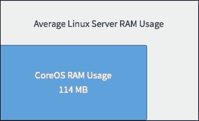
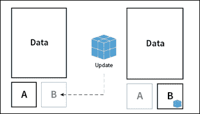
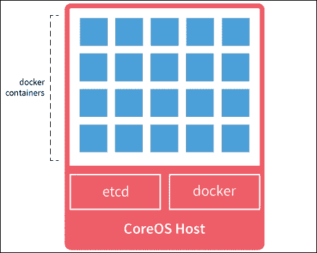
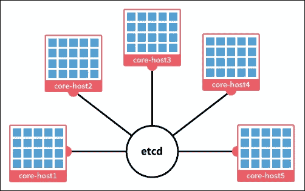
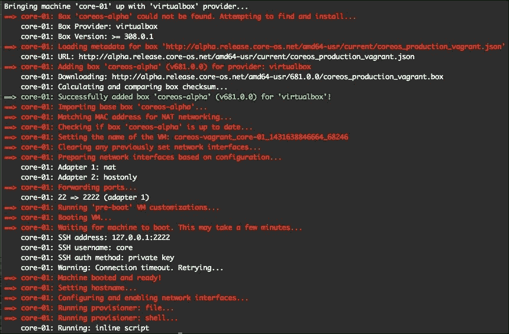
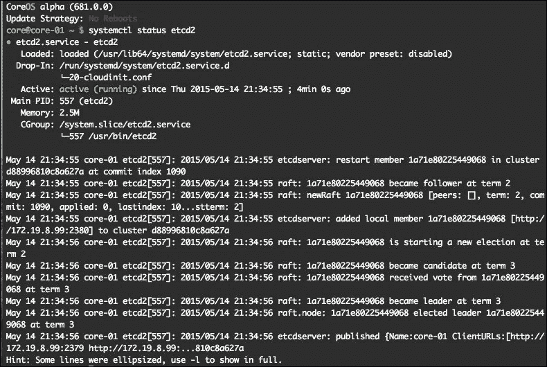
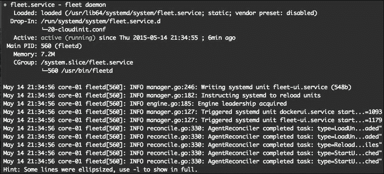
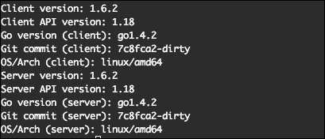

# 第一章：CoreOS – 概述与安装

CoreOS 通常被描述为大规模服务器部署的 Linux，但它也可以轻松地作为单一主机运行在裸金属、云服务器上，甚至可以作为虚拟机在你的计算机上运行。它旨在运行 `docker` 和 `rkt` 应用容器，稍后你将在本书中了解它的主要功能。

本书是一本实用的、以示例为驱动的指南，帮助你学习 CoreOS Linux 操作系统的基础知识。我们假设你有 VirtualBox、Vagrant、Git、Bash 脚本和命令行（UNIX 类计算机的终端）的经验，并且已经在 Mac OS X 或 Linux 计算机上安装了 VirtualBox、Vagrant 和 git，这些将是前几章所需的工具。至于云安装，我们将使用 Google Cloud 的 Compute Engine 实例。

到本书结束时，你应该已经熟悉如何在你的笔记本或台式机以及云端上设置 CoreOS。你将学习如何设置本地计算机开发机器以及本地和云中的集群。此外，我们还将涵盖 `etcd`、`systemd`、`fleet`、集群管理、部署设置和生产集群等内容。

另外，最后一章将介绍 Google Kubernetes。这是一个开源的容器编排系统，用于管理 `docker` 和 `rkt` 容器，并允许在计算集群中将它们作为一个整体进行管理。

本章中，你将学习 CoreOS 的工作原理，并通过 VirtualBox 和 Vagrant 的帮助，在你的笔记本或台式机上进行基本的 CoreOS 安装。

本章我们将基本讨论两个主题：

+   CoreOS 概述

+   安装 CoreOS 虚拟机

# CoreOS 概述

CoreOS 是一个最小化的 Linux 操作系统，旨在运行 `docker` 和 `rkt` 容器（应用容器）。默认情况下，它被设计用于构建强大且易于管理的服务器集群。它为所有机器提供自动、非常可靠且稳定的更新，从而减轻了 `sysadmins` 的维护负担。而且，通过将一切都运行在应用容器中，这种设置使得你可以非常轻松地扩展服务器和应用，替换故障的服务器仅需几分之一秒，等等。

# CoreOS 如何工作

CoreOS 没有包管理器，因此一切都需要通过 `docker` 容器进行安装和使用。此外，CoreOS 在 RAM 使用效率上比普通 Linux 安装高出 40%，如下图所示：



CoreOS 使用主动/被动双分区方案进行更新，将其作为一个整体进行更新，而不是采用逐个包的方法。其根分区是只读的，只有在应用更新时才会发生更改。如果更新在重启时失败，它将回滚到之前的启动分区。下图展示了操作系统更新被应用到 B 分区（被动）并在重启后变为启动用的活动分区。



`docker` 和 `rkt` 容器作为应用程序在 CoreOS 上运行。容器为应用程序打包提供了非常好的灵活性，且能够非常快速地启动——仅需几毫秒。下图展示了 CoreOS 的简洁性。底层是 Linux 操作系统，第二层是带有 docker 守护进程的 `etcd/fleet`，顶层是服务器上运行的容器。



默认情况下，CoreOS 被设计为以集群形式工作，但它也能很好地作为单个主机工作。通过 `fleet` 可以非常容易地跨集群机器控制和运行应用容器，并使用 `etcd` 服务发现将它们连接在一起，正如下图所示。



CoreOS 可以轻松部署在所有主要的云服务提供商上，例如 Google Cloud、Amazon Web Services、Digital Ocean 等等。它在裸金属服务器上也运行得非常好。此外，它还可以通过 Vagrant，使用 VirtualBox 或 VMware 虚拟机支持，轻松安装在运行 Linux、Mac OS X 或 Windows 的笔记本或台式机上。

这段简短的概述应该能帮助你理解 CoreOS 的基本概念及其功能。接下来，让我们进入实际操作，安装 CoreOS 到我们的笔记本或台式机上。

# 安装 CoreOS 虚拟机

要使用 CoreOS 虚拟机，你需要在计算机上安装 VirtualBox、Vagrant 和 git。

在接下来的示例中，我们将在本地计算机上安装 CoreOS，这将作为 VirtualBox 上的虚拟机。

好的，让我们开始吧！

## 克隆 coreos-vagrant GitHub 项目

让我们克隆这个项目并启动它。

在终端中（从现在开始，我们将只使用终端短语，并用 `$` 来标记终端提示符），输入以下命令：

```
$ git clone https://github.com/coreos/coreos-vagrant/

```

这将从 GitHub 仓库克隆到你计算机上的 `coreos-vagrant` 文件夹。

## 使用 cloud-config

要启动单个主机，我们需要通过用户数据文件以 `cloud-config` 格式提供一些 `config` 参数。

在你的终端中，输入以下命令：

```
$ cd coreos-vagrant
$ mv user-data.sample user-data

```

用户数据应该包含类似这样的内容（`coreos-vagrant` GitHub 仓库不断更新，所以当你克隆仓库时，可能会看到稍有不同的内容）：

```
#cloud-config
coreos:
  etcd2:
    #generate a new token for each unique cluster from https://discovery.etcd.io/new
    #discovery: https://discovery.etcd.io/<token>
    # multi-region and multi-cloud deployments need to use $public_ipv4
    advertise-client-urls: http://$public_ipv4:2379
    initial-advertise-peer-urls: http://$private_ipv4:2380
    # listen on both the official ports and the legacy ports
    # legacy ports can be omitted if your application doesn't depend on them
    listen-client-urls: http://0.0.0.0:2379,http://0.0.0.0:4001
    listen-peer-urls: http://$private_ipv4:2380,http://$private_ipv4:7001
  fleet:
    public-ip: $public_ipv4
  flannel:
    interface: $public_ipv4
  units:
    - name: etcd2.service
      command: start
    - name: fleet.service
      command: start
    - name: docker-tcp.socket
      command: start
      enable: true
      content: |
        [Unit]
        Description=Docker Socket for the API

        [Socket]
        ListenStream=2375
        Service=docker.service
        BindIPv6Only=both
        [Install]
        WantedBy=sockets.target 
```

将 `etcd2:` 和 `fleet:` 行之间的文本替换成如下内容：

```
  etcd2:
    name: core-01
    initial-advertise-peer-urls: http://$private_ipv4:2380
    listen-peer-urls: http://$private_ipv4:2380,http://$private_ipv4:7001
    initial-cluster-token: core-01_etcd
    initial-cluster: core-01=http://$private_ipv4:2380
    initial-cluster-state: new
    advertise-client-urls: http://$public_ipv4:2379,http://$public_ipv4:4001
    listen-client-urls: http://0.0.0.0:2379,http://0.0.0.0:4001
  fleet:
```

### 注意

你也可以从 [`github.com/rimusz/coreos-essentials-book/blob/master/Chapter1/user-data`](https://github.com/rimusz/coreos-essentials-book/blob/master/Chapter1/user-data) 下载最新的 `user-data` 文件。

这应该足以启动一个带有 `etcd`、`fleet` 和 `docker` 运行的单主机 CoreOS 虚拟机。

我们将在后续章节中更详细地讨论 `cloud-config`、`etcd` 和 `fleet`。

## 启动和 SSH

现在是启动我们的 CoreOS 虚拟机并使用 `ssh` 登录其控制台的时候了。

让我们启动我们的第一个 CoreOS 虚拟机主机。为此，使用终端输入以下命令：

```
$ vagrant up

```

这将触发 vagrant 下载最新的 CoreOS alpha 版本（这是`config.rb`文件中设置的默认频道，可以很容易地更改为 beta 或稳定版本）镜像和`lunch`虚拟机实例。

你应该在终端中看到类似以下的输出：



CoreOS 虚拟机已启动，现在让我们使用以下命令打开与新虚拟机的`ssh`连接：

```
$ vagrant ssh

```

它应该显示类似以下内容：

```
CoreOS alpha (some version)
core@core-01 ~ $

```

### 提示

**下载示例代码**

你可以从你在[`www.packtpub.com`](http://www.packtpub.com)上的账户下载所有购买的 Packt Publishing 书籍的示例代码文件。如果你在其他地方购买了本书，可以访问[`www.packtpub.com/support`](http://www.packtpub.com/support)并注册，文件将直接通过电子邮件发送给你。

完美！让我们验证一下`etcd`、`fleet`和`docker`是否正常运行。以下是所需命令及相应的输出截图：

```
$ systemctl status etcd2

```



要检查`fleet`的状态，请键入以下命令：

```
$ systemctl status fleet

```



要检查`docker`的状态，请键入以下命令：

```
$ docker version

```



很棒！一切看起来都正常。因此，我们成功地在 VirtualBox 中启动了第一个 CoreOS 虚拟机。

# 总结

在本章中，我们了解了 CoreOS 是什么以及如何安装。我们使用 Vagrant 和 VirtualBox 帮助完成了在本地计算机上的 CoreOS 安装，并检查了`etcd`、`fleet`和`docker`是否正常运行。

在接下来的章节中，你将继续更详细地探索和学习所有 CoreOS 服务。
