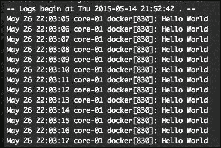
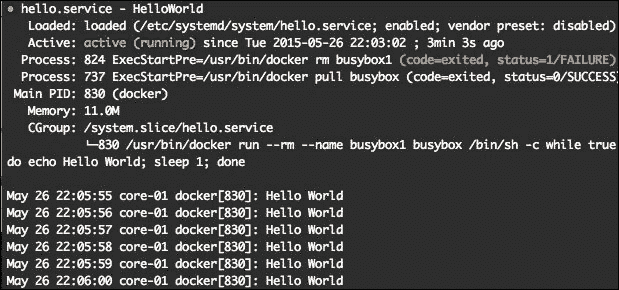
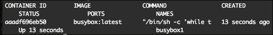
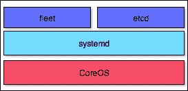
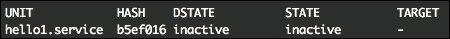
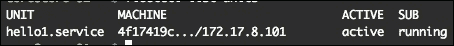
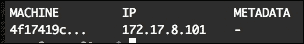
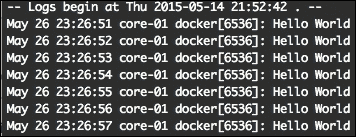

# 第三章：开始使用 systemd 和 fleet

在本章中，我们将介绍`systemd`和`fleet`的基础知识，包括系统单元文件。我们将演示如何使用`fleet`来启动 Docker 容器。

本章将涵盖以下主题：

+   开始使用`systemd`

+   开始使用`fleet`

# 开始使用 systemd

你将学习什么是`systemd`以及如何使用`systemctl`来控制`systemd`单元。

## systemd 概述

`systemd`是 CoreOS 使用的初始化系统，用于启动、停止和管理进程。

基本上，它是 CoreOS 的系统和服务管理器。在 CoreOS 上，`systemd`几乎完全用于管理 Docker 容器的生命周期。`systemd`记录每个进程在单元文件中的初始化指令，单元文件有许多种类，但我们主要讨论"服务"单元文件，因为涵盖所有单元文件超出了本书的范围。

## systemd 单元文件

`systemd`记录每个进程在我们希望运行的"服务"单元文件中的初始化指令/属性。在 CoreOS 上，用户手动安装或通过 cloud-init 安装的单元文件放置在`/etc/systemd/system`，这是一个可读写的文件系统，因为 CoreOS 的大部分内容只有只读访问权限。由 CoreOS 团队策划的单元文件放在`/usr/lib64/system/system`，而临时单元文件仅在一次启动的运行时存在，存放在`/run/system/system`。这一点对于调试`fleet`服务非常有帮助。

好的，让我们创建一个单元文件来测试`systemd`：

1.  启动你在第一章中安装的 CoreOS 虚拟机，并通过`ssh`登录主机。

1.  让我们创建一个简单的单元文件`hello.service`：

    ```
    $ sudo vi /etc/systemd/system/hello.service

    ```

    按*I*键并复制粘贴以下文本（或者使用提供的示例文件`hello.service`）：

    ```
    [Unit]
    Description=HelloWorld
    # this unit will only start after docker.service
    After=docker.service
    Requires=docker.service

    [Service]
    TimeoutStartSec=0
    # busybox image will be pulled from docker public registry
    ExecStartPre=/usr/bin/docker pull busybox
    # we use rm just in case the container with the name "busybox1" is left 
    ExecStartPre=-/usr/bin/docker rm busybox1
    # we start docker container
    ExecStart=/usr/bin/docker run --rm --name busybox1 busybox /bin/sh -c "while true; do echo Hello World; sleep 1; done"
    # we stop docker container when systemctl stop is used
    ExecStop=/usr/bin/docker stop busybox1

    [Install]
    WantedBy=multi-user.target
    ```

1.  按*Esc*键，然后输入:`wq`保存文件。

1.  要启动新的单元，运行以下命令：

    ```
    $ sudo systemctl enable /etc/systemd/system/hello.service

    ```

    从`/etc/systemd/system/multi-user.target.wants/hello.service`创建了一个指向`/etc/systemd/system/hello.service`的符号链接。

    ```
    $ sudo systemctl start hello.service

    ```

1.  让我们验证`hello.service`单元是否已启动：

    ```
    $ journalctl -f -u hello.service

    ```

    `#` 你应该看到类似以下的单元输出：

    

另外，你可以查看通过`docker ps`运行的容器列表。

在之前的步骤中，我们创建了`hello.service`系统单元，启用了它并启动了它，然后用`journalctl`检查了该单元的日志文件。

### 注意

要了解更多关于`systemd`单元文件的高级用法，请访问[`coreos.com/docs/launching-containers/launching/getting-started-with-systemd`](https://coreos.com/docs/launching-containers/launching/getting-started-with-systemd)。

## systemctl 概述

`systemctl`用于控制并提供`systemd`系统及其单元的状态检查。

它就像是你与系统的接口（类似于其他 Linux 发行版中的 `supervisord` / `supervisordctl`），因为所有在单台机器上的进程都是由 `systemd` 启动和管理的，包括 `docker` 容器。

我们已经在前面的示例中使用它来启用并启动 `hello.service` 单元。

以下是一些有用的 `systemctl` 命令及其用途：

1.  检查单元的状态：

    ```
    $ sudo systemctl status hello.service

    ```

    你应该看到类似的输出，如下所示：

    

1.  停止服务：

    ```
    $ sudo systemctl stop hello.service

    ```

1.  你可能需要强制停止服务，但这并不会停止 `docker` 容器：

    ```
    $ sudo systemctl kill hello.service
    $ docker ps

    ```

    你应该看到类似的输出，如下所示：

    

1.  如你所见，`docker` 容器仍在运行。因此，我们需要使用以下命令停止它：

    ```
    $ docker stop busybox1

    ```

1.  重启服务：

    ```
    $ sudo systemctl restart hello.service

    ```

1.  如果你修改了 `hello.service`，那么在重启之前，你需要重新加载所有服务文件：

    ```
    $ sudo systemctl daemon-reload

    ```

1.  禁用服务：

    ```
    $ sudo systemctl disable hello.service

    ```

`systemd` 服务单元只能在单台机器上运行和控制，它们最好用于一些简单的任务，例如在重启时下载一些文件等。

你将在下一个主题和后续章节中继续学习 `systemd`。

# 开始使用 fleet

我们使用 `fleet` 来充分利用 `systemd` 的高级功能。`fleet` 是一个集群管理器，在集群级别控制 `systemd`。你甚至可以在单台机器上使用它，并同样获得 `fleet` 的所有优势。

它鼓励用户将应用程序写成小而短暂的单元，这些单元可以轻松地在一个自我更新的 CoreOS 机器集群中迁移。

## fleet 单元文件

`fleet` 单元文件是常规的 `systemd` 单元，并结合了特定的 `fleet` 属性。



它们是与 `fleet` 进行交互的主要方式。与 `systemd` 单元一样，`fleet` 单元定义了你想要做什么以及 `fleet` 如何做。`fleet` 将会根据 `[X-Fleet]` 部分的 `fleet` 特殊属性，将有效的单元文件调度到单台机器或集群中的某台机器，这部分属性替代了 `systemd` 单元中的 `[Install]` 部分。其余的 `systemd` 部分在 `fleet` 单元中是相同的。

让我们概览一下 `[X-Fleet]` 部分的 `fleet` 特定选项：

+   `MachineID`：该单元将在由指定字符串识别的机器上调度。

+   `MachineOf`：此选项将机器限定为托管特定单元的机器。

+   `MachineMetadata`：这将使机器仅限于那些具有特定元数据的主机。

+   `Conflicts`：此选项可防止单元与其他单元一起部署，使用通配符匹配其他单元的名称。

+   `Global`：将此单元调度到集群中的所有机器。如果除了 `MachineMetadata` 以外提供了其他选项，则该单元被视为无效。

一个带有 [X-Fleet] 部分的 `fleet` 单元文件的编写示例如下：

```
[Unit]
Description=Ping google

[Service]
ExecStart=/usr/bin/ping google.com

[X-Fleet]
MachineMetadata=role=check
Conflicts=ping.*
```

那么，让我们看看 `Conflicts=ping*` 是如何工作的。例如，我们有两个相同的 `ping.1.service` 和 `ping.2.service` 文件，并且我们在集群中运行以下代码：

```
fleetctl start ping.* 
```

这将会在两台独立的集群机器上调度两个 `fleet` 单元。所以，让我们将之前使用的 `systemd` 单元 `hello.service` 转换为 `fleet` 单元。

1.  像往常一样，您需要通过 `vagrant ssh` 登录到主机。

1.  现在，让我们创建一个简单的单元文件，新的名称为 `hello1.service`：

    ```
    $ sudo vi hello1.service

    ```

    按下 *I* 并复制粘贴如下文本：

    ```
    [Unit]
    Description=HelloWorld
    # this unit will only start after docker.service
    After=docker.service
    Requires=docker.service

    [Service]
    TimeoutStartSec=0
    # busybox image will be pulled from docker public registry
    ExecStartPre=/usr/bin/docker pull busybox
    # we use rm just in case the container with the name "busybox2" is left 
    ExecStartPre=-/usr/bin/docker rm busybox2
    # we start docker container
    ExecStart=/usr/bin/docker run --rm --name busybox2 busybox /bin/sh -c "while true; do echo Hello World; sleep 1; done"
    # we stop docker container when systemctl stop is used
    ExecStop=/usr/bin/docker stop busybox1

    [X-Fleet]
    ```

1.  按下 *Esc* 然后输入 :`wq` 来保存文件。

    如您所见，当前我们的 `[X-Fleet]` 部分为空，因为我们暂时没有需要在那里使用的内容。我们将在接下来的章节中详细讲解这一部分。

1.  首先，我们需要提交我们的 `fleet` 单元：

    ```
    $ fleetctl submit hello1.service

    ```

1.  让我们验证我们的 `fleet` 单元文件：

    ```
    $ fleetctl list-unit-files

    ```

    

1.  要启动新的单元，运行以下命令：

    ```
    $ fleetctl start hello1.service

    ```

    

    前面的命令已经提交并启动了 `hello1.service`。

    让我们验证我们的新 `fleet` 单元是否正在运行：

    ```
    $ fleetctl list-units

    ```

    

好的，现在是时候概览一下 `fleetctl` 命令了。

## `fleetctl` 概览

`fleetctl` 命令与 `systemctl` 命令非常相似——您可以像下面这样看到这一点——而且我们不需要在 `fleetctl` 命令前使用 `sudo`。以下是您可以执行的一些任务，并列出了所需的命令：

1.  检查单元的状态：

    ```
    $ fleetctl status hello1.service

    ```

1.  停止服务：

    ```
    $ fleetctl stop hello1.service

    ```

1.  查看服务文件：

    ```
    $ fleetctl cat hello1.service

    ```

1.  如果您只想上传单元文件：

    ```
    $ fleetctl submit hello1.service

    ```

1.  列出所有正在运行的舰队单元：

    ```
    $ fleetctl list-units

    ```

1.  列出舰队集群机器：

    ```
    $ fleetctl list-machines

    ```

    

我们看到只有一台机器，就像我们这种情况一样，因为我们只有一台机器在运行。

当然，如果我们想查看 `hello1.service` 的日志输出，依然可以使用相同的 systemd `journalctl` 命令，如下所示：

```
$ journalctl -f -u hello1.service

```

您应该看到类似于以下的单元输出：



# 参考资料

您可以通过以下给定的网址阅读更多相关主题：

+   **systemd 单元文件**：[`coreos.com/docs/launching-containers/launching/getting-started-with-systemd/`](https://coreos.com/docs/launching-containers/launching/getting-started-with-systemd/)

+   **舰队单元文件**：[`coreos.com/docs/launching-containers/launching/fleet-unit-files/`](https://coreos.com/docs/launching-containers/launching/fleet-unit-files/)

# 总结

在本章中，您学习了 CoreOS 的 `systemd` 初始化系统。您还学习了如何使用 `systemctl` 和 `fleetctl` 创建和控制系统和 `fleet` 服务单元。

在下一章中，您将学习如何设置和管理 CoreOS 集群。
