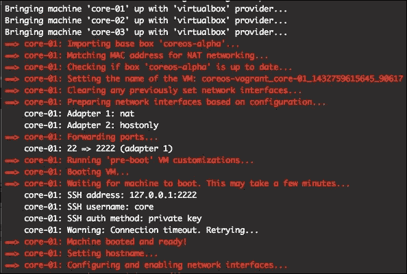
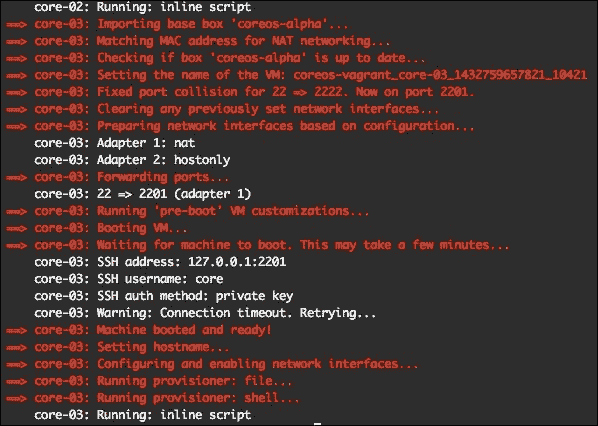
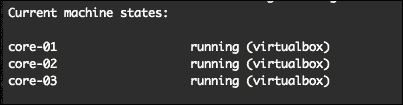
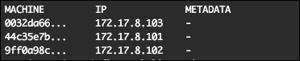
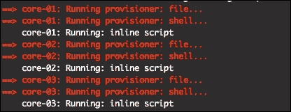
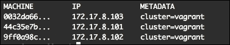
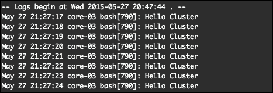
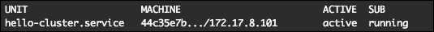
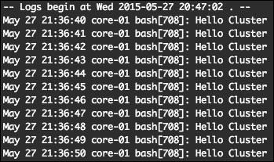

# 第四章：集群管理

在本章中，我们将介绍如何在个人计算机上设置和管理本地 CoreOS 集群。你将学习如何引导一个三节点集群，通过`cloud-config`文件自定义它，并在集群中调度一个 fleet 单元。

在本章中，我们将涵盖以下主题：

+   引导一个本地集群

+   通过`cloud-config`文件自定义集群

+   在集群中调度一个`fleet`单元

你将学习如何在个人计算机上设置一个简单的三节点集群。

# 确定最佳的 etcd 集群大小

最有效的集群大小是在三到九个节点之间。对于更大的集群，`etcd`将选择一部分实例参与，以保持集群的高效性。

集群越大，写入集群的速度越慢，因为所有数据都需要在集群的节点之间进行复制。为了优化集群，它需要基于奇数个节点构建。集群必须至少有三个节点的法定人数，并在发生网络分区时防止出现脑裂。

在我们的案例中，我们将设置一个三节点的`etcd`集群。为了在云上（如 GCE、AWS、Azure 等）构建一个高可用的集群，你应该使用多个可用区，以减少单个域故障的影响。

在一般的集群中，不建议将节点用于除运行`etcd`集群外的任何其他用途。但为了测试我们的集群设置，将一些`fleet`单元部署在那里是可以的。

在后续章节中，你将学习如何正确设置集群，以便用于生产环境。

# 引导一个本地集群

如前所述，我们将在计算机上安装一个三节点的`etcd`集群。

## 克隆 coreos-vagrant 项目

让我们克隆项目并让它运行。请按照以下步骤操作：

1.  在终端或命令提示符中，输入以下内容：

    ```
    $ mkdir cluster 
    $ cd cluster
    $ git clone https://github.com/coreos/coreos-vagrant.git
    $ cd coreos-vagrant
    $ cpconfig.rb.sampleconfig.rb
    $ cp user-data.sample user-data

    ```

1.  现在我们需要调整一些设置。编辑`config.rb`并将文件的顶部部分更改为以下示例：

    ```
    # Size of the CoreOS cluster created by Vagrant
    $num_instances=3

    # Used to fetch a new discovery token for a cluster of size $num_instances
    $new_discovery_url="https://discovery.etcd.io/new?size=#{$num_instances}"

    # To automatically replace the discovery token on 'vagrant up', uncomment
    # the lines below:
    #
    if File.exists?('user-data') &&ARGV[0].eql?('up')
      require 'open-uri'
      require 'yaml'

      token = open($new_discovery_url).read

      data = YAML.load(IO.readlines('user-data')[1..-1].join)
      if data['coreos'].key? 'etcd'
        data['coreos']['etcd']['discovery'] = token
      end
      if data['coreos'].key? 'etcd2'
        data['coreos']['etcd2']['discovery'] = token
      end

    yaml = YAML.dump(data)
    File.open('user-data', 'w') { |file| file.write("#cloud-config\n\n#{yaml}") }
    end
    #
    ```

    ### 注意

    或者，你也可以使用本章中的示例代码，这些代码会随着 coreos-vagrant GitHub 仓库中的更改而保持更新。

    我们在这里做的操作如下：

    +   我们将集群设置为三实例

    +   每次执行`vagrant up`命令时，发现令牌会自动替换。

1.  接下来，我们需要编辑用户数据文件：

    将`"#discovery: https://discovery.etcd.io/<token>"`这一行改为如下：

    ```
    "discovery: https://discovery.etcd.io/<token>"
    ```

    所以，当我们下次启动基于 Vagrant 的集群时，我们将会有三个 CoreOS `etcd`节点在同一个集群中运行，并通过"`https://discovery.etcd.io/<token>`"提供的发现令牌连接。

1.  现在使用以下命令启动我们的新集群：

    ```
    $ vagrant up

    ```

    我们应该在终端中看到如下内容：

    

    等一下！还有更多输出！

    

    现在集群应该已经启动并运行了。

1.  要检查集群的状态，输入以下命令：

    ```
    $ vagrant status

    ```

    你应该能看到如下截图所示的内容：

    

现在是时候测试我们的新 CoreOS 集群了。我们需要通过`ssh`连接到其中一台节点，并检查`fleet`机器。可以通过以下命令来完成：

```
$ vagrant ssh core-01 -- -A
$ fleetctl list-machines

```

我们应该能看到如下截图所示的内容：



太棒了！我们已经设置好了第一个 CoreOS 集群，看到三台机器都已启动并运行。现在，让我们尝试在`etcd`中设置一个键，以便稍后在另一台机器上检查。输入以下命令：

```
$ etcdctl set etcd-cluster-key "Hello CoreOS"

```

你将看到如下输出：

```
Hello CoreOS

```

按下 *Ctrl*+*D* 退出，并输入以下命令进入虚拟机主机的控制台：

```
$ vagrant ssh core-02 -- -A

```

让我们验证一下，我们是否也能看到新的`etcd`键：

```
$ etcdctl get etcd-cluster-key
Hello CoreOS

```

太棒了！我们的`etcd`集群运作得很好。

按下 *Ctrl*+*D* 从`core-02`机器退出。

## 通过 cloud-config 文件定制集群

让我们对`cloud-config`文件进行一些更改，并将其推送到集群机器中：

1.  在用户数据文件（针对基于 Vagrant 的 CoreOS 的`cloud-config`文件）中，在`fleet`文本块下进行更改：

    ```
    public-ip: $public_ipv4
    ```

    添加一行：

    ```
    metadata: cluster=vagrant
    ```

    所以，它看起来像这样：

    ```
    fleet:
          public-ip: $public_ipv4
          metadata: cluster=vagrant
    ```

1.  让我们也通过`cloud-config`将一个`test.txt`文件添加到`/home/core`文件夹。在用户数据文件的末尾，添加以下代码：

    ```
    write_files:
      - path: /home/core/test.txt
        permissions: 0644
        owner: core
        content: |
    Hello Cluster
    ```

    这将在每台集群机器的`/home/core`文件夹中添加一个新文件。

1.  为了实施我们之前所做的更改，请运行以下命令：

    ```
    $ vagrant provision

    ```

    你将看到以下结果：

    

    然后，运行以下命令：

    ```
    $ vagrant reload

    ```

    第一条命令临时更新了所有三台虚拟机上的用户数据文件，第二条命令重新加载了这些文件。

1.  要通过`ssh`连接到其中一台虚拟机，输入以下代码：

    ```
    $ vagrant ssh core-03 -- -A
    $ ls
    test.txt

    ```

1.  要查看`test.txt`文件的内容，请使用以下命令：

    ```
    $ cat test.txt

    ```

    你应该会看到如下输出：

    ```
    Hello Cluster

    ```

如你所见，我们通过`cloud-config`文件在所有集群机器上添加了一些文件。

让我们使用以下命令检查一下我们在该文件中做的另一个更改：

```
$ fleetctl list-machines

```

你将看到类似这样的内容：



因此，你可以看到我们通过`cloud-init`文件为集群机器分配了一些元数据。

## 在集群中调度一个 fleet 单元

现在，进入有趣的部分，我们将调度一个`fleet`单元到集群中。

1.  让我们登录到`core-03`机器：

    ```
    $ vagrant ssh core-03 -- -A

    ```

1.  通过复制并粘贴这一行，创建一个新的`fleet`单元`hello-cluster.service`：

    ```
    $ vi hello-cluster.service
    [Unit]
    [Service]
    ExecStart=/usr/bin/bash -c "while true; do echo 'Hello Cluster'; sleep 1; done"

    ```

1.  让我们为集群调度`hello-cluster.service`任务：

    ```
    $ fleetctl start hello-cluster.service

    ```

    你应该会看到如下输出：

    ```
    Unit hello-cluster.service launched on bb53c039.../172.17.8.103

    ```

    我们可以看到，`hello-cluster.service`被调度到`172.17.8.103`机器上运行，因为该机器是第一个响应`fleetctl`命令的。

    在后续章节中，你将学习如何将任务具体调度到某一台机器。现在让我们查看`hello-cluster.service`的实时日志：

    ```
    $ journalctl -u hello-cluster.service–f

    ```

    你会看到类似这样的内容：

    

1.  退出虚拟机并重新加载集群，请输入以下命令：

    ```
    $ vagrant reload

    ```

1.  现在，再次`ssh`回任何一台机器：

    ```
    $ vagrant ssh core-02 -- -A

    ```

1.  然后运行此命令：

    ```
    $ fleetctl list-units

    ```

    将看到以下输出：

    

1.  如您所见，`hello-cluster.service` 已在另一台机器上调度；在我们的案例中，它是 `core-01`。假设我们`ssh`到它：

    ```
    $ vagrant ssh core-01 -- -A

    ```

1.  然后，在那里运行以下命令。结果，我们将再次看到实时日志：

    ```
    $ journalctl -u hello-cluster.service–f

    ```

    

# 参考文献

您可以在[`coreos.com/docs/cluster-management/setup/cloudinit-cloud-config/`](https://coreos.com/docs/cluster-management/setup/cloudinit-cloud-config/)了解有关如何使用 cloud-config 的更多信息。您可以在[`docs.vagrantup.com`](https://docs.vagrantup.com)找到更多关于 Vagrant 的信息。如果您对 Vagrant 有任何问题或疑问，可以订阅 Vagrant Google 小组[`groups.google.com/forum/#!forum/vagrant-up`](https://groups.google.com/forum/#!forum/vagrant-up)。

# 摘要

在本章中，您学习了如何设置 CoreOS 集群，通过 cloud-config 进行自定义配置，将`fleet`服务单位调度到集群，并检查集群状态和日志中的`fleet`单位。在下一章中，您将学习如何进行本地和云开发设置。
