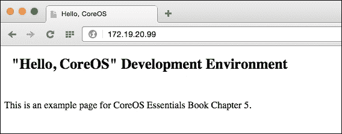

# 第五章. 构建开发环境

在本章中，我们将介绍如何在个人电脑上为 CoreOS 设置本地开发环境，以及在 Google Cloud 的 Compute Engine VM 实例上设置测试和暂存环境集群。以下是我们将要涵盖的主题：

+   设置本地开发环境

+   在 Google Cloud 的远程测试/暂存集群上引导

# 设置本地开发环境

我们将学习如何在个人电脑上设置开发环境，借助 VirtualBox 和 Vagrant 的帮助，就像我们在早期章节中所做的那样。构建和测试`docker`镜像以及在本地编码使您更加高效，节省时间，当您的 docker 镜像准备就绪时，可以将其推送到 docker 注册表（私有或公共）。对于代码也是一样；您只需在本地工作和测试。准备就绪后，可以将其与团队/客户测试分支合并。

## 设置开发虚拟机

在之前的章节中，您学习了如何通过 Vagrant 在您的个人电脑上安装 CoreOS。在这里，我们已经准备了 Linux 和 OS X 的安装脚本，以便快速进行设置。您可以从 GitHub 仓库下载最新的*CoreOS Essentials*书籍示例文件：

```
$ git clone https://github.com/rimusz/coreos-essentials-book/

```

要安装基于 Vagrant 的本地开发虚拟机，请键入以下命令：

```
$ cd coreos-essentials-book/chapter5/Local_Development_VM
$ ./install_local_dev.sh

```

您应该看到类似于这样的输出：


等等！还有更多内容！


这将执行类似于我们在第一章中所做的安装，*CoreOS – 概述和安装*，但这次是更自动化的方式。

## VM 安装期间发生了什么？

让我们检查一下 VM 安装期间发生了什么。总结一下：

+   安装了一个新的 CoreOS 虚拟机（基于 VirtualBox/Vagrant）

+   在您的`Home`文件夹中创建了一个名为`coreos-dev-env`的新文件夹

运行以下命令：

```
$ cd ~/coreos-dev-env
$ ls
bin 
fleet 
share 
vm 
vm_halt.sh 
vm_ssh.sh 
vm_up.sh

```

因此，这就是我们看到的结果：

+   包括以下列表的四个文件夹：

    +   `bin`：`docker`、`etcdctl`和`fleetctl`文件

    +   `fleet`：`nginx.service fleet`单元存储在这里

    +   `share`：这是主机和 VM 之间共享的文件夹

    +   `vm`：Vagrantfile、`config.rb`和`user-data`文件

+   我们还有三个文件：

    +   `vm_halt.sh`: 用于关闭 CoreOS 虚拟机

    +   `vm_ssh.sh`：用于`ssh`到 CoreOS 虚拟机

    +   `vm_up.sh`: 用于启动 CoreOS 虚拟机，操作系统的 shell 预设如下：

        ```
        # Set the environment variable for the docker daemon
        export DOCKER_HOST=tcp://127.0.0.1:2375
        # path to the bin folder where we store our binary files
        export PATH=${HOME}/coreos-dev-env/bin:$PATH
        # set etcd endpoint
        export ETCDCTL_PEERS=http://172.19.20.99:2379
        # set fleetctl endpoint
        export FLEETCTL_ENDPOINT=http://172.19.20.99:2379
        export FLEETCTL_DRIVER=etcd
        export FLEETCTL_STRICT_HOST_KEY_CHECKING=false
        ```

现在我们已经安装了 CoreOS 虚拟机，让我们运行`vm_up.sh`。我们应该在**终端**窗口看到以下输出：

```
$ cd ~/coreos-dev-env
$ ./vm_up.sh

```

您应该看到类似于这样的输出：


正如我们在前面的截图中看到的，我们没有任何错误。只有`fleetctl list-machines`显示我们的 CoreOS 虚拟机机器，并且那里没有`docker`容器和运行的`fleet`单元。

## 部署舰队单元

让我们部署一些 fleet 单元，验证我们的开发环境是否正常工作。运行以下命令：

```
$ cd fleet
$ fleetctl start nginx.service

```

### 注意

Docker 下载`nginx`镜像可能需要一些时间。

你可以查看`nginx.service`单元的状态：

```
$ fleetctl status nginx.service

```

你应该会看到类似于以下内容的输出：


一旦`nginx fleet`单元部署完成，打开浏览器并访问`http://172.19.20.99`。你应该会看到以下信息：



让我们查看一下发生了什么。我们用`fleetctl`调度了这个`nginx.service`单元：

```
$ cat ~/coreos-dev-env/fleet/nginx.service

[Unit]
Description=nginx

[Service]
User=core
TimeoutStartSec=0
EnvironmentFile=/etc/environment
ExecStartPre=-/usr/bin/docker rm nginx
ExecStart=/usr/bin/docker run --rm --name nginx -p 80:80 \
 -v /home/core/share/nginx/html:/usr/share/nginx/html \
 nginx:latest
#
ExecStop=/usr/bin/docker stop nginx
ExecStopPost=-/usr/bin/docker rm nginx

Restart=always
RestartSec=10s

[X-Fleet]
```

然后，我们从 docker 注册表使用了官方的`nginx`镜像，并将本地的`~/coreos-dev-env/share`文件夹与`/home/core/share`共享，之后该文件夹被挂载为 docker 卷`/home/core/share/nginx/html:/usr/share/nginx/html`。

所以，任何我们放入本地`~/coreos-dev-env/share/nginx/html`文件夹的`html`文件都会被`nginx`自动获取。

让我们回顾一下这种环境给我们带来的优势：

+   我们可以在本地构建和测试 docker 容器，然后将它们推送到 docker 注册表（无论是私有还是公共）。

+   在完成本地代码测试后，将代码推送到 git 仓库。

+   通过拥有本地开发环境，生产力显著提高，因为所有工作都能更快速地完成。我们不再需要在每次代码更改后构建新的 docker 容器、将其推送到远程 docker 注册表、在远程测试服务器上拉取它们，等等。

+   清理该环境并从一个干净的起点重新启动非常简单，能够重新使用配置好的`fleet`单元启动所有需要的 docker 容器。

很好！现在，我们已经拥有了一个完全可用的本地开发环境！

### 注意

该环境设置符合 CoreOS 文档中[`coreos.com/docs/cluster-management/setup/cluster-architectures/`](https://coreos.com/docs/cluster-management/setup/cluster-architectures/)的要求，在*笔记本上的 Docker 开发环境*部分。

查看`coreos-dev-install.sh` bash 脚本，该脚本设置了你的本地开发虚拟机。这是一个简单的脚本，并且注释清晰，因此理解其逻辑不应太难。

如果你是 Mac 用户，你可以从[`github.com/rimusz/coreos-osx-gui`](https://github.com/rimusz/coreos-osx-gui)下载并使用我的 Mac 应用**CoreOS-Vagrant GUI for Mac OS X**，它有一个漂亮的 UI 来管理 CoreOS 虚拟机。它将自动设置 CoreOS 虚拟机环境。


# 在 GCE 上引导一个远程的测试/预发布集群

所以，我们成功建立了本地开发环境。接下来，让我们迈向下一个阶段，也就是在云端构建我们的测试/预发布环境。

我们将使用 Google Cloud 的 Compute Engine，所以你需要一个 Google Cloud 账号。如果没有，可以通过[`cloud.google.com/compute/`](https://cloud.google.com/compute/)注册一个试用账户。试用账户有效期为 60 天，且提供$300 的信用额度，足够运行本书中的所有示例。当账户创建完成后，需要从[`cloud.google.com/sdk/`](https://cloud.google.com/sdk/)安装 Google Cloud SDK。

在本主题中，我们将参考[`coreos.com/docs/cluster-management/setup/cluster-architectures/`](https://coreos.com/docs/cluster-management/setup/cluster-architectures/)中的*Easy Development/Testing Cluster*，并遵循其设置 CoreOS 集群的建议。

## 测试/暂存集群设置

好的，让我们安装云集群，你已经下载了本书中的代码示例。请按照以下顺序执行这些步骤：

1.  执行以下命令：

    ```
    $ cd coreos-essentials-book/chapter5/Test_Staging_Cluster
    $ ls
    cloud-config
    create_cluster_control.sh
    create_cluster_workers.sh
    files
    fleet
    install_fleetctl_and_scripts.sh
    settings

    Let's check "settings" file first:
    $ cat settings
    ### CoreOS Test/Staging Cluster on GCE settings

    ## change Google Cloud settings as per your requirements
    # GC settings

    # CoreOS RELEASE CHANNEL
    channel=beta

    # SET YOUR PROJECT AND ZONE !!!
    project=my-cloud-project
    zone=europe-west1-d

    # ETCD CONTROL AND NODES MACHINES TYPE
    #
    control_machine_type=g1-small
    #
    worker_machine_type=n1-standard-1
    ##

    ###
    ```

1.  更新`settings`，填入你的 Google Cloud 项目 ID 和你希望 CoreOS 实例部署的区域：

    ```
    # SET YOUR PROJECT AND ZONE !!!
    project=my-cloud-project
    zone=europe-west1-d
    ```

1.  接下来，让我们安装我们的控制服务器，即`etcd`集群节点：

    ```
    $ ./create_cluster_control.sh

    ```

    

我们刚刚创建了新的集群`etcd`控制节点。

1.  我们来看一下这个脚本中包含的内容：

    ```
    #!/bin/bash
    # Create TS cluster control

    # Update required settings in "settings" file before running this script

    function pause(){
    read -p "$*"
    }

    ## Fetch GC settings
    # project and zone
    project=$(cat settings | grep project= | head -1 | cut -f2 -d"=")
    zone=$(cat settings | grep zone= | head -1 | cut -f2 -d"=")
    # CoreOS release channel
    channel=$(cat settings | grep channel= | head -1 | cut -f2 -d"=")
    # control instance type
    control_machine_type=$(cat settings | grep control_machine_type= | head -1 | cut -f2 -d"=")
    # get the latest full image name
    image=$(gcloud compute images list --project=$project | grep -v grep | grep coreos-$channel | awk {'print $1'})
    ##

    # create an instance
    gcloud compute instances create tsc-control1 --project=$project --image=$image --image-project=coreos-cloud \
     --boot-disk-size=10 --zone=$zone --machine-type=$control_machine_type \
     --metadata-from-file user-data=cloud-config/control1.yaml --can-ip-forward --tags tsc-control1 tsc

    # create a static IP for the new instance
    gcloud compute routes create ip-10-200-1-1-tsc-control1 --project=$project \
     --next-hop-instance tsc-control1 \
     --next-hop-instance-zone $zone \
     --destination-range 10.200.1.1/32

    echo " "
    echo "Setup has finished !!!"
    pause 'Press [Enter] key to continue...'
    # end of bash script

    ```

它从`settings`文件中获取所需的 Google Cloud 设置。借助 Google Cloud SDK 中的`gcloud`工具，它设置了`tsld-control1`实例并为其分配了静态内部 IP`10.200.1.1`。这个 IP 将被工作节点用来连接运行在`tsc-control1`上的`etcd`集群。

在`cloud-config`文件夹中，我们有创建 CoreOS 实例所需的`cloud-config`文件，适用于 GCE。

打开`control1.yaml`并检查其中的内容：

```
$ cat control1.yaml
#cloud-config

coreos:

etcd2:
 name: control1
 initial-advertise-peer-urls: http://10.200.1.1:2380
 initial-cluster-token: control_etcd
 initial-cluster: control1=http://10.200.1.1:2380
 initial-cluster-state: new
 listen-peer-urls: http://10.200.1.1:2380,http://10.200.1.1:7001
 listen-client-urls: http://0.0.0.0:2379,http://0.0.0.0:4001
 advertise-client-urls: http://10.200.1.1:2379,http://10.200.1.1:4001
 fleet:
 metadata: "role=services,cpeer=tsc-control1"
 units:
 - name: 00-ens4v1.network
 runtime: true
 content: |
 [Match]
 Name=ens4v1

 [Network]
 Address=10.200.1.1/24
 - name: etcd2.service
 command: start
 - name: fleet.service
 command: start
 - name: docker.service
 command: start
 drop-ins:
 - name: 50-insecure-registry.conf
 content: |
 [Unit]
 [Service]
 Environment=DOCKER_OPTS='--insecure-registry="0.0.0.0/0"'
write_files:
 - path: /etc/resolv.conf
 permissions: 0644
 owner: root
 content: |
 nameserver 169.254.169.254
 nameserver 10.240.0.1
#end of cloud-config

```

如你所见，我们有一个`cloud-config`文件用于控制机，它完成以下任务：

1.  它创建了一个静态 IP 为`10.200.1.1`的`etcd`集群节点，用于连接`etcd`集群。

1.  它将`fleet`元数据设置为`role=services,cpeer=tsc-control1`。

1.  `Unit 00-ens4v1.network`为`10.200.1.1`分配了一个静态 IP。

1.  `docker.service`的 drop-in 文件`50-insecure-registry.conf`设置了`--insecure-registry="0.0.0.0/0"`，这允许你连接到任何私有托管的 docker registry。

1.  在`write_files`部分，我们更新了`/etc/resolv.conf`，添加了 Google Cloud 的 DNS 服务器，因为如果给实例分配了静态 IP，DNS 服务器有时不会自动添加。

### 创建我们的集群工作节点

为了创建集群工作节点，使用的命令如下：

```
$ ./create_cluster_workers.sh

```


记下工作节点的外部 IP，如前面截图所示；我们稍后会用到它们。

当然，你也可以随时在 Google 开发者控制台中查看它们。


让我们来查看 `cloud-config` 文件夹中的 `test1.yaml` 和 `staging1.yaml` 文件。运行以下命令：

```
$ cat test1.yaml
#cloud-config

coreos:
 etcd2:
 listen-client-urls: http://0.0.0.0:2379,http://0.0.0.0:4001
 initial-cluster: control1=http://10.200.1.1:2380
 proxy: on
 fleet:
 public-ip: $public_ipv4
 metadata: "role=worker,cpeer=tsc-test1"
 units:
 - name: etcd2.service
 command: start
 - name: fleet.service
 command: start
 - name: docker.service
 command: start
 drop-ins:
 - name: 50-insecure-registry.conf
 content: |
 [Unit]
 [Service]
 Environment=DOCKER_OPTS='--insecure-registry="0.0.0.0/0"'
# end of cloud-config

```

如我们所见，我们有 `cloud-config` 文件用于 `test1` 机器：

+   它连接到 `etcd` 集群机器 `control1` 并启用 `etcd2` 的代理模式，这使得在主机上运行的任何内容都能通过 `127.0.0.1` 地址访问 `etcd` 集群

+   它设置了 `fleet` 元数据 `role=services,cpeer=tsc-test1`

+   `docker.service` 的 drop-in `50-insecure-registry.conf` 设置了 `--insecure-registry="0.0.0.0/0"`，这将允许你连接到任何私有托管的 docker 注册表

就这样！

如果你查看 `tsc-staging1.yaml` 云配置文件，你会发现它与 `test1.yaml` 几乎相同，唯一的区别是 `fleet` 元数据中有 `cpeer=tsc-staging1`。但我们还没完成！

现在让我们安装 OS X/Linux 客户端，这将使我们能够从本地计算机管理云开发集群。

让我们运行这个安装脚本：

```
$ ./install_fleetctl_and_scripts.sh

```

你应该会看到以下输出：


那么，最后一个脚本做了什么呢？

在你的主文件夹中，它创建了一个名为 `~/coreos-tsc-gce` 的新文件夹，其中包含两个子文件夹：

+   `bin`

    +   `etcdctl`：这是用于访问远程集群 `control1` 节点上 `etcdctl` 客户端的 shell 脚本

    +   `fleetctl`：本地 `fleetctl` 客户端用于控制远程集群

    +   `staging1.sh`：建立与远程 `staging1` 工作者的 `ssh` 连接

    +   `test1.sh`：建立与远程 `test1` 工作节点的 `ssh` 连接

    +   `set_cluster_access.sh`：这设置了远程集群的 shell 访问

+   `fleet`

    +   `test1_webserver.service`：我们 `test1` 服务器的 `fleet` 单元

    +   `staging1_webserver.service`：我们 `staging1` 服务器的 `fleet` 单元

现在，让我们看一下 `set_cluster_access.sh`：

```
$ cd ~/coreos-tsc-gce/bin
$ cat set_cluster_access.sh
#!/bin/bash

# Setup Client SSH Tunnels
ssh-add ~/.ssh/google_compute_engine &>/dev/null

# SET
# path to the cluster folder where we store our binary files
export PATH=${HOME}/coreos-tsc-gce/bin:$PATH
# fleet tunnel
export FLEETCTL_TUNNEL=104.155.61.42 # our control1 external IP
export FLEETCTL_STRICT_HOST_KEY_CHECKING=false

echo "etcd cluster:"
etcdctl --no-sync ls /

echo "list fleet units:"
fleetctl list-units

/bin/bash

```

该脚本由 `./install_fleetctl_and_scripts.sh` 预设，使用远程 `control1` 外部 IP 地址，并允许我们发出远程 `fleet` 控制命令：

```
$ ./set_cluster_access.sh

```


很好！我们的集群已启动并运行，工作节点已连接到 `etcd` 集群。

现在我们可以在本地计算机上运行 `fleetctl` 命令来控制远程集群。

### 在远程集群上运行 fleetctl 命令

现在让我们安装在 `~/coreos-tsc-gce/fleet` 文件夹中的 `nginx` fleet 单元。运行以下命令：

```
$ cd ~/coreos-tsc-gce/fleet

```

让我们首先将 `fleet` 单元提交到集群：

```
$ fleetctl submit *.service

```

现在，让我们启动它们：

```
$ fleetctl start *.service

```

你应该会看到类似于以下截图的内容：


给 docker 一些时间从 docker 注册表下载 nginx 镜像。然后我们可以使用以下命令检查我们新部署的 `fleet` 单元的状态：

```
$ fleetctl status *.service

```


然后，运行这个命令：

```
$ fleetctl list-units

```


完美！

现在，在你的网页浏览器中，打开工作节点的外部 IP，你应该能看到以下内容：


`nginx`服务器现在已正常工作。它们显示此错误信息的原因是我们尚未提供任何`index.html`文件。我们将在下一章进行此操作。

但在我们结束本章之前，让我们检查一下我们的`test/staging nginx 舰队`单元：

```
$ cd ~/coreos-tsc-gce/fleet
$ cat test1_webserver.service

```

你应该能看到如下代码：

```
[Unit]
Description=nginx

[Service]
User=core
TimeoutStartSec=0

EnvironmentFile=/etc/environment
ExecStartPre=-/usr/bin/docker rm nginx
ExecStart=/usr/bin/docker run --rm --name test1-webserver -p 80:80 \
-v /home/core/share/nginx/html:/usr/share/nginx/html \
nginx:latest
#
ExecStop=/usr/bin/docker stop nginx
ExecStopPost=-/usr/bin/docker rm nginx

Restart=always
RestartSec=10s
[X-Fleet]
MachineMetadata=cpeer=tsc-test1 # this where our fleet unit gets scheduled

```

这里有几点需要注意：

+   `Staging1`有一个几乎相同的单元；它将`test1`替换为`staging1`。因此，我们重复使用了与本地开发机器相同的舰队单元，只进行了少许更改。

+   在`ExecStart`中，我们使用了`test1-webserver`和`staging1-webserver`，因此通过使用`fleetctl list-units`，我们可以看到哪个是哪个。

    我们添加了这一部分：

    ```
    [X-Fleet]
    MachineMetadata=cpeer=tsc-test1

    ```

这将把该单元调度到特定的集群工作节点。

如果你是 Mac 用户，可以从[`github.com/rimusz/coreos-osx-gui-cluster`](https://github.com/rimusz/coreos-osx-gui-cluster)下载并使用我的 Mac 应用**CoreOS-Vagrant Cluster GUI for Mac OS X**，它提供了一个便捷的 UI 来管理你计算机上的 CoreOS 虚拟机。


这个应用程序将设置一个小型的`control+`双节点本地集群，这使得在将集群任务推送到云端之前，更容易在本地计算机上进行集群相关的测试。

# 参考资料

你可以阅读更多关于我们在本地和云端测试/预发布环境中使用的 CoreOS 集群架构的信息，访问[`coreos.com/docs/cluster-management/setup/cluster-architectures/`](https://coreos.com/docs/cluster-management/setup/cluster-architectures/)。

# 总结

在本章中，你学习了如何在 CoreOS 上设置本地开发环境，并在 GCE 上设置远程测试/预发布集群。我们根据不同的元数据标签调度了舰队单元。

在下一章中，我们将学习如何将代码部署到我们的云服务器。
