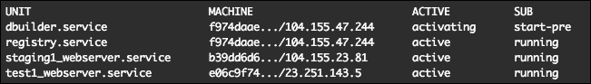

# 第六章：构建部署设置

在上一章中，你学习了如何在个人计算机上为开发设置本地 CoreOS 环境，并在 Google Cloud 的 Compute Engine 虚拟机实例上设置测试和预发布环境集群。

在本章中，我们将介绍如何将代码从 GitHub 仓库部署到我们的测试和预发布服务器，以及如何设置 Docker 构建器和 Docker 私有注册表工作节点以进行 Docker 镜像构建和分发。

在本章中，我们将涵盖以下主题：

+   在测试和预发布服务器上部署代码

+   设置 Docker 构建器和私有 Docker 注册表机器

# 在测试和预发布服务器上部署代码

在上一章中，你学习了如何在 Google Cloud 上设置你的测试和预发布环境并在其中部署 Web 服务器。在这一节中，我们将展示如何将代码部署到测试和预发布环境中的 Web 服务器。

## 在服务器上部署代码

要将代码部署到我们的`Test1`和`Staging1`服务器上，我们运行以下命令：

```
$ cd coreos-essentials-book/chapter6/Test_Staging_Cluster/webserver
$ ./deploy_2_test1.sh

```

你将得到以下输出：


然后，运行以下命令：

```
$ ./deploy_2_staging1.sh

```

你应该看到以下结果：


现在，打开`tsc-test1`和`tsc-staging1`虚拟机实例的外部 IP 地址，将它们复制到浏览器中（你可以在 GC 控制台、Compute Engine、虚拟机实例中查看 IP）。

你看到的输出取决于服务器。

对于测试服务器，你应该看到类似这样的内容：


这是你在预发布服务器上看到的内容：


让我们看看发生了什么：

```
$ cat deploy_2_test1.sh
#!/bin/bash

function pause(){
read -p "$*"
}

## Fetch GC settings
# project and zone
project=$(cat ~/coreos-tsc-gce/settings | grep project= | head -1 | cut -f2 -d"=")
zone=$(cat ~/coreos-tsc-gce/settings | grep zone= | head -1 | cut -f2 -d"=")

# change folder permissions
gcloud compute --project=$project ssh  --zone=$zone "core@tsc-test1" --command "sudo chmod -R 755 /home/core/share/"

echo "Deploying code to tsc-test1 server !!!"
gcloud compute copy-files test1/index.html tsc-test1:/home/core/share/nginx/html --zone $zone --project $project

echo " "
echo "Finished !!!"
pause 'Press [Enter] key to continue...'
```

如你所见，我们使用了`gcloud compute`来更改`home/core/share/nginx/html`文件夹的权限，因为我们需要能够在那里复制文件。我们将一个`index.html`文件复制到了那里。

在实际场景中，应该在这里使用`git pull`从测试和预发布分支拉取代码。

为了自动化发布到`Test1/Staging1`服务器上，例如，可以使用 Strider-CD，但这超出了本书的范围。你可以在[`github.com/Strider-CD/strider`](https://github.com/Strider-CD/strider)上阅读关于 Strider-CD 的内容，并实践如何实现它。

# 设置 Docker 构建器和私有 Docker 注册表工作节点

我们已经成功地通过`gcloud compute`在云上的测试/预发布环境中部署了代码（在我们的例子中是`index.html`），通过在一个简单的 Shell 脚本中运行它。

让我们在云上的测试/预发布环境中设置一台新服务器。它将为我们构建 Docker 镜像，并将它们存储在我们的私有 Docker 注册表中，以便它们可以在我们的生产集群中使用（你将在下一章学习如何设置）。

## 服务器设置

由于 Docker 构建器和私有 Docker 注册表单元将运行在同一台服务器上，我们将在测试/预发布环境中再部署一台服务器。

要安装新服务器，运行以下命令：

```
$ cd coreos-essentials-book/chapter6/Test_Staging_Cluster
$ ls
cloud-config
create_registry-cbuilder1.sh 
dockerfiles
files
fleet
webserver

```

接下来，让我们安装我们的新服务器：

```
$ ./create_ registry-cbuilder1.sh

```

你应该看到类似以下的输出：


让我们看看脚本安装过程中发生了什么：

+   创建了一个新的 `server tsc-registry-cbuilder1`。

+   静态 IP 的 `10.200.4.1` 路由已经为 `tsc-registry-cbuilder1` 实例创建。

+   新服务器的外部端口 `5000` 已被打开。

+   `files` 文件夹中的文件 `reg-dbuilder1.sh` 被复制到了 `~/coreos-tsc-gce/bin`。

+   `fleet` 文件夹中的 `dbuilder.service` 和 `registry.service` fleet 单元被复制到了 `~/coreos-tsc-gce/fleet`。

如果我们查看 GCE 控制台中的虚拟机实例，我们应该能看到我们的新实例：


我们现在需要验证我们的新服务器是否正常工作，所以我们执行 `ssh` 连接到它：

```
$ cd ~/coreos-tsc-gce/bin
$ ./reg-dbuider1.sh

```


非常好！我们的新服务器已经启动并运行。按 *Ctrl* + *D* 退出。

现在我们需要验证我们的服务器是否连接到集群。所以，运行以下命令：

```
$ ./set_cluster_access.sh

```

脚本的输出应该像这样：


完美！我们可以看到我们的新服务器已成功连接到集群：


好的，现在让我们安装这两个新的 fleet 单元：

```
$ cd ~/coreos-tsc-gce/fleet
$ fleetctl start dbuilder.service registry.service

```


接下来，让我们列出 fleet 单元：

```
$ fleetctl list-units

```



如果你看到 `activating start-pre`，请给 `fleet` 单元几分钟时间来拉取远程 Docker 镜像。

你可以使用以下命令检查 `fleet` 单元的状态：

```
$ fleetctl status dbuilder.service

```


假设我们等几分钟再试一次：

```
$ fleetctl list-units

```


然后我们可以看到我们成功地在新的 `tsc-registry-cbuilder1` 服务器上创建了两个新的 `fleet` 单元。

你可能还记得在上一章中，`set_cluster_access.sh` 脚本做了以下操作：

+   它将 `PATH` 设置为 `~/coreos-tsc-gce/bin` 文件夹，以便我们可以从任何文件夹访问存储在其中的可执行文件和脚本。

+   它将 `FLEETCTL_TUNNEL` 设置为我们 `control/etcd` 机器的外部 IP。

+   它通过 `fleetctl list-machines` 打印集群中的机器。

+   它通过 `fleetctl list-units` 打印集群中的单元。

+   它允许我们通过本地的 `fleetctl` 客户端与远程的 `etcd` 集群进行交互。

# 总结

在本章中，你学会了如何在 GCE 上部署代码到远程的测试/预发布集群，并设置 Docker 构建器和私有 Docker 注册机。

在接下来的章节中，我们将讨论以下内容：使用我们的预发布和 Docker 构建器及私有注册机服务器将代码从预发布部署到生产环境，构建 Docker 镜像，并在生产服务器上部署它们。
