# 第七章：构建生产集群

在上一章中，我们看到如何在远程测试/暂存集群上部署代码，并设置 Docker 构建器和私有 Docker 注册服务器。在本章中，我们将讲解如何在 Google Cloud Compute Engine 上设置生产集群，以及如何通过 Docker 构建器和 Docker 私有注册表从暂存服务器部署代码。

本章我们将涉及以下主题：

+   将远程生产集群引导到 GCE

+   在生产集群服务器上部署代码

+   Dev/Test/Staging/Production 设置概览

+   基于`fleet`的 PaaS

+   另一个运行 CoreOS 集群的云端替代方案

# 在 GCE 上引导远程生产集群

我们已经看到如何在 Google Cloud 上设置测试/暂存环境。在这里，我们将采用非常相似的方法来设置生产集群，其中通常经过测试的代码将在稳定的环境中运行，且使用更强大和高可用性的服务器。

## 设置生产集群

在安装集群之前，让我们看看那里有哪些文件夹/文件；在终端中输入以下命令：

```
$ cd coreos-essentials-book/chapter7/Production_Cluster
$ ls
cloud-config 
create_cluster_workers.sh 
fleet 
files 
create_cluster_control.sh 
install_fleetctl_and_scripts.sh
settings

```

如你所见，我们有与设置测试/暂存集群非常相似的文件夹/文件。

### 注意

我们不会打印出所有要使用的脚本和文件，因为那样会占据整整一章的篇幅。请查看这些脚本和其他文件，它们有很好的注释，应该不难理解。

当你完成本章内容后，你可以采用提供的脚本来引导你的集群。如前所述，请更新`settings`文件，填写你的 Google Cloud 项目 ID 和你希望 CoreOS 实例部署的区域：

1.  接下来，让我们安装我们的控制服务器，即生产集群的 etcd 节点：

    ```
    $ ./create_cluster_control.sh

    ```

    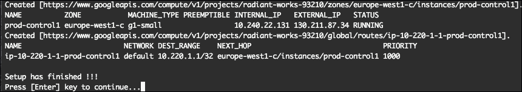

    我们刚刚创建了新的生产集群控制节点。

    为了学习目的，我们只使用了一个`etcd`服务器。对于真实的生产集群，建议至少使用三个`etcd`服务器，并且每个服务器应该位于不同的云可用区。

    由于生产集群设置脚本与测试/暂存集群脚本非常相似，我们在这里不再分析它们。

1.  下一步是创建我们的生产集群工作节点：

    ```
    $ ./create_cluster_workers.sh

    ```

    你应该看到如下输出：

    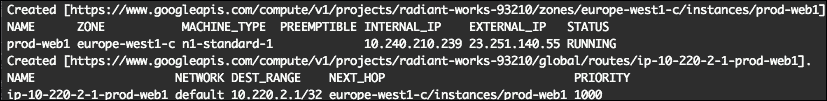

    对于其他集群工作节点，你应该看到类似以下内容：

    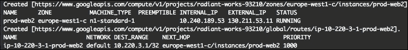

    ### 注意

    记下工作节点的外部 IP；稍后我们将需要这些 IP。当然，你也可以随时在 Google Cloud 开发者控制台查看它们。

    所以，我们已经在 GCE 上设置好了生产服务器。如果你检查 Google Cloud 开发者控制台中的计算引擎实例，你应该看到一份服务器列表，类似这样：

    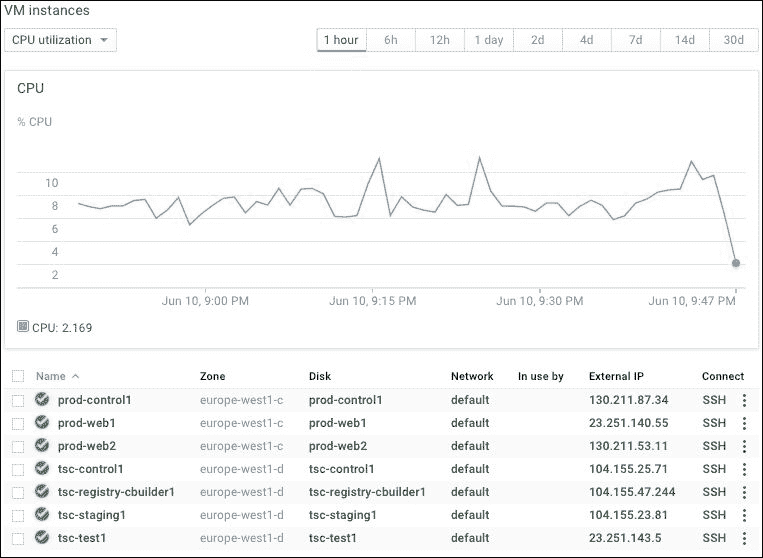

1.  现在让我们安装所有必要的脚本，以便访问我们的集群：

    ```
    $ ./install_fleetctl_and_scripts.sh

    ```

    这个脚本将创建一个名为 `~/coreos-prod-gce` 的新文件夹，其中包含与我们的测试/暂存集群相同的文件夹：

    +   `bin` 文件夹将包含用于访问集群机器的脚本和 `set_cluster_access.sh` 脚本

    +   `fleet - website1.service fleet` 单元文件

1.  让我们运行 `set_cluster_access.sh`：

    ```
    $ cd ~/coreos-prod-gce/bin
    $ ./set_cluster_access.sh

    ```

    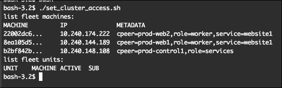

完美！我们的生产集群已正常运行！

如你所见，我们这里有三台服务器，一台用于 `etcd` 服务，另外两台是用于运行我们网站的工作节点。

我们已经准备好了 `website1 fleet` 单元。现在让我们安装它：

```
$ cd ~/coreos-prod-gce/fleet
$ fleetctl start website1.service

```

以下截图演示了输出内容：

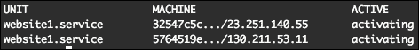

现在我们准备好在生产服务器上部署代码了。

# 在生产集群服务器上部署代码

在前面的章节中，我们看到了如何在 Google Cloud 上设置测试/暂存环境并部署我们的代码，同时我们也设置了 Docker 构建器和 Docker 私有注册表服务器。

在下一节中，我们将学习如何使用 Docker 构建器和 Docker 私有注册表将代码部署到我们的生产集群的 Web 服务器上。

## 设置 Docker 构建器服务器

在将代码从暂存环境部署到生产环境之前，我们需要将 `Dockerfile` 文件和 `build.sh`、`push.sh` 文件复制到我们的 Docker 构建器。

为此，请运行以下命令：

```
$ cd coreos-essentials-book/chapter7/Test_Staging_Cluster/
$ ./install_website1_2_dbuilder.sh

```

你应该看到类似于以下截图的内容：

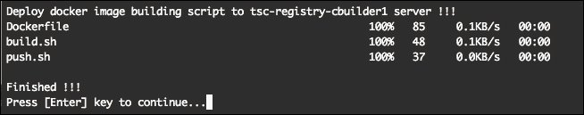

那么让我们来看一下发生了什么——也就是那个脚本做了什么。它已经将三个文件复制到 Docker 构建器服务器：

1.  这将用于构建我们的生产 Docker 镜像：

    ```
    $ cat Dockerfile:
    FROM nginx:latest
    ## add website code
    ADD website1 /usr/share/nginx/html
    EXPOSE 80

    ```

1.  以下是 Docker 镜像构建脚本：

    ```
    $ cat build.sh
    docker build --rm -t 10.200.4.1:5000/website1 .

    ```

1.  以下是将 Docker 镜像推送到我们的私有 Docker 注册表的脚本：

    ```
    $ cat push.sh
    docker push 10.200.4.1:5000/website1

    ```

好的，我们已经准备好了 Docker 构建器服务器。现在让我们开始在生产服务器上进行代码部署。

## 在生产服务器上部署代码

要在生产 Web 服务器上部署代码，请运行以下命令：

```
$ cd ~/coreos-prod-gce

```

当我们构建生产集群时，安装脚本已经安装了 `deploy_2_production_website1.sh` 脚本。让我们运行它，你应该会看到类似于以下两张截图的输出：

```
$ ./deploy_2_production_website1.sh

```

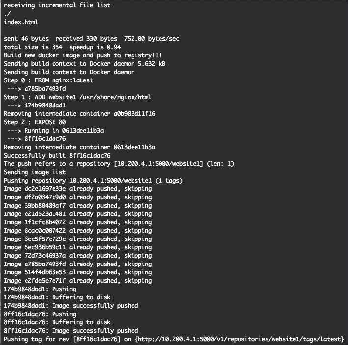

你还应该看到类似下面的内容：

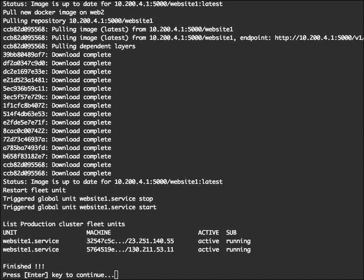

现在，在浏览器中打开 `prod-web1` 和 `prod-web2`，使用它们的外部 IP，你应该能看到如下截图所示的内容：

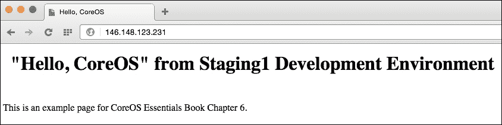

我们看到的网页与暂存服务器上的完全相同。

太棒了！我们已经成功将代码部署到生产服务器上！

让我们看看那里发生了什么。

运行以下命令：

```
$ cat deploy_2_production_website1.sh
#!/bin/bash
# Build docker container for website1
# and release it

function pause(){
read -p "$*"
}

# Test/Staging cluster
## Fetch GC settings
# project and zone
project=$(cat ~/coreos-tsc-gce/settings | grep project= | head -1 | cut -f2 -d"=")
zone=$(cat ~/coreos-tsc-gce/settings | grep zone= | head -1 | cut -f2 -d"=")
cbuilder1=$(gcloud compute instances list --project=$project | grep -v grep | grep tsc-registry-cbuilder1 | awk {'print $5'})

# create a folder on docker builder
echo "Entering dbuilder docker container"
ssh -o UserKnownHostsFile=/dev/null -o StrictHostKeyChecking=no  core@$cbuilder1 "/usr/bin/docker exec docker-builder /bin/bash -c 'sudo mkdir -p /data/website1 && sudo chmod -R 777 /data/website1'"

# sync files from staging to docker builder
echo "Deploying code to docker builder server !!!"
ssh -o UserKnownHostsFile=/dev/null -o StrictHostKeyChecking=no core@$cbuilder1 '/usr/bin/docker exec docker-builder rsync -e "ssh -o UserKnownHostsFile=/dev/null -o StrictHostKeyChecking=no" -avzW --delete core@10.200.3.1:/home/core/share/nginx/html/ /data/website1'
# change folder permisions to 755
ssh -o UserKnownHostsFile=/dev/null -o StrictHostKeyChecking=no  core@$cbuilder1 "/usr/bin/docker exec docker-builder /bin/bash -c 'sudo chmod -R 755 /data/website1'"

echo "Build new docker image and push to registry!!!"
ssh -o UserKnownHostsFile=/dev/null -o StrictHostKeyChecking=no core@$cbuilder1 "/usr/bin/docker exec docker-builder /bin/bash -c 'cd /data && ./build.sh && ./push.sh'"
##

# Production cluster
## Fetch GC settings
# project and zone
project2=$(cat ~/coreos-prod-gce/settings | grep project= | head -1 | cut -f2 -d"=")

# Get servers IPs
control1=$(gcloud compute instances list --project=$project2 | grep -v grep | grep prod-control1 | awk {'print $5'})
web1=$(gcloud compute instances list --project=$project2 | grep -v grep | grep prod-web1 | awk {'print $5'})
web2=$(gcloud compute instances list --project=$project2 | grep -v grep | grep prod-web2 | awk {'print $5'})

echo "Pull new docker image on web1"
ssh -o UserKnownHostsFile=/dev/null -o StrictHostKeyChecking=no core@$web1 docker pull 10.200.4.1:5000/website1
echo "Pull new docker image on web2"
ssh -o UserKnownHostsFile=/dev/null -o StrictHostKeyChecking=no core@$web2 docker pull 10.200.4.1:5000/website1

echo "Restart fleet unit"
# restart fleet unit
ssh -o UserKnownHostsFile=/dev/null -o StrictHostKeyChecking=no core@$control1 fleetctl stop website1.service
ssh -o UserKnownHostsFile=/dev/null -o StrictHostKeyChecking=no core@$control1 fleetctl start website1.service
#
sleep 5
echo " "
echo "List Production cluster fleet units"
ssh -o UserKnownHostsFile=/dev/null -o StrictHostKeyChecking=no core@$control1 fleetctl list-units

echo " "
echo "Finished !!!"
pause 'Press [Enter] key to continue...'

```

部署到生产环境的步骤如下：

1.  在 Docker 构建器服务器上创建名为 `/data/website1` 的文件夹。

1.  通过 docker-builder 容器使用 `rsync` 将文件从 `Staging1` 同步到 Docker 构建服务器。

1.  通过 docker-builder 容器运行 `build.sh` 脚本。

1.  将新的 Docker 镜像推送到私有 Docker 注册表。

1.  将新的 Docker 镜像拉取到 `Prod-web1` 和 `prod-web2` 服务器上。

1.  通过生产集群的 `etcd` 服务器重启 `website1.service fleet` 单元。

1.  就这样！我们已完成将新网站发布到生产集群。

### 注意

**需要注意的一点**

我们使用 docker-builder 容器来同步和构建我们的 Docker 容器。

这可以直接在 Docker 构建服务器上完成，但使用容器可以让我们将任何所需工具添加到容器中，这带来了优势。如果我们需要复制 Docker 构建服务器或用新服务器替换它，我们只需要安装 docker-builder 容器，就能让一切恢复正常。

# Dev/Test/Staging/Production 环境概述

让我们概述一下以我们所采用的方式进行 Dev/Test/Staging/Production 环境设置的优点：

+   通过 CoreOS 虚拟机进行本地代码开发可以减少测试时间，因为所有更改都会推送到 VirtualBox 虚拟机上的本地服务器。

+   基于云的测试/预发布环境适用于使用 GitHub 或 Bitbucket 的团队共享项目。就我们而言，它还运行 `nginx` 容器作为我们的 Web 服务器，代码通过附加的 `host` 文件夹来使用。这大大加快了从测试和预发布 `git` 分支进行代码部署的速度，因为每次从 `git` 仓库拉取代码时，Docker 容器无需重新构建。

+   对于生产环境，使用的是一个独立的集群。分离开发和生产集群是一个良好的实践。

+   对于生产环境，我们使用与测试/预发布服务器相同的 Docker 基础镜像，但我们会构建一个新的 Docker 镜像，并将代码嵌入其中。因此，我们可以通过在所有服务器上重用相同的 Docker 镜像，自动扩展网站到任意数量的服务器，所有服务器将运行完全相同的代码。

+   对于 Docker 镜像构建和我们的私有 Docker 注册表，我们使用相同的服务器，该服务器仅通过内部 GCE IP 可访问。如果您想将 Docker 注册表暴露给外部访问，例如，应该在 Docker 注册表前放置带有认证的 `nginx` 容器以确保安全。

+   这只是设置 Dev/Test/Staging/Production 环境的一种方式。每种设置场景都不同，但这种设置应为你提供正确的方向。

# 基于 fleet 的 PaaS

在本章及之前的章节中，我们解释了如何使用 fleet 在集群上部署不同的服务。Fleet 是一个功能强大且易于使用的低级集群管理器，可以在集群层面控制 `systemd`。然而，它缺乏 Web UI、易用的编排工具等，因此 PAZ 这个优秀的 PaaS 在此时为我们提供了帮助。

## 使用 PAZ 部署服务

[`www.paz.sh`](http://www.paz.sh) 网站具有一个非常漂亮且用户友好的 Web UI，使得设置 CoreOS 集群变得更加容易。PAZ 还提供了一个 API，如果你想通过脚本自动化操作，可以使用它。

通过其仪表板，您可以添加和编辑服务，检查集群的状态（按主机或单元查看），并查看集群的监控信息和日志。

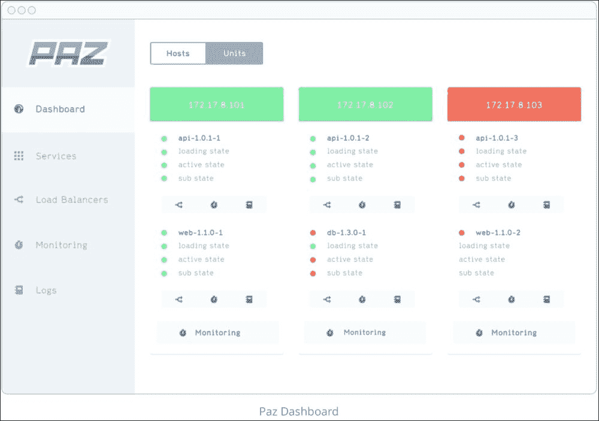

它充分利用`fleet`来协调集群中各台机器上的服务。它是用`Node.js`构建的，所有服务都作为 Docker 容器运行。

以下几点解释了 PAZ 的工作原理：

+   用户可以在 UI 中声明服务

+   服务存储在服务目录中

+   调度器是部署服务的服务

+   您可以手动指示调度器进行部署，或在 CI 过程结束时触发它

+   Paz 支持推送后 Docker Hub 的 Web 钩子

+   通过使用`etcd`和服务发现，您的容器将被连接在一起

当然，它会不断发展并获得新特性，但在撰写本书时，只有前面列表中的服务可用。

本书的范围不包括对 PAZ 的完整概述，但你可以在[`paz.readme.io/v1.0/docs/paz-architecture`](http://paz.readme.io/v1.0/docs/paz-architecture) 阅读更多关于 Paz 架构的信息。

# 另一种运行 CoreOS 集群的云解决方案

为了引导我们的测试/预生产和生产集群，我们使用了 Google Cloud Compute Engine 的虚拟实例，但有时您可能希望在不在自己场所存储的真实服务器（裸金属服务器）上运行您的服务器。

市面上有许多不同的裸金属服务器提供商，但其中一个吸引我注意的是[`www.packet.net`](https://www.packet.net)。

最近我在调查 CoreOS 和容器的托管解决方案时发现了这些。它们有趣的地方在于，既然没有走传统的云/虚拟化路线，它们创建了一个真正按需、裸金属的云解决方案。我能够在不到 5 分钟的时间内从零开始启动一个 CoreOS 服务器，而且它们有一个相当全面的 API 和相应的文档。

这是一个 Packet 项目仪表板的示例：

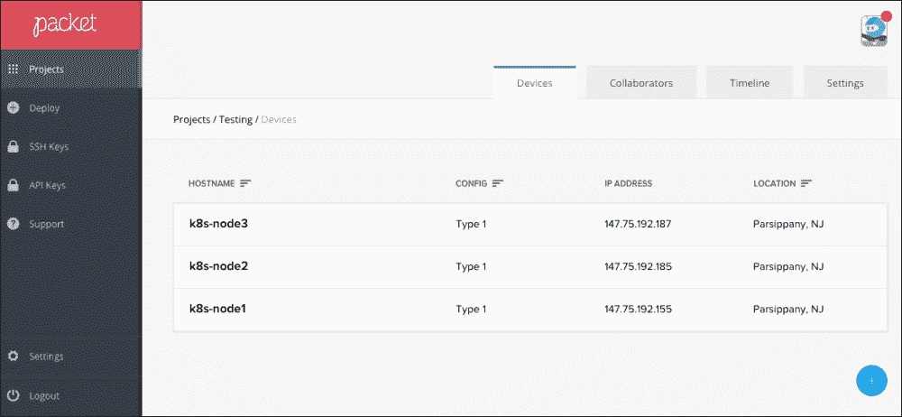

# 总结

在本章中，我们了解了如何设置生产集群并使用 Docker 构建器和私有 Docker 仓库机器部署我们的代码预发布。最后，我们概述了一个基于`fleet`的 PaaS——`Paz.sh`。

在下一章中，我们将概述 CoreOS 更新策略和我们的服务器的 CoreUpdate。我们还将使用托管的公有/私有 Docker 仓库 [`quay.io`](https://quay.io) 和自托管的 CoreOS 企业注册表。
