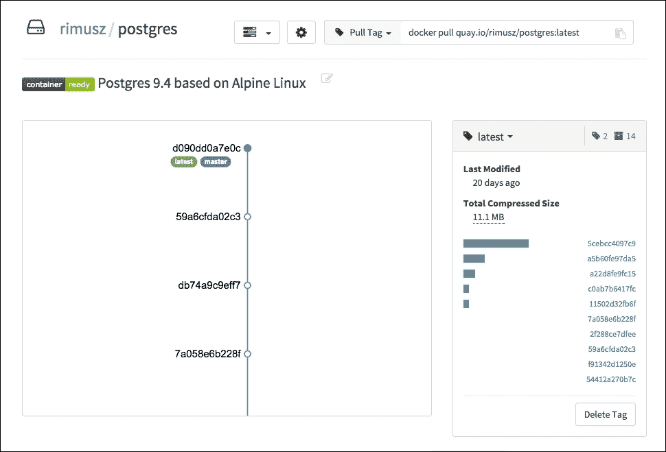

# 第八章：介绍 CoreUpdate 和容器/企业注册中心

在上一章中，我们了解了如何设置生产集群并部署代码，如何使用 Docker 构建器设置暂存环境，以及如何将私有 Docker 注册中心机器部署到生产服务器。

在本章中，我们将概述 CoreOS 更新策略、付费的 CoreUpdate 服务以及在容器注册中心和企业注册中心托管的 Docker 镜像。

本章将涵盖以下主题：

+   更新策略

+   CoreUpdate

+   容器注册中心

+   企业注册中心

# 更新策略

在我们了解 CoreOS 的付费 CoreUpdate 服务之前，先概述一下开箱即用的自动更新策略。

## 自动更新

CoreOS 默认启用自动更新。

正如我们之前提到的，当 CoreOS 团队发布更新时，主机将其暂存到临时位置并安装到被动的 `usr` 分区。重启后，活动分区和被动分区将交换。

在写这本书时，共有四种更新策略，如下所示：


应该使用哪种更新策略在 `cloud-config` 的 `update` 部分中定义：

```
  #cloud-config
  coreos:
    update:
      group: stable
      reboot-strategy: best-effort
```

让我们来看一下这些更新策略：

+   `best-effort`：这是默认策略，其工作方式是检查机器是否为集群的一部分。如果是，它会使用 `etcd-lock`；否则，它会使用 `reboot` 策略。

+   `etcd-lock`：这使我们能够通过在每台机器上放置一个 `reboot` 锁来一次只启动一台机器，并逐一重启它们。

+   `reboot`：一旦更新安装到被动分区，它将立即重启机器。

+   `off`：在成功更新安装到被动分区后，机器不会被重启。

## 更新策略的使用

以下是一些 `update` 策略的应用示例：

+   `best-effort`：建议在生产集群中使用此策略

+   `reboot`：这可以用于只能在一天中的特定时间重启的机器，例如用于在维护窗口中进行自动更新。

+   `off`：适用于本地开发环境，其中重启控制权由用户掌握

如果你想了解更多更新策略，请访问 CoreOS 官网：[`coreos.com/docs/cluster-management/setup/update-strategies/`](https://coreos.com/docs/cluster-management/setup/update-strategies/)。

# CoreUpdate

CoreUpdate 是受管 Linux 计划的一部分（[`coreos.com/products/`](https://coreos.com/products/)）。

这是 CoreOS 商业版中的一个工具。它为用户提供了自己的支持 Omaha 服务器，类似于 Red Hat Satellite Server 和 Canonical Landscape 等工具：

+   标准计划由 CoreOS 管理和托管

+   高级计划可以在防火墙后运行，可以是本地部署或云端部署

CoreUpdate 使用与前面提到的`update`策略完全相同的策略，除了在`cloud-config`文件中的`update`部分有一些区别：

```
#cloud-config 
  coreos:
    update:
      group: production
      server: https://customer.update.core-os.net/v1/update
```

这里：

+   `group`是你在 CoreUpdate 仪表板上设置的内容

+   `server`是你在为托管 Linux 计划注册后生成的链接。

在我们当前的示例中，根据`cloud-config`，服务器属于`https://customer.update.core-os.net/v1/update`，而`group`为`production`。

我们通过 CoreUpdate UI 进行更改，如下图所示：


以下功能是可用的：

+   发布通道；在我们的案例中，它是稳定的。

+   启用/禁用自动更新

+   机器更新之间的时间窗口；在我们的案例中，它是 90 分钟。

CoreUpdate 的 UI 允许你非常轻松地控制集群更新组，无需通过终端对每台服务器执行`ssh`并单独修改每台服务器的更新设置。

### 注意

你可以在以下页面阅读更多关于 CoreUpdate 的信息：

[`coreos.com/docs/coreupdate/coreos/coreupdate-configure-machines`](https://coreos.com/docs/coreupdate/coreos/coreupdate-configure-machines)

[`coreos.com/docs/coreupdate/coreos/coreupdate-getting-started`](https://coreos.com/docs/coreupdate/coreos/coreupdate-getting-started)

# 容器注册表

容器注册表是 CoreOS 为应用容器提供的托管服务，网址是[`quay.io`](https://quay.io)。在那里，如果你不想自己运行私有 Docker 注册表，可以托管你的 Docker 镜像：

+   它为公共容器仓库提供免费、无限的存储和仓库。

+   如果你需要私有仓库，它提供了多种计划供你选择。

## Quay.io 概览

让我们看一下它们提供的概览：一个友好且易于使用的 UI。


在下面的截图中，我们更详细地查看了 postgres 容器镜像：



从前面的截图中可以看出，UI 非常易于使用，功能也很容易理解。

让我们看看创建仓库功能是怎样的：


当你创建一个新仓库时，你可以进行以下操作：

+   将仓库设置为公开或私有。

+   如果你想自己构建容器并将它们推送到注册表中，可以将其清空。

+   提供（上传）一个`Docker`文件。

+   链接到 GitHub 仓库。这是首选选项，因为它允许你在向 GitHub 仓库推送更改时自动构建容器。

# 企业注册表

企业注册表与容器注册表基本相同，但托管在你的本地或云服务器上，位于你的防火墙后面。

它有不同的计划选项，可以在[`coreos.com/products/enterprise-registry/`](https://coreos.com/products/enterprise-registry/)找到。

它允许你管理容器构建、团队和用户的权限等。

如果贵公司的需求是一个非常安全且完全由您控制的设置，那么使用容器注册表和企业注册表是最佳选择。

# 总结

在本章中，我们概述了 CoreOS 更新策略、CoreUpdate 服务、托管的免费/付费容器注册表[`quay.io`](https://quay.io)以及自托管的企业注册表服务。

在下一章中，您将了解 CoreOS 的 rkt——可以替代 Docker 容器使用的应用容器运行时。
