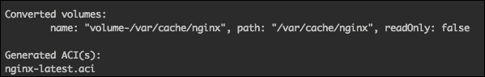
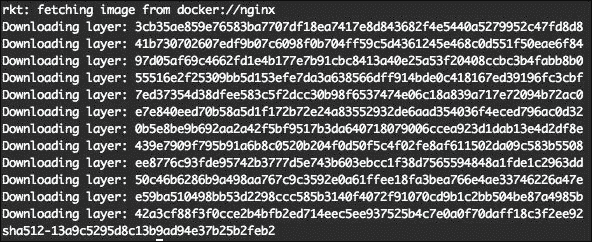
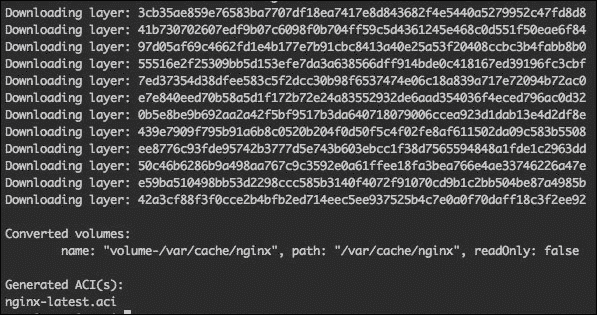
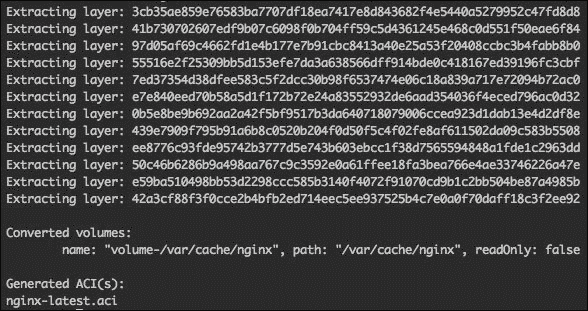

# 第九章：CoreOS rkt 简介。

在前一章中，我们概述了 CoreUpdate、免费的和付费的容器仓库，以及 CoreOS 提供的托管和企业级注册中心。

在本章中，你将学习 CoreOS 的 `rkt`，一个面向应用的容器运行时。我们将涵盖本章中的以下主题：

+   `rkt` 简介。

+   使用 `rkt` 运行精简版 Docker 镜像。

+   将 Docker 镜像转换为 ACI。

# rkt 简介。

rkt（发音为 "rock it"）是由 CoreOS 制作的应用容器运行时，设计时注重可组合性、速度和安全性。它是 Docker 的替代方案，专为在安全性和生产环境要求最严格的服务器上运行而设计。

rkt 是一个独立的工具，相较于 Docker 的客户端和中央守护进程版本，它使得 rkt 成为 Docker 的一个更好的替代方案，因为它有更少的约束和依赖。例如，如果 `docker` 中央守护进程崩溃，所有正在运行的 `docker` 容器将被停止；而在 `rkt` 的情况下，这只会影响到特定的 rkt 进程，该进程负责在其 pod 中运行 `rkt` 容器。由于每个 `rkt` 进程都会有自己的**进程标识号**（**PID**），因此如果一个 `rkt` 进程崩溃，它不会影响到其他任何 `rkt` 进程。

## `rkt` 的功能。

我们将概述 `rkt` 的主要功能，内容如下：

+   它可以与 `init` 系统集成，如 `systemd` 和 `upstart`。

+   它可以与集群编排工具集成，如 `fleet` 和 `Kubernetes`（我们将在下一章介绍）。

+   它与其他容器解决方案如 Docker 兼容。

+   它具有可扩展和模块化的架构。

## 应用容器基础。

`rkt` 是 **应用容器**（**appc**: [`github.com/appc/spec/`](https://github.com/appc/spec/)）的一个实现，它是开源的，定义了应用容器的镜像格式、运行时环境和发现机制：

+   `rkt` 使用的是**应用容器镜像**（**ACI**）格式的镜像，这一格式由应用容器（appc）规范定义（[`github.com/appc/spec`](https://github.com/appc/spec)）。ACI 只是一个简单的 `tarball` 包，包含不同的 `rootfs` 文件和镜像清单。

+   一个 pod（`rkt` 中的基本执行单元）是一个或多个应用镜像（ACI）的集合，并且可以在 pod 级别应用一些可选的附加元数据——例如，应用一些资源限制，如 CPU 使用率。

## 使用 rkt。

由于 rkt 已预装在 CoreOS 中，使用 rkt 运行 ACI 镜像非常简单，而且与 `docker` 命令非常相似。（我很想写更多内容，但由于 rkt 还在不断变化和创新，目前提供的选项并不多，这在写这本书时也是如此。）

由于 `rkt` 没有运行 OS X 客户端，你需要直接登录到 CoreOS VM 主机上才能运行以下示例命令：

1.  首先，我们需要信任远程站点，才能从那里下载任何 ACI 文件，因为 `rkt` 默认会验证签名：

    ```
    $ sudo rkt trust –prefix example.com/nginx

    ```

1.  然后我们可以从那里获取（下载）一个镜像：

    ```
    $ sudo rkt fetch example.com/nginx:latest

    ```

1.  然后使用 `rkt` 运行容器非常简单：

    ```
    $ sudo rkt run example.com/nginx:v1.8.0

    ```

如你所见，`rkt` 使用了 ETag——在我们的案例中将会运行 v1.8.0。

## rkt 网络

默认情况下，`rkt` 运行使用主机模式进行端口分配。例如，如果你的 Dockerfile 中有 `EXPOSE 80`，运行此命令：

```
$ sudo rkt run example.com/nginx:v1.8.0

```

`rkt` pod 将与主机共享网络栈和接口。

如果你想分配一个不同的端口/私有 IP 地址，则使用带有这些参数的 `run`：

```
sudo rkt run --private-net --port=http:8000 example.com/nginx:v1.8.0

```

## rkt 环境变量

可以使用 `--inherit-env` 标志从主机继承环境变量。使用 `flag --set-env`，我们可以设置单独的环境变量。

好的，接下来我们准备一些环境变量，通过以下两个命令来继承：

```
$ export ENV_ONE=hi_from_host
$ export ENV_TWO=CoreOS

```

现在让我们在命令中将它们与 `--set-env` 一起使用，如下所示：

```
$ sudo rkt run --inherit-env --set-env ENV_THREE=hi_nginx example.com/nginx:v1.8.0

```

## rkt 卷

对于主机卷，需使用 `-volume` 标志。卷需要在创建新的 ACI 镜像和转换 Docker 镜像时在 ACI 清单中定义。你将得到如下输出：



以下命令将在 `rkt` Pod 上挂载 `host` 目录：

```
$ sudo rkt run –volume volume-/var/cache/nginx,kind=host,source=/some_folder/nginx_cache example.com/nginx:v1.8.0

```

请注意，在编写本书时，`rkt` 卷标准尚未完成，因此当 `rkt` 达到最终版本时，前面的示例可能无法工作。

接下来，让我们看看 `rkt` 如何与 Docker 镜像良好配合。

# 使用 rkt 运行简化版 Docker 镜像

由于在公共的 Docker hub 上有成千上万的 Docker 镜像，`rkt` 使得你可以非常轻松地使用它们。或者，你可能已经有了一些 Docker 镜像，并希望使用 `rkt` 来运行它们，而无需构建新的 `rkt` ACI 镜像，来查看它们如何与 `rkt` 一起工作。

运行 Docker 镜像与之前的示例非常相似：

1.  由于 Docker 镜像尚不支持签名验证，因此我们只需跳过验证步骤，并使用 `--insecure-skip-verify` 标志来获取一个镜像：

    ```
    $ sudo rkt --insecure-skip-verify fetch docker://nginx

    ```

    

1.  前面截图中的最后一行表示转换后的 ACI 的 `rkt` 镜像 ID，这可以用来与 `rkt` 一起 `run`：

    ```
    $ sudo rkt --insecure-skip-verify run sha512-13a9c5295d8c13b9ad94e37b25b2feb2

    ```

1.  我们也可以用这种方式运行，镜像将会被下载然后运行：

    ```
    $ sudo rkt --insecure-skip-verify run docker://nginx

    ```

1.  如果我们想要与 Docker 镜像一起使用卷，可以运行这行命令：

    ```
    $ sudo rkt --insecure-skip-verify run \
    --volume /home/core/share/nginx/html:/usr/share/nginx/html \
    docker://nginx

    ```

    这与 `docker` 命令非常相似，对吧？

1.  好的，让我们更新本地开发的 `nginx.service`，以便使用 `rkt`：

    ```
    [Unit]
    Description=nginx
    [Service]
    User=root
    TimeoutStartSec=0
    EnvironmentFile=/etc/environment
    ExecStart=/usr/bin/ rkt --insecure-skip-verify run \
     -volume /home/core/share/nginx/html:/usr/share/nginx/html \
    docker://nginx
    #
    Restart=always
    RestartSec=10s
    [X-Fleet]

    ```

如你所见，那里没有 `ExecStop=/usr/bin/docker stop nginx`。这不需要，因为 `systemd` 会在使用 `systemctl` / `fleetctl` 停止时，通过发送 `SIGTERM` 信号来停止运行中的 `nginx` 进程。

比 Docker 简单多了，对吧？

在下一节中，我们将看到如何将 Docker 镜像转换为 ACI 镜像。

# 将 Docker 镜像转换为 ACI

随着 CoreOS 的推出，出现了与 `rkt` 相关的另一个文件——`docker2aci`。它将 Docker 镜像转换为 ACI 镜像（`rkt` 使用的应用容器镜像）。

让我们来转换我们的`nginx`镜像。运行以下命令：

```
$ docker2aci docker://nginx

```



我们还可以将 Docker 镜像保存在文件中并进行转换。运行以下命令：

```
$ docker save -o nginx.docker nginx
$ docker2aci nginx.docker

```



最后，您可以尝试通过更新之前的 `nginx.service fleet` 单元来使用生成的 ACI 文件：

```
[Unit]
Description=nginx
[Service]
User=root
TimeoutStartSec=0
EnvironmentFile=/etc/environment
ExecStart=/usr/bin/ rkt --insecure-skip-verify run \
 --volume volume-/usr/share/nginx/html,kind=host,source=/usr/share/nginx/html \
 full_path_to/nginx-latest.aci
#
Restart=always
RestartSec=10s

[X-Fleet]

```

# 概述

在本章中，我们概述了 CoreOS rkt 的主要特点、`rkt` 应用容器及其镜像格式。您还学会了如何使用 `rkt` 将基于 `aci` 和 `docker` 的镜像作为容器运行。

在下一章中，您将了解 Google Kubernetes，这是一个用于应用容器的开源调度系统。
