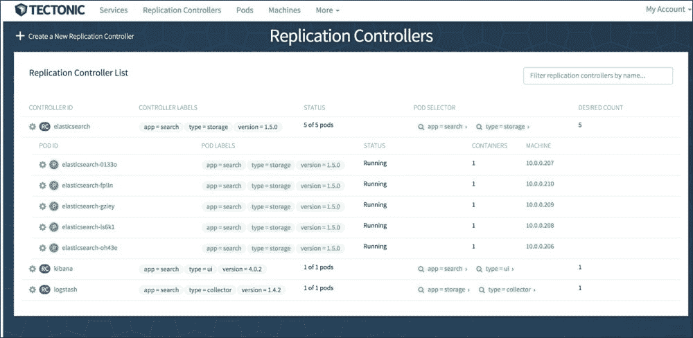

# 第十章：Kubernetes 介绍

在本章中，我们将简要介绍 Google Kubernetes，它在多个主机上管理容器化应用程序。由于 Kubernetes 是一个非常庞大的项目，本章将仅概述其主要概念和一些用例，包括以下内容：

+   什么是 Kubernetes？

+   Kubernetes 的主要组件

+   Kubernetes 集群设置

+   Tectonic——CoreOS 和 Kubernetes 结合的商业实现

# 什么是 Kubernetes？

Google 已经在容器中运行一切超过十年了。在内部，他们使用一个名为 Borg 的系统（[`research.google.com/pubs/pub43438.html`](http://research.google.com/pubs/pub43438.html)），这是 Kubernetes 的前身，用于在服务器之间扩展和编排容器。

从 Borg 中汲取的经验教训被用来构建 Kubernetes，一个开源容器编排系统。它在 2014 年 6 月发布后迅速流行。

Borg 的所有最佳思想都融入到了 Kubernetes 中。许多 Borg 的开发者现在在 Kubernetes 项目中工作。

Kubernetes 在其 GitHub 项目上获得了成千上万的星标（[`github.com/GoogleCloudPlatform/kubernetes`](https://github.com/GoogleCloudPlatform/kubernetes)），并得到了开源社区以及 CoreOS、Red Hat、Microsoft、VMware 等公司的大力支持。

## Kubernetes 的主要组件

Kubernetes 可以在任何现代的 Linux 操作系统上运行。

以下是 Kubernetes 的主要组件：

+   **Master（主节点）**：这是 Kubernetes 的主要控制服务集，通常运行在一台服务器上，`etcd`集群除外。但它也可以分布在几台服务器上。Kubernetes 的服务如下：

    +   `etcd`集群

    +   API 服务器

    +   控制器管理器

    +   调度器

+   **节点**：这是集群中的工作节点。它可以是虚拟机（VM）或裸机服务器。节点由主节点服务管理，并专门用于运行 Pod。每个节点必须运行以下两个 Kubernetes 服务：

    +   Kubelet

    +   网络代理

    Docker 和 rkt 用于运行应用容器。未来我们将看到更多支持的应用容器系统。

+   **Pod**：这是一个共享上下文运行的应用容器组。即使是单个应用容器，也必须在 Pod 中运行。

+   **复制控制器**：这些确保指定数量的 Pod 在运行。如果 Pod 太多，它们会被杀死。如果太少，所需的 Pod 数量将被启动。即使只有一个 Pod，也不建议在没有复制控制器的情况下运行 Pod。

+   **服务**：同一个 Pod 只能运行一次。如果它崩溃，复制控制器会用一个新的 Pod 替代它。每个 Pod 都有自己的专用 IP，这样就可以在同一个节点上运行多个容器在不同端口上。但每次从模板启动 Pod 时，复制控制器都会分配不同的 IP，这时服务就发挥了作用。每个服务会分配一个虚拟 IP，并且该 IP 会一直与服务绑定，直到服务结束。

+   **标签**：这些是每个 Kubernetes 组件使用的任意键值对；例如，复制控制器使用它们进行服务发现。

+   **卷**：卷是一个可以从容器访问的目录，用于存储容器的有状态数据。

+   **Kubectl**：这个工具用于控制 Kubernetes 集群管理器。例如，你可以添加/删除节点、Pod 或复制控制器；查看它们的状态；等等。Kubernetes 使用`manifest`文件来设置 Pods、复制控制器、服务、标签等。

Kubernetes 有一个不错的用户界面，它是由[`kismatic.io/`](http://kismatic.io/)开发并贡献的。它运行在一个 API 服务器上：


这使我们能够检查 Kubernetes 集群的状态，并添加/删除 Pods、复制控制器等。它还允许我们通过用户界面以与`kubectl`相同的方式管理 Kubernetes 集群。

[`kismatic.io/`](http://kismatic.io/)也将在不久的将来提供 Kubernetes 的企业/商业版本。

# Kubernetes 集群设置

在前一部分中，我们概述了 Kubernetes 的主要功能，现在让我们做一些有趣的事情——在 Google Cloud 上安装一个小型 Kubernetes 集群。

请注意，如果你使用的是免费的/试用的 Google Cloud 账户，该账户有 8 个 CPU 的限制（允许 8 个虚拟机），你需要删除其中的一些。让我们用 Kubernetes 集群替换我们的生产集群。根据以下屏幕截图选择虚拟机。然后点击右上角的**删除**按钮。


现在我们准备安装 Kubernetes 集群：

1.  在你的终端中输入以下命令：

    ```
    $ cd coreos-essentials-book/Chapter10/Kubernetes_Cluster

    ```

    请注意，由于我们有一些文件夹/文件与我们用于设置测试/暂存/生产集群时非常相似，因此这次我们不再复习这些脚本。你可以随时查看这些设置文件，了解其中的差异：

1.  更新那里`settings`文件中的 Google Cloud 项目 ID 和区域。

1.  现在我们来运行第一个脚本，名为`1-bootstrap_cluster.sh`：

    ```
    $ ./ 1-bootstrap_cluster.sh

    ```

    你应该看到类似这样的输出：

    

如果你查看 Google Cloud 控制台，你应该会看到三个新的虚拟机，分别是**k8s-master**、**k8s-node1**和**k8s-node2**：


`1-bootstrap_cluster.sh`脚本已经安装了一个小型的 CoreOS 集群，它的设置方式与我们之前的测试/暂存/生产集群相同——一个`etcd`服务器和两个连接到它的工作节点。还会在用户的主文件夹中创建一个新的文件夹`k8s-cluster`，该文件夹将复制`settings`文件，并且后续的其他二进制文件也会复制到该文件夹。

1.  接下来，我们需要在计算机上安装`fleetctl`、`etcdctl`和`kubectl`本地客户端，以便能够与 CoreOS 集群的`etcd`和`fleet`服务，以及 Kubernetes 主服务进行通信。

    在终端中输入以下命令：

    ```
    $ ./2-get_k8s_fleet_etcd.sh

    ```

    你应该看到类似于此的输出：

    

1.  现在，让我们在我们的新 CoreOS 集群上安装 Kubernetes 集群。

    在终端中输入以下命令：

    ```
    $ ./3-install_k8s_fleet_units.sh

    ```

    你应该看到类似于这里展示的输出：

    

1.  让我们尝试通过 `""` 访问我们的 Kubernetes 集群，该文件已通过 `1-bootstrap_cluster.sh` 脚本复制到 `~/k8s-cluster/bin`。

    在终端中输入以下命令：

    ```
    $ cd ~/k8s-cluster/bin
    $ ./set_k8s_access.sh

    ```

    你应该看到类似于以下的输出：

    

如你所见，我们的 Kubernetes 集群已启动并正在运行。

`set_k8s_access.sh` 的作用是通过将 `localhost` 端口 2379（`fleet`）和 8080（Kubernetes 主节点）转发到远程 `k8s-master` 服务器，为 `fleetctl` 和 `kubectl` 提供访问权限。

1.  让我们通过在终端中输入以下命令来检查 Kubernetes 集群：

    ```
    $ kubectl cluster-info

    ```

    你应该看到类似于此的输出：

    

    完美！现在我们可以从本地计算机访问远程 Kubernetes 集群了。

1.  既然我们的 Kubernetes 集群已经启动并运行，让我们部署与生产集群部署中使用的相同的 `website1` Docker 镜像。

    在终端中输入以下命令：

    ```
    $  kubectl run website1 --image=10.200.4.1:5000/website1 --replicas=2 --port=80

    ```

    你应该看到以下输出：

    

    上一个命令创建了两个监听 `port 80` 的 `website1` pods。它还创建了一个名为 `website1` 的复制控制器，该控制器确保始终有两个 pods 在运行。

    我们可以通过在终端中输入以下命令列出已创建的 `pods`：

    ```
    $ kubectl get pods

    ```

    你应该看到类似于以下的输出：

    

    要列出已创建的复制控制器，请在终端中输入以下命令：

    ```
    $ kubectl get rc

    ```

    你应该看到以下输出：

    

1.  现在，让我们将我们的 Pods 暴露到互联网。`Kubectl` 命令可以与 Google Compute Engine 集成，为 `pods` 添加一个公共 IP 地址。要做到这一点，在终端中输入以下命令：

    ```
    $ kubectl expose rc website1 --port=80 --type=LoadBalancer

    ```

    你应该看到类似于此的输出：

    

    上一个命令创建了一个名为 `website1` 的服务，并为该服务映射了一个外部 IP 地址。要找到该 IP 地址，请在终端中输入以下命令：

    ```
    $ kubectl get services

    ```

    你应该看到类似于以下的输出：

    

最后一行的 IP 地址是我们的 IP，它是负载均衡器的地址。它被分配给 `k8s-node-1` 和 `k8snode-2` 服务器，并由 `website1` 服务使用。

让我们在浏览器中输入这个 IP 地址。我们应该看到类似于此的输出：


如你之前所见，它展示的网页与我们生产环境中的网页完全相同。同时，它的代码也和我们在预发布环境中的代码一模一样。我们从中构建了 Docker 镜像，并将该镜像用于生产集群和 Kubernetes 集群的部署。

如果你愿意，可以通过以下简单命令轻松地运行更多副本的 Pods：

```
$ kubectl scale --replicas=4 rc website1

```

让我们通过在终端中输入以下命令来检查我们的复制控制器：

```
$ kubectl get rc

```

你应该会看到类似以下的输出：


上述命令用于扩展 Pods，复制控制器确保我们始终运行四个副本。

### 注意

你可以在[`github.com/GoogleCloudPlatform/kubernetes/tree/master/examples`](https://github.com/GoogleCloudPlatform/kubernetes/tree/master/examples)找到大量的使用示例来进行实验。

本书篇幅太短，无法涵盖使用 Kubernetes 的所有好处，但我们很快应该会看到更多关于 Kubernetes 的书籍出版。

### 注意

这里提供了一些其他的 URL 供参考：

如果你是 Mac 用户，可以安装一个应用程序来在 Mac 上设置 Kubernetes 集群：1 个主节点 x 2 个节点，网址是 [`github.com/rimusz/coreos-osx-gui-kubernetes-cluster`](https://github.com/rimusz/coreos-osx-gui-kubernetes-cluster)，以及独立的主节点/节点设置，网址是 [`github.com/rimusz/coreos-osx-gui-kubernetes-solo`](https://github.com/rimusz/coreos-osx-gui-kubernetes-solo)。

其他关于 CoreOS 上 Kubernetes 的指南可以在 [`github.com/GoogleCloudPlatform/kubernetes/blob/master/docs/getting-started-guides/coreos.md`](https://github.com/GoogleCloudPlatform/kubernetes/blob/master/docs/getting-started-guides/coreos.md) 查看。

# Tectonic – CoreOS 和 Kubernetes 结合实现商业化

Tectonic ([`tectonic.com`](http://tectonic.com))是一个商业化的 CoreOS 发行版，结合了 CoreOS 和 Kubernetes 堆栈。任何规模的企业都可以使用它。

Tectonic 已预装了所有 CoreOS 和 Kubernetes 的开源组件，并添加了一些商业功能：

+   工作流和仪表盘的管理控制台/UI

+   企业级单点登录（SSO）集成

+   Quay 集成的容器注册表用于构建和共享 Linux 容器

+   用于容器部署自动化的工具

+   定制化的滚动更新

它可以在公有云或本地环境中运行。

它的管理控制台简单易用：



在上面的截图中，我们可以看到**复制控制器**（**RC**）的可视化。在左侧，你可以看到每个 RC 以及它为 Pods 分配的标签。在 RC 名称下方，你会看到所有运行中的 Pods 列表，这些 Pods 匹配相同的标签查询。


前面的截图展示了**elasticsearch**复制控制器的状态、使用的标签以及 Pod 卷。

Tectonic 旨在提供一种简便的容器部署解决方案，公司可以快速看到在企业中使用容器的好处。

# 摘要

在本章中，我们概述了 Google Kubernetes，介绍了它的基本概念、主要组件以及其 CoreOS 商业实现。

我们希望这本书能够为您提供所需的所有信息，帮助您充分利用 CoreOS 及相关容器的强大功能，并助力您开发高效的计算网络。感谢您的阅读！
