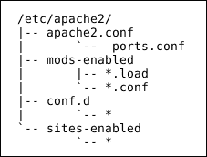

# 第四章：基本软件包配置

Debian 在很大程度上依赖每个软件包的上游开发者所使用的配置方法，并通过 Debian 开发者对配置的修改和补充，来标准化软件包配置，从而让管理员的工作更加轻松。在本章中，我们将介绍配置文件的标准位置、可用的配置辅助工具、配置文件管理的趋势以及一些示例。

# 配置文件

大多数配置文件位于`/etc`目录层次中。通常，大多数软件包将其配置文件放置在一个以软件名称命名的子目录中。如果上游开发者没有这样做，Debian 软件包通常会修改其行为。一个很好的例子是**BIND** DNS 服务器软件。传统上，基本配置文件放置在`/etc/named.conf`中，其他配置文件放置在`/var/lib/named`目录中。Debian BIND 软件包将所有配置文件放在`/etc/bind9`及其子目录中。

此外，还有一个`/etc/`default 目录，其中包含常见的修改选项，这些选项被放置在与软件包名称匹配的文件中。同样，以 BIND 为例，文件是`/etc/default/bind9`，其中包含两个简单的选项：是否使用`resolvconf`动态解析器，以及服务器应使用的运行选项。我们将首先介绍这个目录。

## /etc/default

该目录中的配置文件旨在控制在`/etc/init.d`中找到的标准初始化脚本（即`init`脚本）或控制各种系统库的行为。它们包含环境变量定义，这些定义由系统库或`init`脚本使用，以控制执行选项、软件模块加载以及可以动态控制的其他内容。

对于`init`脚本使用的定义，变量通常包括要使用的命令行选项的定义。在某些情况下，设置其中一个变量会修改脚本的行为。例如，在`/etc/default/bind9`中将`RESOLVCONF`设置为除了`no`以外的任何值，会导致`init`脚本使用`resolvconf`工具，在初始化时为本地回环接口添加适当的解析器行（并在关机时将其移除）。

对于那些应用于系统库的脚本，它们通常定义影响这些库的命令或软件的默认行为。一个很好的例子是`/etc/default/nss`，它控制**名称服务切换**（**NSS**）在 GNU C 库中的功能。特别是，它控制库会认为哪些信息是 NSS 调用的权威信息，以及某些函数调用的行为。

### 注意事项

在某些特殊情况下，默认的定义文件可能不是单一的文件，而是 `/etc/default` 的一个子目录。这是为了将信息分割成相关变量的组，既便于更新，也便于进行本地修改，而不至于在配置文件被替换时被覆盖。

## /etc/<软件包名称>

大多数软件开发者将配置文件放置在 `/etc` 目录下，这也是 Debian 软件包的标准做法。如果文件相对简单，且只需要一个文件，它通常会直接放在 `/etc` 下，并以 `.conf` 扩展名结尾，例如 `/etc/inetd.conf` 就是 `openbsd-inetd` 包的配置文件。对于需要更复杂配置的包，通常通过多个配置文件进行配置，这些文件会放在 `/etc` 的一个子目录下，该子目录通常会以软件包的名称命名。一个很好的例子就是 `apache2` 包，它的配置文件位于 `/etc/apache2` 及其子目录中。

在子目录中使用多个文件有多种原因。在某些情况下，是因为原始软件将不同的文件用于不同的目的。在其他情况下，则是为了将配置项组织成更易于管理和理解的组。有时，Debian 开发者还会修改包的配置，进行简化或优化管理。

一个很好的例子就是 Apache。正常的 Apache 配置通常是通过一个单一的文件或多个文件来进行，这些文件会被主配置文件包含。传统上，**SSL**（**安全套接字层**）证书和密钥，以及虚拟主机配置文件通常存放在子目录中，但所有主要的选项都在主目录中的一个或几个文件中进行配置。实际上，Debian 将配置拆分成多个文件，分布在不同的子目录中。这使得 Debian 能够提供独立的软件包，通过单独的配置文件提供特定功能，这些配置文件会被添加到适当的目录中，而不需要修改主配置文件。此外，还有以 `available-` 或 `enabled-` 为前缀的子目录用于模块和虚拟主机。这使得通过简单的脚本可以轻松快速地激活或停用模块和虚拟主机。

### 注意

由于在稳定版中尚未可用，Debian 开发者在未来的版本中将进一步推广这一概念，提供一个 `config-available` 和 `config-enabled` 目录，并允许在不编辑配置文件或安装/移除功能包的情况下激活或停用功能。这个功能可能会在 Debian 8（代号 **Jessie**）中提供。

## 初始配置

Debian 的一个稳定性要求是，当安装一个包时，它不应对系统产生不利影响。通常，这只需要提供一个标准配置，比如 Apache 的简单 **It works!** 页面。然而，在其他情况下，安装过程中至少必须提供一些信息，以创建一个基本的、可用的配置。这个问题通过在安装过程中询问必要的问题来处理，从而创建一个可用的配置。事实上，Debian 开发者为此创建了广泛的 `debconf` 子系统。

`debconf` 子系统提供了在安装前、安装过程中和安装后配置包的能力，并且它被集成到所有需要配置的 Debian 包中。它支持多种前端用户界面、可输入到安装过程中的预设答案、一个简单的界面用于提问并提供安装脚本的答案，甚至可以在安装后随时重新配置包。一般来说，这种配置方式只提供最常用的配置选项。更复杂的配置必须通过使用包中提供的任何工具，或直接编辑配置文件来处理。

即使你直接编辑配置文件，Debian 管理员也向开发者传授了各种技巧，以简化这一过程。在某些情况下，他们创建了替代的、更易理解的配置文件，这些文件会被扫描并用于通过包中提供的脚本创建实际的复杂配置。一个很好的例子是 GRUB2 启动加载程序。管理员对 `/etc/default` 和 `/etc/grub.d` 中的配置文件进行修改，然后运行 `update-grub` 来生成 GRUB 用于加载操作系统的实际文件。脚本接着会执行创建和安装配置所需的命令，以及对其他受 GRUB 重新配置影响的文件进行必要的更新。这只是 Debian 开发者和其他第三方创建的各种工具如何简化 Debian 管理的一个例子。

另一个好的例子是 sendmail。管理员通常会修改 sendmail 所需的文件和各种数据库文件，以使其适应大型企业安装。然而，与其编译配置和数据库，然后强制 sendmail 加载新配置，不如使用一个命令 `sendmailconfig`，它可以一次性完成所有必要的步骤，且对服务器的操作干扰最小。

# 配置工具

那么，Debian 管理中提供的一些工具有哪些呢？我们已经提到了一些专门用于 GRUB 和 sendmail 的工具。还有许多其他工具处理特定的软件或服务，可能包含在 Debian 包中，或作为单独的软件包提供。然而，在这里，我们关注的是更通用的工具。两个主要工具是`dpkg-reconfigure`和`gadmin`。

## dpkg-reconfigure

这个工具重新运行安装过程中运行的相同配置脚本。它从命令行运行，并且可以使用选项来调整提问的复杂度。通常在不需要进行大规模本地修改时使用，管理员只需更新安装脚本提供的基本配置。如果基本配置已被损坏，或者所做的更改导致软件包无法正常工作，这个工具也非常有用，可以将配置恢复到安装后的状态。

如果配置要求包含不常用的选项，或需要进行大规模本地修改，而这些修改通常不会由安装脚本覆盖，通常就没有什么用处，除非仅仅是为了将配置恢复到安装后状态，如前所述。

## gadmin

这实际上是一套软件包，每个软件包涵盖一个不同的主要服务。不幸的是，它不像`dpkg-reconfigure`那样通用，但它确实处理更复杂的配置。以下是 Debian 7 中所涵盖的服务：

+   Bind（DNS）

+   OpenVPN（客户端和服务器）

+   ProFTPD（FTP）

+   RSYNC

+   Samba（Windows 共享）

它是一个基于**GTK**（**GIMP 工具包**）的图形工具。它的开发目的是在 GNOME 桌面环境下提供一些管理员功能。它将处理相当复杂的配置。

## 桌面配置

到目前为止，我们一直在讨论服务器配置。用户配置桌面环境实际上要容易一些，因为**GNOME**（**GNU 对象模型环境**）和**KDE**（**K 桌面环境**）以及其他桌面管理器都提供了一整套工具，这些工具集中在一个菜单区域，用户可以轻松地配置桌面外观、行为、窗口主题、登录行为以及与环境相关的系统和会话服务。

## 其他工具

最后，有一些软件包是专门为配置个别服务而创建的。这些软件包提供图形界面或命令行配置工具，适用于许多其他软件包。由于它们通常由第三方提供，因此这些软件包的复杂性和使用方式各异。可以通过任何支持搜索功能的 Debian 包管理器找到它们。**Synaptic**可能是最简单的，因为它允许用户在搜索后轻松浏览描述信息。

### 注意

许多第三方工具并未意识到 Debian 对配置文件布局所做的修改，以简化管理、升级和稳定性。它们通常使用上游的配置文件布局，或者有时甚至是作者认为更好的布局。尽管 Debian 的软件包升级程序会将此视为本地配置文件的修改，但这确实增加了管理员在升级过程中的工作量。在决定是否使用第三方配置工具时，请记住这一点。

下一节将介绍在 Debian 中本地配置的首选方法。

# 本地配置趋势

由于 Debian 升级通常会影响配置文件，开发者已经制定了降低升级对本地修改配置影响的技术，特别是他们正在提供独立的本地配置文件和特殊目录，帮助在升级过程中保持本地更改。

## 本地配置文件

许多软件包正在转向多文件配置系统。Debian 开发者正在利用这一特性，通过指示管理员将修改放入 `.local` 扩展名的文件中来保护本地更改。在其他情况下，比如 Apache 配置目录，文件被放置在指定的子目录中（此例中为 `conf.d` 和 `sites-available`），并且可以自由命名，只要不与 Debian 或上游配置使用的文件名冲突。在这些情况下，Debian 开发者修改了配置文件，使其包含命令以包含本地配置文件，并在必要时覆盖标准文件。无论如何，成熟的管理员在可能的情况下会使用这样的独立文件来进行本地配置更改，这样它们就不会受到软件包更新的影响。

这种本地配置文件分离的副作用之一是更新过程将不再询问你是否安装开发者的配置、保留本地配置或将两者合并。通常情况下，这是你所希望的，因为你的本地更改将保持不变，并且任何新特性都会有合理的默认设置，不会引发问题。然而，在可能会有重大配置默认更改的情况下，升级过程中会弹出描述变更的窗口（需要确认），并且也会发送电子邮件到 root 账户。尽管如此，即便没有这些提示，完成升级后，浏览软件包文档以获取配置建议，并检查配置文件中的明显变化，仍然是一种良好的做法。

## 配置子目录

许多软件包不仅支持独立的本地配置文件，还提供了一个特殊的子目录，帮助组织和管理多个配置文件。在某些情况下，这些目录中的文件需要特定的扩展名才能被认为是激活或启用的。这使得启用或禁用软件功能变得更为简便。在其他情况下，目录中的所有文件都被视为配置的一部分，并使用不同的方法来启用和禁用特定的文件或功能，例如 Debian Apache 软件包中使用的方法。

无论如何，Debian 开发者通常建议在添加自己的文件时要小心，通常是通过在文件名中包含 "local" 字样，或者将其放置在专门为本地文件提供的目录中。

## 配置建议

那么，如何知道提供了哪些配置设施，以及推荐的本地配置方法是什么呢？最好的起点是软件包中随附的 `README.debian` 文件。根据 **Debian 政策** 手册的要求，该文件会解释任何特殊的配置问题，说明 Debian 中的配置与原始软件开发者的配置方式有何不同，以及处理本地配置的推荐方法。它还会解释 Debian 为帮助软件配置而添加的任何工具。该文件位于 `/usr/share/doc/<package name>` 目录中，该目录还包含任何原始软件文档以及 Debian 开发者添加的文档。几乎所有 Debian 软件包都有这个标准目录，并且对于那些有大量文档或特殊配置问题的软件包而言，这是必需的。

### 注意

一些软件包的文档非常详尽，以至于文档被拆分成独立的软件包，安装在单独的系统上，以便提供更快速的本地访问，无需占用已安装软件的服务器空间或处理能力。

让我们来看一些涉及较为复杂配置文件集的示例。

# Apache 配置

在这里，我们将查看 Apache Web 服务器软件的配置，并了解 Debian 如何处理它。关于配置实际功能的细节将不在本节中讨论，因为这些内容较为复杂，并且已在软件包文档中详细描述。然而，我们将讨论文件的设置方式，以及 Debian 提供的配置维护程序。

关于 Debian Apache 软件包，首先要注意的是，服务器的类型（线程型、非线程型、事件驱动型或多用户型）是通过安装哪个软件包来满足主 apache2 元包中的服务器依赖关系来确定的。此外，文档被拆分到一个单独的软件包中，该包将 Apache 手册放置在 Web 目录中，并添加必要的配置文件，以便 Apache 可以将它们作为网页提供。

## 配置文件

基本配置文件的布局如下所示，并且也记录在 `/etc/apache2/apache2.conf` 中：

显示的文件是通过主配置文件或它所包含的文件中的命令包含的，因此它们被视为实际 Apache2 配置的一部分。请注意，还有一个 `sites-available` 和一个 `mods-available` 目录，这些目录不会自动包含在配置中。它们中的文件通过从 `mods-enabled` 和 `sites-enabled` 目录指向它们的链接被包含，我们将在稍后讨论这些内容。

通常，配置更改将仅限于 `ports.conf` 文件、在 `conf.d` 中添加或修改文件，以及 `mods-enabled` 和 `sites-enabled` 目录中的链接（以及它们指向的文件）。您修改的任何作为 Debian 包一部分提供的文件，在升级过程中都会被检查，系统会提示您采取适当的行动。这些文件通常仅限于：

+   `envvars`：这是包含 Apache 和 `apache2ctl` 工具使用的环境变量的文件。

+   `ports.conf`：这是控制 Apache 监听的端口和 IP 地址的文件。

+   `mods-available` 目录中的 `.conf` 扩展名文件：这些文件控制加载模块时的配置。

+   `sites-available` 目录中的 `default` 和 `default-ssl`：这些文件控制默认 Web 服务的行为。

+   `conf.d` 目录中的文件：这些文件是附加包的一部分，例如 `phpmyadmin`。

对这些文件的修改应尽量保持在最小范围，但有时是必要的。大多数本地配置将通过将文件添加到 `conf.d` 目录或 `sites-available` 目录（并在 `sites-enabled` 目录中创建适当的链接）来完成，这里配置虚拟主机。

### 注意

在 Debian 7 中，只有以字母或数字开头的文件才会被包含。它不包括 `.dpkg` 文件，并且不包含任何除字母、数字和下划线之外的字符。在 Debian 8 中，只有以 `.conf` 或 `.load` 结尾的文件会被包含。

## 启用站点和模块

如前所述，站点和模块的配置及选项被放置在 `sites-available` 和 `mods-available` 目录中，除非在 `sites-enabled` 或 `mods-enabled` 目录中有指向它们的链接，否则它们不会被包含。不要手动创建链接，而是使用 `a2enmod` 和 `a2dismod` 命令来启用或禁用模块，使用 `a2ensite` 和 `a2dissite` 命令来启用或禁用特定的站点配置。

## 测试和激活配置

一旦所有修改完成，并且启用了适当的站点或模块，最好测试配置以发现明显的错误。虽然可以使用 `/etc/init.d/apache2` 中的 `init` 脚本来进行测试，但 `apache2ctl` 工具更适合并专门用于此目的。它有一个 `configtest` 命令选项（详见 `apache2ctl` 手册页），可以对所有包含的文件进行基本检查。它不能检测所有错误，但可以捕获大多数错误。在确信配置正确后，需要重新加载或重启 Apache，才能使更改生效。同样，虽然 `init` 脚本也能处理此事，但使用 `apache2ctl` 是推荐的方式。

有两种方法可以让 Apache 重新加载其配置文件，一种是常规重启，另一种是优雅重启（它实际上并不重启，而是仅重新加载配置）。优雅重启是首选方法，因为如果配置存在问题，特别是 `configtest` 无法检测到的问题，Web 服务会继续运行旧的配置，从而避免服务器停机，直到问题修复。优雅重启可能会花费一些时间，如果有长时间运行的线程，它会等到所有线程空闲后再重新加载配置。完全重启会强制终止所有线程并重新加载配置，并且如果存在配置错误，完全停止后不会重启服务器。

# 其他示例

Apache 示例应该能让你了解 Debian 如何将配置文件拆分成更小、更易于管理的文件，并提供简化各种管理任务的手段，例如启用和禁用模块。其他软件可能有不同的布局，以及不同的配置特性和工具，所有这些都在相应的文档中进行了描述。

**Exim** 例如，使用一个单一的、庞大的配置文件。为了拆分这些文件，Debian 提供了一个工具 `update-exim4.conf`，它将 `/etc/exim4/conf.d` 目录下的所有独立配置文件合并成 Exim4 软件所需的单一文件。这个过程可能有几种小的变动方式（文档中有详细说明），以便管理员选择自己喜欢的方法。

Debian 的 sendmail 另一个邮件包，使用了不同的方法。它的所有配置文件都位于 `/etc/mail` 目录下，更新配置后，**GNU make** 被用来创建所有必要的数据库和配置文件。实际上，有一个特殊的工具 `sendmailconfig`，它不仅会为你运行 make，还会处理 `/etc/default/sendmail` 的变更，并在处理完成后重新加载 sendmail 配置。

所有这些都显示了 Debian 开发者提供了多种方法来简化配置。较简单的包可能只有少数、一个或没有配置文件。那些拥有更大或更复杂配置的包不会完全一样处理，尽管将文件拆分成更小、更易于修改的部分并提供工具来简化配置管理的技术对大多数包来说是通用的（并且按照 Debian 政策，在每个包的文档中有相关描述）。

# 概要

尽管 Debian 保持与上游软件开发者的配置方法接近，Debian 开发者经常修改配置文件的布局，以简化本地配置和升级，并且通常提供额外的工具来减轻管理员的工作。第三方工具有时也可以使用，但管理员应该理解，这些工具的输出可能并不总是遵循 Debian 的配置布局。

现在，在基本的软件配置完成后，是时候讨论一些更广泛的系统管理问题了。
