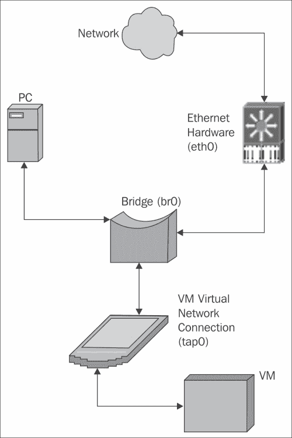

# 第五章 系统管理

除了配置各个软件包外，管理员还负责管理系统上各种服务的启动和停止，管理网络连接，维护文件系统，管理系统日志，并配置系统面向用户的界面。

# 启动与关闭

正确启动和关闭服务，对于系统功能和实现其目的至关重要。尽管 Unix `init` 脚本（也称为 System V 或 SysV 脚本，因其起源于 Unix System V）有着悠久的历史，并且在某种形式上是所有 Unix 和 Linux 系统的通用脚本，它们的管理、顺序、启用、禁用方式以及首选脚本格式通常在不同发行版之间有所不同。Debian 启动和关闭脚本的主要关注点包括运行级别的目的、基于依赖的顺序以及可用于管理启动顺序的工具。

## Debian 运行级别

在 Debian 系统中，与几乎所有的 Unix/Linux 操作系统一样，提供了从 0 到 6 的运行级别，具体定义如下：

+   0: 系统停止

+   1: 单用户模式（维护）

+   2 到 5: 多用户模式

+   6: 系统重启

请注意，在 Debian 中，运行级别 2 到 5 是相同的。这与一些其他发行版不同，比如 RedHat、Fedora、SuSE 或 OpenSuSE，它们为这些运行级别中的某些级别指定了特定的用途。例如，这些发行版中的运行级别 2 通常定义为没有网络支持，3 为具有网络支持，4 为文件共享，5 包含显示管理器，而其他运行级别没有启用显示管理器。

在大多数 Debian 系统中，多用户运行级别之间没有区别，所有 `init` 脚本默认在 2 到 5 级别处于活动状态。这并不意味着不能为不同的运行级别定义自己的用途。然而，如果你确实选择这么做，切勿手动编辑运行级别目录中指向 `init` 脚本的各种链接。应该使用 `update-rc.d` 命令。这样做的原因是，Debian 现在默认使用基于依赖的启动顺序。

## 基于依赖的启动顺序

如前所述，这已经是 Debian 7 Wheezy 版本的默认设置。它是在 Debian 6 Squeeze 版本中引入的，尽管可以关闭该功能。现在它始终启用，尽管仍为遗留顺序（为启动和停止脚本分配特定编号）提供了相应的配置。因此，管理员不再需要确定 `init` 脚本的运行顺序。现在，这一任务由 `insserv` 工具处理。

### 小贴士

不应直接调用 `insserv` 工具。建议使用 Debian 提供的 `update-rc.d` 工具，它会调用低级别的 `insserv` 命令，作为管理 `init` 脚本的推荐接口。

`init` 脚本现在必须在一组特殊的头文件中列出依赖关系和默认值，同时描述脚本的功能、它提供的服务以及服务应该在哪些运行级别中处于活动状态。一个好的例子是启动 Apache 的脚本开头：

```
#!/bin/sh
### BEGIN INIT INFO
# Provides:          apache2
# Required-Start:    $local_fs $remote_fs $network $syslog $named
# Required-Stop:     $local_fs $remote_fs $network $syslog $named
# Default-Start:     2 3 4 5
# Default-Stop:      0 1 6
# X-Interactive:     true
# Short-Description: Start/stop apache2 web server
### END INIT INFO

```

各字段的含义相当直观。该脚本提供 apache2 服务。其他脚本可以将此服务作为先决条件。该脚本要求本地和远程文件系统被挂载，网络连接正常，且 `syslog` 和 named 服务在启动之前可用。同样，在该脚本关闭 apache2 服务后，这些服务不得被停止。apache2 应该在运行级别 2 到 5 中保持活动，当然，0、1 和 6 是它停止的地方。X-Interactive 字段表示，如果脚本以某种方式运行且终端可用与脚本进行通信，则脚本可能需要用户输入。还有其他可用字段，具体内容可以参考 `insserv` 手册页。

### 注意

这些头文件被称为 **LSB** 头文件，因为它们是在 **Linux Standard Base** 文档中定义的，该文档由多个 Linux 发行版在 Linux 基金会的组织架构下共同开发。

尽管依赖关系通常不会变化，管理员仍然可以修改脚本在哪些运行级别下处于活动状态。这不应通过编辑头文件来完成，而应使用 `update-rc.d` 来修改运行级别。例如，假设你希望 apache 仅在运行级别 4 和 5 下运行，而在 2 或 3 下不运行，命令 `update-rc.d apache2 disable 2 3` 就可以实现这一点。

### 提示

许多脚本在其 `/etc/default` 配置文件中提供了一个开关，用于定义服务是否应当运行。当你希望完全禁用某个服务时，应该使用这个开关，而不是通过 `update-rc.d` 禁用脚本在所有运行级别中的执行。

`update-rc.d` 的手册页还记录了 `start` 和 `stop` 选项，以及指定脚本启动或停止顺序的方式（使用传统方法为启动和停止链接分配数字）。然而，这些选项已被弃用，看来它们将在 Jessie（Debian 8）中被移除。

### 注意

如果你有本地开发的或第三方的 `init` 脚本，这些脚本没有包含必要的头文件，Debian 7 仍然会使用旧的脚本排序方法启动，但会通知你它无法迁移到基于依赖关系的启动序列的原因。

## 管理 SysV 脚本

`update-rc.d` 工具已经提到过，是管理 `init` 脚本的主要命令行接口之一。然而，还有几个其他工具，本质上是 `update-rc.d` 的前端，能够让管理员的工作变得更加轻松。主要的工具是 `bum` 和 `sysv-rc-conf`。

启动管理器（`bum`）是一个图形化应用程序，用于管理 `init` 脚本。它需要窗口管理器来运行，并提供一个友好的界面，展示正在运行的服务和启用的脚本。在高级模式下，它还允许你调整各个运行级别和运行顺序。

### 提示

如 `update-rc.d` 的启动和停止命令所提到的，调整脚本的顺序并不推荐。

还有一个名为 `sys-rc-conf` 的工具。它使用 curses 库提供全屏文本界面。在默认模式下，它不会修改脚本顺序，尽管在命令行上使用特定选项可以允许这一点，如果你真的需要这个功能。

这两个工具基本上是不言自明的。选中你需要的服务，取消选中不需要的服务，你可以为同一个脚本设置或取消不同运行级别的勾选标记。

### 提示

经常需要手动执行一个 SysV 脚本，可能是为了检查状态，或是重新启动某些需要的服务。虽然 `/etc/init.d` 中的脚本可以手动执行，但推荐使用 `invoke-rc.d` 命令，这样可以确保系统策略和运行级别的约束条件得到满足。

## 第三方和本地脚本

非 Debian 的第三方包通常不提供用于启动和停止其软件后台进程的 SysV 脚本，你可能需要自己编写。即使提供了此类脚本，也可能需要修改它们以遵循 Debian 标准，特别是如果它们使用了其他发行版中的预打包功能，而这些功能与 Debian 中的不同。

编写 `init` 脚本本身就是一个完整的主题。然而，Debian 的 `initscripts` 包包括一个 `/etc/init.d/skeleton` 脚本，可以根据需要复制并修改。此类脚本的要求在 *第九章*，《操作系统》部分的 *Debian 政策手册* 中有详细定义（可以通过 Debian 包和 [`www.debian.org/doc/debian-policy/`](http://www.debian.org/doc/debian-policy/) 获得），以及 *第二十章*，《系统初始化》部分的 *Core Linux System Base 标准*（可以通过 [`refspecs.linuxfoundation.org/lsb.shtml`](http://refspecs.linuxfoundation.org/lsb.shtml) 获取）。后者还提供了 `/lib/lsb/init-functions` 中的一些标准功能，以帮助编写脚本。

## 网络管理

网络访问是任何系统的基础，不论是为了允许其他人使用其服务，还是为了允许用户访问其他系统上的服务。设置和控制网络有两种主要方式：静态的 `/etc/network/interfaces` 文件和更动态的网络管理器。

## 接口文件

这是在 Debian 系统上设置网络的传统方法。它涉及到 `/etc/network` 中的一系列文件。基于 RPM 的系统，如 RedHat Fedora 和 SuSE Linux，使用 `/etc/sysconfig/network` 中不同的布局，并由它们自己的工具进行管理。

`/etc/network/interfaces`文件可能是最简单的启动和运行网络的方式。虽然必须手动编辑它，但它易于理解，并且大多数情况下只需要最少的配置行即可应对大多数情况。事实上，Debian 安装过程中会为你设置这个文件。如果你使用与安装时相同的网络配置，网络会立即生效，并且只需最少的调整。实际上，最简化的接口文件通常对于大多数不属于集群的服务器来说已经足够了。即使你使用其他网络配置方法，如 Network Manager，通常也会在接口文件中保留本地回环接口的配置，以保持其他配置简洁，因为它只需要基本配置，并且通常不需要修改。

接口文件虽然可以非常简单，但也提供了许多选项来进行更复杂的配置。你可以配置有线、无线、**VLAN**（**虚拟局域网**）和桥接接口、IP 隧道以及**点对点**（**PPP**）接口。每个接口可以配置为使用 DHCP 或静态 IP 地址，支持 IPv4 和 IPv6，同时也支持 Novell 的 IPX 协议。一个简单的接口文件如下所示：

```
# This file describes the network interfaces available on your
# system and how to activate them. For more information, see
# interfaces(5).

# The loopback network interface
auto lo
iface lo inet loopback

# The primary network interface
allow-hotplug eth0
iface eth0 inet static
 address 192.168.3.52
 netmask 255.255.255.0
 gateway 192.168.3.1

```

以`#`开头的行是注释，当然。其他行的目的如下：

+   `auto lo`：每当运行`ifup`并带上`-a`选项时，`lo`接口会被激活，就像系统初始化时一样

+   `iface lo inet loopback`：这定义了基本的回环接口；地址始终是`127.0.0.1`或 IPv6 的`::1`

+   `allow-hotplug eth0`：如果以太网 0 可用且已插入，它会被激活

+   `iface eth0 inet static`：这定义了以太网 0 为一个具有静态 IP 地址的接口

+   `address`、`netmask`和`gateway`：这些分别定义了以太网 0 的地址、子网掩码和默认 IP 网关。

简单明了。这个文件实际上是在 Debian 安装过程中设置的，并且按原样工作。当然，还有许多其他选项可用，这些选项在接口手册页中有详细记录，允许你处理更复杂的配置。有关设置接口文件的详细信息可以在接口手册页中找到。它包括设置 IPv6 和许多其他协议的信息。

除了接口文件外，`/etc/network` 目录下还有许多相关的脚本。特别是，子目录 `if-pre-up.d`、`if-up.d`、`if-down.d` 和 `if-post-down.d` 包含当接口启动或关闭时自动运行的脚本。此外，还可以在接口文件中指定特定脚本，以便在某个接口启动或关闭时执行（这在配置桥接时尤其有用）。使用 `/etc/network/interfaces` 文件的主要缺点是没有办法配置**虚拟专用网络**（**VPN**）。然而，通常可以使用命令行工具来配置这些。

### 注意

详细信息和示例可以在第五章，Debian 参考手册的 *网络设置* 部分找到（[`www.debian.org/doc/manuals/debian-reference/ch05.en.html`](http://www.debian.org/doc/manuals/debian-reference/ch05.en.html)）。

## Network Manager

尽管 `/etc/network/interfaces` 配置非常灵活，许多管理员更喜欢使用图形化界面来配置网络，以便在更动态的网络环境中使用。Network Manager 最常用于管理无线连接。它由一个后台进程组成，负责实际的连接管理，并且有一个命令行工具和一个图形化工具，允许你配置和控制已管理的连接。

图形化工具显示可用的接入点，并提供菜单和简单的方式来配置连接。它也可以用于有线连接，并且还可以管理到私有网络的 VPN 连接。Network Manager 的主要缺点是它不支持桥接、VLAN 或 IPX 协议。当然，可以使用命令行工具来补充 Network Manager，以配置这些选项，或者可以使用接口文件手动配置它们，同时 Network Manager 处理其余部分。

还有其他一些软件包提供了用于网络配置的 GUI 界面。其中一个主要的就是 `wicd`。一些用户更喜欢它，因为它以不同的方式处理无线连接，这可能使某些无线网卡的性能更好，但它的功能较少。

## 合并方法

可以结合使用接口文件和 Network Manager 的网络配置方法，每种方法负责配置的一部分。这个技巧可能会在需要某些只有其中一个方法支持的功能时使用。例如，Network Manager 不支持网络桥接，而接口文件通常不能用来配置 VPN 连接。如果你需要两者，你可以使用接口文件来设置桥接，并使用 Network Manager 配置 VPN 连接。

对于不熟悉网络桥接的人，一个很好的例子是一个开发系统，该系统运行一个或多个需要直接访问网络的虚拟机（这意味着它的连接必须表现得像是一个具有直接网络连接的实际接口）。基本设置看起来像以下图示：



请注意，主机现在使用**br0**而不是**eth0**作为其主要接口。桥接接口使用 eth0 连接到实际网络。**虚拟机**（**VM**）将设置自己的网络接口（或者你可以自行设置）。这些通常被设置为 tap 或隧道接口（因此命名为**tap0**）。

要设置它，基本的接口文件可能看起来像以下列表（假设硬件以太网卡是 eth0）：

```
# TAP setup
auto tap0
iface tap0 inet manual
 pre-up /usr/sbin/tunctl -t tap0

# Bridge setup
auto br0
iface br0 inet dhcp
 bridge_ports eth0 tap0

```

这通过`tunctl`命令设置一个 TAP 设备来创建设备。它必须出现在桥接之前，否则当桥接设备初始化并尝试将其连接到桥接时，设备将不会存在。桥接设置创建桥接接口，并使用 DHCP 获取 IP 地址。`bridge_ports`行表示它将流量桥接到实际接口（eth0）和 tap0 接口，虚拟机将使用此接口。我已省略了环回条目以保持清晰。在这个例子中，VPN 和无线连接由 Network Manager 处理。

有关网络桥接的更多信息可以在`bridge-utils`包中找到，网络 tap 和隧道接口由`uml-utilities`包涵盖。

## 哪种方法？

Network Manager 会随 GNOME 窗口管理器自动安装。它在笔记本电脑环境中特别有用。对于服务器，接口文件可能是最佳且最灵活的选择。当然，如果你需要某些仅在其中一个中可用的功能，可以使用提供这些功能的任何方法，必要时结合这两种技术。

### 提示

不要尝试使用两种方法同时控制相同的接口。虽然 Network Manager 会拒绝管理在接口文件中定义的连接，而`ifup`命令如果尝试设置已由 Network Manager 控制的接口则会生成错误，但仍然可以绕过这些保护。

# 文件系统维护

文件系统维护分为两种类型：分区维护和内容维护。前者包括定期检查文件系统的底层结构和元数据、修改分区布局以及低级备份。后者涉及监控和控制文件使用的空间以及文件备份和恢复。

## 分区维护

尽管现代日志文件系统非常坚韧，但它们偶尔也会遭遇底层基础设施的错误。原因有很多，包括电力波动、硬件故障以及某些类型的内核故障。虽然在 Debian 稳定版中极为罕见，但确实发生过，尤其是当安装了不属于 Debian 的第三方内核模块，或内核因某些原因被本地修改时。

### 文件系统检查（FSCK）

维护涉及运行**文件系统检查程序**（**FSCK**）。如果系统经常重启，例如笔记本电脑或工作站，或者分区频繁卸载和挂载，通常会自动进行此操作。EXT3 和 EXT4 文件系统默认在每 39 次挂载时进行检查，除非另有要求。可以使用`tune2fs`工具更改这一设置，该工具还可以设置时间依赖的检查间隔，而不是基于挂载次数。

### 提示

尽管可以禁用定期检查，但不建议这样做。日志文件系统通常总是被标记为干净的，因此 Linux 不会识别出此类系统可能出现的问题。

如果系统始终在线且相关分区从未卸载，可能需要安排定期重启系统，可以通过`shutdown -rF`命令强制进行文件系统检查，或者使用`tune2fs`设置时间依赖的检查间隔，该间隔小于重启间隔。当然，如果发现问题，你必须能够访问物理控制台来回答有关如何解决问题的问题。

另一种方法是除非明显出现问题或有可能出现问题，否则永远不检查文件系统。通常，在可能导致文件系统基础设施错误的故障发生后，系统无论如何都需要重新启动（除非强制重启）。此时，你可以进入维护（单用户）模式手动运行 FSCK，或者通过设置较短的时间依赖检查间隔来强制执行检查。如果出现问题，仍然需要有人员访问物理控制台来解答相关问题。

### 注意

为了加速定期的文件系统检查，请使用 EXT4 代替 EXT3。在大多数情况下，EXT4 的检查速度是 EXT3 的 2 到 20 倍。

### 分区调整

如果需要更多空间，可能需要调整分区大小。要快速查看磁盘空间使用情况，请使用`df`命令。还有一个磁盘使用（`du`）命令，它汇总了文件和目录的空间。有关详细信息，请参阅手册页。

如果必须调整磁盘分区，操作流程相对简单，但有一些需要注意的事项。

### 提示

修改分区布局始终存在风险。在修改布局之前，确保你有当前的备份。

如果分区正在扩展，必须有足够的空间。如果你使用的是**逻辑卷管理器**（**LVM**），如果卷组中没有足够的空间，可以通过向卷组中添加物理卷来解决。 如果你没有使用 LVM，或者在同一逻辑卷上配置了多个分区，那么必须在要扩展的分区结束后，物理磁盘或逻辑卷中必须有空闲空间。如果没有，必须以某种方式创建。 如果分区要缩小，空间就不是问题，尽管你可能希望移动或扩展其他分区来利用缩小后腾出的空间。此外，有时需要移动分区。如果你使用 LVM 并为每个逻辑卷分配一个分区，则无需进行此操作。

移动或缩小分区只能在未挂载（离线）分区上进行，因为这需要移动文件，若文件正在使用中，可能会导致数据损坏。一些文件系统，特别是 EXT3 和 EXT4，在分区仍然挂载时也可以扩展，因为这只需要修改文件系统元数据，而无需移动任何文件。

虽然每种文件系统架构都有适当的工具用于调整大小，并且有一些简单的工具用于管理分区表，但管理分区的主要工具是`parted`。还有其他一些工具，大多是商业工具，但`parted`几乎可以完成所有必要的操作，提供一个易于使用的图形工具（`gparted`），并且是免费的。甚至还有一个可以引导的 Live CD 版本，你可以用它来管理分区，而不管安装了什么操作系统。许多 Windows 管理员成功地使用它。它支持扩展、缩小和移动分区，并能处理许多不同的文件系统架构，同时确保分区表与文件系统大小一致。

### 提示

不幸的是，`parted` 和 `gparted` 都无法扩展已挂载的分区。如果你必须在分区正在使用时扩展它，你必须删除并重新创建分区，确保起始位置完全相同，强制重新读取分区表，然后使用适当的文件系统调整命令。这是非常危险的，绝对不应当用于调整根分区的大小。

### 注意

修改分区布局的过程是简单直接的。请注意，如果你没有从`gparted` Live CD 或类似的工具磁盘启动，就无法卸载运行必要工具和操作系统服务所需的分区。

手动修改分区布局：

1.  确保有足够的空间用于扩展分区，或用于容纳正在移动的分区。如果需要，可以缩小或移动其他分区，或扩展逻辑卷。

1.  你必须确保分区表与调整大小或移动后的分区完全匹配。未能做到这一点可能会导致数据损坏或丢失。`gparted`会自动为你处理这一点。

1.  要缩小分区，它必须处于脱机状态（未挂载）。先调整文件系统大小，然后修改分区表以匹配新大小。

1.  要扩展分区，请首先修改分区表，然后扩展文件系统。如果正在处理挂载的分区，请使用前面概述的过程。

1.  要移动分区，必须首先创建一个与原始分区大小相同的新分区。然后必须卸载当前分区，精确复制数据到新分区，然后删除旧分区。

在所有情况下，在修改或移动分区之前，分区必须是干净的，并且在挂载之前应该进行检查。`gparted`工具或类似工具将自动处理上述步骤，包括必要的文件系统检查、数据移动和分区表修改。

请注意，可以在活动系统上使用`gparted`或手动程序，前提是要修改的分区可以卸载，或者如果必须修改挂载的分区，则只能扩展，不能使用`gparted`。

### 提示

除非必须在分区仍然挂载和使用的情况下扩展分区，否则建议的过程是从`gparted` live CD 启动。这极大地简化了整个过程，允许修改所有分区，而不仅仅是不需要操作系统服务和必要工具的那些分区，并减少了损坏的风险。

## 备份

通常情况下，备份分为两种类型：低级别镜像备份和文件级别备份。

### 低级别备份

低级别磁盘镜像或所谓的裸机备份，是完整分区甚至完整逻辑或物理磁盘的字节级复制。某些实用程序只包括备份中使用的扇区，从而减少备份和恢复操作的大小和速度，但并非总是如此。恢复此类备份时，需要一种媒体，如 live CD，以便启动软件来恢复映像。

如果需要快速复制或恢复系统，则全磁盘字节级备份非常有用，只要恢复的磁盘与原来的相同或更大。也可以执行此类分区备份，但为了恢复它们，您需要一些方法将分区信息恢复到磁盘分区表中。

低级别备份在两种情况下很有用：

+   当需要快速用相同硬件替换和恢复系统时

+   当需要在相同硬件上多次复制系统时

后者的一个很好的例子是当公司为工人提供预配置的系统，所有系统都具有相同或几乎相同的初始配置。在这种情况下，只需从标准化的副本中恢复磁盘，无论何时需要新系统或旧系统需要返回到其原始状态以供新员工使用，都非常容易。

### 文件级别备份

文件级备份可以像是将目录层次结构中的所有内容逐个文件复制一样简单，也可以是考虑到文件系统元数据结构的备份，并且不存储重复数据（通常称为**数据去重**）。恢复通常只需要一个最小化安装的系统，或者一个实时 CD。文件级备份无法恢复启动扇区或分区表，因此这些必须在恢复文件之前已经存在或创建。许多文件级备份工具提供仅备份自上次备份以来发生变化的文件的功能。

文件级备份在丢失或损坏单个文件或目录，或需要恢复到早期版本时最为有用，因为只需要恢复必要的文件。这是低级镜像备份无法实现的。

### 备份工具

有许多备份工具可用，范围从适用于单一系统的简单工具，到适用于管理多个生产系统和集群的复杂备份套件。

简单的实用程序通常提供文件级备份，将备份写入外部存储介质甚至远程网络位置。它们通常提供增量备份选项，在第一次完整备份后，仅复制发生变化的文件。大多数这些工具是命令行工具，可以通过脚本编写并通过 CRON 作业定期执行，尽管也有图形化前端可用。这些工具的缺点是，如果在完全磁盘故障后需要恢复，你必须有其他方式正确恢复分区信息，并正确重建启动扇区信息，以便系统可以正常启动。

较为常见的简单实用命令包括`rsync`和`tar`。这些实用程序常常用于更复杂的备份软件中，实际存储数据。如果你使用的是某种 EXT 文件系统，`dump`和`restore`命令尤为重要，因为它们理解并考虑文件系统的元数据，因此比简单的复制工具更快、更高效。当然，它们的缺点是恢复只能在相同的 EXT 文件系统上进行。而像`rsync`这样的其他工具则可以恢复到完全不同的文件系统类型，尽管如果文件系统类型差异过大，比如从 EXT4 文件系统备份到 NTFS 分区时，某些元数据（如文件所有权和权限）可能会丢失。

更复杂的备份软件有时能够进行所谓的裸金属备份。这些备份结合了对非文件系统结构（如分区表和启动扇区）的低级小规模备份（或至少能够重新创建的能力），以及对文件系统内容的文件级备份。许多都是多系统备份解决方案，可以从一个中心位置进行管理，并且能够将备份存储在不同位置的不同介质上。通常，这些多系统套件包括定义和控制备份计划、内容和位置的功能，并提供远程存档的支持。

### 选择你的解决方案

选择什么备份软件有一定的个人偏好，但也有一些指导原则。对于单个文件的快速和临时备份，标准的`rsync`、`tar`和`cpio`工具通常已足够。对于更常规的单个系统备份，最好选择一些可以配置和调度自动备份（包括全量和增量备份）的软件包。如果你有多个系统需要备份，最好选择一些提供中央控制、调度和存储的主要备份套件。我们将在第七章中进一步讨论，*高级系统管理*。

在所有情况下，如果你的备份解决方案没有自动处理，务必包括一张救援或实时 CD，里面包含必要的软件来格式化和分区磁盘，恢复文件，并重建启动信息。一些备份包，比如`Mondo`，会将创建这种可启动媒体作为其软件的一部分。

### 提示

不要忽视备份。即使是具有多路径**网络可寻址存储**（**NAS**）的最具韧性的虚拟机环境，也可能以意想不到的方式失败，从而导致数据损坏。我知道有一个这样的环境，其中 UPS 以某种方式被断开，导致 NAS 系统和虚拟机主机都断电。尽管 Debian 系统使用了非缓存的文件系统日志，但 NAS 系统却在缓存日志写入。当电力丧失时，日志不完整，磁盘最终严重损坏。教训已经吸取。

## 系统日志

系统管理员的另一个职责是管理系统日志。Debian 系统默认会记录信息，这些信息能够告诉管理员系统的使用情况，提供可能表明软件或硬件存在问题的警告和错误消息，甚至提供系统被攻击或滥用的早期迹象。

系统日志由`rsyslog`包处理，通常存储在`/var/log`及其子目录中。各种软件包，尤其是那些提供重要服务的软件，如 DNS、FTP、电子邮件和 HTTP（Apache），经常会进行大量日志记录，这些日志可能包括可以追踪活动并警告潜在问题或配置错误的条目。包文档中包含了如何配置日志记录内容和存储位置的信息。

### 日志设施

Linux 中的`rsyslog`系统日志设施提供了多种选项、设施和日志级别。这些选项控制消息记录时的行为，例如是否在无法将消息记录到文件时将其发送到控制台，是否在消息中包含**进程 ID**（**PID**）。这些设施提供了一种根据相关子系统将消息分配到不同区域的方式，例如 AUTH 用于授权消息，CRON 用于计划任务，KERN 用于内核消息。大多数使用系统日志的软件都提供配置项来控制它们使用的选项、文件和设施。此外，最重要的是日志消息的级别，它们决定了消息的重要性。

日志级别详细说明了哪些消息会被记录到系统日志中，这些消息可能很多。日志级别从 EMERG 开始，表示系统基本无法使用，到 ALERT（需要立即采取行动）、CRIT（关键）、ERR（错误）、WARN（警告条件）、NOTICE（正常但重要）、INFO 和 DEBUG。将日志级别设置为后面三种之一，可能会生成大量条目，占用大量磁盘空间，并且会增加系统开销。

因此，有一些指导原则，规定了应该记录哪些内容：

+   生产系统只应记录 EMERG、CRIT、ALERT、ERR 和 WARN 级别的日志。除非绝对必要，否则不应在生产系统上记录 NOTICE、INFO 和 DEBUG 级别的日志。

+   开发系统应记录前一点提到的级别，以及 NOTICE 和可能的 INFO 级别，以提供开发人员所需的信息。在必要时也可以使用 DEBUG 级别。

其目的是提供必要的信息，同时不对系统造成过多负担。特别是 NOTICE、INFO，尤其是 DEBUG 级别，可能会生成大量数据，这些数据在稳定的生产系统中通常是不必要的。

日志数据经常用于分析系统的使用情况、谁在访问它、执行了哪些活动，并通知管理员需要关注的事项。

### 控制日志

即使是生产系统的日志，最终也会增长到占用大量磁盘空间的程度，遵循前述指南的开发系统问题更为严重。管理员的职责之一是确定应该保留多少日志数据，并适当地管理这些文件。

所有的发行版，包括 Debian，默认提供一个或多个定期运行的任务，用来关闭当前的日志文件，标记其周期号，并为日志记录打开新的、干净的文件。在 Debian 中，这由`logrotate`包提供。虽然这个包主要处理日志文件，但它也可以用于任何其他不断增长并需要周期性处理的文件。该包提供了详细的文档，但基本的思路是：每个日志文件都会被检查，如果它超过了某个大小，就会关闭。然后，所有日志文件的周期会被重命名，如果需要，超出一定年龄或周期号的日志文件会被删除。接着会创建一个新的日志文件继续记录。

你可以配置保留多少个周期，甚至配置周期的最大年龄，超过该年龄的日志会被删除。这里的主要选择是你希望保留日志条目的时间。每个软件包安装时的默认值反映了许多管理员的经验，通常在大多数情况下是合适的。

### 日志监控

那么，管理员是否需要每天逐一查看所有日志条目呢？那将是一个非常繁琐的任务，实际上并不必要。Debian 中有许多软件包可以扫描日志中的特定条件，并通过邮件将结果发送给管理员以便进一步检查和处理。最常见的是`logcheck`，它会检查最新的日志周期，并与一个管理员可能感兴趣的条目数据库进行对比。然后，它会将重要的条目通过邮件发送给管理员进行进一步检查。还有一些软件包可以执行各种分析任务，比如邮件统计或 HTTP 访问统计，这些任务使用系统日志，通常会与其他信息来源结合使用。你可以通过 Debian 的包管理搜索功能找到它们。

### 小贴士

你使用什么软件包来检查日志，或者是否使用自己的基于字符串搜索的脚本并不重要。关键是要定期检查日志。日志可以及时警告你即将发生的硬件问题、软件不稳定、编程问题和系统攻击。

# 显示管理器

与开发服务器不同，普通服务器通常不需要显示管理器。当然，开发服务器以及那些提供登录到受管显示环境的服务器需要显示管理器和窗口管理器。前者负责 X-Windows 显示环境及其所需资源的创建和安全性，而后者则负责呈现给用户的实际桌面环境。

有几个主要的桌面环境，每个环境都有其关联的显示和窗口管理器。两个主要的环境是 GNOME 和 KDE。它们都支持多种图形工具包库，因此在一个环境中运行的绝大多数应用程序也能在另一个环境中运行，只要必要的服务已安装。这些服务通常会在安装应用程序时作为依赖项自动安装，前提是你没有安装 GNOME 或 KDE 的基础元包。所以，例如，如果你喜欢 `KcacheGrind` 工具来浏览程序性能数据，但正在使用 GNOME，你可以继续安装并在 GNOME 下使用它，它会正常工作。同样，如果你更喜欢 KDE 附带的 **K Display Manager** (**KDM**) 而不是 GNOME 提供的 **GNOME Display Manager** (**GDM**)，它也会同样有效。

鉴于这种互操作性，为什么要选择一个而不是另一个呢？这主要是个人喜好的问题。如第一章所述，KDE 通常更受欧洲用户的青睐，而 GNOME 则更多是美国用户的偏好。本节的主要关注点将是在哪里找到每个桌面环境的配置文件或应用程序。

## 我的桌面去哪儿了？

GNOME 和 KDE，像新版本的 Windows 8 一样，都放弃了传统的桌面隐喻，采用了更注重活动或任务导向的界面。这需要一些适应，刚开始可能会让人不太习惯。要涵盖从旧界面到新界面的变化，每个桌面管理器至少需要一本书！然而，KDE 和 GNOME 的官方网站提供了教程和文档，帮助你快速上手。如果你更喜欢传统的桌面隐喻，GNOME 和 KDE 也提供了相应的设置方式。

## GNOME

Debian 7 中当前的 GNOME 版本是 3.4。如果安装 `gnome` 元包，所有主要的 GNOME 应用程序以及窗口和显示管理器都会被安装。配置过程相当简单，因为用户菜单提供了一个“系统设置”应用程序，可以访问工作区的主要设置，以便更改其外观和感觉。

如果你不想使用默认行为，修改 GNOME 登录屏幕 GDM3 需要以 root 用户身份手动编辑 `/etc/gdm3/greeter.gsettings` 和 `/etc/gdm3/daemon.conf`，然后执行 `dpkg-reconfigure gdm3` 命令。

### 注意

其中一个原因是 GDM 正在更完全地集成到 GNOME 中，并从旧版 GNOME 2 使用的 `gconf` 设置框架迁移到新的 `dconf` 设置框架。到某个时刻，GNOME 控制中心应该会提供适当的工具，但目前没有官方的 GDM3 设置工具。虽然有一个名为 `gdm3`setup 的非官方工具存在，但它尚未被加入到 Debian 中。

## KDE

当前 Debian 7 的 KDE 版本为 4.8.4。`kde-full` 元包将提供所有 KDE 应用程序以及窗口和显示管理器。KDE 用户环境提供了一个与 GNOME 类似的系统设置应用程序，但它更为全面，因为它包括配置 KDM 的功能，KDM 是负责登录屏幕的显示管理器。事实上，由于这一点，一些管理员会使用 KDM 作为显示管理器，尽管默认会话可能是 GNOME。

## 其他桌面

XFCE 和 LXDE 是最常见的 KDE 或 GNOME 替代品，尽管也有其他选择。它们都没有提供用于登录屏幕的显示管理器，尽管 LXDE 推荐使用 LightDM 这一轻量级显示管理器。XFCE 和 LXDE（以及 LightDM）保留了传统的桌面隐喻，旨在减少对系统的负担，因此它们适合老旧硬件。

### 注意

在*Linus Torvalds* 放弃 GNOME3 期间，他使用了 XFCE。

和 GNOME 及 KDE 一样，XFCE 和 LXDE 也提供了一个系统设置应用程序，用于控制外观和感觉。LightDM 还提供了一个图形化设置工具。

## 展示你的最佳形象

花时间至少了解一下你选择的显示管理器的设置。除非你在运行一个永远不会显示图形登录的服务器，否则这是用户首先和最后看到的内容。你可能还想了解适合用户桌面的背景。它们不需要过于花哨，但确实会留下印象。

# 总结

管理员的任务繁多，包括负责系统提供的服务（特别是如何启动和关闭它们）、网络配置、系统备份、文件系统空间管理、系统操作（系统日志）以及提供系统对外展示的界面。我们已经涵盖了这些领域中的一些问题，尽管对任何一个主题的全面覆盖可能需要几本书的篇幅。这里没有涉及的一个主题是基础的系统安全性，我们将在下一章详细讨论。
