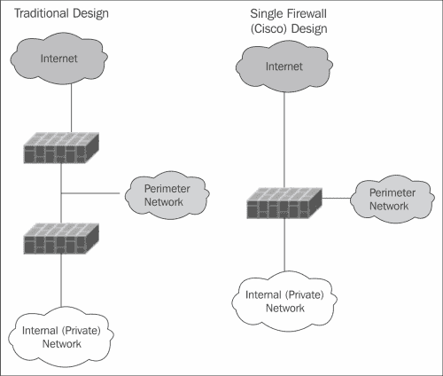

# 第六章 基本系统安全

系统管理员执行的最关键任务之一是设置和监控系统安全性。Debian 在这方面提供了一些帮助，有专门的包来帮助加固系统，但这仅仅是个开始。特别是，你必须关注如何设置 root 账户、如何阻止对系统的不当访问，以及如何监控系统的安全问题。

# 用户管理

首要考虑的事情之一是如何设置用户组以及如何管理 root 账户。虽然这一点可以随时更改，但最好在安装后立即进行更改，因为此时更改的影响较小。两个基本问题是如何设置默认的用户组分配，以及是否应禁用 root 账户。

## 默认用户组

传统上，有两种方式来设置分配给新用户的默认组。第一种是将每个人分配到一个单一的用户组。这将允许系统上的所有用户访问具有组读取（和执行）权限的文件和目录，并对具有组写入权限的文件进行写入。

另一种方式是为每个用户提供他自己的组，通常与他的用户 ID 同名。这是 Debian 中的默认设置，这种方案通常被称为用户私人组。如果用户 A 希望其他人通过组权限访问某些文件或目录，那么具有系统权限的人员需要将适当的用户 ID 添加到用户 A 的组中。

### 注意

曾经，单一用户组是常见的做法。然而，目前的最佳实践是使用用户私人组。

这类似于处理开发者互相访问彼此文件的最常见方法。然而，在这种情况下，会创建一个新的组，例如 `web-dev` 或者你认为合适的组名，并根据需要将开发者分配到该组中。一种类似的技术也用于一些管理任务。例如，一个 `ftpadmin` 组被允许以普通（尤其是匿名）FTP 用户无法执行的方式修改 FTP 服务器目录和文件。谨慎创建和分配组可以促进正确的用户访问文件，同时防止不必要的访问或修改。

用户和组的维护由标准的命令行功能处理，如 `useradd`、`usermod`、`userdel`、`groupadd`、`groupmod` 和 `groupdel`，这些都记录在 `passwd` 包中。当然，也有可用于用户和组维护的图形界面工具。

## ACLs

虽然传统的用户/组/全局权限结构对许多系统来说足够用了，但有时需要更精细的控制。这可以通过使用**访问控制列表**（**ACL**）来处理。ACL 是通过在各种文件系统中使用扩展属性实现的，通常在 Debian Linux 中使用的 EXT 文件系统默认支持 ACL。详细信息可以在 Debian 的`acl`软件包中找到。特别地，查看`getacl`、`setacl`和`chacl`命令的手册页。

虽然 ACL 非常有用，但也有一些需要注意的问题。例如，大多数图形文件管理器不支持 ACL，有些工具（例如 EMACS）在更新文件时会清除文件的 ACL 列表。这可以通过为目录设置默认 ACL 来部分解决，但如果丢失了非默认的文件 ACL，它们仍需要被重新构建。另一个问题是性能。在某些文件系统中，ACL 的存在会延迟初次访问文件，因为需要额外的访问验证。由于这种延迟仅发生在初次访问时，因此在实际操作中其影响通常是最小的。最后，使用 ACL 时还有备份问题。现在大多数备份工具都能识别 ACL。在 Debian Linux 中，`rsync`和`tar`都可以通过特定的命令选项识别并备份 ACL，前提是你使用了正确的命令选项。EXT 备份工具的 dump 和 restore 也能处理 ACL。然而，有些工具可能无法正确识别或处理 ACL，因此在使用访问控制列表时，请始终查看软件包文档和手册页。

请注意，如果你使用 ACL，并不要求在所有文件和目录上都使用它们。完全可以仅在需要的文件和目录上设置 ACL。合理使用文件 ACL 和为某些目录设置的默认 ACL 有助于简化 ACL 管理。

## root 账户

系统的 root 访问权限是一个严重的问题。任何知道 root 密码的人都能造成巨大损害，知道它的人越多，密码落入错误之手的风险就越大。为避免这个问题，`sudo`软件包提供了在不需要 root 密码的情况下运行命令的能力，用户只需输入自己的密码并获得适当授权即可（如果需要，还可以运行带有完全 root 权限的 shell）。其优点在于，授权的命令会记录下用户的 ID，从而提供实际执行命令的审计记录。

当在系统上使用 `sudo` 时，管理员密码的唯一用途是在系统启动到维护（单用户）模式时。大多数 Linux 发行版，包括 Debian，都需要 root 密码才能在单用户模式下提供 root shell 提示符。然而，有几种方法可以通过物理控制台访问来绕过此要求。因此，许多管理员完全禁用 root 密码。这样做后，启动到维护模式或单用户模式时不再提示输入 root 密码。

通过完全禁用 root 密码，除了通过 `sudo` 以外，其他任何提供 root 特权的程序（也称为 **setuid** 程序），或通过启动到单用户模式，均无法访问系统的 root 权限。请注意，由于启动维护模式不再需要密码，因此必须以其他方式控制对系统控制台的物理访问。这可以通过物理手段、要求通过 **BIOS** （**基本输入输出系统**）或 **UEFI** （**统一可扩展固件接口**）进行系统启动时要求密码，或者通过对 GRUB 或其他系统引导加载程序进行密码保护来实现。

### 注意

最佳做法是完全禁用 root 账户登录。**Ubuntu** 现在默认如此，Debian 也在朝这个方向发展。确保要么限制物理访问控制台，要么对启动过程进行密码保护。

`/etc/sudoers` 文件和 `/etc/sudoers.d` 目录中的文件是配置 `sudo` 访问权限的地方。详细信息请参见 `sudo` 包的文档。简而言之，命令的访问权限可以按个别用户、组成员，甚至列表来允许或限制，并且可以根据用户访问系统时的远程主机来允许访问某些命令。

# Debian 硬化软件包

Debian 提供了多个软件包，帮助管理员确保系统安全。这些都是元包，包括：

+   `harden`：此工具安装 harden-environment 和 harden-servers。

+   `harden-clients`：此工具防止安装可能暴露关键信息或允许未经授权访问您系统的软件客户端。

+   `harden-environment`：此工具安装入侵检测工具。

+   `harden-nids`：此工具安装网络入侵检测工具。

+   `harden-servers`：此工具防止安装可能不安全且可能允许未经授权访问您系统的服务。

+   `harden-tools`：此工具安装增强和分析系统安全性的工具。

还有其他硬化软件包，可以安装工具来远程分析或审计系统，并帮助开发人员创建更安全的程序。可以通过在软件包缓存中搜索 "harden" 来找到这些软件包。一个方法是使用命令 `apt-cache search harden`。

安装这些软件包仅仅是一个开始，不能自动让你的系统变得安全。它们只是用来安装一组与安全相关的软件包，或者防止某些潜在存在安全问题的软件包被安装。特别是，如果你安装了`harden-environment`、`harden-nids`和`harden-tools`，你还需要参考相应的软件包文档，并进行正确配置，以检测和分析安全问题，发出正确的警告或采取必要的措施。

### 注意

需要注意的是，某些软件包会阻止安装某些服务，例如 FTP 服务器。如果你的服务器必须提供 FTP 服务（例如），首先安装适当的硬化软件包。安装完成后，再安装 FTP 软件包并确认你希望删除硬化软件包。这样，你至少可以知道除了 FTP 之外的不安全服务并没有被安装。为了保持这种确认，可以定期测试如果安装了`harden-servers`会移除哪些内容。举例来说，可以通过运行`apt-get –dry-run install harden-servers`来执行此操作，并检查输出，看看会做出什么改变。

# 防火墙工具

硬化软件包提供的一个缺失功能是通过防火墙保护系统的工具。这个缺失反映了它们在确保系统安全方面的重要性，因为简单搜索 Debian 软件包会显示很多用于构建防火墙的工具。它们从简单到复杂，从命令行到完整的图形界面不等。几乎所有这些工具都是**IPTABLES**的前端，**IPTABLES**是 Linux 内核的防火墙模块及其相关命令，并生成相应的配置文件。有些提供了一种简单的配置语言，比标准的`iptables`命令更易读，工具随后将其翻译为适当的命令。有些则提供了一种定义防火墙策略的方法，之后将这些策略转化为适当的`iptables`配置命令。

### 提示

即使你的系统已经在防火墙后面，提供一个额外的防火墙也是一种良好的实践。这种多层防护方法可以在第一个防火墙被破坏的情况下提供额外的保护。

当然，由于防火墙软件包种类繁多，很难推荐某个特定的包。每个包都有自己的优缺点。然而，如果我们只关注较为流行的包，还是可以提出一些一般性的建议。

首先，对于不需要极其复杂配置的桌面和开发系统，**firestarter**（用于 GNOME）或**guarddog**（用于 KDE）是很好的起点。它们面向初学者，但也有适合更有经验用户的高级选项。两者都是图形化应用程序。一个特殊的情况是**fireflier**，它实际上会分析系统上应用程序的流量并推荐规则。Mason 是一个类似的应用程序，但它没有图形界面。

对于需要更强保护的服务器或系统，可以考虑**fwbuilder**。它类似于许多企业级防火墙管理系统，不仅可以为 Linux（包括 IPTABLES 和 IPCHAINS 规则）提供配置，还支持 BSD、Mac OS/X 和 Cisco 访问控制列表。多个服务器的配置可以集中存放，并根据需要远程安装。有关更多信息，请参考[`www.fwbuilder.org/`](http://www.fwbuilder.org/)。

一个流行的替代方案是**Shorewall**，它也可以在一定程度上处理流量整形和 IPsec。Shorewall 使用文本配置文件，而不是图形界面。更多信息可以在[`shorewall.net/`](http://shorewall.net/)找到。

在所有情况下，对于 Debian Linux，防火墙软件包通过生成 IPTABLES 规则来控制流量，这些规则由内核模块用于识别、分析和控制网络流量。

## IPTABLES

IPTABLES 是取代旧的 IPCHAINS 代码的通用名称，实际上它是一组内核模块和应用程序，用于定义和控制 Linux 内核防火墙。它包括用于提供 IPv4、IPv6、ARP 和以太网帧数据包过滤的模块和应用程序，以及一些数据包的有状态检查。根据数据包的特征（如协议、源地址和目标地址），以及数据包如何被处理（例如，是否刚进入系统、是否被转发、是否正在出口到网络、是否需要地址转换（例如**网络地址转换**或**NAT**）、是否与已建立的连接相关），有许多过滤选项。关于 IPTABLES，有许多优秀的书籍，或者你可以从[www.netfilter.org](http://www.netfilter.org)网站上的文档开始，这是 IPTABLES 代码的主页以及许多相关项目的资源。

### 注意

有一个项目**NFTABLES**，它计划在内核中替代 IPTABLES。它仍在开发中，并且在撰写本文时，Debian 尚未提供官方支持（无论是 Debian 7 还是 Debian 8 的测试版本）。不过，兼容性软件包正在开发中，一旦代码成为官方 Linux 内核的一部分，预计官方 Debian 软件包也会跟随发布。

由于大多数防火墙软件提供了定义防火墙并输出适当的 iptables 配置命令的方式，因此不需要了解 iptables 的所有细节，但一位优秀的管理员应该理解一些基本原理，原因有两个。首先，它有助于理解防火墙配置软件的功能，因为功能会基于可以用 IPTABLES 做的事情；其次，如果你使用像 fireflier 或 mason 这样的工具，这些工具会提出规则，并期望你根据特定环境进行修改或删除。

当然，除了理解什么是可能的，还需要弄清楚防火墙所需的内容。

## 基本防火墙设计

关于构建防火墙，有许多书籍和大量互联网建议。经典的著作是*《构建互联网防火墙》*，作者是*Elizabeth D. Zwicky*、*Simon Cooper* 和 *D. Brent Chapman*，出版方是*O'Reilly Media*。然而，对于我们当前的目的，我们将涵盖一些基本的设计原则。

### 入站连接请求

任何时候，如果有人能连接到系统，系统就有可能通过该连接受到攻击。这并不是指一般的入站流量，尤其是因为其中很多与本地系统建立的连接有关。它指的是远程系统请求与本地服务建立新连接。这通常被称为入站连接请求，因为它涉及远程系统向特定 IP 端口发起的初始连接请求。

当然，如果你的系统是一个为远程用户提供服务的服务器，你必须允许服务器提供的服务请求。只是不允许任何其他的入站请求，如果可能的话，限制请求的源地址，除非该服务是面向所有人的。

### 提示

限制入站请求（连接）仅限于为远程客户端提供特定服务所必需的请求。除非是与已建立连接相关的流量，否则不要允许任何其他入站流量。

### 出站流量

一般来说，出站流量是合法的，许多管理员不会限制从本地系统发起到远程系统的流量。不幸的是，有些情况下这并不可取。一个常见的例子是公司希望限制员工可以使用的外部服务（例如，防止在工作时间使用 YouTube，因为这不合适）。另一个例子是系统被攻击后，开始联系远程指挥与控制系统获取指令，并安装更多恶意软件。

这两种情况可以通过至少进行日志记录来处理，在许多情况下，还可以限制出站流量。在大多数情况下，限制出站连接请求（请求新连接）就足够了。

### 提示

在个人系统上，除非公司政策要求，否则不需要限制出站连接。在服务器上，出站连接应仅限于服务器正常运行所需的服务。只有当流量与已建立的连接相关时，才应允许出站流量。

### 本地回环流量

大多数管理员不关心本地回环接口上的流量。这是因为此类流量通常对于本地系统的正常运行是必需的。分析这些流量以确定哪些是必需的，哪些可以安全地阻止而不影响正常操作也相当困难。防火墙保护回环流量的主要原因是，如果恶意软件通过病毒或蠕虫安装在系统上，那么该软件可以通过未保护的回环接口进一步攻击本地系统。这可能会导致一次小规模的入侵通过这个漏洞发展成一次严重的系统接管。

这里的主要权衡是，妥协的可能性及其可能造成的损害，是否值得花费额外的时间和精力来分析并为回环接口创建一个合适的防火墙。

### 提示

如果一个系统经常受到严重攻击，考虑将本地回环接口也进行防火墙保护。

### 外围网络

保护私有网络而仍能为公众互联网提供服务的最重要方法之一是使用外围网络。通常称为**非军事区**（**DMZ**），它是攻击者和内部网络之间的缓冲区。

在前面的图示中，给出了两种架构。传统的设计使用两台防火墙，外围网络位于它们之间。原因是，如果直接暴露于互联网和攻击中的外部防火墙被攻破，攻击者仍然必须通过内部防火墙才能访问内部网络上的系统。经验表明，防火墙被攻破的情况足够罕见，以至于可以合理地安全使用单一防火墙，如右图所示。对于高安全环境，双防火墙架构仍然是首选。

在所有情况下，只有外围网络上的系统可以从互联网访问。这些服务器不能通过防火墙访问内部服务器。内部服务器可以连接到外围系统，从而允许双向通信，但外围上的服务器永远不应能够发起与内部系统的连接。这可以防止被攻破的服务器进一步危及你的内部网络。

### 提示

无论你多么小心，任何连接到互联网的服务器都将会遭遇攻击，而且攻击会频繁发生。迟早，这些攻击中的一次会成功。任何允许外部访问的服务器都不可能完全免受入侵。任何系统的最佳实践（不仅仅是 Debian）是将互联网服务器放置在边界网络上，以便在互联网服务器被攻破时保护内部系统和数据。

所以，现在你的系统已经正确配置了防火墙。如前所述，你仍然会遭遇攻击，并最终可能会被攻破。接下来的部分将讲解如何尽早检测到这些攻击尝试和任何已发生的入侵。

# 入侵检测

Debian 包括多个入侵检测应用程序。它们可以分为三大类：**网络入侵检测系统**（**NIDS**）、文件监控和系统扫描。前者通过扫描网络流量，检测发现并利用已允许的网络连接的攻击企图。后者则通过扫描已知的干净系统，然后监控其中文件的新增、删除和修改。

## NIDS

网络入侵检测基本上涉及监控网络接口，分析所有捕获到的数据包，并在检测到特定攻击特征时提供警报。在 Debian 系统上，主要工具是**Snort**。如果你安装了前面提到的`harden-nids`，Snort 将会被安装。Debian 上也有其他相关的软件包。

Snort 可以与名为 `fwsnort` 的软件包配合使用，不仅可以检测潜在的攻击，还能在检测到攻击时，通过添加 IPTABLES 规则动态地阻止它们。

有一点需要注意的是，NIDS 只能分析它们实际看到的流量。它们会看到所有监控接口上的流量（事实上，Snort 会在 IPTABLES 之前看到流量，确保所有流量都被分析）。然而，如果你的系统由外部防火墙保护（例如，如果它在边界网络上），它只会看到通过外部防火墙允许的那些数据包。因此，除非运行在外部防火墙上，否则 NIDS 的作用可能有限。尽管如此，它仍然有助于检测那些能够突破外部防火墙的攻击尝试。

## 文件监控

第二层入侵检测涉及监控系统上的文件。有几款优秀的文件监控工具能在文件新增、删除或修改时发出警报，通常会过滤报告，只包括那些表明潜在安全漏洞的变化。最常用的文件监控工具是**Tripwire**，它是由`harden-environment`包安装的。不过，Tripwire 现在属于一家商业企业，并出售专有版本。虽然开源版 Tripwire 仍然可以使用，但许多管理员正在转向**AIDE**（**高级入侵检测环境**）或**Samhain**作为替代方案。

### 提示

小心配置文件监控工具，以捕捉重要变化，并尽可能过滤掉误报，而不漏掉真实的正面指示。

过滤结果的重要性无法过分强调。含有过多误报的警报或报告，顶多会被快速浏览，最糟糕的情况是被忽视，这可能导致错过真正的已感染文件的指示。

## 系统扫描器

系统扫描器包括检查是否可能安装或激活了 rootkit 的包，以及病毒扫描器。`rkhunter` 和 `chkrootkit` 是两个最常用的 rootkit 检测包。`Tiger` 包是一个更全面的扫描器，它结合了 `chkrootkit` 和 Tripwire 或 AIDE，以及它自己的脚本，来对系统进行全面的安全审计。在首次审计清洁系统后，`Tiger` 会提醒你系统漏洞的变化。

`Tiger` 唯一缺少的主要功能是病毒扫描，这可以通过 `clamav` 包来处理，后者还提供对电子邮件的实时扫描功能。

### 提示

最佳实践是设置定期的系统安全审计。

# 关于远程日志记录的最后说明

一个有经验的黑客一旦突破系统，最先做的事情之一就是尝试抹去所有系统被攻破的痕迹。这包括删除日志文件中的条目、隐藏文件和网络连接，以使其无法通过常规工具显示等等。他们甚至可能安装自己篡改过的入侵检测软件版本，以及不会报告其非法活动的文件和系统扫描器。应对这一情况的最佳对策之一是将系统设置为将系统日志、NIDS 和扫描结果写入远程系统。许多扫描器还提供加密和验证配置文件及扫描数据库的方式，以保护其不被攻破。

### 提示

如果系统经常遭受攻击，应该设置远程日志记录、报告和警报，并确保系统、文件扫描器和入侵检测系统的配置文件及数据库的安全。

# 总结

系统安全是管理员最重要的职责之一。通过为用户和组设置适当的策略，并在暴露于互联网攻击时对系统（尤其是服务器）进行加固，确保你的系统得到保护。防火墙工具在阻止攻击方面很有用，而入侵检测系统应当用来尽早发现任何系统异常。

现在我们已经涵盖了 Debian Linux 中几乎所有主要的管理领域，当然不包括单独的软件套件。接下来，我们将介绍一些高级管理技巧。
