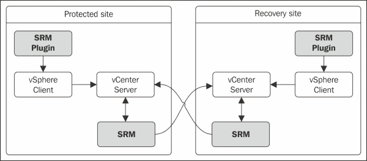
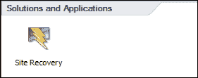
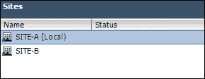
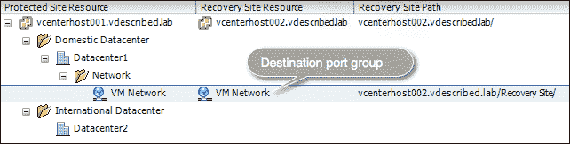

# 第一章 安装和配置 vCenter 站点恢复管理器（SRM）5.5

本章将涵盖以下主题：

+   什么是站点恢复管理器（SRM）？

+   为阵列基础复制准备存储

+   在保护和恢复站点上进行主机展示

+   在保护和恢复站点上安装 SRM

+   为 vSphere 客户端安装 SRM 插件

+   配对站点

+   安装存储复制适配器（SRA）

+   添加阵列管理器

+   启用阵列配对

+   配置占位符数据存储

+   创建资源、文件夹和网络映射

# 介绍

在今天的 IT 基础架构中，无论是虚拟还是物理，灾难恢复都至关重要。任何企业都应该能够继续运营，同时减少停机时间，以便在竞争中保持可持续性。它还对向客户销售的服务承担法律责任。用于营销或销售服务的两个主要因素是其高可用性和可恢复性。

可恢复性是指所提供的服务及其数据在发生故障时得到保护的保证，高可用性则是指所提供的服务将保持可操作性，故障会以用户甚至不知道发生过故障的方式进行处理。

企业有许多方式来规划和实施灾难恢复。虽然这很重要，但许多决定依赖于预算限制。最终最重要的是是否有灾难恢复计划。过去，需要等很长时间才能在恢复站点上恢复所有关键应用程序的时代已经过去了。通过大量自动化和脚本，现在企业期望更好的**恢复点目标**（**RPO**）和**恢复时间目标**（**RTO**）。

# 那么，RPO 和 RTO 究竟是什么？

RPO 定义了组织在特定时间内能够承受的数据丢失量。

RTO 定义了组织可以容忍的服务停机时间，直到服务重新恢复运营。

RPO 和 RTO 都是通过时间来定义的。例如，组织可以将 RPO 设置为 4 小时，RTO 设置为 1 小时。这意味着，它最多可以承受 4 小时的数据丢失，但最多只能承受 1 小时的服务停机。

RTO 仅定义了服务在恢复之前能够处于不可用状态的时间量，但没有考虑数据丢失。这时，RPO 就起到了作用。它定义了可以承受的数据丢失量。

例如，如果你是一个提供在线文档格式转换服务的公司，那么设置较低的 RTO 值非常重要，因为客户更希望访问服务，而不是历史数据。RPO 值将决定你需要保留多少历史数据。

RPO 和 RTO 都帮助组织确定适合其业务需求的备份和灾难恢复解决方案类型。

# 什么是站点恢复管理器（SRM）？

vCenter **站点恢复管理器**（**SRM**）是一个自动化灾难恢复测试和故障转移的编排软件。它可以配置为使用 vSphere 复制或支持的阵列基础复制。使用 SRM，您可以创建保护组并对其运行恢复计划。然后，恢复计划可用于测试灾难恢复设置并执行计划故障转移，或者可以在灾难恢复期间启动。SRM 不是一个执行自动故障转移的产品，这意味着 SRM 内部没有检测灾难/故障并自动故障转移虚拟机的智能。灾难恢复过程应由用户手动启动。因此，它不是一个高可用性解决方案；它纯粹是一个编排恢复计划的工具。

## 架构

vCenter Site Recovery Manager 不是一个独立工作的工具。它需要与 vSphere 环境中的其他组件进行通信。我将引导您了解使用 SRM 保护的环境中涉及的所有组件。

以下是将参与 SRM 保护环境的组件：

| 受保护站点 | 恢复站点 |
| --- | --- |
| vCenter Server | vCenter Server |
| SRM 实例 | SRM 实例 |
| 阵列管理器 | 阵列管理器 |
| 存储复制适配器 | 存储复制适配器 |

SRM 要求受保护站点和恢复站点由不同的 vCenter Server 实例管理。它还要求在两个站点上都配置一个 SRM 实例。目前，SRM 的功能仅能通过 vSphere 客户端访问，而不能通过 vSphere Web 客户端使用。因此，必须在与 vSphere 客户端安装的同一台机器上安装 SRM 插件。请参见以下图示：

作为一种解决方案，SRM 不能单独工作。因为它只是一个编排工具，并不包括复制引擎。然而，它可以利用支持的阵列基础复制或 VMware 专有的复制引擎 vSphere 复制。我们有单独的章节介绍 vSphere 复制。

### 阵列管理器

每个 SRM 实例需要配置一个阵列管理器，以便与存储阵列进行通信。阵列管理器将使用您提供的连接信息来检测存储阵列。在添加阵列管理器之前，您需要安装一个特定于阵列的**存储复制适配器**（**SRA**）。这是因为阵列管理器使用已安装的 SRA 来收集来自阵列的复制信息。请参见以下图示：

### 存储复制适配器（SRA）

SRA 是一个存储厂商组件，使 SRM 能够感知阵列中的复制配置。SRM 利用 SRA 的功能，从阵列收集有关复制卷和复制方向的信息。

SRM 还使用 SRA 执行以下功能：

+   测试故障转移

+   恢复

+   重新保护

如下图所示：

我们将在下一章学习更多关于这些功能的内容。现在，重要的是理解，SRM 要求安装 SRA 以支持其所有利用基于阵列复制的功能。

当所有这些组件组合在一起时，受 SRM 保护的站点将如图所示：

SRM 概念上假设受保护站点和恢复站点地理上是分开的。然而，这种分离并非强制性的。你可以使用 SRM 来保护一组服务器机架，并将另一个机架设置在与恢复站点相同的数据中心。现在，我们已经简要了解了 SRM 架构，接下来是学习如何设置这些组件。

# 为 SRM 环境打下基础

你需要执行一系列配置活动，为 SRM 环境打下基础，以便它可以用来测试或执行恢复计划。

下面是形成 SRM 环境需要完成的任务概述：

+   为基于阵列的复制准备存储

+   在受保护站点和恢复站点进行主机呈现（分区）

+   在受保护站点和恢复站点上安装 SRM

+   安装 vSphere 客户端的 SRM 插件

+   配对 SRM 实例

+   安装 SRA

+   添加阵列管理器

+   启用阵列对

+   创建资源、文件夹和网络映射

+   创建占位符数据存储

## 为基于阵列的复制准备存储

你首先需要做的事是确保你的阵列得到 VMware 的支持，并且阵列供应商为基于阵列的复制提供了许可。这不是 VMware 许可证，而是来自存储供应商的许可功能。

现在，为了启用复制，你可以使用几种方法，具体如下：

| 方法-1 | 方法-2 |
| --- | --- |

|

+   确定你想要保护的虚拟机

+   确定虚拟机文件所在的 VMFS 数据存储

+   确定已识别数据存储对应的 LUN

+   启用已识别 LUN 的复制

|

+   确定你想要保护的虚拟机

+   规划一个足够大的数据存储，以容纳所有已识别的虚拟机

+   创建一个足够大的 LUN 来托管数据存储

+   将新的 LUN 呈现给运行已识别虚拟机的主机，并在其上创建新的 VMFS 卷（数据存储）

+   将你想要保护的虚拟机迁移到新的数据存储上

+   启用对应新数据存储的新 LUN 上的复制

|

方法-1 适用于阵列没有备用容量为主机保护的虚拟机提供单独 LUN 的场景。如果虚拟机分布在多个数据存储上，这种方法会增加管理负担。它还会导致复制带宽和存储空间的浪费，因为被复制的 LUN 将包含未保护的虚拟机数据。

在容量充足的情况下使用方法-2。这种方法最佳，因为它可以减少复杂性，避免复制带宽浪费，并减少空间浪费，相较于方法-1。然而，这种方法会影响保护站点和复制站点所需的 LUN 大小。

## 在保护站点和恢复站点进行主机呈现（区域划分）

如果你参与的是新的实施工作，你需要规划如何在保护站点和恢复站点将 ESXi 主机与存储阵列进行区域划分。这意味着 LUN 需要在网络交换机上正确区域划分。保护站点和恢复站点的阵列配置如下：

+   在保护站点阵列中，将 ESXi 主机区域划分为与存储阵列进行通信，并确保存放需要保护的虚拟机的 LUN 已经分配给这些 ESXi 主机

+   在恢复站点阵列中，将 ESXi 主机区域划分到阵列，但不要将复制 LUN 映射到主机上

## 在保护站点和恢复站点安装 SRM

为了使灾难恢复设置正常工作，VCenter SRM 必须在保护站点和恢复站点同时安装。无论在哪个站点安装，安装过程都是相同的；唯一的区别是，在每个站点，你需要将 SRM 安装注册到管理该站点的 vCenter 服务器。

SRM 可以安装在已安装 vCenter 服务器的同一台机器上，也可以安装在不同的机器上。选择哪种安装模式取决于你如何在基础设施中规划服务提供机器的规模或分离。最常见的部署模型是将 vCenter 和 SRM 安装在同一台机器上。这样做的原因是 SRM 无法以独立模式运行；这意味着，如果 vCenter 服务器宕机，你将无法访问 SRM。像 vCenter 服务器一样，SRM 可以安装在物理机器或虚拟机器上。

另一个需要考虑的因素是 SRA 的安装。SRA 必须安装在已安装 SRM 的同一台机器上。一些 SRA 安装后需要重启。因此，在进行 SRM 部署选择之前，重要的是要阅读存储厂商的文档。如果无法进行 vCenter 停机维护，你需要考虑将 SRM 安装在单独的机器上。

然而，在实际安装软件之前，了解软件和硬件的要求是非常重要的。这样可以确保在使用产品过程中不会遇到兼容性或支持性问题。要了解 SRM 的要求，请参考《*站点恢复管理器安装与配置指南（SRM 5.5）*》文档中第 23 页中的*站点恢复管理器系统要求*部分，该文档可在[`pubs.vmware.com/srm-55/topic/com.vmware.ICbase/PDF/srm-install-config-5-5.pdf`](http://pubs.vmware.com/srm-55/topic/com.vmware.ICbase/PDF/srm-install-config-5-5.pdf)找到。

下图展示了安装 vCenter SRM 的过程：

### 执行 SRM 安装

假设 SRM 数据库和 64 位 DSN 已经创建，我们将直接进入使用 SRM 安装程序的安装过程。

在开始之前，您需要从 VMware 网站下载 SRM 安装包。可以通过访问[www.vmware.com](http://www.vmware.com)并进入**下载**菜单中的**vCenter Site Recovery Manager**选项来下载。您需要先登录到您的`my.vmware.com`帐户才能下载可执行文件。

以下步骤将引导您通过 SRM 安装向导：

1.  双击已下载的可执行文件以加载安装程序。

1.  在安装向导的欢迎屏幕上，点击**下一步**继续。

1.  选择一个目标文件夹供安装程序存放文件。默认位置是`C:\Program Files\VMware\VMware vCenter Site Recovery Manager\`。您可以通过点击**更改**按钮来更改此位置。现在，我选择保持默认位置。点击**下一步**继续。

1.  在下一个屏幕上，您将被提示安装 vSphere 复制 UI 插件用于 SRM。您可以选择在此阶段安装或不安装该插件。由于本章没有讨论 vSphere 复制，我选择了**不安装 vSphere 复制**作为选项。点击**下一步**继续。!执行 SRM 安装

1.  在下一个屏幕上，提供 vCenter 服务器的 FQDN/IP 地址及凭据；同时，SRM 实例也应该进行注册。建议使用单独的服务帐户，而不是内建管理员帐户。在大多数当前安装 SRM 的情况下，管理站点的是本地 vCenter 服务器。点击**下一步**继续。!执行 SRM 安装

1.  接下来，您将被提示选择证书源。在此，您可以让安装程序生成证书，或者提供由证书颁发机构生成的证书文件。

1.  可用的选项如下：

    +   **自动生成证书**

    +   **使用 PKCS#12 证书文件**

1.  选择你需要的选项，然后点击**下一步**继续。

    在这里，我们选择让安装程序生成一个新证书。如果你已经拥有来自证书颁发机构的证书文件，可以选择第二个选项。VMware 建议为其所有产品使用 CA 签名证书。

    

1.  在下一个界面，提供证书生成所需的详细信息（组织和组织单位），然后点击**下一步**继续。如果选择自动生成证书，则系统会提示输入此信息。

1.  提供本地站点名称、两位管理员的电子邮件地址（这些管理员需要接收任何事件通知），以及我们将安装 SRM 的机器的 IP 地址。本地站点名称可以是你提供的任何名称。在此例中，我使用了管理站点的 vCenter Server 名称。安装后，可以通过站点的**高级设置**选项卡更改站点名称。点击**下一步**继续。

1.  接下来，系统会提示你提供之前为 SRM 创建的数据库的详细信息。

1.  以下详细信息是继续安装所需的：

    +   配置为连接 SRM 数据库的 64 位 DSN 名称。

    +   数据库用户凭据，可以是你在数据库服务器上为 SRM 数据库手动创建的用户。尽管在本例中，我使用了`sa`凭据，但不推荐公开使用`sa`凭据。在大多数环境中，`sa`账户由数据库管理员使用。建议使用单独的服务账户。

1.  提供相关详细信息并点击**下一步**继续。

1.  在**准备安装程序**屏幕上，点击**安装**开始安装。

1.  安装完成后，点击**完成**退出安装程序。

## 为 vSphere Client 安装 SRM 插件

SRM 功能通过 vSphere Client 的用户界面展现，借助 SRM 插件实现。SRM 安装程序不会自动安装此插件，因为它是 vSphere Client 的插件，而非 vCenter Server 的插件。需要单独在安装了 vSphere Client 的机器上安装该插件。

这是操作方法：

1.  使用 vSphere Client 连接到 vCenter Server。

1.  在**插件**选项卡中，导航到**管理插件**选项，如下图所示：

1.  在**插件管理器**窗口中，SRM 插件应列在**可用插件**类别下。

1.  点击**下载和安装**链接以获取并安装 SRM 插件。插件安装过程非常简单。

1.  安装完成后，vCenter 库存主页应显示 **站点恢复**，位于 **解决方案和应用程序** 下。

## 配对站点

一旦在两个站点上安装了 SRM，下一步就是将这两个站点进行配对。配对过程将在受保护站点和恢复站点的 vCenter 服务器之间建立连接，从而使两个站点的 SRM 实例能够互相识别对方（受保护/恢复）。如果没有配对站点，我们将无法继续配置灾难恢复设置。

这是配对站点的过程：

1.  使用 vSphere 客户端连接到受保护/恢复站点的 vCenter 服务器。

1.  导航到库存主页，并点击 **站点恢复**。

1.  点击左侧窗格中的 **站点**。

1.  右键点击列出的本地站点，并点击 **配置连接** 打开配置连接向导。参考以下截图：

1.  在 **配置连接** 向导中，提供远程 vCenter 服务器的 FQDN，并点击 **下一步** 继续。接受任何后续的证书警告。

1.  提供管理员凭据，然后点击 **下一步**。接受任何后续的证书警告。

1.  这将开始配对过程，建立与远程 vCenter 服务器和 SRM 的连接，并建立互通性。点击 **完成** 退出向导。

1.  一旦退出向导，你将再次被提示输入远程 vCenter 服务器的管理员凭据。输入凭据并点击 **确定**。忽略任何后续的证书警告。参考以下截图：

1.  现在你应该能够在 **站点** 窗格下看到两个站点的列表：

请记住，配对过程仅在其中一个站点进行。这是因为配对过程会通过反向配置连接来建立互通性。然而，当你在远程 vCenter 服务器上打开站点恢复解决方案时，会提示你输入另一个站点的管理员凭据。

## 安装存储复制适配器

一旦安装并配对了 SRM 实例，下一步就是安装存储复制适配器。SRA 是由存储供应商编写并提供的。VMware 会认证这些 SRA 并发布其与 SRM 的兼容性。

### 下载 SRA

认证版本的 SRA 可以直接从 VMware 网站下载。请记住，大多数供应商会在 VMware 认证之前，先在其官网发布更新版本的 SRA。由于 SRA 是供应商支持的组件，如果已知最新版本能够解决你正在处理的问题，你可以选择安装供应商提供的最新版本。

这是下载 SRA 的方法：

1.  访问 VMware 的官方网站：[www.vmware.com](http://www.vmware.com)。

1.  导航到**产品下载**类别下的**vCenter Site Recovery Manager**选项，点击**下载**。

1.  一旦你进入 vCenter SRM 的下载页面，点击 SRA 旁边列出的**前往下载**超链接。

1.  在**下载 VMware vCenter Site Recovery Manager 的存储复制适配器**页面上，你会看到所有经过认证的 SRA 列表。点击与所需 SRA 对应的**立即下载**按钮。

### 安装 SRA

下载完成后，SRA 组件需要在两个站点上安装。在大多数情况下，SRA 安装过程简单明了，但不同厂商可能会有所不同。你需要参考厂商的文档来进行安装。

安装完成后，按照以下步骤发现已安装的 SRA 组件：

1.  使用 vSphere Client 连接到 vCenter Server 的保护/恢复站点。

1.  导航到库存首页，点击**站点恢复**。

1.  在左侧窗格中点击**阵列管理器**，并导航到**SRA**选项卡。

1.  在**SRA**选项卡中，点击**重新扫描 SRA**以发现已安装的 SRA。

1.  在恢复站点也重复该过程。

## 添加阵列管理器

一旦在两个站点上安装并发现 SRA，你需要在两个站点上添加阵列管理器。阵列管理器用于发现已复制的 LUN，并执行 SRM 发起的其他存储操作。

这是添加阵列管理器的方法：

1.  使用 vSphere Client 连接到 vCenter Server 的保护/恢复站点。

1.  导航到 vCenter Server 的库存首页，并点击**站点恢复**。

1.  在左侧窗格中点击**阵列管理器**，选择站点，并点击**添加阵列管理器**，以启动**添加阵列管理器**向导，如下图所示：

1.  在向导中，为阵列管理器提供一个**显示名称**和**SRA 类型**。SRA 类型值字段将预填充已经安装的 SRA。点击**下一步**继续。

1.  在下一个屏幕上，系统会提示你输入存储节点或管理服务器的 IP 地址，这些服务器负责阵列管理。请记住，这个屏幕提示的信息因阵列和厂商而异，完全依赖于使用的 SRA。在这个示例中，我使用的是 HP StoreVirtual（LeftHand）SRA，并且输入的是作为**节点存储模块**（**NSM**）所属集群的虚拟 IP（VIP）。如果不使用这个，集群中的所有 NSM 都会参与 SRM 的复制，随后可以提供参与的 NSM 的 IP 地址，地址之间用逗号分隔。

1.  提供详细信息，然后单击**下一步**继续。请参阅下面的截图：

1.  如果数组管理器成功添加，下一个屏幕将显示**成功**。单击**完成**退出向导。

1.  在恢复站点上重复相同的步骤。

1.  完成后，两个站点的**数组管理器**应该列出，如下截图所示：

## 启用数组对

数组对显示了两个数组之间的复制关系。在启用数组对之前，您需要在两个站点上安装 SRA 并添加数组管理器。要使数组管理器检测到数组对，应该已经在数组之间创建了复制计划。请参阅供应商文档，了解复制计划对供应商数组的含义及其创建过程。

这是如何启用数组对的过程：

1.  确保两个数组之间已启用复制计划。

1.  导航到 vCenter Server 的库存首页，然后单击**站点恢复**。

1.  在左窗格中单击**数组管理器**。

1.  选择已添加的**数组管理器**（本地或远程），然后单击**刷新**以发现数组对，如下截图所示：

1.  如果**刷新**操作发现了一个数组对，该数组对将被列出。**刷新**操作必须在两个站点都执行。

1.  发现的数组对默认情况下未启用。要启用数组对，请选择一个数组对，然后单击**启用**。此操作仅需在一个站点执行。

1.  启用数组对后，它会尝试发现数组上启用了复制计划的设备（LUN）。请注意，并非所有具有复制计划的设备都显示为数组对的设备；仅显示那些已经向受保护站点的主机呈现的设备。要查看已检测和过滤的支持复制的设备，请选择数组管理器，并导航至**设备**选项卡，然后单击**刷新**，如下截图所示：

## 配置占位符数据存储

在下一章节，您将学习如何创建保护组。对于每个成为保护组一部分的虚拟机，SRM 会创建一个影子虚拟机。占位符数据存储用于存储影子虚拟机的文件。用于此目的的数据存储应该对扮演恢复主机角色的数据中心/集群中的所有主机可访问。我们将在下一章节详细了解保护组和影子虚拟机。暂时了解配置占位符数据存储是形成 SRM 环境的重要步骤。

假设这些配对站点各自地理分隔，每个站点将拥有自己的占位数据存储。以下图表显示了站点与占位数据存储的关系：

这是配置占位数据存储的方法：

1.  转到 vCenter Server 的存货主页，单击**站点恢复**。

1.  在左窗格中单击**站点**，选择一个站点。导航到**占位数据存储**选项卡，单击**配置占位数据存储**，如下屏幕截图所示：

1.  在**配置占位数据存储**窗口中，选择适当的数据存储，然后单击**确定**。为确认选择，退出该窗口。

1.  现在，**占位数据存储**选项卡应显示已配置的占位符。请参阅以下屏幕截图：

1.  如果计划配置回迁，则在恢复站点中重复该过程。

## 创建资源、文件夹和网络映射

创建资源、文件夹和网络映射有助于进一步编排为计划迁移或故障切换执行的恢复计划。如果缺少这些映射，您将无法在虚拟机上配置保护，并且保护状态将指示缺少这些映射。我们将在下一章节详细了解保护组。

除了创建保护组的要求外，还有其他用例。以下表格显示了一些常见的用例：

| 用例 | 使用的映射 |
| --- | --- |
| 如果指定的恢复站点运行其他工作负载，则可能需要为来自受保护站点的 VM 创建单独的文件夹。 | 文件夹映射 |
| 如果恢复站点有一个单独的集群/资源池来托管，则从受保护站点恢复的 VM。 | 资源映射 |
| 如果恢复站点上有恢复的虚拟机的 vSwitch/DSwitch 端口组，则使用网络映射。 | 网络映射 |

### 资源映射

我们需要为两个站点上的计算资源容器提供关联。计算资源容器包括集群、资源池和 ESXi 主机。这是通过资源映射来实现的。

资源映射尊重这些容器的存在，这意味着如果站点上有集群或资源池，则 ESXi 主机不会作为可选择的计算容器提供。

这是配置资源映射的方法：

1.  转到 vCenter Server 的存货主页，单击**站点恢复**。

1.  在左侧面板点击**站点**，选择一个站点，导航到**资源映射**选项卡。选择你想映射的资源容器（集群、资源池或主机），点击**配置映射**以打开**映射**窗口。参考以下截图：

1.  在**映射**窗口中，浏览恢复站点的资源库存，选择目标资源容器（集群、资源池或主机），点击**确定**以确认。

1.  **资源映射**选项卡现在应显示映射的**恢复站点资源**。

### 文件夹映射

文件夹是只能通过 vCenter Server 创建的库存容器。它们用于将同一类型的库存对象进行分组，以便更轻松地管理。

文件夹有不同类型。文件夹类型由它们创建时所在的库存层级决定。文件夹名称如下：

+   数据中心文件夹

+   主机和集群文件夹

+   虚拟机和模板文件夹

+   网络文件夹

+   存储文件夹

vSphere Web Client 提供 UI 菜单选项来创建以下类型的文件夹，无需导航到适当的库存层级来创建它们：

+   主机和集群文件夹

+   网络文件夹

+   存储文件夹

+   虚拟机和模板文件夹

在 SRM 文件夹映射的情况下，我们只处理虚拟机文件夹及其父数据中心。你将无法为其他任何文件夹类型配置映射。

这是配置文件夹映射的方法：

1.  导航到 vCenter Server 的库存主页，点击**站点恢复**。

1.  在左侧面板点击**站点**，选择一个站点，导航到**文件夹映射**选项卡。选择你要映射的虚拟机文件夹，点击**配置映射**以打开**映射**窗口，如下截图所示：

1.  在**受保护虚拟机映射**窗口中，浏览恢复站点的虚拟机文件夹库存，选择目标文件夹，点击**确定**以确认。

    ### 提示

    确保虚拟机文件夹所属的父数据中心也被映射是很重要的。配置映射的过程是相同的。

1.  **文件夹映射**选项卡现在应显示映射的恢复站点文件夹。参考以下截图：

### 网络映射

受保护站点和恢复站点的网络配置不必完全相同。网络映射提供了一种方法，用于在受保护步骤和恢复步骤的端口组（标准或分布式）之间建立关联。

假设我们在受保护站点有一个名为 VM Network 的端口组，并且它映射到恢复站点一个名为 Recovery Network 的端口组。在这种情况下，连接到 VM Network 的虚拟机会在故障切换时重新配置为使用 Recovery Network。

这是配置网络映射的步骤：

1.  导航到 vCenter Server 的库存主页，并点击**站点恢复**。

1.  在左侧窗格中点击**站点**，选择一个站点，进入**网络映射**选项卡。选择要映射的端口组（标准/分布式），然后点击**配置映射**以打开**映射**窗口，如下图所示：

1.  在**虚拟机网络映射**窗口中，浏览恢复站点的网络清单，选择目标端口组，然后点击**确定**进行确认。

1.  **网络映射**选项卡现在应该显示映射的恢复站点端口组，如下图所示：

## 虚拟机交换文件位置

在 SRM 实现中，关于虚拟机交换文件的放置有一个常见的争论。一些人建议为虚拟机交换文件维护一个单独的数据存储，而另一些人则反对。在我们尝试理解这两种设计选择背后的理由之前，了解虚拟机交换文件是什么是很重要的。

每个虚拟机都会有一个交换文件（`.vswp`）。每次虚拟机启动时，都会创建这个交换文件。交换文件的大小等于分配给虚拟机的内存大小，除非有内存保留。如果有内存保留，那么交换文件的大小将等于未保留内存的大小。虽然很少见，但有些环境也会限制内存的使用。

所以，计算交换文件大小的理想公式如下：

*交换文件大小 = 内存限制 – 内存保留*

默认的内存保留为 0 MB，默认的限制等于配置的内存大小。默认情况下，交换文件与虚拟机一起存储在其工作目录中。

### 设计选择 1 – 为交换文件创建单独的数据存储

这一选择的理由是，交换文件每次虚拟机启动时都会创建。由于虚拟机将在恢复站点启动，交换文件也会在那个时候创建。因此，交换文件无需复制。下表展示了这种设计的优缺点：

| 优点 | 缺点 |
| --- | --- |
| 如果避免交换文件复制，可以减少存储复制的带宽利用率。 | 单点故障。 |
| 减少恢复站点对存储空间的需求，否则恢复站点将需要这些空间来存放交换文件。 | 交换位置应在每个主机级别选择；这在大型环境中意味着需要大量的手动工作。 |
|   | 需要为一个独立的大型 LUN 提供空间；这可能会影响阵列的可用空闲容量。 |

### 设计选择 2 - 将交换文件存储在虚拟机的工作目录中

这一决策的依据是，除了减少复制带宽的使用外，保持一个独立的数据存储用于交换文件并没有实际的优势。大多数 SRM 实现已经确保有足够的带宽来支持存储复制。此外，并非所有虚拟机都会频繁使用交换文件，除非 vSphere 环境被过度订阅，虚拟机频繁争夺内存资源。在大多数情况下，交换文件将在初始同步时进行复制。后续的同步将包括由于关机和开机操作而创建的交换文件。请记住，来宾操作系统重启不会触发交换文件的重新创建。下表展示了这一设计的优缺点：

| 优点 | 缺点 |
| --- | --- |
| 无需管理开销，否则每个主机配置交换数据存储时需要额外的管理开销。 | 带宽浪费，因为交换文件被复制。 |
| 无单点故障。 | 恢复站点的空间浪费，如果不将交换文件复制到副本 LUN 上，原本可以避免这种浪费。 |

### 注意

设计选择及其背后的理由可能因所处理的环境而有所不同。这些理由仅作为指导原则。

# 总结

本章中，我们了解了 VMware vCenter SRM 的概念，以及如何安装和配置它，为任何 SRM 环境奠定基础。在下一章中，我们将学习如何通过创建保护组和恢复计划来启用虚拟机工作负载的保护。
