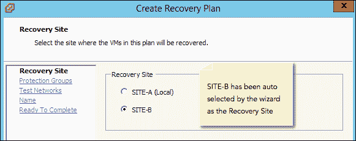

# 第二章：创建保护组和恢复计划

在上一章中，我们学习了如何安装并配置 SRM，以及如何为 SRM 保护环境奠定基础。我们学习了如何创建资源、文件夹、网络映射，并配置占位符数据存储和阵列管理器。

在本章中，我们将覆盖以下主题：

+   创建保护组

+   创建恢复计划

一旦完成了为形成 SRM 保护环境所需的基础工作，下一步就是为虚拟机授予保护。在深入了解保护虚拟机的操作步骤之前，理解一些基本概念，如数据存储和保护组，是非常重要的。

# 数据存储组

数据存储组是一个容器，用于聚合一个或多个启用了复制功能的数据存储。数据存储组由 SRM 创建，不能手动更改。启用了复制功能的数据存储是指其 LUN 在阵列中启用了复制计划的数据存储。

如果数据存储没有存储来自其他数据存储的虚拟机文件，则数据存储组将只包含一个数据存储。请参见前面的单数据存储数据存储组概念图。

数据存储组也可以包含多个数据存储。如果虚拟机的文件分布在这些数据存储上，SRM 将多个数据存储聚合到一个组中。例如，如果虚拟机 A 的两个 VMDK 分别存放在数据存储 Datastore-M 和 Datastore-N 上，那么这两个数据存储将成为同一个数据存储组的一部分。这些数据存储组进一步有助于保护组的创建。

# 保护组

与**vSphere 复制**不同，SRM 无法为单独的虚拟机启用保护。所有存储在数据存储组中的数据存储上的虚拟机都将被保护。也就是说，在 SRM 中，保护是在数据存储组级别启用的。这是因为，使用基于阵列的复制时，支持数据存储的 LUN 会被复制。阵列并不知道哪些虚拟机存储在数据存储上。它只是逐块复制 LUN。因此，在 SRM 层，保护是在数据存储级别启用的。从某种程度上来说，保护组只是一个软件构造，数据存储组被添加到该构造中，而这些数据存储组则包括了保护组中存储的所有虚拟机。

创建保护组时，您需要选择将被包含的数据存储组。请记住，您无法单独选择数据存储组中的数据存储。如果允许这样做，虚拟机的某些文件将无法得到保护。假设您有一台虚拟机，VM-A，它有两个磁盘（VMDK-1 和 VMDK-2），分别存放在两个不同的数据存储上。假设 VMDK-1 位于 Datastore-X，VMDK-2 位于 Datastore-Y。在创建保护组时，如果允许选择单独的数据存储，并且您只选择其中一个数据存储，那么虚拟机的其余磁盘将无法得到保护。因此，SRM 不允许从数据存储组中选择单独的数据存储，以避免这种情况。以下图示显示了修改后的数据存储组概念结构：

在这里，尽管我们将两个数据存储组包含在同一个保护组**保护组-A**中，但也可以为每个数据存储组单独创建保护组。

### 提示

请注意，一个数据存储组不能同时属于两个保护组。

# 创建保护组

在受保护站点的 SRM 用户界面中创建一个保护组。以下步骤将引导你完成创建保护组的过程：

1.  转到 vCenter 服务器的库存主页，并点击**站点恢复**。

1.  在窗口的左侧面板中，点击**保护组**。

1.  点击**创建保护组**，打开**创建保护组**向导，如下图所示：

1.  在向导中，确保选择了您要保护的站点。

    请记住，始终选择本地站点（即您当前所在的站点）作为**受保护站点**，如以下截图所示。如果您从**恢复站点**使用 SRM 用户界面，您需要手动选择受保护站点。如果向导显示多个阵列对，请确保选择正确的阵列对以继续。

    点击**下一步**继续。

    

1.  在下一个屏幕中，选择您希望保护的数据存储组。选择数据存储组时，底部面板将列出该数据存储组中所有虚拟机。请注意，您不能单独选择虚拟机。尽管我只选择了一个数据存储组，我们仍然可以选择多个数据存储组作为保护组的一部分。

    点击**下一步**继续，如下图所示：

    

1.  在下一个界面中，提供**保护组名称**和可选描述，然后点击**下一步**继续。

    **保护组名称**可以是你喜欢用来标识保护组的任何名称。常见的命名规范是指示虚拟机的类型或目的。这是因为，在大多数情况下，具有相同目的的虚拟机或在 SRM 保护环境中具有相同类型/优先级的虚拟机会被分隔到不同的数据存储中，以便于更好地管理保护组。

1.  例如，如果你要保护 SQL Server 虚拟机，那么你可以将保护组命名为 `SQL Server Protection Group`；或者，如果它是一个包含连字符的虚拟机集合，你可以将其命名为 `High Priority VMs Protection Group`。

1.  在 **准备完成** 屏幕上，如下图所示，检查向导选项并点击 **完成** 来创建保护组：

## 那么，当你创建一个保护组时，究竟发生了什么呢？

当你创建保护组时，它会在所选的数据存储组中的所有虚拟机上启用保护，并在恢复站点创建影像虚拟机。具体而言，这意味着在受保护站点的 vCenter Server 上，你应该看到 **创建保护组** 任务完成；随后，每个虚拟机都会成功完成 **保护虚拟机** 任务。请参见下图作为参考：

在 vCenter Server 的恢复站点，你应该看到 **创建保护组**、**保护虚拟机**（每个虚拟机一个）、**创建虚拟机**（每个虚拟机一个）和 **重新计算数据存储组** 任务成功完成。

如下截图所示，影像虚拟机会出现在恢复站点的 vCenter Server 库中：

由于它们仅为占位符，你无法对其执行任何电源操作。虽然可以执行其他操作，但不推荐这样做。因此，将会显示一个警告，要求确认，如下图所示：

占位符数据存储只会为每个虚拟机提供配置文件（`.vmx`）、团队配置文件（`.vmxf`）和快照元数据文件（`.vmsd`）。

当你删除保护组时，这些文件将会自动删除。

# 恢复计划

恢复计划是在恢复站点创建的，以便在受保护站点发生灾难时能够访问并从恢复站点执行。恢复计划用于将原本在受保护站点运行的虚拟机工作负载切换到恢复站点。它还可以用于执行计划迁移。恢复计划是一系列配置步骤，需要执行这些步骤以将受保护的虚拟机切换到恢复站点。

### 提示

一个恢复计划应至少与一个保护组关联。

# 创建恢复计划

一旦创建了保护组，接下来的步骤就是为这些保护组创建恢复计划。恢复计划应在恢复站点的 SRM 中创建。原因是，在灾难发生时，受保护站点可能无法访问。因此，出于显而易见的原因，恢复计划总是创建在恢复站点。以下步骤将向您展示如何创建恢复计划：

1.  转到 vCenter Server 的清单主页并点击**站点恢复**。

1.  在左侧窗格中点击**恢复计划**[**A**]。

1.  点击**创建恢复计划**[**B**]以弹出**创建恢复计划**向导，如下图所示：

1.  在**创建恢复计划**向导中，选择**恢复站点**并点击**下一步**继续。如果恢复计划向导在一个站点启动，那么向导将选择该站点对的另一个站点作为恢复站点。例如，如果您在 SITE-A 启动恢复计划向导，那么向导将自动选择 SITE-B 作为恢复站点，反之亦然。请参阅以下截图：

1.  如下图所示，选择您想要使用的保护组并点击**下一步**继续：

1.  在下一个向导屏幕中，点击**测试网络**。测试网络默认设置为**自动**。自动网络是隔离的虚拟网络，不与任何物理网络连接。它们用于测试恢复计划。我们将在第三章中详细讨论如何测试恢复计划以及使用虚拟网络的相关内容，*测试与执行故障转移和故障恢复*。因此，除非您已在恢复站点手动创建了隔离的测试网络端口组，否则可以将其保持在**自动**设置。点击**下一步**继续：

1.  在下一个屏幕中，输入**恢复计划名称**和可选的**描述**，然后点击**下一步**继续。恢复计划名称可以是您选择的任何名称。

1.  在**准备完成**窗口中，点击**完成**以创建恢复计划。

1.  你应该在**最近任务**面板中看到**创建恢复计划**任务成功完成。

# 总结

在这一章节中，我们学习了如何创建保护组并为其创建恢复计划。在下一章节中，我们将学习如何测试恢复计划，执行故障切换、重新保护以及故障恢复。
