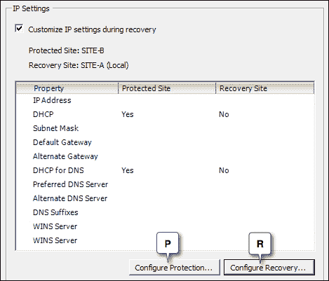
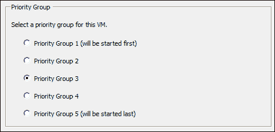

# 第三章：测试和执行故障切换与故障恢复

在上一章中，我们学习了如何创建保护组和恢复计划。如前所述，恢复计划只是为恢复失败站点而预先创建的工作流程。在本章中，我们将学习如何测试已创建的恢复计划，如何使用它们执行故障切换、计划迁移、重新保护和故障恢复。

以下是本章将涵盖的主题列表：

+   测试恢复计划

+   执行计划迁移

+   执行灾难恢复（故障切换）

+   重新保护站点

+   恢复到受保护站点

+   配置虚拟机恢复属性

# 测试恢复计划

应该测试恢复计划的可用性，以确保它在发生真实灾难时能够按预期工作。大多数组织定期审查和更新其恢复手册，以确保它们拥有经过优化且可行的恢复计划。

使用 SRM，现在可以自动化测试恢复计划。在深入了解恢复计划背后真正发生的过程之前，了解测试恢复计划的工作流程非常重要。

以下步骤将指导您测试已存在的恢复计划的过程：

1.  导航到 vCenter Server 的库存主页，并点击**站点恢复**。

1.  点击左侧窗格中的**恢复计划**。

1.  点击您想要测试的恢复计划，然后点击**测试**工具栏项目，以启动**测试**向导，如下图所示：

1.  如下图所示，向导的第一个屏幕将显示哪些站点已被指定为受保护和恢复站点、站点连接状态以及受保护的虚拟机数量：

    默认情况下，选择了存储选项**将最近的更改复制到恢复站点**。我建议不要取消选择此选项，因为我们在计划迁移期间复制最近的更改。因此，测试阵列响应非计划复制请求的能力非常重要。然而，如果复制是同步的，我们可能不需要这样做。点击**下一步**继续。

1.  下一屏幕将总结所选的选项，如下图所示。请检查这些选项，然后点击**开始**以启动测试：

1.  现在，您应该在**最近任务**窗格中看到**测试恢复计划**任务。导航到**恢复步骤**标签页，查看测试进度，如下图所示：

1.  一旦测试成功完成，您将在恢复计划的**摘要**标签页看到如下**测试完成**横幅：

## 测试是如何工作的？

恢复计划的测试以不会影响当前操作的方式进行，包括复制计划和实际副本，或者受保护的虚拟机。在本章的这一部分，我们将学习如何实现这一点。

下图展示了恢复计划测试过程中涉及的步骤概览：


当你启动测试时，SRM 会指示**存储复制适配器**执行复制周期，将最新的更改复制到恢复站点的副本 LUN。但前提是你选择了保留默认选项，即复制最近的更改。如果复制是同步的，则无需复制最近的更改，因为副本已经包含了最新的更改。有关更多信息，请参考你的复制供应商文档。

一旦复制完成，接下来需要找到一种方法将副本 LUN 的数据呈现给恢复 ESXi 主机，以便虚拟机能够启动。这一点不同的存储阵列实现方式不同。最常见的方法是创建副本 LUN 的可写快照，然后将快照呈现给恢复 ESXi 主机。主机随后将扫描其 HBA，检测 LUN 上的 VMFS 卷。

在快照呈现给 ESXi 主机之前，SRM 需要确保恢复站点有足够的空间（计算能力）来启动恢复的虚拟机。为了腾出空间，SRM 可以关闭非关键虚拟机（*如果包含在恢复计划中*），并且还可以启动被**分布式电源管理**（**DPM**）置于待机模式的 ESXi 主机（如果有的话）。

### 注意

SRM 选择暂停的非关键虚拟机是那些在恢复计划中标记为非关键的虚拟机，使用了**添加非关键虚拟机**选项。

要启动恢复的虚拟机，它们必须注册到恢复站点的 vCenter 服务器。这是通过用与恢复虚拟机相对应的条目替换影像虚拟机条目来实现的。请记住，影像虚拟机只是清单对象，它们并没有映射任何 VMDK。

然后将虚拟机配置为连接到测试网络。测试网络可以是你为测试创建的端口组，也可以是通过新的 vSphere 标准交换机创建的、没有物理上行链路的自动气泡网络。

下图显示了 vSphere **标准交换机**和在测试自动气泡网络时自动创建的**端口组**：


一旦虚拟机配置为连接到测试网络，它们就会被启动。请记住，恢复计划的测试不会影响受保护站点上受保护虚拟机的电源状态。

## 执行测试后的清理工作

从上一部分我们了解到，在恢复计划的测试过程中，SRM 执行了某些元素的创建，以便以不影响运行环境的方式执行灾难恢复。因此，所做的更改和创建的对象是临时的，并且在成功测试后必须进行清理。幸运的是，这个过程也不是手动的。SRM 提供了一种自动化的方法来执行清理。

清理过程中将发生以下操作：

+   ESXi 主机将恢复为 DPM 待机模式。

+   恢复虚拟机将被关闭。

+   挂起的非关键虚拟机将被启动。

+   恢复虚拟机的库存条目将被其相应的 Shadow VM 条目替换。

+   VMFS 卷将被卸载。

+   LUN 设备将被分离。

+   存储发起者和刷新存储系统将被重新扫描。

+   创建的可写快照将被删除。

+   为气泡网络创建的端口组和虚拟交换机将被移除。

以下步骤将指导您完成清理所需的步骤：

1.  导航到 vCenter 服务器的库存主页并点击**站点恢复**。

1.  在左侧面板中点击**恢复计划**。

1.  选择状态为**测试完成**的恢复计划。

1.  点击工具栏中的**清理**项，如下图所示，打开清理向导：

1.  在清理向导中，将显示当前受保护和恢复站点的详细信息、它们的连接状态以及受保护虚拟机的数量。请注意，**强制清理**选项是灰色的。只有在先前的清理操作尝试失败时，才会启用此选项。点击**下一步**继续。

1.  下一屏幕将总结所选的清理选项。点击**开始**以启动清理过程。

1.  **最近任务**面板应该显示**清理测试恢复**任务已成功完成。

# 执行计划迁移。

VMware SRM 可用于将工作负载从一个站点迁移到另一个站点。当受保护站点可用并正在运行虚拟机工作负载时，执行计划迁移。

有许多使用案例，以下两个是突出的：

+   当将您的基础设施迁移到新硬件时。

+   当将您的虚拟机存储从一个阵列迁移到另一个阵列时。

### 注意

计划迁移将通过存储复制帮助复制最近的更改。这是不可选的。

以下步骤将指导您完成执行计划迁移所需的步骤：

1.  导航到 vCenter 服务器的库存主页并点击**站点恢复**。

1.  在左侧面板中点击**恢复计划**。

1.  选择为计划迁移创建的恢复计划，然后点击 **恢复** 工具栏项目，如下截图所示，启动恢复向导：

1.  如下截图所示，第一屏将要求进行 **恢复确认**。**恢复类型**将预先选定为 **计划迁移**。你应确认恢复确认以继续操作。点击 **下一步** 继续。

1.  下一屏将总结所选向导选项。点击 **开始** 启动迁移。

1.  **最近任务** 面板现在应显示 **故障切换恢复计划** 任务已成功完成。

如果任何恢复步骤失败，计划迁移将无法继续。但当你重新尝试计划迁移时，它将从失败的步骤继续操作。这使你能够修复问题并从失败处恢复，节省大量时间。

下图显示了计划迁移过程中发生的事件逻辑顺序：


# 执行灾难恢复（故障切换）

当受保护站点完全或部分不可用时，将执行故障切换。我们使用已经创建并测试过的恢复计划来执行故障切换。请记住，SRM 不会自动判断受保护站点是否发生灾难，因此恢复必须手动启动。

以下步骤展示如何执行故障切换：

1.  进入 vCenter Server 的库存主页，然后点击 **站点恢复**。

1.  点击左侧面板中的 **恢复计划**。

1.  选择为灾难恢复创建的恢复计划，并点击 **恢复** 工具栏项目以启动恢复向导。

1.  在恢复向导中，如下截图所示，同意 **恢复确认**，将 **恢复类型** 设置为 **灾难恢复**，然后点击 **下一步** 继续：

1.  下一屏将总结所选向导选项。点击 **开始** 执行恢复。

1.  恢复计划的 **恢复步骤** 标签将显示每个步骤的进度。

1.  一旦故障切换完成，恢复计划的状态应显示为 **恢复完成**。

灾难恢复（故障切换）涉及的恢复步骤与计划迁移相同，唯一不同的是 SRM 会忽略任何未成功的预同步存储或关闭受保护虚拟机的尝试。

# 强制恢复

强制恢复用于当受保护站点已不再具备足够的操作能力，无法让 SRM 在故障切换前在该站点执行任务时。

例如，受保护站点发生了意外的电力中断，导致不仅 ESXi 主机无法使用，而且存储阵列也无法访问。在这种情况下，SRM 无法执行任何任务，如关闭受保护虚拟机或复制最新的存储更改（如果复制是异步的），因为受保护站点无法访问。

## 启用站点强制恢复

强制恢复默认情况下是未启用的，但可以在站点的高级设置中启用。要执行此操作，请按照以下步骤进行：

1.  导航到 vCenter Server 的库存主页并点击**站点恢复**。

1.  点击左侧面板上的**站点**。

1.  右键点击站点并点击**高级设置**。

1.  在**高级设置**窗口中，从左侧面板选择**恢复**类别。

1.  选择**recovery.forceRecovery**设置旁的复选框，如下图所示，然后点击**确定**以启用强制恢复：

## 运行强制恢复

运行强制恢复将跳过本应在受保护站点上执行的所有步骤。你应仅在受保护站点完全停机且无法连接到 ESXi 主机或存储阵列的情况下使用强制恢复。如果强制恢复在受保护站点仍在线且可用时执行，虚拟机将在受保护站点和恢复站点上同时运行，导致 SRM 出现分脑（split-brain）问题。此外，如果基于阵列的复制是异步的，那么恢复站点上启动的虚拟机可能运行的是较旧的数据，而非受保护站点的数据。因此，在计划执行强制恢复之前，务必谨慎操作。

以下步骤展示了如何执行强制恢复（Forced Recovery）：

1.  导航到 vCenter Server 的库存主页并点击**站点恢复**。

1.  点击左侧面板上的**恢复计划**。

1.  右键点击要运行的恢复计划，并点击**恢复**。

1.  在恢复向导中，选中**我理解此过程将永久更改受保护站点和恢复数据中心的虚拟机及基础设施**复选框。

1.  如下图所示，选择**恢复类型**为**灾难恢复**，选中**强制恢复 – 仅恢复站点操作**复选框，然后点击**下一步**：

1.  系统会提示你确认**强制恢复**，点击**是**进行确认。

1.  查看操作摘要并点击**开始**以启动强制恢复。

# 重新保护站点

在将工作负载从受保护站点切换到恢复站点后，恢复站点对新托管的工作负载没有启用保护。SRM 提供了一种方法来启用恢复站点的保护。这种方法叫做**Reprotect**。

Reprotect 操作将反转复制的方向，从而将恢复站点指定为新的受保护站点。Reprotect 操作只能在**恢复完成**状态的恢复计划上执行。此外，请记住，只有当你修复了失败站点并使其能够成为恢复站点时，才能执行 Reprotect 操作。

例如，假设 SITE-A 和 SITE-B 分别是受保护站点和恢复站点。如果 SITE-A 的工作负载已经切换到 SITE-B，那么要对 SITE-B 执行 Reprotect 操作，SITE-A 应该能够访问。这意味着需要修复导致 SITE-A 故障的问题。

以下步骤展示了如何执行 Reprotect 操作：

1.  导航到 vCenter Server 的库存主页，点击**站点恢复**。

1.  点击左侧面板中的**恢复计划**。

1.  选择**恢复计划**，并确保其状态为**恢复完成**，如以下截图所示，然后点击工具栏上的**Reprotect**：

1.  在**Reprotect**向导屏幕中，同意**Reprotect 确认**并点击**下一步**继续：

1.  在下一屏幕中，点击**开始**以启动 Reprotect 操作。

1.  你应该能在**最近任务**面板中看到一个正在进行的**Reprotect 恢复计划**任务。同时，**恢复步骤**选项卡将显示 Reprotect 操作中每个步骤的进度。

1.  成功执行 Reprotect 操作后，恢复计划的状态应显示为**已准备好**。

# 切换回受保护站点

在 Failover 操作后，如果原始受保护站点已经修复并可以重新承载虚拟机工作负载，你可以使用 SRM 来自动化 Failback 操作。

虽然 Failback 是自动化的，但它是一个两步过程，步骤如下：

+   第 1 步是执行 Reprotect 操作。请阅读本章中的*Reprotect 站点*部分，了解如何执行 Reprotect 操作。

+   第 2 步是执行 Failover。请阅读本章中的*执行灾难恢复（Failover）*部分，了解如何进行 Failover 操作。

# 配置虚拟机恢复属性

虚拟机恢复属性有助于在每个虚拟机级别进一步自定义恢复过程。尽管这些属性只能通过恢复计划进行访问，但对这些属性所做的更改会保留在虚拟机中，无论它们将包含在哪个恢复计划中。

以下是可以设置的受保护虚拟机属性：

+   **IP 设置**

+   **优先级组**

+   **虚拟机依赖性**

+   **关机操作**

+   **启动操作**

+   **开机前步骤**

+   **开机后步骤**

以下是如何访问虚拟机的 **恢复属性**：

1.  进入 vCenter Server 的库存主页并点击 **站点恢复**。

1.  在左侧面板中点击 **恢复计划**。

1.  选择一个 **恢复计划**（**A**），并导航到其 **虚拟机** 标签（**B**），该标签应列出所有包含在恢复计划中的虚拟机。

1.  从列表中选择一台虚拟机（**C**），然后点击 **配置恢复**（**D**）以打开虚拟机恢复属性：

虚拟机的 **属性** 窗口将显示所有可供定制的属性。我们将在本节中进一步讨论这些属性。

## IP 设置

IP 设置属性是虚拟机的每个 vNIC 属性，属于恢复计划的一部分。它用于在计划迁移/故障转移期间定制虚拟机的 IP 配置。

由于设置是按 vNIC 进行的，因此你应该为每个需要提供 IP 设置的 vNIC 启用 IP 定制。方法是从左侧面板选择 vNIC（**A**），然后选择 **在恢复期间定制 IP 设置** 复选框（**B**），如以下截图所示：


IP 设置可以分别为受保护站点和恢复站点设置。

要配置从原始恢复站点到原始受保护站点的恢复的 IP 设置，请使用 **配置保护** 选项（**P**）；要配置从受保护站点到恢复站点的恢复的 IP 设置，请使用 **配置恢复** 选项（**R**），如下图所示：



当你点击 **配置保护** 或 **配置恢复** 时，会显示一个新的 IP 设置窗口。你可以选择使用 DHCP、IPv4 或 IPv6。还可以提供 DNS 服务器的详细信息。你也可以选择通过 **检索** 按钮获取虚拟机的当前 IP 配置。为了使检索操作生效，你需要在虚拟机中安装并运行 VMware Tools：


一旦设置完成，点击 **确定** 保存 IP 定制。

## 优先级组

优先级组用于设置虚拟机的启动顺序。SRM 使用五个优先级组，编号从 1 到 5。它们的优先级和启动顺序如下表所示：

| 优先级组 | 优先级 | 启动顺序 |
| --- | --- | --- |
| **优先级组 1** | 最高 | 最先启动 |
| **优先级组 2** | 高于组 3 | 先于组 3 启动 |
| **优先级组 3** | 高于组 4 | 先于组 4 启动 |
| **优先级组 4** | 高于组 5 | 先于组 5 启动 |
| **优先级组 5** | 最低 | 最后启动 |

如以下截图所示，编号最小的优先级组的虚拟机会先启动：



默认情况下，每个虚拟机都属于**优先级组 3**。在故障切换过程中，SRM 会等待所有**优先级组**中的虚拟机成功故障切换或故障切换失败后，才会尝试从优先级较低的组启动虚拟机。例如，SRM 会等待所有**优先级组 2**中的虚拟机故障切换完成后，才会尝试故障切换**优先级组 3**中的虚拟机。这是因为**优先级组 2**的优先级高于**优先级组 3**。

## 虚拟机依赖关系

那么，如果运行三层应用程序服务的所有虚拟机都属于同一个优先级组，情况会怎样呢？我们可以在优先级组内配置启动顺序吗？答案是可以的。这就是虚拟机依赖关系派上用场的地方。

假设我们有一个三层应用程序，其中包括数据库、服务器组件和用户界面组件，这些组件分别托管在三台不同的虚拟机上。在这种情况下，服务器组件依赖于数据库的可用性，而用户界面组件则依赖于服务器组件。这意味着数据库虚拟机应首先启动，然后是托管服务组件的虚拟机，最后是托管用户界面组件的虚拟机。可以使用虚拟机依赖关系恢复属性实现这种启动顺序。

以下步骤展示了如何创建虚拟机依赖关系的启动顺序：

1.  进入虚拟机的恢复属性。

1.  从左侧面板(**A**)选择**虚拟机依赖关系**属性。

1.  点击**添加**浏览并将虚拟机添加到列表中(**B**)。只能添加属于恢复计划的保护组中的虚拟机，如下截图所示：

1.  一旦虚拟机添加完成，点击**确定**保存设置。请记住，虚拟机将按照列表中的顺序启动。因此，确保您计划按照希望启动的顺序添加虚拟机。您还可以通过点击**移除**按钮将虚拟机从列表中移除。

### 注意

请注意，SRM 会忽略不同优先级组之间虚拟机的依赖关系。此外，这些依赖关系并非强制规则，因此它们不会阻止恢复计划的继续执行。如果虚拟机依赖关系失败，它会抛出警告并继续执行恢复计划。

## 关闭操作

关闭操作虚拟机恢复属性将允许您选择在计划迁移或灾难恢复期间，受保护站点的虚拟机是否会尝试优雅关机或强制关闭电源。它还允许您设置 SRM 等待 VMware Tools 关闭虚拟机的时间，直到发出关机命令。默认超时时间为**5**分钟：


如果虚拟机在超时后未能优雅关机，灾难恢复会关闭虚拟机电源，但如果虚拟机无法优雅关机，计划迁移将不会继续进行。

## 启动操作

启动操作属性让你选择在测试或恢复操作期间，是否在恢复站点启动虚拟机。默认情况下，在恢复站点启动虚拟机后，SRM 等待 5 分钟以确定虚拟机工具是否启动。如果没有从 VMware Tools 收到响应，则会标记该任务失败，并继续执行恢复操作。然而，恢复操作将显示**不完全恢复**状态。你还可以在启动任何依赖的虚拟机或执行任何**开机后步骤**之前，添加额外的延迟。这通常用于给虚拟机中运行的服务额外的启动时间。


## 开机前步骤和开机后步骤属性

**开机前步骤**和**开机后步骤**是**虚拟机恢复属性**，允许在恢复计划中插入额外的步骤。

使用**开机前步骤**属性，可以创建以下类型的步骤：

+   SRM 服务器上的 Windows 批处理命令

+   一个消息提示，用户/管理员需要关闭该提示，才能开始执行恢复计划

使用**开机后步骤**属性，可以创建以下类型的步骤：

+   恢复虚拟机上的命令

+   SRM 服务器上的 Windows 批处理命令

创建消息提示非常简单。步骤如下：

1.  从左侧面板选择**开机前步骤** / **开机后步骤**属性并点击**添加**。

1.  在**添加开机前步骤** / **添加开机后步骤**窗口中，选择**类型**为**提示（需要用户关闭提示才能继续执行计划）**。

1.  提供**名称**和**内容**，然后点击**确定**以保存设置。

要在 SRM 服务器上创建 Windows 批处理命令，请执行以下步骤：

1.  从左侧面板选择**开机前步骤** / **开机后步骤**属性并点击**添加**。

1.  在**添加开机前步骤** / **添加开机后步骤**窗口中，选择**SRM 服务器上的命令**作为**类型**。

1.  在**内容**部分提供脚本的**名称**和命令脚本。输入实际命令。例如，要在`D:\demoscript.bat`中运行批处理脚本，请输入以下命令：

    ```
    c:\windows\system32\cmd.exe /c d:\demoscript.bat

    ```

    ### 提示

    对于`cmd.exe`，始终指定绝对路径`c:\windows\system32\cmd.exe`

批处理命令的默认超时时间为 5 分钟。如果批处理文件在 5 分钟内未执行完毕，恢复计划的执行将停止，并出现错误提示。

# 摘要

在本章中，我们学习了如何使用 SRM 来编排恢复计划的测试，执行计划迁移和恢复。我们还学习了如何在故障转移后将系统恢复到指定的保护站点。
