# 第四章：部署 vSphere 复制 5.5

在本章中，你将学习以下内容：

+   vSphere 复制 5.5 中的新特性

+   理解 vSphere 复制架构

+   下载 vSphere 复制软件包

+   部署 vSphere 复制设备

+   设置 VRA 主机名和 VRA 的 VRM 站点名称

+   为 VRMS 配置 SQL 数据库

+   部署 vSphere 复制服务器

+   注册 vSphere 复制服务器

# 介绍

大多数组织都会有灾难恢复计划，无论它是大型企业还是小型或中型企业。利用基于阵列的复制的 VMware Site Recovery Manager 是一个非常有效的灾难恢复解决方案。然而，对于一些企业，特别是小型和中型企业来说，基于阵列的复制可能是一个昂贵的解决方案。VMware 的专有复制引擎 vSphere 复制提供了一种非常经济高效的灾难恢复解决方案，而无需在存储复制技术上进行投资。

使用 vSphere 复制的一个优势是，复制管理可以不需要 SRM 许可证。vSphere Web Client GUI 提供了一个界面，用于配置和管理虚拟机的复制。

在本章中，我们将了解 vSphere 复制的实际内容、其架构以及如何在你的 vSphere 环境中部署它。

vSphere 复制是一种复制引擎，可以用来配置单个虚拟机的复制。它可以将虚拟机及其磁盘从一个位置复制到另一个位置，而无需使用昂贵的基于阵列的复制技术。它真正做的是提供一种机制，利用现有的以太网基础设施复制虚拟机，并在需要时进行恢复。

vSphere 复制的概念是在 VMware Site Recovery Manager 5.0 版本中引入的。当时，vSphere 复制并不是一个独立的产品。从 vSphere v5.1 开始，vSphere 复制成为了一个独立的产品，并直接集成到 vSphere 平台中。它将自己注册为 vCenter Server 的插件。所有的复制和恢复操作都通过 vSphere Web Client 完成。它包含在 Essentials Plus 及更高许可证模型中。

它是存储无关的，这意味着虚拟机或其磁盘文件可以复制到数据存储，无论它是 VMFS 卷还是 NFS 挂载。例如，如果你想通过启用复制来保护的虚拟机位于 VMFS 卷上，那么其副本可以位于另一个 VMFS 卷或 NFS 挂载上。这在两种情况下都适用。

### 注意

vSphere 复制最多可以保护 500 个虚拟机。

VMware Site Recovery Manager 可以配置为利用 vSphere 复制引擎进行恢复测试、故障切换、计划迁移、故障回退等操作。

## vSphere 复制 5.5 的新特性

vSphere 复制在 5.5 版本发布时得到了大幅改进。以下章节将探讨一些新功能和改进。

### 多个时间点复制快照（历史保留）。

您现在可以对复制数据进行多个时间点快照（最多 24 个快照）。在配置虚拟机复制时，可以指定快照的数量和保留周期。

### 每个 vCenter 上可以部署多个 vSphere 复制服务器设备。

在 vSphere 5.5 中，您现在可以在独立模式下每个 vCenter 部署最多 10 个 vSphere 复制服务器设备。

### 注意

请记住，**vSphere 复制服务器**（**VR 服务器**）不是**vSphere 复制设备**（**VRA**）。我们将在架构部分详细讨论它们之间的区别。

所谓的独立模式是指复制是在不使用 **站点恢复管理器**（**SRM**）的情况下管理的。在 5.5 版本之前，独立模式下可以部署的 VR 设备数量仅限于 1 个，而使用 SRM 时可以部署 10 个。部署多个 VR 设备有多种使用场景。在数据中心中部署 VR 设备并不要求必须有 vCenter。

一个 VR 设备可以简单地部署在远程数据中心，以处理传送给它的复制流量以及将数据写入该站点选定的数据存储。这一新功能带来了多个使用场景。例如，如果您仅仅维护一个远程数据中心来存放复制数据，那么您就不一定需要在该站点部署 vCenter 服务器。您可以使用现有的 vCenter 服务器来管理该数据中心，而部署在远程站点某个 ESXi 主机上的 VR 设备应该能够处理复制流量并将其写入目标数据存储。

### 受保护虚拟机的存储 vMotion。

现在，您可以将一个复制的、受保护的虚拟机执行存储 vMotion 到任何数据存储。不过，这只能在受保护站点的虚拟机上执行，而不能在恢复站点的副本上执行。副本没有注册到目标站点的任何 ESXi 主机上。

### 存储配置文件和 vSAN 兼容性

现在可以将 VM 存储配置文件与 vSphere 复制一起使用。您现在也可以将 vSphere 复制与 vSAN 一起使用，但有一些限制。然而，vSAN 本身在 vSphere 5.5 中仍是一个实验性功能。

关于在 vSphere 中使用 vSphere 复制与 vSAN，更多信息请参阅 vSphere 复制管理指南第 51 页，链接：[`bit.ly/VRAdminGuide`](http://bit.ly/VRAdminGuide)。

### 性能改进

VMware 声称复制现在更快了。它使用了一种新的 TCP 栈优化来处理延迟。以下是两个方面：

+   它实现了缓冲 I/O，以提高 NFC 写入性能。

+   发送的磁盘块会进行合并或聚合，只有在此之后，磁盘才会开启并执行 `WRITE` 操作。

### 注意

还有其他几项改进。有关更多信息，请阅读 vSphere Replication 5.5 版本说明中的“新功能”部分：[`bit.ly/VR_WhatIsNew`](http://bit.ly/VR_WhatIsNew)。

然而，这一性能改进不会影响已声明的 RPO（应大于或等于 15 分钟并小于或等于 24 小时）对于 vSphere Replication 的影响。性能改进主要体现在数据传输和处理上，这意味着它现在可以处理更多的复制任务，从而处理更多的数据。

## 理解 vSphere Replication 架构

vSphere Replication 是 VMware 基于虚拟化管理程序的复制解决方案。与基于阵列的复制不同，数据是通过 VMware **网络文件复制**（**NFC**）协议在网络上传输的。VMware NFC 是 VMware 自有的协议，用于在 ESXi 主机之间传输磁盘（VMDK）块。

vSphere Replication 架构包含以下组件：

+   管理受保护站点和恢复站点的一个或多个 vCenter Server 实例

+   在受保护站点部署的 **vSphere Replication Appliance**（**VRA**）

+   恢复站点上的 VRA 或 vSphere 复制服务器

+   vSphere Web Client 的 VRM 插件

+   运行在每个 ESXi 主机上的 vSphere Replication 代理

vSphere Replication Appliance 是一个包含 **vSphere Replication Management Server**（**VRMS**）和 VR 服务器的 vApp。为了使 vSphere Replication 正常工作，您需要在受保护站点部署 VRMS，并在目标恢复站点（无论是本地还是远程）部署 VR 服务器；每个 vCenter Server 只能有一个 VRMS。请参阅下图：

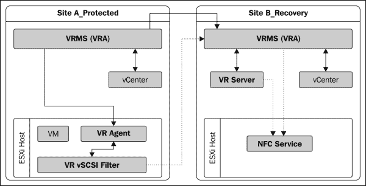

恢复站点是您计划保持来自受保护站点虚拟机副本的地方。它是您将发送复制流量的站点。vSphere Replication Appliances 通过 vSphere Web Client 提供复制管理接口，并作为插件注册到 vSphere Web Client 中。

从版本 5.1 开始的每个 ESXi 主机都内置了 vSphere Replication 代理，从而不再依赖于站点恢复管理器，并且不需要在每个 ESXi 主机上安装额外的包。

# 下载 vSphere Replication 包

vSphere Replication Server appliance 可作为 ISO 数据文件或压缩 ZIP 包下载，这两个包都包含了用于 vSphere Replication Appliance 和附加服务器的单独 OVF 文件。

**vSphere Replication Appliance**（**VRA**）包括一个 vSphere Replication 管理服务器和一个 vSphere Replication 服务器。它包含一个用于 vSphere Web Client 的插件，并且还使用 vPostgreSQL 嵌入式数据库。

要下载 ISO 或 ZIP 包，请按照以下步骤操作：

1.  访问 vSphere 下载页面：[www.vmware.com/go/download-vsphere](http://www.vmware.com/go/download-vsphere)。

1.  点击**转到下载**超链接，选择您许可模型下列出的**vSphere Replication 5.5**。

1.  当提示时，登录到您的**My VMware**账户。

1.  下载 ZIP 或 ISO 包。

# 部署 vSphere Replication Appliance

vSphere Replication Appliance 应该安装在您需要保护虚拟机的站点上。它可能不需要在保护站点和恢复站点都安装。仅当您打算将其与保护站点配对时，才需要在恢复站点部署 VRA。请参阅以下图示：

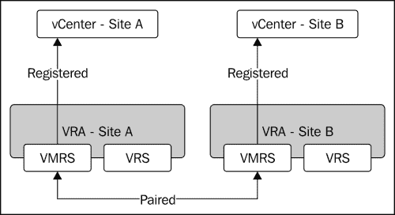

配对是通过将恢复站点添加为目标站点到保护站点的 VRMS 来完成的。有关如何实现这一点的信息，请参阅第五章中的*将远程站点添加为目标*部分，*配置和使用 vSphere Replication 5.5*。

每个站点可以通过 vSphere Replication 保护的虚拟机总数为 500。这个限制是针对每个 VRMS 的，并且每个站点只能注册一个 VRMS，因此 500 虚拟机的限制不能被突破。如果 VRMS 配对，则两个站点的虚拟机累计限制为 500，而不是 1000。要部署 vSphere Replication Appliances，您需要以下组件：

+   vCenter 5.5

+   与 vCenter Server 5.5 版本兼容的 ESXi 主机

+   下载的 vSphere Replication 5.5 套件。

设备的 OVF 可以使用**部署 OVF 模板**向导进行部署。向导可以从不同级别启动（vCenter 或数据中心或 ESXi）。我们将在 vCenter 级别进行，尽管这不是技术要求。请参阅以下步骤：

1.  解压（解压缩）下载的包，或者如果您下载的是 ISO 套件，则将 ISO 挂载到 vCenter Server 虚拟机或访问 vSphere 客户端的机器上。

1.  右键点击**vCenter Server**并选择**部署 OVF 模板**。请参阅以下截图：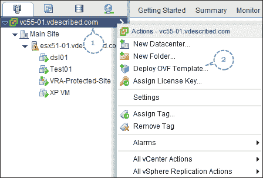

1.  在向导页面，设置源为**本地文件**，并点击**浏览**，如以下截图所示：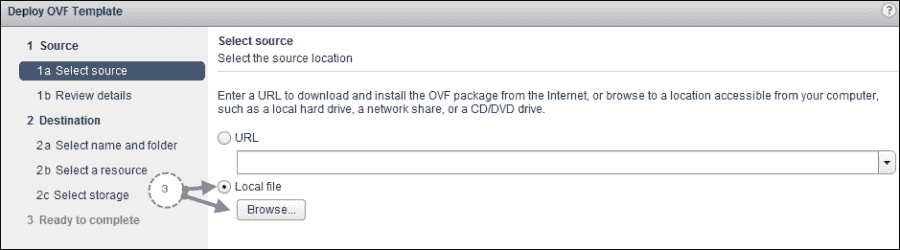

1.  转到解压后的包文件夹，然后进入`bin`子文件夹，如以下截图所示：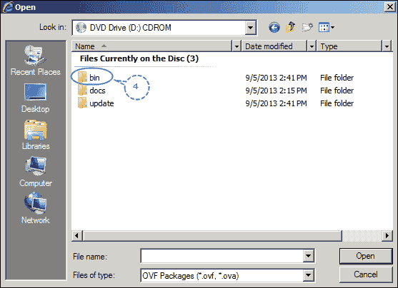

1.  选择 OVF 文件`vSphere_Replication_OVF10.ovf`并点击**打开**以选择并返回向导。请参阅以下截图：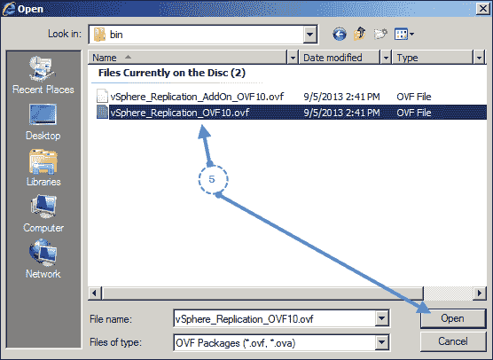

1.  在向导页面，点击**下一步**以继续。

1.  **查看详情**页面总结了设备的详细信息。点击**下一步**以继续。

1.  在 **许可协议** 屏幕上，选择 **接受** 接受许可，并点击 **下一步** 继续。

1.  为虚拟机提供一个名称，选择一个库存目标并点击 **下一步** 继续，如下截图所示：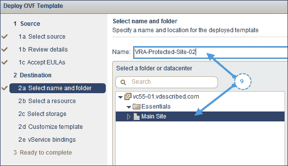

1.  选择虚拟机的计算位置。计算位置可以是一个 ESXi 主机或 ESXi 主机集群。选择完毕后，点击 **下一步** 继续。请参考下图：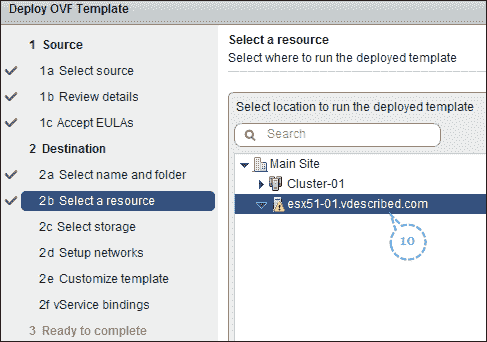

1.  选择 VMDK 类型和虚拟机的数据存储，并点击 **下一步** 继续，如下截图所示：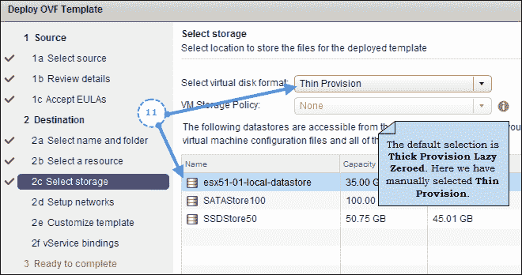

1.  为虚拟机的 vNIC 选择一个网络（端口组），并选择 IPv4 或 IPv6，以及 IP 分配策略（DHCP/静态）。我们选择了 **静态**，因此我们需要手动指定 DNS 服务器、子网掩码以及虚拟机所在子网的网关。完成后，点击 **下一步** 继续。请参考下图：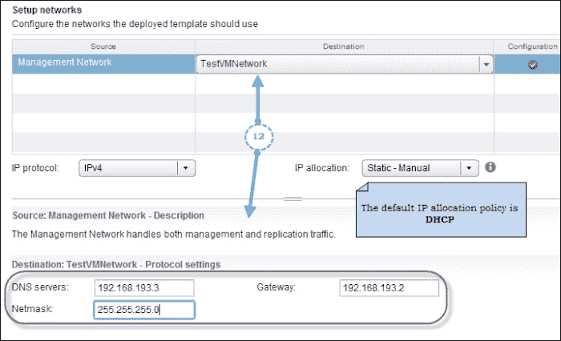

1.  设置设备的密码和静态 IP，如下截图所示。点击 **下一步** 继续。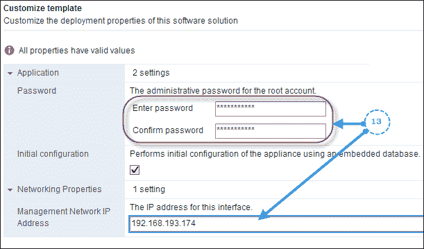

1.  下一屏将显示 vService 绑定的详细信息。这里无需修改任何内容，点击 **下一步** 继续。

1.  在 **准备完成** 屏幕上，检查设置并点击 **完成** 部署设备虚拟机。如果部署成功，你可以选择 **部署后开机** 复选框来启动虚拟机。

## 它是如何工作的？

部署完成后，设备将开机并完成初始配置，其中包括配置嵌入式数据库和注册 VRMS 到 vCenter Server 的过程。

你只能在一个 vCenter Server 上注册单个 VRMS 实例。这意味着你不能在一个站点部署多个 vSphere 复制设备。如果你这样做，设备将检测到已经有另一个设备注册到 vCenter Server，并会提示覆盖或关闭新部署的设备。以下截图展示了设备初始化时检测到另一个 VRA 的情况：

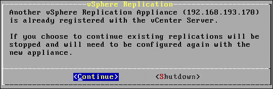

### 提示

如果选择 **继续** 选项，你应当关闭已经注册的 VR 设备。

然而，你可以部署多个 vSphere 复制服务器（附加组件）服务器设备，该设备不会初始化 VRMS 组件。附加组件服务器设备使用不同的 OVF 进行部署。

和其他 VMware 设备一样，VRS 设备也有一个基于网页的管理界面，可以访问该界面进行设备特定的配置任务。这个网页界面被称为**虚拟设备管理界面**（**VAMI**）。

你可以使用设备的 IP 地址，通过以下 URL 格式连接到其管理网页界面：`https://<IP address or FQDN>:5480`。

当你到达设备的登录页面时，使用 root 用户和在 OVF 部署向导中设置的密码登录。登录后，你将看到一个**入门**选项卡，这是**VR**选项下的子选项卡。你在**入门**选项卡下无法做太多事情。可用的其他子选项卡包括**配置**、**安全性**和**支持**。除非必要，否则我们不需要查看或更改这些子选项卡下的选项。

其他可用的主要选项卡包括**网络**、**更新**和**系统**。这些将在本章的后续部分进行介绍，需要访问这些选项卡。

# 为 VRA 设置主机名和 VRM 站点名称

虽然不是强制性的，但你可能需要为已部署的 vSphere 复制设备设置主机名和目标名称。

## VRA 主机名

设备的主机名可以通过设备的 VAMI 设置。部署后的默认主机名为 `localhost.localdom`，但可以进行修改。

以下步骤将指导你完成修改主机名所需的步骤：

1.  通过输入 `https://<IP address or FQDN>:5480` 作为 URL，连接到设备的 VAMI。

1.  使用 root 用户和在 OVF 部署向导中提供的密码进行登录。

1.  在**网络**菜单中的**地址**选项卡中进行导航。

    ### 提示

    在提供主机名之前，重要的是在 DNS 服务器上创建一个新的主机（*A*）记录。只有这样，你才能通过主机名连接到设备。

1.  在对应的输入框中提供一个**主机名**，然后点击**保存设置**，如以下截图所示：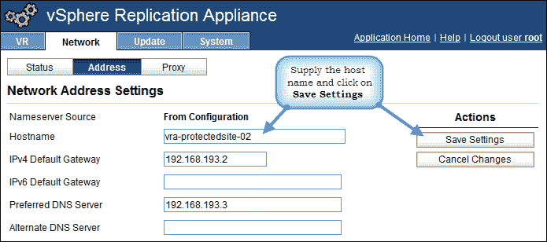

## VRM 站点名称

每个注册到 vCenter Server 的 VRM 服务器都会有一个站点名称。默认情况下，在设备的初始配置过程中，VRMS 注册到的 vCenter Server 的地址被设置为 VRM 站点名称。站点名称仅仅是一个显示名称，因此并不强制要求更改它。例如，注册到受保护站点 vCenter Server 的 VRMS 的 VRM 站点名称可以称为“受保护站点”。

以下步骤将指导你完成修改 VRM 站点名称所需的步骤：

1.  通过输入 `https://<IP address or FQDN>:5480` 作为 URL，连接到设备的 VAMI。

1.  使用 root 用户和在 OVF 部署向导中提供的密码进行登录。

1.  在**VR**选项下导航到**配置**选项卡。

1.  使用对应的输入框修改**VRM 站点名称**，然后通过点击**保存并重启服务**来重启 VRM 服务，如下图所示：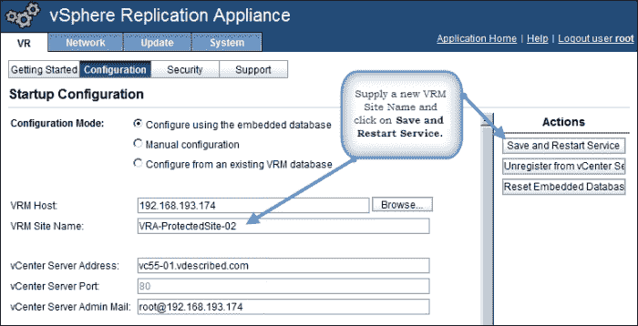

### 注意

有时，设备保存设置并重启 VRM 服务可能需要一段时间。

# 配置 SQL 数据库以供 VRMS 使用

vSphere 复制设备默认初始化默认的嵌入式 vPostgreSQL 数据库。所有初始配置数据和复制配置数据将存储在嵌入式数据库中。因此，在为虚拟机配置复制之前，规划数据库类型是很重要的。因为如果你将 VRMS 组件重新配置为使用外部数据库，那么你将丢失现有的复制配置信息。你需要重新配置虚拟机的复制。外部数据库的备份和恢复更为简便，因为你只需要备份数据库文件。如果你计划备份嵌入式数据库，那么你需要备份整个设备。

要了解哪些版本的 SQL Server 受支持，可以使用**解决方案/数据库互操作性**过滤器，在**VMware 产品互操作性矩阵**网页上查看。你可以通过访问[`www.vmware.com/in/guides.html`](http://www.vmware.com/in/guides.html)的**VMware 兼容性指南**来进入该门户，并点击**产品互操作性矩阵**的超链接。

在 VMware 产品互操作性矩阵网页门户中，选择**解决方案/数据库互操作性**，选择**VMware vSphere 复制**作为 VMware 产品，选择**5.5**作为**版本**。然后，你可以从列表中选择一个数据库并验证其兼容性。参见下图：

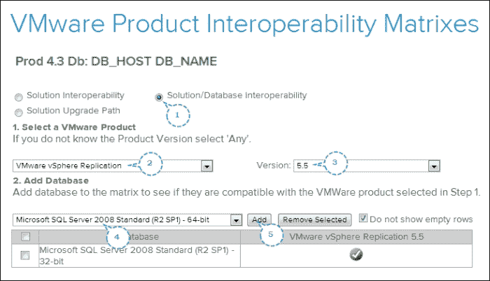

以下步骤将引导你完成配置 VRMS SQL 数据库所需的过程：

1.  登录到你的数据库服务器并启动**Microsoft SQL Server Management Studio**。

1.  在**对象资源管理器**窗口中，右键点击**数据库**，然后点击**新建数据库**，如下图所示：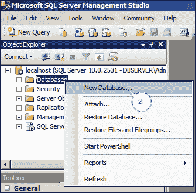

1.  在**新建数据库**窗口中，提供**数据库名称**并保持其他属性为默认值，然后点击**确定**。参见下图：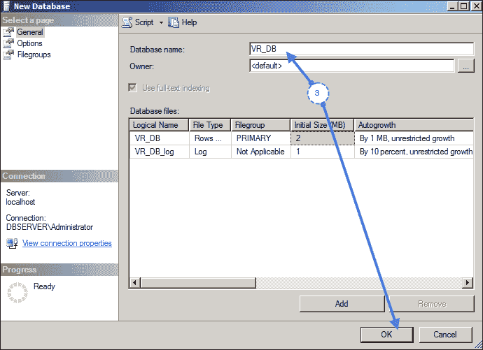

1.  在**对象资源管理器**窗口中，展开**安全性**，右键点击**登录名**，然后点击**新建登录名**，如下图所示：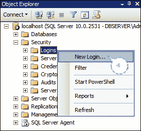

1.  在**登录-新建**窗口中，选择**SQL Server 身份验证**，提供**登录名**，设置密码，并取消选择**强制密码策略**，这将使其他两个密码策略（**用户下次登录时必须更改密码**和**强制密码过期**）失效。

1.  将**默认数据库**设置为新创建的 vSphere Replication 数据库，并点击**确定**。请参考以下截图：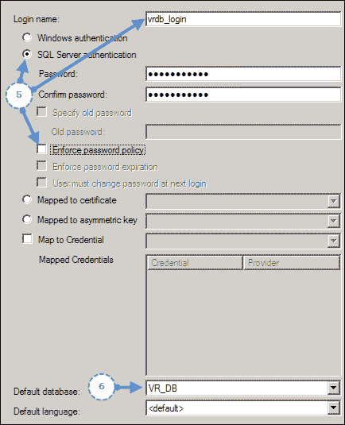

    ### 提示

    在本例中，我们创建了名为 `VR_DB` 的数据库，因此应将默认数据库更改为 `VR_DB`。

1.  在**对象资源管理器**窗口中，展开**数据库**，右键单击新数据库（`VR_DB`），然后点击**属性**，如以下截图所示：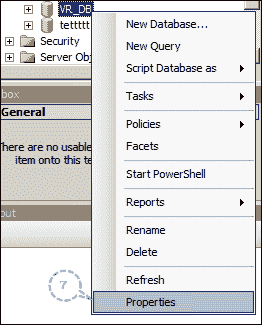

1.  在**数据库属性**窗口中，选择**文件**页面，并将数据库**所有者**更改为您创建的登录名，如以下截图所示：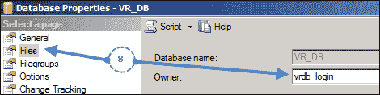

1.  在同一窗口中，选择**选项**页面，将**恢复模型**更改为**简单**。请参考以下截图：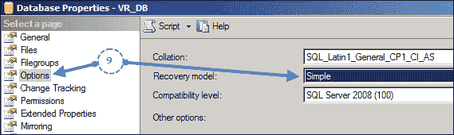

1.  点击**确定**关闭**数据库属性**窗口。

1.  现在，通过输入 URL `https://<IP 地址或 FQDN>:5480` 连接到 vSphere Replication Appliance 的 VAMI。

1.  使用 root 用户和密码登录。

1.  导航到**VR**菜单下的**配置**选项卡。

1.  将**配置模式**设置为**手动配置**。

1.  将**数据库类型**设置为**SQL Server**。

1.  提供**数据库主机**，它可以是数据库服务器的地址（FQDN/IP）。

1.  按照以下截图所示，指定**数据库用户名**、**数据库密码**和**数据库名称**：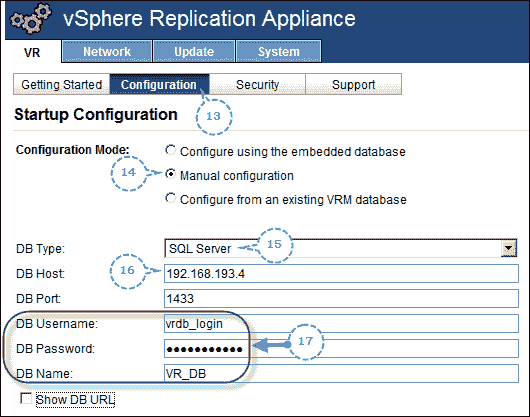

1.  点击**保存并重启服务**。

点击**保存并重启**将保存新设置并重启 vSphere Replication 管理服务。由于需要一些时间准备数据库，完成过程可能会稍长。一旦完成，您需要重新配置虚拟机上的复制。

# 部署 vSphere Replication 服务器

与 vSphere Replication Appliances 不同，您可以使用在下载的 vSphere Replication 部署包中提供的附加设备部署额外的 vSphere Replication 服务器。每个 vCenter Server 实例最多可以部署 10 个 VR 服务器设备。部署额外 VR 服务器有多个使用场景，其中之一是手动负载分配。每个 VR 服务器在默认的 512 MB 内存配置下最多可以处理 100 个复制。如果复制的虚拟机超过 100 台，您可以选择增加设备的内存，或者部署额外的设备，通过将复制流量分配到不同的设备来进行负载均衡。

以下步骤将指导你完成部署额外 VR 服务器的过程：

1.  在 vSphere Web 客户端的首页，点击**vSphere Replication**，打开 vSphere Web 客户端的 vSphere Replication 界面，如下所示：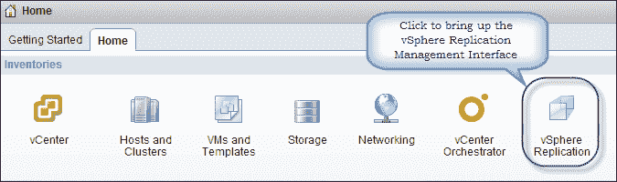

1.  此页面将列出 VRMS 注册的 vCenter Server。点击工具栏项**管理**，这将弹出该 vCenter Server 的**管理**标签页，并选择**vSphere Replication**子标签。参见以下截图：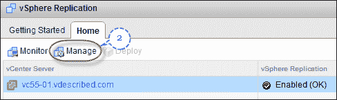

1.  选择左侧窗格中的**复制服务器**，查看已注册的 VR 服务器列表。

1.  导航至**操作** | **所有 vSphere 复制操作** | **部署 VR 服务器**，打开**部署 OVF 模板**向导，如下所示：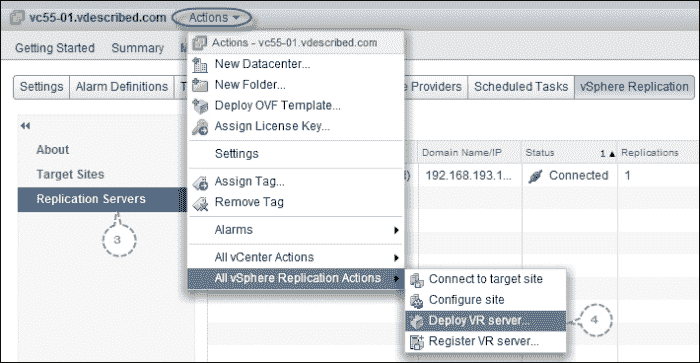

1.  设置源为**本地文件**，然后点击**浏览**。

1.  导航到`vSphere replication bundle`文件夹，再进入`bin`子文件夹。选择`OVF vSphere_Replication_AddOn_OVF10.ovf`并点击**打开**返回向导页面。

1.  点击**下一步**继续。

1.  **审核详细信息**页面将总结 OVF 模板的详细信息。请注意，描述中写着**附加 vSphere 复制服务器**。点击**下一步**继续。参见以下截图：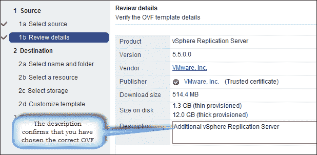

1.  提供虚拟机设备的名称和库存位置，点击**下一步**继续。

1.  接受许可协议并点击**下一步**。

1.  提供虚拟机的名称并选择计算位置。计算位置可以是 ESXi 主机集群或单个 ESXi 主机。点击**下一步**继续。

1.  设置预期的磁盘格式并选择一个数据存储来存放虚拟机文件。默认选项是**厚配置懒清零**。点击**下一步**继续。

1.  选择一个网络（端口组）为虚拟机的 vNIC，选择 IPv4 或 IPv6，并选择 IP 分配策略（**DHCP/静态**）。这里我们选择了**静态**。因此，需要手动指定 DNS 服务器、子网掩码以及虚拟机所在子网的网关。点击**下一步**继续。

1.  设置密码和静态 IP 地址，点击**下一步**继续。

1.  在**准备完成**页面，检查设置并点击**完成**以部署虚拟机。你可以勾选**部署后开机**选项，如果部署成功，则启动虚拟机。

一旦 VRS 部署完成，你需要将 vSphere 复制服务器注册到 VRMS。有关如何操作的说明，请阅读以下部分。

# 注册 vSphere 复制服务器

部署的 vSphere Replication 服务器应该注册到 VRMS，才能用于处理复制流量。有关如何部署 vSphere Replication 服务器的说明，请阅读本章中的 *部署 vSphere Replication 服务器* 部分。

以下流程将指导您完成注册 vSphere Replication 服务器所需的步骤：

1.  从 vSphere Web Client 的主页上，点击 **vSphere Replication** 以打开 vSphere Web Client 的 vSphere Replication 界面。

1.  该页面将列出 VRMS 注册的 vCenter Server。点击工具栏项 **Manage**，将打开该 vCenter Server 的 **Manage** 标签页，并选择 **vSphere Replication** 子标签。

1.  选择左侧窗格中的 **Replication Servers**，查看已注册的 VR 服务器列表。

1.  导航到 **Actions** | **All vSphere Replication Actions** | **Register VR server**，以打开 **Register vSphere Replication Server** 窗口。参考以下截图：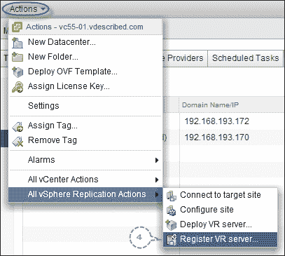

1.  浏览 vCenter 库存，找到新部署的 VR 设备虚拟机。

1.  点击 **Virtual Machine** 以高亮显示，然后点击 **OK** 确认选择，如下图所示：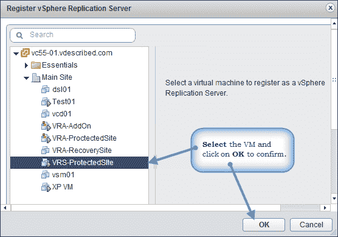

1.  一旦注册成功，它应该出现在 **Replication Servers** 页面中，如下图所示：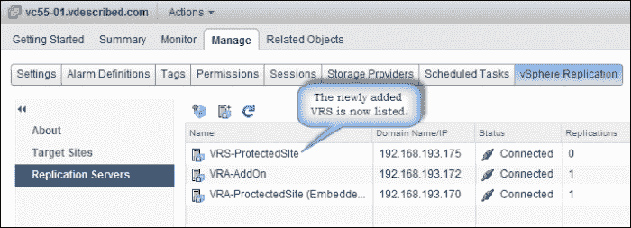

# 总结

本章介绍了如何部署和准备 vSphere Replication 环境。在下一章中，我们将学习如何复制和恢复虚拟机。
