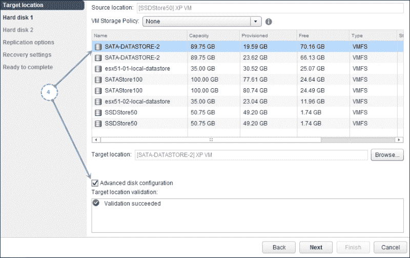

# 第五章：配置和使用 vSphere 复制 5.5

在上一章中，我们学习了如何部署构建 vSphere 复制环境所需的组件。现在，时机已到，我们将进一步探讨。在本章中，我们将学习复制是如何工作的，以及虚拟机复制涉及哪些配置任务。

我们将涵盖以下主题：

+   将远程站点添加为目标

+   配置虚拟机复制到本地站点

+   配置虚拟机复制到远程站点

+   复制是如何工作的？

+   使用复制种子

+   监控复制任务

+   重新配置复制任务

+   更改目标数据存储

+   暂停正在进行的复制任务

+   立即同步数据

+   停止虚拟机的复制任务

+   将复制任务迁移到另一个 VR 服务器

+   恢复虚拟机

+   配置虚拟机的故障恢复

+   配置 SRM 使用 vSphere 复制

# 将远程站点添加为目标

可以将远程 vCenter Server 添加为目标之一。当两个站点由不同的 vCenter Server 管理时，配对是强制性的。因为受保护站点的 vCenter 上注册的 VRM 服务器只能看到注册到该服务器的 VR 服务器。你可以在任一站点部署多个 VR 服务器，但只有它们注册到本地 VRM 服务器时才能使用。如果管理远程站点的 vCenter Server 上没有注册 VRMS，则无法进行配对。请参阅下图：

添加目标站点时，系统会提示你指定管理该目标站点的 vCenter Server 的地址（FQDN/IP）和连接凭据。大多数环境中，vSphere 各组件之间使用的是不同的账户。这个账户也可以是对应于该组件的服务账户。在这种情况下，你可以使用对应于你正在添加为目标站点的 vCenter Server 的服务账户。在这里，vCenter Server 作为代理与注册到目标站点的 VRM 服务器进行通信。一旦连接成功，VRM 服务器将作为目标站点列出。

### 注意

VRM 服务器的默认站点名称是它注册的 vCenter Server 的名称。这可以在 VRA 的 Web 界面下的 **配置** 选项卡中进行更改。

以下过程将引导你完成将目标站点添加的步骤：

1.  从 vSphere Web Client 的主页，点击 **vSphere 复制**，以打开 vSphere Web Client 的 vSphere 复制界面，如下所示：

1.  本页面将列出 VRMS 服务器已注册的 vCenter 服务器。点击工具栏项**管理**，这将打开该 vCenter 服务器的**管理**标签页，并选择**vSphere 复制**子标签。

1.  点击左侧面板中的**目标站点**，列出所有当前的目标站点。

1.  导航到**操作** | **所有 vSphere 复制操作** | **连接到目标站点**，打开**连接到目标站点**窗口，如下图所示：

1.  提供管理目标站点的 vCenter 服务器的地址（FQDN/IP）及其连接凭据，然后点击**确定**。尽管以下截图显示使用的是管理员账户，建议使用一个单独的账户：

1.  完成后，注册到已添加 vCenter 的 VRM 服务器应该作为目标站点列出。

# 将虚拟机复制到本地站点的配置

复制可以跨站点进行，也可以在同一站点内进行。如果选择将要保护的虚拟机复制到同一站点的存储数据存储区，那么也可以使用 vSphere 复制来实现相同的效果。

配置复制需要在目标站点有一个可用的复制服务器（VRS）。由于您已经部署了一个包含 VRMS 和 VRS 组件的 vSphere 复制设备，因此无需额外的步骤即可使复制在本地站点工作。

以下步骤将指导您完成配置虚拟机复制所需的步骤：

1.  在清单中右键点击虚拟机，导航到**配置复制**标签页下的**所有 vSphere 复制操作**，如下图所示：

1.  选择本地站点作为目标站点，然后点击**下一步**。

1.  现在，您将有一个选项，可以手动选择 VR 服务器来传输复制流量，或者让 VRMS 进行选择。高亮显示您想要使用的 VR 服务器，并点击**下一步**。

1.  选择一个存储数据存储区，您希望将虚拟机的副本放置在该存储区。可选地，选中**高级磁盘配置**选项的复选框，然后点击**下一步**。

1.  选择虚拟磁盘格式并点击**下一步**继续。

    ### 注意

    每个与配置复制的虚拟机相关联的 VMDK 都会提示您做出选择。

1.  选择来宾操作系统的冻结方法。目前唯一可用的冻结方法是 Microsoft VSS。

1.  设置计划的**恢复点目标（RPO）**值。默认值为**4**小时，最低值为**15**分钟，最高为**24**小时。你还可以通过选中复选框启用快照的保存点。默认情况下，它会创建**3**个时间点实例，且在过去**5**天内创建的实例会被保留。你最多只能保留**24**个时间点的复制快照。如果你想保持多个可恢复点的虚拟机，时间点快照会非常有用。做出选择并点击**下一步**继续。参见下图：

1.  在**准备完成**屏幕上，检查设置并点击**完成**以配置复制。

1.  **最近任务**窗格应显示任务**配置虚拟机以进行复制**已成功完成。

# 配置虚拟机到远程站点的复制

你可以将虚拟机复制配置到可以访问远程站点的数据存储。为此，你需要在远程站点配置一个 vSphere 复制服务器组件。为了使远程站点可访问，你需要将该服务器添加为目标站点。有关更多信息，请阅读本章中的*添加远程站点作为目标*部分。

以下步骤将指导你完成将虚拟机复制到远程站点所需的配置过程：

1.  添加远程站点 vCenter 作为目标站点。请阅读本章中的*添加远程站点作为目标*部分以获取操作说明。

1.  右键点击虚拟机并在**所有 vSphere 复制操作**中选择**配置复制**选项卡。

1.  选择远程目标站点并点击**下一步**。

1.  你现在可以选择手动选择一个 VR 服务器来传递复制流量，或者让 VRMS 自动选择。做出选择并点击**下一步**。

1.  选择一个数据存储位置来存放虚拟机的副本。

1.  选择**高级磁盘配置**复选框并点击**下一步**。

1.  选择虚拟磁盘格式并点击**下一步**以继续。系统会提示你为每个与虚拟机复制配置相关的 VMDK 做出选择。

1.  选择来宾操作系统的冻结方法。目前唯一可用的冻结方法是 Microsoft VSS。

1.  设置计划的 RPO 值。默认值为 4 小时，最低值为 15 分钟，最高值为 24 小时。

1.  你还可以通过选择复选框来启用快照中的保存点。默认情况下，它会创建三个时间点实例，并且会保留过去五天内创建的这些实例。你最多只能保留 24 个时间点快照。创建预定的区域后，点击**下一步**继续。

1.  在**准备完成**屏幕上，检查设置并点击**完成**以配置复制。

1.  **最近任务**窗格应显示任务**为复制配置虚拟机**并成功完成。

无论虚拟机配置为复制到本地站点还是远程站点，复制过程都相同。请阅读以下章节以获得更多了解。

# 复制是如何工作的？

在成功配置虚拟机的复制后，它首先会将源 VMDK 进行初始全量同步到目标数据存储。如果你已经将基础 VMDK 复制到目标数据存储中，那么只会复制更改的块。复制通过网络使用**网络文件复制**（**NFC**）协议进行。更改的块通过 ESXi 的管理 VMkernel 端口组进行传输。

初始同步完成后，VR 代理使用 vSCSI 过滤驱动程序跟踪已更改的块。它跟踪、写入并维护已更改块的位图。每次创建副本时，传输的数据都会复制到重做日志文件中。这样做是为了确保在网络中断时恢复站点上的虚拟机不会损坏。只有在更改的块完全复制后，重做日志才会提交到基础磁盘，从而确保每个副本都具有崩溃一致性。当你为虚拟机配置复制时，你可以选择 RPO 和你希望保留的多个时间点快照的数量。RPO 的范围从 15 分钟到 24 小时，你最多可以保留 24 个时间点快照。这意味着你可以保留最多 24 个复制虚拟机的历史时间点恢复点。

RPO 和时间点实例的数量决定了为虚拟机保留的历史快照数量。例如，如果你设置了 2 小时的 RPO，那么你每天将保留 12 个时间点恢复点。如果 RPO 设置为 2 小时，并且时间点实例数量设置为 4，那么你将只保留 4 个快照。VR 会尽量保留创建的最旧的恢复点。

一旦复制配置成功，目标数据存储中将填充以下文件：

+   `*.vmdk`：这是虚拟机数据正在复制到的基础磁盘。

+   `hbrdisk.RDID-*`：这是包含最新复制数据的重做日志文件。

+   `hbrcfg*.vmx`：这是一个影像 VMX 文件，用于在启动恢复时注册虚拟机。

以下截图显示了副本虚拟机目录的内容：

复制如何工作？

### 注意

如果正在复制的虚拟机通过添加新的 VMDK 进行修改，则活动复制将停止并报错。管理员应手动重新配置复制以包括新的 VMDK，并恢复复制。

# 使用复制种子

当你第一次为虚拟机配置复制时，vSphere 复制将需要对虚拟机的 VMDK 文件进行初始复制。初始复制可能会消耗大量带宽并且耗时，这取决于 VMDK 的大小。我们可以通过在配置虚拟机复制之前，先将 VMDK 文件传输到目标位置来克服这个问题。传输方法可以根据需要选择，理想情况下，如果是远程的，可以通过快递将其送达目的地站点。

### 注意

传输并放置在目标数据存储中的 VMDK 文件副本被称为种子文件。

以下步骤将指导你如何使用可用的种子文件来为虚拟机配置复制：

1.  关闭源（受保护）站点上你打算复制的虚拟机。

1.  将虚拟机的文件夹复制到目标数据存储。如果它位于不同的数据中心，则需要先将文件传输到数据中心，然后再上传到目标数据存储。

1.  在源（受保护）站点上打开虚拟机。

1.  右键点击清单中的虚拟机，并导航到**所有 vSphere 复制操作**中的**配置复制**标签。

1.  选择目标站点并点击**下一步**。

1.  你现在可以选择手动选择一个 VR 服务器来传递复制流量，或者让 VRMS 自动选择。做出相应选择后，点击**下一步**。

1.  选择一个数据存储以放置虚拟机的副本，并将**目标位置**设置为目标数据存储中与源虚拟机副本对应的文件夹。为此，点击**浏览**按钮，打开**选择目标位置**窗口，如下图所示：使用复制种子

1.  **选择目标位置**窗口将帮助你浏览选定的数据存储。定位并选择种子虚拟机的文件夹，然后点击**确定**以确认选择并返回复制配置向导。使用复制种子

1.  点击**下一步**继续。

1.  会显示一条**复制种子确认**消息，告知已找到 VMDK 文件的副本，要求你确认是否将它们用作种子。点击**是**以确认。使用复制种子

    如果被复制的虚拟机有多个 VMDK，并且每个 VMDK 的副本都被找到，则会为每个 VMDK 显示一条**复制种子确认**消息，如下图所示：

    使用复制种子

1.  选择虚拟磁盘格式后，点击**下一步**继续。如果正在复制的虚拟机有多个 VMDK，则会提示选择每个 VMDK 的磁盘格式。

1.  选择一个来宾操作系统静默方法。

1.  设置计划的 RPO 值。

1.  你可以选择**启用多个时间点快照**，并指定希望保留的时间点数。做出计划选择后点击**下一步**继续。

1.  在**准备完成**屏幕上，检查设置并点击**完成**以配置复制。

1.  **最近任务**窗格应该显示**配置虚拟机进行复制**任务已成功完成。

无论你是否选择使用种子，vSphere 复制总是会启动初始的完整同步。使用种子的情况下，初始的完整同步将花费相对较少的时间。

# 监控复制

配置在虚拟机上的复制可以监视其当前状态。复制可以是传入的或传出的。

以下过程将指导你完成监控复制所需的步骤：

1.  连接到 vCenter Server 并导航到库存主页。

1.  点击**vSphere 复制**以打开 vSphere 复制主页。

1.  点击**监控**以转到监控选项卡，选择**vSphere 复制**子选项卡。

1.  在左侧窗格中，你将看到选中**传出复制**和**传入复制**。

    ### 注意

    **传出复制**部分将显示当前站点 VR 服务器上所有离开的复制，**传入复制**部分将显示所有到达当前站点 VR 的复制。

1.  选择**传入复制**或**传出复制**将列出正在复制的虚拟机的名称及复制的当前状态。

1.  在**监控**选项卡中，你将获得重新配置、暂停、同步、停止和移动正在进行的复制的选项。关于这些任务的更多信息已在本章的单独部分中详细说明。

# 重新配置复制

正在进行的复制可以重新配置。这通常发生在需要更改正在使用的复制服务器、目标数据存储或恢复设置时。

以下过程将指导你完成重新配置复制所需的步骤：

1.  连接到 vCenter Server 并导航到库存主页。

1.  点击**vSphere 复制**以打开 vSphere 复制主页。

1.  点击**监控**以转到监控选项卡，选择**vSphere 复制**子选项卡。

1.  在左侧窗格中，你将看到选中**传出复制**和**传入复制**。根据你所在的是本地还是远程 vCenter Server 做出适当选择。

1.  选择所需的复制项，并点击**操作**菜单中的**重新配置**选项，启动重新配置向导，如下截图所示：

1.  如果需要，可以更改复制服务器来处理流量。点击**下一步**继续。

1.  选择新的目标数据存储（如果需要），然后点击**下一步**继续。

1.  修改**复制选项**（如果需要），然后点击**下一步**继续。

1.  修改**恢复设置**（如果需要），然后点击**下一步**继续。

1.  查看**准备完成**屏幕，点击**完成**以启动重新配置。

# 更改目标数据存储

您可以通过重新配置复制来更改正在进行的复制的目标数据存储。这样做将导致当前目标数据存储中的文件被删除，并且会对新目标数据存储位置执行初始完整同步。

以下过程将指导您完成更改正在进行的复制的目标数据存储所需的步骤：

1.  连接到 vCenter Server 并导航至库存主页。

1.  点击**vSphere 复制**以打开 vSphere 复制主页。

1.  点击**监控**，进入监控标签页，并选择**vSphere 复制**子标签。

1.  在左侧窗格中，您将看到选中的**出站复制**和**入站复制**。根据您处于本地还是远程 vCenter Server，做出相应的选择。

1.  选择复制项并点击**操作**菜单中的**重新配置**选项，以启动重新配置向导。

1.  选择一个复制服务器来处理流量。在此案例中，我们选择了本地 VRA。点击**下一步**继续。

1.  选择新的目标数据存储。如下截图所示，**目标位置验证**窗口将弹出，并显示一个警告，指示现有副本将丢失。点击**下一步**继续。

    ### 注意

    如果虚拟机有多个 VMDK 文件，将会出现多个提示，要求选择目标数据存储。

1.  不要修改**复制选项**，然后点击**下一步**继续。

1.  不要修改**恢复设置**，然后点击**下一步**继续。

1.  查看**准备完成**屏幕，点击**完成**以启动重新配置。

1.  您应该会在**最近任务**窗格中看到**重新配置虚拟机复制**任务，且已成功完成。

1.  状态应该显示为**初始完整同步**。如果到新位置的初始完整同步成功完成，状态将变为**正常**。

# 暂停正在进行的复制

无论复制状态如何，都可以暂停正在进行的复制。暂停复制将停止 VR 跟踪 VMDK 文件的更改。以下过程将指导您完成暂停正在进行的复制所需的步骤：

1.  连接到 vCenter 服务器并导航至库存主页。

1.  点击**vSphere Replication**以打开 vSphere Replication 主页。

1.  点击**监控**进入监控标签页，并选择**vSphere Replication**子标签。

1.  在左侧窗格中，你将看到选中了**外向复制**和**内向复制**。根据你是在本地 vCenter 服务器还是远程 vCenter 服务器，做出相应的选择。

1.  选择你要暂停的复制，并在**操作**菜单中点击**暂停**选项，如下图所示：

1.  在确认窗口中点击**是**。

1.  一旦复制成功停止，状态应显示为**已暂停**。

在暂停正在进行的复制时，VR 服务器将暂时停止监控源虚拟机。暂停的复制可以通过执行相同的步骤恢复，但在**操作**菜单中选择**恢复**选项作为第五步。

# 立即同步数据

同步是将源虚拟机中已更改的块通过 vSphere Replication Server 组件传输到目标副本的过程。vSphere Replication 根据 RPO 设置同步数据。如果 RPO 设置为 4 小时，则同步每 4 小时进行一次。

然而，我们确实有一个选项可以强制立即同步，方法是使用**立即同步数据**选项，该选项可以通过**监控**标签中的工具栏图标或通过操作菜单中的**立即同步**选项来访问。这两个选项启动相同的任务。

以下步骤将指导你完成启动即时数据同步的操作：

1.  连接到 vCenter 服务器并导航至库存主页。

1.  点击**vSphere Replication**以打开 vSphere Replication 主页。

1.  点击**监控**进入监控标签页，并选择**vSphere Replication**子标签。

1.  在左侧窗格中，你将看到选中了**外向复制**和**内向复制**。根据你是在本地 vCenter 服务器还是远程 vCenter 服务器，做出相应的选择。

1.  选择你要暂停的复制，并在**操作**菜单中点击**立即同步**标签，如下图所示：

1.  你应该能在**最近任务**窗格中看到**同步虚拟机**任务已成功完成。

# 停止虚拟机上的复制

如果需要，你可以选择停止虚拟机上的复制。停止复制将永久停止该复制并删除所有副本。通常，这个操作是为了移除虚拟机的复制。

以下步骤将指导你完成停止虚拟机复制的操作：

1.  连接到 vCenter 服务器并导航至库存主页。

1.  点击**vSphere Replication**以打开 vSphere Replication 主页。

1.  点击**监控**，进入监控标签页，并选中**vSphere 复制**子标签。

1.  如果虚拟机位于受保护站点，请选择**外发复制**；如果虚拟机位于恢复站点，请选择**入站复制**；如果虚拟机与源站点位于同一站点，选择其中任一项。

1.  选择复制任务，右键点击并点击**停止**菜单项，如以下截图所示：

1.  系统将提示你确认选择。点击**是**以确认。请参考以下截图：

1.  **最近任务**窗格应显示两个任务，**禁用虚拟机的复制**和**取消虚拟机复制配置**，并标记为成功完成。

1.  **外发复制**或**入站复制**部分将不再列出已停止的复制任务。

# 将复制任务移至另一个 VR 服务器

如果需要，你可以选择将一个活跃的复制任务移至另一个 vSphere 复制服务器。这通常在恢复站点有多个 VR 服务器时进行，以便将复制负载分配到这些服务器上。将复制移至另一个 VR 服务器时，需要重新配置虚拟机的复制。

以下步骤将指导你完成将复制任务移至另一个 VR 服务器所需的操作：

1.  连接到 vCenter Server 并导航到库存主页。

1.  点击**vSphere 复制**以打开 vSphere 复制主页。

1.  点击**监控**，进入监控标签页，并选中**vSphere 复制**子标签。

1.  选择**外发复制**或**入站复制**。

1.  选择复制任务，右键点击并点击**移动到**菜单项，如以下截图所示：

1.  现在，系统将显示一个注册到虚拟机被复制到的站点的 vSphere 复制服务器列表。选择一个并点击**确定**。请参考以下截图：

1.  **最近任务**窗格应显示**将复制任务移至其他 VR 服务器**的任务，并标记为成功完成，状态应显示为**OK**。

# 恢复虚拟机

现在我们已经描述了如何为虚拟机配置复制，如果我们不涵盖如何使用虚拟机的副本恢复虚拟机，这个故事将还不完整。恢复操作仅能在目标站点执行。换句话说，只有在接收到入站复制的站点，你才会看到开始恢复的选项。

以下步骤将指导你完成执行恢复所需的步骤：

1.  连接到管理远程站点的 vCenter Server 并导航到库存主页。

    ### 提示

    如果仅有一个 vCenter Server 管理保护和恢复站点，则 vSphere Replication 的**监控**标签将显示该虚拟机的所有传出和传入复制。

1.  点击**vSphere Replication**，打开 vSphere Replication 主页。

1.  点击**监控**，进入监控标签，并选择**vSphere Replication**子标签。

1.  从左侧窗格中选择**传入复制**，然后选择您想要恢复的虚拟机。

1.  选择虚拟机后，右键点击并选择**恢复**。

1.  系统将提供恢复选项：**使用最近更改恢复**和**使用最新可用数据恢复**。选择所需的选项后，点击**下一步**继续。有关这些选项的更多信息将在本节末尾介绍。请参阅以下截图：

1.  选择您打算放置虚拟机的 datacenter/文件夹。只能选择虚拟机被复制到的 datacenter。请参阅以下截图：

    ### 提示

    您不能将恢复的虚拟机放置在与源虚拟机相同的清单层级中。通常的做法是，在数据中心层级下创建一个文件夹，以容纳恢复的虚拟机。

1.  点击**下一步**继续。

1.  选择计算资源（集群/主机/资源池），然后点击**下一步**。

1.  如果源数据存储中仍有剩余文件，系统将提示您进行覆盖。点击**是**确认。

1.  点击**下一步**继续。

1.  在**准备完成**屏幕上，您可以通过取消选中**恢复后启动虚拟机**复选框，选择不启动恢复后的虚拟机。默认情况下该选项是选中的（勾选）。点击**完成**开始恢复。

1.  **最近任务**窗格应显示一个**恢复虚拟机**任务，并标记为成功完成。虚拟机的复制状态将显示为**已恢复**。

恢复成功后，清单应显示已恢复的虚拟机，并且虚拟机已启动。

## 使用最近更改恢复

此选项将启动立即同步，以确保恢复后的虚拟机拥有最新数据。然而，如果源虚拟机正在运行，则无法执行此操作。您需要手动关闭虚拟机才能继续。

## 使用最新可用数据恢复

此选项将使用创建的最新重做日志进行恢复。在这种情况下，您将丢失源虚拟机自上次复制以来所做的所有更改。数据丢失量不会超过设置的 RPO。例如，如果 RPO 设置为 15 分钟，则您只会丢失 15 分钟的数据。

# 配置虚拟机的故障恢复

使用 vSphere 复制时，配置虚拟机的故障恢复是一个手动过程。以下过程将引导你完成执行故障恢复所需的步骤：

1.  将虚拟机恢复到恢复站点。有关说明，请参阅 *恢复虚拟机* 部分。

1.  从保护站点的清单中删除虚拟机。

1.  配置从恢复站点到保护站点的外发复制。有关说明，请参阅 *将虚拟机复制到远程站点* 部分。

在将复制配置从恢复站点到保护站点时，如果保护站点的 datastore 中已有虚拟机文件，则可以将其用作种子；否则，将执行初始的全量同步。

### 提示

可以使用站点恢复管理器（SRM）自动化故障转移。

# 配置 SRM 以利用 vSphere 复制

作为独立产品，vSphere 复制无法自动化灾难恢复任务，如测试、故障转移或故障恢复。可以使用 SRM 将 vSphere 复制作为复制引擎，并利用其编排功能来自动化灾难恢复任务。请参见以下图示：

SRM 依赖于两个站点的概念，它们通过复制引擎相互复制数据。因此，你需要由两个不同的 vCenter 服务器分别管理的两个站点。这两个 vCenter 服务器都应注册有一个 VRMS 实例。这意味着，你需要在两个站点上部署 **vSphere 复制设备**（**VRA**）。部署完 VRA 后，使用保护站点上的 vSphere Web 客户端的 vSphere 复制界面，将恢复站点添加为目标站点。有关如何添加目标站点的更多信息，请阅读 *将远程站点添加为目标* 部分。现在，为了让 SRM 检测到两个站点上注册的 vSphere 复制设备，你需要安装与 SRM 安装程序捆绑的 vSphere 复制组件。如果你已经安装了 SRM，可以运行安装程序来修复安装并安装 vSphere 复制组件。安装 vSphere 复制组件后，SRM 界面应显示 vSphere 复制。

使用 SRM 执行的所有灾难恢复任务已在涵盖 SRM 基于阵列复制的章节中解释。尽管这些灾难恢复任务非常相似，但工作流程有所不同。

在本节中，我们将涵盖以下任务：

+   创建 vSphere 复制保护组

+   创建 vSphere 复制恢复计划

+   测试 vSphere 复制恢复计划

+   执行故障转移（恢复）

+   执行故障恢复（重新保护和故障转移）

## 创建 vSphere 复制保护组

你需要为希望通过 vSphere 复制保护的虚拟机创建一个保护组。与基于阵列的复制不同，你可以选择任何启用复制的虚拟机作为保护组的一部分。

执行以下步骤：

1.  导航到 vCenter 服务器的库存主页，点击**站点恢复**。

1.  点击左侧面板中的**保护组**。

1.  点击**创建保护组**以启动**创建保护组**向导。

1.  在向导中，选择**保护组类型**为**vSphere 复制（VR）**，然后点击**下一步**继续。

1.  下一屏幕将显示所有启用复制的虚拟机列表。选择你希望包含在保护组中的虚拟机，然后点击**下一步**继续。

1.  为保护组提供一个名称和可选描述，然后点击**下一步**继续。

1.  在**准备完成**屏幕上，点击**完成**以创建保护组。

你现在应该在**最近任务**面板中看到**创建保护组**和**保护虚拟机**任务已成功完成。在**恢复站点**，你应该看到为我们添加到保护组中的虚拟机创建了一个**影像虚拟机**。

## 创建 vSphere 复制恢复计划

一旦保护组创建完成，下一步是创建恢复计划。

执行以下步骤：

1.  导航到 vCenter 服务器的库存主页，点击**站点恢复**。

1.  点击左侧面板中的**恢复计划**，然后点击**创建恢复计划**，以启动**创建恢复计划**向导。

1.  默认情况下，远程站点被选为恢复站点。点击**下一步**继续。

1.  选择类型为 VR 的保护组。请注意，如果有基于阵列的保护组，本窗口也会显示它们。因此，请确保选择类型为 VR 的保护组，并点击**下一步**继续。

1.  选择**恢复网络**和**测试网络**。如果打算使用 SRM 为测试创建的临时 vSwitch 和端口组，可以将**测试网络**保持为**自动**；否则，可以选择你为测试创建的其他端口组。点击**下一步**继续。

1.  提供一个**恢复计划名称**和可选描述，然后点击**下一步**继续。

1.  在**准备完成**屏幕上，查看选项并点击**完成**以创建恢复计划。

你应该在**最近任务**面板中看到**创建恢复计划**任务已成功完成。

## 测试 vSphere 复制恢复计划

任何你创建的恢复计划都应该定期测试，以确保在需要时能够进行灾难恢复。

执行以下步骤：

1.  导航到 vCenter 服务器的库存主页，点击**站点恢复**。

1.  在左侧窗格中点击**恢复计划**，并选择一个 vSphere 复制保护组的计划。

1.  点击**测试**按钮以启动**测试向导**。

1.  默认情况下，**复制最新更改到恢复站点**的复选框已被选中。保持选中状态并点击**下一步**以继续。

1.  在下一个屏幕上，查看选项并点击**开始**以开始测试操作。

恢复步骤的进度可以在**恢复步骤**选项卡中进行监控。

### 注意

确保在测试完成后运行清理操作。

## 执行恢复或计划迁移

在保护站点发生灾难时，或者需要进行计划迁移时，我们可以使用 SRM 的恢复选项来运行恢复计划，以执行其中的任何任务。计划迁移和灾难恢复在是否需要复制最近更改方面有所不同。计划迁移必须能够复制最近的更改才能继续进行，而灾难恢复即使无法复制最近的更改，也会继续进行。

无论使用的复制引擎是什么，过程都是相同的。请参考第三章中的*执行计划迁移*和*执行灾难恢复（故障切换）*部分。

恢复操作总是从恢复站点进行。一旦启动，将启动新的同步以复制最近的更改。一旦完成，受保护的虚拟机将被关闭，复制状态将更改为“已恢复”。

## 执行故障切换（重保护和故障切换）

在故障切换后，你可以按相反的顺序启用虚拟机的保护，这是通过执行重保护操作来实现的。请参考下图：

一个重保护将会逆转复制的方向。现在，在原始保护站点变得可操作后，你可以选择切换回原始站点。这是通过在成功的重保护操作后发起故障切换来实现的。一旦故障切换完成，复制状态将设置为“已恢复”，并且不会有任何活动的复制。要重新启用原始方向的复制，你需要再次执行重保护操作。

# 摘要

在上一章中，你学习了如何设置 vSphere Replication 环境，并使用它来配置虚拟机的复制。我们还学习了如何停止或暂停正在进行的复制，以及如何将复制负载转移到另一个 vSphere Replication 服务器上。更重要的是，我们学习了如何从副本中恢复虚拟机。在本章中讨论的大多数与复制相关的活动都是按虚拟机逐个进行的，这也是当 vSphere Replication 作为独立解决方案实施时你所能做的全部。接着，我们学习了如何配置 vCenter Site Recovery Manager，以利用 vSphere Replication 并执行灾难恢复任务。
