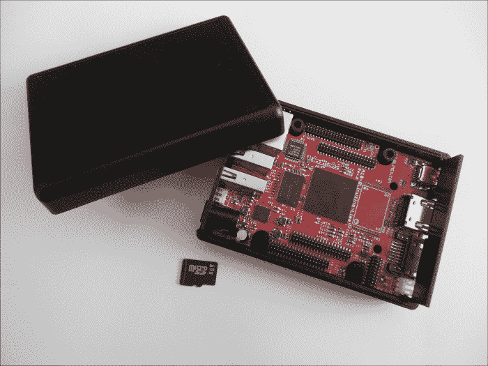
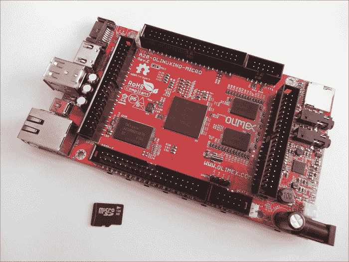
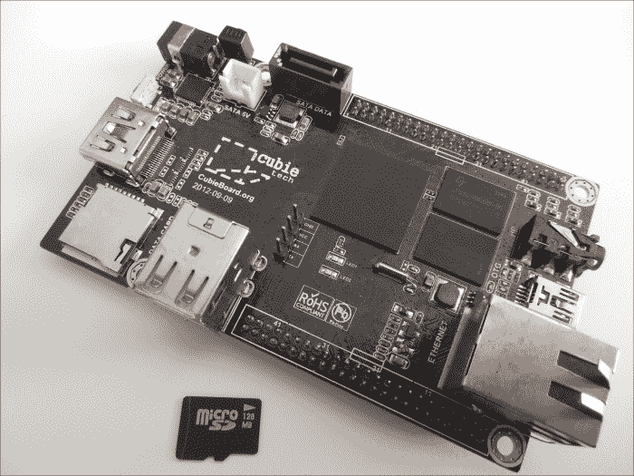
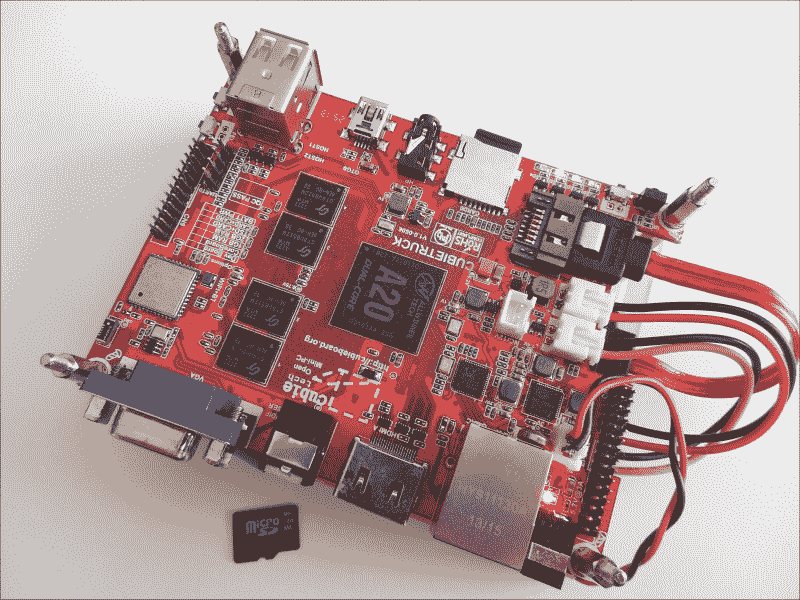
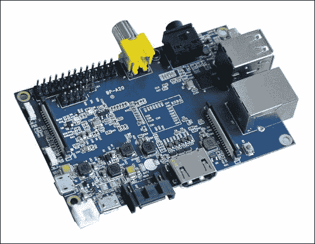
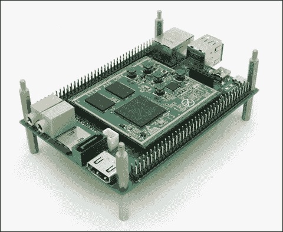
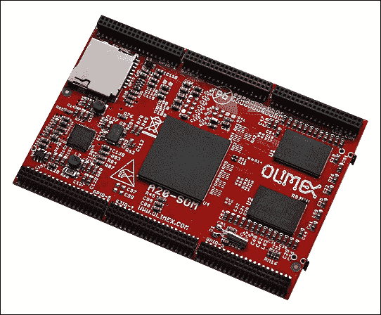
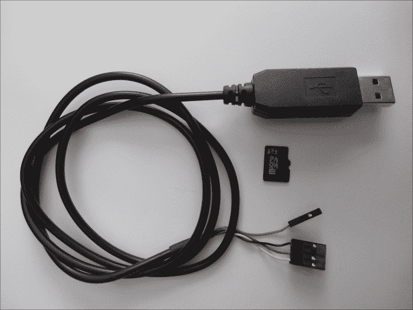
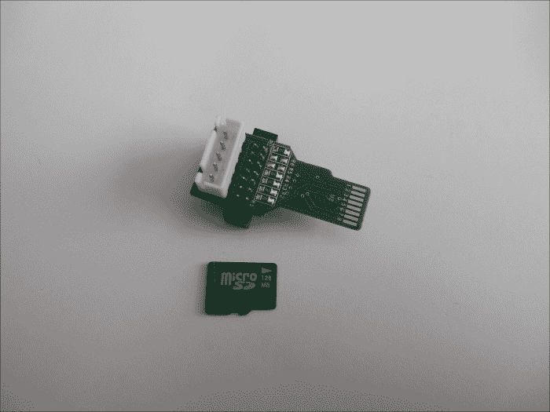

# 第一章. 选择合适的开发板

又到了每年这个时候，几天的空闲时间让你迫不及待地想玩一玩大家都在谈论的新 ARM 开发板。然而，市面上有很多开发板可供选择。在众多选择中，应该选择哪款板子呢？选择开始工作的开发板可能会在后续产生很大影响，因此本章提供了各种开发板的介绍，并指出它们之间的主要区别。虽然本书的重点确实是 Cubietech 的 Cubieboard 系列，但为了有可能选择第二块开发板，仍然建议阅读本章。此外，本书同样适用于这里提到的这些开发板。

在本章的第一部分，我们将涵盖以下主题：

+   为什么会有这么多开发板可供选择？

+   各种开发板概览

+   突出介绍最受欢迎的开发板

+   需要额外硬件的建议

# 穿越可用的芯片和开发板的丛林

在进行 ARM 开发时，有许多芯片和更多的开发板可以选择。本章还简要介绍了各种芯片，并进行了比较。

## 芯片概览

在过去的几年里，基于 ARM 的**系统级芯片**（**SoC**）变得极为流行。与传统的基于 x86 的英特尔或 AMD CPU 相比，它们更加节能，同时性能也足够满足需求。它们还集成了许多外设，如**图形处理单元**（**GPU**）、**视频加速器**（**VPU**）、音频控制器、各种存储控制器以及各种总线（如 I2C 和 SPI）等。这大大减少了开发板所需的组件数量。随着所需组件的减少，带来了一些显而易见的优势，例如降低成本，从而使得开发板的设计变得更加简单。因此，许多拥有电子工程师的公司能够以低廉的成本设计和生产这些开发板。

那么，有这么多开发板，是否意味着有许多 SoC 呢？实际上确实有不少，但为了简洁，以下只列出了最受欢迎的几款：

+   全志的 A 系列

+   博通的 BCM 系列

+   飞思卡尔的 i.MX 系列

+   联发科的 MT 系列

+   瑞芯微的 RK 系列

+   三星的 Exynos 系列

+   NVIDIA 的 Tegra 系列

+   德州仪器的 AM 系列和 OMAP 系列

+   高通的 APQ 系列和 MSM 系列

尽管许多潜在的芯片都很有趣，但 Allwinner 的 A 系列 SoC 将是本书的重点。由于它们价格低廉且供应充足，许多公司围绕这些芯片设计开发板，并以低价销售。此外，A 系列目前是最友好的开源芯片系列。它有一个完全开源的引导加载程序，几乎所有硬件都可以通过开源驱动程序支持。在 A 系列芯片中，有一些选择。以下是最常见且最有趣的设备列表：

+   **A10**：这是 A 系列的第一款芯片，也是支持最好的芯片，因为它已经存在很长时间。它能够通过 I2C、SPI、MMC、NAND、数字和模拟视频输出、模拟音频输出、SPDIF、I2S、以太网 MAC、USB、SATA 和 HDMI 与外界进行通信。最初，这款芯片面向所有设备，如手机、平板电脑、机顶盒和迷你 PC 棒。其 GPU 采用 MALI-400。

+   **A10S**：这款芯片继承了 A10，主要面向 PC 棒市场，并省略了若干部分，例如 SATA 和模拟视频输入/输出，并且没有 LCD 接口。省略这些部分是为了降低芯片成本，使其在廉价电视棒中具有吸引力。

+   **A13**：这款芯片大致与 A10S 同时推出，主要用于平板电脑。它没有 SATA、以太网 MAC，也没有 HDMI，从而进一步降低了芯片的成本。

+   **A20**：这款芯片在其他芯片之后很久才推出，并且与 A10 具有引脚兼容性，旨在替代 A10。正如名字所示，A20 是 A10 的双核版本。ARM 核心略有不同，A10 采用的是 Cortex-A7，而以前使用的是 Cortex-A8。

+   **A23**：这款芯片是在 A31 和 A31S 之后推出的，设计上与 A31 相似。它采用双核 Cortex-A7 设计，旨在替代 A13。它主要用于平板电脑。

+   **A31**：这款芯片具有四个 Cortex-A7 核心，通常具有 A10 所具备的所有连接功能。然而，由于它采用 PowerVR GPU，至今没有得到社区支持，因此在社区中不太受欢迎。此外，目前没有常见的开发板可用。

+   **A31S**：这款芯片在 A31 之后稍微推出，解决了一些 A31 存在的问题。目前没有常见的开发板可用。

## 选择合适的开发板

Allwinner 的 A 系列 SoC 由于价格便宜而被许多公司应用于产品中，例如平板电脑、机顶盒，最终还用于开发板。在开发板可用之前，人们主要在平板电脑和机顶盒上进行开发。最常见和流行的开发板来自 Cubietech 和 Olimex，部分原因是这两家公司向社区开发者免费提供开发板。

### Olimex

Olimex 发布了大量不同的开发板和外设。许多开发板是开源硬件，提供了原理图和布局文件，而且 Olimex 对开源非常友好。你可以在下图中看到 Olimex 开发板：

Olimex 提供了 A10-OLinuXino-LIME，这是一款基于 A10 的微型开发板，主要以与著名的 Raspberry Pi 在价格上竞争为目标。由于其体积较小，它使用了较少标准的 1.27 毫米间距引脚，但几乎所有的引脚都暴露出来供使用。

你可以在下图中看到 A10-OLinuXino-LIME 开发板：

Olimex OLinuXino 系列开发板有 A10、A13 和 A20 三种版本，并且配备了更为标准的 2.54 毫米间距引脚，这些引脚兼容旧版 IDE 和串口连接器。Olimex 还提供了多种传感器、显示器和其他外设，这些外设也与这些引脚兼容。

Olimex 最近宣布将发布一个 **模块化系统**（**SoM**）。它的概念与稍后提到的 Itead 开发板相同。

### Cubietech

Cubietech 由前 Allwinner 员工创办，是首批使用 Allwinner SoC 的开发板之一。虽然它不是开源硬件，但提供了原理图供下载。Cubietech 发布了三款开发板：Cubieboard1、Cubieboard2 和 Cubieboard3，也被称为 Cubietruck。与这些板的接口可能会比较棘手，因为它们使用 2 毫米间距的引脚，这些引脚在欧洲或美国可能比较难找。你可以在下图中看到 Cubietech 开发板：

Cubieboard1 和 Cubieboard2 使用相同的开发板，唯一的区别是 Cubieboard2 使用了 A20，而不是 A10。这些开发板仅暴露了部分引脚。你可以在下图中看到 Cubietruck 开发板：

Cubietruck 与前几款板有所不同，它是一款设计良好的 A20 开发板。它具备了前几款开发板的所有功能，并且增加了千兆以太网、VGA、蓝牙、Wi-Fi 和光学音频输出。尽管如此，它的成本也相对较高，因为它为了保持较小的尺寸，减少了引脚数量。与 Raspberry Pi 或 LIME 相比，它几乎是其两倍大小。

### Lemaker

Lemaker 在发布其 Banana Pi 开发板时做出了一个聪明的设计选择。它是一块基于 Allwinner A20 的开发板，但使用与 Raspberry Pi 相同的板尺寸和连接器布局，因此得名 Banana Pi。由于这一点，许多 Raspberry Pi 的外壳都可以适配 Banana Pi，甚至一些扩展板也能使用。然而，在软件上，它有很大的不同，不能使用 Raspberry Pi 的镜像文件。但它具有复合视频输出、立体声音频输出、HDMI 输出、千兆以太网、两个 USB 端口、一个 USB OtG 端口、CSI 输出和 LVDS 输出，并且还有一些引脚可供使用。它还提供了 LiPo 电池连接器、SATA 连接器和两个按钮，但这些可能在很多标准外壳上无法访问。请看以下图片，了解 Banana Pi 的顶视图：

### Itead 和 Olimex

Itead 和 Olimex 都提供了有趣的开发板，值得单独提及。Iteaduino Plus 和 Olimex A20-SoM 是非常有趣的概念；它们是计算模块，这是一块包含 SoC、内存和闪存的板，这些模块可以插入，并配有独立的主板。它们都提供非常完整的开源硬件主板，但任何人都可以设计自己的主板，并购买计算模块。你可以看到以下 Itead 提供的开发板：

请参考 Olimex 提供的以下板：

# 额外的硬件

虽然开发板是一个关键组成部分，但还有一些其他必需的配件。例如，电源并不总是提供的，而且有一些考虑因素。此外，初步通信和调试还需要额外的硬件。

## 串行接口与开发板连接

对于像这样的无头系统，事情并不总是能顺利进行。有时，需要在更低层次上进行调试。对于这些开发板，情况也正是如此。当发生错误且没有输出时，可能出了什么问题呢？因此，避免花费数小时的反复试验是可能的；许多类型的硬件上都有老式而可靠的串口。对于 Allwinner 的 SoC，它们的串口实现有两种方式。

### 通用异步接收器/传输器

在本书中讨论的所有开发板上，都有专门的引脚可以连接到芯片的串口。如果用于连接开发板的 PC 有串口，要小心连接方式。尽管它们使用相同的协议，但它们的工作电压不同，因此至少需要一个电平转换器。如今大多数 PC 已经没有串口了，需要依赖 USB 转 **通用异步接收器/传输器** (**UART**) 适配器。在购买 USB 到 UART 适配器时，重要的是选择 3.3V TTL 适配器。Cubieboard 通常会配备 USB 到 UART 适配器，如下图所示：

### microSD 适配器

有时，UART 端口可能无法使用，像大多数平板电脑一样。在这种情况下，通过 microSD 卡槽提供第二个 UART 接口。需要特定的适配器来连接之前提到的 UART 接口。在下面的图片中，可以看到一个 microSD 到 UART 适配器（该特定版本还能够访问 JTAG 引脚）：

### microSD 卡

通常，microSD 卡是这些开发板的启动介质。它可以被视为类似于 PC 上的可启动 CD 或 USB 驱动器。当创建 microSD 卡作为启动介质时，建议使用 Class 10 或更快的 microSD 卡。

### 电源

信不信由你，大多数开发板实际上是不包含电源的，这通常是由于以下原因：

+   没有电源的开发板无需通过 FCC 认证。

+   进口电源可能需要特定的本地认证，甚至可能被禁止。

+   它可能引发开发者不清楚需要为某个国家提供哪种电源的问题。

+   这样可以降低成本，因为不附带电源就减少了成本。

大多数开发板的输入电压为 5 伏，但它们至少应提供 700 毫安的电流，当不使用大功耗设备（如硬盘或液晶显示器）时。如果连接了额外的外设，这一要求也会增加。一个适当的 5 伏、2 安的电源就足以在满载情况下为开发板供电，且连接了液晶显示器时也能正常工作。根据硬盘的电力需求，甚至这类电源也应能顺利工作。如果不确定，请始终检查电力消耗或电源稳定性，以排除其造成异常问题的可能性。市场上便宜的电源通常会被过度标定，因此它们可能无法提供所需的电流，进而导致系统不稳定。

# 总结

在完成本章内容后，你应该对现有的、流行的开发板有所了解，并能判断哪一款可能适合你。最后需要指出的是，有时额外的硬件是必须的，或者至少对于使用这些开发板非常有帮助。

下一章将介绍如何使用新购买的硬件，并解释如何与其进行交互。如果所选的开发板预装了软件，也会涉及到启动过程。
