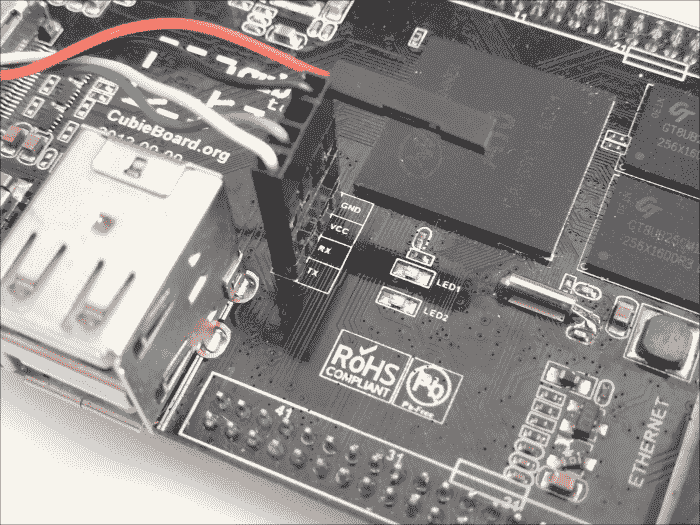
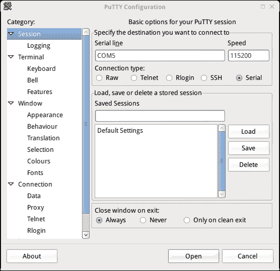
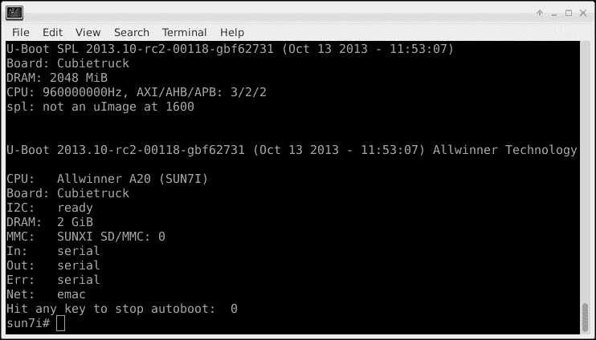

# 第二章：硬件入门

当你开始使用一款新设备时，可能会有一些问题浮现在脑海中。如何判断它是否正常工作？如何从设备获取输出或向设备输入，比如从显示器获取视频或从键盘输入按键？这些可能是当开发板首次拆开或启动时最基本的问题。

本章将涵盖以下内容：

+   将串口连接到开发板

+   启动预装的软件

# 连接串口

串口可能看起来像是过时的设备，但实际上在某些设备上仍然非常常见。其主要原因之一是它非常简单且可靠。它在硬件和软件实现上都很简单，正因为简单，它通常非常可靠，几乎总是能够正常工作——这也是它自六十年代起一直被应用于设备的原因。然而，串口连接速度较慢，但对于基于文本的输入输出，它完全足够。然而，为什么一开始会想要使用串口呢？正如墨菲定律所证明的那样，事情往往会出错，而对于这些开发板来说，串口往往是唯一能够提供输出的接口。

连接串口或 UART 到设备有两种方式，要么使用 USB 转 UART 适配器，要么使用真实的串口并加装电平转换器以将电压转换为合适的电压。

由于大多数个人电脑实际上没有串口，本章将仅讨论 USB 转串口的方式。第一步是将 USB 转 UART 适配器连接到你的 Cubieboard，这本身可能就是一个挑战，因为有些 USB 转 UART 适配器只有三根线，而有些则有四根甚至更多。此外，电缆的颜色可能因产品不同而有所不同。最后，还有 3.3 伏或 5 伏的适配器。请查看电缆的用户手册，了解每根线的颜色对应的信号以及电压是否为 3.3 伏。例如，Cubieboard 随附的 USB 转串口适配器遵循以下规则：

+   黑色是 GND 或接地，连接到 GND 引脚

+   绿色是 TX 或发送端，连接到开发板上的 RX 或接收端引脚

+   白色是 RX 或接收端，连接到开发板上的 TX 或发送端引脚

+   红色是 VCC 或电源，永远不应连接，否则设备可能会损坏

请参考下面的图像查看各种连接方式：

Cubieboard1 上的 UART 连接

连接好 UART 端后，另一端可以直接插入 USB 端口。根据使用的操作系统，可能需要安装驱动程序；此外，还需要一个程序来连接此串口，这样就创建了一个所谓的串口终端。PuTTY 就是这样一个程序，并且它可以在大多数操作系统上使用。Windows 平台上的下载地址为[`www.chiark.greenend.org.uk/~sgtatham/putty/download.html`](http://www.chiark.greenend.org.uk/~sgtatham/putty/download.html)。

其他操作系统可能通过内置的软件商店提供该软件，并可以通过此方式安装。其他可用的软件类型，如 GNU Screen 或 minicom，也能同样有效地用于查看串口控制台。

要使串口通信正常工作，需要一些参数；需要 115,200 位每秒的波特率。此外，可能需要八个数据位、无校验位和一个停止位（通常简称为 8n1），但在前面提到的 PuTTY 或默认的 screen 中，可能可以省略。对于 screen，可以使用`screen /dev/ttyUSB0 115200`命令行，假设`/dev/ttyUSB0`是正在使用的串口。

### 提示

查找正确的设备名称或编号可能会有些棘手；这不仅因操作系统不同而有所不同，而且获取正确的编号也可能很复杂。例如，在 Linux 和 OSX 下，插入 USB 转换器后使用`dmesg`或在`/dev/ttyUSB`上使用自动完成功能可能会有所帮助。在 Windows 上，可以使用设备管理器。

对于 PuTTY，以下截图展示了所需的设置，假设`COM5`是串口。确保选中**串口**：

如果串口连接已正确建立，给 Cubieboard 供电后，串口控制台应该会显示文本。以下截图展示了此文本的示例。在此，通常安装在 microSD 卡上的引导加载程序被显示。首先加载的是 SPL，它探测内存并打印当前的 CPU 配置，接下来是 U-Boot，它打印当前的配置。请查看以下截图：

上面的截图仅是示例。这会根据所使用的引导加载程序、启动介质和板子而有所不同。它仅展示了首次启动时可能看到的内容。

# 启动预安装的软件

当 Cubieboard 首次开机时，会发生一些事情。首先，SoC 会检查各种设备，看是否能从中启动。如果可用，板载的 NAND 闪存很可能已由制造商预先编程。使用任何预安装的系统启动 Cubieboard 都有其意义。它允许你检查 Cubieboard 是否正常运行。

如果 Cubieboard 没有预安装操作系统或 NAND 闪存，可以使用专门准备的 microSD 卡。由于 microSD 卡实际上是 SoC 尝试启动的第一个设备，因此它应该能产生类似的结果。拥有这样一张卡片是非常有用的。接下来的章节将向你展示如何准备这样的 SD 卡。预安装的操作系统很可能需要连接显示器、键盘和鼠标以便与之交互。虽然大多数版本预安装了 Android 操作系统，但也有一些情况下安装的是命令行版本的 Linux。使用预安装的 Android 操作系统，可以轻松测试各种组件。使用以下清单测试最明显的项目：

+   显示器是否正常工作？

+   鼠标是否正常工作？

+   键盘是否正常工作？

+   网络连接是否正常工作？

+   音频播放是否正常？

+   MMC 卡是否正常工作？

在测试显示器是否正常工作时，图像可能已配置为与其他外设一起使用，而不是预期的那些。例如，可能预期连接 HDMI 显示器，而实际上连接的是 VGA 显示器。音频也是如此，可能被路由到 HDMI，而实际上通过音频插孔连接的是普通耳机。

对上述清单进行检查在命令行安装下更具挑战性，但并非完全不可能。显示器和键盘的测试相对容易。甚至网络功能也应该能被检测到。具备一些基础 Linux 知识后，前面提到的所有组件都能轻松测试。

### 提示

为了让网络几乎自动配置，建议在网络上设置一个 DHCP 服务器。大多数调制解调器/路由器或无线接入点默认提供此功能。

# 总结

学会如何连接和使用串口后，你现在应该能够观看 Cubieboard 启动并使用预安装的软件检查系统是否正常运行。

在下一章中，你将最终开始进行一些实际的工作，也就是，你将设置一个完整的桌面系统。
