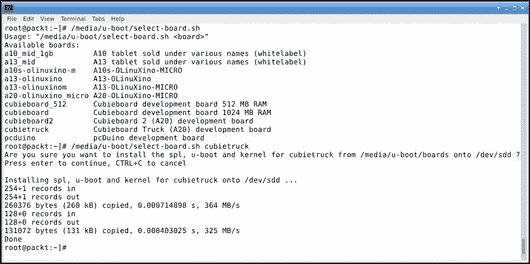
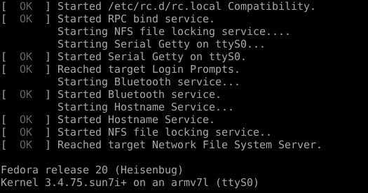
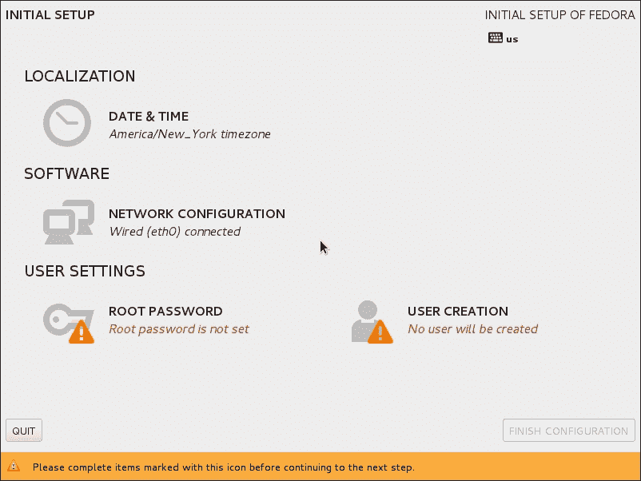
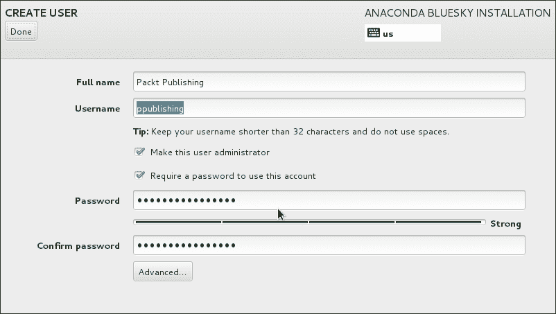
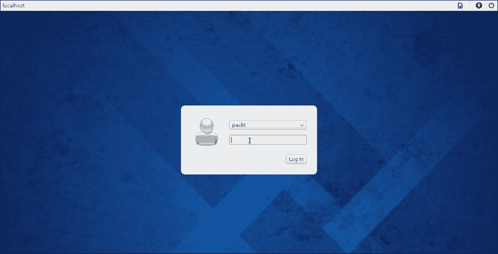
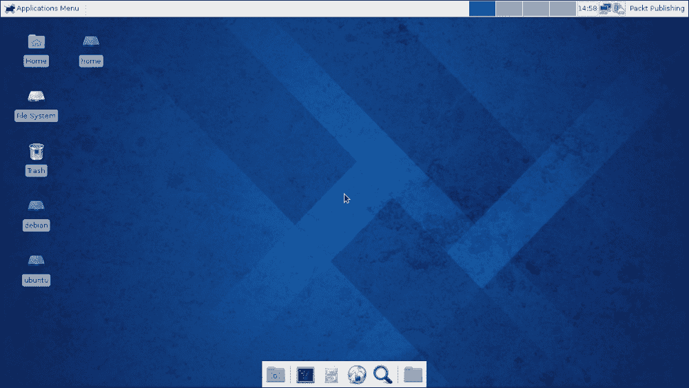
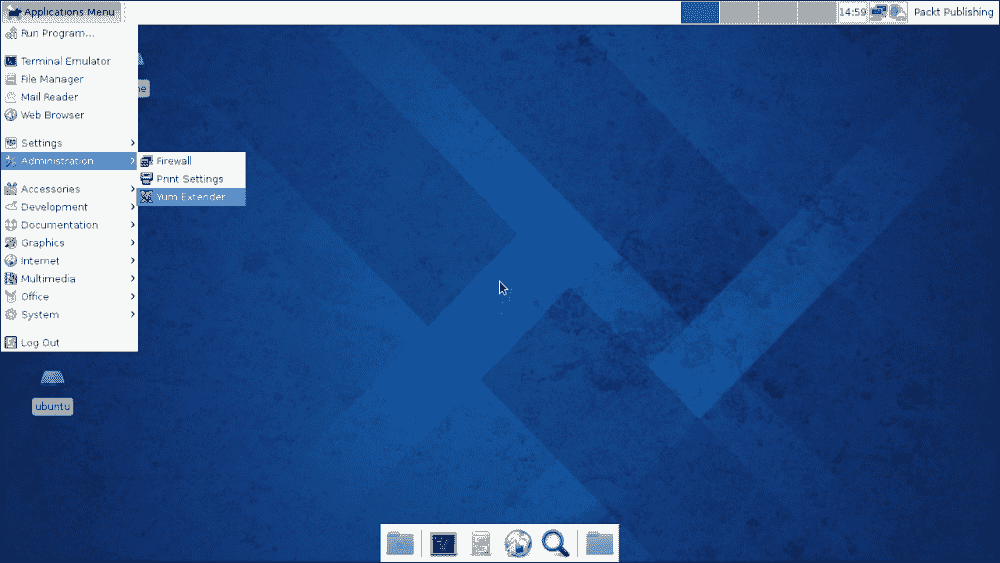
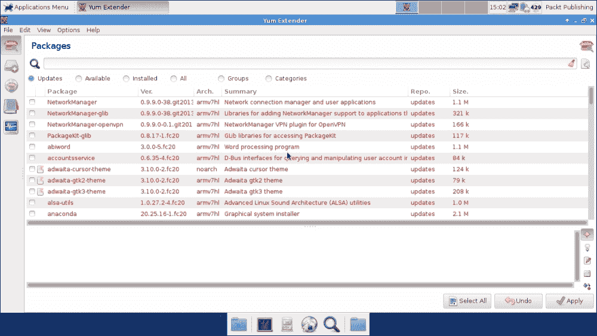
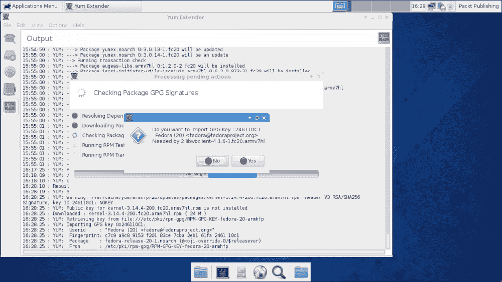
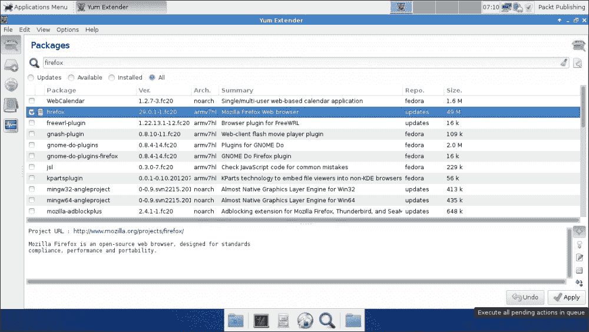

# 第三章：安装操作系统

拥有一个 Cubieboard 只有在你能够实际使用并最终开发和/或玩弄它时才有意义。预装的操作系统可能足够，也可能不够。通常，这些设备上预装的是 Android，因为所使用的 SoC 通常出现在 Android 设备中，且制造商大多或仅支持它。虽然 BSD 或 Minix 也是由不同开发者开发的操作系统，但本书将仅限于 Linux 作为操作系统。本章的前几节将为教育目的深入探讨相关概念。

本章将涵盖以下主题：

+   找出 SoC 芯片决定从哪个地方启动

+   操作系统镜像与干净安装的区别

+   下载并安装 Fedora

+   从 SD 卡启动新安装的操作系统

+   使用 Fedora 并连接有线网络的基本概念

+   通过软件包管理器维护 Fedora

# 启动 Cubieboard

尽管看起来系统只是简单地启动了，但实际情况远不止如此。Allwinner 系列的 SoC 有一个叫做**Boot Read Only Memory**（**BROM**）的东西。BROM 实际上是一个嵌入到芯片中的小程序，它总是首先执行。这个程序包含了一些驱动程序，用于支持最小集的硬件，以确保其小巧简洁。

首先，BROM 会尝试在第一个 SD 卡中查找有效的引导加载程序，这个 SD 卡也叫做 MMC 插槽。如果那里没有找到有效的引导加载程序，就会检查 NAND 是否有有效的引导加载程序。同样，如果那里也没有找到，就会检查第二个 MMC 插槽。如果那里也没有找到，则会探测第一个 SPI 总线是否有 SPI 内存闪存芯片，并检查是否有有效的引导加载程序。最后，如果前面的所有方法都失败了，就会进入 FEL 模式。FEL 模式是一种恢复模式，可以通过 USB 连接上传一段代码并执行它。这对于在启动失败且第一个 MMC 插槽无法启动时恢复板子非常有用。FEL 模式不需要手动启动。有人可能会疑惑为什么要探测两个 MMC 插槽。有时，制造商会在设计中集成一个嵌入式 MMC 芯片，或者 eMMC，它与 SD 或 MMC 卡不同，外观看起来像常规芯片，类似于 NAND 闪存芯片，但行为和外观像 MMC 卡。通过探测两个 MMC 插槽，可以使板子使用 eMMC 芯片，同时仍然有第一个 MMC 插槽可供像启动恢复这样的用例使用。Cubietruck 有多种这些存储选项的组合。

# 操作系统镜像安装背景

许多网站和论坛在讨论嵌入式设备的安装时会提到固件或 ROM。这一切听起来一开始非常神秘，但事实远非如此。ROM 不过是一个完整的磁盘映像，而这个映像可以写入存储设备，板子可以从中启动。*ROM*这个名称来源于数据曾经存储在 ROM 芯片中的事实。许多为 Allwinner 开发板提供的操作系统镜像都针对非常特定的开发板量身定制。这并不令人惊讶，因为所使用的芯片可能在多个开发板中是相同的，但某些附加外设可能完全不同；例如，一个开发板可能使用不同的内存芯片。另一个开发板可能没有板载闪存，完全依赖于第二个 MMC 槽来存储操作系统。几乎不可能有一个单一的磁盘镜像能够适用于所有这些不同硬件组合，因此干净的安装看起来是一个相当合理的方式。虽然一些发行版正在慢慢开始支持基于 ARM 的系统，但要有一个通用的安装程序能够安装到任何基于 ARM 的开发板上，仍然并不容易。为了连接这些世界，少数 linux-sunxi 社区成员和 Red Hat 员工开发了一种混合安装方案，Fedora 的这个版本可以下载、配置，最后在安装程序中启动。

# 获取和准备 Fedora

Fedora 已经为 A10、A10S、A13 和 A20 系列的 SoC 发布了多个版本。由于本书重点介绍的是最新版本，Fedora 20-r1，因此推荐使用最新版本。另外，如果失败了，可以将 Fedora 20-r1 写入 SD 卡，这张卡可以作为恢复启动盘。此项工作的第一步是下载该磁盘镜像。大约需要 2 GB 的空闲磁盘空间。

本章的 Fedora 可以从 Packt Publishing 网站的本书**支持**页面中的**帮助与支持**部分下载。

接下来的几个步骤假设你有一台 Linux 电脑。如果没有的话，也可以使用 Cubieboard 上预装的操作系统；虽然稍微复杂一点，但应该完全可以实现。如果预装的操作系统是 Android，则需要一个可能未安装的终端应用程序。需要注意的是，在 Mac OSX 上，设备路径名会有所不同。最后，也可以使用虚拟机，但对虚拟机的详细说明超出了本书的范围。

### 提示

Mac OSX 使用的设备节点与 Linux 类似，但略有不同。例如，插入的 USB 闪存驱动器的第二个分区在 Linux 中通常会显示为`/dev/sdb2`，而在 OSX 中则会显示为`/dev/disk2s2`。

# 将操作系统镜像写入 SD 卡

首先，镜像需要写入一个至少 4 GiB 大小的 microSD 卡。

### 注意

接下来的几个步骤将删除 SD 卡上的所有内容。

microSD 卡应连接到 PC。如果没有读卡器，可以使用 USB 转 microSD 读卡器。`xzcat` 命令用于将下载的 `xz-compressed` 压缩包解压到 SD 卡上。

在以下示例中，假设 microSD 卡已插入 USB 卡读卡器，并已分配设备节点 `/dev/sdd`。设备节点的确定需要由读者自行判断，但可以通过 `dmesg` 或其中一个已安装的图形磁盘工具来获得答案。以下是一个示例输出，显示 SD 卡在设备节点 `/dev/sdd` 上找到：

```
usb 2-5: new high-speed USB device number 14 using ehci-pci
usb 2-5: New USB device found, idVendor=14cd, idProduct=8123
usb 2-5: New USB device strings: Mfr=1, Product=3, SerialNumber=2
usb 2-5: Product: USB 2.0  SD MMC READER
usb 2-5: Manufacturer: SDMMC MA8123
usb 2-5: SerialNumber: 312811122181
usb-storage 2-5:1.0: USB Mass Storage device detected
scsi14 : usb-storage 2-5:1.0
scsi 14:0:0:0: Direct-Access     USB 2.0  SD MMC Reader         PQ: 0 ANSI: 0 CCS
sd 14:0:0:0: [sdd] 248320 512-byte logical blocks: (127 MB/121 MiB)
sd 14:0:0:0: [sdd] Write Protect is off
sd 14:0:0:0: [sdd] Mode Sense: 03 00 00 00
sd 14:0:0:0: [sdd] No Caching mode page found
sd 14:0:0:0: [sdd] Assuming drive cache: write through
sd 14:0:0:0: [sdd] No Caching mode page found
sd 14:0:0:0: [sdd] Assuming drive cache: write through
 sdd: sdd1
sd 14:0:0:0: [sdd] No Caching mode page found
sd 14:0:0:0: [sdd] Assuming drive cache: write through
sd 14:0:0:0: [sdd] Attached SCSI removable disk

```

该命令可能需要 root 权限；为此，请在 `dmesg` 前加上 `sudo`。此处使用的文件名应与下载的文件匹配。成功完成后，将强制执行 `sync` 命令进行缓存刷新。刷新缓存很重要，这样我们才能确保所有数据都已实际写入 SD 卡，而不会停留在缓存中。这个过程可能会花费相当长的时间——通常需要 10 分钟。以下命令是一个示例，演示如何将镜像写入 SD 卡并刷新缓存：

```
root@packt:~# xzcat Fedora-Xfce-armhfp-20-a10-1-sda.img.xz > /dev/sdd && sync

```

在 Linux、OSX、BSD、Solaris 以及许多现代 POSIX 系统上，应该能够编写操作系统镜像。在 Windows 上，则需要稍加注意。可以使用如 7-Zip 之类的程序来解压镜像，使用像 WinDD 这样的镜像写入工具来代替。

完成后，拔出 USB 设备并重新插入，以强制重新读取 SD 卡的分区表。在大多数情况下，打开文件管理器将显示 SD 卡上新创建的分区，一个名为 `u-boot`，另一个名为 `rootfs`。

## 编写引导加载程序

引导加载程序是非常特定于设备的，甚至在同一板卡的生产批次之间也可能有所不同。这是因为内存初始化由引导加载程序执行，因此可能有所不同。为此，除了多个引导加载程序和多个内核外，设置脚本会预安装在不同代 SoC 的系统上。此脚本需要从 microSD 卡上的 `u-boot` 分区执行。如果当前操作系统自动挂载分区，可以使用 `mount` 命令来查找挂载点，如下所示：

```
[root@packt:~]# mount
/dev/sdd1 on /media/u-boot type ext2 (rw,errors=remount-ro)

```

在前面的示例中，microSD 卡挂载在 `/media/u-boot`，设置脚本应从那里运行。此路径应根据需要进行调整。以下是一个示例，显示可用板卡的示例输出。引导加载程序正在使用 Cubietruck 安装。可能需要在命令前加上 `bash`，以强制 `bash` 执行脚本。

```
[root@packt:~]# bash /media/u-boot/select-board.sh

```

如果没有可用的 Linux 系统，设置脚本应能够在原生 Android 环境中运行。但是，这需要 ADB 或终端应用程序的支持。

这将提供一个受支持板卡的列表。找到正在使用的确切板卡，并使用所选板卡作为参数再次运行命令。注意，只会显示一个小范围的选项，如下图所示：



设置好板卡后，卸载 microSD 卡并进行同步，以确保所有数据已正确写入。让我们看一下以下命令：

```
[root@packt:~]# umount /dev/sdd1 && eject /dev/sdd1 && sync

```

根据运行此脚本的环境，可以启动图形版本；然而，思路是相同的：选择正确的板卡，脚本会将镜像写入正确的位置。

# 完成操作系统安装

连接显示器、USB 键盘和 USB 鼠标，并将 microSD 卡插入 Cubieboard。每个板卡在第一次启动时都有默认的输出配置。对于许多无头板卡，这将是 HDMI 端口。对于带有 LCD 屏幕的平板或系统，这将是 LCD 屏幕。虽然并非严格要求，但连接 UART，如前一章所述，可能会有帮助，以防出现问题，如下图所示：



施加电源将启动设备，经过几分钟以及几次有意的重启来调整 SD 卡上的分区大小后，Fedora 安装程序应该会弹出。如果显示器没有输出，参见附录 D, *排除常见问题*。此外，参见以下截图查看 Fedora 的第一个图形化安装界面：



如果连接了鼠标，或者至少连接了键盘，可以设置系统的各种参数。验证时区是否正确，并为 root 用户设置密码。此外，应为常规使用创建一个新用户，如下图所示：



在创建用户并完成安装及短暂重启后，应该会出现登录屏幕，允许新创建的用户登录。现在可以登录到桌面，如下图所示：



将要遇到的桌面环境称为**Xfce4**，其中字母仅具有历史意义，数字表示版本号。版本 4 自 2003 年以来一直在积极开发。Xfce4 是一个非常轻量级的桌面环境，并且是 Fedora 在 ARM 架构上的默认桌面环境，以便在系统资源有限的情况下保持较轻的负担。Xfce4 可能会向新用户询问几个关于桌面外观的问题，但默认设置通常能够正常工作，并且在本示例中也使用了这些设置。可以随意探索这个新的桌面，启动一些应用程序，或者只是浏览互联网。请参见以下截图查看默认桌面：



# 安装更新的预防措施

虽然现在有一个完全可用的桌面环境，但其中一个非常常见的任务是保持操作系统的最新和安全。Fedora 配备了 Yum 命令行工具的图形化前端，称为**Yum Extender**。然而，在使用它之前，需要发出一个警告。此时，Fedora 和所有其他发行版一样，并不正式支持 Allwinner 系列的 SoC。这在更新操作系统时有一个主要的缺点。更新工具，无论是 Yum 还是 Yum Extender，都将尝试更新内核和引导加载器配置。

在编写本书时，Fedora 20-r1 版本将尝试更新内核和引导加载器配置，导致设备无法启动。然而，通过将 SD 卡插入一个正常工作的系统并像以前一样运行`select-device.sh`脚本，这个问题可以很容易地解决。为了防止这种损坏，编辑`/etc/yum.conf`位置的文件，并向该文件添加以下行，强制 Yum 忽略任何内核更新：

```
exclude kernel*

```

应该在 Fedora 的任何新版本中添加内核排除，因为它可能不适用于后续版本。

### 提示

由于内核和引导加载器存在于各自的分区中，因此未挂载`u-boot`分区可以避免需要更新引导加载器和内核。在下一章中，读者将能够轻松编辑其`fstab`文件。

# 维护操作系统并安装更新

如前所述，可以方便地通过图形用户界面使用 Yum Extender 来更新系统或安装新软件包。Yum Extender 可以在**应用程序菜单**的**管理**标签下找到，如下图所示：



由于 Yum Extender 是一个管理员应用程序，因此当前用户需要授权其使用。假设这一点，用户将获得管理员权限。系统的第一个用户将拥有这些权限。请参见以下截图查看**Yum Extender**：



点击**全选**按钮，然后点击**应用**将开始安装所有新的系统更新。根据 SD 卡的`速度`等级，这个过程可能需要很长时间。在为本章准备插图时，我使用的是一个 8GB 4 类 SD 卡，整个过程花费了 5 分钟少于 6 小时。因此，建议使用至少 10 类或更高级别的 SD 卡。虽然 4 类卡比较慢，但在使用操作系统时仍然是可以用的。

### 提示

比如，你可以考虑在周五晚上更新 SD 卡，因为这个过程可能会占用整个周末时间而不会打扰到任何人。

如果在更新过程中出现如下截图所示的警告，接受它是安全的。这是一个导入缺失 GPG 密钥的通知。在这种情况下，它已经得到了 Fedora 项目的批准，正如可以从所用电子邮件地址看到的那样。这个消息可能会在更新过程的前 10 分钟左右出现。



# 向操作系统添加更多软件

由于 Linux 发行版中的软件包管理器已经存在多年，安装额外的软件变得非常容易。Yum Extender 不仅可以用于更新操作系统，还可以向系统中添加新软件，正如下图所示，这里演示了安装 Firefox。你也可以选择使用命令行版本的 yum。



# 总结

完成本章内容后，你应该能够顺利创建一个全新的基于 Xfce4 的 Fedora 操作系统 SD 卡。此外，保持系统更新和添加新软件也不会有问题。这一切要归功于 Fedora 的混合磁盘映像！

下一章将更深入地手动安装操作系统，并重点介绍基于命令行的界面，因为它通常用于服务器设置、嵌入式系统等。整个安装过程将从零开始进行，以学习如何创建定制化的系统。
