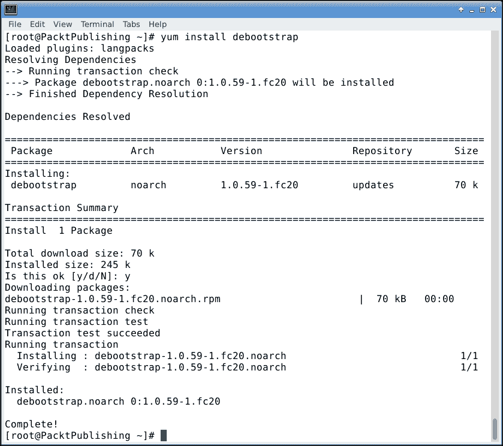

# 第四章：手动安装备用操作系统

将一个完整的桌面**操作系统**（**OS**）通过镜像安装到 SD 卡上是非常有用的，但很快就会遇到限制。如果需要将操作系统安装到 SSD 上怎么办？或者，如果希望有一个非常精简的安装用于作为服务器使用呢？显然，对于这个需求不需要重型 GUI 界面吧？所有这些问题将在本章中讨论。

本章将涵盖以下主题：

+   分区和格式化目标介质

+   创建 rootfs

+   允许目标介质启动

+   更新操作系统

+   安装额外软件

# 本章的前提条件

在本章中，Debian（甚至 Ubuntu）将安装到一个备用安装介质上。将使用 SATA SSD，但只要有足够的电力来为驱动器提供电源，也可以使用普通的 SATA 硬盘；在这种情况下，至少需要一个 2 安培的电源适配器。或者，也可以使用第二个 microSD 卡，通过 microSD 到 USB 适配器来连接。

然而，当安装到 SATA 驱动器时，Cubieboard 仍然需要 SD 卡来启动，因为 SoC 不能直接从 SATA 驱动器启动。从技术上讲，板载 NAND 闪存或板载 SPI 闪存也可以用于此，但支持 SPI 闪存的 Cubieboard 很难找到，而且使用 NAND 需要一个非常旧的 u-boot，它缺少很多新特性。在本章中，之前章节创建的 microSD 卡将重新使用，并完成所有这些任务。

### 提示

USB 闪存驱动器理论上可以使用，但在撰写本书时，USB 引导代码尚未进入 u-boot。目前，USB 闪存驱动器只能在引导一个带有 USB 支持的内核后使用，该内核已从 NAND 或 SD 卡加载。

# 准备目标介质

若要将 Debian 安装到 SATA 驱动器，目标驱动器需要一些准备工作。需要对其进行分区和格式化。

假设 Cubieboard 已使用之前创建的 Fedora 镜像启动，并且已连接 SATA 硬盘、USB 闪存驱动器或带 USB 适配器的 microSD 卡，现在是时候开始在目标介质上使用`fdisk`，假设目标介质为`/dev/sda`。请确保使用正确的设备节点，否则以下操作将销毁介质上的所有内容。

分区设备时，最常用的工具是`fdisk`。虽然`fdisk`有一些参数，但以设备节点启动它将使`fdisk`进入交互模式，在其中可以准备磁盘。使用`fdisk`需要 root 权限，因此可能需要加上`sudo`前缀，如下图所示：


应确保目标介质上没有任何以前的数据，或者至少已经备份，这部分内容将在此不做讨论。按下*o*键应清除任何先前创建的分区，如下所示：


分区是非常有用的，它们允许逻辑分隔。分区时有许多原因和选择，在这里，我们只关注以下四个分区：

+   **启动**：此分区包含所有相关的启动文件

+   **根**：此分区包含所有相关的系统文件

+   **家**：此分区包含所有用户文件

+   **交换**：此分区扩展 RAM 内存

在此示例中，将只创建三个主分区，因为启动分区将位于 SD 卡上。根分区使用 6 GB，交换分区使用 512 MB。剩余空间用于 home 分区。

然而，最终由读者决定什么是对你有用的，因为这可能因人而异。使用 `n` 命令可以创建新分区。以下截图中，展示了之前解释过的三个分区的创建：


当未输入最后一个扇区的值时，`fdisk` 会默认使用可用的最后一个扇区，从而使用剩余的介质空间。

分区不仅需要创建，还需要分类。默认情况下，`fdisk` 会将所有新创建的分区转化为常规的 Linux 文件系统分区，这对于除了交换分区之外的其他分区来说是没问题的。交换分区需要应用不同的类型。`t` 命令用于对分区进行分类，这需要知道要使用的具体类型。对于交换分区，其类型为 82。任何时候都可以使用 `l` 命令来查看可用的类型。以下截图展示了如何将分区 `2` 转换为交换分区：


使用 `w` 命令保存并使用 `q` 命令退出，新创建的分区表会被写入磁盘，`fdisk` 随之退出，如下所示：


# 格式化新创建的分区

在新创建的分区可用后，它们需要进行格式化。本书中将使用 `ext4` 作为文件系统。

### 提示

尽管本书中使用的 3.4.x 内核尚不支持，`f2fs` 是一个非常有趣的文件系统，因为它针对 SSD、USB 或 microSD 闪存的使用进行了优化。这在未来可能会很有意思。

格式化分区的命令是 `mkfs.ext4`，其中值得关注的参数是正在格式化的设备节点和可选的 `-L`，用于给分区命名。

格式化根分区的操作如下：


格式化交换分区可以通过以下截图中的命令来完成：


格式化剩余的空间用于用户文件，如下所示：


为了确保所有数据都写入到适当的位置，分区会按照现有文件系统进行挂载，如下所示：

```
[root@packt ~]# mount /dev/sda1 /mnt
[root@packt ~]# mkdir /mnt/home
[root@packt ~]# mount /dev/sda3 /mnt/home

```

# 创建 Debian 或 Ubuntu 的 rootfs

这里首先要提到的是，Ubuntu 是 Debian 的衍生版。简而言之，它基本上就是 Debian，因此安装时使用哪个发行版并没有太大区别，不论是 Debian 还是 Ubuntu。所以，谈论安装 Ubuntu 或 Debian，其实是在说同一件事。这里使用的安装工具是 **debootstrap**，它在许多发行版中都可以找到。

## 安装 debootstrap

Fedora 提供了 debootstrap，并可以通过 Yum 工具安装，如下所示：



## 运行 debootstrap

安装了 debootstrap 后，差不多可以开始了。首先需要提及一些事情；debootstrap，即 Debian bootstrap，可以用于安装任何架构的 Debian 变种，至少支持 Debian 和 Ubuntu。它确实需要在其参数列表中提供一个镜像。Debian 的镜像列表可以通过 [`www.debian.org/mirror/list-full`](http://www.debian.org/mirror/list-full) 获取，而 Ubuntu 则没有官方的镜像列表。然而，通过在 URL 中使用国家代码可以找到镜像，例如在荷兰，[`nl.ports.ubuntu.com`](http://nl.ports.ubuntu.com) 就是一个有效的镜像。使用镜像的明显优点是下载会更快。

由于 Allwinner SoC 基于 ARMv7 架构，因此该架构将使用 **armhf**。

**suite**（套件）取决于需要的版本。对于 Debian，有稳定版、测试版和不稳定版，**Wheezy** 是稳定版的名称，**Jessie** 是测试版，而 **sid** 是不稳定版的名称。需要注意的是，未来 Wheezy 和 Jessie 会更改为新的套件名称，但 sid 永远是未稳定的开发版本。

最后，debootstrap 被加上 `PATH` 变量前缀，以确保 debootstrap 使用正确的路径。这是因为当前 debootstrap 与新发行版的组合中存在一个 bug。

### 提示

`–foreign` 参数可以用来引导任何架构，即使是在 x86 系统上，因为没有代码会被执行。引导过程还需要通过 `–second-stage` 参数进行一些额外的操作。读者可以在进行跨架构引导时深入了解这方面的内容。

以下命令将使用 [`ftp.nl.debian.org/debian/`](http://ftp.nl.debian.org/debian/) 镜像，将 Debian Wheezy 安装到 `/mnt` 目录中，适用于 arm-hard-float 架构，如下所示：


由于 debootstrap 是用 Perl 编写的，因此可能系统中尚未安装 **Perl**。安装 Perl 可能会导致需要下载和安装一长串包。

### 提示

同样，可以使用 debootstrap `–foreign --arch=armhf trusty /mnt http://nl.ports.ubuntu.com` 来安装 **Ubuntu Trusty Tahr**，但请注意，这将仅是基础系统。此外，debootstrap 可能不会带有所有预期的套件。只要 `/usr/share/debootstrap/scripts` 下存在，所有 Ubuntu 套件都是指向 gutsy 套件的符号链接，链接目标是 [`ports.ubuntu.com/dists/`](http://ports.ubuntu.com/dists/)。例如，在脚本目录中使用 `ln -s gutsy utopic` 来将 utopic 添加为有效套件。

## 配置基础系统

Linux 中所谓的 `fstab` 文件负责将分区挂载到指定的位置。使用任何编辑器，以下更改需要添加到 `fstab` 文件中。虽然可以使用基于 UUID 的挂载点，但这里只使用标准条目。不过，你可以使用基于 UUID 的挂载点，并且我们鼓励你这么做。一个相对易用的常见编辑器是 **nano**。修改完文件后，按 *Ctrl* 键和 *x* 键退出 nano，并回答问题以通过 *y* 键保存修改过的缓冲区。文件名应保持不变，因此按 *Enter* 键确认。编辑器中的 `fstab` 文件如下所示：


将 `/boot` 挂载为只读模式，可以确保不仅没有意外的写入发生，而且也没有故意的写入操作。此外，正如本章前面提到的，上一章创建的 microSD 卡的启动分区在这里被重复使用。

## 配置网络

Debian 和 Ubuntu 使用 `/etc/network/interfaces` 文件来配置网络。请注意，这是在不使用图形工具（如网络管理器）时所用的更持久的配置。如果该配置的最终目标是图形桌面，跳过配置 `interfaces` 文件可能是明智的选择。

### 提示

使用网络接口 `eth0` 作为 `dhclient` 的参数应能建立有效的网络连接，如以下命令所示。但请注意，这一配置在重启后会丢失。

```
dhclient eth0

```

使用 nano 打开 `/mnt/etc/network/interfaces` 文件，并在文件底部添加以下内容：

```
auto eth0
iface eth0 inet dhcp

```

通常，类似的部分也存在于回环设备中。

如果需要静态 IP 配置，可以参考以下示例（请用目标网络的所有数字替换相应的值）。

```
auto eth0
iface eth0 inet static
 address 192.168.0.10
 network 192.168.0.0
 netmask 255.255.255.0
 broadcast 192.168.0.255
 gateway 192.168.0.1

```

使用静态 IP 地址时，系统还需要告诉它如何解析内容；`/etc/resolv.conf` 中的 `resolv.conf` 文件负责此操作。请注意，如果网络通过 `dhcp` 或网络管理器进行配置，文件将被覆盖。以 nano 为例，打开 `/mnt/etc/resolv.conf` 文件，并在其中添加以下行：

```
search homedomain.local
nameserver 192.168.0.1

```

同样，在这里，我们需要根据所使用的网络正确地替换值。记得使用*Ctrl* + *x*保存文件。

如果本地网络上有多个名称服务器，则应为每个额外的名称服务器使用一行，以“nameserver”开头。

### 提示

如果本地网络上没有可用的名称服务器，可以使用 Google 或 OpenDNS 的名称服务器。对于 Google，它们是`8.8.8.8`和`8.8.4.4`，而对于 OpenDNS，它们是`208.67.222.222`和`208.67.220.220`。

最后，系统需要在网络上命名——即所谓的`hostname`。只需在`/mnt/etc/hostname`中的`hostname`文件里写下一个在网络上唯一的名称，如下所示：

```
[root@packt ~]# echo "PacktPublishing" > /mnt/etc/hostname

```

另一个需要设置的文件是所谓的 hosts 文件。它是查找主机名的最基本方式，例如，当没有 DNS 服务器可用时。主机名需要出现在这里，此外还需要列出任何其他必须能够从网络中访问的主机名；例如，网络中有一个时间服务器，所有计算机从中获取当前时间。每个系统通过`time.example.com`查询此服务器。即使没有互联网连接和没有 DNS 服务，为了确保时间服务器始终能够被查找，可以在 hosts 文件中添加一个条目。假设`192.168.0.15`是本地时间服务器，可以使用以下命令作为主机名的示例，并作为添加其他主机的指南。请注意，通常情况下，很少需要添加其他主机，因为 DNS 几乎总是用于此目的。记得使用*Ctrl* + *x*保存文件。

```
[root@packt ~]# nano /mnt/etc/hosts
127.0.0.1       localhost
127.0.0.1       PacktPublishing
192.168.0.15    time.example.com
::1             localhost ip6-localhost ip6-loopback
fe00::0         ip6-localnet
ff00::0         ip6-mcastprefix
ff02::1         ip6-allnodes
ff02::2         ip6-allrouters

```

# 使目标介质可引导

不幸的是，正如之前提到的，SoC 无法从 SATA 驱动器或 USB 闪存驱动器引导，它需要一个辅助组件。在本书中，使用了一张小的 microSD 卡来实现这个目的。因此，它将容纳引导加载程序、内核和一些配置，将所有内容粘合在一起。在上一章中，用于 Fedora 安装的安装脚本是自动完成的。将安装到 microSD 卡上的内核默认情况下将继续从 microSD 卡加载 rootfs。显然，需要调整它，以便 microSD 卡能引导新创建的介质。为此，需要首先挂载引导分区，如下所示的命令所示：

```
[root@packt ~]# mount /dev/mmcblk0p1 /mnt/boot

```

使用 nano 编辑`uEnv.txt`文件，修改以 root `/dev/sda1`开头的行，如下所示的屏幕截图所示。记得使用*Ctrl* + *x*保存文件。


当 microSD 卡设置为从新创建的介质引导时，可以安全地使用以下命令再次卸载它：

```
[root@packt ~]# umount /mnt/foo

```

如果出现问题并且 Cubieboard 无法启动，可以将 microSD 卡插入 microSD 转 USB 适配器，并使用本地安装的文本编辑器打开 `uEnv.txt` 文件。然而，用于进行此修改的操作系统需要能够读取和写入 `ext4` 或至少 `ext2` 文件系统。

# root 用户

尽管任何默认的 Debian 或 Ubuntu 安装都会存在 root 用户，但问题是如何作为 root 用户登录。以下是两种选择：

+   预先创建一个具有管理权限的常规用户，通过 `sudo` 使用，并且不允许 root 用户登录

+   或者使用更简单的方法，为 root 用户设置一个 root 密码并使用它

从安全角度看，第一个选项更安全。这里将简要介绍这两种方法。选择哪种方式更适合以及安全性的重要性由读者自行决定。本书并不是关于如何正确地保护系统的内容。这部分留给读者作为练习，远超出本书的范围。

## 准备 chroot 命令

要设置 root 密码，需要执行一些步骤，因为这必须在系统内部完成。`chroot` 命令使得能够像系统已启动一样进入该系统。但这有一个前提条件，那就是必须填充某些动态目录，即 `/dev` 和 `/proc`，如下所示：

```
[root@packt ~]# mount --rbind /dev /mnt/dev
[root@packt ~]# mount none -t proc /mnt/proc

```

在这里，现有的 `/dev` 挂载被重用，而 `proc` 文件系统则正常挂载。现在，可以像这样使用 `chroot` 进入文件系统：

```
[root@packt ~]# PATH=/bin:/sbin:/usr/bin:/usr/sbin chroot /mnt /bin/bash
root@packt:/#

```

### 更改 root 密码

`passwd` 命令将用于启动 root 用户的密码更改，在此过程中需要输入新密码两次。系统不会将任何信息回显给用户，如下所示：

```
root@packt:/# passwd
Enter new UNIX password:
Retype new UNIX password:
passwd: password updated successfully
root@packt:/#

```

### 创建一个新的超级用户

要创建一个新用户，可以使用 `useradd` 命令。该命令有许多选项，读者可以熟悉它们。然而，本例中使用的选项是最常见的。除了新用户外，还将自动创建一个与用户用户名匹配的新组；`-U` 标志用于此功能。此外，`-s` 标志用于提供替代的登录 shell。这是完全可选的，但推荐使用，因为 Debian 默认使用的是默认的 `sh` shell，功能相对有限。`-m` 标志用于为用户创建目录并复制一些基本文件。在下面的示例中，使用的用户名将是 `packt`：

```
root@packt:/# useradd -m -G sudo -s /bin/bash -U packt
root@packt:/#

```

为了赋予新用户管理员权限，需要为其提供 `sudo` 命令的使用权。用户已通过 `-G` 参数成为 `sudo` 用户组的一部分。但该命令需要实际上可用才能使用。虽然本章后面会讨论如何使用 `apt`，可以使用以下命令来安装 `sudo`：

```
root@packt:/# apt-get install sudo

```

最后，用户还需要一个密码才能实际登录。可以使用以下 `passwd` 命令来设置密码：

```
root@packt:/# passwd packt
Enter new UNIX password:
Retype new UNIX password:
passwd: password updated successfully
root@packt:/#

```

## 退出 chroot

现在可以使用`exit`命令退出`chroot`环境，如下所示：

```
root@packt:/# exit
exit
[root@packt ~]#

```

# 添加串行控制台

如果此时系统重启，登录控制台将显示在`tty0`上，这是当连接显示器和键盘时的正常控制台。然而，可能会出现某些情况下，连接的显示器不立即兼容，或者由于某种原因，USB 键盘或显示器无法使用。直到现在，串行控制台对我们非常有用，因此，强烈建议在此情况下启用串行控制台，并推荐使用 Debian 或 Ubuntu 安装。在这里，Debian 和 Ubuntu 之间的第一个区别变得明显。Debian 仍然使用较旧的`sysvinit`，而 Ubuntu 仍然使用`upstart`，虽然两者都在逐步迁移到`systemd`，但此时这一点不适用。具有讽刺意味的是，在使用`systemd`时，或者至少在安装并当前运行的`systemd`版本下，Fedora 镜像默认设置了串行控制台。

## 将串行控制台添加到 Debian

负责生成各种`init`服务的文件是位于`/etc/inittab`的`inittab`，可以使用 nano 进行编辑以添加串行控制台。找到以下部分，取消注释以`#T0`开头的行，并删除井号。还需要注意的是，默认的波特率为`9600`，而我们的整个设置假定波特率为`115200`，因此请确保已进行此更改，如以下示例所示。记得使用*Ctrl* + *x*保存文件。

```
[root@packt ~]# nano /mnt/etc/inittab
# Example how to put a getty on a serial line (for a terminal)
#
T0:23:respawn:/sbin/getty -L ttyS0 115200 vt100
#T1:23:respawn:/sbin/getty -L ttyS1 9600 vt100

```

## 将串行控制台添加到 Ubuntu

对于`upstart`，情况完全不同。`/etc/init/`目录中的文件由`upstart`解析。首先，将文件`tty1.conf`复制到`ttyS0.conf`，这样可以更方便地进行编辑；毕竟文件相似，如下所示：

```
[root@packt ~]# cd /mnt/etc/init/
[root@packt init]# cp tty1.conf ttyS0.conf

```

但是，需要对这个文件进行一些更改。首先，将所有出现的`tty1`替换为`ttyS0`。接着，除了`2345`外，还要在运行级别中添加`1`。此外，删除`and` `(…)`部分。最后，`getty`行需要调整为监听串行端口，波特率为`115200` bps。以下命令展示了文件最终应有的样子。或者，可以创建一个新的文件，内容如下。记得使用*Ctrl* + *x*保存文件。

```
# ttyS0 - getty
#
# This service maintains a getty on ttyS0 from the point the system 
# is started until it is shut down again.

start on stopped rc RUNLEVEL=[12345]
stop on runlevel [!12345]

respawn
exec /sbin/getty -L 115200 ttyS0 vt102

```

# 重启新操作系统

在所有必要的更改完成后，应该是时候重启进入新操作系统了。首先，卸载所有已挂载的分区。确保没有挂载的目录正在使用中。可以使用`umount -l`命令，其中`-l`参数表示懒惰卸载，这意味着`umount`会首先尝试卸载所有子目录，最后卸载请求的目录。如果遇到错误，可能需要手动卸载。然后，使用`reboot`命令重新启动系统，如下所示：

```
[root@packt etc]# cd
[root@packt ~]# umount -l /mnt
[root@packt ~]# reboot

```

重启后，你将看到一个登录提示，如下图所示。显然，这在 Debian 和 Ubuntu 之间有所不同。使用创建的用户或 root 登录后，本章的安装部分完成，恭喜你！


# 通过命令行操作新操作系统

如果你是 GNU/Linux 新手，使用附录 B 中展示的备忘单，*基本 Linux 命令备忘单*，将会很有帮助，因为可以探索一些常见的 Linux 命令，并且它可以作为 GNU/Linux 新手的指南。本节将更多地关注一些常见任务，比如保持 Debian 或 Ubuntu 最新以及安装新软件。

## 介绍 apt

Debian 和 Ubuntu 都在软件需求方面严重依赖 apt。Apt 是一组命令，用于安装新的软件包或保持现有软件包的最新。Apt 与 dpkg 紧密配合，尽管普通用户可能永远不会直接调用 dpkg。Apt 负责下载所请求的软件，检查其依赖关系，并告诉 dpkg 安装它们。它是 Debian 和 Ubuntu 下的瑞士军刀，是在 AppStore 存在之前的命令行应用商店。

## 配置 apt

Apt 并不需要很多配置。apt 需要的是一个可以检查和下载软件的地方列表。Debian 和 Ubuntu 的默认设置可能无法提供所有感兴趣的内容。负责 apt 配置的文件是 `/etc/apt/sources.list` 中的 `sources.list`，如果你以普通用户身份登录，则需要 `sudo` 提供额外权限来编辑该文件。在下面的示例中，将非自由组件和安全库添加到主组件中。请注意，`sources.list` 文件中的各种源会因不同的套件或衍生版（如 Ubuntu）而有所不同。

```
packt@PacktPublishing:/etc/apt$ sudo nano sources.list
[sudo] password for packt:
deb http://ftp.nl.debian.org/debian wheezy main non-free

deb http://security.debian.org/ wheezy/updates main non-free
deb-src http://security.debian.org/ wheezy/updates main non-free

```

完成这些更改后，apt 需要更新，但这将在下一小节中处理。

Debian 提供了一个很好的教程，供深入阅读，网址是 [`wiki.debian.org/SourcesList`](https://wiki.debian.org/SourcesList)，附加的组件和库可以在 [`wiki.debian.org/UnofficialRepositories`](https://wiki.debian.org/UnofficialRepositories) 上找到。对于 Ubuntu，可以在 [`help.ubuntu.com/community/SourcesList`](https://help.ubuntu.com/community/SourcesList) 查找源列表，附加的库则在 [`help.ubuntu.com/community/Repositories/Ubuntu`](https://help.ubuntu.com/community/Repositories/Ubuntu) 上列出。除了本小节所列的配置外，其他配置留给读者自己完成。请注意，虽然理论上 Ubuntu 和 Debian 的仓库可以混用，但不推荐这样做，这可能会导致问题。

## 保持操作系统最新

定期检查和安装更新对于安全性至关重要。 此外，通过这种方式还可以获得现有软件包的新版本，这可能带来新功能或修复错误。 对于 Ubuntu 和 Debian，步骤是相同的。

要使用新的软件列表下载并更新 apt，首先引入了第一个 apt 命令`apt-get`。 然而，没有参数的`apt-get`命令将不会做更多事情，只会打印一个帮助屏幕。 由于预期的操作是更新应用程序列表，所以将传递`update`参数。 再次强调，如果以普通用户身份运行，则应以`sudo`为前缀。 此外，如果尚未配置网络并且打算让图形用户界面配置网络，则请记住运行`dhclient eth0`以获取临时网络配置。 屏幕截图中的以下命令运行了 apt 的更新：


如果在前一小节中未添加部分和组件，则列表显然会更短。 此时，apt 已经有了可用软件的最新列表。 要升级所有已安装的软件包，尤其是因安全更新而需执行`apt-get`的`upgrade`参数，如下面的屏幕截图所示：


在前面的示例中，只有一个可用的更新，即对`libgnutls`的更新。 这个列表可能会因更新数量的不同而有所变化。

### 提示

位于`/etc/cron.daily/apt`的`apt`文件负责每天更新 apt 并安装安全关键软件包，因此不总是需要运行`apt-get` update。

## 安装额外的软件

任何操作系统最令人兴奋的可能是软件。 然而，默认创建的 Debian 或 Ubuntu 安装缺乏大多数软件。 毕竟，这只是最基本的。

### 查找软件包

在安装软件包时，当名称粗略记住但不完全记得时可能会出现问题。 在这种情况下，有一个名为`apt-cache`的合适工具。 使用`search`参数，可以搜索内部缓存的 apt 数据库以查找可用的软件包。 特别是与`grep`命令结合使用时，这两个命令可以帮助找到所需的内容，如下面的屏幕截图所示。 `grep –`命令在《附录 B》*Basic Linux Commands Cheatsheet*中有解释。


此外，您可能还想搜索应用程序的文件名。 也有一个适用的 apt 工具。 使用`search`参数的`apt-file`工具将允许您在软件包内搜索文件。 不幸的是，在撰写本书时，`apt-file`工具尚未包含在当前稳定版本的 Debian 或 Ubuntu 中，但希望很快会添加。

### 使用 apt-get 安装软件包

安装软件包的最基本方法也是通过 `apt-get`，参数当然是 install。Nano 经常被用作示例编辑器。这是因为它非常易于使用，并且通常预安装，因为它体积很小。**Vi** 是另一个小型编辑器，几乎总是预安装，但使用起来远不如 Nano 简单。Vi 有一个更强大的版本，叫做 Vi 改进版（vim）。让我们通过 `apt-get` 安装 vim，如下所示：


下载并安装了一些软件包后，vim 现在已安装。

### 使用 tasksel 安装软件包

更常见的是，需要一组软件包才能使系统执行某些功能。`tasksel` 命令可以用来安装一组执行特定任务的软件包。以提升权限运行 `tasksel` 将显示菜单，如下图所示。Ubuntu 没有预安装 `tasksel`，需要通过 `apt-get` 安装，就像前面安装 vim 的例子一样。


安装 Debian 桌面环境任务将安装基于**GNOME**的图形桌面环境以及一些由 Debian 标记为标准的附加包，如 LibreOffice。

下载和安装过程可能需要一些时间，这取决于目标媒介和网络连接速度。在配备高速互联网连接的 SSD 上安装大约需要三十分钟。

在 Ubuntu 下，`tasksel` 会略有不同，但这里也有一个 Ubuntu 桌面选项，如下图所示。这将大约需要相同的时间，三十分钟或更长。


### 通过元包安装软件包

通过 `tasksel` 可用的任务似乎相当有限。相反，使用元包可能更为简便。元包实际上与任务没有太大区别；事实上，它们可能在后台是一样的。元包并不是一个真正安装任何东西的包，而是一个软件包列表或一组通过它安装的软件包。例如，`xfce4` 是 Debian 的一个元包，它将安装所有 `xfce4` 桌面环境所需的软件包，并且还会安装包维护者认为对完整桌面环境有用的软件，如文件管理器。

### 注意

对于 Ubuntu，这个元包被称为 xfce，不过 xubuntu-desktop 元包在这里更为有趣。

另一个与 `xfce4` 元包相匹配的有趣元包是 `xfce4-goodies`。实际上，以下命令将展示如何一次安装多个软件包。运行该命令会产生一个庞大的待安装软件包列表，但最终会得到一个可用的 `xfce4` 桌面，就像从 CD 安装的一样。例如，有人甚至可以争辩说，安装 CD 恰恰能做到这一点，如下所示：

```
packt@PacktPublishing:~$ sudo apt-get install xfce4 xfce4-goodies

```

等待大约 30 分钟，xfce4 桌面安装完成后，可以使用 `startx` 命令启动 xfce4。然而，这时必须使用显示器和键盘。Xfce4 不能通过串口控制台启动或使用。这时的桌面环境几乎可以使用。“几乎”意味着某些权限设置缺失。例如，默认情况下用户无法关闭机器。

有几种方法可以让这些功能正常工作，其中之一是使用登录管理器；然而，xfce4 并没有自带登录管理器，但这没关系。市面上有很多可以选择的登录管理器。GNOME 自带 `gdm`，但考虑到 Xfce4 是一个轻量级的桌面管理器，选择一个轻量级的登录管理器，比如 LightDM，应该是一个不错的选择。安装 `lightdm` 包不需要额外的指令。现在重启 Cubieboard 后，您会看到一个活动的登录窗口，登录后，便完成了本章内容。

# 概述

完成了这一章，虽然这算是一个大章节，但技术上，结果应该和前一章相同；无论是基于 Debian 还是 Ubuntu 的工作桌面环境。通过命令行安装额外的软件现在已经变得非常简单，而且系统的更新也不成问题。

下一章将以此安装为基础，将其转变为一个用于各种任务的服务器，您可以选择保留桌面功能。
