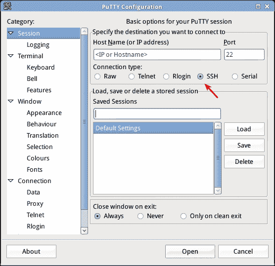
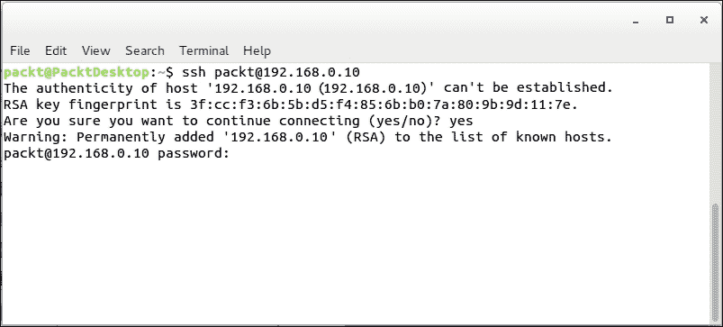
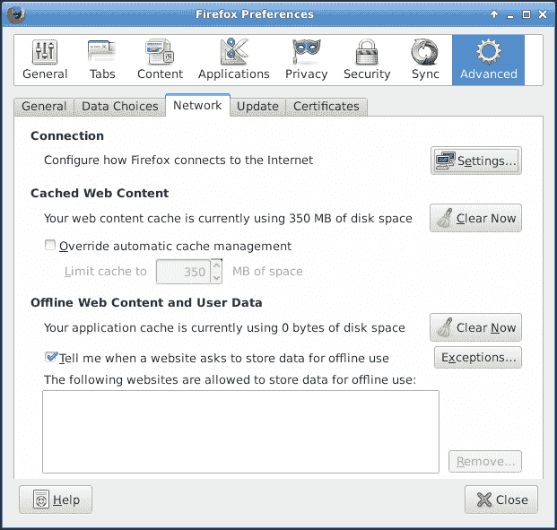
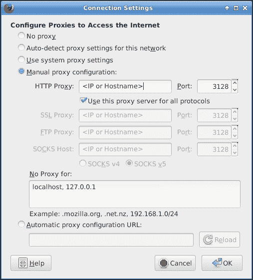
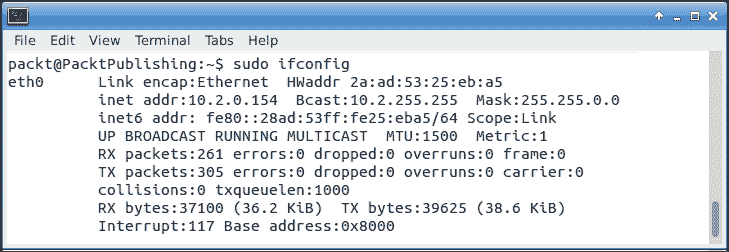
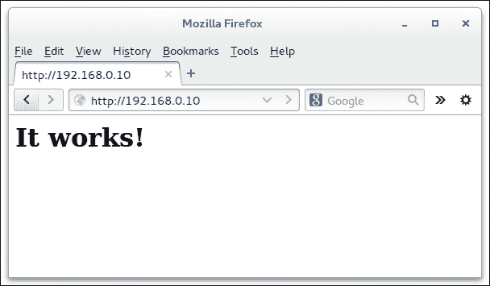
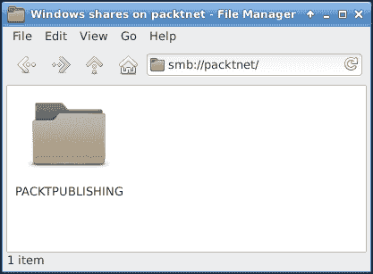
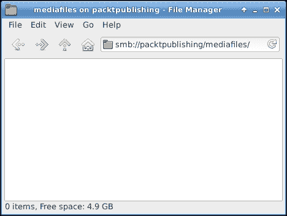
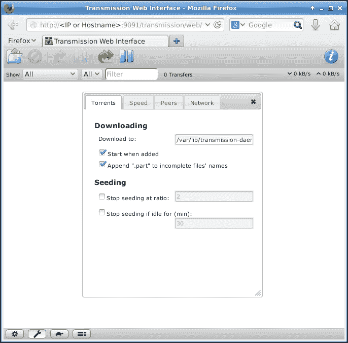
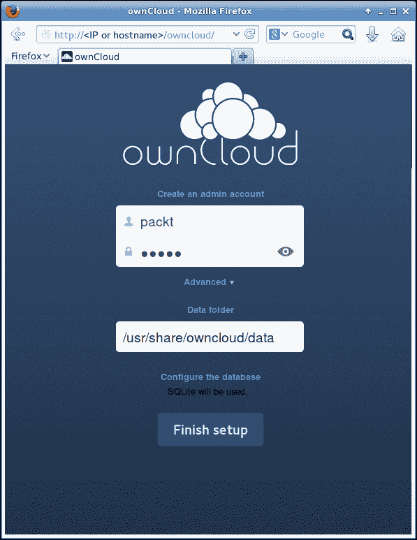

# 第五章：设置家庭服务器

既然你现在已经熟悉了从头创建完整的根文件系统，是时候创建一些稍微复杂一点的东西了。尽管桌面操作系统本身非常有用，但这些 ARM 开发板上的桌面操作系统往往可能有点过慢。然而，这些设备在低功耗家庭服务器中非常有用。

这里使用“家庭服务器”这一术语，因为大多数服务对家庭用户很有用，但例如将 Cubieboard 放在托管中心，作为 Web 服务器和邮件服务器使用，同样也能很好地工作。然而，在这种情况下，安全性是必须考虑的问题。本章并未强烈涉及安全性，因为这是一个需要大量关注和强大安全知识的主题，而这些内容超出了本书的范围。必须指出，这些说明完全不是针对 Cubieboard 的，显然还有许多其他服务可以考虑。

本章将涵盖以下主题：

+   远程访问 Cubieboard

+   学习如何启动、停止和重启服务

+   添加和移除开机启动的服务

+   在预定时间自动运行任务

+   设置各种服务（Squid、Apache、Samba、transmission 和 ownCloud）

# 家庭服务器板的先决条件

本章将在之前的 Debian 或 Ubuntu 安装基础上安装多个软件包。如果此安装因实验而受损，建议重新查看第四章，*手动安装替代操作系统*。

明智的做法是跳过最后一部分，安装图形桌面环境，因为它在本章中没有任何用途。SD 卡上的初始 Fedora 安装也可以重复使用，但你需要自己识别这些发行版之间的差异。

# 远程访问服务器

大多数时候，如果不是每次，Cubieboard 都是通过串行控制台访问的，或者在连接到显示器时直接通过键盘和鼠标进行操作。这种方式很好，但在完成设置和调试后，可能会希望将其放在另一个房间中，让它独立执行任务。甚至可以想象多个板子一起运行在数据服务器中，例如，在这种情况下，远程访问可能变得至关重要。因此，拥有远程访问功能是非常有用的。

连接到 Debian 或 Ubuntu 机器的最常见和最成熟的方式是通过 `ssh` 服务器。安装 `ssh` 服务器很简单，只需使用以下命令：

```
packt@PacktPublishing:~$ sudo apt-get install openssh-server

```

就像 UART 访问一样，PuTTY 也可以用于`ssh`访问。然而，关键在于将连接类型设置为`ssh`。端口应默认设置为`22`，并且需要使用正确的 IP 或主机名。请参考以下截图查看示例：



如果你正在使用现有的 Linux 命令行，`ssh`可以很容易地调用，示例如下所示：



第一次连接主机时，会显示`ssh`指纹，然后询问是否确定要连接。在这种情况下，可以安全地接受继续连接的提议。

### 提示

当通过互联网连接时，建议始终验证密钥。如果有人篡改了服务器或试图进行中间人攻击，密钥将不再匹配，你就会知道出现了问题。

输入密码后，会出现熟悉的`packt@PacktPublishing:~$`命令提示符。

# 与服务交互

在服务器上，启动、停止或重启服务是很常见的。这不仅仅是在尝试解决问题时，也有时是为了重新加载配置。例如，某个服务可能只偶尔使用，而不是每次启动时都需要。因此，所谓的启动脚本可供使用。当服务被安装时，通常会在`/etc/init.d`中放置一个控制其行为的脚本。

### 提示

对于服务器来说，通常建议通过`interfaces`文件以静态方式或通过 DHCP 服务器配置网络。这是为了确保网络始终可用，因为图形桌面通常并未安装。

以网络脚本为例，它负责启动网络设备，但仅限于在`/etc/networking/interfaces`中配置的设备。有关如何正确设置网络配置，请参阅第四章，*手动安装替代操作系统*；假设`eth0`已按此方式配置。

### 注意

停止网络服务将会停用所有网络接口！虽然这不一定是问题，但如果你是远程使用此命令时，请小心。

# 启动、停止、重启或重新加载服务

要停止网络接口，输入以下命令。如果以 root 身份登录（不推荐这样做），可以省略`sudo`命令。

```
packt@PacktPublishing:~$ sudo /etc/init.d/networking stop
Deconfiguring network interfaces...done.

```

同样，网络接口可以使用`start`参数重新启动，如下所示：

```
packt@PacktPublishing:~$ sudo /etc/init.d/networking start
Configuring network interfaces...

```

使用`restart`或`reload`参数也可以做到这一点，其中`reload`会强制服务重新加载其配置。

### 提示

一些发行版，例如 Ubuntu，可能会使用 upstart 或甚至 SystemD。有时，某些脚本会留在 `/etc/init.d` 目录中，可以按照前述方式使用，但并非总是如此，因此你可能需要熟悉 SystemD 或 upstart。

# 添加或移除开机启动的服务

有时，需要始终在启动时启动某个服务。例如，在前一章中，安装了 `lightdm` 来提供图形登录服务。此服务会自动添加到启动时启动的服务中。若要阻止 `lightdm` 在启动时再启动，可以使用 `update-rc.d` 命令。传递可选的 `-f` 参数强制移除，如下所示：

```
packt@PacktPublishing:~$ sudo update-rc.d -f lightdm remove
update-rc.d: using dependency based boot sequencing

```

使用前面的章节停止 `lightdm` 后，图形登录管理器将不再在重启后启动；此时甚至无需重启。

添加服务的过程非常类似；与要求从启动服务中移除它不同，默认关键字要求在启动时启动该服务，如下所示：

```
packt@PacktPublishing:~$ sudo update-rc.d lightdm defaults
update-rc.d: using dependency based boot sequencing

```

默认设置指示所有默认运行级别的服务应启动或停止。Linux 系统有多个运行级别，你可以进一步了解它们。

每次重启后，`lightdm` 都会启动。前面所述的内容仅适用于 Debian。不过，Ubuntu 也为大多数服务提供了向后兼容的脚本，这些脚本位于 `/etc/init.d` 目录下，可以按前述方式使用。

### 注意

正如前一章所提到的，Debian 的 SystemV 和 Ubuntu 的 upstart 最终将被 SystemD 或两者取代。届时，你需要自己了解更多关于 SystemD 的内容。

# 自动运行计划任务

通常，需要在预定的时间间隔内执行某些任务。比如下载并更新病毒数据库。为此，Linux 系统配备了一个名为 **Cron** 的程序。Cron 通常在后台运行，检查是否有任务需要在某个时间执行。虽然你应该深入了解 Cron，但在 Debian 上，Cron 默认通过在 `/etc` 下提供四个目录，`cron.hourly`、`cron.daily`、`cron.weekly` 和 `cron.monthly`，使得执行 Cron 作业变得非常简单。从这些目录的名称可以明显看出它们的用途。在这些目录中放置一个可执行文件，使得 Cron 每小时、每天、每周或每月运行该命令。

一个简单的例子是要求 `apt-get` 每天更新其本地数据库；可以为此目的创建一个简单的脚本。以 root 用户身份使用编辑器，在 `/etc/cron.daily/` 目录中创建一个名为 `apt-update` 的新文件，如下所示：

```
packt@PacktPublishing:~$ sudo nano /etc/cron.daily/apt-get
#!/bin/sh
apt-get update

```

第一行很重要，它告诉系统这是一个 shell 脚本，或者更确切地说，需要使用 `/bin/sh` 来执行文件中的其余命令。Cron 默认以 root 用户身份在 `/etc/cron.*` 目录下运行所有作业，因此无需在前面加上 `sudo`。

保存文件后，重要的是要赋予它执行权限。默认情况下，它只是一个文本文件。Cron 只会执行具有适当权限的文件。可以通过使用 `chmod` 命令将这个新创建的脚本标记为可执行文件，下面的命令展示了这一点：

```
packt@PacktPublishing:~$ sudo chmod u+x /etc/cron.daily/apt-update

```

需要说明的是，尽管这是一个非常有用的示例，但 Debian 和 Ubuntu 默认每天会更新 apt 仓库。因此，虽然这个示例很好，但建议你在之后清理它，示例如下所示的命令：

```
packt@PacktPublishing:~$ sudo rm /etc/cron.daily/apt-update

```

# 设置代理服务器

当带宽紧张并且需要与家庭成员共享时，若还希望减少广告，可以使用代理服务器来提供解决方案。此外，它允许在不需要复杂防火墙规则的情况下访问互联网；只需要配置浏览器使用代理。接下来的子章节中将解释设置代理服务器的步骤。

## 安装 Squid

本书使用的代理服务器叫做 Squid，正如你在上一章中了解到的，它可以通过以下命令轻松安装：

```
packt@PacktPublishing:~$ sudo apt-get install squid

```

Debian 中的 Squid 配有合理的默认配置文件，位于 `/etc/squid/squid.conf`。你可以使用 nano 或其他编辑器打开并查看该文件。Squid 配置文件中有大量的注释，它们作为指南或手册使用。

默认情况下，Squid 只会监听它认为来自内部网络的连接流量。以 `acl localnet` 开头的行后跟内部网络的 IP 范围表示这一点。需要注意的是，您可以添加额外的 `localnet` 行，但要小心——如果添加了一个非本地的 IP 范围作为内部网络，可能会导致代理服务器被全球访问，因此在进行实验时要小心。不过，这只定义了 `localnet`，尚未授予访问权限。通过搜索 `squid.conf`，可以找到一个注释部分，内容如下命令：

```
#http_access allow localnet

```

这行配置允许 HTTP 访问，源地址来自 `localnet`，我们刚刚了解过，它定义为内部网络范围。你可以通过去掉注释符号（#）来取消注释，或者去掉数字符号；这会授予对所谓的 `localnet` 行的访问权限，重新启动 Squid 后，代理应该允许来自内部网络的使用。

## 设置缓存代理

代理服务器可以临时存储经常访问的数据，这样它只需要通过互联网连接下载一次。在某些情况下，这可以大大减少带宽使用；例如，假设一个五台计算机的家庭，所有计算机都需要下载某个更新文件。如果五台计算机都通过代理下载此更新文件，代理只在首次请求文件时下载它。当第二台计算机请求同一个文件时，代理会提供其内部存储的文件，从而使下载更快，不会增加互联网连接的负担。

### 注意

默认情况下，Squid 仅使用 100 MB 的缓存。可以查看`cache_dir`参数了解更多信息。

Squid 不需要额外配置即可作为缓存代理工作。安装后，它会自动启动并配置为在重启时启动。要更改这些行为，请参考前面两个小节。

### 配置浏览器使用代理

这里不会覆盖所有浏览器或操作系统，至少会展示一个示例。在此，我们选择 Mozilla Firefox。要配置浏览器使用代理，请按照以下步骤操作：

1.  首先，打开**首选项**选项，具体位置取决于使用的操作系统，可能在**编辑**下或**工具**下。

1.  在首选项界面中，进入**高级**选项卡，然后再进入**网络**选项卡。右侧第一个按钮为**设置**，它包含网络配置，如下图所示：

1.  在**设置**对话框中，选择**手动代理配置**，这将启用编辑框。

1.  对于**HTTP 代理**，需要输入主机名或 IP 地址。Squid 的默认端口是**3128**。

1.  最后，可以安全地启用**为所有协议使用此代理服务器**选项，因为 Squid 覆盖了所有协议，如下图所示：

1.  如果 IP 地址未知，可以使用`ifconfig`命令在运行 Squid 的 Cubieboard 上获取。在此例中，IP 地址为`192.168.0.10`，如下图所示：

并不严格要求使用`sudo`访问`ifconfig`信息。大多数情况下，可以通过其完整路径（在此为`/sbin/ifconfig`）访问，而无需提升权限。此外，`ifconfig`可能在某些发行版中被`ip addr`命令替代。

启动网页浏览会通过代理进行。手动配置代理并非严格要求。如这里所示，有**使用系统代理设置**或**自动检测此网络的代理设置**选项。使用第一个选项时，浏览器将使用操作系统配置的代理作为默认代理。后一个选项用于通过所谓的 WPAD 检测代理设置，关于 WPAD 的更多信息可以参见[`en.wikipedia.org/wiki/Web_Proxy_Autodiscovery_Protocol`](http://en.wikipedia.org/wiki/Web_Proxy_Autodiscovery_Protocol)。然而，这两种选项不在这里详细说明。

## 设置阻止代理

使用代理的一个优点是某些网站可以很容易地被阻止。假设`hotmail.com`、`ebay.com`和`live.com`需要被阻止。这些域名列表必须存储在某个地方，例如在`/etc/squid`目录中的`blocked.domains.acl`文件中。为了实现这一点，按照以下步骤操作：

1.  开始编辑文件，并按照如下方式添加这些名称：

    ```
    packt@PacktPublishing:~$ sudo nano /etc/squid/blocked.domains.acl
    hotmail.com
    ebay.com
    live.com

    ```

1.  接下来，进入配置文件中的一个非常具体的部分，因为顺序很重要。找到名为`# TAG: acl`的部分，并向下滚动，穿过包含`acl`标签的注释部分。`acl localnet`定义将会显示，正如之前的*安装 Squid*部分所示。在下一个部分开始之前，找到`# TAG: http_access`，并添加以下内容：

    ```
    acl blockeddomain dstdomain "/etc/squid/blocked.domains.acl"

    ```

    简而言之，在名为`acl`的部分下，将会添加一个新项，紧接在`http_access`部分之前。在这里，Squid 被指示创建一个名为*blocked domain*的`acl`，并将文件中创建的目标域名标记为阻止的域名。所以现在应该有一个`acl`列表，其中被阻止的域名项排在最后。

1.  紧接着`acl`部分，`http_access`部分开始。在这里，顺序非常关键。在允许本地主机和`localnet`的部分上方，需要添加以下命令：

    ```
    http_access deny blockeddomain

    ```

    原因是，首先被拒绝的内容（如被阻止的域名），然后本地主机和`localnet`被允许访问其余内容。最后，其他一切内容都被阻止给那些没有被允许任何访问权限的用户。

1.  使用本章之前学到的`restart`命令，Squid 可以重新启动，并且现在将拒绝加载来自提到的这些网站的所有内容。

进一步举这个例子，阻止所有仅提供广告的域名会是一个不错的选择。虽然创建一个文件列出所有这些域名当然是一个有效的解决方案，但列出所有的域名及其变体会非常繁琐。Squid 可以使用正则表达式处理一个列表，这样就变得更简单了。为了做到这一点，请按照以下步骤操作：

1.  如前所述，创建一个名为`squid.adservers`的文件，并输入以下正则表达式。如果你不理解其中的含义也没关系；这只是一个示例。

    ```
    (^|\.)wikia-ads\.wikia\.com$

    ```

1.  保存文件后，打开`squid.conf`，并像之前一样，将以下行添加到适当的部分：

    ```
    acl ads dstdom_regex -i "/etc/squid/squid.adservers"
    http_access deny ads

    ```

1.  Squid 被指示创建一个遵循文件的列表，但这次使用正则表达式来表示目标域名列表。Squid 将拒绝对列表中的域名（在本例中是`wikia-ads.wikia.com`）的所有 HTTP 访问。

手动为每个广告网络添加正则表达式可能会很麻烦，尤其是在尝试维护它们时。幸运的是，一些人维护了一个已知广告服务器的列表，可以无过多工作地使用；该列表可以在 [`pgl.yoyo.org/adservers/`](http://pgl.yoyo.org/adservers/) 找到。有人甚至很贴心地提供了一个脚本，可以用来下载该列表并准备好与 Squid 一起使用。使用 `wget` 下载以下文件，如下所示：

```
packt@PacktPublishing:~$ wget http://pgl.yoyo.org/adservers/scripts/squid/update-squid-adservers.txt

```

在能够使用此脚本之前，需要进行一些小的修改。为此，请按照以下步骤操作：

1.  打开文件，找到 `listurl`，并按如下所示替换：

    ```
    listurl='http://pgl.yoyo.org/adservers/serverlist.php?hostformat=squid-dstdom-regex&mimetype=plaintext'

    ```

1.  此外，请再次检查目标文件参数，因为它必须与广告的 `acl` 规则中定义的内容相匹配，如此处所示：

    ```
    targetfile='/etc/squid/squid.adservers'

    ```

1.  保存文件后，可以以 root 用户身份运行它，它将下载一个最新的广告服务器列表并将其重新加载到 Squid 中。在这里使用 `sh`，因为 `sh` 以 root 用户身份运行，并且被告知像运行 Shell 脚本一样执行该脚本：

    ```
    packt@PacktPublishing:~$ sudo sh update-squid-adservers.txt
    Reloading Squid configuration files.
    done.
    packt@PacktPublishing:~$

    ```

1.  为了再次确认一切是否正常工作，可以打开目标文件，通常是默认的 `/etc/squid.adservers`，除非之前已按建议进行调整。

1.  最后一步是让此脚本每月更新一次。参考前面关于如何设置 Cron 作业的部分，应该能轻松完成此任务。

    ### 提示

    使用 `cp` 命令，可以将文件复制到适当的目录。复制时，最好去掉 `.txt` 扩展名。

# 设置 Web 服务器

许多参与 Linux 的人都有自己的个人 Web 服务器。然而，正确设置一个 Web 服务器是一个足以写一本书的话题。在本节中，将仅介绍最基本的步骤，以帮助你开始使用。绝不是完整的或安全的设置，因为我们将依赖 Debian 或 Ubuntu 包中自带的默认设置。

有几个知名的 Web 服务器，但无疑，最著名的是以下 Apache Web 服务器：

```
packt@PacktPublishing:~$ sudo apt-get install apache2

```

如前所述，Debian 将自动启动 Apache，并且可以立即使用。使用网页浏览器输入 IP 或主机名，例如之前使用的 `http://192.168.0.10`，在 URL 栏中打开以下窗口：



正在提供的文件来自 `/var/www/index.html`。可以随意编辑此文档，甚至完全替换它。

### 提示

为 Web 开发人员提供对该目录及其文件的访问权限可能会很有用。通常，`webroot` 目录会与某个组相关联。管理员通常还会为他们可能拥有的多个 Web 根目录创建几个组。为了简单起见，用户和组设置为我们示例中的用户，如下所示：

```
sudo chown -R packt:packt /var/www

```

# 设置文件服务器

在 Cubieboard 上直接编辑文件确实会让人感到有些疲惫。即使使用之前安装的 Xfce 桌面环境，一旦将其放置在远程位置，远程访问文件会变得相当有用。也可能是因为需要将媒体文件共享到整个家庭网络中。

针对这种情况，有两种方法。通过本章之前安装的`ssh`服务器，任何现代 Linux 桌面环境都可以通过`ssh`访问文件。虽然这种方法有效，但作为练习，留给读者自行探索。本节将重点介绍如何安装和设置 Samba 作为文件服务器。为此，请按照以下步骤操作：

1.  通过 Samba 共享的文件可以通过多种操作系统访问，并且可以轻松安装在多种设备上，如下所示：

    ```
    packt@PacktPublishing:~$ sudo apt-get install samba

    ```

1.  安装 Samba 后，创建一个将要共享的目录，使用`mkdir`命令。它可以命名为`mediafiles`，并存放在文件系统的根目录中，如下所示：

    ```
    packt@PacktPublishing:~$ mkdir /mediafiles

    ```

1.  使用编辑器打开 Samba 配置文件`/etc/samba/smb.conf`，如以下命令所示：

    ```
    packt@PacktPublishing:~$ sudo nano /etc/samba/smb.conf

    ```

1.  可能需要更改的一个变量是所谓的工作组，这是 Samba 尝试加入的网络名称：

    ```
    # Change this to the workgroup/NT-domain name your Samba server 
    # will part of
     workgroup = PacktNet

    ```

1.  文件底部还需要添加的另一项内容是共享之前创建的目录，如下所示：

    ```
    [mediafiles]
     comment = Shared media files
     read only = no
     path = /mediafiles
     guest ok = yes

    ```

从安全性角度看，这并不是最好的保护措施，因为每个人都可以读取和写入媒体文件，并且无需有效账户就能访问这些文件。然而，仍然有最后一道防线，那就是目录上设置的权限。当用户尝试访问该目录时，Samba 会根据权限进行操作。

由于这个共享是作为访客用户或无用户身份使用的，因此权限会在读取目录中的媒体文件时应用。

1.  使用`chmod`命令更改权限，允许每个人读取和写入，这使得所有人都能使用此共享，如以下命令所示：

    ```
    packt@PacktPublishing:~$ sudo chmod o+rw /mediafiles/

    ```

    在家庭网络中，这不是一个问题。然而，如何更好地保护设备，是留给读者的一项不错的练习。Samba 是一个功能强大的套件，提供的不仅仅是文件共享。了解更多信息，请访问[`www.samba.org/`](http://www.samba.org/)。

1.  保存这些更改后，需要重启 Samba 服务。

1.  在桌面上使用文件浏览器时，应该能看到一个名为 PacktNet 的网络工作组，这就是为工作组定义的名称。在该网络中，除了其他可能的主机外，还应能看到`PacktPublishing`，这是主机的名称，如下图所示：

1.  最后，在`PacktPublishing`中，刚刚共享的目录`mediafiles`将变得可见。

# 设置种子服务器

种子（Torrents）是一种常见的数据共享方式。许多 Linux 发行版的 ISO 文件通过种子进行共享。拥有一个专用的服务器来处理种子，而不需要开启主 PC，也是非常有用的。不过需要注意的是，这样做需要一定的存储空间来存储种子数据。将所有数据存储在 SD 卡上可能不是明智的选择。请查看以下命令来安装 Transmission 种子服务器：

```
packt@PacktPublishing:~$ sudo apt-get install transmission-daemon

```

安装传输后，如果需要远程管理，必须进行配置。默认情况下，远程管理功能只会监听本地主机。使用`sudo`，应打开配置文件，并需要更改两个项目，`rpc-password`和`rpc-whitelist`。`rpc-whitelist`项目决定哪些主机可以访问服务器，而`rpc-password`项目决定哪些密码被客户端用于连接服务器，如下所示：

```
packt@PacktPublishing:~$ sudo nano /var/lib/transmission-daemon/info/settings.json
 "rpc-password": "mysecretpassword",
 "rpc-whitelist": "127.0.0.1,192.168.*.*",

```

默认设置的密码是加密的哈希值，但在修改时，可以使用常规的明文密码。这看起来像是一个安全问题，确实是，但仅仅是短暂的。传输被告知重新加载其配置文件后，它会读取密码、加密密码并重写配置文件。

需要重新加载传输（Transmission），因为如果重新启动传输，它不会重新读取配置文件，而是在退出时重写配置文件。其余的默认设置应该是满意的，不过明智之举是再次确认`rpc-authentication-required`已设置为`true`，并且`rpc-enabled`也已设置为`true`。此外，`rpc-username`变量可以更改为便于记忆的用户名，但请记住在本章其余部分中使用新用户名，如下所示：

```
packt@PacktPublishing:~$ sudo /etc/init.d/transmission-daemon reload
Reloading bittorrent daemon: transmission-daemon.

```

一旦 Transmission 重新加载，就可以使用网页浏览器访问`9091`端口上的 IP 地址或主机名，并可以从那里进一步配置，如下图所示：



网络界面非常好用，且非常直观，另外也有多个 Transmission 客户端可以远程连接。它们的工作方式就像客户端在本地运行一样，但实际与网络中的 Transmission 守护进程进行通信。一个这样的程序叫做`transmission-remote-gtk`。例如，针对 Android 系统，有一款叫做**Transdroid**的应用程序。

# 设置个人云

云存储是如今一切的归属地。然而，很多人对将所有数据存储在随机服务器上的云存储方式并不满意。幸运的是，有一个叫做 ownCloud 的东西。它是一项 Web 服务，允许你拥有自己的个人云。

本书中，将使用 SQLite 数据库安装 ownCloud。对于非常轻量的单用户工作负载，SQLite 将足够用。

### 提示

对于更复杂的多用户安装，使用 PostgreSQL 或甚至 MySQL 将大有裨益；然而，这些系统的设置和使用更为复杂。在对 Linux 系统更加熟悉之后，这将是读者一个值得挑战的任务。

ownCloud 建议安装 **邮件传输代理** (**MTA**)；但是，安装 MTA 超出了本书的范围。为了绕过任何 MTA 的安装，存在一个名为 `lsb-invalid-mta` 的虚假软件包，可以按照以下方式安装：

```
packt@PacktPublishing:~$ sudo apt-get install lsb-invalid-mta

```

不幸的是，截至本书编写时，ownCloud 软件包尚未在 Debian Wheezy 中提供，但在更高版本中已经可以使用。同时，Ubuntu 也已经在其仓库中提供了很长一段时间。在某些情况下，比如 ownCloud 软件包，它可以通过一个不同的仓库——backports 仓库获得。前一章节已经提到过这个仓库，提到过 apt 仓库的相关信息。添加 backports 仓库可以通过添加以下行来完成。请根据需要使用适当的镜像，在以下示例中，使用了 `nl` 镜像：

```
deb http://ftp.nl.debian.org/debian wheezy-backports main

```

在添加 backports 仓库后，记得更新 apt 数据库。SQLite 变体的 ownCloud 有一些依赖项，这些依赖项被放入了名为 `owncloud-sqlite` 的元包中，如下所示：

```
packt@PacktPublishing:~$ sudo apt-get install owncloud-sqlite

```

安装好 ownCloud 所需的 SQLite 依赖项后，接下来是安装 ownCloud 本身。不幸的是，ownCloud 软件包默认会尝试安装一些建议的数据库软件包。在 Debian Wheezy 中，它总是会尝试安装 MySQL 数据库，尽管使用的是其他数据库。

为了解决这个问题，我们向 `apt-get` 引入了新的选项 `–no-install-suggests` 和 `–no-install-recommends`，顾名思义，这些选项将不会安装任何建议或推荐的软件包。但即便如此，仍无法阻止 MySQL 的完整安装。通过添加 `mysql-server-`（注意软件包列表末尾的破折号），apt 将不会安装 MySQL 服务器，如下所示：

```
packt@PacktPublishing:~$ sudo apt-get install –no-install-suggests – no-install-recommends owncloud mysql-server-

```

在编写本书时，`wheezy-backports` 仓库中的 ownCloud 软件包已损坏。ownCloud 至少需要一个特定版本的 `php-getid3`，该版本在标准仓库中不可用，如下所示：

```
owncloud : Depends: php-getid3 (>= 1.9.5~) but 1.9.3-1+deb7u1 is to be installed

```

然而，这个软件包也可以在 `wheezy-backports` 仓库中找到，但 apt 需要特别指示从那里安装它。`-t` 参数告诉 apt 从特定的仓库安装软件包，如下所示：

```
root@PacktPublishing:~$ sudo apt-get -t wheezy-backports install php-getid3

```

可能需要从 `backports` 仓库安装此软件包或其他软件包作为 ownCloud 的依赖项。使用网页浏览器，导航到服务器的 IP 地址或主机名，ownCloud 设置向导将显示如下截图：



登录首次时，将创建一个管理员账户。初始设置可能需要一些时间，之后 ownCloud 即可使用。

# 总结

尽管本章没有涉及 Cubieboard 的具体内容，但它确实教授了一些基本的管理任务，并利用这些任务为家庭服务器设置了一些基础但有用的服务。虽然还有许多更有趣的服务可以考虑，例如 DHCP 服务器（`ics`）、打印服务器（`cups`）或 DNS 服务器（`bind`），在此基础上，还可以构建一个设备，并将其与 web 服务器集成，通过网页控制灯开关。

下一章将重点讲解如何升级启动加载程序和内核，这是两个相对简单的任务。
