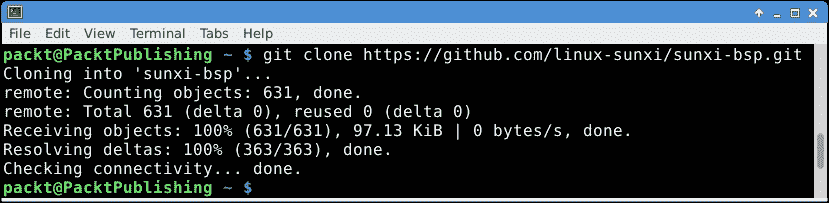
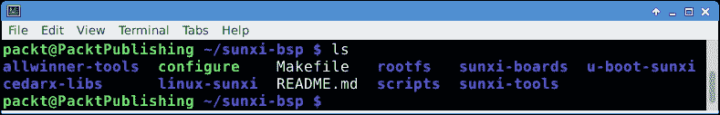
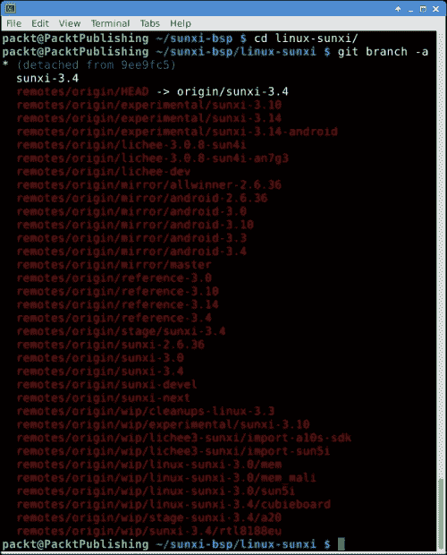
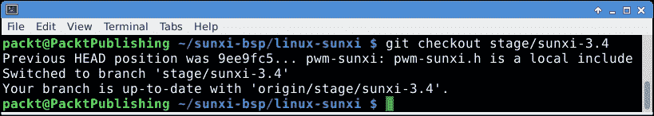

# 第七章 使用 BSP 编译引导加载程序和内核

有时候，内核中需要某个特别的功能，但该功能并未包含在预编译的二进制文件中，或者可能获得了某个基于 Allwinner 的新硬件，而该硬件还没有在现有的预编译文件列表中得到支持。为了解决这些问题，需要从源代码编译引导加载程序或内核。虽然可以单独下载并编译引导加载程序和内核，但 linux-sunxi 社区开发了一个**板支持包**（**BSP**），允许你将所有这些组件一起编译。

本章将涉及以下主题：

+   安装工具链

+   获取并使用 BSP

+   编译引导加载程序

+   编译内核

+   创建硬件包

# 前提条件

编译需要一个编译工具链。在这里，有两种选择。要么在 Cubieboard 上直接编译，要么在普通 PC 上进行交叉编译。除 Linux 外，其他系统上使工具链正常工作需要读者自行解决。因此，选择是使用前几章创建的安装环境，直接在 Cubieboard 上编译，或者使用可用的（虚拟）Linux 机器，安装并使用交叉编译器。本章将描述这两种方法。此外，编译设备需要初始的互联网连接，用于获取源代码。

# 安装工具链

工具链是一组工具，包括一个编译器，必要时用于将源代码编译为二进制文件。从理论上讲，仅编译器就足够了，但通常还需要其他工具来辅助编译。一个常见的例子就是大家熟悉的 `make` 命令。所有编译所需工具的集合被称为工具链。安装工具链在不同的发行版中有所不同；我们这里只介绍一些例子。

## Debian 或 Ubuntu

对于 Debian，工具链被称为 `build-essential`，当进行交叉编译时，需要在此基础上安装 arm 编译器；这个包名为 `gcc-arm-none-eabi`。遗憾的是，在编写本书时，`gcc-arm-none-eabi` 包在 Debian wheezy 中并不存在。wheezy 之后发布的版本是 jessie，其中包含了这个交叉编译器。获取它的一个方法是设置虚拟机并在其中安装 Debian 的测试版。

## Fedora

在 Fedora 上，安装过程稍有不同。这里需要使用 `groupinstall` 变体来安装 `Development Tools` 和 `Development Libraries` 包。为了进行交叉编译，还需要安装 `gcc-arm-linux-gnu` 包。由于元包中有空格，使用双引号（""）是必要的。

## 其他发行版

Fedora 和 Debian 当然只是潜在数百个发行版中的两个。然而，这两个发行版很好地指示了其他大多数发行版如何处理工具链的安装。这两个重要的发行版安装方式不同。对于 Gentoo 发行版，有一个 crossdev 工具集，它会编译并安装一个交叉编译器工具链。安装 crossdev 后，使用`crossdev --target arm-pc-linux-gnueabi`来安装 arm 工具链。Arch 发行版在**Arch 用户仓库**（**AUR**）中提供了`gcc-arm-linux-gnueabihf-bin`包。

### 注意

还有一些厂商提供的工具链，例如 Linaro 和 CodeSourcery 提供的工具链。这些工具链需要从厂商网站手动下载。通常，工具链以 tarball 或 ZIP 包的形式提供，并需要手动解压。这些工具链通常在没有本地 arm-toolchain 时使用。Linaro 甚至为 OSX 和 Windows 提供了交叉编译器；然而，这两者需要大量的工作才能开始编译。

# 其他必需的工具和软件包

获取了完整的工具链后，仍然需要其他一些软件包。Git 是用于源代码管理的工具；该软件包在几乎所有发行版中都被命名为`git`。

此外，还需要`u-boot-tools`。在某些发行版中，该软件包也被称为`u-boot-tools`或`uboot-mkimage`。

在一些发行版中，如前所述，在安装工具链时，**pkg-config**软件包有时没有被安装，需要在缺少该软件包的发行版上手动安装。该软件包几乎总是被称为 pkg-config。为了编译某些工具，`libusb`头文件是必需的。该软件包的名称在不同的发行版中可能有所不同。在 Fedora 中，它被称为**libusb-devel**。在 Debian 和 Ubuntu 中，它被称为**libusb-1.0-0-dev**。请注意，`libusb`在许多发行版中通常有多个版本。所需版本是`1.0`，其他版本可能会导致编译失败。

最后，需要*ncurses*头文件和库；该软件包被称为**ncurses-dev**或**ncurses-devel**。

# 获取和维护 BSP

无论 BSP 是进行交叉编译还是本地编译，获取和使用的方式是相同的，因此说明也是通用的。所有代码都存储在 git 服务器上，可以并且应该使用 GitHub 或 Gitorious 作为主要镜像来获取代码。使用 Git，可以从其中一个镜像克隆仓库，如下图所示：



进入 sunxi-bsp 目录后，将会看到以下文件和目录列表：



让我们花一点时间快速浏览一下这些文件目录列表，其中有些实际上是独立的 Git 仓库：

+   `allwinner-tools`：这是一个文件、驱动程序和工具的集合，用于处理全志提供的材料，如 livesuit。它在使用社区工具时并不重要。

+   `rootfs`：这些是要放入生成的根文件系统中的文件，通常称为`rootfs`。

+   `sunxi-boards`：这些是社区支持的开发板的 FEX 文件。有关 FEX 的更多信息，请参见附录 C，*FEX 配置文件*。

+   `u-boot-sunxi`：这是社区开发的引导加载程序。

+   `cedarx-libs`：这些是全志提供的专有**视频处理单元**（**VPU**）的库。

+   `linux-sunxi`：这是社区开发的 Linux 内核。

+   `scripts`：这些是 BSP 使用的各种脚本。

+   `sunxi-tools`：这些是与全志硬件一起使用的社区开发工具，包括将 FEX 文件编译成二进制 `script.bin` 的工具。

+   `Makefile`：这是一个控制如何编译各种仓库的文件。

+   `Configure`：这是一个选择和配置整个 BSP 的脚本。

+   `README.md`：这是一个简单的文本文件，包含一些基本的使用说明。

## 更新仓库

BSP 中的一些目录尚未填充。BSP 足够智能，能够在需要时自动填充所需的仓库。然而，如果某个仓库需要手动填充或更重要的是更新，可以使用 Git 来进行操作。更新仓库时，第一次使用时需要添加`–init`参数，具体如下：

```
packt@PacktPublishing:~/sunxi-bsp$ git submodule update --init sunxi-tools

```

如果省略最后一个参数，在这种情况下是`sunxi-tools`，将会更新并填充所有 Git 子仓库。然而，这并不总是会获得仓库的最新版本。BSP 控制每个仓库使用的版本。可以说，它将每个子仓库锁定到某个特定版本。可以通过 Git 更新 BSP，具体如下：

```
packt@PacktPublishing:~/sunxi-bsp$ git pull
Already up-to-date.

```

如果 BSP 没有更新或没有包含子仓库的最新更新，可以手动更新子仓库。要更新某个仓库，进入该仓库并使用常规 Git 命令来更新或切换到不同的分支，具体如下：

```
packt@PacktPublishing:~/sunxi-bsp$ cd sunxi-tools/
packt@PacktPublishing:~/sunxi-bsp/sunxi-tools$ git pull

```

请注意，这可能会破坏 BSP 本身的版本控制。也就是说，本地的 BSP 将不再与官方 BSP 匹配。为了删除本地子仓库所做的所有更改，并使 BSP 与上游版本同步，可以使用以下命令：

```
packt@PacktPublishing:~/sunxi-bsp$ git checkout – sunxi-tools

```

更新和修改 Git 中的子模块是完全安全的，开发者经常进行此操作。刚开始使用时需要小心，尤其是在不熟悉 Git 的情况下。

### 注意

强烈建议在修改仓库之前，具备一定的版本控制系统，特别是 Git 的经验。如果一切失败，放心，总是可以删除 BSP 并重新开始。

# 选择内核

如第六章中讨论的，*更新引导加载程序和内核*，有几个不同的内核可供选择。这些内核是根据 Git 仓库中可用的不同分支构建的。使用`git branch`命令可以列出这些分支，添加`-a`参数告诉 Git 显示所有可用的分支。在下面的截图中，讨论过的内核应该是第六章，*更新引导加载程序和内核*，可以识别出来：



这个分离的分支，在本书编写时，正是与 BSP 相关联的内核版本。使用`git checkout`，可以轻松切换到其他分支，最终切换到一个内核。这可以在下面的截图中看到：



# 为 Cubieboard 编译

在为 Cubieboard 编译之前，必须首先配置 BSP。每当为不同的开发板进行构建时，都必须重新配置 BSP。然而，使用配置脚本，这是一项非常简单的任务。运行没有参数的 configure 会填充`sunxi-boards`仓库，因为该仓库包含一个受支持的开发板列表，并会打印出可用的板子列表，如以下代码所示。请注意前缀`./`，它用于配置脚本。为了清晰和方便，这里简化了 configure 的输出：

```
packt@PacktPublishing:~/sunxi-bsp$ ./configure
Usage: ./configure <board>
supported boards:
 * a10s-olinuxino-m a10s-olinuxino-m-android
 * a10-olinuxino-lime a10-olinuxino-lime-android
 * a13-olinuxino a13-olinuxino-android
 * a13-olinuxinom a13-olinuxinom-android
 * a20-olinuxino_micro a20-olinuxino_micro-android
 * cubieboard cubieboard-android
 * cubieboard2 cubieboard2-android
 * cubietruck cubietruck-android

```

每块开发板都有两个变体，需要传递给配置脚本；Android 变体专门用于构建 Android 内核。虽然 Android 是 Linux，但仍然有一些小差异需要考虑。在下面的示例中，BSP 被配置为构建 Cubieboard2：

```
packt@PacktPublishing:~/sunxi-bsp$ ./configure cubieboard2
cubieboard2 configured. Now run `make`

```

现在，在运行之前，按照 BSP 的建议，还有一件事情需要提到。BSP 希望知道使用什么编译器，它通过`CROSS_COMPILE=`参数来判断。默认情况下，Makefile 会强制此参数为`arm-linux-gnueabihf-`，这是已安装的 arm 编译器的前缀。因此，`gcc`预计会命名为`arm-linux-gnueabihf-gcc`。当在这些板子上本地编译时，情况变得更加有趣。这是因为理论上，不需要交叉编译器，`gcc`应该直接称为 gcc。为了解决这个问题，可以传递一个空的`CROSS_COMPILE=`参数给 make，如下所示：

```
packt@PacktPublishing:~/sunxi-bsp$ make CROSS_COMPILE=

```

否则，需要添加已安装的编译器前缀，是的，末尾的破折号是前缀的一部分。如果在 Debian 上进行编译，可以使用以下命令：

```
packt@PacktPublishing:~/sunxi-bsp$ make CROSS_COMPILE=arm-none-eabi-

```

每个发行版通常会使用不同的交叉编译器名称，这没有对错之分。使用 arm-并双击 Tab 补全，几乎可以找到所有发行版的前缀。另外，向 Makefile 中添加正确的交叉编译器前缀也非常有帮助。

根据内存大小以及所使用的系统来进行编译，这个过程可能需要从几分钟到一两个小时不等！如果出现奇怪的崩溃或问题，在查看附录 A，*获取帮助与其他有用的在线资源*，以及如何联系社区寻求支持之前，请确保所选主板得到了充分的支持，并且电源供应充足。通常情况下，超频内存或电力不足会在内核编译的高负荷下表现出来。

虽然能够编译标准内核是件不错的事情，但通常情况下，有人会因为定制需求而编译内核，例如添加或移除某些驱动程序或选项。即使是定制补丁，也需要定制编译内核。通常情况下，`menuconfig`命令用于内核目录。BSP（板级支持包）也支持此操作，通过将`linux-config`参数传递给`make`命令，如下所示：

```
packt@PacktPublishing:~/sunxi-bsp$ make linux-config CROSS_COMPILE=arm-none-eabi-

```

跟随这些步骤会进入一个标准的`menuconfig`会话。

`make`命令的其他一些参数有 Linux 或 u-boot，它们仅用于编译 Linux 内核或仅编译 u-boot。生成的二进制文件将位于`sunxi-bsp/build`目录下各自的子目录中。

当编译完成时，所谓的 hwpack 或硬件包将会在`sunxi-bsp/output`目录中创建。硬件包是一个包含三个子目录的归档文件。第一个子目录叫做`bootloader`，其中包含`u-boot-sunxi-with-spl.bin`引导加载程序。

在`kernel`子目录下，特定板子的内核名为`uImage`，与特定板子的`script.bin`文件一起存放。

最后的目录是`rootfs`目录。这个目录包含了所有特定于所选目标板的内容。内容可以并且应该被复制到目标根文件系统中。

在第六章中，已详细描述了安装 hwpack 中的文件，特别是引导加载程序，*更新引导加载程序和内核*。

# 总结

本章介绍了 BSP 的基础知识。通过结合使用 Git 这个强大的工具来下载和管理各种源代码仓库，你可以编译各种组件，并生成一个易于使用的设备专用硬件包。

下一章将介绍**通用输入输出引脚**（**GPIOs**）。这对于执行各种任务非常有用，包括让 LED 闪烁！
