# 第八章：闪烁的灯光与感知世界

到目前为止，我们已经涵盖了 Cubieboard 的多个方面，但它们都是与软件相关的内容。与现实世界场景进行交互时，从让**发光二极管**（**LED**）闪烁到打开灯光，再到驱动电动机，事情变得更加有趣。一旦你将开发板连接到今天各种可用的设备，你可以做的事情就多了起来。一个机器人吸尘器的开发很大程度上是在开发板上开始的，工程师将各种传感器连接起来，使得机器人能够“看到”周围的环境。连接所有这些设备可能会非常复杂，可能不仅仅涉及电子学的基础；因此，本章将专注于电子学的基础知识，帮助你掌握一些基本内容，如连接 LED、使其闪烁，以及连接按钮以响应按压。

在本章中，我们将涵盖以下主题：

+   一些基础电子学概念的概述

+   如何切换**通用输入/输出**（**GPIO**）

+   如何连接按钮并读取其状态

# 使 LED 发光

今天，想象一个没有 LED 的世界几乎是不可思议的。它们在我们的智能手机上显示信息，作为电视和立体声设备的指示灯已经使用了多年，甚至有些大型屏幕完全由 LED 构成。具有讽刺意味的是，LED 的发明更像是第一代二极管的一个烦人的副作用。最初的设计并不是为了发光，在早期的设备中，二极管甚至被黑漆覆盖以隐藏它们的光芒。LED 这个名字已经如此普及，以至于它们的真正意义几乎可能被遗忘了。

使 LED 发光，然而，这确实需要一些技巧和专业知识，以确保不会把它弄坏。每个 LED 都有一些特性，例如它需要的工作电压以及能够通过它的最大电流。例如，蓝色 LED 需要比红色 LED 更多的电压和电流。因此，了解 LED 的技术细节是非常必要的。

## 所需的电阻

LED 只是一种特殊形式的二极管。它是电流的单行道，也就是说，电流只能按照预定的方向流动。而且，在连接 LED 时必须小心；如果它连接的方向错误，电流将无法流动，因而不会发光。然而，反过来就更有意思了。

让我们来看看当 LED 以正确方向连接时会发生什么。一旦提供了某个阈值电压，读取正向电压，二极管开始导通，LED 发光。至于流经二极管的电流，情况看起来有些不同。二极管将导通供给它的所有电流。不同类型的二极管在它们所用的电气设计中有不同的用途；在 LED 的情况下，目的通常是发光。这些类型的二极管通常只能通过非常少量的电流，通常在毫安级别。正如其名称所示，电阻限制通过它的电流流动，因此用于电流的调节，如下图所示：

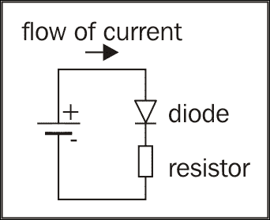

有很多网站可以帮助计算给定电压和电流的正确电阻；其背后的数学并不复杂。欧姆定律是用来计算电阻的常见公式。它表示如下：

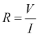

和：

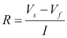

要计算电阻，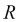，需要除以电流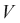。让我们了解如何确定所需的电压。为此，从可用电压中减去二极管的正向电压。这产生了下面这种形式的欧姆定律：

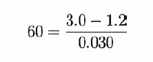

假设我们的电压源是 3.0 伏特，二极管的正向电压是 1.2 伏特。假设本例所需的电流为 30 毫安，那么在欧姆定律中填入这些值可得到以下结果：

从这点小数学中，我们了解到需要 60 欧姆的电阻来使 LED 发光，而不会试图消耗所有可用电流。然而，60 欧姆的电阻可能很难找到，只有两个选择。连接几个电阻以串联方式一个接一个地获得所需值，或找到一个接近值的电阻，比如 68 欧姆。重新排列欧姆定律并填入值可得到 26.5 毫安的电流流过 LED。这通常足以点亮 LED。这个计算可以在下面的公式中看到：

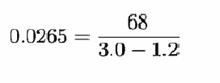

### 提示

使用电阻限制 LED 流过的电流不是点亮 LED 的最节能方法，但它是非常常见且最简单的方法。理想情况下，推荐使用恒流电源，这样就不再需要电阻。毕竟，LED 所能接受的最大电流本来就是它想要接收的电流。虽然这超出了本书的范围，但学习恒流电源和驱动 LED 是一个很好的练习。

## 吸收与输出

要将设备连接到 GPIO，理想情况下，GPIO 应该能够提供正确的电压和电流。不幸的是，这种情况很少发生。引脚提供的电压通常是供电电压或 I/O 电压，这两者都是芯片的输入电压。在全志 A 系列芯片的情况下，这将是 3.3 伏。GPIO 能够提供或吸收的电流是有限的。供电电流或输出电流（通常称为 sourcing）可以从 10 毫安到 40 毫安不等。引脚可以提供的电流量在 FEX 文件中配置，详细内容请参见附录 C，*FEX 配置文件*。输出电流的反义是吸收电流，但在介绍这一点之前，让我们先看看下图，其中一个 LED 直接连接到 GPIO。

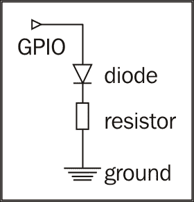

在前面的图示中，很明显 GPIO 引脚提供了电压，电流通过二极管流入地面。GPIO 是电流的“源”。相反的情况也是可能的；GPIO 吸收或导入电流，如下图所示：

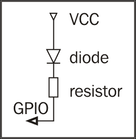

在前面的图示中，二极管由电源提供电压和电流；在电子学中，它通常被称为 VCC。然后，电流像之前一样流经二极管和电阻，最后被 GPIO 吸收。GPIO“吸收”了电流。虽然这种第二种方法和第一种方法一样有效，但有一些需要注意的地方。电源需要提供适当的电压，否则 GPIO 可能会过载，烧坏部件甚至整个芯片。在软件方面，GPIO 引脚将以相反的方式工作；当 GPIO 为高电平时，电压与 VCC 相同，因此没有电流流动。如果引脚设置为低电平，电压就可以流动。

### 小贴士

一个细心的读者可能会注意到，如果 GPIO 被设置为提供 30 毫安的电流，那么根本不需要电阻。虽然这是不推荐的做法，但它仍然是可能的；然而，在最终设计中绝对不应采用这种方法。

# 放大电压和电流

所有前述方法仅适用于需要小量电流的情况。那么，当需求较高电流时该怎么办呢？在这种情况下，会使用一个简单的晶体管。晶体管可以被看作是水管上的阀门。通常，阀门是关闭的，不允许水流动。当电流施加到晶体管的基极 **B** 时，阀门会慢慢打开，从集电极 **C** 到发射极 **E** 导通电流。电流的流动与施加到基极的电流成正比，因为晶体管本质上是一个电流放大器。此外，施加到基极的电流也会加到发射极的输出上，如下图所示：

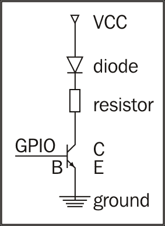

通过 VCC 提供的电压由晶体管的规格决定，而不是由 GPIO 决定。假设晶体管允许，24 伏特的电压可以通过晶体管调节，同时通过 GPIO 的 3.3 伏特进行控制。本质上，这是一个电压放大器，晶体管通常用于实现这个效果。

有两种类型的晶体管：PNP 和 NPN。上一段已经解释了 NPN 晶体管的基本工作原理。PNP 晶体管的工作方式恰好相反，意味着当没有电流通过 GPIO 输入到晶体管基极时，它会默认导通电流。如果电流被施加到晶体管的基极，晶体管将停止导电。

# 从软件控制引脚

有几种方法可以从 Linux 内部控制 GPIO。可以通过驱动程序从内核内部控制，或者通过许多编程语言之一，例如 C 程序或 Python 脚本。不过，最快最基本的方法是直接从控制台操作。当然，这假设用于控制 GPIO 的驱动程序已经作为模块加载或编译进内核中。请参考第七章，*使用 BSP 编译引导加载程序和内核*，重新编译内核并添加 GPIO 驱动程序。根据使用的内核版本，它被称为*sunxi 平台的 GPIO 支持*，并可以在**设备驱动程序**选项中的**GPIO**下找到。根据使用的 GPIO，FEX 文件需要修改以配置 GPIO 引脚。要将某个引脚设置为输出 GPIO，可以使用以下代码片段：

```
[gpio_para]
gpio_used = 1
gpio_num = 1
gpio_pin_1 = port:PB03<1><1><default><default><default>

```

如果一切都已正确设置，可以通过文件系统切换 GPIO 引脚，例如，写入 `1` 到 `pb03` 会使 GPIO 变为高电平，如下所示：

```
packt@PacktPublishing:~ $ echo 1 > /sys/devices/virtual/misc/sunxi-gpio/pin/pb03

```

同样，写入 `0` 会使其再次变为低电平。

### 注意

不仅在单个引脚的高电流负载下需要晶体管，通常所有 GPIO 总和能提供的最大电流也是有限的。因此，控制事物的最佳方法是始终使用晶体管。

# 上拉和下拉

配置为输入的 GPIO 仅仅是测量施加到其上的电压。如果电压高于某一阈值，则被认为是高电平或 `1`。如果电压低于某一阈值，则被认为是 `0`。以 Allwinner A 系列为例，一般来说，任何大于 2.5 伏的电压都视为高电平，小于 0.8 伏的电压视为 `0`。介于两者之间的电压则未定义，可能是 `0` 或 `1`。

有了这些知识，使用一个三位开关并将其连接到地面或 3.3 伏电源就变得很容易。以下图示展示了一个直接连接到 GPIO 的开关：

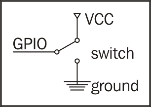

需要注意几个事项。存在一个过渡阶段，其中开关从一种状态切换到另一种状态，电压可能介于 3.3 伏和 0 伏之间。此外，一个引脚可以提供的最大电流将流入 GPIO，导致设计效率低下，甚至可能损坏芯片。通过使用电阻将任何状态永久连接到 GPIO，这两个问题都可以得到解决。如果使用电阻将 VCC 永久连接，则称为上拉电阻，因为电阻将电压拉高。如果电阻用于将引脚拉到地面，则称为下拉电阻，因为电阻将电压拉低到地面。以下图示展示了上拉电阻与开关配合使用的情况：

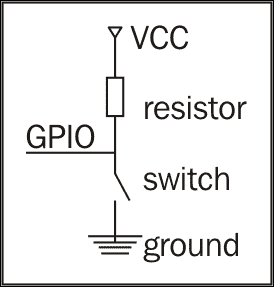

在这种情况下，GPIO 会看到高电压，并将其解释为逻辑 `1`。当按下开关时，电流会偏好沿着电阻最小的路径流动，由于 GPIO 内部自然有一定的电阻，电流最终会流向地面。

如果交换开关和电阻的位置，则会创建一个下拉电路。在这种情况下，GPIO 默认看到低电压，并将其解释为逻辑 `0`。当开关被按下时，电流将自然流向地面，GPIO 将其解释为逻辑 `1`。

在这两种情况下，电阻值的计算方式与 LED 电阻的计算方式类似。理想情况下，电阻值应该尽可能高，这样只有极少量的电流能流动，从而不浪费电能。然而，选择一个过高的电阻会导致电流过小，GPIO 无法感知电压。

在这两种 Allwinner SoC 的情况中，都可以通过 FEX 文件配置内部的上拉或下拉电阻。此时可以使用以下命令：

```
[gpio_para]
gpio_used = 1
gpio_num = 1
gpio_pin_1 = port:PB03<1><0><1><default><default>

```

如需更多详细信息，请参见附录 C，*FEX 配置文件*。是否使用上拉电阻或下拉电阻的选择取决于项目的需求。一般来说，如果引脚默认需要读取为`0`，并在按下按钮时更改为`1`，则使用下拉电阻。然而，实际上，上拉电阻通常更节能，因此更常用。

# 读取开关状态

读取开关的状态与写入 LED 类似。所有的先决条件都适用。唯一的区别是 GPIO 是通过`cat`来读取的，而不是通过`echo`来写入，如下所示：

```
packt@PacktPublishing:~ $ cat /sys/devices/virtual/misc/sunxi-gpio/pin/pb03
1

```

利用这些知识，读取按钮可以通过多种编程语言以各种形式实现。

### 提示

一个不错的练习是编写一个简单的脚本，读取按钮的状态，并使 LED 反映该状态。前面两个示例使用的是相同的 GPIO 引脚，因此如果尚未配置第二个引脚为 GPIO，则需要配置一个新的引脚。

从这里开始，有更多的方式和方法可以进行交互。有**模拟-数字转换器**（**ADC**）可用于读取模拟电压，**串行外设接口**（**SPI**）总线和**集成电路间总线**（**I2C**），也称为**双线接口**（**TWI**），可以连接大量外设，每种都能创造出精彩的发明。由于这是一本入门书籍，深入细节将需要更多的篇幅来解释各种技术。但希望它能激发你进一步寻找资源，继续实验并使用基于 Allwinner 的开发板。

# 总结

在本章中，我们讲解了一些基本的电子学知识，教读者如何连接 LED 和开关。我们还讨论了与 LED 开关接口时最常见的陷阱和最佳实践。让 LED 闪烁被视为嵌入式开发的 Hello World。
