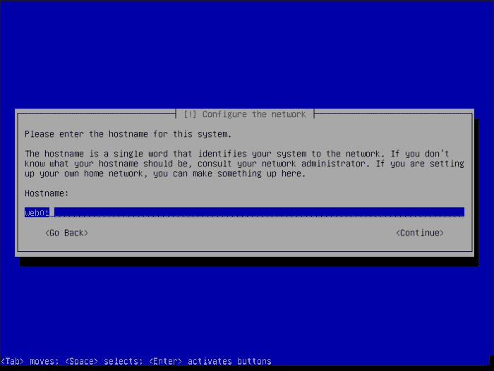

# 第一章：Debian – 构建一个 Web 服务器

欢迎来到*即时 Debian – 构建一个 Web 服务器*。

随着社交计算的到来，以及数据和基于 API 的经济的爆炸性增长，Web 应用程序达到了一个全新的水平。它们不仅仅是载体，而是 IT 行业中一个大部分的重心，包括企业客户。

现在，公司选择技术栈不再仅仅因为功能，而是因为缩短了上市时间，这使它们能够更快地增长并满足需求，同时保持合理的利润。

Debian 一直以来都是一个非常灵活的基于 GNU/Linux 的发行版，部分原因是其打包系统，另一个原因是得益于一个充满活力的开发者和维护者社区。

尽管它是一个经过验证的 Web 应用平台，大多数 Web 开发人员还是面临着陡峭的学习曲线。也许这是因为他们不熟悉 GNU/Linux，或者他们有使用其他打包系统（如 RPM）的企业经验，或是因为他们传统上没有管理性能或安全性等方面。

尽管本书旨在作为你 Debian 之旅的起点，但书中的标准化指令，如使用 `sudo` 或 `apt-get`，可以在你未来遇到的大多数管理和开发场景中复制应用。

本书还通过展示不同的架构，阐述了一种有效的性能和扩展方法，帮助适应增长，包括云计算，在云中 Debian 可以作为工作负载运行，提升你的效率。

本微型书籍涵盖了决策过程、安装和配置的内容，为你在 Debian 上部署基于 Web 的应用程序打下坚实的基础——无论这些应用程序是用 PHP、Perl、Python 还是 Ruby 编写的。

本书首先提供关于 Debian 的一些知识，然后将引导你完成一个适当配置的系统，解决 DevOps 遇到的最常见问题，如分区、文件系统权限或扩展，从而为 Web 应用程序提供一个简明易懂的 Debian 方法。

不再多说，我们可以进入第一组配方。

# 选择正确的 Debian 版本（简单）

Debian 项目以开发通用操作系统为荣。这意味着该项目开发的软件可以在多种硬件架构上运行，适用于多个不同的目的，甚至包括不同的内核，如 Linux、Hurd 或 FreeBSD。

为你的设置选择正确的 Debian 版本可能一开始看起来有些令人生畏，但本配方将为你提供决策要素，帮助你减少使用 Debian 的时间，并选择正确的架构和安装方法，特别是针对 Web 服务器。

## 准备工作

在任何时间点，Debian 都有三个不同的分支可供使用：稳定版（stable）、测试版（testing）和不稳定版（unstable）。可以把不稳定版看作是自由软件的前沿，它包含了相对较新的软件包，有时这些软件包会引入一些变化或功能，可能会破坏用户体验。经过一段时间（通常是 10 天，但这取决于软件包的上传优先级）后，新的软件被认为相对安全使用，并被移至测试版。测试版能够在现代软件和相对可靠的软件之间提供良好的平衡。测试版会经过几轮迭代，持续几年，最终会被冻结，作为新的稳定版发布。该稳定版会得到 Debian 项目的支持，包括特性和安全更新，支持多年。

你可能正在构建一些有趣的团队来支持它。在这种情况下，网页开发团队通常会选择使用测试版，甚至是不稳定版，以便获取最新的软件。在其他情况下，保守的团队或员工技术水平较低的团队则会选择使用稳定版，因为它能在几年内保持一致性。

选择哪种方法完全取决于你，但本书将带你从稳定版开始。你可以稍后修改 **高级包管理工具** (**APT**) 配置，升级到测试版和不稳定版，但我们使用的初始安装介质将是稳定版。另外，开发者应该尽量让生产环境和开发环境相似。如果你在生产环境中使用稳定版，使用稳定版进行开发将节省大量调试不匹配问题的时间。

你应该知道你的应用程序将要针对哪些版本的编程语言、模块、库、框架和数据库，因为这会影响分支的选择。你可以访问 [packages.debian.org](http://packages.debian.org) 查看不同分支中某个软件包的可用版本。选择测试版（在非冻结期）和不稳定版意味着你需要有一个升级策略，不断检查新的更新（使用如 cron-apt 等工具），并在需要时安装它们，以便利用新的错误修复等。

## 如何操作…

Debian 提供了多种操作系统安装方法。除了标准的 CD 和 DVD 外，Debian 还提供了减小尺寸的安装媒体、可启动的 USB 镜像、网络启动和其他安装方法。安装的复杂性是一个相对因素，通常对于 DevOps 来说并不重要，因为安装只会进行一次，而配置和管理则是持续进行的。

在你开始考虑复制方法（例如预制镜像、网络分发、配置管理和软件交付）之前，你和你的团队可以选择以下安装方法：

+   如果你是在第三方提供商（例如云服务商）上安装 Debian，他们会提供 Debian 镜像给你，或者你可以在虚拟化软件中准备好自己的镜像，并稍后上传磁盘。

+   如果你在自己的硬件上安装（包括虚拟化环境），建议选择 netinst ISO 或者完整的第一张 DVD ISO。这取决于你是否打算在几个月内安装多台服务器（从而随着新更新的发布，DVD 版逐渐变得过时），或者你是否有良好的互联网连接（或者代理、缓存设施、附近的 CDN 等），以便下载 netinst 镜像可能未包含的其他软件包。

一般来说，如果你只是部署少量的服务器，并且手头有良好的互联网连接，我建议你选择 amd64 netinst ISO，这也是本书中我们将使用的版本。

## 还有更多…

在选择合适的 Debian 版本时，你需要考虑一些其他因素。其中之一就是你使用的架构以及你为开发目标所选的架构。

### 架构

市场上有数十种计算机架构可供选择。ARM、Intel、AMD、SPARC 和 Alpha 都是不同类型的架构。

Debian 出于历史原因，使用了 i386 和 amd64 这两个架构代号。i386 实际上表示的是一个 Intel 或兼容 Intel 的 32 位处理器（x86），而 amd64 表示的是一个 Intel 或兼容 Intel 的 64 位处理器（x86_64）。处理器的品牌并不重要。

几年前，在这两者之间做出选择是一个棘手的问题，因为一些仅限二进制、非自由的库和软件并不总是可以用于 64 位处理器，架构不匹配的问题也时有发生。虽然有一些解决方法（比如使用特殊库运行仅支持 32 位的软件），但这基本上只是时间问题，直到像 Flash 这样的流行软件跟上 64 位版本的步伐——因此，这个问题主要是关于笔记本电脑和台式机。

如今，如果你的 CPU（和/或虚拟化管理程序）支持 64 位（大多数 Intel 支持），使用 amd64 架构被认为是一种良好的做法。在本书中我们将使用 amd64 架构。而自 Debian 7.0 以来，已包括多架构特性，允许在同一硬件上安装并激活多个架构。

尽管市场似乎已围绕 64 位 Intel 处理器稳定下来，但架构的选择仍然很重要，因为它决定了你可以从 Debian 中选择的软件的未来可用性。可能会有一些软件未针对你的特定架构编译，或者与你的架构不兼容，但也有一些软件与架构无关。

DevOps 通常在选择架构时务实，因此以下两个问题旨在帮助你了解在选择架构时应期待什么：

1.  你是否会在自己的硬件上运行 Web 应用？如果是，你是否已经拥有这些硬件，还是需要采购？

    +   如果你需要采购硬件，首先看看你数据中心现有的服务器硬件。在选择合适的架构时，诸如首选供应商、硬件标准化等因素都非常重要。从最流行的 32 位或 64 位 Intel 和 AMD 处理器、日益壮大的 ARM 生态系统，到更为传统但逐渐衰退的 SPARC 或 Itanium，Debian 支持许多架构。

    +   如果你打算购买新硬件，你的选择很可能会基于兼容 Intel 或 AMD 的 32 位或 64 位服务器级处理器。你的决策将受到 I/O 容量（吞吐量和速度）、内存、磁盘等因素的影响，而且架构很可能会被 Debian 所支持。

1.  你是否会在第三方硬件上运行你的 Web 应用程序，比如**虚拟专用服务器**（**VPS**）提供商或云**基础设施即服务**（**IaaS**）提供商？

    +   大多数提供商会为你提供预构建的 Debian 镜像。它们通常是 32 位或 64 位的 x86 镜像，并且有某种社区支持——但请注意，它们可能没有供应商支持，或者在某些情况下可能会放弃保修和/或其他因素，如 SLA（服务级别协议）。

    +   你应该能够使用虚拟化软件（例如 KVM、VirtualBox 或 Hyper-V）准备自己的 Debian 安装，然后将虚拟磁盘（VHD、VDI 等）上传到你的提供商。

# 安装 Debian GNU/Linux（简单）

一旦选择了合适的 Debian 安装方式，你就可以启动 Debian 安装程序。在安装过程中，你还需要进行初步配置，并决定几个重要的设置因素，比如分区。

## 准备工作

在开始安装 Debian 之前，你需要决定如何划分磁盘。除去**规范**的单一分区方式外，通常有其他理由需要分区，最常见的是出于安全或专用存储的需求。另外，如果你将使用 SAN/NAS 专用硬件，设置可以简化或复杂化。

Debian 像其他符合 POSIX 标准的操作系统和一些其他 Linux 发行版一样，遵循 FHS 或文件系统层次标准，你可以期望配置文件位于`/etc`，系统文件位于`/usr`和`/lib`，可变文件位于`/var`，等等。

然而，可能会有一些差异。FHS（文件系统层次结构标准）规定`/srv`用于服务器角色，但大多数安装将可变文件放在`/var`中。静态文件、应用程序文件甚至数据库文件都会存放在那里。因此，如果你有高级的分区或权限需求，你可能希望将`/var`放在不同的分区中。你甚至可以将`/var/lib/mysql`用于 MySQL 数据库文件，`/var/www`用于静态和应用程序文件（即`WWW/Document Root`文件夹），等等，正如我们在本书中的示例中使用**逻辑卷**（**LVM**）所展示的那样。

逻辑卷将使你能够在你已经了解的概念（磁盘和分区）之上创建更灵活的数据容器。这些由逻辑卷创建的灵活数据容器可以扩展到不同磁盘上的不同分区，且更易于管理、调整大小和移动。但它也可能增加管理开销，并且需要为集群设置更复杂的配置。

**粒度**指的是根据使用场景在不同分区上设置不同行为的能力。例如，系统管理员可以将 `/var/mail` 分区出来，以设置 ACL、配额等，DevOps 可能希望将 `/var` 分区出来，以设置像 `noexec`（禁止执行文件，在 Web 应用程序中可以，因为 `/var` 外的进程才实际运行你的应用程序）、`nodev`（禁止特殊设备文件）、`nosuid`（禁止自动提升权限的文件）等安全标志，或者移除影响性能的文件系统属性（例如时间），等等。

以下是一些标志及其对分区的影响：

| 标志 | 描述 |
| --- | --- |
| `nodev` | 不解析任何特殊文件用于设备（字符设备或块设备特殊文件） |
| `nosuid` | 不允许启用用户或组模拟（例如，以 root 身份运行）的文件 |
| `noexec` | 不允许在文件系统中执行二进制文件，这不仅对于像`/tmp`这样的公共访问分区有用，还适用于任何没有意义的可执行文件（例如纯 Web 应用程序！） |
| `noatime` | 不更新文件系统 inode 的访问时间，使得对于包含大量小型、频繁访问文件的服务器，访问速度更快 |

你可能想要分区的其他目录是 `/tmp`，它将不可避免地存储由框架、应用程序服务器和其他服务生成的临时文件，这使得 `noexec/nodev/nosuid` 的组合在这种情况下非常流行，用来防止执行潜在的恶意文件，同时通过专门的磁盘空间监控来防止分区填满，从而防止服务器崩溃。

在其他场景中（例如我们之前讨论的邮件服务器），人们会发现将 `/home` 分区出来非常有价值，因为他们可以设置 ACL 和配额，更容易管理空间。但在 Web 应用程序服务器的场景中，虽然你可以继续进行分区（Debian 会为你分区 swap 空间和 `/boot`），但是继续进行（如 `/usr`、`/etc` 等）带来的好处是有争议的，并且可能增加不必要的复杂性。

## 如何操作……

一旦你决定了是否要进行分区，如何划分磁盘空间，设置哪些标志/策略到每个分区，以及是否使用 RAID、LVM 或其他技术（如 SAN/NAS 等），你可以按照以下步骤来安装 Debian：

1.  访问 [www.debian.org/distrib/netinst](http://www.debian.org/distrib/netinst)，在 **Small CDs** 下选择 **amd64**。ISO 文件将开始下载。你可以将 ISO 刻录到 CD/DVD（如果你需要一个物理光盘进行安装），或者用这个 ISO 文件启动你的虚拟化管理程序。从 Debian 7.0 开始，ISO 文件也可以写入 USB 媒介，你还可以在 `hd-media` 文件夹中找到旧版本的专用镜像。有关安装的详细说明，请参考安装手册，网址为 [`www.debian.org/releases/stable/installmanual`](http://www.debian.org/releases/stable/installmanual)；或者，你也可以使用 UNetbootin 从 netinst ISO 创建可启动 USB。

1.  启动你的服务器，将 netinst 光盘放入 CD/DVD 驱动器。重启服务器并按照屏幕上的指示（或手动说明）从 CD/DVD 启动。Debian 会显示如下界面：

1.  按 *ENTER* 键即可开始安装。Debian 安装程序将引导你通过一系列提示（利用名为 debconf 的技术）帮助你完成安装和初步设置。你也可以选择 **图形化安装**，该选项会带你走过相同的步骤，但具有鼠标支持、颜色、按钮和滚动条。在两种模式下，你都可以使用快捷键简化操作（例如，在以下界面中，按 *S* 键即可从语言列表中选择 **西班牙语**，还可以使用 *Home*/*End*/*Page Up*/*Page Dn* 等键）。

1.  选择安装语言。如果你选择 **英语**，可以直接按 *Enter* 键。Debian 以其安装程序支持多种语言而自豪。你的选择还会提示安装程序默认的国家、镜像源和时区。根据你的所在位置，你可能需要调整后续的设置。特别注意时区设置，因为时间同步和正确的主机名对于 Linux 服务器的正常运行至关重要。你的选择还会决定键盘布局。例如，使用拉丁字母的非英语国家用户可能会选择 **US – International**。

1.  现在，Debian 会检查网络连接情况，特别是尝试从 DHCP 服务器获取 IPv4 地址。这可能不适用于你的情况，因为在 Web 应用环境中通常不会部署 DHCP 服务器。此操作会超时，你将被要求配置网络接口：服务器的 IP 地址、子网掩码、网关和 DNS 服务器。该界面将类似于以下截图：

1.  下一步是主机名/域名提示。如前所述，这是一个重要部分，因为你需要构建一个**完全限定域名**（**FQDN**），它看起来像`foo.bar.com`，其中`foo`是你的主机名，`bar.com`是你的域名。你不需要**拥有** bar.com——即使你拥有，IP 地址也不需要匹配或存在于你的 DNS 区域中。尽管如此，强烈建议使用一个真实的 FQDN——无论是为了故障排除还是性能原因。你需要配置 FQDN，因为稍后你将在网络故障排除、集群、文件复制等方面使用它；如果没有正确配置，它可能会成为许多麻烦的根源。大型服务器配置使用命名法来定位他们所管理的服务器（例如，www-mia-01 或 db-pdx-05）。主机名输入界面如下所示：

    同样地，对于 FQDN，如以下截图所示：

    

1.  接下来，定义根（管理员或超级用户）密码。你应该选择一个复杂的密码，即使它很难记住，因为你不会每天都使用它，通常会使用`sudo`——这是一种委托机制。你还将定义一个没有特殊权限的初始用户（但具有基本设备访问权限）——如果你愿意，可以填入通用信息，但仍需用强密码保护该账户，因为该用户能够通过**安全外壳协议**（**SSH**）登录并在终端中执行命令，在 Web 应用场景中，这些都是潜在的入口点。我们将使用 DevOps。

1.  现在是分区的时机了。通过在准备阶段收集的信息，你现在将定义分区，可以手动进行（大概率）或使用引导模式。在引导模式下，设置 LVM 会更容易，但你最终只有三种选择：所有分区为一个，单独的`/home`，或单独的`/home`、`/usr`、`/var`和`/tmp`——如前所述，你可能不希望将`/home`和`/usr`拆分。你始终可以删除这些分区，并将空间归还给`/var`和`/tmp`（除非你有一个占用内存较多的应用程序，否则`/tmp`可能是几个 GB）。另外，你也可以在系统运行时更改分区（甚至重新分区并调整大小），理想情况下在你开始将数据投入其中之前。

1.  我们建议你选择 LVM 和所有分区合并为一个，然后删除根分区的逻辑卷，并开始将该空间拆分成新的逻辑卷。在我们的示例中，我们为 Web 服务器文件、数据库文件、`/tmp`和剩余磁盘空间各分配一个逻辑卷。使用 LVM 和整个磁盘选项如以下截图所示：

1.  同样地，使用单个分区，如以下截图所示：

1.  然后你可以删除逻辑卷并开始创建新的卷，如下图所示：

1.  此外，开始在剩余的主卷组中创建新的卷，如下图所示：

1.  你可以为每个你创建的逻辑卷/分区单独设置分区选项，如下图所示：

    这是我们选择的汇总表，供未来参考：

    | 分区 | 大小 | 标志 | 保留空间 |
    | --- | --- | --- | --- |
    | `/var/lib/mysql` | 足够大以容纳预计的表、索引等 | `nodev``nosuid``noexec`优化为大文件 | 无 |
    | `/var/www` | 足够大以容纳你的应用脚本和静态文件 | `nodev``nosuid``noexec``noatime` | 无 |
    | `/tmp` | 如果你在这里写入数百 MB，可能需要使用其他分区 | `nodev``nosuid``noexec``noatime`优化为小文件（可能有所不同） | 无 |
    | `/boot` | 足够大以容纳预计的操作系统大小。安装书中所有软件后的`/`最终大小小于 850 MB。 | 无（`/boot`包含内核和 initrd 文件，除非你计划收集小于 100 MB 的内核，否则它应该足够） | 5％（默认） |

1.  分区还涉及对分区的初始格式化。自 wheezy（版本 7.0，发布于 2013 年 5 月 [`www.debian.org/releases/stable/amd64/release-notes/`](http://www.debian.org/releases/stable/amd64/release-notes/)）以来，Debian 默认使用 ext4 文件系统，但你可以将其更改为任何其他你偏好的受支持文件系统。如今，在存储硬件和文件系统创新的双重驱动下，正处于一个黄金时期。你的应用程序最有可能是 I/O 受限的，这意味着更好的磁盘架构（缓存、速度、数据分布、底层技术等）将有助于更好的性能和可扩展性。

分区和格式化完成后，Debian 准备好将操作系统和初始软件安装到磁盘中。

## 还有更多内容…

如果你使用的是 netinst 磁盘，系统会提示你使用一个在线仓库（镜像），这个镜像通常会根据你选择的国家自动预选。你可以选择它，如果你正确配置了网络接口，或者你也可以随时跳过（一个好技巧是按*Esc*键返回到上级菜单），然后只安装 netinst 磁盘自带的基本内容。

如果你成功选择并能够访问公共互联网存储库（档案），安装程序将提示你进行安装任务，这些任务基本上是已经预先分类的包的集合，便于操作。Netinst 实际上不会携带很多任务，因为磁盘本身并没有携带太多的包；不过，仅供参考，Web 服务器任务会为你安装 Apache，而数据库任务会为你安装 PostgreSQL。否则，你可以选择标准系统工具任务。

此外，你还需要选择是否加入 popcon，一个匿名调查，其中你使用和安装的包会被匿名发送给 Debian 用于统计目的。我们建议你选择默认选项（退出），特别是为了避免生产服务器的外发流量，但如果你希望帮助 Debian 项目更好地了解全球安装计算机的配置文件，数据流量每天仅几千字节。

你几乎完成了。Debian 安装的最后一个问题是是否要安装 GRUB 启动加载程序（你可能正在使用自己的启动加载程序，或者某种特定架构）。如果是的话，直接按 *Enter* 即可。安装将完成并重启（磁盘可能会被弹出，如果没有，自己弹出），在 GRUB 菜单上稍等片刻，服务器将启动进入你的新系统（你可以按 *Enter* 跳过）。初始化系统将启动，几秒钟后你将看到一个带有主机名的登录提示。输入 `root` 和你的密码，你将看到一个全新的命令行提示。欢迎使用！

# 让 Debian GNU/Linux 安装可扩展（中级）

10 年前，Debian 并不被认为是一个易于安装的发行版，周围还有一种排他性的负面气息。尽管安装过程相对简单，但你可能会猜测，如果要为几十台甚至上百台服务器重复这一过程，肯定是一件麻烦的事情。

## 做好准备

有几种选项可以帮助你扩展安装规模：

+   推出你自己的安装媒体

+   通过网络安装

+   通过镜像服务器安装

+   预配置安装

## 它是如何工作的…

推出你自己的安装媒体（重新制作）涉及对 APT 仓库、ISO 9660 结构和预先配置的了解。重新制作的目的是将你需要的包和初始配置决策添加进去，将它们放到一个能够在安装过程中节省时间的介质上。由于所有这些步骤超出了本书的范围，我们将引导你使用一些辅助工具，如 live-scripts 和 UCK。

第二种选择，通过网络安装，已经在 Debian 安装指南中详细说明，并且可能比携带光盘在数据中心中跑来跑去节省时间。关于服务器镜像，SystemImager 和 Clonezilla 是流行的解决方案，特别是在硬件（如磁盘大小等）相匹配的情况下。这里的思路是首先安装系统，配置它，然后创建一个镜像并复制到其他服务器。使用镜像时，请注意需要更改主机名——在`/etc/hosts`和`/etc/hostname`中使用`hostname`命令——以及其他任何与系统相关的数据。

## 如何操作…

**预设**是节省 Debian 安装时间的最快方法之一。与重制系统类似，您首先安装一个系统，然后提取通过`debconf`程序处理的配置提示答案，以便它们可以在新安装中重用。

1.  您还可以通过使用标准工具，指定所需的多个答案来创建您自己的预设文件：

    ```
    apt-get install debconf-utils
    debconf-get-selections –installer >preseed.cfg

    ```

1.  使用您喜欢的编辑器检查此文件的内容（`editor preseed.cfg`）。您会发现，安装程序中提出的问题前面有**#**，而您的答案则在下方。一些答案，例如密码，不会包含在内。此外，还有很多您甚至不记得被问到的答案——这些是默认值。最后，您会注意到没有关于分区选择的答案，因为您可能有不同的服务器，硬件和存储也各不相同。

1.  一旦您有了可用的预设文件，您可以选择**高级选项**，然后选择**自动化安装**，并指定您的预设文件的 URL，而不是选择 Debian 的**安装**选项。您可能会发现最简单的方法是从另一台 Web 服务器提供该文件。

1.  您还可以使用`debconf-get-selections`，不带`–installer`标志，提供更广泛的选择，而不仅仅是安装时的选择。这在配置过程结束时（即当您完成本书时）捕获这些选择非常有用。

    ```
    debconf-get-selections> package-choices.log

    ```

## 还有更多…

这些工具的输出可以随时通过先前的步骤反馈给安装程序或系统。请注意，有些系统方面不一定由`debconf`选项控制。例如，您的 Apache 或 MySQL 配置文件的内容大多是手动编辑的，不会在`debconf`中注册。

Debian 的在线文档和参考手册包含了大量关于多个预设选项的深度参考，以及您可以编辑的大型预设文件：

+   [`www.debian.org/releases/stable/amd64/ch04s05.html.es`](http://www.debian.org/releases/stable/amd64/ch04s05.html.es)

+   [`d-i.debian.org/manual/en.i386/apb.html`](http://d-i.debian.org/manual/en.i386/apb.html)

# 为您的环境准备 APT 包装系统（简单）

APT 是 Debian 中一个成熟的部分，成为该发行版多年最重要的差异化特征，支持了成百上千个衍生项目，包括 Ubuntu。由于自由软件由多个方分发，且在打包格式、发布日期、版本控制、配置文件等方面并不总是完全协调一致，发行版通常需要以一致的方式将最广泛的软件集合整合在一起，确保对大多数用户都适用。

APT 提供了一种简便、稳健的方式，让用户可以安装软件，并让 Debian 负责从互联网镜像拉取软件、解决依赖关系和冲突、安装软件并做出基本的配置选择。这就是它如此重要的原因。

## 准备工作

APT 的主配置文件是 `/etc/apt/sources.list`。在该文件中，你定义了是否使用二进制包和源包，是否接收安全更新，以及系统使用的分支和部分：main，其中包含大多数软件并且仅限于自由软件；contrib，包含依赖于专有软件的软件；non-free，包含可以重新分发的专有软件，这是 Debian 决定分发的。

## 如何操作…

使用文本编辑器打开 `/etc/apt/sources.list`，并按照以下步骤设置 APT：

1.  对于大多数 web 服务器场景，你不需要源仓库，也不需要 contrib 和 non-free，你需要确保可以接收安全更新。因此，`/etc/apt/sources.list` 可能看起来非常简单：

    ```
    deb http://ftp.us.debian.org/debian/ wheezy main
    deb http://security.debian.org/ wheezy/updates main
    ```

1.  对该文件的更改不会立即生效。你需要更新你的 APT 系统，也就是上线并抓取最新的可用软件和更新列表。你可以使用 apt-get 工具来完成这个操作，命令如下：

    ```
    apt-get update

    ```

1.  如果在安装 Debian 时选择了镜像（使用 netinst），并且当时你有互联网连接，那么该文件会为你预先填写。如果没有选择镜像，你将以 CD 作为第一个仓库，并以 [security.debian.org](http://security.debian.org) 作为第二个仓库。在这种情况下，你可以清空该文件并使用前面提到的格式。

## 还有更多…

APT 还有其他配置选项，比如代理和 pinning/优先级设置，以及其他操作，如全系统升级。这些在生产系统中很少需要（像 pinning 这样的功能可能会有用，但超出了本书的范围）。我们稍后会介绍其中一些，但上面的步骤已经足够让你拥有一个配置好的 APT 系统。

另外，请记住，操作 APT 系统时有两个主流工具：apt-get 和 aptitude。我们认为它们是可以互换的，但高级用户会对其中某一个产生强烈的依赖，您肯定希望从一开始就标准化使用。这个现象也有其周期性，五年前，aptitude 因为智能的依赖解析而非常流行，然而似乎 apt-get 在过去一年多中获得了更多的关注，主要是受 Ubuntu 推动。作者曾是 aptitude 的坚定支持者，但最近他发现自己开始使用 apt-get，尤其是在这本书中。

虽然在两个系统中，安装、删除、更新和分发升级等操作都非常相似，但 aptitude 具有更好的搜索功能（aptitude search [term]）和一个可以处理损坏包情况的界面（只需输入 aptitude）。

# 安装您的应用平台堆栈（简单）

除非您使用了安装食谱中提到的任务，否则您现在已经配置好了服务器。要将其转变为 Web 服务器，您需要安装 Web 服务器、数据库（如果您将托管一个数据库）、编程语言/环境、库、任何您使用的 Web 框架等等。幸运的是，Debian 为您提供了其中的一些软件包，并且因为您已经配置好了 APT 系统，您可以更快地开始。

## 如何操作...

尽管有几个适用于 Debian 的 Web 服务器，但主要有两种：Apache 和 Nginx。它们有不同的执行模型——Nginx 是一个轻量级、事件驱动的服务器，通过 CGI 异步运行您的应用程序，而 Apache 功能丰富，采用线程/进程的方式，且更加成熟。您还可以采用双重方式，即 Nginx 作为前端与 memcached 配对，处理并发请求，而 Apache 则作为后端提供应用服务。

1.  在任何情况下，您都需要通过 APT 安装 Web 服务器。

    对于 Apache：

    ```
    apt-get install task-web-server #

    ```

    对于 Nginx：

    ```
    apt-get install nginx #

    ```

1.  如果您安装了 Apache，您会注意到它有几种不同的版本作为不同的软件包提供；worker 是 Apache 的 **MPM**（**多处理模块**）之一。您也许还想使用 prefork，因为它提供了类似于 Apache 先前版本的操作模型，并且避免了线程问题，这可能在使用非线程安全的库时成为问题。只需执行 `apt-get install task-web-server apache2-mpm-prefork+`（可以把加号看作是“我非常需要这个软件包”）。

1.  配置您的 Web 服务器有两个步骤：配置您的站点或虚拟主机，以及配置您的应用程序执行方式。

1.  在 Apache 和 Nginx 中配置虚拟主机都非常简单。它们都有 `sites-available` 文件夹（分别位于 `/etc/apache2` 和 `/etc/nginx`），您可以在其中放入对应主机的配置文件。然后，您可以将该文件链接到 `sites-enabled/` 文件夹（或者对于 Apache，使用 a2ensite/a2dissite 工具），并重新加载服务器。

    对于 Apache：

    ```
    service apache2 restart #

    ```

    对于 Nginx：

    ```
    service nginx restart #

    ```

1.  配置应用程序的执行方法取决于你使用的编程语言（如 Perl、Python、PHP、Ruby 等）。我们假设使用 PHP。如前所述，虽然 Nginx 通过 FastCGI 运行 PHP，Apache 也提供了使用`mod_php`的选项，其中 PHP 基本上被嵌入到 Apache 进程中。为了实现这一点，你只需要安装并启用`mod_php`模块：

    ```
    apt-get install libapache2-mod-php5

    ```

    对于 Nginx，最简单的配置方法是生成一个 PHP FastCGI 进程（手动或可选使用`init`脚本），并设置 FastCGI 参数，如 Nginx Wiki 页面所描述的 ([`wiki.nginx.org/PHPFcgiExample`](http://wiki.nginx.org/PHPFcgiExample))。在这里，你可以找到许多其他的配置片段，包括高级代理、缓存以及针对 CMS 和其他编程语言（除了 PHP）特定的指令。

    将数据库与应用服务器分离也许是有意义的，因为数据库是 I/O 密集型的，而 Web 应用程序通常不是。但你可能没有足够的硬件，或者你可能计划在应用程序和数据库单元上进行紧密的扩展。或者你可能根本不使用传统数据库。但我们假设你使用的是。

1.  与应用服务器类似，关系型数据库管理系统（RDBMS）有两个选择：MySQL 和 PostgreSQL。Debian 的默认数据库是 PostgreSQL，但你可以自由选择。

    ```
    apt-get install mysql-server

    ```

    或者

    ```
    apt-get install postgresql

    ```

    配置涉及很多变量，从性能到安全性，虽然默认配置足以设置服务器，但我们将在本书后续部分提供一些建议。

1.  最后，你需要为所使用的编程语言安装适当的绑定，否则应用程序将无法连接到数据库。例如：

    ```
    apt-get install php5-mysql

    ```

1.  很可能，你所使用的语言的解释器已经在 Debian 上安装（如 Perl、Python），或者可以方便地获取（如通过`mod_php`的 PHP，Ruby 等），但某些库可能没有安装。例如，如果你的应用需要`gd`扩展，可以执行以下操作：

    ```
    apt-get install php5-gd

    ```

尽管你可能会在 Debian 的软件包仓库中方便地找到像 Dancer、Rails 或 Symfony 这样的框架，但它们天生就是不断变化的，大多数开发者都从项目网站下载并在 APT 系统外自行构建。我们将在本书后面简要讨论框架。

# 设置存储、安全性和权限（简单）

如前所述，分区对于 Web 服务器非常重要。你已经通过选择要分区的目录（希望至少是`/tmp`和`/var`或`/var/www`）迈出了第一步，但现在你需要为它们设置安全性和权限。

## 准备工作

如果你将为用户和组创建多个配置文件，这是在准备加固存储权限时回顾它们的好时机。在 Unix 系统中，一切都是文件，很多安全措施依赖于文件系统的安全性。

## 如何操作……

在根目录下，使用文本编辑器打开`/etc/fstab`文件。在文件的末尾，你将看到在安装过程中创建的分区信息。


你可以看到我们已经将**/tmp**、**/var/lib/mysql**和**/var/www**文件夹分区。在大多数情况下，你不需要调整第一列的设备名称（安装程序已为你确定），但你必须确保：

+   挂载点设置正确。

+   使用的文件系统是你所需要的（Debian 默认使用 ext4，虽然还有许多其他可用的文件系统）。

+   挂载选项设置正确：**noatime**或**relatime**（不会在每次访问时间变化时写入磁盘，从而加速操作。实际上，这在 Web 服务器上并不是很有用，尽管一些 Unix 工具会期待这种行为），**noexec**（禁止执行文件），**nodev**（不允许特殊设备文件），以及**nosuid**（不允许具有提升权限的文件）。

通过应用这一基本的安全措施，你将关闭一组重要的攻击向量，因为大多数攻击者依赖于`/tmp`文件夹具有世界写权限，以便在其中放置并执行恶意脚本。此外，`/var`包含了`/var/www`和`/var/lib/mysql`或`/var/lib/postgres`，这些也将受益于这一安全措施。

权限设置也非常重要。在 Debian 上，Nginx 和 Apache 进程以名为 www-data 的系统用户身份运行。这个用户必须对你的应用程序脚本和静态文件（通常位于`/var/www`）具有读取权限。但除非你的应用程序允许上传或编辑该文件夹中的文件，否则不需要写入权限。以下两项操作可以帮助你重置权限：

```
chown –R www-data:www-data /var/www # resets owner and group to www-data
chmod –R a-w /var/www # removes write permissions for all users on www-data

```

对于 MySQL 和 PostgreSQL，Debian 通常会在存储权限方面做出正确的默认设置（`/var/lib/mysql`由 MySQL 拥有）。

# 设置你的数据库/数据存储（中级）

数据库配置涉及很多变量，从性能到安全，尽管默认配置足以搭建你的服务器，但仍有一些部分需要你手动调整。

## 入门

Debconf 会询问你一些关于数据库的问题，比如 MySQL 的 root 密码；然而，如果你真正想进行性能调优，你将需要深入配置文件和文档。同时要注意，MySQL 用户与系统用户是不同的（即使名称相同）。

你还应该对应用程序如何消费数据有基本了解，这样才能选择正确的性能优化路径。在适当的章节中，本书将涵盖一些关于日志记录和性能的建议。

## 如何操作…

以下步骤将引导你创建并设置一个新数据库：

1.  作为 root 用户，你可以继续在 MySQL 上创建一个新数据库，例如：

    ```
    mysql –u root –p # type in your password
    CREATE DATABASE book;
    ```

1.  创建一个名为`book`的新用户，密码为`book`，该用户可以在这个新数据库的所有（当前和未来）表上执行所有操作，例如：

    ```
    GRANT ALL ON book.* TO book@localhost IDENTIFIED BY 'book';

    ```

    或者在 PostgreSQL 中，以 postgres（管理员，相当于 Unix 中的 root）用户身份：

    ```
    su – postgres
    createuser –P book
    createdb –O book book

    ```

上面的 `GRANT` 语句在生产环境中并不推荐。你能找出为什么吗？首先，密码很弱——尽管 MySQL 只允许本地连接，但攻击者可能会在远程植入密码破解工具。其次，我们为单个用户授予了 `ALL` 权限，这不是一种合适的做法；我们可以将其限制为仅 `SELECT`、`INSERT` 和 `UPDATE`，而你的应用程序可以跟踪记录的状态，以避免执行 `DELETE` 操作。例如，类似地，注意 PostgreSQL 中 `createdb` 的 `–O` 选项将书籍设置为数据库所有者，从而有效地授予用户诸如销毁对象的权限。

这个用户名和密码是你将提供给应用程序开发者的，用于将应用程序连接到数据库。需要注意的是，虽然可以从应用程序将最终用户凭据传递给数据库进行日志记录（从而在数据库上实现更深入的审计功能），但这也很复杂，通常最快的方法是通过 PAM 配置，这超出了本书的范围。

1.  使用 `mysql –u book –p <database>` 或 `su – book` 然后 `psql<database>`，你可以访问 MySQL 和 PostgreSQL 的交互式终端。其他数据库，如 SQLite 或 MongoDB，也有类似的命令来访问控制台。

1.  你的数据库管理员可能还会提供归档文件、转储文件或架构文件，你需要将其加载到数据库中。小的架构（通常包含许多 `CREATE TABLE` 语句）通常可以直接复制粘贴到交互式终端中。较大的架构，或包含初始数据（如 `INSERT` 语句）的较大转储文件，可能需要通过命令行加载，例如：

    ```
    mysql –u root –p book <book.sql
    psql book <book.sql

    ```

    ### 注意

    你还可以使用控制台命令，如 PostgreSQL 中的 `\i book.sql` 或 MySQL 中的 `source book.sql`。

在 PostgreSQL 中，还存在归档文件，这是一种更封装的方式，用于分发数据库的完整快照。通过 `pg_archive` 生成这些归档，并通过 `pg_restore` 恢复。你可以在本书后面的章节中进一步了解备份和恢复。

默认情况下，MySQL 和 PostgreSQL 都会生成套接字，供你的应用程序访问数据库。这对于本地应用程序工作良好，但如果你将数据库和应用程序分开，你需要设置网络和访问控制。

1.  编辑 MySQL 的配置文件，并允许 MySQL 在外部接口上监听：

    ```
    editor /etc/mysql/my.cnf

    ```

    找到 `bind-address` 指令并更改为 IP 地址

    +   `service mysql restart`

1.  编辑 PostgreSQL 的访问配置文件，并允许 PostgreSQL 接受通过网络认证的连接：

    +   `editor /etc/postgresql/9.1/main/postgresql.conf`

    +   添加一行类型为 `host book all 172.16.0.2/32 md5`，其中 `host` 表示该指令适用于远程主机，`book` 是该指令适用的数据库名称，`all` 表示任何经过正确身份验证的用户都将被授予访问权限，`172.16.0.2/32` 是应用服务器的 IP 地址，`md5` 表示将使用 MD5 密码验证。

1.  现在通过 `service postgresql reload` 重新加载 PostgreSQL。

# 配置你的编程语言库（Medium）

框架现在非常流行。Symfony、Rails、Django 或 Dancer 都是专业 Web 开发的代表，而 Debian Web 服务器对它们来说并不陌生。赋能这些框架的库和模块也很受欢迎，系统管理员了解如何设置它们是很重要的。

## 入门

你可以选择使用预打包的框架或自己下载并安装它。预打包的框架可能在设置和管理上更为简便，但也可能是旧版本。你还将通过 APT 系统本身接收安全更新。

## 如何操作…

1.  搜索你的库。一些 PEAR 库在 Debian 上可以使用，CPAN 库也可以用于 Perl，Ruby gems，Python 模块等。以下是一些有用的搜索：

    ```
    aptitude search ^php-.*
    aptitude search ^lib.*-perl
    aptitude search ^ruby\|libruby-.*
    aptitude search ^python-.*
    ```

1.  在其他情况下，你可以使用 pear、rubygem 客户端进行手动安装（CPAN 在 Debian 中自带）。

    ```
    apt-get install php-pear
    apt-get install rubygems
    ```

1.  这是一个使用 Dancer 框架的示例：

    ```
    sudo apt-get install libdancer-perl
    sudo editor app.pl and type:
    use Dancer;
    get '/demo' => sub { "Dancer is OK" };
    dance;
    perl app.pl
    ```

1.  现在使用浏览器访问 `http://localhost:3000`（或在控制台使用 `wget` 或 `curl`）来检查框架是否正常工作。

# 设置安全的远程支持选项（简单）

大多数 DevOps 通过 SSH 远程管理他们的服务器。当然，也有其他选项，比如基于 Web 的管理界面（例如 Webmin）和图形界面管理选项，如**虚拟网络计算**（**VNC**）、**远程桌面协议**（**RDP**）和 TeamViewer。在本教程中，我们将介绍 SSH 作为一种更安全且高效的方式，建议用于安全的远程管理和支持。

## 入门

与通过关闭未使用的服务来减少攻击面的一般做法一致，图形用户界面和远程桌面服务通常被认为在 Web 服务器上是不推荐的做法。这就是为什么 SSH 是王道的原因。基于 Web 的管理界面可能很有用，但它们也可能带来安全风险。如果你决定实施这些解决方案，应该确保设置明确的防火墙限制，并保持软件的最新状态。

此外，关于生产服务器上的身份管理，还有一个重要的考虑。当你的支持团队壮大时，你可能希望为员工构建审计功能（这也可能是公司安全政策/实践以及行业规定的要求），因此本教程也会涵盖这一点。

## 如何操作…

1.  使用命令`apt-get install ssh`安装 OpenSSH 服务器；这将生成一组密钥供你的 OpenSSH 服务器使用。你应该在第一次连接到服务器时注意这些密钥，因为它们将帮助你验证是否正在远程连接到正确的服务器（如果指纹发生变化，OpenSSH 客户端会提醒你）。

1.  现在，从远程服务器或客户端（包括 Windows 上的 PuTTY 或 Cygwin）运行`ssh root@web01.app.example.com`；你应该会收到一个指纹警告（如果正确，请仔细检查并接受），然后你将看到一个提示符。

1.  OpenSSH 的默认设置对于大多数配置来说是可以接受的。你可能需要根据需要更改横幅或端口。人们更改 SSH 默认端口（TCP 22）的原因是因为它广泛为人所知并且在 IPv4 子网中被扫描。如果你有专用的安全硬件并且/或者不会将端口暴露给全球可路由的 IPv4 网络，那么你可以保留默认设置。

1.  不过有一个例外。OpenSSH 允许 root 登录，这不被认为是一个好的做法。

1.  启动你的编辑器并修改`/etc/ssh/sshd_config`文件；搜索`PermitRootLogin`指令并将其更改为`no`。

1.  然后使用命令`service ssh restart`重新启动 OpenSSH。

1.  实际上，将`root`用于管理目的也不被认为是一个好的做法。你应该使用`sudo`，这将增强你的审计能力，并最终通过命令`apt-get install sudo`实现更好的权限分离。

1.  我们将对现有的非特权用户做一个简单的修改，这对于审计和技能构建方面的安全性有很大的帮助。

1.  为此，使用命令`usermod –aG sudo devops`。

1.  通过将`devops`添加到`sudo`组中，他们将能够使用`sudo`来提升权限。这只是一个第一步，提供了更好的审计视角和实践，但你需要根据需要对每个用户进行细粒度的`sudo`配置，而不是将其视为 root 的替代品——否则你只会实现最低限度的审计能力，而没有真正的安全收益。

1.  现在输入`exit`（或者按*Ctrl*+*D*）以退出 root 登录，并以`devops`身份登录。

1.  从现在开始，将`sudo`加到需要管理权限的命令前。系统会不时要求你输入密码以增加安全性。你现在可以将 root 密码更改为一个非常长、独特且复杂的密码，并希望以后再也不以 root 身份登录。从现在开始，书中会在需要时使用`sudo`命令，以指示需要管理权限。

# 保持系统更新（简单）

有些人更愿意只在一套软件版本上进行开发、测试和部署，并且不希望多年来更改它，而另一些人则希望始终站在软件的前沿。

## 准备工作

在 Debian 系统中，更新对生产服务器来说非常重要，有两个原因：

+   修复安全问题，通常这些问题是已知的，并且可能通过安全团队发布的包更新以及通过专用仓库分发的方式，已存在漏洞

+   确保系统中所有软件包之间的二进制兼容性（或者明确地打破它）

例如，如果你运行的是 squeeze（上一个 stable 版本，也被称为旧版 stable，wheezy 的前任）并且使用的应用程序与 PHP 5.3 不兼容，你可能希望通过使用旧版本的 PHP（更旧的 Apache 和 MySQL PHP 库等）来明确地破坏系统。

另一方面，如果你运行的是带有 Nginx 的 wheezy（stable），你会希望获取最近的 Web 服务器安全更新。

重要的是要记住，在某些情况下，升级系统（特别是库）可能涉及 API 更改，你需要了解这些更改。在 2012 年，作者发布了一个基于 Perl 的 Twitter 客户端代码，使用了 Twitter API 和 POSIX 及 MongoDB Perl 模块；由于 POSIX 中的一个函数被删除，以及 MongoDB 用于连接数据库和集合的语法发生变化，作者在 2013 年不得不更改代码。

## 如何操作……

在运行 stable 版本时，Debian 通常不会推送会破坏兼容性的更新。但是安全更新会继续发布，当足够的安全更新发布时，这些更新会被移入主仓库。以下是保持跟进的一个好方法：

1.  使用命令 `sudo apt-get install cron-apt` 安装 cron-apt。

1.  默认情况下，cron-apt 被安排在本地时间凌晨 4 点的维护窗口运行；如果需要，可以通过使用 sudo 编辑器 `/etc/cron.d/cron-apt` 来修改。

1.  升级后确保服务正常运行（例如，通过使用浏览器或数据库客户端，或按照内部测试程序进行验证）。

1.  如果你需要手动升级：

    +   `sudo apt-get update` 将连接到互联网并下载软件的新版本列表

    +   `sudo apt-get dist-upgrade` 将升级系统

## 还有更多……

提个提醒。如果你在 `/etc/apt/sources.list` 文件中使用了代号 `stable`，当新版本发布时，`dist-upgrade` 命令将进行重大更改。你可能希望为了保持一致性而使用代号 `wheezy`，或者及时关注发布公告做好准备。

一般来说，在同一版本内进行升级对于生产环境来说是相当安全的。正如前面提到的，你可能选择根本不使用 cron-apt。在这种情况下，你可能希望更改 cron-apt 的默认行为。

请记住，内核升级不需要立即重启。你可以继续使用旧的内核，直到定义了适当的维护窗口。然而，非常旧的内核可能会破坏某些系统库的未来升级。

# 备份你的环境（Medium）

备份有不同的类型。当你考虑备份你的环境时，帮助你思考恢复的方式会很有用。你想快速恢复吗？你想从最基本的状态恢复吗？你希望在实际恢复过程中投入更多或更少的时间？你希望恢复时更加精确地选择恢复内容吗？

## 准备工作

Debian 为所有这些备份类型提供了不同的软件。你应该选择一个你感到舒适的工具，而不是去找一个与你旧环境中的功能逐一匹配的工具，也不要仅仅因为互联网中的其他人都在使用某个工具就去尝试它。

对于 Web 服务器，你通常有两种选择：裸机备份和恢复，或者仅仅是 Web 服务器文件系统的备份和恢复。前者通常更全面，但设置和维护起来更加复杂；后者虽然更容易上手，但覆盖的恢复场景较少。

在任何情况下，你还应该特别考虑如何备份数据库和缓存，因为它们通常会在内存中存储数据，这些数据需要刷新到磁盘上。在一些情况下，比如 Postgres（[`stackoverflow.com/questions/1216660/see-and-clear-postgres-caches-buffers`](http://stackoverflow.com/questions/1216660/see-and-clear-postgres-caches-buffers)），手动刷新缓存并不容易；你需要停止整个数据库才能完成操作。

一般来说，最好是在系统停止时进行备份。这就是为什么为你的应用程序制定可扩展性策略很重要，以便在你备份主服务器时，它仍然可以持续运行。

对于裸机恢复解决方案，我们将使用 Bacula。我们还会分享一些如何使用 rsync 进行 Web 备份的技巧。之所以选择 rsync，是因为你没有一个大型数据中心，里面有大量不同的服务器和操作系统；你很可能只是在 Debian 上运行一个 Web 应用程序，并且有多个相似硬件作为从机。

Bacula 是分布式的，所以你可以拥有一个控制器，一个存储守护进程（备份存储的服务器），以及多个文件守护进程（待备份的客户端）；为了本指南的目的，我们假设你将控制器和存储放在一起。此外，控制器可以使用不同的后端来存储元数据。使用与 Web 应用程序相同的数据库可能是合理的，这样你可以复用现有的 DBA 技能。我们将使用 MySQL。

除了`/var/www`、`/var/lib/mysql`或`/var/lib/postgres`，你通常还需要备份一些关键文件夹，比如`/etc`，它包含了你系统的配置。`/var`也是一个不错的选择，尤其是当你使用了其他缓存或包含可变数据的软件时。系统的其他部分，尤其是`/usr`和`/lib`，通常不会被修改，并且是 Debian 包预装的；`/tmp`是临时的（每次重启时都会清除），而`/dev`是自动生成的。

当然，如果您选择的是裸金属策略，那么您将从头开始恢复您的设置……更多内容将在下一章节中讨论，*恢复您的环境*。

## 操作方法…

在本节中，您将安装并配置 Bacula Director、Storage Daemon 和 Console，并使用 MySQL 作为后端：

1.  在备份服务器上，使用`apt-get`安装所有 Bacula 组件：`sudo apt-get install baculabacula-director-mysqlbacula-sd-mysqlbacula-console`。

1.  在 sudo 编辑器中，输入`/etc/bacula/bacula-director.conf`。

1.  浏览到`Client {}`组，第一个将是服务器本身，第二个是被注释掉的。您可以取消注释并更改指令：

    +   **Name**：应与客户端的`/etc/bacula/bacula-fd.conf`中的名称匹配。

    +   **Address**：这是客户端的 IP 地址或 FQDN。

    +   **Password**：应与客户端的密码相匹配，或者您可以自行设置。

1.  此外，在`/etc/bacula/bacula-sd.conf`中，请确保使用的是 IP 地址或 FQDN，并且**Device** | **Archive Device**下的名称和密码与`director.conf`中的相匹配。

1.  通过执行`service bacula-director restart`和`sudo service bacula-sd restart`命令来重启 Bacula。

1.  在客户端服务器（即您的 Web 应用服务器）上，使用以下命令安装 Bacula 文件守护进程组件：`sudo apt-get install bacula-fd`。

1.  打开`/etc/bacula/bacula-fd.conf`配置文件，将 Bacula 设置为监听您的内部备份地址，并设置允许的 director 的主机名和密码：`sudo editor /etc/bacula/bacula-fd.conf`。

1.  浏览到`Director {}`组，将**Name**更改为 director 的名称（在服务器上的`/etc/bacula/bacula-director.conf`中的`Director/Name`下找到），并记下密码（它需要与服务器上的密码相匹配）。

1.  浏览到`FileDaemon {}`组，将**FDAddress**更改为一个非回环的 IP 地址，确保 director 可以访问。

1.  执行`sudo service bacula-fd restart`命令。

1.  要在 director 上测试，请运行：

    ```
    sudobconsole
    status
    ```

    输入：`3`（表示客户端）

    输入：`2`（通常您的客户端是#2）

1.  Bacula 将显示一张类似于以下的图片。你应该看不到错误信息，也没有作业在运行。

1.  Bacula 使用**FileSet**，它是文件和文件夹的备份列表；**Schedule**，它定义了何时运行备份；以及**Jobs**、**JobDefs**和**JobSets**（作业组）。我们将创建一个简单的 FileSet，一个简单的 JobDefs 和一个简单的 Job。你可以从`/etc/bacula/bacula-director.conf`的现有内容中复制并粘贴。**JobDefs**的内容应如以下截图所示：

    **Job**类型应该引用**JobDefs**类型，如下所示：

    

    最后，**FileSet**类型，引用自**JobDefs**类型，应如下所示：

    

1.  这为 **web01** 创建了一个每周备份，增量地将 `/var/www` 的内容备份到服务器。设置完成后，您需要发出 `sudo service bacula-director restart` 命令。现在在 bconsole 中，导航到 **状态** | **Director**，您应该看到：

1.  您还应该先使用 bconsole 标记卷并输入标签。为您的卷选择一个名称（由于您使用的是文件存储，这一点并不是特别重要，除非是为了引用方便），然后选择 **File** 池。

1.  使用 Bacula，您可以在必要时通过 bconsole 发起手动备份。只需使用 **run** 并选择您创建的任务，然后点击 **Yes**。输出应如下截图所示：

1.  您的任务应该很快完成，您可以通过在 bconsole 中导航到 **状态** | **Director** 来检查。**OK** 状态（无错误）如以下截图所示：

1.  对于 rsync，您还需要一个存储服务器。您可以从任一端发起备份，值得庆幸的是，恢复过程也非常相似，只需反转一些 rsync 命令行的部分即可。假设您是从客户端（Web 服务器）发起备份：

    ```
    rsync –avz /var/www user@backup:/var/backups/webapp
    rsync –avz /var/lib/mysqluser@backup:/var/backups/mysql

    ```

`-avz` 选项是传递给 rsync 的最常见选项集。`z` 启用压缩，`a` 启用归档模式，该模式将保留有用的内容，如符号链接。`v` 为详细模式，会显示文件名、发送/接收的统计数据以及使用的带宽。

## 还有更多…

如前所述，您需要小心未写入磁盘的数据。这里有一些提示：

+   使用 `mysql stop` 或 `service postgresql stop` 停止您的数据库，或者使用 `FLUSH TABLES tbl_list WITH READ LOCK` 清空 MySQL 表格 ([`dev.mysql.com/doc/refman/5.5/en/backup-methods.html`](http://dev.mysql.com/doc/refman/5.5/en/backup-methods.html))（如果您的引擎和应用程序模型支持该操作的话），记得在备份后使用 `UNLOCK TABLES`。

+   如果您的应用程序无法处理数据库不可用的情况，您可能还需要通过命令 `service apache2 stop` 停止 Web 服务器。

或者，使用 Bacula 为 MySQL 提供的应用特定脚本 ([`dev.mysql.com/doc/refman/5.5/en/backup-methods.html`](http://dev.mysql.com/doc/refman/5.5/en/backup-methods.html))，该脚本使用完全备份（这可能需要很长时间，具体取决于数据库的大小，并且会使用大量的磁盘 I/O，无论如何，您都会消耗这些资源，因为您正在备份磁盘）。

您还应该检查 `bacula-director.conf` 中您希望文件恢复的位置。Bacula 会放置一个虚拟路径（类似 `/nonexistent/path/`…），但您应该填写像 `/var/backups/restore` 之类的路径，或者其他对您有意义的路径。我们选择了 `/bacula-restores`。

我们建议 Debian 用户备份已安装的软件包列表及其对 debconf（Debian 配置界面）的响应。您可以使用以下方法准备一个文件，之后可以通过 Bacula 或手动备份：

```
debconf-get-selections > debconf.txt
dpkg –get-selections > packages.txt

```

# 恢复您的环境（简单）

强大的备份策略只有在恢复一致备份非常简便时才有意义。前面的配方应该提供了如何备份的正确策略的见解。因此，始终测试恢复程序是否适合您的业务需求非常重要；这是一个建议的方案。

## 准备就绪

Bacula 和 rsync 都要求您重新安装 Debian 并按本书相应的配方设置 Bacula 文件守护进程。这就是您为恢复做好准备所需要做的一切。

对于 Bacula 示例，我们从`/var/www`删除了一个文件，我们将使用 Bacula 进行恢复。作为未来参考，以下是我们删除的文件的 MD5 值：


## 如何操作...

1.  从存储/导演服务器，启动 Bacula 的控制台`sudo bconsole`并调用`restore`。

1.  恢复有多种选项，所有选项都会使用目录来查找匹配的作业和池进行恢复。我们将选择第 5 个选项——最近的备份，针对客户端 web01-fd。

1.  Bacula 会匹配一个最近的`JobId`，并将您置于选择模式中，您可以选择要恢复的文件。我们浏览到`var/www`并标记`install.log`，输入**done**，然后点击**yes**。

1.  现在我们可以在`/bacula-restores`中找到`install.log`，如果决定恢复，可以将其移回`/var/www`。

1.  使用 rsync，您只需对恢复的参数进行相反的操作。现在备份服务器优先。这需要在客户端机器上执行：

    ```
    rsync –avzuser@backup:/var/backups/webapp/* /var/www
    rsync –avzuser@backup:/var/backups/mysql /var/lib

    ```

# 为常见的安全场景做好准备（中级）

运行 Web 服务器带来了特定的安全风险。攻击者知道 Web 应用程序依赖于数据库，这些数据库可能包含有价值的信息。他们还知道，如今许多 Web 应用程序都是建立在开源框架、库和执行环境之上，关于它们的漏洞和利用方式在公开市场和黑市上都有知识流通。

有时，攻击者仅通过庞大的计算和网络能力，通过耗尽所有系统资源使您的应用程序变得极其缓慢。这被称为**拒绝服务**（**DoS**）攻击，可能会发展为**分布式拒绝服务**（**DDoS**）攻击，多个计算机在不同的网络中共同参与攻击。这是一种非常令人沮丧的攻击形式，也可能由于合法用户意外增长而触发。

最后，针对 Web 应用程序的攻击非常显眼，因为它们通常表现为篡改、外观变化或功能改变，这些都会让开发人员面临公众羞辱。这些漏洞和篡改通常通过修改文件系统上的文件，并可能从**互联网中继聊天**（**IRC**）代理到 Rootkit 安装其他恶意软件。

## 入门

即便在如此严峻的情况下，仍然有一些可以采取的措施；例如，设置防火墙、设置 DoS/DDoS 控制措施、设置文件修改监控等。为了你的方便，我们将在这里覆盖一些场景，但它们并不能替代更广泛的安全策略和方法论。对于代码安全，我们也建议开发者参考微软的安全开发生命周期（[`www.microsoft.com/security/sdl/resources/publications.aspx`](http://www.microsoft.com/security/sdl/resources/publications.aspx)），该网站下提供了多个可通过创意共享许可访问的资源。

## 如何实现…

在本节中，你将安装 Netfilter 防火墙助手，配置一些内核级的安全选项，并安装基于主机的文件修改检测系统。

1.  使用命令`sudo apt-get install firehol`安装 FireHOL。

1.  运行`sudo firehol help me > /etc/firehol/firehol.conf`。

1.  查看配置文件，现在运行`sudo service firehol start`。

    如果你的 SSH 服务器、Web 服务器、Bacula 文件目录和 MySQL/PostgreSQL 服务器一直运行在外部接口上，那么 FireHOL 应该会自动识别并为它们生成例外。当你运行服务`firehol start`时，防火墙将会阻止除了这些端口的连接之外的所有连接。

    FireHOL 使用 Netfilter（通常称为**iptables**），你可以从配置文件中添加/删除客户端/服务器服务，也可以添加特定的 iptables 规则。

    虽然对于 DoS/DDoS 攻击没有灵丹妙药，但这并不意味着你不应该实施一些缓解措施。如前所述，DoS 攻击之所以有效，是因为它消耗了系统资源。如果你停止分配这些资源中的一部分，你可能会保持在操作阈值内。操作系统（网络栈）措施和应用程序级别的措施主要处理**同步**（**SYN**）状态，这是合法连接的过渡状态，但攻击者会利用这一点。

1.  降低 SYN 超时时间，以便更快地清除这些连接，并启用 TCP SYN Cookies，当 SYN 队列填满时，系统可以接收更多连接。运行`sudo editor /etc/sysctl.conf`，并添加以下内容：

    +   `net.netfilter.nf_conntrack_tcp_timeout_syn_recv=30`

    +   `net.ipv4.tcp_syncookies = 1`

1.  对`sysctl.conf`的更改可以在重启时强制执行，或通过运行`sudo sysctl -p /etc/sysctl.conf`来应用。

1.  创建一个新的 Netfilter 链来限制和阻止新的 SYN 连接；在这种情况下，我们有一个限制为 50 个初始连接，其后每秒 10 个连接：

    +   `iptables -N syn-flood`

    +   `iptables -A syn-flood -m limit --limit 10/second --limit-burst 50 -j RETURN`

    +   `iptables -A syn-flood -j DROP`

1.  创建链时，请记住将流量通过该链进行管道传输。

    `iptables -A INPUT -p tcp --syn -j syn-flood`

关于基于文件系统的安全场景，主要问题之一是如何及时跟踪关键系统和应用程序文件的更改。RKHunter 是一个很好的工具，用于监视常见文件中的潜在 rootkit 签名或更改。它与 APT 集成非常好，因此每次使用 APT 安装软件时，它都将帮助您扫描系统。如果发现任何漏洞，它将通过邮件通知您（您可以使用 `sudo mail` 检查您的邮件）。

```
sudo apt-get install rkhunter

```

您也可以手动运行 `sudorkhunter –c`。

建议定期运行 RKHunter，在安装过程中还提供了集成到 APT 系统（更确切地说是 dpkg 工具集）的可能性，在包管理操作期间提供自动扫描。

## 还有更多……

市场上有多种不同的攻击向量和多种不同的开源对策，可能会诱使您安装和运行所有可以想象到的工具。您可能希望通过像 mod_evasive 这样的解决方案在 Web 服务器级别上提供帮助。但要小心，它们可能会消耗大量资源。

端口扫描是潜在攻击者常见的信息收集/侦察实践。映射已关闭、打开或过滤的端口以及可能确定正在运行的服务，可以节省攻击者的时间。当识别到诸如 SSH 这样的服务时，可以发动密码猜测、字典和暴力攻击。虽然变得模糊不会使您无法攻击，但对于像 SSH 这样的服务，已经有现成的解决方案，例如 fail2ban，它将预防性地切断一些执行密码攻击的自动化工具。安装只需执行命令 `sudo apt-get install fail2ban`。

还有许多其他措施，您需要采取措施来保护您的服务器。从使用 Snort 或 mod_security 等工具进行内容检查到被动和主动措施，这可能是一项独立的任务；不幸的是，本书未涵盖所有潜在的 Web 应用程序安全方法。

# 阅读日志和解决设置问题（简单）

日志文件可以包含用于故障排除的有用信息。例如，您可能会看到未正确设置的指令，语法错误，甚至通信错误。那么现在是检查配置文件，纠正错误并重新启动/启动服务的时候了。

## 入门

从你安装 Debian 的那一刻起，系统就开始记录日志。它们位于 `/var/log`，每天轮换（如果需要），并进行压缩，你应该备份它们。日志分为系统级别和应用级别。你甚至可以通过搜索配置文件中的 `log` 指令来启用更多的详细信息和/或调试信息。熟悉 `/var/log` 的内容及每个应用程序和/或服务生成的文件是非常重要的。

## 如何操作…

熟悉 `grep` 和 `less`（`sudo apt-get install less`），它们可以帮助你：

+   通过运行 `sudo usermod –a –G adm devops` 将你的用户添加到 adm 组。adm 组将允许你读取 `/var/log` 文件夹下的多个日志文件，从而减少以后使用 `sudo` 执行命令的需求。

+   在文件中搜索特定的词（`grep –i 'disk is full' /var/log/syslog`）

+   然后使用 `tail` 监控文件的新增内容，`tail –f /var/log/bacula/bacula.log`。

+   以下是一些对于 web 服务器可能有用的默认日志文件：

    +   任何 500 错误应该记录在 `/var/log/apache2/error.log` 中

    +   `/var/log/mysql.err 和 /var/log/mysql.log` 包含 MySQL 日志，`/var/log/postgresql/postgresql-9.1-main.log` 包含 Postgres 日志

    +   `/var/log/syslog` 对于网络日志以及 **OOM**（**内存溢出**）错误非常有用

## 还有更多…

Debian 使用 `logrotate` 来控制日志的定期轮换。运行服务器几天后，你会注意到 `/var/log` 开始填充以 `.0` 和 `.gz` 结尾的文件。这些是基于时间或大小规则归档的轮换日志文件。你可以将它们移动到备份中，而且 `.gz` 文件可以使用 `zgrep` 代替 `grep` 来进行搜索。

像 logcheck（`sudo apt-get install logcheck`）这样的应用程序可以帮助监控日志异常。你还可能想要使用远程 syslog 服务器或像 Prelude 这样的日志应用程序，它们将多个服务器的日志集中起来，帮助你确定事件的时间线。

关于时间线，同样重要的是确保你所有服务器的时钟同步。这可以通过安装 ntp 守护进程 `sudo apt-get install ntp` 或使用像 ntpdate-debian 这样的手动工具来轻松实现，ntpdate 工具包中包含此工具。

# 使用代理、缓存和集群来扩展你的架构（高级）

最终，你会发现你需要开始拆分你的应用程序以适应增长。此方案讨论了一些你可能考虑的组件和策略，包括 Ultra Monkey，这是一种方法论，帮助你开始浏览可以在应用程序中使用的不同集群组件。

## 入门

你的配置可能比简单的 Web + 数据库服务器更复杂。当这种情况发生时，应该开始考虑如何扩展你的架构。你可以从简单的分离（如 *优化你的解决方案性能* 这一方案中提到的）开始，比如将数据库迁移到不同的服务器，将备份组件迁移到不同的服务器，等等，或者彻底拆分应用程序。

## 如何操作…

在这一部分中，你将设置 Nginx 作为前端服务器，查询 Apache 以获取 URI，并使用 Memcache 缓存部分响应。这将提供基于内存的对象缓存、基于事件的前端，并且无需更改 Apache 配置。

1.  更改 Apache 运行的端口，以避免与 Nginx 冲突：

    1.  运行命令`sudo editor /etc/apache2/ports.conf`。

    1.  在 **Listen** 和 **NameVirtualHost** 指令中，将 **80** 改为`8080`。

    1.  运行命令`sudo editor /etc/apache2/sites-enabled/*`。

    1.  在 **VirtualHost** 指令中，将 **80** 改为`8080`。

    1.  运行命令`sudo service apache2 restart`。

1.  现在，你可以使用 Netfilter 来避免连接到 TCP 端口 8080，因为该端口将仅通过 Nginx 在本地访问：

    ```
    sudo iptables –A INPUT –p tcp –dport 8080 –j DROP

    ```

1.  使用以下步骤安装 Nginx（如果之前没有安装）：

    1.  运行命令`sudo apt-get install nginx`。

    1.  运行命令`sudo editor /etc/nginx/sited-enabled/default`。

    1.  查找`location /`部分并将其替换为：

        ```
        server {
          location / {
            set $memcached_key $uri;
            memcached_passlocalhost:11211;
            default_type       text/html;
            error_page         404 @fallback;
          }

          location @fallback {
            proxy_pass http://localhost:8080;
          }
        }
        ```

1.  运行命令`sudo service nginx restart`重新启动 Nginx。

1.  使用`sudo apt-get install memcached`安装 memcached。

1.  现在你需要将对象加载到 memcached 中。对象的键是 URI；如果你想访问`http://example.com/icon.jpg`，并希望 `icon.jpg` 从 Memcache 中提供，你需要先加载它。以下是一个简单的 PHP 脚本来完成这一操作：

    ```
    <?php
      $mc = new Memcached();
      $mc->addServer("localhost", 11211);
      $value = file_get_contents('/var/www/icon.jpg');
      $mc->set("/icon.jpg", $value);
    ?>
    ```

你也可以使用 memcdump 或其他工具将对象大量加载到 Memcache 中。如果在 Memcache 中找不到该键，Nginx 会回退到 Apache。

如前所述，Ultra Monkey 不是一个产品，而是一个用于设置服务集群的方法论。它利用现有的开源技术，如 Heartbeat 和 Linux Virtual Server。Heartbeat 提供高可用性，而 Linux Virtual Server 提供负载均衡。Ultra Monkey 支持不同的架构或拓扑结构（[`www.ultramonkey.org/3/topologies/ha-lb-overview.html`](http://www.ultramonkey.org/3/topologies/ha-lb-overview.html)），我们将介绍负载均衡的部分。

你需要两个或更多的 Web 服务器来实现这一目标，并假设你在所有这些服务器上运行相同的应用程序，连接到单一的数据库。

### 注意

这个特定的场景（只有两台服务器）实际上需要更多的配置（ARP 回复、数据包转发），这些在 Ultra Monkey 页面中有详细描述。这里为了节省空间做了简化，当你有多个后端和一个运行 ldirectord 的 "网关" 负载均衡器时，这个过程将非常有效。你可以为另一个网关添加 Heartbeat，拥有一个完全可用的网关管理器，以支持集群中大量的节点。

1.  通过 `sudo apt-get install ldirectord` 安装 LVS 的 ldirectord。

    现在，假设 web01 的 IP 地址是 `10.11.11.3`，web02 是 `10.11.11.99`。你需要决定在哪台服务器上运行 ldirectord 软件，或者选择你的集群虚拟 IP 地址。在我们的案例中，我们将使用 `10.11.11.100` 作为虚拟地址，管理器将是 `10.11.11.99`。

1.  在两个节点上，使用别名启用虚拟地址，或者通过向现有接口添加新地址来启用，`sudo ip addr add 10.11.11.100/24 dev eth0`（此更改将是临时的，直到你在 `/etc/network/interfaces` 中声明一个新的虚拟接口）。

1.  在你的集群管理器中，运行 `sudo editor /etc/ldirectord.cf` 并输入：

    ```
    checktimeout=3
    checkinterval=1
    autoreload=yes
    quiescent=yes

    virtual=10.11.11.100:80
    real=10.11.11.3:80 gate
    real=10.11.11.99:80 gate
    service=http
    request="index.html"
    receive="It works"
    scheduler=rr
    protocol=tcp
    checktype=negotiate
    checkport=80
    ```

    请注意，除了轮询负载均衡功能外，ldirectord 还会检查 `index.html` 文件的存在以及文件内是否包含 "It works" 字样（这是默认的 Apache 索引文件），这可以帮助确定配置不当的 Web 服务器不再属于集群的一部分。

1.  确保 ldirectord 已启用，`sudo editor /etc/default/ldirectord`。

1.  现在通过 `sudo service ldirectord start` 启动 ldirectord。

1.  使用 `sudo ipvsadm –L -n` 检查配置。

你的集群应该如下所示：


## 还有更多…

在 Linux 和 Debian 上，有许多其他代理、集群和缓存的方法，既有开源的，也有专有的，比如用于应用程序的 Red Hat Cluster Suite，甚至用于操作系统级大规模集群的 OpenStack。评估所有选项，找到一个不仅能匹配你当前解决方案，还能满足未来需求的架构。

# 消费 Windows Azure 云服务（中等）

在某些情况下，使用外部服务可能在技术上和经济上是合理的。这并不是一个新想法。最初人们开始外包垃圾邮件服务，接着是整个邮件服务器，然后是存储、虚拟机，现在数据库、队列、总线，甚至完整的平台也在公有云中被消费。

## 开始使用

作者自 2009 年底以来通过 PHP SDK POC（[`bureado.com/2010/03/30/una-breve-poc-del-sdk-de-windows-azure-para-p/`](http://bureado.com/2010/03/30/una-breve-poc-del-sdk-de-windows-azure-para-p/)）开始使用 Azure。从那时起，服务已经有了很大的发展，现在提供了许多其他服务，包括虚拟机和一个名为 VM Depot 的社区服务。作者熟悉多个场景，从在 Azure 上运行的大型企业 PHP 和 PostgreSQL 应用程序，到 Azure HDInsight 上的 Perl 和 Hadoop。

## 如何操作……

现在我们将探讨如何将此服务器上传到 Azure。假设你正在使用虚拟化管理程序（作者在 Windows 8 上使用 Hyper-V），这样你就可以导出虚拟机。

1.  将你的基础设施迁移到公共云意味着你将改变你的网络场景。因此，执行`sudo editor /etc/network/interfaces`，将**static**改为**dhcp**，并删除 eth0 接口的其余行，将 DHCP 设置为 eth0 的工作模式。

1.  使用命令`sudo apt-get install python-asn1`安装 Windows Azure Linux Agent 的依赖包 python-asn1，并从仓库中下载 waagent 1.3.2-1 的 dpkg 文件（[`packages.debian.org/sid/amd64/waagent/download`](http://packages.debian.org/sid/amd64/waagent/download)，wheezy 尚不支持）。

1.  使用`sudo dpkg –I waagent_1.3.2-1_amd64.deb`安装 waagent。

1.  使用`sudo waagent –deprovision`撤销虚拟机的配置，并使用`sudo halt`停止虚拟机。

1.  现在你可以将虚拟机导出为 VHD 格式。在导出过程中（可能需要一些时间），你可以在 Azure 门户上申请证书（如果没有，可以免费开设试用账户），并使用 Windows 上的 csupload 工具上传：

    +   `csupload set-connection "SubscriptionID=$STORAGE_SUB_ID; CertificateThumbprint=$CERT_THUMB; ServiceManagementEndpoint=https://management.core.windows.net"`

    +   `csupload Add-PersistentVMImage -Destination "$CONTAINER_URL/my.vhd" -Label "Debian" -LiteralPath "C:\Debian.vhd" -OS Linux`

## 还有更多内容……

你还可以使用 Azure CLI 工具上传虚拟机，如官方教程视频中所示（[`www.youtube.com/watch?v=bDAyI0imqGE`](http://www.youtube.com/watch?v=bDAyI0imqGE)），或者你可以将虚拟机上传到 VM Depot（[`vmdepot.msopentech.com/List/Index`](http://vmdepot.msopentech.com/List/Index)），那里提供了 Debian 镜像。

Azure 上还提供其他服务，例如 Active Directory 和 BizTalk 服务、队列、表格、Blob 存储和 Hadoop；也有其他 PaaS 和 IaaS 提供商，如 Amazon、Google 和 OpenShift。Debian 已经成为大多数提供商的主流发行版，考虑公共云、混合云和私有云能够为你的网络架构提供什么是非常重要的。

# 应对安全事件（高级）

这种情况会发生。市场份额大且安全措施不足，加上攻击的持续性，最终将导致安全漏洞，尤其是当攻击者有动机时。如果你运营的是低调的内容管理系统（CMS），很可能会被篡改。如果你运营的是盈利性质的系统，攻击者可能会寻找密码或敏感数据。在其他情况下，你的服务器可能会被入侵，并作为其他攻击的跳板，例如 DDoS 僵尸网络。

你会发现网站篡改、奇怪的文件散布在文件系统中、你不知道的进程在运行等。这些都是明显的迹象，说明系统发生了异常；尽管可能还有其他迹象，且在一段时间内可能没有迹象，这使得操作变得更加重要。

## 准备工作

响应安全事件有两种方式：关闭电源或不关闭电源。除了其他因素外，这取决于你或你的公司是否会追究违规者的责任。虽然并非每个人都愿意经历法律程序，但学习过程可以成为推动你内部法医工作的一个非常重要的动力。

在这种情况下，关闭电源并克隆磁盘进行法医分析是一种常见的做法；尽管不关闭电源可能有助于收集重要的实时信息。此外，关闭电源进行法医分析意味着恢复时间将大大增加。

## 如何操作…

以下是一个非权威、非具体的安全事件应对建议列表：

1.  不要拔掉网络电缆。高级恶意软件，特别是那些由高级持续性威胁（APT）引发的恶意软件（不应与打包系统混淆），在网络中断时可能会造成损害。

1.  如果你决定关闭电源，拔掉电源线。这不是一个干净的关机过程，你需要先处理任何关键的待处理操作。取出磁盘，并使用只读访问复制它们，理想情况下使用法医复制工具。如果你没有相关硬件或知识，且希望追究责任，可以将其交给法医专业人员。

1.  按照“恢复你的环境”中的说明恢复你的服务器；但是，恢复后，你需要找到并修补导致最初入侵的漏洞！

1.  系统日志的检查至关重要，尽管它们可能已被清除。在网页应用程序中，你需要查看网页服务器日志（`/var/log/apache2/*`，`/var/log/nginx/*`），特别是那些可能表明应用程序漏洞被利用以注入代码或引发入侵的错误行。此外，你还应该查看任何看似随机的垃圾数据或错误请求，这些请求可能表明有人正在尝试利用错误，而`/var/log/auth.log`则记录了身份验证活动（如 SSH 登录等）。除此之外，你还应该查看`/var/log/wtmp`、`/var/log/lastlog` 和 `/var/log/btmp` 文件，这些文件可以通过`last`和`lastlog`命令读取，并且可能包含重要的身份验证信息。数据库日志也应该审查，并通知用户（在某些情况下，监管机构）有关隐私泄露的情况。此外，像 RKHunter 这样的产品日志可能也有帮助。

1.  最后，对于诸如篡改文件等关键修改信息，你可能需要检查文件的 MAC 时间。使用`–l`命令，你可以查看文件的修改时间，但如果加上`–c`，你可以检查创建时间，使用`–u`可以查看访问（使用）时间。专门的取证工具包，如 The Coroner's Toolkit，如果有必要，将帮助你检测不匹配的时间线。

1.  在大多数情况下，如果你使用的是 CMS 或其他预打包的网页软件，你可以升级软件、主题和模块（尤其是第三方模块），并检查专业的邮件列表（如全披露）是否有已知的安全漏洞。同时，建议升级操作系统，以修补任何潜在的漏洞。

# 监控服务器的运行（中级）

监控是任何操作管理实践的一部分。与其他监控领域一样，你需要选择哪些关键绩效指标（KPIs）适用于你的业务和应用程序，并确定哪些阈值/范围是可以接受的，哪些是不可接受的。

## 准备就绪

是的，你可以通过自己运行命令行工具来进行实时的行人监控。说实话，很多系统管理员仍然会通过 SSH 登录服务器并运行 top 命令，这是有原因的；即时快照在监控过程中具有即时价值。但你也可以安装一个监控产品并将这些数值随时间进行映射。两者方法的结合将是管理 Debian 系统时非常有价值的。

市面上一些监控产品，如 Munin、Nagios 和 Zenoss，会为大多数常见的网页服务器监控指标提供默认值；然而，你需要进行一段时间的测试，可能会持续几周，涵盖不同类型的负载，以了解你的可接受范围。

## 它是如何工作的……

以下是一些适用于 Debian 上网页服务器的 KPI 示例：

1.  Ping 往返时间 (RTT)，在较低的层次上帮助确定网络故障，在较高的层次上帮助理解服务器的延迟问题。

1.  网络接口吞吐量，帮助了解容量和使用情况。

1.  磁盘使用情况、内存使用情况和 CPU 使用情况。同时，像 vmstat 这样的工具将帮助你进行实时分析。这三个指标结合起来将帮助你找到应用程序中的瓶颈，大多数情况下会是 I/O 受限。独立的指标仅能帮助你了解是否需要增加容量。

1.  TCP 响应时间，帮助衡量网络栈响应服务器端口请求的时间一致性（如果你使用 TCP 连接，既包括 Web 服务器也包括数据库服务器）。

1.  HTTP 请求/响应时间，帮助衡量 Web 服务器响应请求的时间一致性。更高级的监控包括预期响应、特定 URI 和用于测试的表单工作负载（例如，这可能有助于确定篡改问题）。

1.  数据库查询响应时间，帮助找到应用程序中的瓶颈。在有 DBA 的团队中，通常由 DBA 作为性能优化的一部分进行此操作，但 DevOps 团队可能会将其纳入监控内容。

## 如何操作…

获取服务器操作监控数据的最简单方法是通过 SSH 登录并解释某些命令的输出。

1.  运行 vmstat。你将获得以下内容的一个相当复杂的快照：

    +   **procs-r**：它表示等待运行的进程。它是 CPU 绑定应用程序的潜在指示器。值越低越好——0 是最佳状态（在负载下测试）。

    +   **procs-b**：它表示处于不可中断睡眠状态的进程，这是不好的。0 是最佳状态。

    +   **memory-swpd**：它表示交换内存。在这里，0 是正常的。如果这里有任何交换内存，都是不好的，因为进程将等待磁盘旋转到虚拟内存。你还可以调整交换策略（倾向于交换的程度）。交换输入/交换输出，越低越好；如果没有交换内存，则为 0。

    +   **memory-cache**：它表示缓存的内存。通常这是好的，因为它可以避免较慢的 I/O 操作。

    +   **memory-free**：它表示空闲内存。与 Windows 不同，Linux 通常会将空闲内存保持原样。因此，它通常不表示任何特定的东西，除非它是 0，这时意味着内存不足。

    +   **Io-bi/bo**：它表示磁盘的进出块。在这里，较低的值较好。如果在负载期间，这个值无控制地或不规则地增加，通常表明应用程序受 I/O 约束。你可以找到 I/O 瓶颈并去除它们，或者投资更快的存储设备…或更改存储架构。还可以查看 CPU 等待时间 (**wa**)，即等待 I/O 的时间（在这里，较低的值较好）。

    +   **cpu-us/id**：表示 CPU 的使用情况与空闲时间的比例。空闲意味着响应性好，但也意味着 CPU 功率消耗较少。一个合理、一致的使用量是负载稳定性的良好指标。

1.  你可以使用`vmstat n`来每*n*秒获取一次采样。例如，`vmstat 5`非常适合在进行负载测试时，查看应用程序的瓶颈。以下是运行`httperf`时的 Web 服务器采样示例。前两次采样是在测试之前，接下来的两次是测试期间：

你能找到瓶颈吗？是的，它是磁盘 I/O。你可以看到**交换区**表现良好，CPU 和内存使用率也不错，因此无需增加容量。

这个设置运行在一个虚拟机（特别是 VPS）上，通常存储较慢（有些人更喜欢使用基于网络的存储，以避免使用虚拟化管理程序的磁盘驱动程序）。

1.  你可以使用`jnettop`（命令为`jnettop –i <接口名称>`）检查每个 TCP 连接的带宽使用情况。你可以查看汇总信息，检查 HTTP 请求或 SQL 连接是否占用了所有可用带宽。在本书的*使用代理、缓存和集群来扩展架构*一节中，我们介绍了几种增加带宽的策略。

1.  作为替代方法，你可以使用`tcptrack`来跟踪 TCP 状态；虽然，对于网络负载，我们更喜欢使用看起来像这样的`jnettop`：

1.  之前我们使用`httperf`来模拟负载场景。现在假设你想用它来实际测量 Web 服务器的响应时间，模拟 10 个连接，使用命令`httperf --hog --server=www.example.com --num-conns=10`。它应该显示如下截图：

    我们的应用程序能够处理每秒 2.4 个请求（假设 10 个连接工作负载，并且我们是在本地运行的），换句话说，回复一个请求需要 0.4 秒。此操作使用了 0.9 KB/s 的带宽。在生产环境中，你可能希望设置一个更复杂的测试环境，使用远程计算机模拟来自不同连接的数百或数千个连接。

1.  测量 SQL 查询的响应时间很简单。如果你能在命令行上编写查询（例如，使用`mysql –e`或`psql –c`），你可以将整个语句包装在一个时间调用中：

    ```
    time (mysql -u root -p tsa -e 'select count(*) from token').

    ```

    

查看 **user** 和 **sys** 值——由于该语句需要密码，**real** 值人为地较高。还要注意，这个语句也会包括运行 MySQL 二进制文件、连接等所需的时间，因此可能会有偏差——对于单个查询，MySQL 控制台已经会给出以秒为单位的执行时间。你还可以通过将所有内容放入 `watch` 语句中来比较随时间变化的值。但很快你会发现，查询响应时间依赖于许多变量，如服务器负载、I/O 负载等，专注于那些系统性缓慢的查询会更高效。

1.  如果使用 MySQL，请编辑 `/etc/mysql/my.cnf` 并取消注释 `log_slow_queries` 指令。超过 `long_query_time` 完成的查询将被记录到该文件中。然后，你的程序员、数据库管理员和你可以一起分析这些查询。

1.  如果使用 Postgres，请编辑 `/etc/postgresql/9.1/main/postgresql.conf`，并将 `log_min_duration_statement` 设置为一个值（例如，250ms）。

1.  使用 `mysql restart` 或 `sudo service postgres restart` 重启数据库，并开始查看日志。

# 优化你的解决方案性能（高级）

优化是观察服务器性能的自然下一步。你可能想要榨取每一毫秒的性能，但通常，人们会在应用程序出现明显的性能瓶颈时才会着手进行优化。

## 入门

不知不觉中，你可能已经探索了一些提升性能的选项。例如，缓存、负载均衡集群以及云服务都有助于适应增长等等。但这篇教程将给你一些关于单台服务器（无论是物理的还是虚拟的）内常见性能瓶颈的总体思路，以及你可以改进的低挂果实。

## 如何做……

为你的编程语言设置应用程序剖析工具，以发现瓶颈并改进逻辑。例如，Xdebug 在 PHP 社区中非常受欢迎，可以帮助快速解决一些场景。

1.  使用 `sudo apt-get install php5-xdebug` 安装它。

1.  使用 `sudo editor /etc/php5/apache2/php.ini` 为 Apache 启用它，浏览到文件末尾，并添加：

    ```
    [xdebug]
    xdebug.profiler_enable = 1
    ```

1.  现在使用 `sudo service apache2 restart` 重启 Apache。

1.  Xdebug 将在 `/tmp` 目录下生成 cachegrind 文件（如果需要，你可以在 `php.ini` 中更改此路径），你可以使用如 KCachegrind 之类的工具查看这些 cachegrind 文件，它将显示每个函数的执行时间，如以下截图所示：

1.  采取措施应对慢查询。这可能意味着创建索引，审查数据模型或 ORM 工具，甚至与 DBA 和开发人员一起完全更改查询。下一个良好的步骤是直接在数据库控制台上运行它们，使用`EXPLAIN`。`EXPLAIN`可以告诉你查询是否未使用数据库提供的最有效方式来执行某些操作；在某些情况下，你可以通过为`SELECT`创建索引或提供改进查询的线索来进行优化。对于带有索引的表的简单查询，输出如下所示：

    这解释了服务器启动后立即执行的查询行为，并在此后重复，执行时间从 0.29 秒降低到更快的情况，如下一起显示的下一截图所示：

    

    在第二个查询中，当处理 100 行表时，**使用临时**和**使用文件排序**不是问题，但是这个查询有 300,584 行，因此完成需要 0.23 秒。

    

    `EXPLAIN`帮助识别了以下截图中指示的问题：

    

    现在，通过创建索引，我们可以帮助时间降低（参见以下截图中的**使用索引**条款）：

    

    对缓存大小，刷新行为等进行微调（或调整）配置参数也可能是一个选择。

## 还有更多内容...

5 到 10 年前，优化内核是一件大事。人们正在升级和寻找新功能来提高性能，大部分改进都来自于笔记本电脑和台式机，而服务器则少之又少。如今，许多中市场系统管理员更喜欢保持内核不变，以简化管理，而顶级网络公司可能会组建专门进行内核优化的团队。一些供应商甚至可能限制他们可以容忍的内核定制量，以获取支持或保修。

是的，更快的 I/O 可以为您的服务器增加性能价值。更大的带宽，更快的总线速度，更好的 RAM 技术，更快的磁盘，使用光纤存储等等都应该进行探索。但其他解决方案，例如通过增加更多服务器进行负载平衡来实现水平增长，也可以有所帮助。找到弹性增长策略和可管理的架构之间的正确平衡非常重要。幸运的是，Debian 有几个免费软件工具以及足够的定制钩子，让您可以探索自己的方法。
