# 第一章：即刻体验 Ubuntu

欢迎来到*即刻体验 Ubuntu*。本书专门为您提供了设置 Ubuntu 所需的所有信息。您将学习 Ubuntu 的基础知识，开始使用新的桌面，并发现一些使用新系统的小窍门。

本文档包含以下内容：

+   *那么，什么是 Ubuntu？*帮助您了解 Ubuntu 的真实面貌，您可以用它做什么，以及它为什么如此出色。

+   *安装*帮助您学习如何最简便地下载并安装 Ubuntu，然后设置它，以便尽快开始使用。

+   *快速入门 – 桌面导览*将带您游览 Ubuntu 桌面，并快速向您展示如何找到所需的工具。

+   *您需要了解的十大功能*帮助您发现 Ubuntu 提供的大部分软件，并学习如何使用它。通过本节的学习，您将能够上网、处理文档，甚至玩游戏！

+   *您应该了解的人和地方*为您提供了许多有用的链接，包括项目页面、论坛、以及 Ubuntu 超级贡献者的博客、教程、文章和 Twitter 动态。

# 那么，什么是 Ubuntu？

Ubuntu 是一个免费的开源操作系统，可用于桌面、笔记本和服务器。自 2004 年首次发布以来，Ubuntu 迅速成为世界上最流行、最广泛使用的桌面 Linux 发行版之一。只需花点时间使用 Ubuntu，您就会发现它为什么如此受欢迎，以及为什么它的用户如此热衷于使用和分享它。

Ubuntu 的核心理念基于开源软件自由和可访问性的理想。这些基本原则体现在 Ubuntu 哲学中，

"我们相信每个计算机用户":

+   应该拥有自由下载、运行、复制、分发、研究、分享、修改和改进软件的权利，无需支付许可费用

+   应该能够用自己选择的语言使用软件

+   应该能够无障碍使用所有软件

Ubuntu 通过只分发免费软件，并允许用户根据需要改进软件，来遵循这些原则。这种开发模式使 Ubuntu 在短时间内快速成长。每年发布两个新版本，Ubuntu 迅速改进并完善其包含的软件。

每个 Ubuntu 安装都提供了让您在线或离线高效工作的所有工具。无论是网页浏览、电子邮件，还是电子表格和演示文稿，Ubuntu 都提供了一个完整的软件套件。

+   **网页浏览**：Ubuntu 提供了屡获殊荣的 Firefox 浏览器，确保安全快速的网页浏览。Google Chrome 和其他免费浏览器也可用。

+   **社交和电子邮件**：Ubuntu 使与家人和朋友的沟通变得简单。提供电子邮件、即时消息、微博和视频聊天支持。

+   **生产力**：LibreOffice 是一个易于使用的生产力套件，旨在帮助您创建专业文档、电子表格和演示文稿。更重要的是，LibreOffice 还完全兼容 Microsoft Office。

+   **音乐和手机**：Ubuntu 兼容所有常见的便携式音乐播放器以及 Android 和 iPhone。同步您的音乐从您的移动设备，并使用 Ubuntu 提供的其中一个媒体播放器来收听它。

+   **照片和视频**：Ubuntu 对相机和手机有很好的支持，还有一长串的应用程序可帮助您管理、编辑和享受您的照片和视频。

+   **软件中心**：Ubuntu 软件中心是一个集成的应用商店，让您可以通过点击按钮访问成千上万的免费软件应用程序。软件中心还将处理所有免费的安全更新和软件改进。

Ubuntu 已经安装在全球数百万台计算机上，为用户提供丰富的桌面体验。本书不仅将帮助您在系统上安装 Ubuntu，还将深入介绍包含的应用程序。

# 安装

本节将指导您完成将 Ubuntu 安装到您的桌面系统所需的步骤。我们将涵盖下载 DVD 镜像、刻录镜像到 DVD，最后，带您完成实际的安装过程。在本节结束时，您应该已经拥有一个运行的 Ubuntu 桌面！

在我们进行实际安装之前，有几个重要事项需要处理。

首先，您需要确保已备份所有关键文件。在继续安装之前，请确保花时间创建您的图片、文档和其他重要文件的备份。这些可以备份到 DVD、外部硬盘驱动器，甚至是免费的云存储服务，如 Dropbox。

其次，您需要确定哪个版本和磁盘镜像适合您。Ubuntu 下载页面提供了几个选项，涵盖硬件支持和发布版本。在访问下载页面之前，您需要考虑以下关于 Ubuntu 发布的信息：

### 注意

**关于 Ubuntu 发布的注意事项**

Ubuntu 由全球一群开源专家和自由软件爱好者团队开发。使用开源模型，Ubuntu 能够在快速的六个月发布周期内生产高质量的免费软件。

这个快速发展周期使 Ubuntu 在前八年内推出了十八个版本。这些版本分为两类。**长期支持**（**LTS**）和开发版本。每两年提供一次的 LTS 版本是在其间更快的六个月开发版本的积累。本书基于 LTS 版本，版本 12.04。

Ubuntu 版本有两个常用名称：开发 **代号** 和数字发布版本号。开发代号在发布周期初期决定，形式为 **形容词 动物名**。数字发布版本号则是版本发布的年份和月份。以本书为基础的 Ubuntu 版本 12.04，Precise Pangolin，于 2012 年 4 月发布。口语中，Ubuntu 的发布常常用开发代号来称呼。在这种情况下，Ubuntu 12.04 "Precise Pangolin" 通常简化为 **precise**。

Ubuntu 每六个月发布一个新版本，发布的时间通常是每年四月和十月，因此你可以期待 2012 年 10 月、2013 年 4 月等的版本发布。

在下载时，第二个决策是选择下载 32 位版本还是 64 位版本。大多数过去几年发布的硬件应该是 64 位兼容的。一般来说，如果你的电脑内存大于 4GB，建议下载 64 位镜像。如果不确定，32 位镜像是最兼容的，也是最安全的选择。

## 步骤 1 – 下载

Ubuntu 以免费下载 DVD 镜像的形式进行分发。你可以从 Ubuntu 官网 [`ubuntu.com/download/desktop`](http://ubuntu.com/download/desktop) 下载该镜像。在这个页面上，你可以下载最新的开发版或最新的 LTS 版本。我建议从 LTS 版本开始，版本 12.04，因为本书基于这个版本。

以下截图展示了选择最新开发版和 LTS 版本的示例：

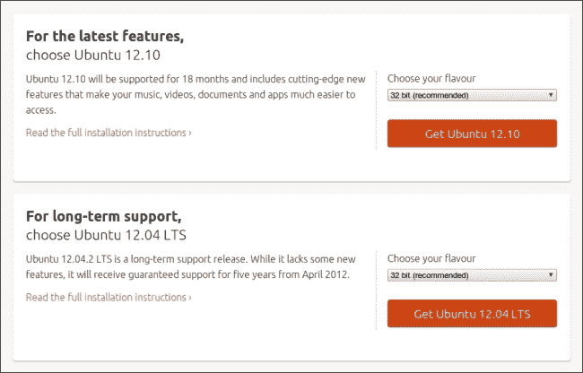

如前述截图所示，Ubuntu 下载分为最新特性版本和 LTS 版本。还可以看到右侧的下拉菜单，允许你选择 32 位或 64 位版本。请选择最适合你机器的版本和位数，然后点击 **获取 Ubuntu**。

你的下载速度将根据互联网连接速度有所不同。在等待下载的过程中，你可以利用这个机会确保当前系统中的所有文件已备份。

下载完成后，使用任何 DVD 刻录软件将镜像刻录到光盘。这些应用可能会根据你的操作系统不同而有所差异。大多数新系统只需右键点击 Ubuntu `.iso` 文件，并选择 **刻录镜像到光盘...**。

重要的是，使用将镜像刻录到光盘的选项，而不是仅仅将 `.iso` 文件写入光盘。前者会正确启动并加载安装程序，而后者只会在光盘上创建一个文件。

## 步骤 2 – 安装程序

在安装过程中，你将看到的第一个屏幕是 **欢迎** 屏幕。这个屏幕允许你选择首选语言，并选择 **试用 Ubuntu** 或 **安装 Ubuntu**。

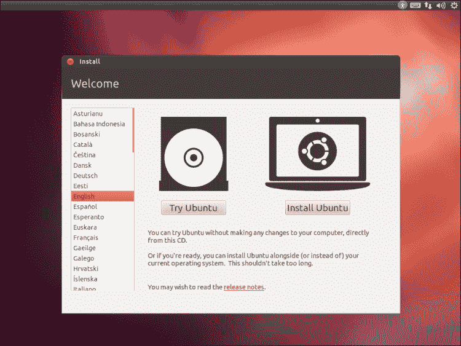

如果你选择**试用 Ubuntu**，你可以在不更改当前运行系统的情况下尝试 Ubuntu。这个选项将直接从 DVD 启动一个完整的 Ubuntu 桌面，并保持你当前系统的完整性。需要注意的是，直接从 DVD 运行 live 系统时，你做出的任何更改都无法保存，且在重启后设置变更无法保持。它的性能也不如安装在硬盘上的时候。这个方法仅用于测试。如果你在决定完全安装前，想先看看 Ubuntu 提供了什么功能，我建议使用这种方法。

当你准备好进行安装时，选择**安装 Ubuntu**，然后你将进入安装的下一步，**准备安装 Ubuntu**。

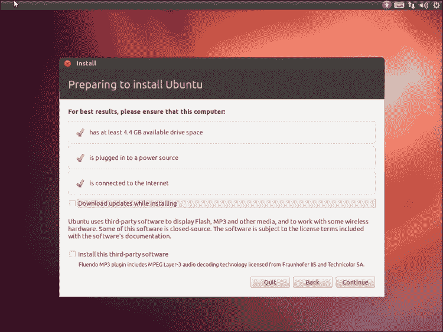

安装程序的第二步确保你的硬件符合要求的规格。Ubuntu 可以运行在各种硬件上，包括一些非常旧的机器。此页面检查以确保你的计算机：

+   至少有 4.4 GB 的可用磁盘空间

+   已插入电源（主要针对笔记本电脑）

+   已连接到互联网

安装程序允许你可选地选择**在安装过程中下载更新**和**安装此第三方软件**的选项。如果在安装过程中你已连接到互联网，建议选择这些选项。

第一个选项确保你的新安装在完成后是完全最新的。这意味着你在首次启动时将获得最新的安全更新和补丁。第二个选项将启用播放 Flash 视频、收听 MP3 和其他媒体的能力，并且能够与某些类型的专有无线硬件兼容。

当你确认自己满足最低要求并可选地选择了额外选项时，点击**继续**以进入下一步。

接下来的屏幕，**安装类型**，定义了磁盘如何格式化以及 Ubuntu 应该安装在哪里。这里看到的两个选项是**清除磁盘并安装 Ubuntu**或**其他选择**。根据你的当前设置，你可能会看到不同的选项。你可以设置机器以实现 Windows 和 Ubuntu 双重启动。创建或调整分区大小的选项通常是高级用户使用的。 如果你对自己在做什么很有信心，可以选择此选项。

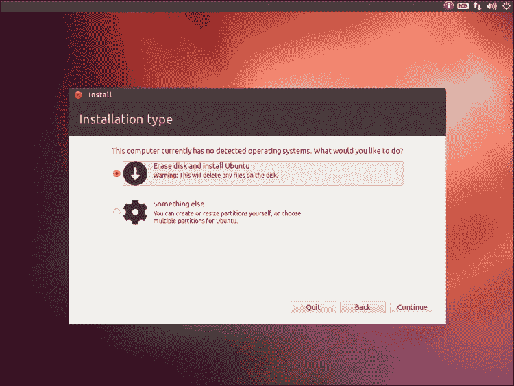

基本上，如果你准备好用 Ubuntu 替换掉当前的安装，选择**清除磁盘并安装 Ubuntu**选项。如果你希望实现双重启动 Windows 和 Ubuntu，选择该选项。同样，选择你偏好的分区选项，并点击**继续**。

在上一屏幕选择了安装类型后，系统会给你一个确认设置的机会。在接下来的截图中，整个磁盘将被使用。如果你选择了自定义方案或双重启动设置，主窗口中应该会显示多个分区。如果你需要对分区或磁盘设置进行任何更改，可以安全地点击**返回**按钮返回到上一页。

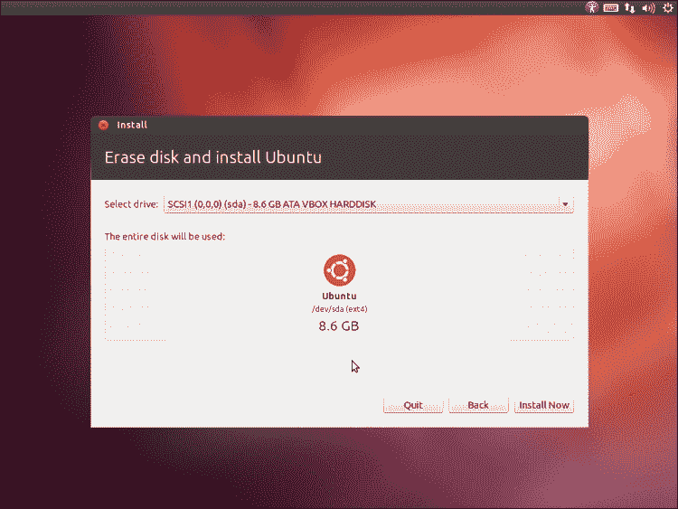

当你准备好继续安装时，点击**立即安装**。这将开始对磁盘进行你所选择的更改，包括必要时的格式化和分区，并将 Ubuntu 安装到系统中。这是无法回头的步骤，因此在继续之前，请确保你已做好备份！

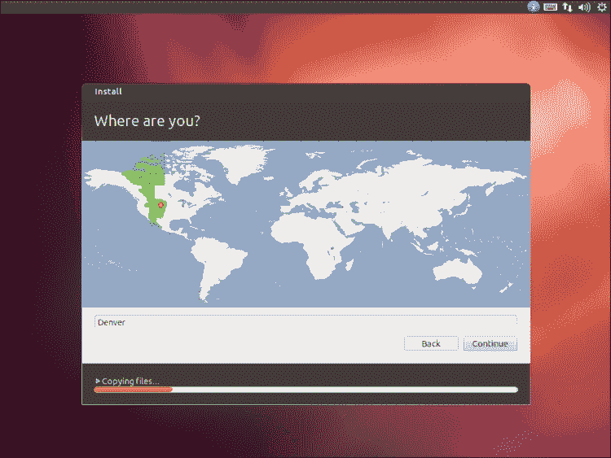

Ubuntu 安装程序在主要安装过程中会提示你提供更多信息。接下来的屏幕显示了一张世界地图，地图被切割成表示不同地区时区的部分。要选择你的本地时区，只需点击地图上相应的区域。当你选择了合适的时区后，点击**继续**。

接下来，安装程序会提示你选择键盘布局。此处的设置默认为美国英语，但支持各种键盘布局和变种。如果你使用其他布局，可以在这里选择。

如果你不确定键盘布局是什么，可以选择**检测键盘布局**选项，屏幕上会显示不同的字符。只需按下与屏幕上字符匹配的键，安装程序将自动检测你的布局。

一旦选择了你偏好的布局，点击**继续**以继续安装。

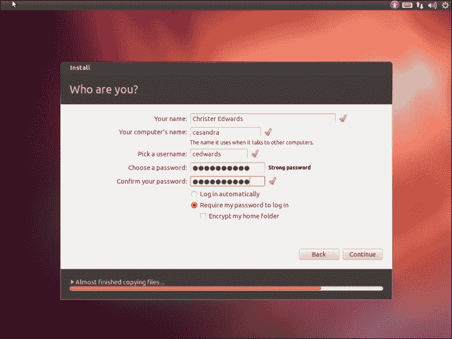

目前，你已经接近安装的尾声，屏幕上会提示你有关用户的信息。这些信息很重要，因为它定义了用于登录计算机的用户名和密码。确保记住你在这里输入的数据。

首先，输入你的全名。第二，定义一个计算机名称，用于计算机与网络中其他计算机进行通信时使用的名称。这个名称可以是你喜欢的任何名称。接下来，你需要定义用户名和密码。这些信息将用于登录计算机并保护你的文件。确保选择一个强大且容易记住的密码。

在定义了用户名和密码后，你可以选择设置自动登录或需要密码登录。出于安全考虑，建议要求使用密码登录。

最后，Ubuntu 提供了加密功能，自动加密你家目录中的文件。这将加密你的文档、图片和其他个人文件，防止那些不知道你用户名和密码的人访问。此设置为可选项。

从此时起，安装程序将在不需要你进一步输入的情况下继续运行。接下来的几屏是一个幻灯片，展示了你将在 Ubuntu 安装完成后找到的功能。

## 第 3 步 – 重启

当安装程序完成最后的任务时，系统会提示一个窗口，确认安装已完成。为了使用你新安装的系统，你需要重启。点击**立即重启**按钮，重启到你新安装的 Ubuntu 系统。

## 就是这样！

就是这样！出奇的简单。你现在已经拥有一个全新的 Ubuntu 系统，准备好进行探索。

在下一节中，我们将快速导览你新的系统，并探索 Ubuntu 系统提供的更多功能。你将学习如何上网，找到并启动内置的应用程序，安装新软件等等。这将是一个快速的概述，更多细节将在接下来的章节中展示。

# 快速开始 – 桌面导览

欢迎来到你新的 Ubuntu 桌面！本节的目的是给你一个简要概述，介绍你新系统的基本功能，以及 Ubuntu 独特的用户界面。我们将概述如何找到和启动应用程序，介绍 Ubuntu 启动器，如何上网、注销、重启、关机以及更改基本设置。这是一个关于你新桌面环境的基本概述。我们将在接下来的章节中进行更详细的讲解。

初看之下，你会注意到 Ubuntu 的桌面环境与你可能习惯的不同。虽然可能是这样，但我向你保证，Ubuntu 的桌面环境非常用户友好、直观并且高度可定制。Ubuntu 一直专注于桌面环境的可用性，而 Ubuntu 桌面中的独特界面反映了这一点。

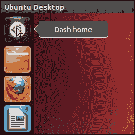

在接下来的页面中，我们将探索启动器、内置应用程序和状态栏。

## 启动器

你首先会注意到 Ubuntu 在桌面左侧提供了一个启动器。这个启动器默认包括最流行的应用程序，并可以自定义，包含（或不包含）几乎任何你想要的内容。随意探索 Ubuntu 启动器，只需将鼠标悬停在任何已包含的图标上或右键点击。接下来的部分将概述默认的启动器应用程序及其在 Ubuntu 桌面中的作用：

## Ubuntu 仪表盘

你首先会遇到的是 Ubuntu 的**仪表盘**启动器。这个启动器将启动 Ubuntu 仪表盘，并允许你快速搜索所有的应用程序、文件和文件夹、音乐和视频。如果你知道你想找的应用程序的名称，你只需启动仪表盘，在**搜索应用程序**字段中输入应用程序的名称，仪表盘会帮你找到它。它还会显示你最近的应用程序、文件和下载，所有内容都在主仪表盘屏幕上展示。

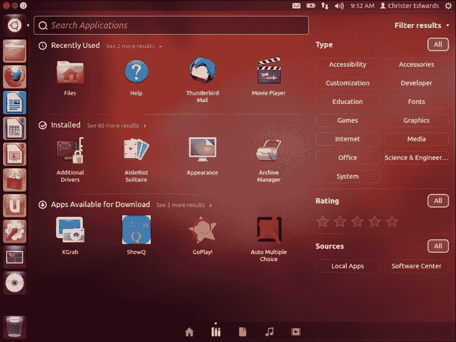

如果你看向仪表盘显示的底部，你会注意到五个图标。这些图标分别代表**仪表盘主页**、**应用程序**、**文件和文件夹**、**音乐**和**视频**。你可以通过使用这些主题来轻松限制搜索和导航。此外，仪表盘中的每个主要部分都允许你通过点击仪表盘右上角的下拉菜单来**过滤结果**。这使你可以根据不同的类别进一步筛选结果。结果过滤器足够智能，能够根据你选择的选项卡筛选不同属性的结果。如果你在**音乐**选项卡，它将允许按年代或流派进行筛选。**文件和文件夹**选项卡将允许按最后修改日期、类型或大小进行筛选。根据需要选择选项，缩小搜索结果，以找到最合适的匹配项。

仪表盘确实是一个可以快速搜索你计算机中所有内容的中心位置。你还会注意到，如果你右键点击**仪表盘**图标，它会为你提供仪表盘各个关键部分的快捷方式：**仪表盘主页**、**应用程序**、**文件和文件夹**、**音乐**和**视频**。

除了通过选择图标启动仪表盘外，仪表盘还可以通过按下键盘上的 Windows 键来启动。大多数现代系统现在都配有带有 Microsoft Windows 标志的键，这个键通常位于空格键的左侧。

## 主文件夹

启动器中第二个图标是**主文件夹**图标。这是一个快捷方式，指向你的**文档**、**下载**、**音乐**、**图片**和**视频**。主文件夹是你存储和组织所有文件的地方。Ubuntu 系统上的每个用户都有自己的主文件夹，用于私密地保护他们的文件。点击**主文件夹**图标将启动 Nautilus，即 Ubuntu 的文件浏览器，并默认进入主文件夹。

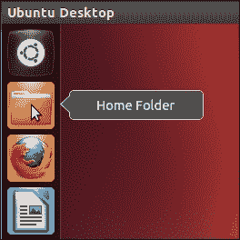

从这里，你可以在**主文件夹**窗口内外探索你的文件系统。就像我们在发现 Ubuntu **仪表盘**图标时一样，右键点击**主文件夹**图标，你会看到一个快捷菜单，列出**主文件夹**窗口中各个主要部分的快捷方式。需要注意的是，在 Nautilus 中浏览文件时，你只能编辑你主文件夹中的文件，所以可以放心地四处查看。你无法破坏任何东西，不用担心。

## Firefox 网页浏览器

你可能会在启动器中认出下一个项目。Ubuntu 开箱即用配备了广受欢迎的网页浏览器 Firefox。Firefox 是一种快速、安全的上网方式，可以访问你最喜欢的网站。使用 Firefox 与朋友和家人联系，更新你的在线状态，甚至安全地玩基于网页的游戏。在我们现代的互联网时代，一个优秀的网页浏览器是必不可少的，而 Ubuntu 在基础安装中提供了最受欢迎的浏览器之一。

## LibreOffice Writer

启动器中的下几个应用来自广受好评的生产力套件 LibreOffice。这个办公套件为你提供免费的文字处理软件，用于编写和编辑文档。LibreOffice Writer 直观、功能丰富，并兼容 Microsoft Office 格式。我现在就使用 LibreOffice 来写这本书！我相信你会发现 LibreOffice Writer 是 Microsoft Word 的完美替代品。

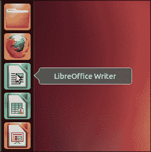

我们将在接下来的部分更详细地探索 LibreOffice 生产力套件：

## LibreOffice Calc

是否需要处理电子表格？Ubuntu 还提供了流行的 LibreOffice Calc 应用，用于管理电子表格数据。这是另一个出色的替代 Microsoft Office 套件的应用，Ubuntu 默认自带，完全免费。LibreOffice Calc 提供了所有标准电子表格应用的强大功能，并且在每次 Ubuntu 安装时都包含。

## LibreOffice Impress

如果你需要进行演示，LibreOffice Impress 是你想要使用的工具，这是一款强大的演示应用，设计上兼容流行的 PowerPoint 软件。这个工具将帮助你设计出色的演示文稿，适用于工作或学校。

## Ubuntu 软件中心

接下来的应用是 Ubuntu 软件中心。Ubuntu 软件中心类似于应用商店，包含成千上万的包，适用于你的 Ubuntu 系统。如果你想在系统上安装额外的软件，只需启动 Ubuntu 软件中心，搜索所需软件，然后点击 **安装**。就是这么简单！

Ubuntu 软件中心同样使得发现新应用变得非常容易。通过 **新内容** 和 **热门推荐** 部分，Ubuntu 软件中心将帮助你了解最受欢迎的应用程序。

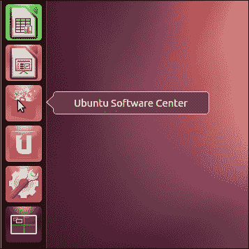

Ubuntu 软件中心中的大多数应用都是免费的，任何收费的应用都会明确标注。软件中心是一个集中式的免费软件仓库，允许你通过几次点击安装任意数量的优秀应用程序。这个应用程序还会处理你系统的所有安全更新和修复补丁。你会收到可用更新的通知，软件中心将在你批准后下载并安装它们。

## Ubuntu One

Ubuntu One 是 Ubuntu 提供的免费云存储服务。你可以使用 Ubuntu One 安全地将文件存储到远程，并在任何与 Ubuntu One 账户关联的设备之间自动同步这些文件。你还可以通过浏览器在任何连接互联网的设备上访问这些文件。Ubuntu One 提供 5 GB 的免费存储空间，额外的存储空间以实惠的价格提供。这是一个很好的地方，用于安全存档重要文件。我使用 Ubuntu One 云存储来存储重要的文档和照片。在我写这本书时，我正在使用 Ubuntu One 来存储草稿。

## 系统设置

接近列表末尾的是 **系统设置** 应用程序，它是一个集中管理所有计算机设置的地方。这包括一系列可用的自定义选项，如 **外观**、**语言支持**、**键盘布局** 和 **隐私** 设置。还可以找到硬件支持设置和系统管理工具，如自动备份工具、辅助功能和用户管理。**系统设置** 应用程序让你能够在一个集中位置管理和自定义各种计算机设置。

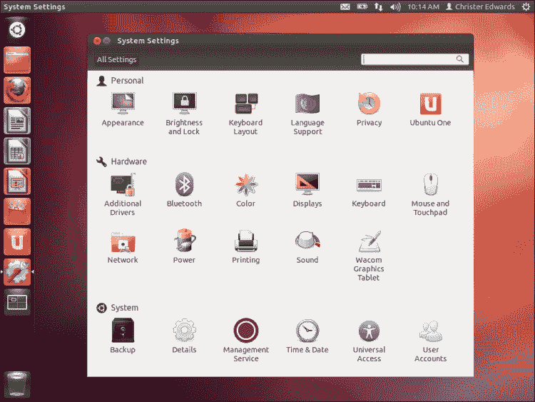

## 工作区

Ubuntu 提供了一个非常有用的界面，用于管理多个工作区。这个功能可能对你来说是新的，但我发现它在管理多个窗口和应用程序时非常有帮助。工作区界面允许你管理多个虚拟工作区，实质上让你能够将应用程序分布在多个虚拟桌面屏幕上。我每天都使用这个功能，并定期在这些虚拟桌面之间切换，以管理不同的应用程序。

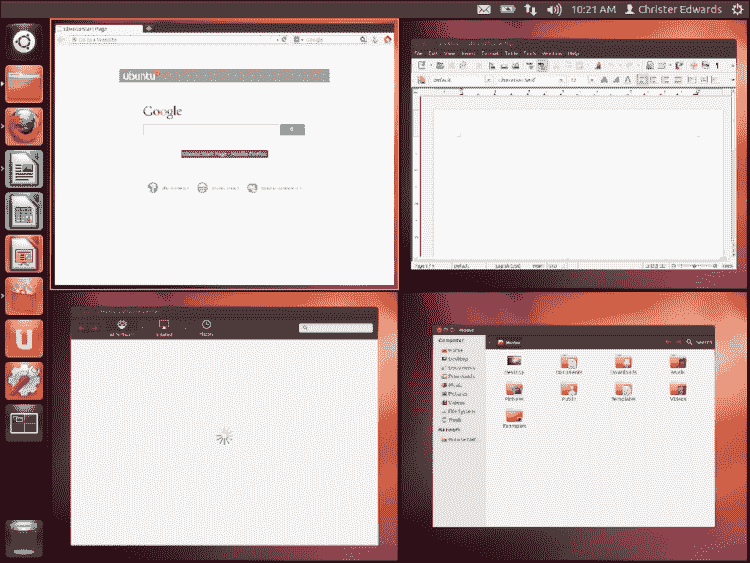

毫无疑问，可能需要稍微适应一下，但一旦你掌握了，我相信你会非常欣赏它在同时运行多个应用程序时带来的灵活性。点击 **工作区** 图标将使当前桌面工作区缩小，并呈现出四个工作区的网格概览。只需在任何一个工作区内双击，就能放大回到那个虚拟桌面。这为组织多个窗口和应用程序提供了一种非常简单的方法。例如，我日常使用计算机时，通常需要一个 **终端** 控制台、一个网页浏览器和一个电子邮件客户端。将这些应用程序分别放置在各自的工作区中，并将每个应用程序设为全屏是常见的做法。这样，你就能够全屏运行应用程序，并通过切换工作区与每个应用程序进行交互。你也可以通过快捷键 *Ctrl* + *Alt* + 箭头键来切换工作区。

## 垃圾桶

在启动栏的最底部，你会发现一个代表**废纸篓**的图标。你从 Ubuntu 桌面删除的任何文件都会被放入**废纸篓**，在它们被永久删除之前。如果你不小心删除了某些东西，也可以在这里恢复。

## Ubuntu 状态栏

Ubuntu 桌面提供了一个全局菜单栏，位于屏幕顶部。这还包括一个状态区域和一些图标，代表着你计算机的不同功能。笔记本上有一个**电池**图标，还有网络连接图标、音量和声音控制、时钟、用户状态、**系统设置**的快捷方式，以及一个菜单，让你可以登出、关机或重启系统。在下面的截图中，我们可以看到**系统设置...**、**显示...**和**启动应用程序...**的快捷方式。还有一条通知，告诉你所有软件都是最新的。当有安全更新和其他更新可用时，这个通知会发生变化。如果需要重启系统，它也会通知你。

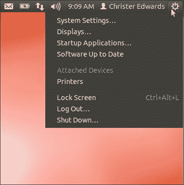

你还会注意到**锁屏**、**登出...**和**关机...**按钮。一个小提示，如果你想重启计算机，可以点击**关机...**按钮，它会提供一个重启选项。

## 网络管理器

在我们结束本节内容之前，我想再讲一个最后的事情，那就是如何联网。我相信你已经准备好连接到互联网，与朋友们在你喜欢的网站上互动了。Ubuntu 的状态栏提供了一个应用程序，帮助你管理网络连接。这个应用程序叫做**网络管理器**，它是管理有线和无线网络的集中位置。你会注意到有**有线网络**和**无线网络**的标题，并且还有额外的配置选项，甚至支持 VPN 连接。

你只需要从可用的列表中选择你偏好的网络，你就会连接上。如果你连接的是有线网络，Ubuntu 在启动时应该会自动连接，你会看到一个像上下箭头的图标，表示已连接的有线网络。

如果你有特定的网络设置需求，可以选择**编辑连接**选项，根据需要配置你的网络。它包括有线、无线、移动宽带、VPN 和 DSL 连接选项。

现在你应该对如何与新的 Ubuntu 桌面进行互动、在哪里查找和启动应用程序、如何联网以及如何登出系统有了较好的了解。在接下来的章节中，我们将更详细地介绍这些应用程序，讨论桌面自定义，并安装其他流行的软件。

# 你需要了解的十大功能

现在您已经初步了解了新的 Ubuntu 桌面，我们将更深入地探索一些让 Ubuntu 脱颖而出的独特功能。我们将详细介绍一些先前提到的应用程序，并深入研究系统设置，以便根据您的需求定制系统。我们还将通过确保系统完全更新、安装一些流行的应用程序，并提供一些提升系统速度的技巧，来更详细地展示如何使用 Ubuntu 软件中心。通过本节内容，您将更加熟悉 Ubuntu 桌面的强大功能和灵活性。

以下章节将按类别介绍一些核心应用程序，这些应用程序包含在基础的 Ubuntu 系统中。您可以通过启动 Ubuntu Dash，选择 Dash 底部的**应用程序**图标，并使用右上角的**筛选结果**选项来查看这些类别。这将按类别组织所有已安装的应用程序，并允许您按相似类型进行浏览。

### 注意

在本节的不同环节，系统会提示您安装额外的软件，以改进现有的应用程序集。某些建议的应用程序仅在您按照本节末尾的说明配置了订阅的软件源之后才能使用。如果您在使用 Ubuntu 软件中心的搜索功能时无法找到任何建议的应用程序，请参阅本节末尾的*10 – 软件源*部分。

## 辅助功能

您可能还记得在*那么，什么是 Ubuntu？*部分中提到，Ubuntu 的设计目的是为了让全球各地的人们都能使用，并且不受任何身体障碍的限制。本节将探讨一些 Ubuntu 系统内置的辅助功能选项。两个主要的内置应用程序是 **Onboard** 和 **Orca**。

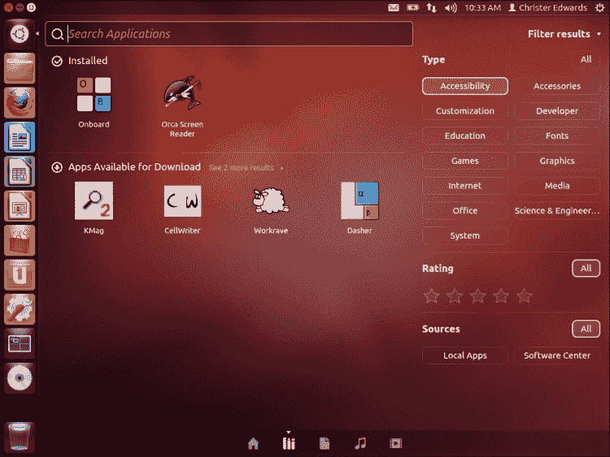

**Onboard** 是一款适用于平板电脑和行动不便用户的屏幕键盘。这款辅助工具允许用户使用虚拟键盘进行输入并与机器互动。对于那些能够控制鼠标但无法完全操作物理键盘的用户来说，这非常有帮助。

**Orca** 是一款免费、开源、灵活且可扩展的屏幕阅读器，通过用户自定义的语音、盲文或放大组合，提供对视觉桌面的访问。这使得视障用户能够通过 **Orca** 将视觉信息转换为语音或盲文，从而与视觉桌面进行互动。

我曾见过视障用户使用这些应用程序，令人印象深刻的是，他们即使有这些障碍，仍然能够如此顺利地与机器进行互动。

## 配件

Ubuntu 提供了一些基本的辅助工具，这些工具提供了你在桌面操作系统中预期的核心功能。包括应用程序，如档案管理器、备份工具、计算器和基础文本编辑器等。这里我们将介绍其中的一些应用程序，让你更了解在 Ubuntu 桌面中能做些什么。

**档案管理器**是一个非常灵活的工具，用于管理存档数据。它支持多种存档格式，能够帮助你存档或解压数据。这个应用程序支持使用 ZIP、TAR、RAR 等多种流行格式进行存档。如果你曾经发送过 ZIP 文件，那么这个应用程序就是用来解压文件的。如果你需要创建一个存档，也许是为了备份某些数据，你可以使用这个应用程序将数据压缩存档，并备份到其他地方。

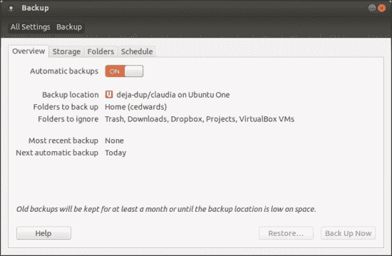

`deja-dup`是内置的**备份**工具。这个应用程序可以让你定期创建重要文件的自动备份。它支持每日、每周和每月的备份计划。备份保留的时间和备份位置都可以配置。这些备份可以自动上传到云存储、FTP、Windows 共享或本地文件夹。使用这个应用程序，你就没有理由不定期备份你的系统了！

**计算器**应用程序乍一看和你预期的没什么区别，就是一个计算器。但仔细一看，你会发现它支持基本、进阶、财务和编程模式的计算。它轻量且易于使用，当然，它是 Ubuntu 系统自带的应用。

**文本编辑器**是一个非常灵活的工具，适用于从做简单笔记到编写计算机程序的各种任务。它不是一个完整的文字处理软件，而是一个纯文本编辑器。当我在本地大学教授初级编程课程时，我会使用**文本编辑器**，因为它足够灵活，能支持基本的编程语法，同时又足够简洁，适合初学者使用。如果你只是需要一个简单的编辑器来做课堂笔记，**文本编辑器**是一个很好的起点。

## 自定义

你会发现你的 Ubuntu 桌面是高度可定制的，允许你将桌面环境变得独一无二。你可以自定义整体主题、桌面背景、字体、启动器特性等更多内容。本节将概述一些你刚开始使用时可能想要自定义的基本内容。这些包括桌面外观、在线账户配置，甚至硬件和驱动支持。

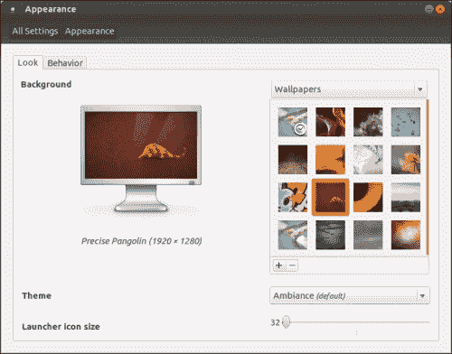

自定义 Ubuntu 桌面的外观和感觉是在 **外观** 应用程序中完成的。在这里，你可以自定义桌面背景、主题和启动器设置。从许多内置的桌面壁纸中选择，并在虚拟显示器上查看预览。在主题下拉菜单中更改你的主题。你还可以选择性地自定义启动器图标的大小和整体行为。

默认主题叫做 **Ambiance**。它提供了你现在看到的较暗的外观。如果你更喜欢一个更明亮的主题，可以尝试 **Radiance** 主题，它与 Ambiance 的外观和感觉正好相反。我喜欢将桌面配置为 **Ambiance**，相对较小的启动器图标，以及自动隐藏的任务栏。

随意自定义你的桌面，尽情实验不同的主题和设置，直到你找到你喜欢的外观和感觉。

在硬件支持方面，Ubuntu 提供了一种系统，用于检查并安装专有硬件的驱动程序。这通常包括来自 ATI 或 NVIDIA 的流行显卡，以及一些无线网卡。虽然这些驱动程序不是开源的，但 Ubuntu 可以自动检测到它们的需求，并为你处理安装。这将为你提供对开源操作系统通常不支持的硬件的更好支持。启动 **附加驱动程序** 菜单项，让 Ubuntu 扫描你的硬件。如果它检测到需要专有驱动程序，它会提示你，并引导你完成安装。如果没有找到任何内容，意味着你已经在使用开源驱动程序，并且你的硬件已经完全得到支持。

自定义部分还包括 **广播账户** 和 **广播设置** 应用程序。在这里，你可以配置 Twitter 和 Facebook 聊天账户及其偏好设置。配置完成后，这些账户将直接出现在屏幕右上角的状态栏中。如果你点击看起来像信封的图标，你应该能看到广播的入口。这是广播账户集成到你的 Ubuntu 系统中的地方，允许你更新状态，查看和回复朋友和家人的消息，而无需在网页浏览器中打开 Facebook 或 Twitter。

## 游戏

Ubuntu 提供了基本和更高级的游戏选项。一些游戏是你预期的，比如 **纸牌** 或 **扫雷**。还包括拼图游戏 **麻将** 和数字谜题 **数独**。这些肯定会提供数小时的游戏乐趣。如果你对其他游戏选项感兴趣，Ubuntu 软件中心还提供了更多游戏。

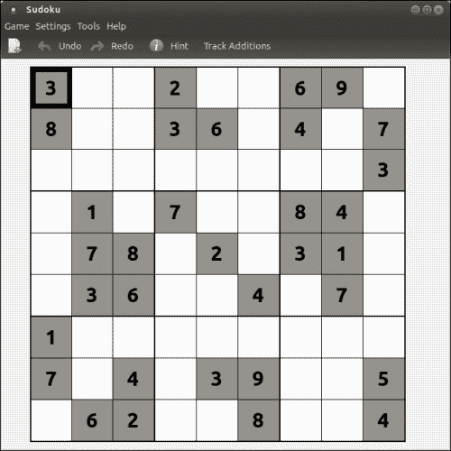

对于那些希望获得比 Ubuntu 软件中心提供的更多游戏选项的用户，Ubuntu 也被 Steam 游戏平台所支持。历史上，Steam 仅支持 Windows 和 Apple 操作系统；然而，Ubuntu 被选为第一个（且目前唯一）获得 Steam 官方支持的 Linux 平台。

接下来的章节将描述如何在 Ubuntu 系统上安装 Steam 并访问适用于 Ubuntu 的 Steam 支持游戏。

首先，启动 Ubuntu 软件中心并在搜索窗口中搜索 `Steam`。这将提供多个结果。你需要选择标记为 **终极娱乐平台** 的那个。从列表中选择这个选项，并点击 **购买**。接着，系统会提示你同意 **软件许可协议**。这将带你到 Ubuntu 单一登录页面，你需要登录或创建一个新账户。如果你尚未注册 Ubuntu 账户，你需要在这里注册。注册过程只需几分钟，并且完全免费。创建或登录账户后，安装将继续进行。

当安装完成后，会弹出一个窗口通知你需要 **启动 Steam** 以完成安装。点击 **启动 Steam** 以继续。接下来会显示 **Steam 安装协议**，你需要同意该协议。勾选 **我已阅读并接受条款**，然后点击 **确定**。此时，Steam 将启动并开始下载任何可用的 Steam 更新。根据你的互联网连接情况，这可能需要几分钟。

从此时起，你将有选项创建一个新的 Steam 账户或登录现有账户。如果你之前在其他平台上玩过 Steam 游戏，你应该可以在这里使用现有的凭据。如果你是 Steam 新用户并想要开始，可以创建一个新账户，然后继续。

从这里开始，你已经准备好玩 Steam 游戏了！

## 图形

你的新 Ubuntu 系统包括一些非常有用的图形管理和编辑应用程序。你会在 Ubuntu 软件中心找到基本的照片查看器应用、PDF 查看器、基础图形编辑软件，甚至更先进的完整编辑套件。在这里，我们将探索一些可用的选项，并概述如何安装 GIMP——这款免费软件是 Adobe Photoshop 的替代品。

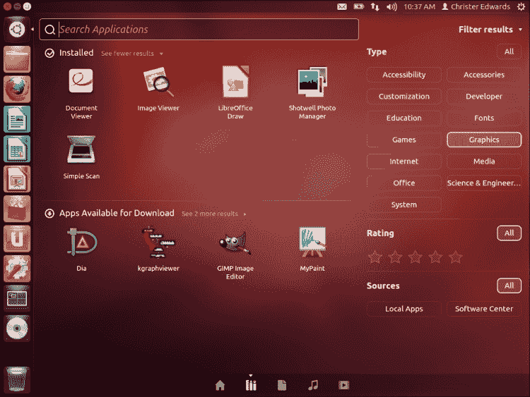

对于基本的照片查看，你有几个可用的选项。首先是 **文档查看器** 和 **图片查看器** 应用程序，这些是用于查看文档和照片的只读格式的应用程序。你不能在这些应用中进行任何编辑，但它们非常适合简单浏览你的文档或照片，显示你当前拥有的内容。

如果你需要更多功能，你还可以找到 **Shotwell 照片管理器**。该应用程序提供基本的旋转、裁剪、红眼修正、基础图像增强等功能。它不是一个完整的 Adobe Photoshop 替代品，但如果你只是做一些简单的裁剪和修图，处理从数码相机导入的照片，它可能已经具备你所需的所有功能。我就是使用 **Shotwell 照片管理器** 来裁剪和编辑本书中的截图。

如果你是那种希望对照片进行更多处理的人，你可能会想要使用 **GIMP 图像编辑器** 应用程序。**GIMP** 代表 **GNU 图像处理程序**，是免费替代专有 Photoshop 应用程序的软件解决方案。GIMP 支持 Photoshop 大部分相同的功能，并且可以在 Ubuntu 软件中心获得。以下部分将描述如何在 Ubuntu 系统上安装 GIMP 并开始使用它。

我相信到这个时候，你已经比我先一步知道你需要进入 Ubuntu 软件中心了。从那里，你可以在搜索框中搜索 `GIMP`，然后找到 **创建图像和编辑照片** 的条目。点击 **安装**，在提示时输入你的管理员密码。如果你感兴趣，Ubuntu 软件中心中还会提供 GIMP 的一些附加组件，它们会显示在主描述的下方。包括以下附加组件：

+   GIMP 的额外画笔、调色板和渐变

+   GIMP 扫描插件

+   GREYC 的 Magic 图像转换器的 GIMP 插件

+   GIMP 打印插件

+   GIMP 的可选扩展库

+   用户空间虚拟文件系统后端

+   提取 XCF 文件数据的命令行工具

这些当然都是可选的，直到你使用 GIMP 的一些更高级功能时才可能需要它们，但知道它们是可用的还是很不错的。

## 互联网

在 Ubuntu Dash 的互联网部分，有多个选项可以帮助你上网并与朋友、家人和同事保持联系。从网页浏览到电子邮件，再到 Twitter 和 Facebook，Ubuntu 提供了一些在互联网连接方面最好的应用程序。我们将从网页浏览器 Firefox 开始，概述如何安装 Chrome 浏览器，并开始使用 Thunderbird 检查电子邮件。当然，Ubuntu 软件中心还有很多额外的互联网相关应用程序，但太多了无法一一列举。

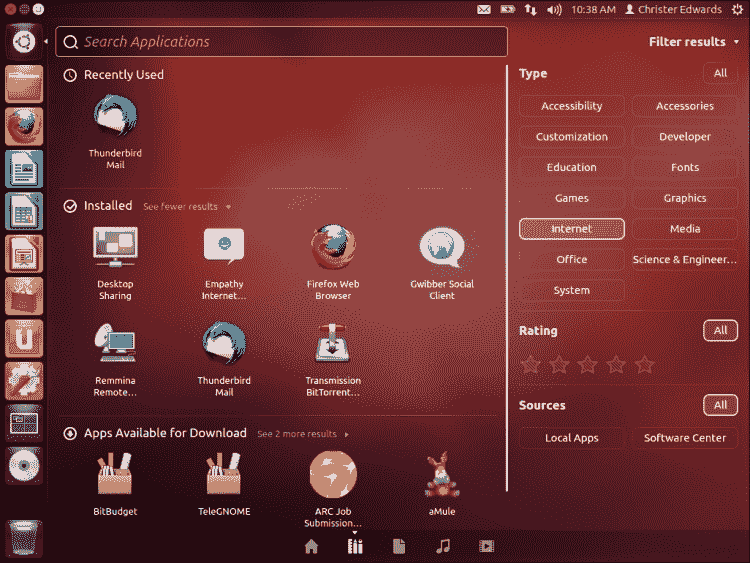

我们从 Firefox 开始，Firefox 是目前最受欢迎、安全和可扩展的互联网浏览器之一。Firefox 已包含在默认安装中，应该是启动器栏中默认应用程序之一。如果你还没有启动 Firefox，可以打开它并连接到互联网。浏览你喜欢的网站，在社交媒体网站上发布关于你的新系统的更新，或者将这本书的链接分享给你的朋友。我相信他们也会像你一样喜欢探索 Ubuntu！

Firefox 提供了许多配置选项，并且可以通过附带的插件和扩展系统进行扩展。这里的扩展和插件实在太多，无法一一列举，但我们可以花一点时间看看其中一些配置选项。

首先，使用启动器打开 Firefox，然后打开 **首选项** 菜单。可以在 **文件** 菜单中的 **编辑** | **首选项** 找到此选项。**首选项** 菜单允许你自定义浏览体验的不同方面，如默认首页、标签页处理、隐私、安全性等。默认设置通常是比较合理的，但有一些选项是我通常会更改的。首先，在 **隐私** 标签下，我勾选了 **告诉网站我不希望被跟踪**。此选项会禁用某些类型的 Cookie，这些 Cookie 通常被在线广告商用来根据你访问的网站或之前查看的产品来定向或重新定向广告。

切换此设置完全是可选的。该标签还允许你切换 Firefox 记住你的浏览历史的方式。根据需要自定义这些选项，然后点击 **关闭**。

要安装插件，请在 **文件** 菜单中导航到 **工具** | **插件** 选项，你将被带到一个页面，显示你当前的 **插件**、**扩展**、**外观**、**插件** 和 **语言** 选项。你可以通过右上角的搜索框快速搜索插件和扩展。同样，这里实在有太多插件和扩展无法一一列举，但你可以访问 [`addons.mozilla.org`](http://addons.mozilla.org)，了解哪些扩展最受欢迎和可用。

Google Chrome 浏览器是 Google 提供的 Firefox 替代品，也可以在 Ubuntu 系统上使用。虽然它不包含在默认安装中，但可以从 Google 网站下载，网址是 [`google.com/chrome`](http://google.com/chrome)。访问此页面，点击 **下载 Chrome**，并选择与你的系统匹配的版本。目前，Chrome 正式支持 Ubuntu、Debian、openSUSE 和 Fedora Linux 发行版。当然，你会选择 Ubuntu 版本，并根据你的系统选择 32 位或 64 位选项。如果你还记得 *安装* 部分，我们讨论了 32 位和 64 位之间的差异。在此处选择与 *安装* 部分相同的选项，然后点击 **接受并安装**。

注意：如果你不记得选择了哪个选项，选择任意一个都没问题。如果它与你其他已安装的系统不兼容，系统会相应提示你，你只需返回并选择另一个选项。

接下来，你应该会看到一个窗口，询问你**打开方式**或**另存为**。你可以安全地选择另存为，Google Chrome 安装程序将会被保存到你的`Downloads`文件夹中。然后，你可以通过在 Nautilus 文件浏览器中导航到`Downloads`文件夹，找到并双击 Google Chrome `.deb`文件。这将打开 Ubuntu 软件中心，并引导你完成剩下的安装步骤。你可能会在某个过程中被要求输入管理员密码。根据提示输入凭据，几分钟内，Google Chrome 浏览器就会安装到你的机器上。

如果你在考虑使用哪种浏览器，这完全取决于你个人的选择。我偏爱 Google Chrome 浏览器，但 Firefox 也是一个非常值得推荐的竞争者。其实这主要还是看个人偏好，因为这两款浏览器都被认为非常安全，支持扩展，并且比大多数其他浏览器要快。

现在我们已经了解了 Firefox 和 Google Chrome 这两款网页浏览器，接下来看看 Ubuntu 在电子邮件管理方面能提供什么。

Thunderbird 已包含在 Ubuntu 的基本安装中，由与 Firefox 同一团队的 Mozilla 基金会设计。这使得 Thunderbird 成为一个非常流行、安全且快速的电子邮件管理解决方案，同时它还支持与网页浏览器类似的扩展架构。接下来我将简要概述如何开始使用 Thunderbird 下载并管理本地系统中的电子邮件。

默认情况下，Thunderbird 不在启动栏中，因此你需要在 Ubuntu Dash 中搜索它，或在应用程序部分的筛选结果中选择它。

当你第一次启动 Thunderbird 时，它会引导你完成一个入门向导，帮助你配置电子邮件账户。Thunderbird 包含了全球常见的电子邮件提供商及其配置选项的数据库。这意味着你只需要输入电子邮件地址和密码，Thunderbird 会自动完成剩下的配置。你的电子邮件提供商越流行，系统的自动配置就越顺利。如果你发现 Thunderbird 无法自动检测到你的设置，你可能需要联系你的互联网服务提供商以获取更多详细信息。

配置好 Thunderbird 后，你将能够通过该应用快速而轻松地发送和接收电子邮件。Thunderbird 还支持一些功能，比如垃圾邮件过滤，以及通过过滤器和文件夹自动整理电子邮件。

## 媒体

Ubuntu 配备了一个很棒的媒体播放器，名为 Rhythmbox。这个播放器对多种媒体格式有很好的支持，支持播客、last.fm 集成，以及与 Ubuntu One 音乐商店的连接。Rhythmbox 包含一个非常易于使用的界面，让你轻松找到并组织你的所有音乐。

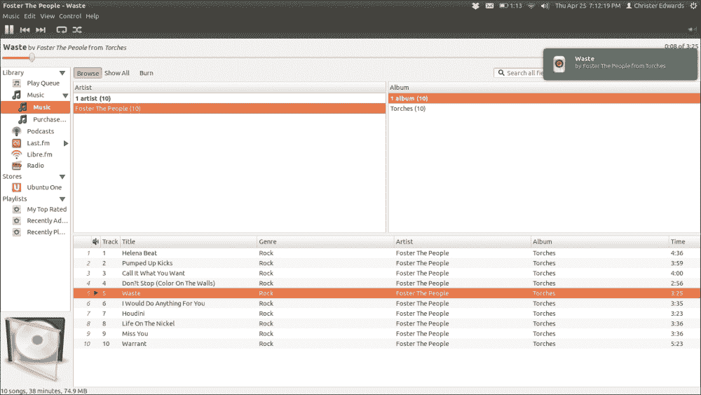

Rhythmbox 支持创建和导入播放列表，抓取专辑封面，搜索以及互联网广播。Rhythmbox 是处理音乐收藏的首选应用程序。

在 Ubuntu 上观看视频时，有一个播放器在支持最多格式和功能方面独占鳌头。这个播放器就是 VLC。不幸的是，VLC 并没有预装在 Ubuntu 上，所以我们需要从 Ubuntu 软件中心安装它。我们可以通过启动软件中心，并搜索 `VLC` 来进行安装。你应该能看到一个名为 **VLC Media Player: 阅读、捕捉并广播你的多媒体流** 的结果。选择这个列表项，然后点击 **安装**。就像安装任何软件时一样，你会被提示输入密码，然后安装将开始。

一旦 VLC 安装完成，你可以通过启动 **系统设置** 应用程序，并在 **系统** 部分选择 **详细信息** 选项，将其设为不同媒体类型的默认应用程序。此应用程序可让你查看系统概况，设置默认应用程序，并配置可移动媒体的默认操作。选择 **默认应用程序**，在右侧查找 **视频**，然后从下拉菜单中选择 **VLC**。

## Office

正如上一节所述，Ubuntu 在默认安装中提供了 LibreOffice 办公套件。这个套件包括 Writer、Calc、Draw 和 Impress 应用程序。如果你用电脑进行学习或工作，那么这些应用程序可能是你经常使用的工具。无论是写论文、报告，还是管理电子表格、创建详细的演示文稿，LibreOffice 套件都能满足你的需求。

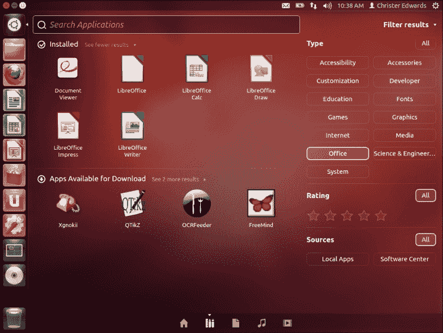

LibreOffice Writer 足够灵活，可以用来记笔记、写论文或书籍。我现在就用 Writer 来写这本书。功能实在太多，无法一一详述，但 Writer 是一个非常强大且兼容性极好的文字处理软件。它支持多种文档格式，包括全球标准的开放文档格式（Open Document Format）。它能够读取和写入 Microsoft Office 文档格式，并且可以直接导出为 PDF 或 HTML。

LibreOffice Calc 是自带的电子表格应用程序。它与其他平台的兼容性以及任何成熟的电子表格管理应用所应具备的功能相当。我用 LibreOffice Calc 来管理咨询服务发票、基本预算和健康跟踪等任务。Calc 对新用户非常直观，同时又足够强大，适合专业数据分析师和数字处理人员使用。

Impress 是一款出色的工具，能够有效地为工作或学校创建多媒体演示文稿。这些演示文稿可以使用 2D 和 3D 剪贴画、特效和过渡动画、动画，甚至绘图工具来增强。我见过一些非常令人印象深刻的演示文稿，它们是用 LibreOffice Impress 创建的。更重要的是，它支持流行的 PowerPoint 格式，甚至可以直接输出为 Flash 格式以供在线查看。

## 系统

Dash 中最后一个类别是 **系统** 类别。这个类别为您提供了任何成熟桌面环境中所期望的系统管理工具。本节包括隐私设置、系统监视器、系统设置和更新管理器。

当您继续使用 Dash 时，您可能会注意到 Ubuntu 会跟踪您最近使用的应用程序、文件和文件夹。这可以在 **隐私** 设置中进行配置。选项允许将活动记录限制为特定文件、文件夹，甚至按应用程序进行配置。您还可以像在 Web 浏览器中一样擦除记录的历史。如果您担心隐私问题，您可以选择禁用活动记录。需要注意的是，所有记录的信息都是完全匿名的，通常仅用于为您提供更好的访问您最近使用的应用程序、文件和文件夹的方式。重要的是要注意，您的隐私由您掌控，可以在一个地方进行配置。

**系统监视器**是您系统、进程、资源和磁盘使用情况的中央概览。

在 **系统** 标签页中，您可以确定是安装了 32 位还是 64 位的 Ubuntu，您的 Ubuntu 版本、内核版本、硬件以及磁盘使用情况。

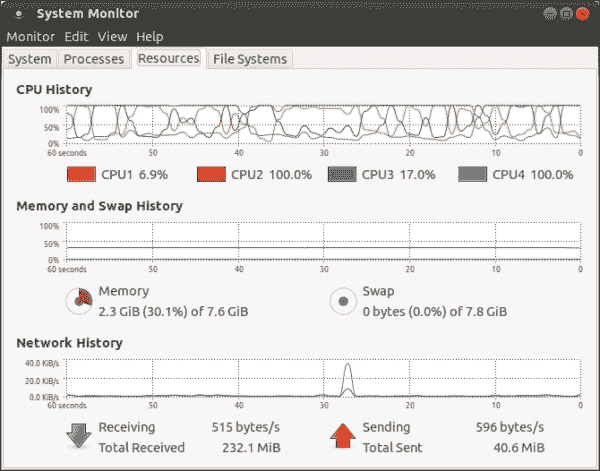

**进程** 标签页显示当前在您的系统上运行的进程，并允许您对其进行管理。通过右键点击进程，您可以停止、终止、结束或更改大多数正在运行的应用程序的进程优先级。此标签页为您提供了运行中的程序概览，以及哪些程序可能占用了过多的 CPU 或内存。

**资源** 标签页为您提供 CPU 历史、内存和交换空间以及网络历史的视觉概览。

最后，**文件系统** 标签页为您提供了空闲和可用磁盘空间的概览。

## 软件源

**更新管理器**是一个处理所有安全和修正更新的应用程序。可能 Ubuntu 已经为您的安装提供了安全和修正更新，这些更新将由 **更新管理器** 应用程序呈现。接下来的部分将概述如何配置更新管理器的检查频率，您希望订阅的来源，以及您希望从哪个位置下载更新。

当**更新管理器**应用程序启动时，首先会确保你的机器已完全更新，并应用了安全更新和修补程序。这将确保你应用了最新的安全修复程序，并为你的 Ubuntu 版本提供最新的改进。当你第一次启动**更新管理器**应用程序时，可能会显示一份可用更新的列表。在我们应用这些更新之前，我建议先对**更新管理器**设置进行一些配置更改，这将为你提供更多可用的软件包，并加快检查和下载更新的速度。

首先，从 Dash 打开**更新管理器**应用程序，并点击左下角的**设置...**按钮。这个配置部分允许你自定义希望在软件中心中提供的内容，甚至可以选择下载的源位置。Ubuntu 提供了遍布全球的软件镜像，选择离你最近的一个可以显著提高下载速度。

在**Ubuntu 软件**的第一部分，你会看到**从互联网下载**。我建议确保勾选前四个框。此外，除非你打算开发 Ubuntu 软件，否则可以放心取消勾选标记为**源代码**的第五个框。接下来，从下拉菜单中选择**下载来源：**。这个列表应该会列出使用主服务器、你所在国家的服务器或**其他...**的选项。

选择你所在国家的服务器而非主服务器会有所改善，但你也可以尝试**其他...**选项。该选项会显示第二个菜单，允许你选择全球几乎任何国家的服务器。还有一个选项可以尝试确定你连接的最快服务器。如果你点击**选择最佳服务器**，将会进行一系列测试，以找到最适合你位置的镜像。这可能需要几分钟时间，测试完成后会自动选择一个位置。这个测试并不总是完全准确，你可以尝试不同的位置，直到找到一个你觉得表现最好的服务器。

在此页面上你可能需要配置的其他项目位于**更新**标签页。在这里，你可以配置希望看到的更新类型以及更新的频率。如果你使用的是 LTS 版本，你可能希望选择**重要**、**推荐**和**不受支持**的更新。预发布更新是为那些希望在更新推送给其他公众之前进行测试的用户提供的。需要注意的是，虽然这将让你在其他人之前获得更新，但其中一些更新可能会导致问题，因为它们仍然需要进行测试。

你还可以更新 Ubuntu 检查安全性和错误修复更新的频率。你可以选择每天、隔天、每周或每几周检查更新。当 Ubuntu 发现可用的更新时，你可以配置其行为，包括自动下载和安装更新。我对我的安全和错误修复更新有点强迫症。我总是希望拥有最新最好的软件，这就是为什么我让我的系统每天检查更新，自动下载并安装更新，并在找到更新时立即显示通知。当然，你不必使用相同的设置，但请选择适合你和你的系统的组合。

一旦你进行这些更改，Ubuntu 会要求你输入管理员密码，然后刷新你选择的服务器。**更新管理器**应用程序可能会有可用的更新，你可以通过点击**安装更新**来应用这些更新。

## 一些额外资源

有一些软件包由于许可证限制，不能随 Ubuntu 光盘一起分发，但可以通过 Ubuntu 软件中心获取。这些软件包包括 MP3 支持、Flash 媒体播放器、DVD 播放等。相信你也希望在 Ubuntu 系统上支持这些功能，因此本节将介绍如何安装它们。这里的说明依赖于前面部分启用了软件源。

要安装对这些格式的支持，打开 Ubuntu 软件中心，搜索 `ubuntu-restricted-extras`。这应该会显示一个结果，描述了常用的受版权限制的应用程序（MP3、AVI、MPEG、TrueType、Java、Flash、编解码器）。从列表中选择该结果，然后点击窗口右侧的**安装**按钮。可能会提示你重启以使这些更改完全生效。安装完成后，你应该可以完全支持 MP3 播放、基于 Flash 媒体播放器的网站以及 DVD 播放。

# 你应该了解的人和地方

Ubuntu 是最容易使用的 Linux 发行版，专门设计为直观且欢迎新用户。虽然你使用 Ubuntu 相比许多其他可用的 Linux 发行版会更轻松，但也会有一刻，你会遇到一些系统使用上的困难，需要一些指导。当那时到来时，有许多在线资源可以帮助你。本节介绍了这些资源，你可以在这里找到答案、阅读文档、与其他用户聊天和交流，甚至希望能找到你需要的答案。

## 官方网站

+   主页：[`ubuntu.com`](http://ubuntu.com)

+   官方文档：[`docs.ubuntu.com`](http://docs.ubuntu.com)

+   社区维基：[`wiki.ubuntu.com`](https://wiki.ubuntu.com)

+   官方论坛：[`ubuntuforums.org`](http://ubuntuforums.org)

## 社区

+   Ask Ubuntu，一个由社区驱动的问答网站：[`askubuntu.com`](http://askubuntu.com)

+   关注 Ubuntu 最新开发动态的 Fridge：[`fridge.ubuntu.com`](http://fridge.ubuntu.com)

+   核心 Ubuntu 贡献者和开发者的聚集地：[`planet.ubuntu.com`](http://planet.ubuntu.com)

+   本地社区支持团队：[`wiki.ubuntu.com/LoCoTeams`](https://wiki.ubuntu.com/LoCoTeams)

## 博客

+   Ubuntu 创始人博客：[`www.markshuttleworth.com/`](http://www.markshuttleworth.com/)

+   Jono Bacon 博客，Ubuntu 社区经理：[`www.jonobacon.org/blog/`](http://www.jonobacon.org/blog/)

+   Ubuntu 新闻、应用、评论和功能：[`omgubuntu.co.uk`](http://omgubuntu.co.uk)

## Twitter

+   Ubuntu 官方 Twitter 账户：[`twitter.com/ubuntu`](https://twitter.com/ubuntu)

+   OMG Ubuntu! 的 Twitter：[`twitter.com/omgubuntu`](https://twitter.com/omgubuntu)

+   Jono Bacon 的 Twitter：[`twitter.com/jonobacon`](https://twitter.com/jonobacon)

+   获取更多开源信息，关注 Packt：[`twitter.com/#!/packtsopensource`](http://twitter.com/#!/packtsopensource)
