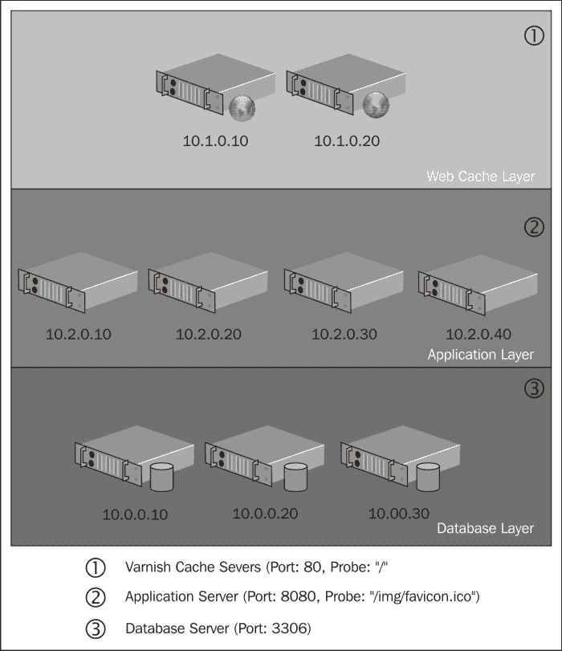
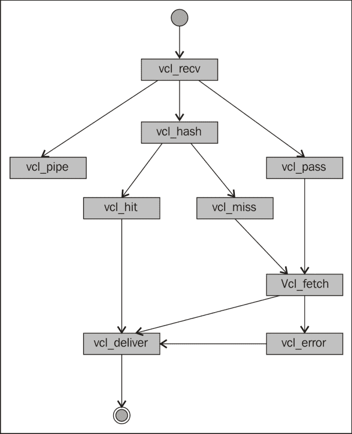
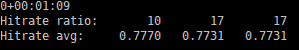
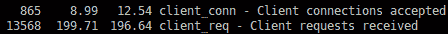
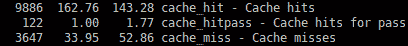
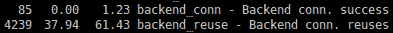

# 第一章：快速 Varnish Cache 操作指南

欢迎来到*快速 Varnish Cache 操作指南*。在本书中，我们将介绍如何在你的网站前端设置 Varnish Cache 服务器实例，如何识别可缓存的部分，以及如何从缓存机制和策略中获得最佳性能。

Varnish Cache 是一个缓存反向代理——通常被称为 HTTP 加速器，它位于你的应用服务器和客户端请求之间。它的主要目标是避免在已知生成响应相同的情况下，进行不必要的重复工作。凭借其灵活的框架，它允许你操作请求，并将**边缘端包含**（**ESI**）部分拼接在一起。

本书中大多数示例代码是为特定应用场景编写的，应谨慎使用。希望这些示例能激发你为你的场景编写自己的解决方案，并在你的基础架构中部署一个快速且可靠的 Varnish Cache。

本书面向具有 HTTP 协议基础知识的系统管理员和 Web 开发者。在本书中，我假设你已经了解 HTTP 协议。如果你需要更详细的解释，可以随时参考 HTTP 版本 1.1 的文档，[`www.w3.org/Protocols/rfc2616/rfc2616.html`](http://www.w3.org/Protocols/rfc2616/rfc2616.html)或 Varnish Cache 3.0 的文档，[`www.varnish-cache.org/docs/3.0/`](https://www.varnish-cache.org/docs/3.0/)。

# 安装 Varnish Cache（必备知识）

Varnish Cache 二进制文件很可能已经被你的 Linux 发行版的软件包仓库提供，但是从仓库获得的版本可能没有最新。

Varnish Cache 官方仓库提供适用于 Red Hat 或 Debian 系列发行版、FreeBSD 的版本，也可以通过 tar 包手动安装。

在以下的教程中，我们将通过使用`varnish-cache.org`仓库和**yum**包管理器，在 Linux CentOS 系统上安装 Varnish Cache。

## 准备工作

以下示例将同时使用 Varnish Cache 3.0.3 和 64 位 Linux CentOS 6。

建议首先在虚拟机上尝试，因为在正式上线之前，你的缓存策略需要进行调整和调试。

如果你还没有虚拟化软件，我推荐使用 Oracle VirtualBox，[`www.virtualbox.org/`](https://www.virtualbox.org/)因为它的界面易于使用。

对于其他 Linux 发行版，你可以在[`www.varnish-cache.org/releases/`](https://www.varnish-cache.org/releases/)找到正确的`varnish-cache.org`仓库。

## 如何操作...

1.  通过输入以下命令，将`varnish-cache.org`仓库添加到你的 CentOS 系统：

    ```
    # sudo rpm --nosignature -i http://repo.varnish-cache.org/redhat/varnish-3.0/el5/noarch/varnish-release-3.0-1.noarch.rpm

    ```

1.  通过输入以下命令安装 Varnish Cache：

    ```
    # sudo yum install varnish

    ```

1.  通过输入以下命令启动 Varnish Cache 守护进程：

    ```
    # sudo service varnish start

    ```

## 它是如何工作的...

添加`varnish-cache.org`仓库可以让我们保持 Varnish 服务器的最新状态，并且仅使用稳定版本。

如果您的 Linux 发行版没有`varnish-cache.org`仓库，或者您决定手动编译，您需要从[`repo.varnish-cache.org/source/`](http://repo.varnish-cache.org/source/)下载一个 tarball 文件，并在使用 GNU `make`和`make install`命令之前解决依赖关系。

## 还有更多...

始终检查启动脚本服务是否正确添加到运行级别列表中，您可以输入以下命令：

```
# sudo chkconfig --list varnish

```

您应该看到运行级别 2、3、4 和 5 标记为`开启`，如下所示：

```
varnish0:off 1:off 2:on 3:on 4:on 5:on 6:off

```

如果在任何一个运行级别中该服务被`关闭`，请使用以下命令将其`打开`：

```
# sudo chkconfig varnish on

```

这样可以确保在停电或意外服务器重启的情况下，我们的 Varnish 缓存实例能够尽快恢复运行。

启动脚本（也称为初始化脚本）是通常在系统启动时运行的脚本。它们中的大多数用于启动服务并设置初始系统参数。有关更多信息，请访问[`access.redhat.com/knowledge/docs/en-US/Red_Hat_Enterprise_Linux/6/html/Installation_Guide/s2-boot-init-shutdown-init.html`](https://access.redhat.com/knowledge/docs/en-US/Red_Hat_Enterprise_Linux/6/html/Installation_Guide/s2-boot-init-shutdown-init.html)。

运行级别列表决定了哪些程序在系统启动时执行。有关运行级别工作原理的更多信息，请访问[`access.redhat.com/knowledge/docs/en-US/Red_Hat_Enterprise_Linux/6/html/Installation_Guide/s1-boot-init-shutdown-sysv.html`](https://access.redhat.com/knowledge/docs/en-US/Red_Hat_Enterprise_Linux/6/html/Installation_Guide/s1-boot-init-shutdown-sysv.html)。

# Varnish 缓存服务器守护进程选项（必须了解）

现在我们已经安装了 Varnish Cache 服务并且它正在运行，我们需要花一些时间确认启动参数是否正确。

启动脚本中声明的默认后安装存储方法是文件存储，我们将其更改为基于内存的存储，以最大化性能提升。

### 注意

请记住，我们的所有数据应该能适应内存。如果无法适应，请使用默认存储类型（文件）。

一些参数，如打开文件的数量、配置文件的位置等，不需要根据服务器规格进行调整，应该按照默认配置正常工作。

守护进程选项包括设置存储空间大小和存储类型，直到线程池和哈希算法等配置。

## 准备就绪

`/etc/sysconfig`中的`varnish`文件是所有守护进程选项的位置，也是启动脚本的资源。你也可以手动启动守护进程并通过传递参数来设置配置参数，但无需这样做，因为一切都已打包并准备就绪。对`/etc/sysconfig`中的`varnish`文件的任何更改只有在完全重启 Varnish Cache 服务后才有效。

若要重启 Varnish Cache，请使用以下提供的脚本：

```
# sudo service varnish restart

```

### 提示

当你执行完全重启时，缓存会被完全清除。请小心。

## 如何做...

1.  使用你喜欢的文本编辑器（我使用 vim）打开`/etc/sysconfig`中的`varnish`文件，输入以下命令：

    ```
    # sudo vim /etc/sysconfig/varnish

    ```

    慢慢阅读并查看所有评论，这样你就能理解该文件的每一部分，因为它是由启动脚本（`/etc/init.d/varnish`）加载的。

1.  找到`VARNISH_STORAGE`参数，并将默认值更改为`malloc ,${VARNISH_STORAGE_SIZE}`。

    ```
    VARNISH_STORAGE="malloc,${VARNISH_STORAGE_SIZE}"

    ```

1.  将`VARNISH_STORAGE_SIZE`参数设置为可用内存的约 85%。

    在 16GB RAM 的系统上，我们可以通过以下命令分配 14GB 用于存储，并将剩余的 2GB 留给操作系统使用：

    ```
    VARNISH_STORAGE_SIZE=14G

    ```

## 它是如何工作的...

文件存储和`malloc`存储这两种方法都使用文件和内存资源，但方式略有不同。

文件存储类型会为文件分配整个缓存大小，并告知操作系统将该文件映射到内存（如果可能）以提高速度，而`malloc`会向操作系统请求存储大小，并让操作系统决定如何划分和交换文件，无法放入内存的部分会被交换出去。

### 提示

**不要被名字欺骗**

文件存储在重启 Varnish Cache 服务器时不会将数据保存在文件中。

## 还有更多...

一种新的、仍处于实验阶段的存储类型——持久化存储，将以类似于文件存储的方式工作，但并非每个对象都会持久化，因为它无法处理磁盘空间不足的情况。这种新存储类型的主要优点是在恢复系统故障后能够使用预热缓存，因为对象仍然保存在磁盘上。

预热阶段也可以使用名为`varnishreplay`的工具执行，但它需要更多时间，因为你需要一个访问日志文件并将其重放到 Varnish Cache。

你可以在[`www.varnish-cache.org/trac/wiki/ArchitecturePersistentStorage`](https://www.varnish-cache.org/trac/wiki/ArchitecturePersistentStorage)上找到更多关于持久化存储类型的信息。

# 连接到后端服务器（应知）

后端服务器可以定义为 Varnish Cache 可以请求和获取数据的任何 HTTP 服务器。在本教程中，我们将定义我们的后端服务器，检查这些服务器的健康状态，并将客户端的请求导向正确的后端服务器。

## 准备就绪

如果您有服务器架构图，那是列出所有所需服务器并将它们分组的好地方，但您还需要一些关于这些服务器的技术数据。您可以在服务器监控图中找到这些信息，其中会显示 IP 地址、端口，幸运的话，还会提供健康检查的探测 URL。



在我们的例子中，主要的 VCL 配置文件 `default.vcl` 位于 `/etc/varnish`，并定义了 Varnish Cache 在请求生命周期中使用的配置，包括后端服务器列表。

## 如何操作...

1.  使用以下命令打开 `default vcl` 文件：

    ```
    # sudo vim /etc/varnish/default.vcl

    ```

1.  一个简单的后端声明如下：

    ```
    backend server01 {
      .host = "localhost";
      .port = "8080";
    }
    ```

    这段小代码指示了后端的名称（`server01`），还包括了主机名或 IP 地址，以及连接的端口。

1.  保存文件并使用以下命令重新加载配置：

    ```
    # sudo service varnish reload

    ```

    此时，Varnish 将使用其默认的 VCL 文件将每个请求代理到第一个声明的后端。尝试访问一个已知的 URL（如您的网站首页），通过 Varnish Cache 确保内容的交付与没有 Varnish 时一样。

    出于测试目的，这是一个可以接受的后端声明，但我们需要确保我们的后端服务器已经启动并准备好接收请求，然后才真正开始将 Web 流量引导到它们。

1.  让我们为后端添加一个探测请求：

    ```
    backend website {
      .host = "localhost";
      .port = "8080";
      .probe = {
        .url = "/favicon.ico";
        .timeout = 60ms;
        .interval = 2s;
        .window = 5;
        .threshold = 3;
      }
    }
    ```

    Varnish 现在将使用提供的 URL 每隔几秒钟探测后端服务器，超时时间为 60 毫秒。

    为了确定后端是否健康，它将分析最后五次探测结果。如果其中三次返回 `200 – OK`，则该后端被标记为健康，请求将转发到此后端；否则，该后端将被标记为生病，直到恢复健康才会接收任何传入请求。

1.  探测需要额外信息的后端服务器：

    如果您的后端服务器需要额外的头部或具有 HTTP 基本认证，您可以将探测从 `URL` 更改为 `Request` 并指定一个原始的 HTTP 请求。使用 `Request` 探测时，您始终需要提供一个 `Connection: close` 头部，否则它将无法工作。如下代码片段所示：

    ```
    backend api {
      .host = "localhost";
      .port = "8080";
      .probe = {
        .request = 
        "GET /status HTTP/1.1"
        "Host: www.yourhostname.com"
        "Connection: close"
        "X-API-Key: e4d909c290d0fb1ca068ffaddf22cbd0"
        "Accept: application/json"
        .timeout = 60ms;
        .interval = 2s;
        .window = 5;
        .threshold = 3;
      }
    }
    ```

1.  根据传入数据选择后端服务器：

    在声明了后端服务器后，您可以开始指引客户端的请求。选择哪个后端服务器响应请求的最常见方式是根据传入的 URL，如下代码片段所示：

    ```
    vcl_recv {
      if ( req.url ~ "/api/") {
        set req.backend = api;
      } else {
        Set req.backend = website;
      }
    }
    ```

    基于上述配置，所有包含 `/api/`（`www.yourdomain.com/api/`）的请求将被发送到名为 `api` 的后端，其他请求则会到达名为 `website` 的后端。

    您还可以根据 User-agent 头部、客户端 IP（基于地理位置）以及请求中附带的几乎所有信息来选择正确的后端服务器。

## 它是如何工作的...

通过探测后台服务器，你可以自动移除出现故障的后台服务器，从而避免将坏页面提供给客户。一旦后台服务器恢复正常，Varnish 会将其重新加入到集群池中。

将请求导向合适的后台服务器是确保每个请求都能到达目的地的好方法，同时也提供了根据传入数据（如移动设备或 API 请求）提供内容的灵活性。

## 还有更多...

如果你有很多服务器需要声明为后台服务器，可以将探测器声明为一个单独的配置块，并在后台服务器规格中引用该块，从而避免重复并提高代码可读性。

```
probe favicon {
  .url = "/favicon.ico";
  .timeout = 60ms;
  .interval = 2s;
  .window = 5;
  .threshold = 3;
}

probe robots {
  .url = "/robots.txt";
  .timeout = 60ms;
  .interval = 2s;
  .window = 5;
  .threshold = 3;
}

backend server01 {
  .host = "localhost";
  .port = "8080";
  .probe = favicon;
}

backend server02 {
  .host = "localhost";
  .port = "8080";
  .probe = robots;
}
```

`server01` 服务器将使用名为 `favicon` 的探测器，而 `server02` 服务器将使用名为 `robots` 的探测器。

# 负载均衡请求（应该了解）

请求负载均衡是分担集群池工作负载的好方法，可以避免单个服务器实例过载，从而保持系统的整体健康。还有可能将 VIP 客户导向专用集群池，保证他们获得最佳的用户体验。

通过使用指令器组，Varnish 将管理并分发传入的请求到包含其中的服务器。由于服务器会不断检查，Varnish 可以处理出现问题的服务器，并且确保系统的运行就像没有任何问题一样。

## 准备就绪

有六种类型的指令器组需要配置：random（随机）、client（客户端）、hash（哈希）、round-robin（轮询）、DNS（域名系统）和 fallback（回退）。虽然 random 指令器的功能很直观（随机分发请求），但 DNS 指令器可以用于将请求分发到一个完整的服务器网络。hash 指令器会基于传入 URL 的哈希值来选择一个后台服务器，而 fallback 指令器则可在服务器行为异常时用作紧急备用。

两个最常见的指令器是轮询（round-robin）指令器和客户端（client）指令器。

轮询（round-robin）可以用于将请求逐一分发到整个服务器集群，不管请求的内容是什么，而客户端指令器（client director）可以用于根据客户端提供的唯一信息（如 IP 地址）创建粘性会话（sticky-session）。

在本教程中，我们将创建客户端指令器和轮询负载均衡器，将请求分发到应用服务器。

## 如何实现...

1.  使用以下代码片段将后台服务器分组以进行请求的负载均衡：

    ```
    director dr1 round-robin {
      { .backend = server01 }
      { .backend = server02 }
      { .backend = server03 }
      { .backend = server04 }
    }
    ```

    在前面的示例中，我们声明了名为`dr1`的指令器是一个`round-robin`指令器，并且在该指令器内有四个后台服务器需要进行负载均衡。后台服务器`server01`到`server04`已经在之前配置过了，这里的声明仅仅是引用它们。

1.  使用以下代码片段创建一个粘性会话服务器池：

    ```
    director dr1 client {
      { .backend = server01 }
      { .backend = server02 }
      { .backend = server03 }
      { .backend = server04 }
    }
    ```

    一开始，`round-robin`声明与`client`声明之间没有任何区别，但在你的`vcl_recv`子例程中，你需要指定什么标识了一个独特的客户端。Varnish 默认使用客户端的 IP 地址，但如果你在 Varnish Cache 前有其他服务（如防火墙），你需要重写`client.identity`变量的值。在以下示例中，我们将使用`X-Forwarded-For`头部来获取客户端的真实 IP 地址。

    ### 注意

    `X-Forwarded-For`头部用于在代理过程中过滤掉的信息。更多信息请访问[`tools.ietf.org/html/draft-ietf-appsawg-http-forwarded-10`](http://tools.ietf.org/html/draft-ietf-appsawg-http-forwarded-10)。

    ```
    sub vcl_recv {
      set client.identity = req.http.X-Forwarded-For;
    }
    ```

    一个粘性会话池是必需的，用于将客户端引导到需要 HTTP 会话或授权的特定网站部分，例如购物车/结账和登录/登出页面，而不会中断他们的会话。这些网站部分可能对你的业务至关重要，拥有一个专门的粘性会话集群可以在其他客户浏览商品时优先处理付费客户，并且不会影响结账过程的性能。

## 它是如何工作的...

通过使用调度器来进行请求的负载均衡，我们可以获得更大的服务可用性，并为付费客户提供更好的用户体验。

## 更多内容...

有时，集群中的所有服务器并不可能完全相同。有些服务器可能具有更多的可用内存或更多的处理器，基于集群中最弱的服务器来平衡请求并不是解决这个问题的最佳方式，因为高端服务器将被闲置使用。

基于权重的负载均衡通过考虑为每个服务器分配的预先设定权重来改善系统的平衡，如以下代码片段所示：

```
director dr1 client {
  { .backend = server01 ; .weight=2; }
  { .backend = server02 ; .weight=2; }
  { .backend = server03 ; .weight=2; }
  { .backend = server04 ; .weight=1; }
}
```

### 提示

对服务器进行加权只有在随机或客户端调度器中才可行。

# Varnish 配置语言（应当了解）

**Varnish 配置语言**（**VCL**）是一种特定领域语言，用于定义缓存策略。刚开始学习另一个 DSL 可能会让人感到有些困惑，而不是使用一个已经熟悉的语言，但在接下来的例子中，你将发现使用 VCL 定义缓存行为是多么简单。

每一段编写的 VCL 代码在你启动 Varnish Cache 时都会被编译成二进制代码。因此，如果你忘记了一个分号等错误，代码将无法编译，守护进程会继续使用你配置文件的上次编译版本，只要你从启动脚本中使用重新加载功能，而不重新启动服务器。

## 准备就绪

用于定义缓存策略的主要配置文件`default.vcl`完全用 VCL 编写，位于`/etc/varnish/`。

大多数配置都写入子例程，并在请求和响应阶段遵循预定义的流程。



## 如何实现...

1.  在代码中创建注释：

    你可以使用 `//`、`#` 或 `/* 你的注释内容 */` 来在代码中创建注释：

    ```
    // commented line
    # commented line
    ```

1.  赋值和逻辑运算符：

    赋值可以使用单个等号 `=`。

    ```
    set client.identity = req.http.x-forwarded-for;
    ```

    比较操作可以使用 `==` 来匹配条件，或使用 `!=` 来表示不匹配条件。

    ```
    if (req.restarts == 0)
    if (req.request != "GET")
    ```

    逻辑操作可以使用 `&&` 进行与操作，使用 `||` 进行或操作。

    ```
    if (req.request != "GET"&&req.request != "HEAD")
    ```

1.  正则表达式：

    Varnish 使用 **Perl 兼容的正则表达式**（**PCRE 正则表达式**）。

    验证正则表达式的包含操作符是 `~`（波浪线），而不包含操作符是 `!~`。

    ```
    if (req.url !~ "^/images/")
    if (req.url ~ "\.(jpg|jpeg|png|gif)$")
    ```

1.  VCL 函数：

    +   `regsub()` 和 `regsuball()`：它们通过在提供的字符串与正则表达式匹配时进行替换来工作。这两个函数的区别在于，`regsub()` 只替换第一个匹配项，而 `regsuball()` 则替换所有匹配项。

        这两个函数都期望 `original_string`、正则表达式和 `substitute_stringformat` 作为输入：

        ```
        regsub(req.url, "\?.*", "");
        ```

        这个表达式会删除位于 `?` 符号之后的任何字符（包括问号本身）。在 `vcl_hash` 阶段移除请求 URL 中的参数将有助于避免存储重复的内容（小心不要最终提供错误的内容）。

    +   `purge`：它用于使过时的内容失效，保持缓存的新鲜度。一个好的经验法则是，每当你的后台接收到 HTTP `POST` 或 `DELETE` 请求时，向 Varnish 缓存发送 HTTP `PURGE` 请求。

    +   `ban()` 和 `ban_url()`：它们创建一个过滤器，指示是否应该交付一个缓存的对象。向禁用列表添加一个新的过滤器不会删除已经缓存的内容——它真正做的是排除匹配的缓存对象，使其无法响应随后的请求，强制触发缓存未命中。

        ```
        ban_url("\.xml$") 
        ban("req.http.host ~ " + yourdomain.com )
        ```

        ### 注意

        禁用列表中条目过多会消耗额外的 CPU 空间。

    +   `return(`：它决定请求应该继续到哪个子程序。通过调用 `return(lookup)` 方法，我们指示 Varnish 停止执行当前的子程序并继续执行 `lookup` 子程序。

        ```
        return(restart)
        return(lookup)
        return(pipe)
        return(pass)
        ```

    +   `hash_data(`：它负责设置用于存储对象的哈希键，并且仅在 `vcl_hash` 子程序内可用。`hash_data` 变量的默认值是 `req.url`（请求的 URL），但这可能不适合你的需求。在多域名网站中，可能会发生哈希键冲突，因为首页的默认 `hash_data` 在所有域名下都是 `/`。通过将 `req.http.Host` 变量的值连接到哈希键中，可以将域名添加到哈希键中，使其唯一。

    +   `error`：它用于在请求或响应出现错误时中断请求，并显示错误页面。第一个参数是 HTTP 错误代码，第二个参数是包含错误代码信息的字符串。

        ```
        if (!client.ip ~ purge) {
          error 405 "Not allowed.";
        }
        ```

## 如何实现...

所有编写的 VCL 代码都会被翻译成 C 语言，并编译成一个共享对象，当服务器进程重新加载时将与其链接。在此阶段发现的任何编码错误，例如缺少行末分号，都会生成如下编译器错误，指示错误的行以及编译器的预期内容：

```
Message from VCC-compiler:
Expected ';' got '}'
(program line 174), at
('input' Line 93 Pos 9)
}
--------#
Running VCC-compiler failed, exit 1
VCL compilation failed

```

在前面的示例中，VCC 编译器指出它期望在第`93`行看到一个 `;`（分号），但却发现了一个 `}`（大括号）。

## 还有更多...

若要了解 Varnish 如何将 VCL 代码翻译成 C 语言，可以运行守护进程并添加`-C`参数，这将指示守护进程编译并将 C 语言代码打印到控制台。

```
# varnishd -C -f /etc/varnish/default.vcl

```

如果你决定在 VCL 中插入内联 C 代码，分析生成的代码将帮助你调试它。

你还会发现，即使你删除了它，在生成的 C 代码中，默认的 VCL 配置依然存在。这是一个自我保护机制，确保每个请求始终有一个有效的`return()`语句。

# 处理 HTTP 请求 vcl_recv（应了解）

`vcl_recv` 例程是请求到达时执行的第一个子程序。在这一点，你可以规范化 URL、添加或删除 HTTP 头、去除或删除 cookies、定义哪个后端或代理将响应请求、控制访问等等。

首先，我们将查看默认的 `vcl_recv` 子程序，并增加其行为以满足我们的需求。

## 准备工作

打开位于`/etc/varnish`的`default.vcl`文件，找到`vcl_recv`例程（`sub vcl_recv`）。

以下代码块作为默认行为的解释展示，在*如何做...*部分，我们将对其进行修改。

```
if (req.restarts == 0) {
  if (req.http.x-forwarded-for) {
    set req.http.X-Forwarded-For =
    req.http.X-Forwarded-For + ", " + client.ip;
  } else {
    set req.http.X-Forwarded-For = client.ip;
  }
}
```

`req.restarts` 对象是一个内部计数器，表示请求已重启了多少次（前缀 `req` 表示该变量属于请求类型）。重启通常发生在后端服务器没有响应或出现预期错误时，通过这种方式，你可以选择另一个后端服务器、重写 URL 或采取其他措施以避免错误页面。

这段特定的代码仅在请求未被重启时执行，它会将客户端 IP 附加到`X-Forwarded-For`头部（如果存在）。如果没有，Varnish 会创建`X-Forwarded-For`头并将客户端 IP 分配给它。

```
  if (req.request != "GET"&&
    req.request != "HEAD"&&
    req.request != "PUT"&&
    req.request != "POST"&&
    req.request != "TRACE"&&
    req.request != "OPTIONS"&&
    req.request != "DELETE") {
    /* Non-RFC2616 or CONNECT which is weird. */
    return (pipe);
  }
```

如果传入请求不是已知的 HTTP 方法，Varnish 会将其传递到后端并让后端处理该请求。

```
if (req.request != "GET"&&req.request != "HEAD") {
  /* We only deal with GET and HEAD by default */
  return (pass);
}
```

由于仅在 `GET` 和 `HEAD` HTTP 方法中可以交付缓存内容，我们需要将不匹配的请求传递到后端服务器。

```
if (req.http.Authorization || req.http.Cookie) {
  /* Not cacheable by default */
  return (pass);
}
```

如果请求包含授权或 cookies 头部，我们不应尝试在缓存中查找它，因为此请求的内容是特定于客户端的。

```
return (lookup);
```

`vcl_recv`子程序中的最终语句指示 Varnish 在缓存中查找请求的 URL。当请求不匹配任何之前的条件时，这些条件指示 Varnish 不去查找内容（如 cookies、授权、HTTP `POST`等），它将提供请求内容的缓存版本。

## 如何操作...

在理解了默认的`vcl_recv`子程序后，我们应该识别出我们网站上哪些部分可以被缓存，哪些部分不能缓存。对于网站的某些部分，即使用户发送了 cookie，你仍然可能希望提供缓存版本，例如静态内容，如 CSS、XML 和 JPEG 文件。

1.  从请求中去除 cookie：

    ```
    if (req.url ~ "\.(png|gif|jpeg|jpg|ico|swf|css|js|txt|xml)"
    || req.url ~ "/static/"
    || req.url ~ "/images/") {
      unset req.http.cookie;
    }
    ```

    如果请求的 URL 以条件中列出的任何扩展名（`.png`、`.jpeg`、`.ico`等）结尾，那么在请求继续通过 VCL 时，cookie 将被移除。对于`static`和`images`目录下的任何内容，也会发生相同的行为。

    请记住，Varnish 将按顺序执行代码，因此第一个匹配的返回语句将被执行，而之后的所有代码将不会被处理。

1.  定义哪个后端或目录将接收请求：

    ```
    if(req.url ~ "/java/"
      set req.backend = java;
    } else {
      set req.backend = php;
    }
    ```

    每个包含`/java/` URL 的请求将命中`java`目录，而其他所有请求将命中`php`目录。这是一个非常基础的示例，实际上你可能会使用正则表达式来匹配请求的 URL 中的部分内容。

1.  创建安全屏障以防止未经授权的访问：

    ```
    if (req.url ~ "\.(conf|log|old|properties|tar|war)$") {
      error 403 "Forbidden";
    }
    ```

    如果你希望，你可以直接将请求传递给错误子程序`vcl_error`（带有 HTTP 错误代码和信息），而不是使用返回语句。

## 它是如何工作的...

正确编写子程序是获得良好命中率的最重要步骤之一，因为`vcl_recv`和`vcl_fetch`子程序可能是你编写 VCL 代码的 80%的地方。

通过从已知的静态内容中去除 cookie，我们可以避免那些每次请求相同内容（如页眉或页脚）时总是命中后端的请求，因为默认行为是通过包含 cookie 的请求。删除 cookie 时要非常小心，否则如果删除了敏感数据，用户可能会被锁定在网站外。

`vcl_recv`子程序还是你控制集群/目录如何平衡的地方，每当请求通过 Varnish 时都会经过这里。

# 处理 HTTP 请求`vcl_hash`（需要了解）

`vcl_hash`子程序是`vcl_recv`子程序执行后调用的子程序。它的责任是生成一个哈希值，该哈希值将作为存储对象内存映射的键，并在实现高命中率方面起到重要作用。

对象的键的默认值是其 URL，这通常适用于大多数情况。如果你有太多 SEO 友好的 URL，并且因为这些 URL 是动态生成的，清除缓存成为一个问题，使用 `vcl_hash` 子例程来规范化这些键可以帮助你从缓存中移除过时的内容。

## 准备工作

这是 `vcl_hash` 子例程的默认操作，当 HTTP `host` 头存在时，对象的键将是 `URL + host` 格式，或者当没有时，将是 `URL + 服务器 IP` 格式。

```
sub vcl_hash {
  hash_data(req.url);
  if (req.http.host) {
    hash_data(req.http.host);
  } else {
    hash_data(server.ip);
  }
  return (hash);
}
```

每次调用 `hash_data()` 函数时，提供的值会附加到当前键值上。

## 如何操作...

1.  避免 `www.youdomain.com` 和 `yourdomain.com` 的重复缓存：

    ```
    sub vcl_hash {
      hash_data(req.url);
      if (req.http.host) {
        set req.http.host = regsub(req.http.host,"^www\.yourdomain\.com$", "yourdomain.com");
        hash_data(req.http.host);
      } else {
        hash_data(server.ip);
      }
      return (hash);
    }
    ```

    在将 HTTP 主机规范化步骤添加到 `hash_data()` 函数之前，这可以防止当内容相同时，缓存为 `www.yourdomain.com` 和 `www.yourdomain.com` 生成不同的键值。

1.  从多语言网站的静态文件中移除域名（主机名）：

    ```
    if (req.url ~ "\.(png|gif|jpeg|jpg|ico|swf|css|js|txt|xml)"{
      set req.http.X-HASH = regsub(req.url,".*\.yourdomain\.[a-zA-Z]{2,3}\.[a-zA-Z]{2}", "");
    }
    hash_data(req.http.X-HASH);
    ```

    从对象的键中移除域名，可以通过为所有使用相同语言但域名不同的网页提供相同的图片，帮助你获得更高的命中率。

    创建一个临时头 `http X-HASH` 来重写并修改你需要的内容，然后再传递给 `hash_data()` 函数，这可以让你的代码更具可读性。通过移除域名，生成的对象键将会相同，例如 `http://www.youdomain.com/images/example.png` 和 `http://www.youdomain.co.uk/images/example.png`。

1.  规范化 SEO URL 以便更容易清除缓存：

    ```
    if (req.url ~ "\.(html|htm)(\?[a-z0-9=]+)?$" {
      set req.http.X-HASH = regsub(req.http.X-HASH, "^/.*__", "/__");
    }
    hash_data(req.http.X-HASH);
    ```

    以 `http://yourdomain.com/a-long-seo-friendly-url-that-can-make-your-life-harder__3458.html` 为例，作为 SEO 友好的 URL，如果生成的 SEO URL 是基于更新的字段（因为你将失去对旧键值的引用），或者如果你有一个基于对象时间戳的异步清除过程，那么从缓存中移除这个对象将变得更加困难。

## 它是如何工作的...

规范化对象的键可以让你在需要清除跨多个域共享的内容时，或者在你有一个 SEO 友好的网站，需要在内容过时时立即更新时，事半功倍。

避免重复的内容可以节省额外的内存空间，并为你提供更高的命中率，从而提高网站的整体性能。

花点时间熟悉你的网站内容，以便识别哪些文件和部分可以从规范化键中受益。

# 处理 HTTP 请求的 `vcl_pipe` 和 `vcl_pass`（应该了解）

这两个子例程之间的主要区别在于，`vcl_pipe` 子例程会在执行 `vcl_recv` 子例程的管道指令后，来回传输字节（随后将不再处理 VCL 代码），无论其中是什么，而 `vcl_pass` 子例程会将请求传递到后台，并且不会缓存生成的响应。

两个子例程都尊重`keep-alive`头。只要连接仍然保持打开状态，`vcl_pipe`子例程将继续来回传输字节，而不分析任何后续请求，从而阻止缓存内容的传递，因为管道仍然处于活动状态。

在用户访问网站的受保护部分时，管道或传递请求可能会非常有用。

## 准备工作

以下是默认的`vcl_pipe`子例程：

```
sub vcl_pipe {
      # Note that only the first request to the backend will have
      # X-Forwarded-For set.  If you use X-Forwarded-For and want to
      # have it set for all requests, make sure to have:
      # set bereq.http.connection = "close";
      # here. It is not set by default as it might 
  # break some broken web applications, like IIS with NTLM    
  # authentication.
      return (pipe);
}
```

默认行为是，如果你没有将 HTTP `connection`头设置为`close`，客户端可能会在第一次请求时建立管道连接，然后所有其他带有 keep-alive 头的后续请求将使用同一个管道，这样会导致你的后台服务器过载。

这是默认的`vcl_pass`子例程：

```
sub vcl_pass {
      return (pass);
}
```

默认的`vcl_pass`行为几乎不需要解释。请求会被传递到后台，生成的响应将不会被缓存。

## 如何实现...

为管道请求添加连接头：

```
sub vcl_pipe {
      set bereq.http.connection = "close";
      return (pipe);
}
```

每个管道请求处理完后都会关闭。

## 它是如何工作的...

通过管道传递请求，你可以流式传输大对象，但你需要小心，否则所有该客户端的后续请求也会被管道化。

对于你网站上的受保护或个性化部分，传递请求是默认的操作，不需要额外的工作。

# 处理 HTTP 响应的`vcl_fetch`（需要了解）

`vcl_fetch`子例程是处理响应阶段的第一个子例程，它在缓存策略和**边缘侧包含**（**ESI**）中扮演着重要角色。对于不提供`cache-control`头部的遗留系统，你可以硬编码一个生存时间（ttl）值给应该被缓存的内容。

虽然你可以使用`vcl_recv`子例程中的`req.*`变量基于客户端提供的数据来操作请求，但你也可以在`vcl_fetch`子例程中执行相同的数据操作，不过数据是由后台服务器提供的，使用`beresp.*`变量（`beresp` = 后台响应）。

### 提示

有关边缘侧包含的更多信息，请访问[`www.w3.org/TR/esi-lang`](http://www.w3.org/TR/esi-lang)。

## 准备工作

首先，我们将查看默认的`vcl_fetch`子例程：

```
sub vcl_fetch {
      if (beresp.ttl <= 0s ||
          beresp.http.Set-Cookie ||
          beresp.http.Vary == "*") {
                    /*
                     * Mark as "Hit-For-Pass" for the next 2 minutes
                     */
                    set beresp.ttl = 120 s;
                    return (hit_for_pass);
      }
      return (deliver);
}
```

如果你的后台服务器提供零值或负值的 ttl 值、`Set-cookie`头部或`Vary`头部，默认的`vcl_fetch`行为将不会缓存响应。相反，Varnish 会缓存一个虚拟对象，指示后续请求在接下来的两分钟内传递给后台。这被称为“hit-for-pass”。

## 如何实现...

1.  覆盖缓存对象的默认生存时间：

    ```
    if ( req.url ~ "\.(png|gif|jpeg|jpg|ico|css|js|txt|xml)(\?[a-z0-9=]+)?$"){
      set beresp.ttl = 1d;
    }
    ```

    使用`set beresp.ttl = 1d`指令后，我们的静态文件将会在缓存中存储一天。如果我们的后台服务器提供了一个不同时间范围的 HTTP `cache-control`或`expires`头部，我们将用设置的指令覆盖它。

1.  为静态内容剥离 Cookies：

    ```
    if ( req.url ~ "/static/") {
      set beresp.ttl = 30m;
      unset beresp.http.set-cookie;
    }
    ```

    从响应中移除 HTTP `set-cookie`头部可以让我们在将对象插入内存之前进行清理。

1.  重启失败的请求：

    ```
    if ( beresp.status>= 500 &&req.request != "POST") {
      return(restart);
    }
    ```

    如果后端服务器返回 500 以上的 HTTP 错误代码（服务器端错误），且原始请求不是 HTTP `POST`，我们将重新启动请求并尝试不同的后端。重新启动会将请求带回到`vcl_recv`子程序。

    为此，我们还需要调整`vcl_recv`子程序，以便重新启动的请求可以选择另一个后端，而不是我们原本失败的服务器。

    ```
    sub vcl_recv {
      if (req.restarts == 0) {
        # Try the director first.
        set req.backend = director1;
      } else if (req.restarts == 1) {
        # Director has failed and we will try the backend 1.
        set req.backend = b1;
      } else if (req.restarts == 2) {
        # Backend 1 has failed. Try backend 2.
        set req.backend = b2;
      } else {
        # All backend servers have failed. Go to error page.
        error 503 "Service unavailable";
      }
    }
    ```

1.  检查为什么响应没有被缓存：

    在响应中发送调试头部可以帮助你理解缓存的行为，以及为什么某个特定内容没有被缓存。

    ```
    sub vcl_fetch {
      if (beresp.ttl<= 0s) {
        # Cannot cache. Backend provided an expired TTL
        set beresp.http.X-Cacheable = "NO:ExpiredTTL";
      } elsif (req.http.Cookie) {
        # Presence of cookies.
        set beresp.http.X-Cacheable = "NO:Cookies";
      } elsif (beresp.http.Cache-Control ~ "private") {
        # Cache-control is private
        set beresp.http.X-Cacheable = "NO:Cache-Control=private";
      } else {
        set beresp.http.X-Cacheable = "YES";
      }
      return(deliver);
    }
    ```

    上述代码将检查是否存在过期的生存时间、cookies，或`Cache-control`头部是否指示内容是私有的。

## 它是如何工作的…

从响应中去除 cookies 可以帮助你清理那些不应与对象一起存储在缓存中的数据，但这么做可能有风险，因为 cookies 用于用户认证或跟踪用户操作。请确保用户体验不会受到影响。

也可以重新启动一个本会在`vcl_error`子程序中出错的请求，但如果你能在后端服务器抛出错误时立即重新启动请求，就没有必要执行这个额外的步骤。这不是一个万无一失的方法，但当集群服务器中的某个服务器出现问题时，它无疑能帮助你。

# 处理 HTTP 响应 vcl_deliver（应该知道的内容）

`vcl_deliver`子程序是响应返回给客户端之前的最后一步，可以用于服务器混淆、添加调试头部，以及最后的整体头部清理。

因为`vcl_deliver`子程序是在对象放入缓存之后执行的，所以在`vcl_deliver`子程序中进行的所有操作都不会被持久化。

## 准备就绪

这是默认的`vcl_deliver`行为：

```
sub vcl_deliver {
  return (deliver);
}
```

如你所见，默认的`vcl_deliver`子程序非常简单，实际上它并不会修改任何内容。

## 如何做到...

1.  移除服务器名称以进行混淆：

    ```
    sub vcl_deliver {
      unset resp.http.Server;
      return (deliver);
    }
    ```

    混淆 HTTP `Server`头部是一种很好的方法，可以避免暴露你在 Varnish 缓存后面使用的服务器类型和版本。

1.  移除 Varnish 添加的额外头部：

    ```
    sub vcl_deliver {
      unset resp.http.Server;
      unset resp.http.Via;
      unset resp.http.Age;
      unset resp.http.X-Varnish;
      return (deliver);
    }
    ```

    HTTP `Age`头部提供了该对象被缓存的时间，而 HTTP `Via`头部则告知响应由谁提供。`X-Varnish`头部返回两个值：第一个是发起缓存对象请求的请求 ID，第二个是当前请求 ID。

    完全不需要移除这些头部，但这是一个避免泄露不必要信息的好方法。

1.  添加缓存`hit`或`miss`调试头部：

    ```
    sub vcl_deliver {
      if (obj.hits> 0) {
        set resp.http.X-Cache = "HIT";
      } else {
        set resp.http.X-Cache = "MISS";
      }
      unset resp.http.Via;
      unset resp.http.Age;
      unset resp.http.X-Varnish;
      unset resp.http.Server;
      return (deliver);
    }
    ```

    在`vcl_deliver`子程序内部，你可以读取对象的`hit`计数器变量来判断对象是从缓存中提供的还是由后端提供的。

    添加调试头部可以帮助你知道内容是否是从缓存中提供的，这有助于你识别那些应该从缓存中提供但没有的对象。

# 处理 HTTP 响应 vcl_error（应当了解）

`vcl_error` 子程序处理来自后端服务器的异常行为，也可以在你想拒绝访问请求或将请求重定向到新位置时使用。

`vcl_error` 子程序的另一个好用场景是在后台工作时，交付一页维护页面，或者在你推出补丁或部署新版本的网站时（如果你无法同时部署多个版本）。

## 准备工作

我们来看一下默认的 `vcl_error` 子程序：

```
sub vcl_error {
      set obj.http.Content-Type = "text/html; charset=utf-8";
      set obj.http.Retry-After = "5";
      synthetic {"
    <?xml version="1.0" encoding="utf-8"?>
    <!DOCTYPE html PUBLIC "-//W3C//DTD XHTML 1.0 Strict//EN"
     "http://www.w3.org/TR/xhtml1/DTD/xhtml1-strict.dtd">
    <html>
        <head>
          <title>"} + obj.status + " " + obj.response + {"</title>
        </head>
        <body>
          <h1>Error "} + obj.status + " " + obj.response + {"</h1>
          <p>"} + obj.response + {"</p>
          <h3>Guru Meditation:</h3>
          <p>XID: "} + req.xid + {"</p>
          <hr>
          <p>Varnish cache server</p>
        </body>
    </html>
  "};
      return (deliver);
}
```

默认的 `vcl_error` 子程序将生成一个简单的 HTML 页面，告知响应的状态和请求的 ID。

自定义错误页面可以在合成块中声明。

## 如何操作…

1.  维护页面：

    每当你需要将整个网站下线（作为最后手段）时，可以直接从请求阶段（`vcl_recv`）将用户重定向到 `vcl_error` 子程序，并提供一张告知用户计划维护的静态页面。

    ```
    sub vcl_recv {
      error 503 "Service unavailable";
    }
    sub vcl_error{
      if ( obj.status == 503 ) {
        set obj.http.Content-Type = "text/html; charset=utf-8";
        set obj.http.Retry-After = "5";
        synthetic {"
          ### Insert here the HTML for the maintenance page ###
        "}
      }
    }
    ```

1.  重定向用户：

    在 `vcl_error` 子程序中，你可以读取和写入请求、对象和响应变量。如果发生意外故障，你可以将客户重定向到**哎呀！我们很抱歉**的友好页面，甚至直接重定向到网站的首页。

    ```
    sub vcl_error {
      if (obj.status>= 500) {
        set obj.http.location = "http://www.yourwebsite.com";
        set obj.status = 302;
        return (deliver);
      }
    }
    ```

    请记住，`301` HTTP 状态码表示永久移动，因此处理因系统故障而产生的重定向时，不能将其分配为 `301` 状态码。`302` HTTP 状态码表示资源被临时移动。

## 它是如何工作的…

将客户重定向到友好的错误页面是一种避免用户产生不良体验的好方法，从而减少他们转向竞争对手网站的可能性。

# 缓存静态内容（应当了解）

静态网页可以定义为一种预构建的页面，每次加载时都以完全相同的方式呈现。即使页面的内容不时更新（比如每 10 到 15 分钟更新一次最新的新闻或产品），你仍然可以将该页面缓存较短的时间，从而避免在该时间段内为每个客户处理相同的响应。

其他可以加速你网站的缓存静态内容包括 CSS、JavaScript 和图片文件，这些文件的缓存时间通常会比你的 HTML 页面长。

## 准备工作

首先，你需要识别出你的静态文件或部分，并根据你预期某种类型文件更改内容的时间，定义其存活时间。

创建文件和部分列表可以帮助你根据预期的 ttl，将它们归类在一个 VCL 条件（规则）下：

| 文件类型 | 时间段 |
| --- | --- |
| 图片文件（JPG、PNG、GIF） | 1 周 |
| JavaScript | 1 小时 |
| CSS | 1 小时 |

定义 ttl 缓存策略的最佳位置是在 `vcl_fetch` 子程序中，因为这是在对象插入缓存前的最后一步。

## 如何操作…

1.  根据文件类型定义存活时间：

    ```
    sub vcl_fetch {
      if ( req.url ~ " \.(png|jpg|gif)$") {
        set beresp.ttl = 1w;
        unset beresp.http.Set-Cookie;
      }
      if ( req.url ~ " \.(css|js)$") {
        set beresp.ttl = 1h;
        unset beresp.http.Set-Cookie;
      }
      if ( req.url ~ " \.(html)$") {
        set beresp.ttl = 15m;
        unset beresp.http.Set-Cookie;
      }
    }
    ```

    正如您可能已经注意到的，Varnish 接受一个数字参数，后跟一个字母，表示时间的度量单位：

    S = 秒

    H = 小时

    D = 天

    W = 周

1.  禁用缓存：

    ```
    sub vcl_fecth {
      if ( req.url ~ "/donotcache\.html") {
        set beresp.ttl = 0s;
      }
    }
    ```

    将 ttl 设置为零秒将创建一个已过期的对象，强制它不被缓存。

## 它是如何工作的……

避免重复工作负载是加速网站的第一步，实现静态内容的更高命中率是您在转向更复杂的缓存策略之前必须重点关注的。

确保您的后端没有已经定义 `cache-control` 或 `expire` 头的缓存策略，因为遵守这些策略通常会更好。

在将对象放入内存之前，必须取消设置 cookies，否则你将缓存不必要且敏感的信息。

# Cookies、会话和授权（成为专家）

有多种方法可以识别网站上的唯一用户。在本教程中，我们将介绍三种最常用的方法：cookies、会话和授权。每当发生其中之一时，您必须特别小心请求和生成的响应，因为它们包含用户特定的数据，不能交付给其他用户。

缓存用户特定内容需要额外的步骤，因为只有相同的用户才能访问该缓存对象。将用户特定的内容提供给其他人可能会导致会话劫持、用户的私人信息泄漏以及其他许多安全问题。

## 准备就绪

HTTP cookie，也称为浏览器 cookie，是 `set-cookie` 响应头的结果，它用于在客户端（浏览器）上存储少量数据，以便在后续请求中使用。使用 cookie 的主要原因是识别唯一用户，并使用存储的信息生成个性化内容或跟踪其步骤。

HTTP 会话在服务器端生成，只有该交互的 ID 会以 cookie 的形式发送到客户端。会话用于将所有信息保存在服务器端，用户仅处理会话 ID（令牌），不同于常规 cookie 的处理方式。会话令牌通常特定于编程语言。

HTTP 授权是可以在网站中实现的最基本的 HTTP 安全性（通常称为 HTTP Basic Auth），它通过 `authorization` 头进行执行。HTTP 授权通常会以 base64 的方式加密用户名和密码。

## 如何操作……

1.  避免缓存用户特定请求：

    ```
    sub vcl_recv {
      if (req.http.Authorization || req.http.Cookie) {
        return (pass);
      }
    }
    ```

    由于会话存储在 cookie 中，您只需要检查 URL 参数中是否存在会话，例如 `JSESSIONID`（适用于 Java 系统）。

1.  缓存用户特定信息：

    如果您需要为每个用户创建缓存，以下代码示例将在设置 cookie 的同时设置原始 `hash_data`。使用 cookies 缓存响应通常会带来更多的问题而不是解决方案。

    ```
    sub vcl_recv {
      if (req.http.Cookie) {
        return (lookup);
      }
    }
    sub vcl_hash {
      hash_data(req.url);
      if ( req.http.Cookie ~ "cookie_set_for_unique_users" ) {
        hash_data(req.http.cookie);
      }
    }
    ```

    这是一个处理包含 cookie 且需要缓存的请求的基本示例。你应该编写自己的正则表达式（使用 `regsub` 函数）来提取仅用于附加到默认对象键的 cookie 值。

## 它是如何工作的…

将用户特定的内容存储在缓存中有助于提供更快的响应，但不推荐这样做，因为未认证的用户占据了请求的大部分，因此认证用户即使完全没有命中缓存也不会遇到问题。

除非你的网站要求所有用户（或至少其中一半的用户）都登录，否则最好让请求直接传递到后端服务器，避免泄露私人信息及其他安全问题。

# HTTP 缓存头（应了解）

HTTP 是一个长期建立的信息交换协议，用于客户端和服务器之间的通信，而头部是这种通信的重要组成部分。HTTP 头定义了客户端请求的内容以及客户端期望服务器如何响应。

除了请求外，你可能会看到一些头部信息，比如 accept、accept-encoding、keep-alive、host 等等。在 `GET` 方法中，请求将请求关于特定资源的信息，并附加头部以告知服务器响应应该如何形成。

在通信的响应阶段，服务器还会附加特定于服务器的头部，告知客户端如何处理响应，并在指示的情况下将其存储（浏览器缓存）。

## 准备开始

在本节中，我们将主要关注 HTTP 头中的 `cache-control`，该内容在《超文本传输协议 1.1 版本》（[`www.w3.org/Protocols/rfc2616/rfc2616-sec13.html`](http://www.w3.org/Protocols/rfc2616/rfc2616-sec13.html)）的第十三部分中有详细介绍。

## 如何操作…

HTTP 协议 1.1 引入了 `cache-control` 响应头，作为 HTTP 1.0 中实现的 `expires` 头的替代。它们之间的主要区别在于 `expires` 使用日期值，而 `cache-control` 可以接受年龄值。

```
Expires: Fri, 30 Oct 1998 14:19:41 GMT
Cache-Control: max-age=3600

```

1.  `cache-control` 头还可以指示应该对该响应进行什么级别的缓存。这种控制方式是通过指令传递的，可以具有以下值：

    +   `public`：任何类型的缓存机制（服务器、代理或浏览器）都可以缓存该响应的内容。

    +   `private`：表示响应（或其中的一部分）是特定于单个客户端的，且不应被“共享”缓存机制缓存。

    +   `no-cache`：强制在将缓存副本传递给用户之前向源服务器发起验证请求。它主要用于认证，当缓存的响应副本不能传递给未经授权的客户端时使用。

    +   `no-store`：响应不能被缓存。

1.  `cache-control` 头的过期属性（ttl）包括：

    +   `max-age`：定义响应将被缓存的时间段。

    +   `s-maxage`：与 max-age 完全相同，但它仅适用于代理缓存。

与 `cache-control` 头相反，`expires` 头接受一个 HTTP-date（RFC 1123）作为值，指示响应内容有效的截止时间。过期后，将从源服务器请求新的表示形式。

### 提示

HTTP-date 规范可以在 HTTP 协议的第 3.3.1 节找到（[`www.w3.org/Protocols/rfc2616/rfc2616-sec3.html`](http://www.w3.org/Protocols/rfc2616/rfc2616-sec3.html)）。

## 它是如何工作的...

HTTP 协议是 Varnish 所依赖的基础，并包括了多个元素来简化缓存策略的设置。为缓存对象设置不同时间（当使用代理缓存时）的最佳方法是将生存时间策略编码在应用服务器中，通过在响应中发送 `cache-control` 头，从而避免将 ttl 硬编码在 VCL 代码中。如果你处理的是一个已经不再维护的遗留系统，可能需要将 ttl 硬编码以创建缓存对象。

Varnish 会遵守缓存头部的值，除非另行指示。因此，每当内容应该被缓存但没有被缓存时，检查响应头部，看看是否有 `no-store`、`no-cache` 或者已经过期的时间值的指示。

# 使缓存内容失效（应当了解）

到目前为止，我们只看到了缓存网站内容的方法，但当更新版的内容已经部署时，向客户端提供过期数据是不可取的——这实际上比没有缓存更糟糕。

一个简单的坏内容（过期内容）示例是展示一个正在促销的产品，而当折扣过期后，服务器仍然显示折扣后的价格。由于你不会缓存网站的敏感部分，如购物车，用户在产品详情页看到的是折扣价格，而在购物车中看到的是更高的价格。

## 准备工作

实际上，有两种方法可以使缓存内容失效，理解它们之间的区别非常重要。

+   **Purge**：用于从缓存中移除单个对象，必须在 `vcl_hit` 和 `vcl_miss` 子程序中实现。如果内容带有 `vary` 头，一个对象可能包含多个缓存版本，而 purge 方法将删除所有现有的变体。

+   **Ban**：通过使用正则表达式匹配，它在同时删除大量内容时非常有用。如果你需要禁止所有 JPEG 文件（`.jpg`）或任何其他正则匹配，ban 方法比 purge 方法更快，因为 purge 方法会逐个使它们失效，从而处理时间更长。

请注意，尽管 purge 会从缓存中删除内容，但 ban 方法并不会立即删除它——它实际做的是创建一个禁用列表，每次请求到来时都会检查该列表，试图找出内容是否应从缓存中提供，或者是否应从后端服务器获取更新的版本。在这一点上，你应该已经得出结论，这会生成额外的工作负载，并且一个大的禁用列表过滤器可能会增加服务器的负担。

## 如何操作...

1.  清除：

    使用任何失效方法时，拥有一个授权主机的 **访问控制列表** (**ACL**) 总是一个好主意。

    ```
    acl purge {
      "localhost";
      "10.1.0.0"/24;
      "172.16.11.0"/23;
    }
    ```

    在前面的示例中，我们将 `localhost` 和来自 `10.1.0.0` 与 `172.16.11.0` 网络的所有主机添加到一个名为 `purge` 的 ACL 中（你可以根据需要命名该 ACL）。

    ```
    sub vcl_hit {
      if (req.request == "PURGE") {
        if (!client.ip ~ purge) {
          error 405 "Not allowed.";
        } else {
          purge;
          error 200 "Purged.";
        }
      }
      return (deliver);
    }

    sub vcl_miss {
      if (req.request == "PURGE") {
        if (!client.ip ~ purge) {
          error 405 "Not allowed.";
        } else {
          purge;
          error 200 "Not in cache.";
        }
      }
      return (fetch);
    }
    ```

    尽管 `PURGE` 方法在 HTTP 协议中并不存在，但它实际上是一个具有不同名称的 `GET` 方法，用于将请求引导到 VCL 内部的 purge 方法。

    请求的确切对象可能不会产生命中，而该对象的某个变体可能已经缓存，因此在 `vcl_miss` 子例程中使用 purge 方法是必要的，以清除所有变体。

1.  禁用：

    禁用可以通过 VCL 代码完成：

    ```
    sub vcl_recv {
      if (req.request == "BAN") {
        if (!client.ip ~ purge) {
          error 405 "Not allowed.";
        }
        ban("req.http.host == " + req.http.host + "&&req.url == " + req.url);
        error 200 "Banned";
      }
    }
    ```

    但它也可以通过 varnish CLI 完成：

    ```
    ban req.url ~ "\.jpg$"
    ```

## 工作原理...

尽管你可能会增加缓存对象的 ttl，希望它能提高缓存命中的概率，但提供过时的内容是错误的，应该尽量避免。实施缓存失效策略和将对象加入缓存同样重要，应当视为优先任务。

每当你的应用服务器接收到自己实体的更新时，应该始终清除内容。由于这一行为在遗留系统中并不总是存在，你可能需要使用 varnish CLI 删除过时的数据。

# 压缩响应（成为专家）

HTTP 压缩可以被描述为一种减少服务器与客户端之间传输数据的方法。减少传输的数据量将导致网站加载更快，在新的云数据中心时代，它甚至可能降低你的网络使用成本。

压缩主要可以应用于 HTML、CSS、JS、XML 等文本内容，但这并不意味着其他类型的文件不能被压缩。一个常见的错误是压缩已经本地压缩的文件，比如 PNG 图像文件。这种行为只会降低性能，因为压缩和解压缩过程实际上会消耗更多的时间，并且不会导致更小的文件。

## 准备工作

只有在 Varnish Cache 3.0 版本之后，gzip 压缩方法才可用，并且强烈建议使用该方法。

Varnish 的默认行为是先压缩响应，然后再将其传递给客户端，检查请求中是否存在 `accept-encoding` 头部。你可以通过在 Varnish 守护进程中设置 `http_gzip_support` 参数来更改这一行为。

即使请求中包含了`accept-encoding`头，也并不能保证缓存的对象会以压缩的形式存储。在接下来的部分中，我们将在将对象插入缓存之前进行压缩。

## 如何操作...

1.  压缩前存储：

    将`do_gzip`变量设置为`true`，并将其放置在`vcl_fetch`子例程中，可以在内容存储之前启用 gzip 压缩。

    ```
    sub vcl_fetch {
      if (beresp.http.content-type ~ "text") {
        set beresp.do_gzip = true;
      }
    }
    ```

1.  压缩特定内容：

    ```
    sub vcl_fetch {
      if ( req.url ~ "\.(html|htm|css|js|txt|xml)(\?[a-z0-9=]+)?$" ) {
        set beresp.do_gzip = true;
      }
    }
    ```

    不应尝试压缩已经原生压缩的文件，如 JPEG、MP3 等，以避免不必要的工作负载。

## 它是如何工作的...

压缩响应将导致更小的网络占用、更快的页面加载时间，并且如果数据中心根据网络带宽使用量收费，也能减少成本。

由于大多数搜索引擎会为加载更快的网站增加相关性，考虑将此工具作为你 VCL 代码中最重要的实现之一。

# 监控命中率（成为专家）

Varnish 的默认安装包括许多辅助工具，可以使调试和分析任务更加简便和高效，包括`varnishlog`（用于访问共享内存日志）、`varnishncsa`（用于生成 Apache 常用格式的访问日志）、`varnishhist`（用于创建包含命中和未命中情况的直方图）、`varnishadm`（用于管理界面）以及我们将在本节中讲解的`varnishstat`。

分析请求和响应中的 HTTP 头将解决你在调试过程中可能遇到的大多数问题。像 Firefox 插件**Live HTTP Headers**这样的 HTTP 头查看工具将非常有助于解决为什么响应没有被缓存的问题，但某些其他类型的错误将需要额外的调查。

## 准备开始

在通过减少内存中重复对象的数量和重构 VCL 代码来使其更加精简来改进缓存之前，先花一分钟时间查看一下你的缓存实际表现如何。

如果你的 Varnish 实例的命中率较低，可能需要通过强制缓存由于头配置错误而未被缓存的静态内容来实现更为激进的缓存策略。

## 如何操作...

1.  打开`varnishstat`监控工具。

    ```
    # varnishstat

    ```

1.  在你的服务器控制台屏幕中输入前面的命令来执行 Varnish 统计工具。

    你将看到一个充满统计数据的屏幕，我们将在本节中讨论其中最重要的部分。

    

    `varnishstat`的左上角显示了服务器的正常运行时间（天+小时:分钟:秒）。

    **Hitrate ratio**指示的是收集数据的时间框架（以秒为单位）。

    **Hitrate avg**数字显示了根据上方时间框架计算的命中百分比（乘以 100）。

    在此示例中，过去 10 秒钟的命中率平均为 77%，在其余时间框架中也是如此。

    以下数据的格式为：

    原始数据 / 实时（每秒）/ 自启动以来（每秒）

    

    每秒接受 8.99 个连接。

    每秒发起 199.71 个请求。

    前面的行显示了客户端连接和请求。由于发送了`KeepAlive`头，客户端连接数应该低于请求数。

    

    每秒 162.76 次缓存命中。

    每秒 33.95 次缓存未命中。

    高缓存未命中计数是缓存策略存在问题的首个迹象，表明需要修订。关于命中率的平均值并没有固定的“魔法数字”，但如果你的缓存不有效，那么缓存就没有意义。

    

    每秒 0.00 个连接到后端。

    每秒 37.94 个连接被重用到后端。

1.  如果你发现上一秒没有与后端服务器建立连接，不必担心。这是连接重用的好迹象，避免了服务器之间不必要的握手。我们希望达到高效的后端连接重用。

1.  还有许多其他计数器可以从统计信息中获取关于 Varnish 实例健康状态的资料，帮助你判断它是否存在问题。你应该密切关注命中率，以及 Varnish 与后端服务器的连接状况。

### 提示

要退出`varnishstat`界面，只需按*Ctrl* + *C*。

## 它是如何工作的...

在部署新的 VCL 后，监控命中率平均值、后端连接和其他信息是发现问题的关键，这样可以在崩溃前及时发现问题，避免需要重新启动服务器。

在编写个性化哈希键时，哪怕是一个小小的错误，或者错误地放置返回语句，都可能破坏缓存并使后端服务器因突如其来的负载增加而崩溃。
