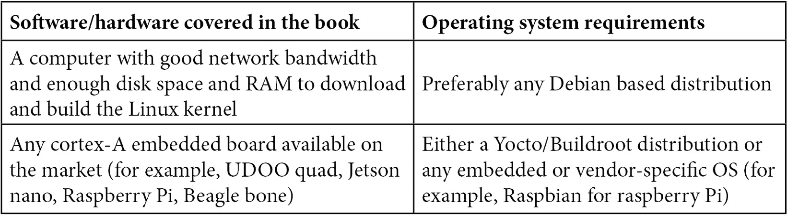

# 前言

Linux 内核是一个复杂、可移植、模块化且广泛使用的软件，运行在约 80% 的服务器和嵌入式系统上，覆盖了全球超过一半的设备。设备驱动在 Linux 系统的运行表现中起着至关重要的作用。随着 Linux 成为最流行的操作系统之一，开发个人设备驱动的兴趣也在稳步增加。

设备驱动是用户空间与硬件设备之间的桥梁，通过内核实现。

本书将从两章开始，帮助你了解驱动的基础知识，为你踏上长达数章的 Linux 内核之旅做准备。接下来，本书将覆盖基于 Linux 子系统的驱动开发，如内存管理、**工业输入/输出**（**IIO**）、**通用输入/输出**（**GPIO**）、**中断请求**（**IRQ**）管理，以及 **互连电路**（**I2C**）和 **串行外设接口**（**SPI**）。本书还将介绍一种直接内存访问和寄存器映射抽象的实践方法。

本书中的源代码已经在 x86 PC 和 SECO 的 UDOO QUAD（基于 NXP 的 ARM i.MX6）上进行了测试，配备了足够的功能和连接，以便我们覆盖本书中讨论的所有测试内容。还提供了一些驱动程序用于测试目的，适用于廉价组件，例如 MCP23016 和 24LC512，分别是 I2C GPIO 控制器和 EEPROM 存储器。

本书结束时，你将熟悉设备驱动开发的概念，并能够使用最后一个稳定的内核分支（本书撰写时为 v5.10.y）从零开始编写任何设备驱动程序。

# 本书适用人群

为了充分利用本书的内容，读者应具备基本的 C 编程和 Linux 命令知识。本书涉及使用 v5.10 版本内核的广泛应用的嵌入式设备的 Linux 驱动开发。本书主要面向嵌入式工程师、Linux 系统管理员、开发人员和内核黑客。无论你是软件开发人员、系统架构师，还是愿意深入了解 Linux 驱动开发的创作者，本书都适合你。

# 本书内容

*第一章*，*内核开发介绍*，介绍了 Linux 内核的开发过程。本章将讨论内核的下载、配置和编译步骤，适用于 x86 系统和基于 ARM 的系统。

*第二章*，*理解 Linux 内核模块基本概念*，通过内核模块讨论 Linux 的模块化，并描述了其加载/卸载过程。还介绍了模块架构和一些基本概念。

*第三章*，*处理内核核心帮助程序*，详细讲解了常用的内核函数和机制，如工作队列、等待队列、互斥锁、自旋锁以及任何有助于提高驱动程序可靠性的设施。

*第四章*，*编写字符设备驱动程序*，重点介绍了通过字符设备将设备功能导出到用户空间，以及使用 ioctl 接口支持自定义命令。

*第五章*，*理解和利用设备树*，讨论了声明和描述设备给内核的机制。本章解释了设备寻址、资源处理以及设备树(**DT**)中支持的所有数据类型及其内核 API。

*第六章*，*设备、驱动程序与平台抽象简介*，解释了平台设备的概念、伪平台总线的概念，以及设备与驱动程序匹配机制。

*第七章*，*理解平台设备和驱动程序的概念*，以一种通用的方式描述了平台驱动程序架构，以及如何处理平台数据。

*第八章*，*编写 I2C 设备驱动程序*，深入探讨了 I2C 设备驱动程序架构、数据结构，以及总线上设备寻址和访问方法。

*第九章*，*编写 SPI 设备驱动程序*，描述了基于 SPI 的设备驱动程序架构以及涉及的数据结构。本章讨论了每个设备的访问方法和具体特性，以及应避免的陷阱。SPI 设备树绑定也进行了讨论。

*第十章*，*理解 Linux 内核内存分配*，首先介绍了虚拟内存的概念，以描述整个内核内存布局。本章接着讲解内核内存管理子系统，讨论内存分配与映射、它们的 API 以及涉及这些机制的所有设备，还包括内核的缓存机制。

*第十一章*，*实现直接内存访问（DMA）支持*，介绍了 DMA 及其新的内核 API：DMA 引擎 API。本章将讨论不同的 DMA 映射，并描述如何解决缓存一致性问题。此外，本章总结了所有概念，并给出了一个通用的使用案例。

*第十二章*，*抽象化内存访问——Regmap API 简介：寄存器映射抽象*，概述了寄存器映射 API 及其如何抽象底层 SPI 和 I2C 事务。本章描述了通用 API 以及专用 API。

*第十三章*，*揭秘内核 IRQ 框架*，揭秘了 Linux IRQ 核心。本章介绍了 Linux IRQ 管理，从中断在系统中的传播开始，到中断控制器驱动，解释了 IRQ 多路复用的概念，并使用 Linux IRQ 域 API。

*第十四章*，*Linux 设备模型简介*，概述了 Linux 的核心，描述了内核中对象的表示方式，以及 Linux 在底层的设计方式，从 `kobject` 到设备，再到总线、类和设备驱动的结构。

*第十五章*，*深入研究 IIO 框架*，介绍了内核数据采集与测量框架，处理 `libiio`，涉及触发缓冲区和连续数据采集。

*第十六章*，*充分利用引脚控制器和 GPIO 子系统*，描述了内核引脚控制基础设施和 API，以及 GPIO 芯片驱动和 `gpiolib`，这是处理 GPIO 的内核 API。本章还讨论了已废弃的基于整数的 GPIO 接口，以及新的基于描述符的接口，并介绍了如何在设备树中配置它们。最后，它还涵盖了 `libgpiod`，这是官方的用户空间 GPIO 处理库。

*第十七章*，*利用 Linux 内核输入子系统*，提供了输入子系统的整体视图，涉及基于 IRQ 的输入设备和轮询输入设备，并介绍了两种 API。本章解释并展示了用户空间代码如何处理这些设备。

# 为了最大限度地发挥本书的作用

本书假设你具备中等水平的 Linux 操作系统理解能力以及 C 编程的基础知识（至少包括数据结构、指针处理和内存分配）。所有代码示例均已在 Linux 内核 v5.10 中进行测试。如果某一章节需要额外的技能，本书会提供相关文档链接，帮助你快速掌握这些技能。



其他必要的软件包在书中的专门章节中有描述。下载内核源码时需要互联网连接。

**如果你使用的是本书的数字版，我们建议你自己输入代码或从本书的 GitHub 仓库中获取代码（相关链接将在下一节提供）。这样做可以帮助你避免由于复制粘贴代码可能导致的错误。**

# 下载示例代码文件

你可以从 GitHub 下载本书的示例代码文件，地址为[`github.com/PacktPublishing/Linux-Device-Driver-Development-Second-Edition`](https://github.com/PacktPublishing/Linux-Device-Driver-Development-Second-Edition)。如果代码有更新，它会在 GitHub 仓库中更新。

我们的丰富书籍和视频目录中还有其他代码包，您可以访问[`github.com/PacktPublishing/`](https://github.com/PacktPublishing/)查看。快来看看吧！

# 下载彩色图片

我们还提供了一个 PDF 文件，包含本书中使用的屏幕截图和图表的彩色图像。您可以在此下载：[`static.packt-cdn.com/downloads/9781803240060_ColorImages.pdf`](https://static.packt-cdn.com/downloads/9781803240060_ColorImages.pdf)。

# 使用的约定

本书中使用了若干文本约定。

`文本中的代码`：表示文本中的代码词、数据库表名、文件夹名称、文件名、文件扩展名、路径名、虚拟 URL、用户输入和 Twitter 账号。例如：“我们可以使用`spin_lock()`和`spin_unlock()`内联函数来锁定/解锁自旋锁，这两个函数都定义在`include/linux/spinlock.h`中。”

代码块格式如下：

```
struct mutex {
    atomic_long_t owner;
    spinlock_t wait_lock;
#ifdef CONFIG_MUTEX_SPIN_ON_OWNER
    struct optimistic_spin_queue osq; /* Spinner MCS lock */
```

当我们希望引起你对代码块中特定部分的注意时，相关行或项目将以粗体显示：

```
struct fake_data {
    struct i2c_client *client;
    u16 reg_conf;
    struct mutex mutex;
};
```

任何命令行输入或输出都按以下方式写出：

```
[342081.385491] Wait queue example
[342081.385505] Going to sleep my_init
[342081.385515] Waitqueue module handler work_handler
[342086.387017] Wake up the sleeping module
```

提示或重要说明

显示如下。

# 联系我们

我们始终欢迎读者的反馈。

`customercare@packtpub.com`并在邮件主题中提到书名。

**勘误**：尽管我们已尽最大努力确保内容的准确性，但错误仍然可能发生。如果你在本书中发现了错误，我们将不胜感激，如果你能将其报告给我们。请访问[www.packtpub.com/support/errata](http://www.packtpub.com/support/errata)并填写表格。

`copyright@packt.com`，并附上材料链接。

**如果你有兴趣成为作者**：如果你在某个主题上拥有专业知识，并且有兴趣撰写或参与编写一本书，请访问[authors.packtpub.com](http://authors.packtpub.com)。

# 分享你的想法

一旦你阅读了*《Linux 设备驱动开发（第二版）》*，我们很想听听你的想法！请[点击这里直接进入亚马逊评论页面](https://packt.link/r/1803240067)，分享你的反馈。

你的评论对我们和技术社区都非常重要，并将帮助我们确保提供优质的内容。
