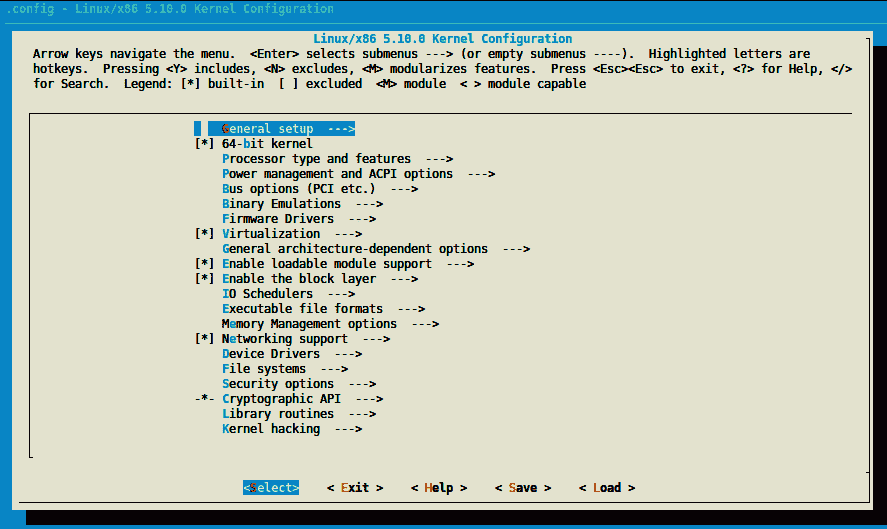

# *第一章*：内核开发简介

**Linux** 起初是芬兰学生 Linus Torvalds 于 1991 年发起的一个兴趣项目。该项目逐渐发展壮大，目前全球约有千名贡献者。如今，Linux 已成为嵌入式系统以及服务器中不可或缺的一部分。**内核**是操作系统的核心部分，其开发并非简单。Linux 相对于其他操作系统有许多优势；它是免费的，文档完善并拥有庞大的社区，能够跨平台移植，提供源代码访问，并且有大量免费的开源软件。

本书将尽量保持通用性。有一个特殊的主题，称为设备树，尚未完全成为**x86**特性。该主题将专门讨论 ARM 处理器，特别是那些完全支持设备树的 ARM 处理器。为什么选择这些架构？因为它们主要用于桌面和服务器（x86）以及嵌入式系统（ARM）。

本章将涵盖以下主题：

+   设置开发环境

+   理解内核配置过程

+   构建内核

# 设置开发环境

当你从事嵌入式系统领域工作时，有一些术语你必须熟悉，甚至在设置环境之前。它们如下：

+   **目标**：这是构建过程生成二进制文件的机器。这个机器将运行该二进制文件。

+   **宿主**：这是构建过程发生的机器。

+   **编译**：这也叫做本地编译或**本地构建**。当目标和宿主相同，即你在机器 A（宿主）上构建一个将在同一台机器（A，目标）或相同类型的机器上执行的二进制文件时，就会发生本地编译。本地编译需要本地编译器。因此，本地编译器是指目标和宿主相同的编译器。

+   **交叉编译**：在这里，目标和宿主是不同的。它是指你从机器 A（宿主）构建一个二进制文件，最终将在机器 B（目标）上执行。在这种情况下，宿主（机器 A）必须安装支持目标架构的交叉编译器。因此，交叉编译器是一个目标和宿主不同的编译器。

由于嵌入式计算机资源有限或减少（如 CPU、RAM、磁盘等），通常宿主机为 x86 机器，这些机器更强大，资源更多，有助于加速开发过程。然而，在过去几年中，嵌入式计算机变得更强大，越来越倾向于用于本地编译（因此作为宿主）。一个典型的例子是 Raspberry Pi 4，它配备了强大的四核 CPU 和最高 8 GB 的 RAM。

在本章中，我们将使用 x86 机器作为主机，进行本地构建或交叉编译。因此，任何“本地构建”的术语都将指“x86 本地构建”。基于此，我正在运行**Ubuntu 18.04**。

要快速检查这些信息，你可以使用以下命令：

```
lsb_release -a
Distributor ID: Ubuntu
Description:    Ubuntu 18.04.5 LTS
Release:    18.04
Codename:   bionic
```

我的计算机是一个`lscpu`命令提取的信息，16 GB 内存，256 GB SSD，和一个 1 TB 的机械硬盘（这些信息可以通过`df -h`命令获得）。也就是说，一个四核 CPU 和 4 或 8 GB 的内存就足够了，但构建时间会相应增加。我的最爱编辑器是**Vim**，不过你可以使用你最习惯的编辑器。如果你使用的是台式机，可以使用**Visual Studio Code**（**VS Code**），它正在变得越来越流行。

现在，我们已经熟悉了将要使用的与编译相关的关键字，接下来可以开始准备主机机器了。

## 设置主机机器

在你开始开发过程之前，你需要设置一个**环境**。专门用于 Linux 开发的环境是相当简单的——至少在**基于 Debian**的系统上（这是我们的情况）。

在主机机器上，你需要安装以下几个包：

```
$ sudo apt update
$ sudo apt install gawk wget git diffstat unzip \
       texinfo gcc-multilib build-essential chrpath socat \
       libsdl1.2-dev xterm ncurses-dev lzop libelf-dev make
```

在前面的代码中，我们安装了一些开发工具和一些必需的库，以便在配置 Linux 内核时能拥有一个良好的用户界面。

现在，我们需要安装编译器和工具（链接器、汇编器等），以便构建过程能够正常工作并生成目标的可执行文件。这一套工具被称为**Binutils**，而编译器 + Binutils（如果有其他构建时依赖库的话）组合称为**工具链**。所以，你需要理解*“我需要一个针对<此>架构的工具链”*或类似句子的意思。

### 理解并安装工具链

在我们开始编译之前，我们需要安装本地编译或 ARM 交叉编译所需的必要包和工具；也就是说，工具链。GCC 是 Linux 内核支持的编译器。内核中定义的许多宏都是与 GCC 相关的。因此，我们将使用 GCC 作为我们的（交叉）编译器。

对于本地编译，你可以使用以下工具链安装命令：

```
sudo apt install gcc binutils
```

当你需要进行交叉编译时，必须识别并安装正确的工具链。与本地编译器相比，交叉编译器的可执行文件会以目标操作系统、架构和（有时）库的名称为前缀。因此，为了识别特定架构的工具链，定义了一个命名约定：`arch[-vendor][-os]-abi`。让我们来看看这个模式中各个字段的含义：

+   `arch` 用于识别架构；也就是说，`arm`、`mips`、`x86`、`i686`等。

+   `vendor` 是工具链供应商（公司）；也就是说，`Bootlin`、`Linaro`、`none`（如果没有供应商）或干脆省略该字段，等等。

+   `os`是目标操作系统，即`linux`或`none`（裸机）。如果省略，则假定为裸机。

+   `abi`代表应用二进制接口。它指的是底层二进制文件的外观、函数调用约定、参数传递方式等。可能的约定包括`eabi`、`gnueabi`和`gnueabihf`。让我们更详细地了解这些：

    +   `eabi`表示将编译的代码将在裸机 ARM 核心上运行。

    +   `gnueabi`表示将为 Linux 编译代码。

    +   `gnueabihf`与`gnueabi`相同，但末尾的`hf`表示`硬浮点`，这意味着编译器及其底层库使用硬件浮点指令，而不是使用软件实现的浮点指令（例如定点软件实现）。如果没有浮点硬件，指令将被拦截并由浮点仿真模块执行。当使用软件仿真时，功能上的唯一实际差异是执行速度较慢。

以下是一些工具链名称，用来说明此命名模式的使用：

+   `arm-none-eabi`：这是一个针对 ARM 架构的工具链。它没有供应商，目标是裸机系统（不面向操作系统），并符合 ARM EABI 规范。

+   `arm-none-linux-gnueabi` 或 `arm-linux-gnueabi`：这是一个工具链，用于为 ARM 架构生成可在 Linux 上运行的对象文件，且使用工具链提供的默认配置（ABI）。请注意，`arm-none-linux-gnueabi`与`arm-linux-gnueabi`相同，因为正如我们所见，当没有指定供应商时，假定没有供应商。该工具链的硬件浮点版本为`arm-linux-gnueabihf`或`arm-none-linux-gnueabihf`。

现在我们已经熟悉了工具链命名约定，我们可以确定哪个工具链可以用于为我们的目标架构进行交叉编译。

要为 32 位 ARM 机器进行交叉编译，我们将使用以下命令安装工具链：

```
$ sudo apt install gcc-arm-linux-gnueabihf binutils-arm-linux-gnueabihf
```

请注意，Linux 树和 GCC 中的 64 位 ARM 后端/支持被称为`gcc-aarch64-linux-gnu*`，而 Binutils 必须被命名为类似`binutils-aarch64-linux-gnu*`的名称。因此，对于 64 位 ARM 工具链，我们将使用以下命令：

```
$ sudo apt install make gcc-aarch64-linux-gnu binutils-aarch64-linux-gnu
```

注意

请注意，aarch64 只支持/提供硬件浮点的 aarch64 工具链。因此，无需在末尾指定`hf`。

请注意，并非所有版本的编译器都可以编译特定的 Linux 内核版本。因此，处理 Linux 内核版本和编译器（GCC）版本非常重要。虽然前面的命令安装了由你的发行版支持的最新版本，但也可以指定某个特定版本。为此，可以使用`gcc-<version>-<arch>-linux-gnu*`。

例如，要为 aarch64 安装 GCC 8 版本，可以使用以下命令：

```
sudo apt install gcc-8-aarch64-linux-gnu
```

现在我们的工具链已安装完毕，我们可以查看由我们的发行版包管理器选定的版本。例如，要检查安装的 aarch64 交叉编译器版本，我们可以使用以下命令：

```
$ aarch64-linux-gnu-gcc --version
aarch64-linux-gnu-gcc (Ubuntu/Linaro 7.5.0-3ubuntu1~18.04) 7.5.0
Copyright (C) 2017 Free Software Foundation, Inc.
[...]
```

对于 32 位 ARM 变体，我们可以使用以下命令：

```
$ arm-linux-gnueabihf-gcc --version
arm-linux-gnueabihf-gcc (Ubuntu/Linaro 7.5.0-3ubuntu1~18.04) 7.5.0
Copyright (C) 2017 Free Software Foundation, Inc.
[...]
```

最后，对于本地版本，我们可以使用以下命令：

```
$ gcc --version
gcc (Ubuntu 7.5.0-3ubuntu1~18.04) 7.5.0
Copyright (C) 2017 Free Software Foundation, Inc.
```

现在我们已经设置好了环境，并确保使用了正确的工具版本，我们可以开始下载 Linux 内核源代码并深入研究它们。

## 获取源代码

在早期的内核时代（直到 2003 年），使用奇偶版本控制风格，其中奇数版本为稳定版，偶数版本为不稳定版。当 2.6 版本发布时，版本控制方案改为**X.Y.Z**。我们来详细看看这个：

+   **X**：这是实际的内核版本，也叫主版本。当发生向后不兼容的 API 变更时，它会递增。

+   **Y**：这是次要修订。在以向后兼容的方式添加功能后，它会递增。

+   **Z**：也叫 PATCH，代表与修复 BUG 相关的版本。

这叫做*语义版本控制*，直到版本*2.6.39*，当时林纳斯·托瓦兹决定将版本号提升到 3.0，这也意味着 2011 年语义版本控制的结束。此时，采用了 X.Y 的版本方案。

当版本达到 3.20 时，林纳斯认为他再也无法增加 Y 了。因此，他决定切换到一个任意的版本控制方案，每当 Y 变得足够大，导致他用完了手指和脚趾来计数时，就递增 X。这就是为什么版本直接从 3.20 跳跃到 4.0 的原因。

现在，内核使用一个任意的**X.Y**版本控制方案，这与语义版本控制无关。

根据 Linux 内核发布模型，内核始终有两个最新版本：稳定版本和**长期支持**（**LTS**）版本。所有的 BUG 修复和新特性由子系统维护者收集并准备好，然后提交给林纳斯·托瓦兹以纳入他的 Linux 树，这棵树被称为主线 Linux 树，也叫做*主*Git 仓库。这是每个稳定版本的起点。

在每个新内核版本发布之前，它会通过*发布候选*标签提交到社区，以便开发人员可以测试和完善所有的新特性。根据他在此周期中收到的反馈，林纳斯决定最终版本是否准备好发布。当林纳斯确信新内核准备好发布时，他会做出最终发布。我们称这个发布为“稳定版”，表示它不是“发布候选版”：这些版本是*vX.Y*版本。

没有严格的发布时间表，但新的主线内核一般每 2-3 个月发布一次。稳定的内核发布基于林纳斯的发布；也就是说，基于主线树的发布。

一旦 Linus 发布了稳定内核，它也会出现在 *linux-stable* 树中（可通过 [`git.kernel.org/pub/scm/linux/kernel/git/stable/linux.git/`](https://git.kernel.org/pub/scm/linux/kernel/git/stable/linux.git/) 获取），并成为一个分支。在这里，它可以接收 bug 修复。这个树被称为稳定树，因为它用于跟踪以前发布的稳定内核。它由 *Greg Kroah-Hartman* 维护和管理。然而，所有的修复必须首先进入 Linus 的树，即主线代码库。一旦主线代码库中的 bug 被修复，它可以应用于先前发布且仍由内核开发社区维护的内核。所有回溯到稳定版本的修复必须满足一套重要的标准才能被考虑——其中之一就是它们“必须已经存在于 Linus 的树中”。

注意

**Bugfix 内核版本**被认为是稳定的。

例如，当 Linus 发布 4.9 内核时，稳定内核会根据内核的版本编号方案发布；即 4.9.1、4.9.2、4.9.3 等。这些版本被称为 **bugfix 内核版本**，在提到其分支时，通常用 “4.9.y” 来简化。每个稳定内核发布树由单一的内核开发者维护，负责选择所需的补丁并经过审核/发布过程。通常，直到下一个主线内核发布之前，只有少数几个 bugfix 内核版本——除非它被指定为 *长期维护内核*。

每个子系统和内核维护者的代码库都托管在这里：[`git.kernel.org/pub/scm/linux/kernel/git/`](https://git.kernel.org/pub/scm/linux/kernel/git/)。在这里，我们还可以找到 Linus 或稳定树。在 Linus 树中 ([`git.kernel.org/pub/scm/linux/kernel/git/torvalds/linux.git/`](https://git.kernel.org/pub/scm/linux/kernel/git/torvalds/linux.git/))，只有一个分支，即**主分支**。其标签要么是稳定版本，要么是发布候选版本。在稳定树中 ([`git.kernel.org/pub/scm/linux/kernel/git/stable/linux.git/`](https://git.kernel.org/pub/scm/linux/kernel/git/stable/linux.git/))，每个稳定内核版本都有一个分支（命名为 *<A.B>.y*，其中 *<A.B>* 是 Linus 树中的发布版本），每个分支包含其修复内核版本。

### 下载源代码并进行组织

在本书中，我们将使用 Linus 的树，可以使用以下命令进行下载：

```
git clone https://git.kernel.org/pub/scm/linux/kernel/git/torvalds/linux.git --depth 1 
git checkout v5.10
ls
```

在前面的命令中，我们使用了 `--depth 1` 来避免下载历史记录（或者说，只挑选最后一次提交的历史），这可以显著减少下载的大小并节省时间。由于 Git 支持分支和标签，`checkout` 命令允许你切换到特定的标签或分支。在这个例子中，我们切换到了 `v5.10` 标签。

注意

在本书中，我们将处理 Linux 内核 v5.10。

让我们来看看主源代码目录的内容：

+   `arch/`：为了尽可能地通用，架构特定的代码与其他代码分开。该目录包含按架构组织的处理器特定代码，如 `alpha/`、`arm/`、`mips/`、`arm64/` 等。

+   `block/`：该目录包含块存储设备的代码。

+   `crypto/`：该目录包含加密 API 和加密算法的代码。

+   `certs/`：该目录包含证书和签名文件，以启用模块签名，使内核加载已签名的模块。

+   `documentation/`：该目录包含用于不同内核框架和子系统的 API 描述。在向公共论坛提问之前，你应该查看这里。

+   `drivers/`：这是最大的目录，因为随着设备驱动的合并，它不断增长。它包含每个设备驱动，并按子目录进行组织。

+   `fs/`：该目录包含内核支持的不同文件系统的实现，例如 NTFS、FAT、ETX{2,3,4}、sysfs、procfs、NFS 等。

+   `include/`：该目录包含内核头文件。

+   `init/`：该目录包含初始化和启动代码。

+   `ipc/`：该目录包含**进程间通信**（**IPC**）机制的实现，如消息队列、信号量和共享内存。

+   `kernel/`：该目录包含与架构无关的基本内核部分。

+   `lib/`：此目录包含库例程和一些辅助函数，包括通用**内核对象**（**kobject**）处理程序和**循环冗余码**（**CRC**）计算函数。

+   `mm/`：该目录包含内存管理代码。

+   `net/`：该目录包含网络（无论是哪种网络类型）协议代码。

+   `samples/`：该目录包含用于各种子系统的设备驱动示例。

+   `scripts/`：该目录包含与内核一起使用的脚本和工具。这里还有一些其他有用的工具。

+   `security/`：该目录包含安全框架代码。

+   `sound/`：你猜这里有什么：音频子系统代码。

+   `tools/`：该目录包含用于各种子系统的 Linux 内核开发和测试工具，例如 USB、vhost 测试模块、GPIO、IIO 和 SPI 等。

+   `usr/`：该目录目前包含 initramfs 实现。

+   `virt/`：这是虚拟化目录，包含用于虚拟机监控器的**内核虚拟机**（**KVM**）模块。

为了强制可移植性，任何架构特定的代码应放在 `arch` 目录中。此外，与用户空间 API 相关的内核代码（如系统调用、`/proc`、`/sys` 等）不会改变，因为修改它会破坏现有的程序。

在本节中，我们已经熟悉了 Linux 内核的源代码内容。经过所有源代码的学习后，配置它们以编译内核似乎是很自然的事情。在下一节中，我们将学习内核配置是如何工作的。

# 配置和构建 Linux 内核

Linux 内核源码中有大量的驱动程序/特性和构建选项。配置过程包括选择哪些特性/驱动程序将成为编译过程的一部分。根据我们是否进行本地编译或交叉编译，有一些环境变量必须在配置过程之前定义。

## 指定编译选项

内核的 `Makefile` 调用的编译器是 `$(CROSS_COMPILE)gcc`。也就是说，`CROSS_COMPILE` 是交叉编译工具的前缀（如 `gcc`、`as`、`ld`、`objcopy` 等），在调用 `make` 时必须指定，或者在执行任何 `make` 命令之前已经被导出。只有 `gcc` 及其相关的 Binutils 可执行文件会以 `$(CROSS_COMPILE)` 为前缀。

请注意，Linux 内核构建基础设施会根据目标架构做出各种假设，并启用选项/特性/标志。为了实现这一点，除了交叉编译器前缀外，还必须指定目标的架构。这可以通过 `ARCH` 环境变量来完成。

因此，一个典型的 Linux 配置或构建命令看起来如下所示：

```
ARCH=<XXXX> CROSS_COMPILE=<YYYY> make menuconfig
```

它也可以如下所示：

```
ARCH=<XXXX> CROSS_COMPILE=<YYYY> make <make-target>
```

如果你不想在启动命令时指定这些环境变量，可以将它们导出到当前 shell 中。以下是一个示例：

```
export CROSS_COMPILE=aarch64-linux-gnu-
export ARCH=aarch64
```

请记住，如果没有指定这些变量，默认将以本地主机作为目标；也就是说，如果省略或未设置 `CROSS_COMPILE`，那么 `$(CROSS_COMPILE)gcc` 将变为 `gcc`，其他被调用的工具也会是相同的（例如，`$(CROSS_COMPILE)ld` 会变成 `ld`）。

同样地，如果 `ARCH`（目标架构）被省略或未设置，它将默认为执行 `make` 的主机架构。它将默认设置为 `$(uname -m)`。

结果，你应该保持 `CROSS_COMPILE` 和 `ARCH` 未定义，以便使用 `gcc` 本地编译内核以适应主机架构。

## 理解内核配置过程

Linux 内核是一个 *基于 Makefile* 的项目，包含成千上万的选项和驱动程序。每个启用的选项可能会使另一个选项可用，或者将特定代码引入构建中。为了配置内核，你可以使用 `make menuconfig` 进行基于 ncurses 的界面配置，或者使用 `make xconfig` 进行基于 X 的界面配置。基于 ncurses 的界面如下所示：



](img/B17934_Fig_1.1.jpg)

图 1.1 – 内核配置界面

对于大多数选项，您有三个选择。然而，在配置 Linux 内核时，我们可以列出五种类型的选项：

+   布尔选项，您可以选择两种状态：

    +   `(blank)`，表示跳过此功能。一旦在配置菜单中高亮显示此选项，您可以按`<n>`键跳过该功能。这相当于 false。当禁用时，配置文件中的相应配置选项会被注释掉。

    +   `(*)`，表示将其静态编译到内核中。这意味着在内核首次加载时，它将始终存在。这相当于 true。您可以通过选择此功能并按下 `<y>` 键来启用该功能。生成的选项将在配置文件中显示为 `CONFIG_<OPTION>=y`；例如，`CONFIG_INPUT_EVDEV=y`。

+   三态选项，除了可以取布尔状态外，还可以取第三种状态，这在配置窗口中标记为 `(M)`。这将在配置文件中生成 `CONFIG_<OPTION>=m`；例如，`CONFIG_INPUT_EVDEV=m`。为了生成可加载模块（前提是该选项允许），您可以选择该功能并按下 `M` 键。

+   字符串选项，期望字符串值；例如，`CONFIG_CMDLINE="noinitrd console=ttymxc0,115200"`。

+   十六进制选项，期望十六进制值；例如，`CONFIG_PAGE_OFFSET=0x80000000`。

+   整数选项，期望整数值；例如，`CONFIG_CONSOLE_LOGLEVEL_DEFAULT=7`。

选定的选项将被存储在源代码树根目录下的 `.config` 文件中。

很难知道哪个配置在您的平台上能够正常工作。在大多数情况下，您无需从头开始配置。每个架构目录中都有默认且有效的配置文件，您可以将其作为起点（重要的是要从一个已经工作的配置开始）：

```
ls arch/<your_arch>/configs/
```

对于基于 32 位 ARM 的 CPU，这些配置文件可以在 `arch/arm/configs/` 中找到。在该架构中，通常每个 CPU 系列都有一个默认配置文件。例如，对于 i.MX6-7 处理器，默认配置文件是 `arch/arm/configs/imx_v6_v7_defconfig`。然而，在 ARM 64 位 CPU 上，只有一个大默认配置文件可供定制；它位于 `arch/arm64/configs/` 中，文件名为 `defconfig`。类似地，对于 x86 处理器，我们可以在 `arch/x86/configs/` 中找到文件。这里将有两个默认配置文件——`i386_defconfig` 和 `x86_64_defconfig`，分别对应 32 位和 64 位 x86 架构。

内核配置命令，给定默认的配置文件，格式如下：

```
make <foo_defconfig>
```

这将生成一个新的 `.config` 文件到主（根）目录，而旧的 `.config` 文件将被重命名为 `.config.old`。这样可以方便地恢复之前的配置更改。然后，您可以使用以下命令来定制配置：

```
make menuconfig
```

保存你的更改将更新你的`.config`文件。虽然你可以与队友共享此配置，但最好是创建一个与 Linux 内核源代码中提供的最小格式相同的默认配置文件。为此，你可以使用以下命令：

```
make savedefconfig
```

此命令将创建一个最小化的（因为它不会存储非默认设置）配置文件。生成的默认配置文件将被命名为`defconfig`并存储在源代码树的根目录下。你可以使用以下命令将其存储在其他位置：

```
mv defconfig arch/<arch>/configs/myown_defconfig
```

通过这种方式，你可以在内核源代码中共享一个参考配置，其他开发者现在可以通过运行以下命令获取与你相同的`.config`文件：

```
make myown_defconfig
```

注释

请注意，对于交叉编译，`ARCH`和`CROSS_COMPILE`必须在执行任何`make`命令之前设置，即使是内核配置也是如此。否则，你的配置可能会发生意外变化。

以下是你可以使用的各种配置命令，具体取决于目标系统：

+   对于 64 位 x86 本地编译，过程相当简单（可以省略编译选项）：

    ```
    make x86_64_defconfig
    make menuconfig
    ```

+   给定一个 32 位 ARM i.MX6 基础板，你可以执行以下命令：

    ```
    ARCH=arm CROSS_COMPILE=arm-linux-gnueabihf- make imx_v6_v7_defconfig
    ARCH=arm CROSS_COMPILE=arm-linux-gnueabihf- make menuconfig
    ```

使用第一个命令时，你会将默认选项存储在`.config`文件中，而使用后者，你可以根据需要更新（添加/删除）各种选项。

+   对于 64 位 ARM 板，你可以执行以下命令：

    ```
    ARCH=aarch64 CROSS_COMPILE=aarch64-linux-gnu- make defconfig
    ARCH=aarch64 CROSS_COMPILE=aarch64-linux-gnu- make menuconfig
    ```

使用`xconfig`时，你可能会遇到 Qt4 错误。在这种情况下，你应该使用以下命令安装缺失的软件包：

```
sudo apt install qt4-dev-tools qt4-qmake
```

注释

你可能会从旧内核切换到新内核。给定旧的`.config`文件，你可以将其复制到新的内核源代码树中并运行`make oldconfig`。如果新内核中有新选项，你将被提示是否包括这些选项。不过，你可能想使用这些选项的默认值。在这种情况下，你应该运行`make olddefconfig`。最后，为了对每个新选项说“不”，你应该运行`make oldnoconfig`。

可能有更好的方法来找到初始配置文件，特别是如果你的机器已经在运行的情况下。Debian 和 Ubuntu Linux 发行版将`.config`文件保存在`/boot`目录中，因此你可以使用以下命令复制此配置文件：

```
cp /boot/config-`uname -r` .config
```

其他发行版可能不会这样做。因此，我建议你始终启用`IKCONFIG`和`IKCONFIG_PROC`内核配置选项，这将通过`/proc/configs.gz`启用对`.config`的访问。这是一种标准方法，也适用于嵌入式发行版。

### 一些有用的内核配置功能

现在我们可以配置内核了，下面列举一些可能值得在你的内核中启用的有用配置功能：

+   `IKCONFIG` 和 `IKCONFIG_PROC`：这些是对我来说最重要的选项。它使得你的内核配置在运行时可用，并可以在 `/proc/config.gz` 中查看。它非常有用，可以在其他系统上重用此配置，或者简单地查看某个特性是否启用；例如：

    ```
    # zcat /proc/config.gz | grep CONFIG_SOUND
    CONFIG_SOUND=y
    CONFIG_SOUND_OSS_CORE=y
    CONFIG_SOUND_OSS_CORE_PRECLAIM=y
    # CONFIG_SOUNDWIRE is not set
    #  
    ```

+   `CMDLINE_EXTEND` 和 `CMDLINE`：第一个选项是一个布尔值，它允许你在配置中扩展内核命令行，而第二个选项是一个字符串，包含实际的命令行扩展值；例如，`CMDLINE="noinitrd usbcore.authorized_default=0"`。

+   `CONFIG_KALLSYMS`：这是一个布尔选项，它使得内核符号表（符号与地址之间的映射）可以在`/proc/kallsyms`中查看。这对于跟踪工具和其他需要将内核符号映射到地址的工具非常有用。在打印`oops`消息时会使用此选项。如果没有它，`oops`列表将输出十六进制数据，难以解读。

+   `CONFIG_PRINTK_TIME`：此选项在打印内核消息时显示时间信息。它可能有助于为运行时发生的事件添加时间戳。

+   `CONFIG_INPUT_EVBUG`：此选项允许你调试输入设备。

+   `CONFIG_MAGIC_SYSRQ`：此选项允许你在系统崩溃后，通过按组合键来控制系统（如重启、转储一些状态信息等）。

+   `DEBUG_FS`：此选项启用对调试文件系统的支持，`GPIO`、`CLOCK`、`DMA`、`REGMAP`、`IRQs` 和其他多个子系统可以从中进行调试。

+   `FTRACE` 和 `DYNAMIC_FTRACE`：这些选项启用强大的 `ftrace` 跟踪器，可以跟踪整个系统。一旦启用 `ftrace`，还可以启用一些枚举选项：

    +   `FUNCTION_TRACER`：此选项允许你跟踪内核中的任何非内联函数。

    +   `FUNCTION_GRAPH_TRACER`：此选项与前一个命令相同，但它显示一个调用图（调用者和被调用者函数）。

    +   `IRQSOFF_TRACER`：此选项允许你跟踪内核中 IRQ 关闭的时段。

    +   `PREEMPT_TRACER`：此选项允许你测量抢占关闭的延迟。

    +   `SCHED_TRACER`：此选项允许你跟踪调度延迟。

在内核配置完成后，必须构建内核以生成可运行的内核。在下一节中，我们将描述内核构建过程以及预期的构建产物。

## 构建 Linux 内核

此步骤要求你在配置步骤时所在的同一 shell 中执行；否则，你需要重新定义 `ARCH` 和 `CROSS_COMPILE` 环境变量。

Linux 是一个基于 Makefile 的项目。构建此类项目需要使用 `make` 工具并执行 `make` 命令。对于 Linux 内核，此命令必须从主内核源目录以普通用户身份执行。

默认情况下，如果未指定，make 目标是 `all`。在 Linux 内核源代码中，对于 x86 架构，此目标指向（或依赖于）`vmlinux bzImage modules` 目标；对于 ARM 或 aarch64 架构，它对应于 `vmlinux zImage modules dtbs` 目标。

在这些目标中，`bzImage` 是一个特定于 x86 的 make 目标，它会生成一个名为 `bzImage` 的二进制文件。`vmlinux` 是一个 make 目标，它会生成一个名为 `vmlinux` 的 Linux 镜像。`zImage` 和 `dtbs` 都是特定于 ARM 和 aarch64 的 make 目标。第一个生成一个与其同名的 Linux 镜像，而第二个则构建目标 CPU 变体的设备树源文件。`modules` 是一个 make 目标，它会构建所有选中的模块（在配置中标记为 `m` 的模块）。

在构建过程中，你可以通过运行多个并行任务来利用主机的 CPU 性能，这得益于 `-j` make 选项。以下是一个示例：

```
make -j16
```

大多数人将他们的 `-j` 数量定义为核心数的 1.5 倍。就我而言，我总是使用 `ncpus * 2`。

你可以像这样构建 Linux 内核：

+   对于本地编译，使用以下命令：

    ```
    make -j16
    ```

+   对于 32 位 ARM 交叉编译，使用以下命令：

    ```
    ARCH=arm CROSS_COMPILE=arm-linux-gnueabihf- make -j16
    ```

每个 make 目标都可以单独调用，如下所示：

```
ARCH=arm CROSS_COMPILE=arm-linux-gnueabihf- make dtbs
```

你也可以这样做：

```
ARCH=arm CROSS_COMPILE=arm-linux-gnueabihf- make zImage -j16
```

最后，你还可以这样做：

```
make bzImage -j16
```

注意

我在命令中使用了 `-j16`，因为我的主机有一个 8 核 CPU。此任务数量必须根据你的主机配置进行调整。

在你的 32 位 ARM 交叉编译工作结束时，你会看到类似以下内容：

```
[…]
  LZO     arch/arm/boot/compressed/piggy_data
  CC      arch/arm/boot/compressed/misc.o
  CC      arch/arm/boot/compressed/decompress.o
  CC      arch/arm/boot/compressed/string.o
  SHIPPED arch/arm/boot/compressed/hyp-stub.S
  SHIPPED arch/arm/boot/compressed/lib1funcs.S
  SHIPPED arch/arm/boot/compressed/ashldi3.S
  SHIPPED arch/arm/boot/compressed/bswapsdi2.S
  AS      arch/arm/boot/compressed/hyp-stub.o
  AS      arch/arm/boot/compressed/lib1funcs.o
  AS      arch/arm/boot/compressed/ashldi3.o
  AS      arch/arm/boot/compressed/bswapsdi2.o
  AS      arch/arm/boot/compressed/piggy.o
  LD      arch/arm/boot/compressed/vmlinux
  OBJCOPY arch/arm/boot/zImage
  Kernel: arch/arm/boot/zImage is ready
```

通过使用默认目标，构建过程中会生成多个二进制文件，具体取决于架构。这些文件如下所示：

+   `arch/<arch>/boot/Image`：一个未压缩的内核镜像，可以用来启动

+   `arch/<arch>/boot/*Image*`：一个压缩的内核镜像，也可以用来启动：

这是 x86 的 `bzImage`（即 "big zImage"），ARM 或 aarch64 的 `zImage`，以及其他架构的 `vary`。

+   `arch/<arch>/boot/dts/*.dtb`：为所选的 CPU 变体提供已编译的设备树二进制文件。

+   `vmlinux`：这是一个原始的、未压缩和未剥离的 ELF 格式内核镜像。它通常用于调试，但通常不用于启动。

现在我们知道如何（交叉）编译 Linux 内核了，接下来学习如何安装它。

### 安装 Linux 内核

Linux 内核安装过程在本地编译和交叉编译方面有所不同：

+   在本地安装（即你正在安装主机）时，你可以简单地运行 `sudo make install`。你必须使用 `sudo`，因为安装将发生在 `/boot` 目录下。如果你进行的是 x86 本地安装，以下文件会被安装：

    +   `/boot/vmlinuz-<version>`：这是 `vmlinux` 的压缩和剥离版本。它与 `arch/<arch>/boot` 中的内核镜像相同。

    +   `/boot/System.map-<version>`：存储内核符号表（内核符号与其地址之间的映射），不仅用于调试，还允许某些内核模块解析它们的符号并正确加载。此文件仅包含静态的内核符号表，而运行中内核的`/proc/kallsyms`（前提是配置文件中启用了`CONFIG_KALLSYMS`）包含`System.map`和已加载的内核模块符号。

    +   `/boot/config-<version>`：这对应于已构建版本的内核配置。

+   嵌入式安装通常使用单个文件内核。此外，目标设备无法访问，因此更倾向于手动安装。因此，嵌入式 Linux 构建系统（如 Yocto 或 Buildroot）会使用内部脚本将内核映像放置在目标根文件系统中。虽然嵌入式安装由于使用了构建系统可能较为简单，但本地安装（尤其是 x86 本地安装）可能需要运行额外的引导加载程序相关命令（如`update-grub2`），使新内核对系统可见。

现在我们已经了解了内核配置，包括构建和安装过程，让我们来看一下内核模块，它们允许你在运行时扩展内核。

# 构建和安装模块

可以使用`modules`目标单独构建模块。使用`modules_install`目标可以安装它们。模块会在与其源代码相对应的同一目录中构建。因此，生成的内核对象会分散在内核源树中：

+   对于本地构建和安装，你可以使用以下命令：

    ```
    make modules
    sudo make modules_install
    ```

生成的模块将安装在`/lib/modules/$(uname -r)/kernel/`中，目录结构与其源代码相应。可以使用`INSTALL_MOD_PATH`环境变量指定自定义安装路径。

+   当你为嵌入式系统进行交叉编译时，和所有`make`命令一样，必须指定`ARCH`和`CROSS_COMPILE`。由于无法将目录安装到目标设备的文件系统中，嵌入式 Linux 构建系统（如 Yocto 或 Buildroot）会将`INSTALL_MOD_PATH`设置为对应目标根文件系统的路径，以便最终的根文件系统镜像包含已构建的模块；否则，模块将安装在主机上。以下是 32 位 ARM 架构的示例：

    ```
    ARCH=arm CROSS_COMPILE=arm-linux-gnueabihf- make modules
    ARCH=arm CROSS_COMPILE=arm-linux-gnueabihf- INSTALL_MOD_PATH=<dir> make modules_install
    ```

除了随模块一起提供的`kernel`目录外，以下文件也会安装在`/lib/modules/<version>`目录中：

+   `modules.builtin`：列出了所有内核对象（`.ko`），这些对象是内核构建时包含的。它被模块加载工具（如`modprobe`）使用，以确保在加载已经构建进内核的模块时不会失败。`modules.builtin.bin`是它的二进制版本。

+   `modules.alias`：这个文件包含了模块加载工具的别名，这些工具用于匹配驱动程序和设备。模块别名的概念将在*第六章*《设备、驱动程序和平台抽象介绍》中进行解释。`modules.alias.bin`是它的二进制等效文件。

+   `modules.dep`：这个文件列出了模块及其依赖关系。`modules.dep.bin`是它的二进制版本。

+   `modules.symbols`：这个文件告诉我们一个给定符号属于哪个模块。它们的形式为 `alias symbol:<symbol> <modulename>`。例如，`alias symbol:v4l2_async_notifier_register videodev`。`modules.symbols.bin`是这个文件的二进制版本。

到此为止，我们已经安装了必要的模块，学习了如何构建和安装 Linux 内核和模块。我们也学会了如何配置 Linux 内核并添加所需的功能。

# 总结

在这一章中，你学习了如何下载 Linux 源代码并进行第一次构建。我们还介绍了一些常见操作，比如配置或选择合适的工具链。也就是说，这一章内容较为简短，主要是一个介绍。因此，在下一章中，我们将详细讲解内核构建过程、如何编译驱动程序（无论是外部编译还是作为内核的一部分），以及一些在开始长时间的内核开发之前你应该掌握的基础知识。让我们来看看吧！
