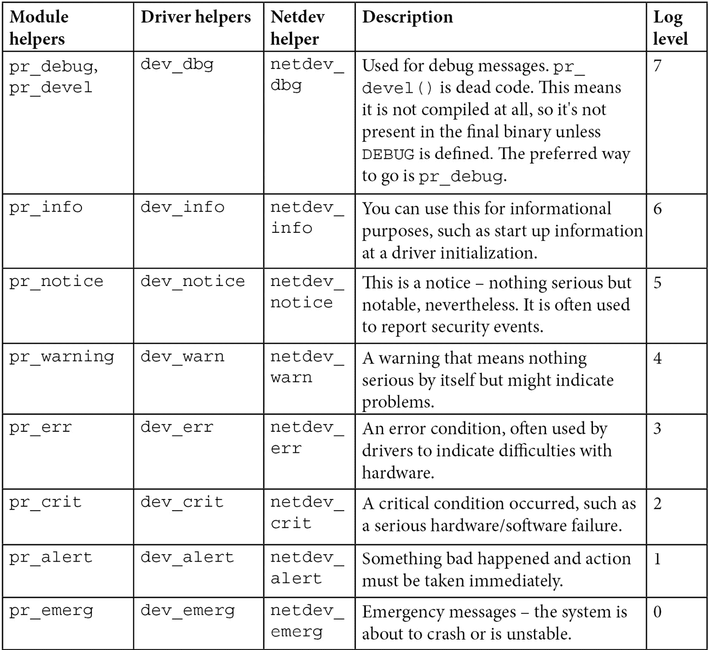

# 第二章：*第二章*：理解 Linux 内核模块的基本概念

内核模块是一种软件，旨在通过新增功能扩展 Linux 内核。内核模块可以是设备驱动程序，在这种情况下，它将控制和管理特定的硬件设备，因此被称为**设备驱动程序**。模块也可以添加框架支持（例如**IIO**，即**工业输入输出**框架）、扩展现有框架，甚至是新的文件系统或其扩展。需要记住的是，内核模块不一定是设备驱动程序，而设备驱动程序始终是内核模块。

与内核模块相对的是，可能存在简单模块或用户空间模块，它们运行在用户空间，权限较低。然而，本书仅处理内核空间模块，特别是 Linux 内核模块。

话虽如此，本章将讨论以下主题：

+   模块概念简介

+   构建 Linux 内核模块

+   处理符号导出和模块依赖

+   学习一些 Linux 内核编程技巧

# 模块概念简介

在构建 Linux 内核时，最终生成的映像是由所有与配置中启用的功能相对应的目标文件链接而成的单一文件。因此，所有包含的功能在内核启动时就能立即可用，即使文件系统尚未准备好或不存在。这些功能是内建的，相应的模块称为静态模块。这样的模块在内核映像中始终可用，因此无法卸载，但代价是最终内核映像的体积增加。静态模块也被称为内建模块，因为它是最终内核映像输出的一部分。任何代码的更改都需要重新构建整个内核。

然而，一些功能（如设备驱动程序、文件系统和框架）可以编译为可加载模块。这些模块与最终的内核映像分离，按需加载。它们可以被视为插件，能够动态加载/卸载，以便在运行时向内核添加或删除功能。由于每个模块作为单独的文件存储在文件系统中，因此使用可加载模块需要访问文件系统。

总结来说，模块对于 Linux 内核就像插件（附加组件）对于用户软件（例如 Firefox）。当它与生成的内核映像静态链接时，称为内建。它如果被构建为一个单独的文件（可以加载/卸载），则称为可加载模块。它在不需要重启机器的情况下动态扩展内核功能。

为了支持模块加载，内核必须启用以下选项进行构建：

```
CONFIG_MODULES=y
```

卸载模块是内核的一项特性，可以根据`CONFIG_MODULE_UNLOAD`内核配置选项启用或禁用。没有这个选项，我们将无法卸载任何模块。因此，为了能够卸载模块，必须启用以下功能：

```
CONFIG_MODULE_UNLOAD=y
```

也就是说，内核足够智能，可以防止卸载可能会破坏系统的模块（例如，因为这些模块正在使用中），即使被要求卸载。这是因为内核会保持模块使用的引用计数，从而知道模块当前是否正在使用。如果内核认为卸载模块不安全，它将不会卸载。但是，我们可以通过以下配置功能来改变这种行为：

```
MODULE_FORCE_UNLOAD=y
```

上面的选项允许我们强制卸载模块。

现在我们已经了解了模块背后的主要概念，让我们开始实践，首先介绍一个模块框架，它将作为本章的基础。

## 案例研究——模块框架

让我们考虑以下`hello-world`模块。它将是我们在本章中工作的基础。我们将其编译单元命名为`helloworld.c`，其内容如下：

```
#include <linux/module.h>
#include <linux/init.h>
static int __init helloworld_init(void) {
    pr_info("Hello world initialization!\n");
    return 0;
}
static void __exit helloworld_exit(void) {
    pr_info("Hello world exit\n");
}
module_init(helloworld_init);
module_exit(helloworld_exit);
MODULE_LICENSE("GPL");
MODULE_AUTHOR("John Madieu <john.madieu@gmail.com>");
MODULE_DESCRIPTION("Linux kernel module skeleton");
```

在前面的框架中，头文件是特定于 Linux 内核的，因此使用了`linux/xxx.h`。`module.h`头文件是所有内核模块的必需文件，`init.h`是为了使用`__init`和`__exit`宏而需要的。其他内容将在接下来的部分中描述。为了构建这个框架模块，我们需要编写一个*特殊*的 makefile，稍后在本章中会涉及到。

### 模块的入口和退出点

内核模块的最小要求是一个初始化方法。这是必须的。如果模块可以构建为可加载模块，则还必须提供`exit`方法。第一个方法是入口点，对应于模块加载时调用的函数（`modprobe`或`insmod`），而后者是清理和退出点，对应于模块卸载时执行的函数（`rmmod`或`modprobe -r`）。

您需要做的就是通知内核哪些函数应该作为入口或出口点执行。`helloworld_init`和`helloworld_exit`函数可以使用任何名称。实际上唯一强制要求的是将它们标识为相应的初始化和退出函数，并将它们作为参数传递给`module_init()`和`module_exit()`宏。

总结一下，`module_init()`用于声明在模块加载时应该调用的函数（当模块构建为可加载内核模块时，通过`insmod`或`modprobe`），或者当内核达到与此模块对应的运行级别时（当它是内置的）。初始化函数中执行的内容将定义模块的行为。`module_exit()`仅在模块可以构建为可加载内核模块时使用。它声明了模块卸载时应该调用的函数（通过`rmmod`）。

`init`或`exit`方法只会被调用一次，无论模块当前处理多少设备，只要该模块是设备驱动程序。对于平台（或类似的）设备驱动程序的模块来说，通常会在其`init`函数中注册一个平台驱动程序，并关联`probe`/`remove`回调，这样每次模块处理的设备添加或从系统中移除时，`init`函数就会被调用。在这种情况下，它们只需在`exit`方法中注销平台驱动程序。

#### __init 和 __exit 属性

`__init`和`__exit`是内核宏，在`include/linux/init.h`中定义，如下所示：

```
#define __init      __section(.init.text)
#define __exit      __section(.exit.text)
```

`__init`关键字告诉链接器将它们前缀的符号（变量或函数）放置在结果内核目标文件中的专用段中。内核事先已知该段，并在模块加载且初始化函数完成后释放。此功能仅适用于内建模块，而不适用于可加载模块。内核会在启动过程中首次运行驱动程序的初始化函数。由于驱动程序不能卸载，因此初始化函数在下次重启之前永远不会再次被调用。因此，之后无需再保留对该初始化函数的引用。`__exit`关键字及`exit`方法也遵循相同的规则，编译时将会忽略对应的代码，如果模块被静态编译到内核中，或者未启用模块卸载支持，因为在这两种情况下，退出函数从未被调用。`__exit`对可加载模块没有影响。

总之，`__init`和`__exit`是 Linux 指令（宏），用于包装 GNU C 编译器属性，这些属性用于符号位置的设置。它们指示编译器将它们前缀的代码分别放置在`.init.text`和`.exit.text`段中，尽管内核可以访问不同的对象段。

### 模块信息和元数据

无需读取其代码，应该可以收集一些关于给定模块的信息（例如，作者、模块参数描述和许可证）。内核模块使用其`.modinfo`段来存储模块信息。任何`MODULE_*`宏都将更新该段的内容，并传入作为参数的值。部分宏如`MODULE_DESCRIPTION()`、`MODULE_AUTHOR()`和`MODULE_LICENSE()`。也就是说，内核提供的真实底层宏来添加条目到模块信息段是`MODULE_INFO(tag, info)`，它以`tag = "info"`的形式添加通用信息。这意味着驱动程序作者可以添加任何自由格式的信息，举例如下：

```
MODULE_INFO(my_field_name, "What easy value");
```

除了我们定义的自定义信息外，还有一些标准信息我们应该提供，内核为此提供了宏：

+   `MODULE_LICENSE`：许可证将定义如何与你的源代码共享（或不共享）给其他开发者。`MODULE_LICENSE()` 告诉内核我们的模块采用何种许可证。它会影响模块的行为，因为与 GPL（通用公共许可证）不兼容的许可证会导致模块无法看到/使用内核通过 `EXPORT_SYMBOL_GPL()` 宏导出的符号，这些符号仅供与 GPL 兼容的模块使用。这与 `EXPORT_SYMBOL()` 相反，后者导出任何许可证模块的函数。加载一个与 GPL 不兼容的模块也会导致内核被污染；这意味着加载了非开源或不受信任的代码，并且你可能无法获得社区的支持。记住，没有 `MODULE_LICENSE()` 的模块也不被视为开源，并且会污染内核。可以在 `include/linux/module.h` 中找到可用的许可证，描述内核支持的许可证类型。

+   `MODULE_AUTHOR()` 声明模块的作者：`MODULE_AUTHOR("John Madieu <john.madieu@foobar.com>");`。一个模块可以有多个作者。在这种情况下，每个作者必须使用 `MODULE_AUTHOR()` 声明：

    ```
    MODULE_AUTHOR("John Madieu <john.madieu@foobar.com>");
    MODULE_AUTHOR("Lorem Ipsum <l.ipsum@foobar.com>");
    ```

+   `MODULE_DESCRIPTION()` 简要描述模块的功能：`MODULE_DESCRIPTION("Hello, world! Module")`。

你可以使用 `objdump -d -j .modinfo` 命令查看内核模块的 `.modeinfo` 部分内容。对于交叉编译的模块，你应该使用 `$(CORSS_COMPILE)objdump` 来代替。

在我们完成提供模块信息和元数据的步骤后，这些是编写 Linux 内核模块时的最后要求，让我们学习如何构建这些模块。

# 构建 Linux 内核模块

编译内核模块有两种解决方案：

+   第一个解决方案是当代码位于内核源树之外时，也称为外部构建。模块源代码位于不同的目录。以这种方式构建模块不能与内核配置/编译过程集成，模块需要单独构建。需要注意的是，使用这种解决方案时，模块不能在最终的内核镜像中静态链接——也就是说，它不能被内建。外部构建只允许生成可加载的内核模块。

+   第二种解决方案是在内核树中，它允许你将代码上游化，因为它与内核配置/编译过程紧密集成。这个解决方案允许你生成静态链接模块（也叫内建模块）或可加载的内核模块。

现在我们已经列举并给出了构建内核模块的两种可能解决方案的特点，在研究它们之前，让我们先深入了解一下 Linux 内核的构建过程。这将帮助我们理解每种解决方案的编译前提条件。

## 理解 Linux 内核构建系统

Linux 内核维护其自己的构建系统。它称为 `Kconfig`，用于功能选择，主要与内核树构建一起使用，以及 `Kbuild`（注意这次 K 是大写）或 `Makefile`，用于编译规则。

### Kbuild 或 Makefile 文件

从此构建系统内部，makefile 可以称为`Makefile`或`Kbuild`。如果两个文件都存在，则仅使用`Kbuild`。也就是说，makefile 是用于执行一组操作的特殊文件，其中最常见的是程序的编译。有一个专用工具来解析 makefile，称为`make`。使用此工具，内核模块构建命令模式如下所示：

```
make -C $KERNEL_SRC M=$(shell pwd) [target]
```

在上述模式中，`$KERNEL_SRC` 指的是预构建内核目录的路径，`-C $KERNEL_SRC` 指示 `make` 在执行时转到指定目录并在完成后返回，`M=$(shell pwd)` 指示内核构建系统回到此目录以找到正在构建的模块。给定给 `M` 的值是模块源代码所在目录（或相关的 `Kbuild` 文件）的绝对路径。`[target]` 对应于构建外部模块时可用的 `make` 目标的子集。这些如下：

+   `modules`：这是外部模块的默认目标。它的功能与未指定目标时相同。

+   `modules_install`：这会安装外部模块(s)。默认位置是`/lib/modules/<kernel_release>/extra/`。此路径可以被覆盖。

+   `clean`：这将删除所有生成的文件（仅在模块目录中）。

然而，我们还没有告诉构建系统要构建或链接哪些对象文件。我们必须指定要构建的模块名称，以及必需的源文件列表。可以简单地如下一行：

```
obj-<X> := <module_name>.o
```

在上述中，内核构建系统将从 `<module_name>.c` 或 `<module_name>.S` 构建 `<module_name>.o`，并在链接后将其结果为 `<module_name>.ko` 内核可加载模块或将其作为单文件内核映像的一部分。`<X>` 可以是 `y`、`m` 或留空。

如何以及是否构建或链接 `mymodule.o` 取决于 `<X>` 的值：

+   如果 `<X>` 设置为 `m`，则使用 `obj-m` 变量，并且 `mymodule.o` 将作为可加载的内核模块构建。

+   如果 `<X>` 设置为 `y`，则使用 `obj-y` 变量，并且 `mymodule.o` 将作为内核的一部分构建。然后你会说"`foo` 是一个内置的内核模块"。

+   如果未设置 `<X>`，则使用 `obj-` 变量，并且 `mymodule.o` 将根本不会构建。

然而，通常使用 `obj-$(CONFIG_XXX)` 模式，其中 `CONFIG_XXX` 是内核配置选项，在内核配置过程中设置或不设置。例如以下是一个示例：

```
obj-$(CONFIG_MYMODULE) += mymodule.o
```

`$(CONFIG_MYMODULE)`的值根据内核配置时的值（通过`menuconfig`显示）会被评估为`y`、`m`或空（无）。如果`CONFIG_MYMODULE`既不是`y`也不是`m`，则该文件既不会被编译也不会被链接。`y`表示内建（在内核配置过程中表示`yes`），而`m`表示可加载模块。`$(CONFIG_MYMODULE)`从正常的配置过程中提取正确的答案。

到目前为止，我们假设模块是由一个单独的`.c`源文件构建的。当模块是由多个源文件构建时，需要添加一行来列出这些源文件，如下所示：

```
<module_name>-y := <file1>.o <file2>.o
```

前面的说明表示`<module_name>.ko`将由两个文件`file1.c`和`file2.c`构建。然而，如果你想构建两个模块，例如`foo.ko`和`bar.ko`，`Makefile`的行应如下所示：

```
obj-m := foo.o bar.o
```

如果`foo.o`和`bar.o`是由不同于`foo.c`和`bar.c`的源文件生成的，你可以指定每个目标文件的适当源文件，如下所示：

```
obj-m := foo.o bar.o
foo-y := foo1.o foo2.o . . .
bar-y := bar1.o bar2.o bar3.o . . .
```

以下是列出构建给定模块所需源文件的另一个示例：

```
obj-m := 8123.o
8123-y := 8123_if.o 8123_pci.o 8123_bin.o
```

前面的示例表明，`8123`应该通过构建和链接`8123_if.c`、`8123_pci.c`和`8123_bin.c`文件来构建为一个可加载的内核模块。

除了文件作为生成的构建产物的一部分，`Makefile`文件还可以包含编译器和链接器标志，如下所示：

```
ccflags-y := -I$(src)/include
ccflags-y += -I$(src)/src/hal/include
ldflags-y := -T$(src)foo_sections.lds
```

这里需要注意的是，除了我们在示例中设置的值外，也可以指定类似的标志。

另一个`obj-<X>`的使用案例如下所述：

```
obj-<X> += somedir/
```

这意味着内核构建系统应该进入名为`somedir`的目录，并查找其中的任何`Makefile`或`Kbuild`文件，处理它们以决定应该构建哪些目标。

我们可以用以下`Makefile`总结刚才所说的内容：

```
# kbuild part of makefile
obj-m := helloworld.o
#the following is just an example
#ldflags-y := -T foo_sections.lds
# normal makefile
KERNEL_SRC ?= /lib/modules/$(shell uname -r)/build
all default: modules
install: modules_install
modules modules_install help clean:
    $(MAKE) -C $(KERNEL_SRC) M=$(shell pwd) $@
```

以下描述了这个简化的`Makefile`框架：

+   `obj-m := helloworld.o`：`obj-m`列出了我们希望构建的模块。对于每个`<filename>.o`，构建系统将查找`<filename>.c`或`<filename>.S`来进行构建。`obj-m`用于构建可加载的内核模块，而`obj-y`将导致内建的内核模块。

+   `KERNEL_SRC= /lib/modules/$(shell uname -r)/build`：`KERNEL_SRC`是预构建内核源代码的位置。正如我们之前所说，我们需要一个预构建的内核来构建任何模块。如果你是从源代码构建内核的，你应该用已构建的源目录的绝对路径来设置此变量。`–C`指示`make`工具切换到指定的目录并读取`Makefile`。

+   `M=$(shell pwd)`：这与内核构建系统有关。内核的`Makefile`使用此变量来定位外部模块的目录进行构建。你的`.c`文件应该放在该目录中。

+   `all default`: `modules`：这一行指示`make`工具将`modules`目标作为`all`或`default`目标的依赖项执行。换句话说，`make default`、`make all`或简单的`make`命令将在执行任何后续命令之前执行`make modules`。

+   `modules modules_install help clean`：这一行表示在该 makefile 中有效的目标列表。

+   `$(MAKE) -C $(KERNELDIR) M=$(shell pwd) $@`：这是为先前列举的每个目标执行的规则。`$@`将被替换为传递给`make`的参数，其中包括目标。使用这种魔术词可以防止我们编写与目标数目相同（相同）的行。换句话说，如果你运行`make modules`，`$@`将被替换为`modules`，规则将变为`$(MAKE) -C $(KERNELDIR) M=$(shell pwd) modules`。

现在我们熟悉了内核构建系统的要求，让我们看看模块是如何实际构建的。

## 树外构建

在构建外部模块之前，你需要拥有一个完整的、预编译的内核源代码树。预构建的内核版本必须与你将加载并使用模块的内核版本相同。有两种方式可以获得预构建的内核版本：

+   自行构建（我们之前讨论过的）：这可以用于本地编译和交叉编译。使用像 Yocto 或 Buildroot 这样的构建系统可能会有所帮助。

+   从发行版软件包源安装`linux-headers-*`包：这仅适用于 x86 本地编译，除非你的嵌入式目标运行的是维护软件包源的 Linux 发行版（例如 Raspbian）。

必须注意的是，无法通过树外构建来构建内建的内核模块。原因是，树外构建 Linux 内核模块需要一个预构建或准备好的内核。

### 本地和树外模块编译

使用本地内核模块构建时，最简单的方法是安装预构建的内核头文件，并在 makefile 中将其目录路径作为内核目录。在我们开始这样做之前，可以使用以下命令安装头文件：

```
sudo apt update
sudo apt install linux-headers-$(uname -r)
```

这将安装预配置和预构建的内核头文件（不是整个源代码树）到`/usr/src/linux-headers-$(uname -r)`。将会有一个符号链接`/lib/modules/$(uname -r)/build`，指向之前安装的头文件。这个路径应该在`Makefile`中作为内核目录进行指定。你应该记住，`$(uname -r)`对应的是正在使用的内核版本。

现在，当你完成 makefile 后，仍然在模块源代码目录中，运行`make`命令或`make modules`：

```
$ make
make -C /lib/modules/ 5.11.0-37-generic/build \
    M=/home/john/driver/helloworld modules
make[1]: Entering directory '/usr/src/linux-headers- 5.11.0-37-generic'
  CC [M]  /media/jma/DATA/work/tutos/sources/helloworld/helloworld.o
  Building modules, stage 2.
  MODPOST 1 modules
  CC      /media/jma/DATA/work/tutos/sources/helloworld/helloworld.mod.o
  LD [M]  /media/jma/DATA/work/tutos/sources/helloworld/helloworld.ko
make[1]: Leaving directory '/usr/src/linux-headers- 5.11.0-37-generic'
```

在构建结束时，你将获得以下内容：

```
$ ls
helloworld.c  helloworld.ko  helloworld.mod.c  helloworld.mod.o  helloworld.o  Makefile  modules.order  Module.symvers
```

测试时，你可以执行以下操作：

```
$ sudo insmod  helloworld.ko
$ sudo rmmod helloworld
$ dmesg
[...]
[308342.285157] Hello world initialization!
[308372.084288] Hello world exit
```

前面的示例仅处理本地构建，即在运行标准发行版的机器上编译，允许我们利用其包存储库安装预构建的内核头文件。在接下来的章节中，我们将讨论树外模块的交叉编译。

### 树外模块交叉编译

当涉及到交叉编译树外内核模块时，内核的`make`命令需要知道两个变量。这些是`ARCH`和`CROSS_COMPILE`，分别代表目标架构和交叉编译器前缀。此外，必须在 makefile 中指定目标架构的预构建内核的位置。在我们的框架中，我们称其为`KERNEL_SRC`。

在使用像 Yocto 这样的构建系统时，Linux 内核首先作为依赖项进行交叉编译，然后才开始交叉编译模块。也就是说，我自愿使用了`KERNEL_SRC`变量名来表示预构建内核目录，因为 Yocto 会自动为内核模块食谱导出这个变量。它在`module.bbclass`类中被设置为`STAGING_KERNEL_DIR`的值，该类被所有内核模块食谱继承。

也就是说，本地编译和树外内核模块交叉编译之间的区别在于最终的`make`命令，对于 32 位 Arm 架构，命令如下：

```
make ARCH=arm CROSS_COMPILE=arm-linux-gnueabihf-
```

对于 64 位变种，它看起来如下：

```
make ARCH=aarch64 CROSS_COMPILE=aarch64-linux-gnu-
```

之前的命令假设已经在 makefile 中指定了交叉编译的内核源路径。

## 树内构建

树内模块构建需要处理一个额外的文件`Kconfig`，该文件允许我们在配置菜单中公开模块特性。也就是说，在你能够在内核树中构建模块之前，你应该先确定应该在哪个目录中托管源文件。考虑到你的文件名是`mychardev.c`，它包含了你特定字符设备驱动程序的源代码，它应该被更改到内核源代码中的`drivers/char`目录。驱动程序中的每个子目录都有`Makefile`和`Kconfig`文件。

将以下内容添加到该目录的`Kconfig`文件中：

```
config PACKT_MYCDEV
    tristate "Our packtpub special Character driver"
    default m
    help
      Say Y here to support /dev/mycdev char device.
      The /dev/mycdev is used to access packtpub.
```

在该目录的`Makefile`中，添加以下行：

```
obj-$(CONFIG_PACKT_MYCDEV)   += mychardev.o
```

更新`Makefile`时要小心——`.o`文件名必须与`.c`文件的确切名称匹配。如果源文件是`foobar.c`，则必须在`Makefile`中使用`foobar.o`。为了将你的模块构建为可加载的内核模块，请在`arch/arm/configs`目录中的`defconfig`板文件中添加以下行：

```
CONFIG_PACKT_MYCDEV=m
```

你还可以运行`menuconfig`从 UI 中选择它，运行`make`来构建内核，然后运行`make modules`来构建模块（包括你的模块）。要将驱动程序构建为内核模块，只需将`m`替换为`y`：

```
CONFIG_PACKT_MYCDEV=y
```

这里描述的内容是嵌入式板制造商为其板提供**板级支持包**（**BSP**）时所做的工作，内核中已经包含了他们自定义的驱动程序：


](img/B17934_02_001.jpg)

图 2.1 – 内核树中的 Packt_dev 模块

配置完成后，你可以使用`make`构建内核，并使用`make modules`构建模块。

包含在内核源代码树中的模块安装在`/lib/modules/$(uname -r)/kernel/`目录下。在你的 Linux 系统中，它的路径是`/lib/modules/$(uname -r)/kernel/`。

现在我们已经熟悉了树外或树内内核模块的编译，接下来让我们看看如何通过允许传递参数来调整模块的行为。

# 处理模块参数

与用户程序类似，内核模块可以从命令行接收参数。这使得我们可以根据给定的参数动态地改变模块的行为，这可以帮助开发者在测试/调试会话中不必反复修改和编译模块。为了设置这一点，我们应该首先声明将保存命令行参数值的变量，并对每个变量使用`module_param()`宏。该宏定义在`include/linux/moduleparam.h`中（代码中也应该包含此文件 – `#include <linux/moduleparam.h>`），如下所示：

```
module_param(name, type, perm);
```

此宏包含以下元素：

+   `name`：作为参数使用的变量名称。

+   `type`：参数的类型（`bool`、`charp`、`byte`、`short`、`ushort`、`int`、`uint`、`long`和`ulong`），其中`charp`表示*字符指针*。

+   `perm`：表示`/sys/module/<module>/parameters/<param>`文件的权限。一些常见权限有`S_IWUSR`、`S_IRUSR`、`S_IXUSR`、`S_IRGRP`、`S_WGRP`和`S_IRUGO`，其中适用如下：

    +   `S_I`只是一个前缀。

    +   `R` = 读取，`W` = 写入，`X` = 执行。

    +   `USR` = 用户，`GRP` = 组，`UGO` = 用户、组和其他人。

你最终可以使用`|`（即`OR`操作）来设置多个权限。如果`perm`为`0`，则不会创建 Sysfs 中的文件参数。你应该只使用`S_IRUGO`只读参数，我强烈推荐这样做；通过与其他属性进行`OR`操作，你可以获得更细粒度的属性。

在使用模块参数时，`MODULE_PARM_DESC`可以逐个参数进行使用，用于描述每个参数。此宏会填充每个参数描述的模块信息部分。以下是一个示例，来自本书代码仓库中提供的`helloworld-params.c`源文件：

```
#include <linux/moduleparam.h>
[...]
static char *mystr = "hello";
static int myint = 1;
static int myarr[3] = {0, 1, 2};
module_param(myint, int, S_IRUGO);
module_param(mystr, charp, S_IRUGO);
module_param_array(myarr, int,NULL, S_IWUSR|S_IRUSR);
MODULE_PARM_DESC(myint,"this is my int variable");
MODULE_PARM_DESC(mystr,"this is my char pointer variable");
MODULE_PARM_DESC(myarr,"this is my array of int");
static int foo()
{
    pr_info("mystring is a string: %s\n",
             mystr);
    pr_info("Array elements: %d\t%d\t%d",
             myarr[0], myarr[1], myarr[2]);
    return myint;
}
```

为了加载模块并传递我们的参数，我们执行以下操作：

```
# insmod hellomodule-params.ko mystring="packtpub" myint=15 myArray=1,2,3
```

也就是说，我们可以在加载模块之前使用`modinfo`来显示该模块支持的参数描述：

```
$ modinfo ./helloworld-params.ko 
filename:       /home/jma/work/tutos/sources/helloworld/./helloworld-params.ko
license:      GPL
author:       John Madieu <john.madieu@gmail.com>
srcversion:   BBF43E098EAB5D2E2DD78C0
depends:        
vermagic:     4.4.0-93-generic SMP mod_unload modversions 
parm:         myint:this is my int variable (int)
parm:         mystr:this is my char pointer variable (charp)
parm:         myarr:this is my array of int (array of int)
```

你也可以在`/sys/module/<name>/parameters`中的 Sysfs 中找到并编辑已加载模块的当前参数值。在该目录中，每个参数都有一个文件，文件中包含参数值。如果相关文件具有写权限，则可以更改这些参数值（这取决于模块代码）。

以下是一个示例：

```
echo 0 > /sys/module/usbcore/parameters/authorized_default
```

不仅仅是可加载的内核模块可以接受参数。只要模块是内核构建的一部分，你可以通过 Linux 内核命令行（由引导加载程序传递或由`CONFIG_CMDLINE`配置选项提供）为该模块指定参数。

其形式如下：

```
[initial command line ...] my_module.param=value
```

在此示例中，`my_module`对应于模块名称，`value`是分配给此参数的值。

既然我们能够处理模块参数，让我们深入探讨一个不太明显的场景，在这个场景中，我们将学习 Linux 内核本身及其构建系统如何处理模块依赖关系。

# 处理符号导出和模块依赖关系

只有有限数量的内核函数可以从内核模块中调用。为了让内核模块能够访问，函数和变量必须由内核显式导出。因此，Linux 内核提供了两个宏，用于导出函数和变量。它们分别是：

+   `EXPORT_SYMBOL(symbolname)`：此宏将函数或变量导出给所有模块。

+   `EXPORT_SYMBOL_GPL(symbolname)`：此宏仅将函数或变量导出给 GPL 模块。

`EXPORT_SYMBOL()`或其 GPL 版本是 Linux 内核宏，使符号对可加载内核模块或动态加载模块可用（前提是这些模块添加了`extern`声明——也就是说，包含了导出符号的编译单元的头文件）。`EXPORT_SYMBOL()`指示 Kbuild 机制将作为参数传递的符号包含在全局内核符号列表中。结果，内核模块可以访问这些符号。内核本身构建的代码（与可加载的内核模块相对）当然可以通过`extern`声明访问任何非静态符号，就像传统的 C 代码一样。

这些宏还允许我们从可加载的内核模块中导出符号，这些符号可以从其他可加载的内核模块访问。有趣的是，一个模块导出的符号会变得对另一个可能依赖于它的模块可访问！正常的驱动程序不应该需要任何未导出的函数。

## 模块依赖关系概述

模块 B 对模块 A 的依赖关系是，模块 B 使用了模块 A 导出的一个或多个符号。接下来我们将在下一节中查看 Linux 内核基础设施如何处理此类依赖关系。

### depmod 工具

`depmod`是一个工具，你可以在内核构建过程中运行它来生成模块依赖文件。它通过读取`/lib/modules/<kernel_release>/`中的每个模块，确定应该导出哪些符号，以及需要哪些符号。该过程的结果会写入`modules.dep`文件及其二进制版本`modules.dep.bin`。这是一种模块索引。

### 模块加载和卸载

为了使一个模块能够正常运行，您应该将其加载到 Linux 内核中，您可以使用`insmod`并将模块路径作为参数传递，这是开发过程中首选的方法，或者使用`modprobe`，这是一个巧妙的命令，但在生产系统中更为推荐使用。

#### 手动加载

手动加载需要用户干预，该用户应具有`root`权限。实现此目的的两种经典方法是`modprobe`和`insmod`，其具体描述如下。

在开发过程中，通常使用`insmod`来加载模块。`insmod`应该接收要加载的模块的路径，如下所示：

```
insmod /path/to/mydrv.ko
```

这是模块加载的低级形式，它构成了其他模块加载方法的基础，也是本书中将要使用的方法。另一方面，`modprobe`主要由系统管理员或生产系统中使用。`modprobe`是一个巧妙的命令，它解析`modules.dep`文件（前面已经讨论过），以便先加载依赖项，然后再加载给定的模块。它像包管理器一样自动处理模块依赖关系。其调用方式如下：

```
modprobe mydrv
```

是否能够使用`modprobe`取决于`depmod`是否能识别模块的安装。

#### 自动加载

`depmod`工具不仅仅构建`modules.dep`和`modules.dep.bin`文件；它的功能远不止此。当内核开发人员编写驱动程序时，他们清楚地知道驱动程序将支持哪些硬件。接着，他们负责为驱动程序提供所有受支持设备的产品 ID 和供应商 ID。`depmod`还处理模块文件，以提取和收集这些信息，并生成`modules.alias`文件，该文件位于`/lib/modules/<kernel_release>/modules.alias`，它将设备与其驱动程序进行映射：

`modules.alias`的摘录如下：

```
alias usb:v0403pFF1Cd*dc*dsc*dp*ic*isc*ip*in* ftdi_sio
alias usb:v0403pFF18d*dc*dsc*dp*ic*isc*ip*in* ftdi_sio
alias usb:v0403pDAFFd*dc*dsc*dp*ic*isc*ip*in* ftdi_sio
alias usb:v0403pDAFEd*dc*dsc*dp*ic*isc*ip*in* ftdi_sio
alias usb:v0403pDAFDd*dc*dsc*dp*ic*isc*ip*in* ftdi_sio
alias usb:v0403pDAFCd*dc*dsc*dp*ic*isc*ip*in* ftdi_sio
[...]
```

在这一步，您需要一个用户空间的热插拔代理（或设备管理器），通常是`udev`（或`mdev`），它将注册到内核以在新设备出现时接收通知。

通知是由内核完成的，它将设备的描述（产品 ID、供应商 ID、类别、设备类别、设备子类别、接口以及任何其他可以识别设备的信息）发送给热插拔守护进程，该进程根据这些信息调用`modprobe`。然后，`modprobe`解析`modules.alias`文件，以匹配与设备相关的驱动程序。在加载模块之前，`modprobe`会查找`module.dep`中的依赖项。如果发现任何依赖项，它们将在关联模块加载之前加载；否则，模块将直接加载。

还有一种方法可以在启动时自动加载模块。这可以通过`/etc/modules-load.d/<filename>.conf`来实现。如果你希望在启动时加载某些模块，只需创建一个`/etc/modules-load.d/<filename>.conf`文件，并按行添加应该加载的模块名称。`<filename>`对你来说是有意义的，通常人们使用`module`：`/etc/modules-load.d/modules.conf`。你可以根据需要创建任意数量的`.conf`文件。

`/etc/modules-load.d/mymodules.conf`的示例如下：

```
#This line is a comment
uio
iwlwifi
```

这些配置文件由`systemd-modules-load.service`处理，前提是`systemd`是你机器上的初始化管理器。在`SysVinit`系统中，这些文件由`/etc/init.d/kmod`脚本处理。

#### 模块卸载

卸载模块的常用命令是`rmmod`。这比卸载使用`insmod`命令加载的模块更为合适。该命令应该传入要卸载的模块名称作为参数：

```
rmmod -f mymodule
```

另一方面，用于智能卸载模块的更高层命令是`modeprobe –r`，它会自动卸载未使用的依赖：

```
modeprobe -r mymodule
```

正如你可能猜到的，这对开发人员来说是一个有用的选项。最后，我们可以通过`lsmod`命令检查模块是否已加载，命令如下：

```
$ lsmod
Module                  Size  Used by
btrfs                1327104  0
blake2b_generic        20480  0
xor                    24576  1 btrfs
raid6_pq              114688  1 btrfs
ufs                    81920  0
[...]
```

输出包括模块的名称、使用的内存量、其他依赖于它的模块数量，最后是这些模块的名称。`lsmod`的输出实际上是对`/proc /modules`下可见文件的一种良好格式化视图，这是列出已加载模块的文件：

```
$ cat /proc/modules 
btrfs 1327104 0 - Live 0x0000000000000000
blake2b_generic 20480 0 - Live 0x0000000000000000
xor 24576 1 btrfs, Live 0x0000000000000000
raid6_pq 114688 1 btrfs, Live 0x0000000000000000
ufs 81920 0 - Live 0x0000000000000000
qnx4 16384 0 - Live 0x0000000000000000
```

上述输出是原始且格式较差的，因此更建议使用`lsmod`。

现在我们熟悉了内核模块管理，让我们通过学习内核开发人员采用的一些技巧，进一步提升我们的内核开发技能。

# 学习一些 Linux 内核编程技巧

Linux 内核开发是从别人那里学习，而不是重新发明轮子。当进行内核开发时，有一套规则需要遵循。单独一章内容不足以涵盖这些规则。因此，我挑选了两条对我来说最为相关的规则，它们在进行用户空间编程时可能会发生变化：错误处理和消息打印。

在用户空间，退出`main()`方法足以恢复所有可能发生的错误。而在内核中，情况并非如此，尤其是它直接处理硬件。消息打印方面也有所不同，我们将在本节中详细探讨。

## 错误处理

对于给定错误返回错误代码不正确可能导致内核或用户空间应用程序误解并做出错误决策，从而产生不必要的行为。为了保持清晰，内核树中预定义了几乎涵盖你可能遇到的每种情况的错误。一些错误（及其含义）定义在`include/uapi/asm-generic/errno-base.h`中，其他的列表可以在`include/uapi/asm-generic/errno.h`中找到。以下是该错误列表的摘录，来自`include/uapi/asm-generic/errno-base.h`：

```
#define  EPERM    1    /* Operation not permitted */
#define  ENOENT   2    /* No such file or directory */
#define  ESRCH    3    /* No such process */
#define  EINTR    4    /* Interrupted system call */
#define  EIO      5    /* I/O error */
#define  ENXIO    6    /* No such device or address */
#define  E2BIG    7    /* Argument list too long */
#define  ENOEXEC  8    /* Exec format error */
#define  EBADF    9    /* Bad file number */
#define  ECHILD   10   /* No child processes */
#define  EAGAIN   11   /* Try again */
#define  ENOMEM   12   /* Out of memory */
#define  EACCES   13   /* Permission denied */
#define  EFAULT   14   /* Bad address */
#define  ENOTBLK  15   /* Block device required */
#define  EBUSY    16   /* Device or resource busy */
#define  EEXIST   17   /* File exists */
#define  EXDEV    18   /* Cross-device link */
#define  ENODEV   19   /* No such device */
[...]
```

大多数情况下，返回错误的标准方式是以`return –ERROR`的形式，特别是在回答系统调用时。例如，对于 I/O 错误，错误代码是`EIO`，你应该返回`-EIO`，如下所示：

```
dev = init(&ptr);
if(!dev)
    return –EIO
```

错误有时会跨越内核空间并传播到用户空间。如果返回的错误是对系统调用（`open`、`read`、`ioctl`或`mmap`）的响应，值将自动赋给用户空间的`errno`全局变量，之后你可以使用`strerror(errno)`将错误翻译为可读的字符串：

```
#include <errno.h>  /* to access errno global variable */
#include <string.h>
[...]
if(wite(fd, buf, 1) < 0) {
    printf("something gone wrong! %s\n", strerror(errno));
}
[...]
```

当遇到错误时，你必须撤销在错误发生之前设置的所有内容。通常的做法是使用`goto`语句：

```
ret = 0;
ptr = kmalloc(sizeof (device_t));
if(!ptr) {
        ret = -ENOMEM
        goto err_alloc;
}
dev = init(&ptr);
if(!dev) {
        ret = -EIO
        goto err_init;
}
return 0;
err_init:
        free(ptr);
err_alloc:
        return ret;
```

使用`goto`语句的原因很简单。当处理错误时，假设在*步骤 5*，你需要清理之前的操作（*步骤 4*、*3*、*2*和*1*），而不是做大量的嵌套检查操作，如下所示：

```
if (ops1() != ERR) {
    if (ops2() != ERR) {
        if (ops3() != ERR) {
            if (ops4() != ERR) {
```

这样做可读性差，容易出错且让人困惑（可读性还依赖于缩进）。通过使用`goto`语句，我们可以获得直接的控制流，如下所示：

```
if (ops1() == ERR) // ||
    goto error1;   // ||
if (ops2() == ERR) // ||
    goto error2;   // ||
if (ops3() == ERR) // ||
    goto error3;   // ||
if (ops4() == ERR) // VV
    goto error4;
error5:
[...]
error4:
[...]
error3:
[...]
error2:
[...]
error1:
[...]
```

也就是说，你应该只在函数中向前使用`goto`，而不是向后使用，也不要用它来实现循环（就像在汇编语言中那样）。

### 处理空指针错误

当谈到从应返回指针的函数中返回错误时，函数通常返回`NULL`指针。这是有效的，但这种方法相当没有意义，因为我们并不完全知道为何返回这个`NULL`指针。为此，内核提供了三个函数，`ERR_PTR`、`IS_ERR`和`PTR_ERR`，其定义如下：

```
void *ERR_PTR(long error);
long IS_ERR(const void *ptr);
long PTR_ERR(const void *ptr);
```

第一个宏将错误值作为指针返回。可以将其视为*错误值到指针*的宏。给定一个在内存分配失败后可能返回`-ENOMEM`的函数，我们必须做类似`return ERR_PTR(-ENOMEM);`的操作。第二个宏用于检查返回值是否是指针错误，通过`if(IS_ERR(foo))`进行判断。最后一个宏返回实际的错误代码，`return PTR_ERR(foo)`。可以将其视为*指针到错误值*的宏。

以下是如何使用`ERR_PTR`、`IS_ERR`和`PTR_ERR`的示例：

```
static struct iio_dev *indiodev_setup(){
    [...]
    struct iio_dev *indio_dev;
    indio_dev = devm_iio_device_alloc(&data->client->dev,
                                      sizeof(data));
    if (!indio_dev)
        return ERR_PTR(-ENOMEM);
    [...]
    return indio_dev;
}
static int foo_probe([...]){
    [...]
    struct iio_dev *my_indio_dev = indiodev_setup();
    if (IS_ERR(my_indio_dev))
        return PTR_ERR(data->acc_indio_dev);
    [...]
}
```

这是一个与错误处理相关的优点，它也摘自内核编码风格，规定如果函数名称是一个动作或命令式命令，该函数应返回一个整数错误代码。然而，如果函数名称是一个谓词，那么该函数应返回一个布尔值，表示操作的成功状态。

例如，`Add work`是一个命令，因此`add_work()`函数返回`0`表示成功，或返回`-EBUSY`表示失败。`PCI device present`是一个谓词，正因如此，`pci_dev_present()`函数在成功找到匹配设备时返回`1`，如果未找到则返回`0`。

## 消息打印 – 告别 printk，长存 dev_*, pr_* 和 net_* API

除了通知用户正在发生什么，打印是最初的调试技术。`printk()`对于内核而言，正如`printf()`对于用户空间一样。`printk()`长期以来一直以分级方式主导着内核消息的打印。编写的消息可以通过`dmesg`命令显示。根据消息打印的重要性，`printk()`允许你在`include/linux/kern_levels.h`中选择八个日志级别消息，并附带其含义。

如今，虽然`printk()`仍然是低级消息打印 API，但 `printk`/日志级别对已被编码成明确命名的辅助函数，并且推荐在新驱动中使用。它们如下所示：

+   `pr_<level>(...)`：此函数用于非设备驱动的常规模块。

+   `dev_<level>(struct device *dev, ...)`：此函数用于非网络设备的设备驱动（也称为`netdev`驱动）。

+   `netdev_<level>(struct net_device *dev, ...)`：此函数仅在`netdev`驱动中使用。

在所有这些辅助函数中，`<level>`表示编码成具有相当有意义名称的日志级别，如下表所示：



表 2.1 – Linux 内核打印 API

日志级别的工作原理是，每当打印消息时，内核会将该消息的日志级别与当前的控制台日志级别进行比较；如果前者的级别更高（数值更低），则该消息将立即打印到控制台。你可以通过以下命令检查你的日志级别参数：

```
cat /proc/sys/kernel/printk
4        4         1        7
```

在上述输出中，第一个值是当前的日志级别（`4`）。根据这一点，任何以更高重要性（更低的日志级别）打印的消息也会在控制台显示。第二个值是默认的日志级别，依据`CONFIG_DEFAULT_MESSAGE_LOGLEVEL`选项。其他值与本章的目的无关，因此我们可以忽略它们。

当前日志级别可以通过以下命令更改：

```
echo <level> > /proc/sys/kernel/printk
```

此外，你可以通过自定义字符串来为模块的输出消息添加前缀。要实现这一点，你需要定义`pr_fmt`宏。通常会使用模块名称来定义该消息前缀，如下所示：

```
#define pr_fmt(fmt) KBUILD_MODNAME ": " fmt
```

为了获得更简洁的日志输出，一些重写函数使用当前函数名称作为前缀，如下所示：

```
#define pr_fmt(fmt) "%s: " fmt, __func__
```

如果我们考虑内核源代码树中的`net/bluetooth/lib.c`文件，可以看到第一行有以下内容：

```
#define pr_fmt(fmt) "Bluetooth: " fmt
```

有了这一行，任何`pr_<level>`（我们在一个常规模块中，而不是设备驱动程序）日志调用都会生成一个以`Bluetooth:`为前缀的日志，类似于以下内容：

```
$ dmesg | grep Bluetooth
[ 3.294445] Bluetooth: Core ver 2.22
[ 3.294458] Bluetooth: HCI device and connection manager initialized
[ 3.294460] Bluetooth: HCI socket layer initialized
[ 3.294462] Bluetooth: L2CAP socket layer initialized
[ 3.294465] Bluetooth: SCO socket layer initialized
[...]
```

这一切都是关于消息打印的。我们已经学习了如何根据情况选择和使用合适的打印 API。

我们现在已经完成了内核模块介绍系列。在这个阶段，你应该能够下载、配置并（交叉）编译 Linux 内核，以及编写和构建针对该内核的内核模块。

注意

`printk()`（或其编码的辅助函数）永远不会阻塞，并且足够安全，即使在原子上下文中也可以调用。它尝试锁定控制台并打印消息。如果锁定失败，输出将被写入缓冲区，函数将返回，永不阻塞。当前控制台持有者随后会被通知到有新消息，并在释放控制台之前打印这些消息。

# 总结

本章介绍了驱动开发的基础知识，并解释了内置内核模块和可加载内核模块的概念，以及它们的加载与卸载。即使你不能与用户空间进行交互，你也已经准备好编写一个工作模块，打印格式化的消息，并理解`init`/`exit`的概念。

下一章将讨论 Linux 内核核心功能，它与本章一起构成了 Linux 内核开发的瑞士军刀。在下一章中，你将能够针对增强功能，执行可能影响系统的复杂操作，并与 Linux 内核的核心进行交互。
