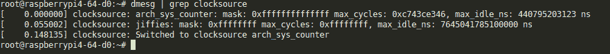
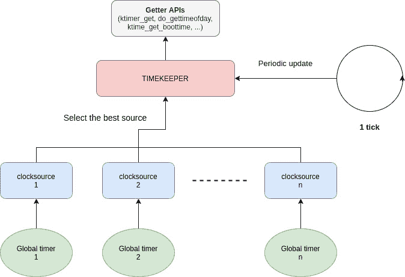
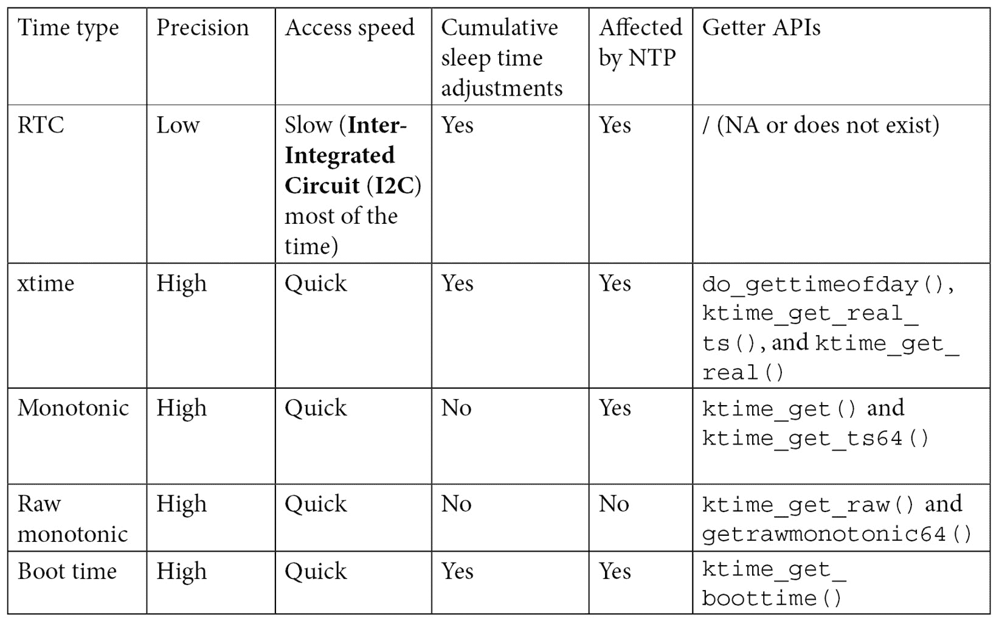
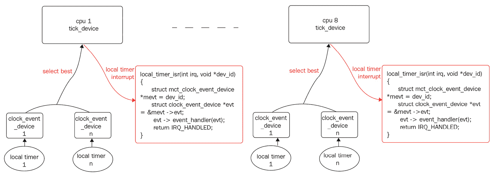

# 第三章：*第三章*：处理内核核心助手

Linux 内核是一个独立的软件——正如本章所述——它不依赖任何外部库，而是实现了它所需的所有功能（从列表管理到压缩算法，所有内容都从零开始实现）。它实现了现代库中可能遇到的所有机制，甚至更多，例如压缩、字符串函数等。我们将一步一步地探讨这些功能的最重要方面。

在这一章中，我们将涵盖以下主题：

+   Linux 内核锁机制和共享资源

+   处理内核等待、休眠和延迟机制

+   理解 Linux 内核时间管理

+   实现工作延迟机制

+   内核中断处理

# Linux 内核锁机制和共享资源

当多个竞争者可以访问一个资源时（无论是否排他性），这个资源就被视为共享资源。当资源是排他性时，访问必须同步，以确保只有被允许的竞争者能够拥有该资源。这些资源可能是内存位置或外部设备，而竞争者可能是处理器、进程或线程。操作系统通过原子修改一个存储资源当前状态的变量来实现互斥，使得所有可能同时访问该变量的竞争者都能看到这种变化。原子性保证了修改要么完全成功，要么完全失败。现代操作系统通常依赖硬件（它应支持原子操作）来实现同步，尽管一个简单的系统也可以通过禁用中断（避免调度）来确保临界代码段的原子性。

我们可以列举出两种同步机制，如下所示：

+   **锁**：用于互斥。当一个竞争者持有锁时，其他竞争者不能持有该锁（其他人被排除在外）。内核中最常见的锁是自旋锁和互斥锁。

+   **条件变量**：用于等待某个变化。内核中对此的实现方式不同，稍后我们将看到。

在谈到锁机制时，硬件通过原子操作提供这种同步功能，内核利用这些原子操作来实现锁设施。同步原语是用来协调对共享资源访问的数据结构。因为只有一个竞争者可以持有锁（从而访问共享资源），所以它可以对与锁相关的资源执行任意操作，这对其他竞争者而言是原子的。

除了处理给定共享资源的独占所有权外，还有一些情况更适合等待资源状态的变化——例如，等待一个列表包含至少一个对象（其状态从空变为非空），或者等待任务完成（例如，**直接内存访问**（**DMA**）事务）。Linux 内核没有实现条件变量。在用户空间，我们可以考虑为这两种情况使用条件变量，但为了实现相同或更好的效果，内核提供了以下机制：

+   **等待队列**：等待状态变化——旨在与锁一起工作

+   **完成队列**：等待给定计算的完成，主要与 DMA 一起使用

所有上述机制都由 Linux 内核支持，并通过一组简化的**应用程序编程接口**（**API**）暴露给驱动程序（这大大简化了开发人员的使用），我们将在接下来的章节中讨论这些内容。

## 自旋锁

自旋锁是一种基于硬件的锁定原语，它依赖硬件能力提供原子操作（例如 `test_and_set`，在非原子实现中会导致读取、修改和写入操作）。它是最简单的基础锁定原语，按以下场景描述的方式工作。

当*CPUB*正在运行，并且任务 *B* 想要获取自旋锁（任务 *B* 调用自旋锁的锁定函数），而该自旋锁已经被另一个 `while` 循环占用（因此阻塞任务 *B*），直到另一个 CPU 释放锁（任务 *A* 调用自旋锁的释放函数）。这种自旋只会发生在多核机器上（因此前面描述的用例涉及多个 CPU），因为在单核机器上不会发生（任务要么持有自旋锁并继续执行，要么一直不运行直到锁被释放）。自旋锁被认为是由 CPU 持有的锁，与互斥锁（我们将在本章的下一节讨论）不同，互斥锁是由任务持有的锁。

自旋锁通过禁用本地 CPU 上的调度程序来工作（即运行调用自旋锁锁定 API 的任务的 CPU）。这也意味着，当前在该 CPU 上运行的任务不能被抢占，除非通过**中断请求**（**IRQ**），前提是它们在本地 CPU 上没有被禁用（稍后会详细讨论）。换句话说，自旋锁保护的是每次只能被一个 CPU 获取/访问的资源。这使得自旋锁适用于**对称多处理**（**SMP**）安全性和执行原子任务。

注意

自旋锁不仅利用硬件原子操作功能。在 Linux 内核中，例如，抢占状态取决于每个 CPU 的一个变量，如果该变量等于`0`，则表示抢占已启用；如果大于 0，则表示抢占已禁用（`schedule()` 变得无效）。因此，禁用抢占（`preempt_disable()`）是通过将当前每个 CPU 变量（实际上是 `preempt_count`）加 1 来实现的，而 `preempt_enable()` 则从该变量中减去 `1`，检查新值是否为 `0`，并调用 `schedule()`。这些加减操作是原子的，因此依赖于 CPU 能提供原子加减功能。

自旋锁可以通过静态方式使用 `DEFINE_SPINLOCK` 宏创建，如此处所示，或者通过在未初始化的自旋锁上调用 `spin_lock_init()` 以动态方式创建：

```
static DEFINE_SPINLOCK(my_spinlock);
```

要了解这个是如何工作的，我们必须查看`include/linux/spinlock_types.h`中这个宏的定义，如下所示：

```
#define DEFINE_SPINLOCK(x) spinlock_t x = \
                                 __SPIN_LOCK_UNLOCKED(x)
```

这可以如下使用：

```
static DEFINE_SPINLOCK(foo_lock);
```

之后，可以通过自旋锁的名称 `foo_lock` 来访问它，其地址为 `&foo_lock`。

然而，对于动态（运行时）分配，最好将自旋锁嵌入到一个更大的结构中，为该结构分配内存，然后在自旋锁元素上调用 `spin_lock_init()`，如下代码片段所示：

```
struct bigger_struct {
    spinlock_t lock;
    unsigned int foo;
    [...]
};
static struct bigger_struct *fake_init_function()
{
    struct bigger_struct *bs;
    bs = kmalloc(sizeof(struct bigger_struct), GFP_KERNEL);
    if (!bs)
        return -ENOMEM;
    spin_lock_init(&bs->lock);
    return bs;
}
```

尽可能使用 `DEFINE_SPINLOCK` 是更好的选择。它提供了编译时初始化，并且需要更少的代码行，且没有实际的缺点。在这一步中，我们可以使用 `spin_lock()` 和 `spin_unlock()` 内联函数来锁定/解锁自旋锁，这些函数都定义在 `include/linux/spinlock.h` 中，如下所示：

```
static __always_inline void spin_unlock(spinlock_t *lock)
static __always_inline void spin_lock(spinlock_t *lock)
```

尽管如此，以这种方式使用自旋锁是有已知的限制的。虽然自旋锁可以防止本地 CPU 上的抢占，但它并不能防止 CPU 被中断占用（从而执行中断处理程序）。假设有这样一种情况，CPU 代表任务 A 持有一个“自旋锁”以保护某个资源，并且发生了一个中断。CPU 会停止当前的任务并跳转到该中断处理程序。到此为止，情况良好。现在，假设这个 IRQ 处理程序需要获取同一个自旋锁（你可能已经猜到，资源与中断处理程序是共享的）。它会无限期地自旋，试图获取一个已经被任务所锁住的锁，这个任务正是它被抢占的任务。这种情况肯定会导致死锁。

为了解决这个问题，Linux 内核为自旋锁提供了 `_irq` 变体函数，这些函数除了禁用/启用抢占外，还禁用/启用本地 CPU 上的中断。这些函数是 `spin_lock_irq()` 和 `spin_unlock_irq()`，定义如下：

```
static void spin_unlock_irq(spinlock_t *lock)
static void spin_lock_irq(spinlock_t *lock)
```

我们可能认为这个解决方案足够了，但实际上并非如此。`_irq` 变种部分解决了这个问题。假设在代码开始加锁之前，处理器上的中断已经被禁用；当你调用 `spin_unlock_irq()` 时，不仅会释放锁，还会启用中断，但这可能是错误的，因为 `spin_unlock_irq()` 无法知道在加锁之前哪些中断是被启用的，哪些没有。

让我们考虑以下示例：

+   假设在获取自旋锁之前，`x` 和 `y` 中断已经被禁用，而 `z` 并没有被禁用。

+   `spin_lock_irq()` 会禁用中断（此时 `x`、`y` 和 `z` 都被禁用）并获取锁。

+   `spin_unlock_irq()` 将会启用中断。此时，`x`、`y` 和 `z` 都被启用了，而在获取锁之前并非如此。问题就在这里。

这使得在 IRQ 上下文外调用 `spin_lock_irq()` 时变得不安全，因为它的对应函数 `spin_unlock_irq()` 会愚蠢地启用中断，存在启用那些在 `spin_lock_irq()` 调用时未启用的中断的风险。因此，只有在你确认中断已经启用时，才应该使用 `spin_lock_irq()`——也就是说，你确定没有其他操作禁用了本地 CPU 上的中断。

现在，假设你在获取锁之前将中断状态保存在一个变量中，并在释放锁时精确地恢复它们，那么就不会再有任何问题。为了实现这一点，内核提供了 `_irqsave` 变种函数，它们的行为与 `_irq` 函数完全相同，此外还具备保存和恢复中断状态的功能。它们是 `spin_lock_irqsave()` 和 `spin_lock_irqrestore()`，定义如下：

```
spin_lock_irqsave(spinlock_t *lock, unsigned long flags)
spin_unlock_irqrestore(spinlock_t *lock, unsigned long flags)
```

注意

`spin_lock()` 及其所有变种会自动调用 `preempt_disable()`，禁用本地 CPU 上的抢占，而 `spin_unlock()` 及其变种会调用 `preempt_enable()`，尝试启用抢占（是的—是尝试！！！这取决于是否有其他自旋锁被锁定，这将影响抢占计数器的值），并且在启用时会内部调用 `schedule()`（具体取决于当前计数器的值，当前值应该是 `0`）。因此，`spin_unlock()` 是一个抢占点，可能会重新启用抢占。

### 禁用抢占与禁用中断

尽管禁用中断可能会防止内核的抢占（调度器滴答禁用），但没有什么能阻止受保护的代码段调用调度器（`schedule()`函数）。许多内核函数间接调用调度器，例如那些处理自旋锁的函数。因此，即使是一个简单的`printk()`函数也可能调用调度器，因为它处理保护内核消息缓冲区的自旋锁。内核通过增加或减少一个名为`preempt_count`的内核全局变量和每个 CPU 的变量（默认为`0`，表示*启用*）来禁用或启用调度器（从而禁用或启用抢占）。当该变量大于`0`时（通过`schedule()`函数检查），调度器会直接返回并不执行任何操作。每次调用`spin_lock*`系列函数时，该变量会递增。另一方面，释放自旋锁（任何`spin_unlock*`系列函数）时，它会从`1`递减，并且当它的值达到`0`时，调度器会被调用，这意味着你的临界区并非完全原子化。

因此，仅禁用中断能保护你免受内核抢占，仅在受保护的代码段没有触发抢占时有效。也就是说，锁定自旋锁的代码可能无法休眠，因为无法唤醒它（记住——本地 CPU 上的定时器中断和/或调度器是禁用的）。

## 互斥锁

互斥锁是我们本章讨论的第二种也是最后一种锁定原语。它的行为完全像自旋锁，唯一的区别是你的代码可以休眠。如果你尝试锁定一个已被另一个任务持有的互斥锁，你的任务将被挂起，并且只有在互斥锁被释放时才会被唤醒。这次没有自旋，也就是说在你的任务处于休眠状态时，CPU 可以做其他事情。正如我之前提到的，自旋锁是由 CPU 持有的锁。而互斥锁，则是由任务持有的锁。

**互斥锁（mutex）**是一个简单的数据结构，包含一个等待队列（用于将竞争者置于休眠状态）和一个自旋锁，用于保护对该等待队列的访问，具体如下代码片段所示：

```
struct mutex {
    atomic_long_t owner;
    spinlock_t wait_lock;
#ifdef CONFIG_MUTEX_SPIN_ON_OWNER
    struct optimistic_spin_queue osq; /* Spinner MCS lock */
#endif
    struct list_head wait_list;
[...]
};
```

在前面的代码片段中，为了提高可读性，已移除仅在调试模式下使用的元素。不过，正如我们所见，互斥锁是建立在自旋锁之上的。`owner`表示持有（拥有）锁的进程。`wait_list`是互斥锁的竞争者被置于休眠状态的队列。`wait_lock`是保护`wait_list`操作（移除或插入竞争者）自旋锁。它有助于在 SMP 系统上保持`wait_list`的一致性。

互斥锁的 API 可以在`include/linux/mutex.h`头文件中找到。在获取和释放互斥锁之前，必须对其进行初始化。与其他内核核心数据结构一样，互斥锁有一个静态初始化，如下所示：

```
static DEFINE_MUTEX(my_mutex);
```

下面是`DEFINE_MUTEX()`宏的定义：

```
#define DEFINE_MUTEX(mutexname) \
struct mutex mutexname = __MUTEX_INITIALIZER(mutexname)
```

内核提供的第二种方法是动态初始化，得益于调用`__mutex_init()`低级函数，实际上它被一个更用户友好的宏`mutex_init()`包装。你可以在以下代码片段中看到它的应用：

```
struct fake_data {
    struct i2c_client *client;
    u16 reg_conf;
    struct mutex mutex;
};
static int fake_probe(struct i2c_client *client)
{
[...]
    mutex_init(&data->mutex);
[...]
}
```

获取（即锁定）互斥锁就像调用以下三个函数中的一个一样简单：

```
void mutex_lock(struct mutex *lock);
int mutex_lock_interruptible(struct mutex *lock);
int mutex_lock_killable(struct mutex *lock);
```

如果互斥锁是空闲的（未锁定），你的任务将立即获取它，而无需进入睡眠状态。否则，任务将进入睡眠状态，具体取决于你使用的锁定函数。使用`mutex_lock()`时，任务将进入不可中断的睡眠状态（`TASK_UNINTERRUPTIBLE`），等待互斥锁被释放（如果它被另一个任务持有）。`mutex_lock_interruptible()`会将任务放入可中断的睡眠状态，在这种状态下，任何信号都可以打断睡眠。`mutex_lock_killable()`则只允许通过实际杀死任务的信号来打断睡眠。每个函数在成功获取锁时返回`0`。此外，可中断的变种会在锁定尝试被信号中断时返回`-EINTR`。

无论使用哪种锁定函数，互斥锁的拥有者（并且只有拥有者）应使用`mutex_unlock()`来释放互斥锁，定义如下：

```
void mutex_unlock(struct mutex *lock);
```

如果需要检查互斥锁的状态，可以使用`mutex_is_locked()`，如下所示：

```
static bool mutex_is_locked(struct mutex *lock)
```

该函数仅检查互斥锁的拥有者是否为`NULL`，如果是，则返回`true`，否则返回`false`。

注意

推荐仅在能够保证互斥锁不会被持有很长时间时使用`mutex_lock()`。否则，应使用可中断的变种。

使用互斥锁时有一些特定的规则。最重要的规则列在`include/linux/mutex.h`内核互斥锁 API 头文件中，其中一些规则在这里进行了概述：

+   互斥锁一次只能由一个任务持有。

+   一旦被持有，互斥锁只能由拥有者解锁（即锁定它的任务）。

+   不允许多次、递归或嵌套的锁/解锁操作。

+   互斥锁对象必须通过 API 进行初始化。它不能通过复制或使用`memset`进行初始化，就像持有的互斥锁不能重新初始化一样。

+   持有互斥锁的任务不能退出，就像持有锁的内存区域必须不被释放一样。

+   互斥锁不能在硬件或软件中断上下文中使用，例如任务块和定时器。

所有这些使得互斥锁适用于以下情况：

+   仅在用户上下文中进行锁定

+   如果受保护的资源不是从 IRQ 处理程序访问的，并且操作不需要原子性

然而，对于非常小的关键部分来说，使用自旋锁可能更加节省（在 CPU 周期方面），因为自旋锁仅挂起调度程序并开始自旋，而使用互斥锁的成本则要高得多，因为它需要挂起当前任务并将其插入互斥锁的等待队列，需要调度程序切换到另一个任务，并在互斥锁释放后重新安排休眠任务。

## 尝试锁定方法

有些情况下，我们可能只需要在其他地方没有其他竞争者持有锁时才获取锁。这样的方法试图获取锁，并立即（如果我们使用自旋锁则不会自旋，如果使用互斥锁则不会休眠）返回状态值，显示锁是否已成功锁定。

自旋锁和互斥锁 API 都提供了尝试锁定的方法。它们分别是 `spin_trylock()` 和 `mutex_trylock()`，您可以在此处看到后者的示例。这两种方法在失败时（锁已被锁定）返回 `0`，成功时返回 `1`。因此，结合 `if` 语句使用这些函数是有意义的：

```
int mutex_trylock(struct mutex *lock)
```

`spin_trylock()` 实际上针对自旋锁。如果自旋锁尚未被锁定，它将锁定自旋锁，就像 `spin_lock()` 方法一样。然而，在自旋锁已被锁定的情况下，它会立即返回 `0` 而不进行自旋。您可以在这里看到它的作用：

```
static DEFINE_SPINLOCK(foo_lock);
[...]
static void foo(void)
{
    [...]
    if (!spin_trylock(&foo_lock)) {
        /* Failure! the spinlock is already locked */
        [...]
        return;
    }
    /*
    * reaching this part of the code means that the
    * spinlock has been successfully locked
    */
    [...]
    spin_unlock(&foo_lock);
    [...]
}
```

另一方面，`mutex_trylock()` 针对互斥锁。如果互斥锁尚未被锁定，它将锁定互斥锁，就像 `mutex_lock()` 方法一样。然而，在互斥锁已被锁定的情况下，它会立即返回 `0` 而不休眠。您可以在以下代码片段中看到其示例：

```
static DEFINE_MUTEX(bar_mutex);
[...]
static void bar (void)
{
    [...]
    if (!mutex_trylock(&bar_mutex)){
        /* Failure! the mutex is already locked */
        [...]
        return;
    }
    /*
     * reaching this part of the code means that the
     * mutex has been successfully acquired
     */
    [...]
    mutex_unlock(&bar_mutex);
    [...]
}
```

在上述摘录中，`mutex_trylock()` 与 `if` 语句一起使用，以便驱动程序可以调整其行为。

现在我们已经完成了尝试锁定的变体，让我们转向一个完全不同的概念——学习如何显式延迟执行。

# 处理内核等待、休眠和延迟机制

本节中的*睡眠*一词指的是一种机制，任务（代表正在运行的内核代码）自愿释放处理器，可能会调度另一个任务。简单的睡眠是指任务进入睡眠状态，并在给定时间后被唤醒（例如，主动延迟操作），但也有基于外部事件（如数据可用性）的睡眠机制。简单睡眠通过内核中的专用 API 实现；从这种睡眠中醒来是隐式的（由内核自己处理），在持续时间到期后进行。另一种睡眠机制是基于事件的，唤醒过程是显式的（另一个任务必须基于条件显式唤醒我们，否则我们将永远处于睡眠状态），除非指定了睡眠超时。该机制在内核中通过等待队列的概念实现。也就是说，睡眠 API 和等待队列都实现了我们可以称之为被动等待的功能。两者的区别在于唤醒过程的实现方式。

## 等待队列

内核调度器管理一个待执行任务的列表（处于`TASK_RUNNING`状态的任务），称为运行队列。另一方面，处于睡眠状态的任务，无论是可中断的还是不可中断的（处于`TASK_INTERRUPTIBLE`或`TASK_UNINTERRUPTIBLE`状态），都有自己的队列，称为等待队列。

等待队列是一个更高级的机制，主要用于处理阻塞`true`，等待某个事件发生，或感知数据或资源的可用性。为了理解它们是如何工作的，我们可以查看以下`include/linux/wait.h`中的结构：

```
struct wait_queue_head {
    spinlock_t lock;
    struct list_head head;
};
```

等待队列就是一个列表（其中包含等待唤醒的睡眠进程）和一个自旋锁，用于保护对该列表的访问。当多个进程希望在等待一个或多个事件发生以便被唤醒时，可以使用等待队列。头成员实际上是一个等待事件发生的进程列表。每个希望在等待事件发生时进入睡眠的进程都会在睡眠前将自己加入该列表。进程在列表中时，称为等待队列条目。当事件发生时，列表中的一个或多个进程被唤醒并从列表中移除。

我们可以通过两种方式声明和初始化一个等待队列。第一种方法是静态使用`DECLARE_WAIT_QUEUE_HEAD`，如下所示：

```
DECLARE_WAIT_QUEUE_HEAD(my_event);
```

另外，我们也可以动态使用`init_waitqueue_head()`，如下所示：

```
wait_queue_head_t my_event;
init_waitqueue_head(&my_event);
```

任何希望在等待`my_event`发生时睡眠的进程，都可以调用`wait_event_interruptible()`或`wait_event()`。大多数情况下，事件只是资源变得可用，因此进程只有在首次检查到资源可用性之后，才会进入睡眠状态。为了简化操作，这些函数都接受一个表达式作为第二个参数，使得进程只有在该表达式评估为`false`时才会进入睡眠状态，如下方代码片段所示：

```
wait_event(&my_event, (event_occured == 1));
/* or */
wait_event_interruptible(&my_event, (event_occured == 1));
```

`wait_event()`或`wait_event_interruptible()`在调用时仅评估条件。如果条件为`false`，则进程会进入`TASK_UNINTERRUPTIBLE`或`TASK_INTERRUPTIBLE`（对于`_interruptible`变种）状态，并从运行队列中移除。

注意

`wait_event()`将进程置于独占等待状态，也就是不可中断的睡眠，因此不能被信号中断。它应仅用于关键任务。在大多数情况下，建议使用可中断函数。

在某些情况下，你可能不仅需要条件为`true`，还需要在特定的等待时间后超时。你可以使用`wait_event_timeout()`来处理这种情况，其原型如下所示：

```
wait_event_timeout(wq_head, condition, timeout)
```

这个函数有两种行为，取决于是否已超时。这些行为在此列出：

+   `0`表示条件评估为`false`，`1`表示条件评估为`true`。

+   `true`。

超时的时间单位是 jiffy。有一些便捷的 API 可以将常用的时间单位（如毫秒和微秒）转换为 jiffy，定义如下：

```
unsigned long msecs_to_jiffies(const unsigned int m)
unsigned long usecs_to_jiffies(const unsigned int u)
```

在任何可能影响等待条件结果的变量变化后，你必须调用相应的`wake_up*`系列函数。也就是说，为了唤醒一个在等待队列中休眠的进程，你应该调用`wake_up()`、`wake_up_all()`、`wake_up_interruptible()`或`wake_up_interruptible_all()`。每当你调用这些函数时，条件会重新评估。如果此时条件为`true`，那么在等待队列中的进程（或对于`_all()`变种，所有进程）将被唤醒，其状态被设置为`TASK_RUNNING`；否则（如果条件为`false`），则没有任何事情发生。以下代码片段阐明了这一概念：

```
wake_up(&my_event);
wake_up_all(&my_event);
wake_up_interruptible(&my_event);
wake_up_interruptible_all(&my_event);
```

在前面的代码片段中，`wake_up()`将仅唤醒等待队列中的一个进程，而`wake_up_all()`将唤醒等待队列中的所有进程。另一方面，`wake_up_interruptible()`将仅唤醒在可中断睡眠状态下的一个进程，而`wake_up_interruptible_all()`将唤醒所有在可中断睡眠状态下的进程。

因为它们可能会被信号中断，你应该检查`_interruptible`变种的返回值。非零值表示你的休眠已经被某种信号中断，驱动程序应返回`ERESTARTSYS`，如下代码片段所示：

```
#include <linux/module.h>
#include <linux/init.h>
#include <linux/sched.h>
#include <linux/time.h>
#include <linux/delay.h>
#include<linux/workqueue.h>
static DECLARE_WAIT_QUEUE_HEAD(my_wq);
static int condition = 0;
/* declare a work queue*/
static struct work_struct wrk;
static void work_handler(struct work_struct *work)
{
    pr_info("Waitqueue module handler %s\n", __FUNCTION__);
    msleep(5000);
    pr_info("Wake up the sleeping module\n");
    condition = 1;
    wake_up_interruptible(&my_wq);
}
static int __init my_init(void)
{
    pr_info("Wait queue example\n");
    INIT_WORK(&wrk, work_handler);
    schedule_work(&wrk);
    pr_info("Going to sleep %s\n", __FUNCTION__);
    if (wait_event_interruptible(my_wq, condition != 0)) {
        pr_info("Our sleep has been interrupted\n");
        return -ERESTARTSYS;
    }
    pr_info("woken up by the work job\n");
    return 0;
}
void my_exit(void)
{
    pr_info("waitqueue example cleanup\n");
}
module_init(my_init)
module_exit(my_exit);
MODULE_AUTHOR("John Madieu <john.madieu@gmail.com>");
MODULE_LICENSE("GPL");
```

在前面的示例中，我们使用了`msleep()` API，稍后会进行解释。回到代码的行为——当前进程（实际上是`insmod`）将被放入等待队列休眠 5 秒，并由工作处理程序唤醒。`dmesg`输出如下所示：

```
[342081.385491] Wait queue example
[342081.385505] Going to sleep my_init
[342081.385515] Waitqueue module handler work_handler
[342086.387017] Wake up the sleeping module
[342086.387096] woken up by the work job
[342092.912033] waitqueue example cleanup
```

现在我们已经掌握了等待队列的概念，它允许我们将进程置于睡眠状态，并等待它们被唤醒，让我们学习另一种简单的休眠机制，它仅仅是无条件地延迟执行流程。

## 内核中的简单休眠

这个简单的休眠也可以称为 `#include <linux/delay>`，这将使以下函数可用：

```
usleep_range(unsigned long min, unsigned long max)
msleep(unsigned long msecs)
msleep(unsigned long msecs)
msleep_interruptible(unsigned long msecs)
```

在前面的 API 中，`msecs` 是休眠的毫秒数，`min` 和 `max` 是休眠时间的最小值和最大值（微秒）。

`usleep_range()` API 依赖于 `µsecs` 或小的 `msecs`（介于 10 微秒到 20 毫秒之间），避免了 `udelay()` 的忙等待循环。

`msleep*()` API 是基于 `jiffies`/传统定时器的。对于较长时间的毫秒级休眠（10 毫秒或更多），应使用这个 API。此 API 将当前任务设置为 `TASK_UNINTERRUPTIBLE`，而 `msleep_interruptible()` 则在调度休眠之前将当前任务设置为 `TASK_INTERRUPTIBLE`。简而言之，区别在于休眠是否可以被信号提前结束。除非你需要可中断的版本，否则推荐使用 `msleep()`。

本节中的 API 仅适用于在非原子上下文中插入延迟。

## 内核延迟或忙等待

首先，本节中的“延迟”一词可以视为忙等待，因为任务主动等待（对应 `for()` 或 `while()` 循环），消耗 CPU 资源，与休眠（被动延迟，任务在等待时处于休眠状态）形成对比。

即使是忙等待循环，驱动程序也必须包含 `#include <linux/delay>`，这也会使以下 API 可用：

```
ndelay(unsigned long nsecs)
udelay(unsigned long usecs)
mdelay(unsigned long msecs)
```

这类 API 的优势在于它们可以在原子和非原子上下文中都能使用。

`ndelay` 的精度取决于你的定时器的准确性（在嵌入式设备上，`ndelay` 的精度可能并不存在，许多非 PC 设备上可能并不具备这种精度。相反，你更可能遇到以下情况：

+   `udelay`：这个 API 基于忙等待循环。它将通过忙等待足够的循环次数来实现所需的延迟。如果你需要休眠几微秒（< ~10 微秒），应使用这个函数。即使是休眠少于 10 微秒，也推荐使用这个 API，因为在较慢的系统（某些嵌入式 SoC）上，设置 `usleep` 的 hrtimers 开销可能不值得。这样的评估显然取决于你的具体情况，但这是需要注意的。

+   `mdelay`：这是一个包装 `udelay` 的宏，用于处理传递大参数给 `udelay` 时可能发生的溢出。通常不推荐使用 `mdelay`，应该重构代码以使用 `msleep`。

在这一步，我们已经完成了 Linux 内核的休眠或延迟机制。我们应该能够设计并实现一个时间片管理的执行流程。接下来，我们可以深入了解 Linux 内核如何管理时间。

# 理解 Linux 内核的时间管理

时间是计算机系统中最常用的资源之一，仅次于内存。几乎所有操作都需要时间：定时器、休眠、调度以及许多其他任务。

Linux 内核包含软件定时器概念，以使内核函数能够在稍后的时间被调用。

## 时钟源、时钟事件和滴答设备的概念

在原始的 Linux 定时器实现中，主要硬件定时器主要用于时间 keeping。它还被编程为以 HZ 的频率定期触发中断，其对应的周期称为**滴答**（稍后将在本章的 *滴答与 HZ* 部分解释）。这些每 1/HZ 秒生成的中断（现在仍然如此）被称为 tick。在本节中，术语 *tick* 将指代以 1/HZ 周期生成的中断。

整个系统的时间管理（无论是来自内核还是用户空间）都与 jiffies 绑定，jiffies 也是内核中的一个全局变量，在每次 tick 时递增。除了递增 `jiffies` 的值（在其上实现了定时器轮），tick 处理程序还负责进程调度、统计更新和性能分析。

从内核版本 2.6.21 开始，作为第一个改进，hrt timers 实现被合并（现在通过 `CONFIG_HIGH_RES_TIMERS` 可用）。该特性是（并且仍然是）透明的，伴随着 `hrtimer` 定时器作为独立功能，其引入了一种新的数据类型 `ktime_t`，用于以纳秒为单位存储时间值。然而，旧有的（基于 tick 和低分辨率的）定时器实现仍然存在。该改进使得 `nanosleep()`、`nanosleep()` 和 `clock_nanosleep()` 成为可能，这是通过对 `nanosleep()` 和 POSIX 定时器的转换实现的。如果没有这个改进，定时器事件能够达到的最佳精度将是 1 个滴答，其持续时间取决于内核中 `HZ` 的值。

注意

也就是说，高分辨率定时器的实现是一个独立的特性。无论平台如何，都可以启用 hrtimer 定时器，但它们是否工作在高分辨率模式取决于底层硬件定时器。否则，系统将处于**低分辨率**（**低分辨率**）模式。

随着内核的演进，改进不断进行，直到通用时钟事件接口的出现，引入了时钟源、时钟事件和滴答设备的概念。这完全改变了内核中的时间管理，并对 CPU 电源管理产生了影响。

### 时钟源框架和时钟源设备

时钟源是一个单调的、原子性的、自由运行的计数器。可以将其视为一个定时器，作为一个自由运行的计数器，提供时间戳和读取单调递增的时间值。对时钟源设备执行的常见操作是读取计数器的值。

在内核中，有一个 `clocksource_list` 全局列表，用于跟踪已注册到系统的时钟源设备，按评级顺序入队。这使得 Linux 内核能够了解所有已注册的时钟源设备，并切换到具有更好评级和特性的时钟源。例如，在每次注册新的时钟源后，都会调用 `__clocksource_select()` 函数，确保始终选择最佳时钟源。时钟源通过 `clocksource_mmio_init()` 或 `clocksource_register_hz()` 注册（你可以通过 `grep` 查找这些词）。然而，时钟源设备驱动程序位于内核源代码的 `drivers/clocksource/` 中。

在正在运行的 Linux 系统上，列出已注册的时钟源设备的最直观方式是通过查看内核日志消息缓冲区中的 `clocksource` 字眼，如下所示：



图 3.1 – 系统时钟源列表

注意

在上述输出日志（来自 Pi 4）中，`jiffies` 时钟源是基于滴答粒度的，并且始终由内核以 `clocksource_jiffies` 注册在 `kernel/time/jiffies.c` 中，是有效评级值最低的时钟源（即作为最后的备用）。在 x86 平台上，这个时钟源被精细化并重命名为 `refined-jiffies`—请参阅 `arch/x86/kernel/setup.c` 中的 `register_refined_jiffies()` 函数调用。

然而，最推荐的方式（特别是在 `dmesg` 缓冲区已滚动或已清除的情况下）是通过读取 `/sys/devices/system/clocksource/clocksource0/` 中 `available_clocksource` 文件的内容来枚举当前正在运行的 Linux 系统上可用的时钟源，代码示例如下（在 Pi 4 上）：

```
root@raspberrypi4-64-d0:~# cat  /sys/devices/system/clocksource/clocksource0/available_clocksource 
arch_sys_counter 
root@raspberrypi4-64-d0:~#
```

在 i.MX6 板上，我们有以下内容：

```
root@udoo-labcsmart:~# cat  /sys/devices/system/clocksource/clocksource0/available_clocksource 
mxc_timer1 
root@udoo-labcsmart:~#
```

要检查当前使用的时钟源，可以使用以下代码：

```
root@raspberrypi4-64-d0:~# cat  /sys/devices/system/clocksource/clocksource0/current_clocksource 
arch_sys_counter
root@raspberrypi4-64-d0:~#
```

在我的 x86 机器上，我们有以下内容，显示了可用的时钟源以及当前使用的时钟源：

```
jma@labcsmart:~$ cat /sys/devices/system/clocksource/clocksource0/available_clocksource
tsc hpet acpi_pm 
jma@labcsmart:~$ cat /sys/devices/system/clocksource/clocksource0/current_clocksource 
tsc
jma@labcsmart:~$
```

要更改当前的时钟源，可以将某个可用时钟源的名称写入 `current_clocksource` 文件，如下所示：

```
jma@labcsmart:~$ echo acpi_pm >  /sys/devices/system/clocksource/clocksource0/current_clocksource 
jma@labcsmart:~$
```

更改当前时钟源时必须小心，因为内核在启动过程中选择的当前时钟源始终是最佳的。

#### Linux 内核时间管理

时钟源设备的主要目标之一是为时间管理器提供时间信息。一个系统中可以有多个时钟源，但时间管理器会选择精度最高的时钟源进行使用。时间管理器需要定期获取时钟源的值，以更新系统时间，通常在滴答处理过程中进行更新，如下图所示：



图 3.2 – Linux 内核时间管理器实现

时间管理器提供几种类型的时间：**xtime**、**单调时间**、**原始单调时间** 和 **启动时间**，这些在此处有更详细的说明：

+   **xtime**：这是墙钟时间（实时时间），表示由**实时时钟**（**RTC**）芯片提供的当前时间。

+   **单调时间**：自系统开启以来的累计时间，但不计入系统休眠时间。

+   **原始单调时间**：与单调时间含义相同，但它更加纯粹，不会受到**网络时间协议**（**NTP**）时间调整的影响。

+   **启动时间**：将系统休眠期间的时间加到单调时间上，得到系统开机后的总时间。

下表显示了不同类型的时间及其内核获取函数：



表 3.1 – Linux 内核时间管理函数

现在我们已经了解了 Linux 内核的时间管理机制和 API，可以开始学习时间管理中的另一个概念——时钟事件框架。

### 时钟事件框架和时钟事件设备

在引入时钟事件概念之前，硬件定时器的本地性并未被考虑。时钟源/事件硬件被编程为每秒周期性生成 `HZ` 个滴答（中断），每个滴答之间的间隔为一个 jiffy。随着时钟事件/源在内核中的引入，时钟中断被抽象为事件。时钟事件框架的主要功能是分发时钟中断（事件）并设置下一个触发条件。它是一个通用的下一个事件中断编程框架。

时钟事件设备是可以触发中断的设备，允许我们编程设置下一个中断（事件）将在未来何时触发。每个时钟事件设备驱动程序必须提供一个 `set_next_event` 函数（如果是基于 hrtimer 的时钟事件设备，则为 `set_next_ktime`），该函数将在使用底层时钟事件设备编程下一个中断时由框架调用。

时钟事件设备与时钟源设备是正交的。这也是它们的驱动程序通常位于与时钟源设备驱动程序相同位置（有时甚至在相同的编译单元）的原因——也就是在 `drivers/clocksource` 目录下。在大多数平台上，时钟事件和时钟源可能会使用相同的硬件和寄存器范围，但它们本质上是不同的。例如，BCM2835 系统定时器就是一个位于树莓派中使用的 BCM2835 上的内存映射外设。它具有一个以 1 **兆赫**（**MHz**）运行的 64 位自由计数器，以及四个不同的“输出比较寄存器”，可用于调度中断。在这种情况下，驱动程序通常会在同一编译单元中注册时钟源和时钟事件设备。

在运行中的 Linux 系统中，可以通过 `/sys/devices/system/clockevents/` 目录列出可用的时钟事件设备。以下是一个 Pi 4 的示例：

```
root@raspberrypi4-64-d0:~# ls /sys/devices/system/clockevents/         
broadcast    clockevent1  clockevent3  uevent
clockevent0  clockevent2  power
root@raspberrypi4-64-d0:~#
```

在一台双核 i.MX6 系统上，我们有以下内容：

```
root@udoo-labcsmart:~# ls /sys/devices/system/clockevents/
broadcast    clockevent0  clockevent1  consumers    power        suppliers    uevent
root@empair-labcsmart:~#
```

最后，在我的多核机器上，我们有以下配置：

```
jma@labcsmart:~$ ls /sys/devices/system/clockevents/
broadcast  clockevent0  clockevent1  clockevent2  clockevent3  clockevent4  clockevent5  clockevent6  clockevent7  power  uevent
jma@labcsmart:~$
```

从系统上可用的时钟事件设备的前述列表中，我们可以得出以下结论：

+   系统中有与 CPU 数量相同的时钟事件设备（允许每个 CPU 使用独立的时钟设备，从而涉及定时器本地性）。

+   总是有一个奇怪的目录，`broadcast`。我们将在接下来的章节中讨论这个特定的定时器。

要了解给定时钟事件设备的底层定时器，可以读取时钟事件目录中的 `current_device` 内容。接下来我们将通过三个不同机器的例子进行展示。

在 i.MX 6 平台上，我们有以下配置：

```
root@udoo-labcsmart:~# cat /sys/devices/system/clockevents/clockevent0/current_device 
local_timer
root@udoo-labcsmart:~# cat /sys/devices/system/clockevents/clockevent1/current_device 
local_timer
```

在 Pi 4 上，我们有以下配置：

```
root@raspberrypi4-64-d0:~# cat /sys/devices/system/clockevents/clockevent2/current_device
arch_sys_timer
root@raspberrypi4-64-d0:~# cat /sys/devices/system/clockevents/clockevent3/current_device
arch_sys_timer
```

在我的 x86 运行的机器上，我们有以下配置：

```
jma@labcsmart:~$ cat /sys/devices/system/clockevents/clockevent0/current_device
lapic-deadline
jma@labcsmart:~$ cat /sys/devices/system/clockevents/clockevent1/current_device
lapic-deadline
```

为了提高可读性，我们决定仅读取两个条目，从我们读取的内容中可以得出以下结论：

+   时钟事件设备由相同的硬件定时器支持，这与支持时钟源设备的硬件定时器不同。

+   至少需要两个硬件定时器来支持高分辨率定时器接口，一个充当时钟源角色，另一个（理想情况下是每个 CPU）支持时钟事件设备。

时钟事件设备可以被配置为在单次模式或周期模式下工作，如下所示：

+   在周期模式下，它被配置为每 1/HZ 秒生成一个滴答，并执行所有传统（低分辨率）定时器滴答所做的工作，如更新 jiffies、统计 CPU 时间等。换句话说，在周期模式下，它的使用方式与传统低分辨率定时器相同，但是在新基础设施下运行。

+   单次模式使硬件在从当前时间经过特定数量的周期后生成一个滴答。它通常用于编程下一个中断，以便在 CPU 进入空闲状态之前唤醒 CPU。

为了跟踪时钟事件设备的工作模式，引入了滴答设备的概念。这个概念将在下一节中进一步解释。

### 滴答设备

滴答设备是时钟事件设备的软件扩展，提供按规律时间间隔发生的连续滴答事件。每当注册一个新的时钟事件设备时，内核会自动创建一个滴答设备，并始终选择最合适的时钟事件设备。因此，毫无疑问，滴答设备与时钟事件设备绑定，且滴答设备由时钟事件设备支持。

滴答设备数据结构的定义如下代码片段所示：

```
struct tick_device {
    struct clock_event_device *evtdev;
    enum tick_device_mode mode;
};
```

在这个数据结构中，`evtdev` 是由滴答设备抽象出的时钟事件设备。`mode` 用于跟踪底层时钟事件的工作模式。因此，当说一个滴答设备处于周期模式时，也意味着底层的时钟事件设备被配置为以这种模式工作。以下图示说明了这一点：



图 3.3 – 时钟事件与滴答设备的关联

一个滴答设备可以是全局性的（系统范围）或局部的（每个 CPU 的滴答设备）。是否必须是全局滴答设备由框架决定，框架根据底层时钟事件设备的特性选择一个本地滴答设备。每种类型的滴答设备的描述如下：

+   每个 CPU 的滴答设备用于提供本地 CPU 功能，例如进程会计、性能分析，显然还包括 CPU 本地的周期性滴答（周期模式）和 CPU 本地的下一个事件中断（非周期模式），以及 CPU 本地的 hrtimers 管理（参见 `update_process_times()` 函数了解如何处理这些）。在定时器核心代码中，存在一个 `tick_cpu_device` 每 CPU 变量，它表示系统中每个 CPU 的滴答设备实例。

+   全局滴答设备负责提供主要运行 `do_timer()` 和 `update_wall_time()` 函数的周期性滴答。因此，第一个函数更新全局 `jiffies` 值并更新系统负载平均值，而后者更新墙时间（存储在 `xtime` 中，记录从 1970 年 1 月 1 日至今的时间差），并运行任何已过期的动态定时器（例如，运行本地进程定时器）。在定时器核心代码中，存在 `tick_do_timer_cpu` 全局变量，它保存具有全局滴答设备角色的 CPU 编号——即执行 `do_timer()` 的那个 CPU。还有另一个全局变量 `tick_next_period`，它跟踪全局滴答设备下次触发的时间。

    注意

    这也意味着 `jiffies` 变量始终由一个核心管理，但其功能管理亲和性可以随着 `tick_do_timer_cpu` 的变化而从一个核心跳到另一个核心。

从其中断例程中，底层时钟事件设备的驱动程序必须调用 `evtdev->event_handler()`，这是由框架安装的时钟设备的默认处理程序。虽然设备驱动程序对此透明，但该处理程序是由框架根据其他参数设置的，如下所示：两个内核配置选项（`CONFIG_HIGH_RES_TIMERS` 和 `CONFIG_NO_HZ`）、底层硬件定时器的分辨率，以及滴答设备是以动态模式运行还是单次模式运行。

`NO_HZ` 是启用动态滴答支持的内核选项，而 `HIGH_RES_TIMERS` 允许使用 hrtimer API。启用 hrtimers 后，基础代码仍然是基于滴答驱动的，但周期性滴答中断被 hrtimers 下的定时器所取代（在定时器软中断上下文中调用 `softirq`）。然而，hrtimers 是否能够以高分辨率模式工作，取决于底层硬件定时器是否为高分辨率。如果不是，hrtimers 将由旧的低分辨率基于滴答的定时器提供支持。

Tick 设备可以在单次模式或周期模式下运行。在周期模式下，框架通过控制结构使用每个 CPU 的 hrtimer 来模拟 ticks，这样基础代码依然是由 tick 驱动的，但周期性 tick 中断被嵌入控制结构中的 hrtimer 定时器所替代。这个控制结构是一个 `tick_sched` 结构，定义如下：

```
struct tick_sched {
    struct hrtimer               sched_timer;
    enum tick_nohz_mode          nohz_mode;
[...]
};
```

然后，声明一个每个 CPU 实例的控制结构，如下所示：

```
static DEFINE_PER_CPU(struct tick_sched, tick_cpu_sched);
```

这个每个 CPU 的实例允许每个 CPU 执行 tick 模拟，通过 `sched_timer` 元素驱动低分辨率定时器的处理，并定期重新编程为下一个低分辨率定时器过期的时间间隔。然而，这似乎显而易见，因为每个 CPU 都有自己的运行队列和就绪进程列表来管理。

`tick_sched` 元素可以由框架配置为三种不同的模式，描述如下：

+   `NOHZ_MODE_INACTIVE`：该模式表示没有动态 tick 也没有 hrtimer 支持。它是系统初始化期间的状态。在此模式下，本地每个 CPU 的 tick 设备事件处理程序是 `tick_handle_periodic()`，并且进入 `idle` 时会被 tick 定时器中断打断。

+   `NOHZ_MODE_LOWRES`：这也是 `lowres` 模式，意味着启用了低分辨率模式下的动态 tick。这意味着系统未找到高分辨率硬件定时器，因此 hrtimer 无法以高分辨率模式工作，而是以低精度模式工作，精度与低精度定时器相同（`tick_nohz_handler()`），并且进入 `idle` 状态时不会被 tick 定时器中断打断。

+   `NOHZ_MODE_HIGHRES`：这也是 `highres` 模式。在此模式下，启用了动态 tick 和 hrtimer 的“高分辨率”模式。每个 CPU 的本地 tick 设备事件处理程序是 `hrtimer_interrupt()`。在这里，hrtimer 以高精度模式工作，精度与硬件定时器相同（`tick_device`，而传统的 tick 定时器被转换为 hrtimer 的子定时器）。

核心相关的源代码位于`kernel/time/`目录中，具体实现位于`tick-*.c`文件中。这些文件包括`tick-broadcast.c`、`tick-common.c`、`tick-broadcast-hrtimer.c`、`tick-legacy.c`、`tick-oneshot.c`和`tick-sched.c`。

### 广播 tick 设备

在实现 CPU 电源管理的平台上，大多数（如果不是所有）支持时钟事件设备的硬件定时器会在某些 `CPUidle` 状态下关闭。为了保持软件定时器的功能，内核依赖于平台中始终开启的时钟事件设备（即由始终开启的定时器支持），用于在定时器过期时中继中断信号。这个始终开启的定时器在 `/sys/devices/system/clockevents/` 中被称为 `broadcast` 目录。

注意

广播 tick 设备能够通过发出 `wake_up_nohz_cpu()` 来唤醒任何 CPU，专门用于此目的。

要查看支持广播设备的底层定时器，可以读取其目录中的 `current_device` 变量。

在 x86 平台上，我们得到以下输出：

```
jma@labcsmart:~$ cat /sys/devices/system/clockevents/broadcast/current_device
hpet
```

Pi 4 的输出如下：

```
root@raspberrypi4-64-d0:~# cat /sys/devices/system/clockevents/broadcast/current_device
bc_hrtimer
```

最后，i.MX 6 的广播设备由以下定时器支持：

```
root@udoo-labcsmart:~# cat /sys/devices/system/clockevents/broadcast/current_device 
mxc_timer1
```

从前面的输出可以看出，支持广播设备的定时器不同于时钟源、时钟事件和广播设备的定时器。

是否可以将滴答设备用作广播设备，由`tick_install_broadcast_device()`核心函数决定，该函数在每次滴答设备注册时调用。此函数会排除带有`CLOCK_EVT_FEAT_C3STOP`标志的滴答设备（意味着底层时钟事件设备的定时器在`C3`空闲状态下停止），并依赖其他标准（例如支持单次模式——即设置了`CLOCK_EVT_FEAT_ONESHOT`标志）。最后，`kernel/time/tick-broadcast.c`中定义的`tick_broadcast_device`全局变量包含作为广播设备的滴答设备。当选择滴答设备作为广播设备时，其下一个事件处理程序将设置为`tick_handle_periodic_broadcast()`，而不是`tick_handle_periodic()`。

然而，一些平台实现了 CPU 核心门控，但没有始终开启的硬件定时器。对于这样的平台，内核提供了一个基于内核 hrtimer 的时钟事件设备，该设备在启动时无条件注册（并可以选择作为滴答广播设备），其评分值最低，以便系统中任何支持广播的硬件时钟事件设备都会优先选择，而不是滴答广播设备。

这个基于 hrtimer 的时钟事件设备依赖于一个动态选择的 CPU（以便如果有一个 CPU 即将进入深度睡眠状态，且其唤醒时间早于 hrtimer 到期时间，则该 CPU 成为新的广播 CPU）始终保持供电。然后，这个 CPU 将通过其硬件本地定时器设备将定时器中断传递给处于深度空闲状态的其他 CPU。它实现于`kernel/time/tick-broadcast-hrtimer.c`，注册为`ce_broadcast_hrtimer`，其`name`字段设置为`bc_hrtimer`。例如，如你所见，它是 Pi 4 平台使用的广播滴答设备。

注意

不言而喻，保持一个始终开启的 CPU 对电源管理平台功能有影响，并使得`CPUidle`子优化，因为内核至少会让一个 CPU 始终处于浅空闲状态以传递定时器中断。这是在 CPU 电源管理和高分辨率定时器接口之间的折衷，至少它让内核保持一个具有某些工作电源管理功能的系统。

### 理解`sched_clock`函数

`sched_clock()`是一个内核时间跟踪和时间戳功能，它返回系统启动以来的纳秒数。它在`kernel/sched/clock.c`中被弱定义（以允许架构或平台代码重写），如下所示：

```
unsigned long long __weak sched_clock(void)
```

例如，它是提供时间戳给`printk()`的功能，或者在使用`ktime_get_boottime()`或相关内核 API 时被调用。默认情况下，它采用基于跳跃（jiffy）实现的方式（这可能影响调度的准确性）。如果被重写，新的实现必须返回一个 64 位的单调时间戳，单位为纳秒，表示自上次重启以来的纳秒数。大多数平台通过直接读取计时器寄存器来实现这一点。在缺乏计时器的的平台上，这一功能是通过与主时钟源设备相同的计时器来实现的。例如，在 Raspberry Pi 上就是这种情况。当出现这种情况时，读取主时钟源设备值的寄存器和读取`_sched_clock()`值的寄存器是相同的：参见 `drivers/clocksource/bcm2835_timer.c`。

驱动`_sched_clock()`的计时器必须比时钟源计时器更快。如其名称所示，它主要供调度器使用，这意味着它被调用的频率远高于其他计时器。如果必须在与时钟源的准确性之间做出权衡，可能会在`_sched_clock()`中牺牲准确性以提高速度。

当`_sched_clock()`没有被直接重写时，内核时间核心提供了一个 `sched_clock_register()` 助手函数，用来提供一个平台相关的计时器读取函数以及一个评级值。无论如何，这个计时器读取函数最终会出现在`cd`内核时间框架变量中，该变量的类型为 `struct clock_data`（假设新的底层计时器的速率大于当前函数所驱动的计时器的速率）。

### 动态滴答/无滴答内核

动态滴答是迁移到高分辨率计时器接口的逻辑结果。在引入动态滴答之前，周期性滴答会定期发出中断（每秒 `HZ` 次）来驱动操作系统。即使没有任务或计时器处理程序需要运行，这也会让系统保持唤醒状态。使用这种方法时，CPU 无法进行长时间休息，必须在没有实际目的的情况下唤醒。

动态滴答机制提供了解决方案，允许在某些时间间隔内停止周期性滴答以节省电力。采用这种新方法时，只有当有任务需要执行时，周期性滴答才会被重新启用；否则，它们会被禁用。

它是如何工作的？当 CPU 没有更多任务运行（即空闲任务已调度到此 CPU 上）时，只有两种事件可以在 CPU 空闲后产生新的工作：一个是内部内核计时器的到期，这是可预测的，另一个是 I/O 操作的完成。当 CPU 进入空闲状态时，计时器框架会检查下一个调度的计时器事件，如果该事件晚于下一个周期性滴答，它会将每个 CPU 的时钟事件设备重新编程为这个较晚的事件。这样可以使空闲的 CPU 进入更长时间的空闲休眠，而不被周期性滴答不必要地打断。

然而，某些系统有低功耗状态，在这些系统中，甚至每个 CPU 的时钟事件设备也会停止。在这样的平台上，是广播 tick 设备被编程为触发下一个未来事件。

在 CPU 进入此类空闲状态（`do_idle()`函数）之前，它会调用 tick 广播框架（`tick_nohz_idle_enter()`），并禁用其`tick_device`变量的周期性 tick（见`tick_nohz_idle_stop_tick()`）。然后，将该 CPU 添加到待唤醒 CPU 的列表中，方法是设置`tick_broadcast_mask`“广播映射”变量中与该 CPU 对应的位，该位图表示处于睡眠模式的处理器列表。接着，框架计算该 CPU 必须被唤醒的时间（即其下一个事件时间）；如果该时间早于当前`tick_broadcast_device`已编程的时间，则更新`tick_broadcast_device`应中断的时间，以反映新值，并将该新值编程到支持广播 tick 设备的时钟事件设备中。即将进入深度空闲状态的 CPU 的`tick_cpu_device`变量现在进入关闭模式，这意味着它不再工作。

前述过程会在每次 CPU 进入深度空闲状态时重复，`tick_broadcast_device`变量被编程为在进入深度空闲状态的 CPU 的最早唤醒时间触发。

当 tick 广播设备下一事件触发时，它会查看睡眠中的 CPU 的位掩码，寻找拥有可能已过期定时器的 CPU，并向位掩码中任何可能托管过期定时器的远程 CPU 发送 IPI。

然而，如果 CPU 因中断而离开空闲状态（架构代码调用`handle_IRQ()`，间接调用`tick_irq_enter()`），则启用该 CPU 的 tick 设备（首先以单次模式），并在执行任何任务之前，调用`tick_nohz_irq_enter()`函数，确保`jiffies`是最新的，以便中断处理程序不必处理过时的 jiffy 值，然后恢复周期性 tick，该 tick 会一直保持活动状态，直到下一次调用`tick_nohz_idle_stop_tick()`（实际上是从`do_idle()`调用的）。

## 使用标准的内核低精度（低分辨率）定时器

标准（现为遗留的，也称为低分辨率）定时器是以`jiffies`粒度运行的内核定时器。这些定时器的分辨率绑定于常规系统 tick 的分辨率，而系统 tick 的分辨率取决于内核用于控制调度和执行函数在未来某一时刻（基于 jiffies）的架构和配置（即`CONFIG_HZ`，或简单地说`HZ`）。

### Jiffies 和 HZ

一个 jiffy 是内核时间单位，其持续时间取决于`HZ`的值，`HZ`代表内核中`jiffies`变量的增量频率。每个增量事件称为一个 tick。基于`jiffies`的时钟源是最小公倍数时钟源，应该在任何系统上运行。

由于`jiffies`变量每秒增加`HZ`次，如果`HZ = 1,000`，则它每秒增加 1,000 次（即每 1/1,000 秒增加一次 tick，或者说是 1 毫秒）。大多数情况下，`HZ`默认值为`100`，而在 x86 上默认值为`250`，这将导致分辨率为 10 毫秒或 4 毫秒。

以下是两个运行系统上不同`HZ`值：

```
jma@labcsmart:~$ grep ‘CONFIG_HZ=' /boot/config-$(uname -r)
CONFIG_HZ=250
jma@labcsmart:~$
```

前面的代码已经在运行的 x86 机器上执行。在运行的 ARM 机器上，我们有如下情况：

```
root@udoo-labcsmart:~# zcat /proc/config.gz |grep CONFIG_HZ
CONFIG_HZ_100=y
root@udoo-labcsmart:~#
```

前面的代码表示当前`HZ`值为`100`。

### 内核定时器 API

在内核中，定时器表示为`struct timer_list`的一个实例，定义如下：

```
struct timer_list {
    struct hlist_node entry;
    unsigned long expires;
    void (*function)(struct timer_list *);
    u32 flags;
);
```

在前面的数据结构中，`expires`是 jiffies 中的绝对值，定义了该定时器未来何时过期。`entry`是内核用于在每个 CPU 的定时器全局列表中跟踪该定时器的字段。`flags`是按位或的位掩码，表示定时器标志，如定时器的管理方式以及回调将在哪个 CPU 上调度，`function`是当定时器过期时执行的回调函数。

你可以使用`timer_setup()`动态定义一个定时器，或者使用`DEFINE_TIMER()`静态创建一个定时器。

注意

在 Linux 内核版本 4.15 之前，`setup_timer()`用作动态版本。

以下是两个宏的定义：

```
void timer_setup( struct timer_list *timer,        \
           void (*function)( struct timer_list *), \
           unsigned int flags);
#define DEFINE_TIMER(_name, _function) [...]
```

在定时器初始化之后，必须设置其过期延迟，然后才能使用以下 API 之一启动定时器：

```
int mod_timer(struct timer_list *timer,
               unsigned long expires);
void add_timer(struct timer_list *timer)
```

`mod_timer()`函数用于设置初始过期延迟或更新活动定时器的值，这意味着在非活动定时器上调用此函数将激活该定时器。

注意

启动定时器意味着准备并排队此定时器。也就是说，当定时器只是准备好、排队并倒计时，等待过期后运行回调函数时，它被称为挂起。

你应该更倾向于使用这个函数，而不是`add_timer()`，后者是专门用于启动非活动定时器的函数。在调用`add_timer()`之前，必须设置定时器的过期延迟和回调函数，如下所示：

```
my_timer.expires = jiffies + ((12 * HZ) / 10); /* 1.2s */
add_timer(&my_timer);
```

`mod_timer()`返回的值取决于定时器在调用之前的状态。在非活动定时器上调用`mod_timer()`时，成功返回`0`，而在挂起定时器或回调函数正在执行的定时器上成功调用时，返回`1`。这意味着从定时器回调中执行`mod_timer()`是完全安全的。当在活动定时器上调用时，它等同于`del_timer(timer); timer->expires = expires; add_timer(timer);`。

完成计时器的使用后，可以通过以下函数之一将其释放或取消：

```
int del_timer(struct timer_list *timer);
int del_timer_sync(struct timer_list *timer);
```

`del_timer()`从计时器管理队列中移除（出队）`timer`对象。如果成功，它会返回一个不同的值，具体取决于它是在非活动计时器上调用还是在活动计时器上调用。在第一种情况下，它返回`0`，而在第二种情况下，即使该计时器的回调函数正在执行，它也会返回`1`。

让我们考虑以下执行流程，其中一个计时器在一个 CPU 上被删除，而其回调在另一个 CPU 上执行：

```
mainline (CPUx)                  handler(CPUy)
==============                   =============
                                 enter xxx_timer()
del_timer()
kfree(some_resource)
                                 access(some_resource)
```

在前面的代码片段中，使用`del_timer()`并不能保证回调函数不再运行。这里有另一个例子：

```
mainline (CPUx)            handler(CPUy)
==============             =============
                           enter xxx_timer()
 del_timer()
 kfree(timer)
                           mod_timer(timer)
```

当`del_timer()`返回时，它仅保证计时器已被停用并从队列中移除，确保它未来不会被执行。然而，在多处理器机器上，计时器函数可能已经在另一个处理器上执行。在这种情况下，应该使用`del_timer_sync()`，它将停用计时器并等待任何正在执行的处理程序退出后再返回。此函数会检查每个处理器，确保给定的计时器没有在其他地方运行。通过在前述竞态条件示例中使用`del_timer_sync()`，可以在不担心资源是否在回调中使用的情况下调用`kfree()`。您应该几乎总是使用`del_timer_sync()`，而不是`del_timer()`。驱动程序不能持有锁，阻止处理程序完成；否则会导致死锁。这使得`del_timer()`在上下文上是不可知的，因为它是异步的，而`del_timer_sync()`仅应在非原子上下文中使用。

此外，为了确保正确性，我们可以使用以下 API 独立检查计时器是否待处理：

```
int timer_pending(const struct timer_list *timer);
```

这个函数检查该计时器是否已经启动并待处理。

以下代码片段展示了标准内核计时器的基本用法：

```
#include <linux/init.h>
#include <linux/kernel.h>
#include <linux/module.h>
#include <linux/timer.h>
static struct timer_list my_timer;
void my_timer_callback(struct timer_list *t)
{
    pr_info("Timer callback&; called\n");
}

static int __init my_init(void)
{
    int retval;
    pr_info("Timer module loaded\n");
    timer_setup(&my_timer, my_timer_callback, 0);
    pr_info("Setup timer to fire in 500ms (%ld)\n",
              jiffies);
    retval = mod_timer(&my_timer,
                        jiffies + msecs_to_jiffies(500));
    if (retval)
        pr_info("Timer firing failed\n");

    return 0;
}

static void my_exit(void)
{
    int retval;
    retval = del_timer(&my_timer);
    /* Is timer still active (1) or no (0) */
    if (retval)
        pr_info("The timer is still in use...\n");
    pr_info("Timer module unloaded\n");
}
module_init(my_init);
module_exit(my_exit);
MODULE_AUTHOR("John Madieu <john.madieu@gmail.com>");
MODULE_DESCRIPTION("Standard timer example");
MODULE_LICENSE("GPL");
```

在前面的示例中，我们演示了标准计时器的基本用法。我们请求 500 毫秒的超时。也就是说，这种计时器的时间单位是滴答。所以，要以人类易读的格式（秒或毫秒）传递超时值，必须使用转换辅助函数。这里列出了一些：

```
unsigned long msecs_to_jiffies(const unsigned int m)
unsigned long usecs_to_jiffies(const unsigned int u)
unsigned long timespec64_to_jiffies(
                  const struct timespec64 *value);
```

使用前述的辅助函数，您不应期望有比“滴答”（jiffy）更高的精度。例如，使用`usecs_to_jiffies(100)`会返回一个滴答值。返回的值会被四舍五入到最接近的滴答值。

为了将额外的参数传递给计时器回调，首选的方式是将它们作为元素嵌入到一个结构中，与计时器一起使用，并在元素上使用`from_timer()`宏来检索更大的结构，然后可以访问每个元素。这个宏定义如下：

```
#define from_timer(var, callback_timer, timer_fieldname) \
    container_of(callback_timer, typeof(*var), timer_fieldname) 
```

例如，假设我们需要向定时器回调传递两个元素，第一个元素是`struct sometype`类型，第二个元素是一个整数。为了传递参数，我们定义一个额外的结构体，如下所示：

```
struct fake_data {
    struct timer_list timer;
    struct sometype foo;
    int bar;
};
```

接下来，我们将嵌入式定时器传递给设置函数，如下所示：

```
struct fake_data *fd = alloc_init_fake_data();
timer_setup(&fd->timer, timer_callback, 0);
```

在回调函数中，你必须使用`from_timer`变量来检索较大的结构体，从中可以访问参数。下面是一个使用示例：

```
void timer_callback(struct timer_list *t)
{
    struct fake_data *fd = from_timer(fd, t, timer);
    sometype data = fd->data;
    int var = fd->bar;
[...]
}
```

在前面的代码片段中，我们描述了如何将数据传递给定时器回调以及如何使用容器结构来获取该数据。默认情况下，指向`timer_list`的指针被传递给回调函数，而不是在 4.15 之前版本中使用的`unsigned long`数据类型。

## 高分辨率定时器（hrtimers）

虽然传统的定时器实现与滴答时间相关联，但高精度定时器提供了纳秒级和与滴答时间无关的定时精度，满足了对精确时间应用或内核驱动程序的紧迫需求。该功能已在内核 v2.6.16 中引入，并可以通过在内核配置中启用`CONFIG_HIGH_RES_TIMERS`选项来启用。

虽然标准定时器接口使用`jiffies`表示时间值，但高分辨率定时器接口引入了一种新的数据类型，允许我们保存时间值：`ktime_t`，它是一个简单的 64 位标量值。

注意

在内核 3.17 之前，`ktime_t`类型在 32 位或 64 位机器上有不同的表示方式。在 64 位 CPU 上，它被表示为纯 64 位的纳秒值，就像现在内核中的所有地方一样；而在 32 位 CPU 上，它则被表示为一个由两个 32 位字段组成的数据结构（[`seconds - nanoseconds`]对）。

Hrtimer API 需要`#include <linux/hrtimer.h>`头文件。也就是说，在该头文件中，表征高分辨率定时器的结构体定义如下：

```
struct hrtimer {
    ktime_t                 _softexpires;
    enum hrtimer_restart    (*function)(struct hrtimer *);
    struct hrtimer_clock_base    *base;
    u8                     state;
[...]
};
```

数据结构中的元素已缩短到最严格的最小值，以覆盖本书的需求。接下来，我们将讨论它们的含义。

在使用 hrtimer 之前，必须先用`hrtimer_init()`进行初始化，定义如下：

```
void hrtimer_init(struct hrtimer *timer,
                  clockid_t which_clock,
                  enum hrtimer_mode mode);
```

在前面的函数中，`timer`是指向要初始化的 hrtimer 的指针。`clock_id`指示必须使用哪种类型的时钟来为该 hrtimer 提供时间。以下是一些常见的选项：

+   `CLOCK_REALTIME`：选择实时时间，即墙钟时间。如果系统时间发生变化，它可能会影响该定时器。

+   `CLOCK_MONOTONIC`：这是增量时间，不受系统变化的影响。然而，当系统进入休眠或挂起时，它会停止增加。

+   `CLOCK_BOOTTIME`：系统的运行时间。与`CLOCK_MONOTONIC`类似，区别在于它包括了睡眠时间。当系统挂起时，它仍会增加。

在前面的代码片段中，`mode`参数指示 hrtimer 应如何工作。以下是一些可能的选项：

+   `HRTIMER_MODE_ABS`：这意味着定时器在指定的绝对时间后到期。

+   `HRTIMER_MODE_REL`：该定时器将在指定的相对时间后过期。

+   `HRTIMER_MODE_PINNED`：该 hrtimer 绑定到一个 CPU 上。仅在启动 hrtimer 时才考虑此标志，以确保定时器触发并在与队列相同的 CPU 上执行回调。

+   `HRTIMER_MODE_ABS_PINNED`：这是第一和第三个标志的组合。

+   `HRTIMER_MODE_REL_PINNED`：这是第二个和第三个标志的组合。

在初始化 hrtimer 后，必须为其分配一个回调函数，当定时器过期时，该回调函数将被执行。以下代码片段显示了预期的原型：

```
enum hrtimer_restart callback(struct hrtimer *h);
```

`hrtimer_restart`是回调返回的类型。它必须是`HRTIMER_NORESTART`，表示定时器不需要重新启动（用于执行一次性操作），或者是`HRTIMER_RESTART`，表示定时器需要重新启动（用于模拟周期模式）。在第一种情况下，当返回`HRTIMER_NORESTART`时，如果需要，驱动程序必须显式地重新启动定时器（例如使用`hrtimer_start()`）。而当返回`HRTIMER_RESTART`时，定时器的重新启动是隐式的，由内核处理。然而，驱动程序在回调返回之前需要重置超时时间。为了做到这一点，驱动程序可以使用`hrtimer_forward()`，其定义如下：

```
u64 hrtimer_forward(struct hrtimer *timer,
                    ktime_t now, ktime_t interval)
```

在前面的代码片段中，`timer`是需要转发的 hrtimer，`now`是定时器必须从哪个时间点开始转发，而`interval`是定时器需要转发的未来时间。需要注意的是，这仅更新定时器的过期时间，而不会重新排队定时器。

`now`参数可以通过不同方式获取，可以使用`ktime_get()`来获取当前的单调时钟时间，或者使用`hrtimer_get_expires()`来返回定时器应该过期的时间，之后再进行转发。以下代码片段说明了这一点：

```
hrtimer_forward(hrtimer, ktime_get(), ms_to_ktime(500));
/* or */
hrtimer_forward(handle, hrtimer_get_expires(handle),
                 ns_to_ktime(450));
```

在前面示例的第一行中，hrtimer 从当前时间开始向前推移 500 毫秒，而第二行则是从定时器原本应该过期的时间点开始，向前推移 450 纳秒。示例中的第一行等同于`hrtimer_forward_now()`，它将 hrtimer 从当前时间开始推送到指定时间（从现在开始）。其声明如下：

```
u64 hrtimer_forward_now(struct hrtimer *timer,
                          ktime_t interval)
```

现在定时器已经设置并且回调函数已定义，可以使用`hrtimer_start()`启动定时器，函数原型如下：

```
int hrtimer_start(struct hrtimer *timer, ktime_t time,
                    const enum hrtimer_mode mode);
```

在前面的代码片段中，`mode`表示定时器的过期模式，可以是`HRTIMER_MODE_ABS`，表示绝对时间值，或者是`HRTIMER_MODE_REL`，表示相对于当前时间的时间值。此参数必须与初始化时的模式参数一致。`timer`参数是指向已初始化的 hrtimer 的指针。最后，`time`是 hrtimer 的过期时间。由于它是`ktime_t`类型，提供了多种辅助函数，可以从不同的时间单位生成`ktime_t`元素，具体如下：

```
ktime_t ktime_set(const s64 secs,
                  const unsigned long nsecs);
ktime_t ns_to_ktime(u64 ns);
ktime_t ms_to_ktime(u64 ms);
```

在前面的列表中，`ktime_set()` 会根据给定的秒数和纳秒数生成一个 `ktime_t` 元素。`ns_to_ktime()` 或 `ms_to_ktime()` 分别会根据给定的纳秒数或毫秒数生成一个 `ktime_t` 元素。

您也可能对返回纳秒/微秒数感兴趣，可以使用以下函数，给定一个 `ktime_t` 输入元素：

```
s64 ktime_to_ns(const ktime_t kt)
s64 ktime_to_us(const ktime_t kt)
```

此外，给定一个或两个 `ktime_t` 元素，您可以使用以下助手函数进行一些算术运算：

```
ktime_t ktime_sub(const ktime_t lhs, const ktime_t rhs);
ktime_t ktime_sub(const ktime_t lhs, const ktime_t rhs);
ktime_t ktime_add(const ktime_t add1, const ktime_t add2);
ktime_t ktime_add_ns(const ktime_t kt, u64 nsec);
```

要对 `ktime` 对象进行加减运算，可以分别使用 `ktime_sub()` 和 `ktime_add()`。`ktime_add_ns()` 会将 `ktime_t` 元素按指定的纳秒数进行递增。`ktime_add_us()` 是另一个微秒级的变体。对于减法操作，可以使用 `ktime_sub_ns()` 和 `ktime_sub_us()`。

在调用 `hrtimer_start()` 后，hrtimer 将被激活（启用）并入队到一个（按时间顺序排列的）每 CPU 桶中，等待到期。这个桶将局部于调用 `hrtimer_start()` 的 CPU，但不能保证回调会在这个 CPU 上运行（可能会发生迁移）。对于绑定到特定 CPU 的 hrtimer，您应当在初始化 hrtimer 时使用 `*_PINNED` 模式变体。

入队的 hrtimer 始终会启动。一旦定时器到期，其回调函数会被调用，取决于返回值，hrtimer 可能会重新排队，也可能不会。为了取消定时器，驱动程序可以使用 `hrtimer_cancel()` 或 `hrtimer_try_to_cancel()`，声明如下：

```
int hrtimer_cancel(struct hrtimer *timer);
int hrtimer_try_to_cancel(struct hrtimer *timer);
```

如果定时器在调用时未处于激活状态，两个函数都会返回 `0`。`hrtimer_try_to_cancel()` 如果定时器处于激活状态（正在运行但未执行回调函数）且已成功取消，将返回 `1`，如果回调函数正在执行，则返回 `-1`。另一方面，`hrtimer_cancel()` 如果回调函数尚未运行，将取消定时器；如果回调函数正在执行，将等待回调函数完成。当 `hrtimer_cancel()` 返回时，可以保证定时器已不再激活，并且其过期函数未在运行。

然而，驱动程序可以使用以下代码独立检查 hrtimer 回调是否仍在运行：

```
int hrtimer_callback_running(struct hrtimer *timer);
```

例如，`hrtimer_try_to_cancel()` 内部会调用 `hrtimer_callback_running()`，如果回调正在运行，则返回 `-1`。

让我们编写一个模块示例，将我们的 hrtimer 知识付诸实践。我们首先从编写回调函数开始，如下所示：

```
#include <linux/module.h>
#include <linux/kernel.h>
#include <linux/hrtimer.h>
#include <linux/ktime.h>
static struct hrtimer hr_timer;
static enum hrtimer_restart timer_callback(struct hrtimer *timer)
{
    pr_info("Hello from timer!\n");
#ifdef PERIODIC_MS_500
    hrtimer_forward_now(timer, ms_to_ktime(500));
    return HRTIMER_RESTART;
#else
    return HRTIMER_NORESTART;
#endif
}
```

在前面的 hrtimer 回调函数中，我们可以决定以单次模式或周期模式运行。对于周期模式，用户必须定义 `PERIODIC_MS_500`，在这种情况下，定时器将在当前 hrtimer 时钟基准时间的基础上向前推迟 500 毫秒，然后重新排队。

然后，模块的其余实现如下所示：

```
static int __init hrtimer_module_init(void)
{;
    ktime_t init_time;
    init_time = ktime_set(1, 1000);
    hrtimer_init(&hr_timer, CLOCK_MONOTONIC,
                   HRTIMER_MODE_REL);
    hr_timer.function = &timer_callback;
    hrtimer_start(&hr_timer, init_time, HRTIMER_MODE_REL);
    return 0;
}
static void __exit hrtimer_module_exit(void) {
    int ret;
    ret = hrtimer_cancel(&hr_timer);
    if (ret)
        pr_info("Our timer is still in use...\n");
     pr_info("Uninstalling hrtimer module\n");
}
module_init(hrtimer_module_init);
module_exit(hrtimer_module_exit);
```

在前面的实现中，我们生成了一个初始的`ktime_t`元素，表示 1 秒和 1000 纳秒——即 1 秒和 1 毫秒，作为初始过期时长。当 hrtimer 第一次超时时，我们的回调函数被调用。如果定义了`PERIODIC_MS_500`，则 hrtimer 会延迟 500 毫秒触发，回调会在初始调用后定期触发（每 500 毫秒触发一次）；否则，它是一次性调用。

# 实现工作延迟机制

延迟是一个将任务安排到未来执行的方式。这是一种推迟报告动作的方式。显然，内核提供了实现这种机制的设施；它允许您推迟函数（无论其类型如何）的调用，并在稍后执行。在内核中有三种这样的机制，如下所述：

+   **软中断**：在原子上下文中执行

+   **任务 let**：在原子上下文中执行

+   **工作队列**：在进程上下文中执行

在接下来的三节中，我们将详细了解它们的实现。

## 软中断

正如其名称所示，`kernel/softirq.c`位于内核源代码树中，驱动程序若希望使用此 API，需包含`<linux/interrupt.h>`。

软中断通过`struct softirq_action`结构表示，定义如下：

```
struct softirq_action {
    void (*action)(struct softirq_action *);
};
```

这个结构体嵌入了一个指针，指向当软中断被触发时要执行的函数。因此，您的软中断处理程序的原型应该如下所示：

```
void softirq_handler(struct softirq_action *h)
```

运行软中断处理程序会执行这个动作函数，它只有一个参数：指向相应`softirq_action`结构的指针。您可以通过`open_softirq()`函数在运行时注册软中断处理程序，如下所示：

```
void open_softirq(int nr,
                  void (*action)(struct softirq_action *))
```

`nr`表示软中断的索引，也被认为是软中断的优先级（其中 0 为最高优先级）。`action`是指向软中断处理程序的指针。可能的索引在以下代码片段中列出：

```
enum
{
    HI_SOFTIRQ=0,   /* High-priority tasklets */
    TIMER_SOFTIRQ,  /* Timers */
    NET_TX_SOFTIRQ, /* Send network packets */
    NET_RX_SOFTIRQ, /* Receive network packets */
    BLOCK_SOFTIRQ,  /* Block devices */
    BLOCK_IOPOLL_SOFTIRQ, /* Block devices with I/O polling
                           * blocked on other CPUs */
    TASKLET_SOFTIRQ,/* Normal Priority tasklets */
    SCHED_SOFTIRQ,  /* Scheduler */
    HRTIMER_SOFTIRQ,/* High-resolution timers */
    RCU_SOFTIRQ,    /* RCU locking */
    NR_SOFTIRQS     /* This only represent the number
                     * of softirqs type, 10 actually */
};
```

索引较低的软中断（优先级较高）会在索引较高的软中断（优先级较低）之前运行。内核中所有可用软中断的名称列在以下数组中：

```
const char * const softirq_to_name[NR_SOFTIRQS] = {
    "HI", "TIMER", "NET_TX", "NET_RX", "BLOCK", "BLOCK_IOPOLL", 
    "TASKLET", "SCHED", "HRTIMER", "RCU"
};
```

很容易在`/proc/softirqs`虚拟文件的输出中检查一些内容，如下所示：

```
root@udoo-labcsmart:~# cat /proc/softirqs
                    CPU0       CPU1       
          HI:       3535          1
       TIMER:    4211589    4748893
      NET_TX:    1277827         39
      NET_RX:    1665450          0
       BLOCK:       1978        201
    IRQ_POLL:          0          0
     TASKLET:     455761         33
       SCHED:    4212802    4750408
     HRTIMER:          3          0
         RCU:     438826     286874
root@udoo-labcsmart:~#
```

在`kernel/softirq.c`中声明了一个`NR_SOFTIRQS`条目的`struct softirq_action`数组，如下所示：

```
static struct softirq_action softirq_vec[NR_SOFTIRQS] ;
```

该数组中的每一项可能包含一个——且只能包含一个——软中断。因此，最多可以注册`NR_SOFTIRQS`个软中断（实际上，在写作时的最后一个稳定版本 v5.10 中为 10 个）。以下是`kernel/softirq.c`中的代码片段：

```
void open_softirq(int nr,
                  void (*action)(struct softirq_action *))
{
    softirq_vec[nr].action = action;
}
```

一个具体的例子是网络子系统，它注册了它需要的软中断（在`net/core/dev.c`中），如下所示：

```
open_softirq(NET_TX_SOFTIRQ, net_tx_action);
open_softirq(NET_RX_SOFTIRQ, net_rx_action);
```

在已注册的软中断执行之前，它需要被激活或调度。为此，您需要调用`raise_softirq()`或`raise_softirq_irqoff()`（如果中断已关闭），如下所示的代码片段：

```
void __raise_softirq_irqoff(unsigned int nr)
void raise_softirq_irqoff(unsigned int nr)
void raise_softirq(unsigned int nr)
```

第一个函数简单地在每 CPU 软中断位图中设置适当的位（在 `kernel/softirq.c` 中为每 CPU 分配的 `struct irq_cpustat_t` 数据结构中的 `__softirq_pending` 字段），如下所示：

```
irq_cpustat_t irq_stat[NR_CPUS] ____cacheline_aligned;
EXPORT_SYMBOL(irq_stat);
```

当检查标志时，允许其运行。此函数在此处仅用于学习目的，不应直接使用。

`raise_softirq_irqoff` 需要在禁用中断时调用。首先，它内部调用之前描述的 `__raise_softirq_irqoff()` 来激活软中断。之后，它通过 `in_interrupt()` 宏来检查是否从中断上下文（硬中断或软中断）中调用（该宏简单返回 `current_thread_info()->preempt_count` 的值，其中 0 表示启用了抢占，表明我们不在中断上下文中，大于 0 的值表示我们在中断上下文中）。如果 `in_interrupt() > 0`，则在中断上下文中不执行任何操作，因为软中断标志在任何 I/O IRQ 处理程序的退出路径上都会被检查（请参见 ARM 的 `asm_do_IRQ()` 或 x86 平台的 `do_IRQ()`，它们调用 `irq_exit()`）。在这里，软中断在中断上下文中运行。但是，如果 `in_interrupt() == 0`，它将调用 `wakeup_softirqd()`，负责唤醒本地 CPU 的 `ksoftirqd` 线程（实际上是调度它），以确保尽快但这次在进程上下文中运行软中断。

`raise_softirq`，另一方面，首先调用 `local_irq_save()`（保存当前中断标志并在本地处理器上禁用中断）。然后调用之前描述的 `raise_softirq_irqoff()`，以便在本地 CPU 上调度软中断（请记住——此函数必须在本地 CPU 上禁用 IRQ 时调用）。最后，调用 `local_irq_restore()` 以恢复先前保存的中断标志。

有关软中断的几点需要记住：

+   一个软中断永远不能抢占另一个软中断。只有硬件中断可以。软中断以高优先级执行，调度程序抢占被禁用但 IRQ 已启用。这使得软中断适合系统上最关键和重要的延迟处理。

+   当处理程序在 CPU 上运行时，此 CPU 上的其他软中断被禁用。但是，软中断可以同时运行。在一个软中断运行时，另一个软中断（甚至是相同的软中断）可以在另一个处理器上运行。这是软中断相对于硬中断的主要优势之一，也是它们在可能需要大量 CPU 力的网络子系统中使用的原因。

+   大多数情况下，在硬件中断处理程序的返回路径中调度软中断。如果在退出中断上下文时仍然挂起，它将在本地 `ksoftirqd` 线程被分配到 CPU 时在进程上下文中运行。它们的执行可能在以下情况下被触发：

    +   通过本地每 CPU 定时器中断（仅在 SMP 系统上，启用 `CONFIG_SMP`）。参见 `timer_tick()`、`update_process_times()` 和 `run_local_timers()`。

    +   通过调用`local_bh_enable()`函数（主要由网络子系统调用，用于处理接收/发送软中断）。

    +   在任何 I/O IRQ 处理程序的退出路径上（参见`do_IRQ`，它调用`irq_exit()`，进而调用`invoke_softirq()`）。

    +   当本地`ksoftirqd`线程被分配给 CPU 时（即被唤醒）。

负责遍历软中断待处理位图并执行它们的实际内核函数是`__do_softirq()`，该函数定义在`kernel/softirq.c`中。此函数总是在禁用本地 CPU 中断的情况下被调用。它完成以下任务：

+   一旦被调用，该函数首先将当前每个 CPU 的待处理软中断位图保存在名为`pending`的变量中，并通过`__local_bh_disable_ip`在本地禁用软中断。

+   然后，它重置当前每个 CPU 的待处理位图（该位图已被保存），然后重新启用中断（软中断在启用中断时运行）。

+   此后，它进入一个`while`循环，检查保存的位图中的待处理软中断。如果没有待处理的软中断，它将执行每个待处理软中断的处理程序，并小心地增加其执行统计数据。

+   在所有待处理的 IRQ 处理程序执行完毕后（即我们已经脱离了`while`循环），`__do_softirq()`再次读取每个 CPU 的待处理位图，以检查在`while`循环期间是否有新的软中断被调度。如果有待处理的软中断，整个过程将重新启动（基于`goto`循环），从*第 2 步*开始。这有助于处理例如自我重新调度的软中断。

然而，如果发生以下条件之一，`__do_softirq()`将不会重复执行：

+   它已经重复执行了最多`MAX_SOFTIRQ_RESTART`次，该值在`kernel/softirq.c`中被设置为 10。这是软中断处理循环的上限，而不是前面描述的`while`循环的上限。

+   它已经占用了 CPU 超过了`MAX_SOFTIRQ_TIME`，该值在`kernel/softirq.c`中被设置为 2 毫秒（`msecs_to_jiffies(2)`），因为这会阻止调度程序被启用。

如果发生前述两种情况之一，`__do_softirq()`将中断其循环并调用`wakeup_softirqd()`，以唤醒本地的`ksoftirqd`线程，后者将以进程上下文的方式执行待处理的软中断。由于`do_softirq`在内核中的多个点被调用，因此很可能会有另一次调用`__do_softirq()`来处理待处理的软中断，而`ksoftirqd`线程还没有机会运行。

### 关于 ksoftirqd 的一些说明

`ksoftirqd`是一个每个 CPU 上的内核线程，用于处理未服务的软中断。它会在内核启动过程中很早被创建，如`kernel/softirq.c`中所述，并在这里展示：

```
static __init int spawn_ksoftirqd(void)
{
    cpuhp_setup_state_nocalls(CPUHP_SOFTIRQ_DEAD, "softirq:dead",
                          NULL, takeover_tasklets);
    BUG_ON(smpboot_register_percpu_thread(&softirq_threads));
    return 0;
}
early_initcall(spawn_ksoftirqd);
```

在执行前述代码片段中的`top`命令后，我们可以看到一些`ksoftirqd/<n>`条目，其中`<n>`是运行`ksoftirqd`线程的 CPU 的逻辑 CPU 索引。由于`ksoftirqd`线程在进程上下文中运行，因此它们等同于经典的进程/线程，因此它们会争夺 CPU。如果`ksoftirqd`线程长时间占用 CPU，可能表明系统负载过重。

## 任务 let

在开始讨论**任务 let**之前，您必须注意到这些任务将会被移除出 Linux 内核，因此本节的目的纯粹是为了教学目的，帮助您理解它们在旧版内核模块中的使用。因此，您不应在开发中使用这些。

任务 let 是基于`HI_SOFTIRQ`和`TASKLET_SOFTIRQ`构建的下半部。基于`HI_SOFTIRQ`的任务 let 在基于`TASKLET_SOFTIRQ`的任务 let 之前运行。简而言之，任务 let 是 softirq 并遵循相同的规则。然而，与 softirq 不同的是，相同的任务 let 永远不会并发运行。任务 let API 非常基础且直观。

任务 let 由`<linux/interrupt.h>`中定义的`struct tasklet_struct`结构表示。这个结构的每个实例表示一个独特的任务 let，如以下代码片段所示：

```
struct tasklet_struct
{
	struct tasklet_struct *next;
	unsigned long state;
	atomic_t count;
	bool use_callback;
	union {
		void (*func)(unsigned long data);
		void (*callback)(struct tasklet_struct *t);
	};
	unsigned long data;
};
```

尽管此 API 计划被移除，但与其旧版实现相比，它已略微现代化。回调函数存储在`callback()`字段中，而不是`func()`，后者仍然保留以兼容旧实现。这个新回调仅接受一个指向`tasklet_struct`结构的指针作为唯一参数。处理程序将由底层的 softirq 执行。它相当于 softirq 中的`action`，具有相同的原型和相同的参数意义。`data`将作为其唯一参数传递。

执行`callback()`处理程序或`func()`处理程序，取决于任务 let 的初始化方式。任务 let 可以使用`DECLARE_TASKLET()`宏或`DECLARE_TASKLET_OLD()`宏静态初始化。这些宏的定义如下：

```
#define DECLARE_TASKLET_OLD(name, _func)       \
    struct tasklet_struct name = {             \
    .count = ATOMIC_INIT(0),            	   \
    .func = _func,                    	        \
}
#define DECLARE_TASKLET(name, _callback)       \
     struct tasklet_struct name = {            \
     .count = ATOMIC_INIT(0),                  \
     .callback = _callback,                    \
     .use_callback = true,                     \
}
```

从我们可以看到的情况，使用`DECLARE_TASKLET_OLD()`时，保留了旧的实现方式，并且将`func()`作为回调函数。因此，提供的处理程序原型必须如下所示：

```
void foo(unsigned long data);
```

通过使用`DECLARE_TASKLET()`，`callback`字段作为处理程序，并且`use_callback`字段被设置为`true`（这是因为任务 let 核心检查这个值来确定必须调用的处理程序）。在这种情况下，回调的原型如下所示：

```
void foo(struct tasklet_struct *t)
```

在之前的代码段中，`t`指针在调用处理程序时由任务核心传递。它将指向你的任务。由于指向任务的指针作为参数传递给回调，通常将任务对象嵌入到一个更大的、用户特定的结构体中，指向该结构体的指针可以通过`container_of()`宏获得。为了实现这一点，你应该使用动态初始化，这可以通过`tasklet_setup()`函数来实现，其定义如下：

```
void tasklet_setup(struct tasklet_struct *t,
     void (*callback)(struct tasklet_struct *));
```

根据之前的原型，我们可以猜测，使用动态初始化时，我们别无选择，只能使用新的实现，其中`callback`字段被用作任务处理程序。

使用静态或动态方法取决于你需要实现的目标，例如，如果你希望任务对整个模块是唯一的，或者希望每个探测的设备拥有独立的任务，甚至更多，如果你需要对任务有直接或间接的引用。

默认情况下，当任务被调度时，初始化后的任务是可运行的：*它被认为是启用的*。`DECLARE_TASKLET_DISABLED`是静态初始化默认禁用任务的替代方法。对于动态初始化的任务，除非在其动态初始化后调用`tasklet_disable()`，否则没有这种替代方法。禁用的任务将需要调用`tasklet_enable()`函数才能使其可运行。任务是通过`tasklet_schedule()`和`tasklet_hi_schedule()`函数进行调度的（类似于触发 softirq）。你可以使用`tasklet_disable()` API 来禁用已调度或正在运行的任务。此函数会禁用任务，且仅当任务完成执行（假设它正在运行）后才返回。之后，任务仍然可以被调度，但在再次启用之前不会在 CPU 上运行。异步变种`tasklet_disable_nosync()`也可以使用，它会立即返回，即使任务的终止尚未发生。此外，一个已经被禁用多次的任务，应该启用相同次数（这是由内核通过`struct tasklet`对象中的`count`字段强制执行并验证的）。以下代码段说明了上述提到的任务 API 的定义：

```
DECLARE_TASKLET(name, _callback)
DECLARE_TASKLET_DISABLED(name, _callback);
DECLARE_TASKLET_OLD(name, func);
void tasklet_setup(struct tasklet_struct *t,
     void (*callback)(struct tasklet_struct *));
void tasklet_enable(struct tasklet_struct *t);
void tasklet_disable(struct tasklet_struct *t);
void tasklet_schedule(struct tasklet_struct *t);
void tasklet_hi_schedule(struct tasklet_struct *t);
```

内核在每个 CPU 上维护正常优先级和高优先级任务的两个队列（每个 CPU 维护自己的低优先级和高优先级队列对）。`tasklet_schedule()`将任务添加到其所在 CPU 的正常优先级队列中，并调度相关的软中断，使用`TASKLET_SOFTIRQ`标志。使用`tasklet_hi_schedule()`时，任务被添加到高优先级队列中（仍然是所在队列），并调度相关的软中断，使用`HI_SOFTIRQ`标志。当任务被调度时，其`TASKLET_STATE_SCHED`标志被设置，并且任务被排队执行。在执行时，`TASKLET_STATE_RUN`标志被设置，`TASKLET_STATE_SCHED`状态被移除，这样任务在执行过程中可以重新调度，无论是由任务本身还是在中断处理程序中触发。

对于一个已经调度但还未开始执行的任务，调用`tasklet_schedule()`不会有任何效果，从而确保任务只执行一次。任务可以自行重新调度，并且你可以在任务中安全地调用`tasklet_schedule()`。高优先级任务总是比正常任务先执行，因此应小心使用，否则可能会增加系统延迟。停止任务非常简单，只需调用`tasklet_kill()`，如下代码片段所示，这将防止任务再次运行，或者如果任务当前已经被调度执行，则等待其完成后再终止。如果任务重新调度自己，在调用此函数之前，你应先阻止任务重新调度自己：

```
void tasklet_kill(struct tasklet_struct *t);
```

### 编写你的任务处理程序

话虽如此，让我们来看一些使用案例，如下所示：

```
# #include <linux/init.h>
#include <linux/module.h>
#include <linux/kernel.h>
#include <linux/interrupt.h>    /* for tasklets api */
/* Tasklet handler, that just prints the handler name */
void tasklet_function(struct tasklet_struct *t)
{
    pr_info("running %s\n", __func__);
}
DECLARE_TASKLET(my_tasklet, tasklet_function);
static int __init my_init(void)
{
    /* Schedule the handler */
    tasklet_schedule(&my_tasklet);
    pr_info("tasklet example\n");
    return 0;
}
void my_exit( void )
{
    /* Stop the tasklet before we exit */
    tasklet_kill(&my_tasklet);
    pr_info("tasklet example cleanup\n");
    return;
}
module_init(my_init);
module_exit(my_exit);
MODULE_AUTHOR("John Madieu <john.madieu@gmail.com>");
MODULE_LICENSE("GPL");
```

在前面的代码片段中，我们静态声明了我们的`my_tasklet`任务，并定义了当该任务被调度时应调用的函数。由于我们没有使用`_OLD`变体，因此我们将处理程序的原型定义为与任务对象中的`callback`字段相同。

注意

任务 API 已被弃用，建议考虑使用线程化的 IRQ 代替。

## 工作队列

自 Linux 内核 2.6 以来添加的，最常用且简单的延迟机制是工作队列。作为一种延迟机制，它采取了与我们看到的其他机制相反的方式，只在可抢占的上下文中运行。它是唯一在需要休眠的情况下可用的选择，除非你隐式创建一个内核线程或使用线程化的中断。也就是说，工作队列是建立在内核线程之上的，出于这个简单的原因，本书中我们不会深入讲解内核线程。

在工作队列子系统的核心部分，有两个数据结构能够很好地解释其背后的概念，如下所示：

+   要推迟的工作（称为工作项），在内核中通过 `struct work_struct` 实例表示，指示要执行的处理函数。如果你需要在工作提交到工作队列后延迟执行，内核提供了一个 `struct delayed_work` 实例。工作项是一个简单的结构，仅包含指向要调度的异步执行函数的指针。总结来说，我们可以列出两种工作项结构，如下所示：

    +   `work_struct` 结构体，用于在系统允许时尽快调度任务运行。

    +   `delayed_work` 结构体，用于在至少给定的时间间隔后调度任务运行。

+   工作队列本身，由 `struct workqueue_struct` 实例表示，是一个放置工作项的结构体。它是一个工作项的队列。

除了这些数据结构之外，还有两个通用术语你应该熟悉，如下所示：

+   **工作线程**，这些线程专门执行并从队列中一个接一个地拉取函数。

+   **工作线程池**：这是一个工作线程的集合（线程池），用于更好地管理工作线程。

使用工作队列的第一步是创建一个工作项，由 `struct work_struct` 或延迟变体的 `struct delayed_work` 表示，定义在 `linux/workqueue.h` 中。内核提供了 `DECLARE_WORK` 宏用于静态声明和初始化工作结构，或动态使用 `INIT_WORK` 宏。如果你需要延迟工作，可以使用 `INIT_DELAYED_WORK` 宏进行动态分配和初始化，或使用 `DECLARE_DELAYED_WORK` 进行静态声明。你可以在以下代码片段中看到这些宏的应用：

```
DECLARE_WORK(name, function)
DECLARE_DELAYED_WORK(name, function)
INIT_WORK(work, func );
INIT_DELAYED_WORK( work, func);
```

下面是我们的工作项结构的样子：

```
struct work_struct {
    atomic_long_t data;
    struct list_head entry;
    work_func_t func;
};
struct delayed_work {
    struct work_struct work;
    struct timer_list timer;
    struct workqueue_struct *wq;
    int cpu;
};
```

`func` 字段，类型为 `work_func_t`，告诉我们更多关于 `work` 函数头部的信息，如此处所示：

```
typedef void (*work_func_t)(struct work_struct *work);
```

`work` 是一个输入参数，对应于需要调度的工作结构。如果你提交了延迟工作，它将对应于 `delayed_work.work` 字段。然后，需要使用 `to_delayed_work()` 函数来获取底层的延迟工作结构，如以下代码片段所示：

```
struct delayed_work *to_delayed_work(
                struct work_struct *work)
```

工作队列基础设施允许驱动程序创建一个专用的内核线程（工作队列），称为工作线程，用于执行工作函数。可以通过以下函数创建一个新的工作队列：

```
struct workqueue_struct *create_workqueue(const char *name)
struct workqueue_struct *create_singlethread_workqueue(
                                          const char *name)
```

`create_workqueue()`在系统的每个 CPU 上创建一个专用线程（工作者线程）。例如，在一个 8 核系统上，将创建 8 个内核线程来运行提交到您工作队列的工作。除非有充分的理由要为每个 CPU 创建一个线程，否则应优先选择单线程变体。在大多数情况下，一个单系统内核线程应该足够了。在这种情况下，您应该使用`create_singlethread_workqueue()`，它创建一个单线程工作队列。普通工作或延迟工作可以排队到同一个队列。为了在创建的工作队列上安排工作，您可以使用`queue_work()`或`queue_delayed_work()`，具体定义如下：

```
bool queue_work(struct workqueue_struct *wq,
                 struct work_struct *work)
bool queue_delayed_work(struct workqueue_struct *wq,
                        struct delayed_work *dwork,
                        unsigned long delay)
```

这些函数如果工作已经在队列中，则返回`false`，否则返回`true`。`queue_dalayed_work()`用于安排稍后执行的工作项（延迟执行）。延迟的时间单位是一个节拍。但是，有 API 可以将毫秒和微秒转换为节拍，定义如下：

```
unsigned long msecs_to_jiffies(const unsigned int m)
unsigned long usecs_to_jiffies(const unsigned int u)
```

以下示例将使用 200 毫秒作为延迟：

```
queue_delayed_work(my_wq, &drvdata->tx_work,
                  usecs_to_jiffies(200));
```

请不要期望此延迟精确，因为延迟将四舍五入为最接近的节拍值。因此，即使请求 200 微秒，也应该期望一个节拍。可以通过调用`cancel_delayed_work()`、`cancel_delayed_work_sync()`或`cancel_work_sync()`来取消提交的工作项。这些取消函数定义如下：

```
bool cancel_work_sync(struct work_struct *work)
bool cancel_delayed_work(struct delayed_work *dwork)
bool cancel_delayed_work_sync(struct delayed_work *dwork)
```

`cancel_work_sync()`同步取消给定的工作——换句话说，它取消工作并等待其执行完成。内核保证此函数返回后，`work`不会在任何 CPU 上挂起或执行，即使工作迁移到另一个工作队列或重新排队。如果`work`处于挂起状态，则返回`true`，否则返回`false`。

`cancel_delayed_work()`异步取消延迟条目。如果`dwork`处于挂起状态并已取消，则返回`true`（实际上是非零值），如果未挂起，则返回`false`，可能是因为实际上正在运行，因此在`cancel_delayed_work()`返回后可能仍在运行。为确保工作确实运行到结束，您可以使用`flush_workqueue()`来刷新给定队列中的每个工作项，或者使用`cancel_delayed_work_sync()`，这是`cancel_delayed_work()`的同步版本。

完成工作队列后，应使用`destroy_workqueue()`销毁它，如下所示：

```
void flush_workqueue(struct worksqueue_struct * queue); 
void destroy_workqueue(structure workqueque_struct *queue);
```

在等待任何挂起的工作执行时，`_sync`变体函数会休眠，因此只能从进程上下文中调用。

### 内核全局工作队列——共享队列

在大多数情况下，您的代码并不一定需要自己专用线程集合的性能，并且因为`create_workqueue()`为每个 CPU 创建一个工作线程，因此在非常大的多 CPU 系统上使用它可能不是一个好主意。您可能想要使用内核共享队列，该队列已经预先分配了一组内核线程（在启动期间，通过`workqueue_init_early()`函数）来运行工作。

这个内核全局工作队列就是所谓的`system_wq`工作队列，在`kernel/workqueue.c`中定义。实际上，每个 CPU 都有一个实例，每个实例由一个名为`events/n`的专用线程支持，其中`n`是绑定该线程的处理器编号（或索引）。

您可以使用以下函数之一将工作项排入默认系统工作队列：

```
int schedule_work(struct work_struct *work);
int schedule_delayed_work(struct delayed_work *dwork,
                          unsigned long delay);
int schedule_work_on(int cpu,
               struct work_struct *work);
int schedule_delayed_work_on(int cpu,
                struct delayed_work *dwork,
                unsigned long delay);
```

`schedule_work()`会立即调度工作，并在当前处理器的工作线程唤醒后尽快执行该工作。使用`schedule_delayed_work()`时，工作将在未来的某个时间被放入队列，延迟计时器触发后才会执行。`_on`变体用于在特定的 CPU 上调度工作（不一定是当前的 CPU）。这些函数中的每一个都会将工作排入系统的共享工作队列`system_wq`，该队列在`kernel/workqueue.c`中定义如下：

```
struct workqueue_struct *system_wq __read_mostly;
EXPORT_SYMBOL(system_wq);
```

您还应该注意，由于该系统工作队列是共享的，因此不应将运行时间过长的工作排入队列，否则可能会减慢其他竞争工作，从而使它们在执行前等待的时间比应有的更长。

为了刷新内核全局工作队列——即确保给定的工作批次完成——我们可以使用`flush_scheduled_work()`，如下所示：

```
void flush_scheduled_work(void);
```

`flush_scheduled_work()`是一个包装器，它在`system_wq`上调用`flush_workqueue()`。请注意，`system_wq`工作队列中可能有您没有提交且无法控制的工作。因此，完全刷新此工作队列是过度的，建议使用`cancel_delayed_work_sync()`或`cancel_work_sync()`来代替。

注意

除非有强烈的理由创建专用线程，否则推荐使用默认的（内核全局）线程。

## 新一代工作队列

原始（现在的遗留）工作队列实现使用了两种类型的工作队列：一种是整个系统共享单个线程，另一种是每个 CPU 都有一个线程。然而，对于越来越多的 CPU，这导致了一些局限性，具体如下：

+   在非常大的系统上，内核可能会耗尽`init`进程启动所需的资源。

+   多线程工作队列提供了较差的并发管理，因为它们的线程与系统上其他线程争夺 CPU。当 CPU 竞争者增多时，这会引入一些开销——也就是比必要的更多的上下文切换。

+   消耗了远超实际需要的资源。

此外，需要动态或细粒度并发控制的子系统必须实现自己的线程池。因此，设计了新的工作队列 API，传统的工作队列 API（`create_workqueue()`、`create_singlethread_workqueue()` 和 `create_freezable_workqueue()`）将被移除，尽管它们实际上是围绕新 API 设计的封装，所谓的**并发管理工作队列**（**cmwq**），使用由所有工作队列共享的每个 CPU 的工作池，从而自动提供动态且灵活的并发级别，抽象化这些细节供 API 用户使用。

### cmwq

cmwq 是工作队列 API 的升级版。使用这个新 API 意味着你在 `alloc_workqueue()` 函数和 `alloc_ordered_workqueue()` 宏之间做出选择来创建一个工作队列。它们都分配一个工作队列，并在成功时返回指向它的指针，在失败时返回 `NULL`。返回的工作队列可以通过 `destroy_workqueue()` 函数释放。你可以在以下代码片段中看到代码的示例：

```
struct workqueue_struct *alloc_workqueue(const char *fmt,
                             unsigned int flags,
                             int max_active, ...);
#define alloc_ordered_workqueue(fmt, flags, args...) [...]
void destroy_workqueue(struct workqueue_struct *wq)
```

`fmt` 是工作队列名称的 `printf` 格式，`args...` 是 `fmt` 的参数。

`destroy_workqueue()` 在你完成工作队列的使用后需要调用。当前待处理的所有工作会首先完成，然后内核才会真正销毁工作队列。`alloc_workqueue()` 基于 `max_active` 创建一个工作队列，`max_active` 定义了并发级别，通过限制该工作队列在任何给定 CPU 上同时执行的工作（任务，实际上是）数量。例如，`max_active` 值为 5 时，意味着每个 CPU 上最多只能同时执行 5 个该工作队列的工作项。另一方面，`alloc_ordered_workqueue()` 创建一个按队列顺序逐个处理每个工作项的工作队列（即**先进先出**（**FIFO**）顺序）。

`flags` 控制工作项如何以及何时排队、分配执行资源、调度和执行。在这个新的 API 中使用了各种标志，我们应该花些时间讨论一下，具体如下：

+   `WQ_UNBOUND`：传统的工作队列每个 CPU 有一个工作线程，并设计为在提交任务的 CPU 上运行任务。内核调度器别无选择，只能始终将工作线程调度到定义它的 CPU 上。采用这种方法时，即便是单个工作队列也能够防止 CPU 处于空闲状态并被关闭，从而导致增加的功耗或不良的调度策略。`WQ_UNBOUND` 关闭了上述行为。工作项不再绑定到某个 CPU 上，因此称为**无绑定工作队列**。不再存在本地性，调度器可以根据需要在任何 CPU 上重新调度工作线程。现在，调度器拥有最终决定权，可以平衡 CPU 负载，尤其对于长时间运行和有时需要大量 CPU 资源的任务。

+   `WQ_MEM_RECLAIM`：这个标志需要在那些需要在内存回收路径中保证前进进度的工作队列中设置（当空闲内存低得危险时，系统处于内存压力状态）。在这种情况下，`GFP_KERNEL`分配可能会阻塞并导致整个工作队列死锁。工作队列随后将保证至少有一个准备好的工作线程——一个所谓的“救援线程”——为其预留，无论内存压力如何，以便它能够向前推进。对于每个设置了此标志的工作队列，都会分配一个救援线程。

假设我们在工作队列`W`中有三个工作项（`w1`、`w2` 和 `w3`）。`w1`执行一些工作后，等待`w3`完成（假设它依赖于`w3`的计算结果）。之后，`w2`（与其他工作项无关）进行一些`kmalloc()`分配（`GFP_KERNEL`），可是——内存不足。在`w2`被阻塞时，它仍然占用`W`的工作队列。这导致`w3`无法运行，尽管`w2`与`w3`之间没有依赖关系。由于内存不足，无法为`w3`分配新线程。预分配的线程肯定能解决这个问题，方法不是神奇地为`w2`分配内存，而是通过运行`w3`来让`w1`继续它的工作，以此类推。只要有足够的内存，`w2`会尽快继续其进程。这个预分配的线程，如果你认为工作队列可能会在内存回收路径中使用，就是所谓的`WQ_MEM_RECLAIM`标志。从这次提交开始，该标志取代了旧有的`WQ_RESCUER`标志：[`git.kernel.org/pub/scm/linux/kernel/git/torvalds/linux.git/commit/?id=493008a8e475771a2126e0ce95a73e35b371d277`](https://git.kernel.org/pub/scm/linux/kernel/git/torvalds/linux.git/commit/?id=493008a8e475771a2126e0ce95a73e35b371d277)。

注意

内存回收是 Linux 在内存分配路径上的一个机制，其操作是：在将当前内存的内容移动到其他地方后，才会进行内存分配。

+   `WQ_FREEZABLE`：此标志用于电源管理目的。设置此标志的工作队列将在系统挂起或休眠时被冻结。在冻结路径上，所有当前工作项将被处理。当冻结完成后，系统解冻之前将不会执行任何新工作项。与文件系统相关的工作队列可能会使用此标志（即确保对文件的修改被推送到磁盘，或者在冻结路径上创建休眠映像，并且在创建休眠映像后，磁盘上不再进行任何修改。在这种情况下，不可冻结项或做法不同可能会导致文件系统损坏。例如，所有`fs/xfs/xfs_super.c`）都确保一旦冻结基础设施冻结内核线程并创建休眠映像，磁盘上不再进行任何更改。如果你的工作队列可以作为系统的休眠/挂起/恢复过程的一部分运行任务，绝对不应该设置此标志。有关此主题的更多信息，请参见`Documentation/power/freezing-of-tasks.txt`，并查看`freeze_workqueues_begin()`和`thaw_workqueues()`内核函数。

+   `WQ_HIGHPRI`：设置此标志的任务会立即运行，并且不会等待 CPU 变得可用。此标志用于排队需要高优先级执行的工作项的工作队列。这些工作队列的工作线程具有较高的优先级（较低的 nice 值）。在早期的 cmwq 中，高优先级工作项会被排队到全局普通优先级工作列表的头部，以便它们能立即运行。如今，普通优先级和高优先级工作队列之间没有交互，因为每个工作队列都有自己的工作列表和自己的工作池。高优先级工作队列的工作项被排队到目标 CPU 的高优先级工作池中。此工作队列中的任务不应阻塞太多。如果你不希望你的工作项与普通或较低优先级的任务竞争 CPU 资源，可以使用此标志。例如，Crypto 和块设备子系统就使用此标志。

+   `WQ_CPU_INTENSIVE`：CPU 密集型工作队列的工作项可能会消耗大量 CPU 周期，并且不参与工作队列的并发管理。相反，就像任何其他任务一样，它们的执行由系统调度程序调控，这使得此标志对于可能消耗大量 CPU 时间的绑定工作项非常有用。尽管系统调度程序控制它们的执行，但并发管理控制它们执行的开始，且可运行的非 CPU 密集型工作项可能会导致 CPU 密集型工作项的延迟。`crypto`和`dm-crypt`子系统使用此类工作队列。为了防止此类任务延迟其他非 CPU 密集型工作项的执行，在工作队列代码确定 CPU 是否可用时，它们将不被考虑。

为了与旧的工作队列 API 保持兼容并具备功能兼容性，进行了以下映射，以保持该 API 与原始 API 的兼容性：

+   `create_workqueue(name)`映射为`alloc_workqueue(name,WQ_MEM_RECLAIM, 1)`

+   `create_singlethread_workqueue(name)`已映射为`alloc_ordered_workqueue(name, WQ_MEM_RECLAIM)`

+   `create_freezable_workqueue(name)`映射为`alloc_workqueue(name,WQ_FREEZABLE | WQ_UNBOUND|WQ_MEM_RECLAIM, 1)`

总结来说，`alloc_ordered_workqueue()`实际上取代了`create_freezable_workqueue()`和`create_singlethread_workqueue()`（根据此提交：[`git.kernel.org/pub/scm/linux/kernel/git/next/linux-next.git/commit/?id=81dcaf6516d8`](https://git.kernel.org/pub/scm/linux/kernel/git/next/linux-next.git/commit/?id=81dcaf6516d8)）。通过`alloc_ordered_workqueue()`分配的工作队列是无绑定的，并且`max_active`被设置为`1`。

当调度工作队列中的任务时，使用`queue_work_on()`将工作项排队到特定 CPU 上的任务将在该 CPU 上执行。通过`queue_work()`排队的工作项会优先选择排队的 CPU，但无法保证局部性。

注意

注意，`schedule_work()`是一个包装器，调用的是系统工作队列（`system_wq`）上的`queue_work()`，而`schedule_work_on()`是`queue_work_on()`的包装器。此外，记住以下内容：`system_wq = alloc_workqueue("events", 0, 0);`。你可以查看内核源代码中的`kernel/workqueue.c`文件中的`workqueue_init_early()`函数，了解其他系统级工作队列是如何创建的。

我们已经完成了新的 Linux 内核工作队列管理实现，即 cmwq。由于工作队列可以用来延迟中断处理程序中的工作任务，因此我们可以继续学习下一部分，了解如何处理 Linux 内核中的中断。

# 内核中断处理

除了服务进程和用户请求外，Linux 内核的另一个任务是管理硬件并与硬件通信。这是通过中断实现的，可以是从 CPU 到设备的中断，也可以是从设备到 CPU 的中断。中断是外部硬件设备向处理器发送的信号，请求立即处理。在中断对 CPU 可见之前，必须通过中断控制器启用该中断。中断控制器本身就是一个设备，主要任务是将中断路由到 CPU。

Linux 内核允许我们为感兴趣的中断提供处理程序，以便当这些中断被触发时，我们的处理程序会执行。

中断是设备停止内核并告诉它发生了有趣或重要的事情的方式。这些在 Linux 系统中称为 IRQ（中断请求）。中断的主要优势在于避免了设备轮询。由设备决定其状态是否发生变化，而不是由我们去轮询它。

若要在中断发生时收到通知，您需要注册该 IRQ，提供一个称为中断处理程序的函数，该函数将在每次该中断被触发时被调用。

## 设计和注册中断处理程序

当一个中断处理程序被执行时，它会在本地 CPU 上禁用中断的情况下运行。这就涉及到在设计**中断服务例程**（**ISR**）时需要遵守某些约束，如下所示：

+   **执行时间**：由于 IRQ 处理程序是在本地 CPU 上禁用中断的情况下运行，因此代码必须尽可能简短、小巧，并且足够快速，以确保能够快速重新启用之前禁用的本地 CPU 中断，以免错过任何进一步发生的 IRQ。耗时的 IRQ 处理程序可能会显著改变系统的实时特性并使其变慢。

+   **执行上下文**：由于中断处理程序是在原子上下文中执行的，因此禁止进行睡眠（或可能导致睡眠的其他机制——如互斥锁、从内核到用户空间或反向复制数据等）。任何需要或涉及睡眠的代码必须推迟到另一个、更安全的上下文中（即进程上下文）。

IRQ 处理程序需要传递两个参数：安装处理程序的中断线路和外设的**唯一设备 ID**（**UDI**）（通常作为上下文数据结构使用——即指向相关硬件设备的每设备或私有结构的指针），如下所示：

```
typedef irqreturn_t (*irq_handler_t)(int, void *);
```

设备驱动程序希望为给定的 IRQ 注册中断处理程序时，应调用 `devm_request_irq()`，该函数在 `<linux/interrupt.h>` 中定义，如下所示：

```
devm_request_irq(struct device *dev, unsigned int irq,
                  irq_handler_t handler,
                  unsigned long irqflags, 
                  onst char *devname, void *dev_id)
```

上述函数参数列表中的 `dev` 是负责 IRQ 线路的设备，`irq` 代表中断线路（即发出中断的设备的中断号），用于注册 `handler`。在验证请求之前，内核将确保请求的中断是有效的，并且不会已经分配给另一个设备，除非两个设备都请求共享该 `irq` 线路（借助 `flags`）。`handler` 是指向中断处理程序的函数指针，`flags` 代表中断标志。`name` 是 `dev`，每个注册的处理程序都应具有唯一的 `name`，并且对于共享 IRQ 线路来说不能为 `NULL`，因为它是内核 IRQ 核心用来识别设备的标识符。常见的使用方式是提供指向设备结构的指针或指向任何每设备（并且可能对处理程序有用的）数据结构的指针，因为当中断发生时，中断线路（`irq`）和此参数都会传递给注册的处理程序，后者可以将此数据作为上下文数据用于进一步处理。

`flags` 通过以下掩码来改变 IRQ 线路或其处理程序的状态或行为，这些掩码可以通过按位“或”运算来形成最终所需的位掩码，以满足您的需求：

```
#define IRQF_SHARED 0x00000080
#define IRQF_PROBE_SHARED 0x00000100
#define IRQF_NOBALANCING 0x00000800
#define IRQF_IRQPOLL 0x00001000
#define IRQF_ONESHOT 0x00002000
#define IRQF_NO_SUSPEND 0x00004000
#define IRQF_FORCE_RESUME 0x00008000
#define IRQF_NO_THREAD 0x00010000
#define IRQF_EARLY_RESUME 0x000200002
#define IRQF_COND_SUSPEND 0x00040000
```

请注意，`flags` 也可以是 `0`。接下来我们将解释一些重要的标志——其余的请用户自行探索 `include/linux/interrupt.h`，以下是我们将详细讨论的标志：

+   `IRQF_NOBALANCING` 排除该中断不参与 IRQ 平衡，这是一个将中断分布/重新定位到不同 CPU 上的机制，旨在提高性能。它相当于防止该 IRQ 的 CPU 亲和性被更改。这个标志在多核系统上才有意义，可能有助于为时钟源或时钟事件设备提供灵活的设置，避免将事件错误地归属到错误的核心。

+   `IRQF_IRQPOLL`：该标志允许实现一个 `irqpoll` 机制，旨在修复中断问题，意味着该处理程序应该被添加到已知的中断处理程序列表中，当给定的中断没有被处理时，可以查看该列表。

+   `IRQF_ONESHOT`：通常，实际的中断线路在其硬中断处理程序完成后会被重新启用，无论它是否唤醒线程化的处理程序。这个标志会在硬中断处理程序完成后保持中断线路禁用。它必须在线程化中断上设置（稍后我们会讨论），对于这些中断，必须保持中断线路禁用，直到线程化的处理程序完成，之后才会重新启用。

+   `IRQF_NO_SUSPEND` 不会在系统休眠/挂起期间禁用 IRQ。它的意思是中断能够唤醒处于挂起状态的系统。这种 IRQ 可能是定时器中断，甚至在系统挂起期间也可能触发并需要处理。整个 IRQ 线路都受此标志的影响，因此如果 IRQ 是共享的，每个为该共享线路注册的处理程序都会执行，而不仅仅是安装此标志的处理程序。你应尽量避免同时使用 `IRQF_NO_SUSPEND` 和 `IRQF_SHARED`。

+   `IRQF_FORCE_RESUME` 即使在设置了 `IRQF_NO_SUSPEND` 的情况下，也会启用系统恢复路径中的 IRQ。

+   `IRQF_NO_THREAD` 防止中断处理程序被线程化。这个标志会覆盖内核的 `threadirqs` 命令行选项，该选项强制所有中断都进行线程化。此标志的引入是为了解决一些中断（例如定时器中断，即使在所有中断处理程序都强制线程化时，也无法线程化）无法线程化的问题。

+   `IRQF_TIMER` 将该处理程序标记为特定于系统定时器中断。它有助于在系统挂起期间不禁用定时器 IRQ，以确保正常恢复，并在启用完全抢占（即 `PREEMPT_RT`）时不对它们进行线程化。它只是 `IRQF_NO_SUSPEND | IRQF_NO_THREAD` 的别名。

+   `IRQF_EARLY_RESUME` 在 **系统核心**（**syscore**）操作的恢复时间点，而不是在设备恢复时，提前恢复 IRQ。以下链接指向引入该支持的提交消息：[`lkml.org/lkml/2013/11/20/89`](https://lkml.org/lkml/2013/11/20/89)。

+   `IRQF_SHARED`允许多个设备共享中断线。但是，所有需要共享该中断线的设备驱动程序必须设置此标志；否则，处理程序注册将失败。

我们还必须考虑中断处理程序的`irqreturn_t`返回类型，因为它可能涉及在处理程序返回后进行进一步的操作。可能的返回值如下所示：

+   `IRQ_NONE`：在共享中断线中，一旦发生中断，内核的 IRQ 核心会依次遍历为该线注册的处理程序，并按注册顺序执行它们。然后，驱动程序有责任检查是否是其设备发出了中断。如果中断不是来自其设备，它必须返回`IRQ_NONE`，以指示内核调用下一个注册的中断处理程序。此返回值通常用于共享中断线，因为它通知内核该中断不是来自我们的设备。但是，如果给定 IRQ 线上的 100,000 个中断中有 99,900 个没有得到处理，内核就会假设该 IRQ 某种程度上已卡住，抛出诊断信息，并尝试关闭该 IRQ。关于这方面的更多信息，您可以查看内核源代码中的`__report_bad_irq()`函数。

+   `IRQ_HANDLED`：如果中断已成功处理，则应返回此值。在线程中断中，这个值表示在控制器级别确认了中断（而不会唤醒线程处理程序）。

+   `IRQ_WAKE_THREAD`：在线程中断处理程序中，硬中断处理程序必须返回此值以唤醒处理程序线程。在这种情况下，只有在先前通过`devm_request_threaded_irq()`注册的线程处理程序中，才会返回`IRQ_HANDLED`。我们将在本章后面讨论这一点。

    注意

    您绝不应该在中断处理程序内重新启用 IRQ，因为这会允许“中断重入”。

`devm_request_irq()`是`request_irq()`的受管版本，定义如下：

```
int request_irq(unsigned int irq, irq_handler_t handler,
                unsigned long flags, const char *name,
                void *dev) 
```

它们的变量含义相同。如果驱动程序使用了受管版本，IRQ 核心将负责释放资源。在其他情况下，例如在卸载路径或设备离开时，驱动程序必须通过使用`free_irq()`来注销中断处理程序，从而释放 IRQ 资源，定义如下：

```
void free_irq(unsigned int irq, void *dev_id)
```

`free_irq()`会移除处理程序（当涉及共享中断时，通过`dev_id`来标识）并禁用中断线。如果中断线是共享的，处理程序仅从该`irq`的处理程序列表中移除，并且当最后一个处理程序被移除时，将来会禁用中断线。此外，如果可能，您的代码必须确保在调用此函数之前，实际禁用驱动卡上的中断，因为遗漏这一步可能会导致伪中断（spurious IRQ）。

关于中断，有一些事项值得在此提及，您永远不应忘记，具体如下：

+   在 Linux 系统中，当 CPU 正在执行 IRQ 的处理程序时，所有中断都在该 CPU 上被禁用，且正在服务的中断会在其他所有核心上被屏蔽。这意味着中断处理程序不需要具备可重入性，因为在当前处理程序完成之前，永远不会接收到相同的中断。然而，除了正在服务的中断，其他所有中断都保持启用（或者我们可以说，保持不变）在其他核心上，因此其他中断会继续被服务，尽管当前的中断线总是被禁用，且本地 CPU 上的进一步中断也被禁用。结果，相同的中断处理程序永远不会并发执行来处理嵌套的中断。这使得编写中断处理程序变得更加容易。

+   需要禁用中断运行的关键区域应尽可能限制。为了记住这一点，可以告诉自己，中断处理程序已经中断了其他代码，并且需要将 CPU 交还给其他任务。

+   中断上下文有其自己的（固定且相当小的）栈大小。因此，在运行 ISR 时禁用 IRQ 是完全合理的，因为可重入性可能会导致栈溢出，特别是当发生过多的抢占时。

+   中断处理程序不能阻塞；它们不在进程上下文中运行。因此，您不能在中断处理程序中执行以下操作：

    +   你不能向用户空间传输数据或从用户空间传输数据，因为这可能会阻塞。

    +   你不能进入休眠状态或依赖可能导致休眠的代码，比如调用`wait_event()`、使用除`GFP_ATOMIC`之外的任何内存分配标志，或使用互斥量/信号量。线程化的处理程序可以处理这些情况。

    +   你不能触发或调用`schedule()`。

        注意

        如果设备在 IRQ 被禁用（或屏蔽）时发出 IRQ 请求（在控制器层面），它将完全无法处理（在流程处理程序中被屏蔽）。但是，如果 IRQ 启用（或取消屏蔽）时该请求仍然挂起（在设备层面），中断会立即发生。

        中断的不可重入性概念意味着，如果中断已经处于活动状态，它不能再次进入，直到活动状态被清除。

### 理解顶半部和底半部的概念

外部设备向 CPU 发送中断请求，以便信号特定事件或请求服务。如前所述，糟糕的中断管理可能显著增加系统的延迟，并降低其实时性能。我们还提到，中断处理——至少是硬中断处理程序——必须非常快速，不仅为了保持系统响应性，还为了不丢失其他中断事件。

这里的思路是将中断处理程序分成两部分。第一部分（实际上是一个函数）将在所谓的硬中断上下文中运行，并禁用中断，执行最少的必要工作（如进行一些快速的健全性检查——本质上是时间敏感的任务，读写硬件寄存器，快速处理这些数据，并向触发中断的设备确认中断）。这一部分即是 Linux 系统中的**上半部分**。然后，上半部分将调度一个线程处理程序，后者将运行所谓的**下半部分**函数，重新启用中断，这是中断的第二部分。下半部分可以执行耗时的操作（如缓冲区处理）和可能需要休眠的任务，因为它是在一个线程中运行的。

这种分割会显著提高系统的响应性，因为禁用 IRQ 的时间被减少到最小，并且由于下半部分在内核线程中运行，它们与运行队列中的其他进程争夺 CPU 资源。此外，它们可能已经设置了实时属性。上半部分实际上是通过`devm_request_irq()`注册的处理程序。当使用`devm_request_threaded_irq()`时，正如我们将在下一节看到的，上半部分是传递给该函数的第一个处理程序。

如前所述，在*实现工作延迟机制*部分，下半部分现在代表了从中断处理程序内调度的任何任务（或工作）。下半部分是使用工作延迟机制设计的，这些我们之前已经看到过。

根据你选择的类型，它可能会在（软件）中断上下文或进程上下文中运行。这些包括 softirqs、tasklets、工作队列和线程化 IRQ。

注意

Tasklets 和 softirqs 与“线程中断”机制无关，因为它们在各自的特殊（原子）上下文中运行。

由于 softirq 处理程序在高优先级下运行，并且调度器抢占被禁用，直到它们完成之前不会将 CPU 让给进程/线程，因此在使用它们进行下半部分委派时必须小心。由于现在为特定进程分配的时间片可能会有所不同，因此没有严格的规则来规定 softirq 处理程序完成所需的时间，以免减慢系统速度，因为内核无法为其他进程分配 CPU 时间。我认为不应超过半个时钟周期。

硬件中断（实际上是上半部分）必须尽可能快速，通常只是读写 I/O 内存。任何其他计算应推迟到下半部分处理，下半部分的主要目标是执行由上半部分未完成的、与中断无关的耗时工作。关于上半部分和下半部分的工作分配没有明确的指导方针。以下是一些建议：

+   与硬件相关或时间敏感的工作可以在上半部分执行。

+   如果工作确实不需要中断，它可以在上半部分执行。

+   从我的角度来看，其他所有工作都可以推迟并在底半部分执行，底半部分会在启用中断时运行，并且在系统较空闲时进行处理。

+   如果硬中断（hard IRQ）足够快速，能够在几微秒内处理并确认中断，那么完全没有必要使用底半部分的委托。

### 与线程化 IRQ 处理程序的工作

线程化中断处理程序的引入是为了减少在中断处理程序中花费的时间，并将剩余的工作（即处理）推迟到内核线程中。因此，硬中断部分（top half）会进行快速的合理性检查，例如确保中断来自其设备并相应地唤醒底半部分。线程化的中断处理程序将在自己的线程中运行，可能是在其父线程中（如果它们有父线程），或者在一个独立的内核线程中。此外，专用的内核线程可以设置实时优先级，尽管它默认运行在正常的实时优先级（即，`MAX_USER_RT_PRIO/2`，如你在`kernel/irq/manage.c`中的`setup_irq_thread()`函数中看到的）。

基于线程化中断的通用规则很简单：将硬中断处理程序保持尽可能简单，并将尽可能多的工作推迟到内核线程中（最好是将所有工作推迟）。如果你希望请求线程化中断处理，应该使用`devm_request_threaded_irq()`。它的原型如下：

```
devm_request_threaded_irq(struct device *dev, unsigned int irq,
                  irq_handler_t handler, irq_handler_t thread_fn,
                  unsigned long irqflags, const char *devname,
                  void *dev_id);
```

这个函数接受两个特殊参数，我们应该花一些时间来了解它们，`handler`和`thread_fn`。它们在这里进行了更详细的说明：

+   `handler` 会在中断发生时立即运行，处于中断上下文中，充当硬中断处理程序。它的工作通常包括读取中断原因（在设备的状态寄存器中）以确定是否以及如何处理该中断（这在`IRQ_NONE`中很常见。这个返回值通常只有在共享中断线中才有意义）。

如果这个硬中断处理程序能够足够快地完成中断处理（这不是一个普遍规则，但假设不超过半个时间片——即，如果`CONFIG_HZ`（定义时间片的值）设置为`1000`，那么最长为 500 微秒），对于某些中断原因，处理完后应该返回`IRQ_HANDLED`来确认中断。未在这个时间范围内完成的中断处理应该被推迟到线程化的中断处理程序中。在这种情况下，硬中断处理程序应该返回`IRQ_WAKE_THREAD`来唤醒线程化处理程序。返回`IRQ_WAKE_THREAD`只有在同时提供了`thread_fn`处理程序时才有意义。

+   `thread_fn`是当硬中断处理程序返回`IRQ_WAKE_THREAD`时添加到调度器运行队列中的线程处理程序。如果`thread_fn`为`NULL`而处理程序已设置并返回`IRQ_WAKE_THREAD`，那么在硬中断处理程序的返回路径中不会发生任何操作，只会发出一个简单的警告消息（我们可以在内核源代码中的`__irq_wake_thread()`函数中看到这一点）。由于`thread_fn`与运行队列中的其他进程竞争 CPU，它可能会立即执行，也可能在系统负载较低时稍后执行。该函数应在完成中断处理后返回`IRQ_HANDLED`。之后，关联的内核线程将被从运行队列中移除并进入阻塞状态，直到通过硬中断功能再次唤醒。

如果`handler`为`NULL`且`thread_fn != NULL`，内核将安装一个默认的硬中断处理程序。这是默认的主要处理程序，它什么也不做，只是返回`IRQ_WAKE_THREAD`，以唤醒关联的内核线程，该线程将执行`thread_fn`处理程序。

它的实现如下：

```
/* Default primary interrupt handler for threaded
 * interrupts. Assigned as primary handler when
 * request_threaded_irq is called with handler == NULL.
 * Useful for oneshot interrupts.
 */
static irqreturn_t irq_default_primary_handler(int irq,
                                         void *dev_id)
{
    return IRQ_WAKE_THREAD;
}
int request_threaded_irq(unsigned int irq,
          irq_handler_t handler, irq_handler_t thread_fn,
          unsigned long irqflags, const char *devname,
          void *dev_id)
{
[...]
    if (!handler) {
        if (!thread_fn)
            return -EINVAL;
        handler = irq_default_primary_handler;
    }
[...]
}
EXPORT_SYMBOL(request_threaded_irq);
```

这使得可以将中断处理程序的执行完全移到进程上下文中，从而防止有缺陷的驱动程序（实际上是有缺陷的中断处理程序）破坏整个系统，并减少中断延迟。

在新的内核版本中，`request_irq()`仅仅是将`request_threaded_irq()`包装起来，并将`thread_fn`参数设置为`NULL`（`devm_`变体也是如此）。

请注意，当你从硬中断处理程序返回时（无论返回值是什么），中断会在中断控制器级别被确认，这样就允许你考虑其他中断。在这种情况下，如果中断在设备级别没有被确认，中断将一次又一次地触发，对于级别触发的中断来说，会导致堆栈溢出（或永远卡在硬中断处理程序中），因为触发中断的设备仍然保持中断线有效。

对于线程中断实现，当驱动程序需要在一个线程中运行底半部分时，它们必须在硬中断处理程序中屏蔽设备级别的中断。这需要访问发出中断的设备，但对于某些位于慢速总线（如 I2C 或`IRQF_ONESHOT`）上的设备来说，这并不总是可能的。此操作不再是强制性的，因为它有助于在线程处理程序运行时保持控制器级别的中断禁用。但是，驱动程序必须在线程处理程序中清除设备中断，才能完成中断处理。

使用`devm_request_threaded()`（或非托管变体），通过省略硬中断处理程序，可以请求一个专门的线程中断。在这种情况下，必须设置`IRQF_ONESHOT`标志，否则内核会报错，因为线程处理程序将在设备和控制器级别的中断未屏蔽的情况下运行。

这里是一个示例：

```
static irqreturn_t data_event_handler(int irq,
                                      void *dev_id)
{
    struct big_structure *bs = dev_id;
    clear_device_interupt(bs);
    process_data(bs->buffer);
    return IRQ_HANDLED;
}
static int my_probe(struct i2c_client *client)
{
[...]
    if (client->irq > 0) {
        ret = request_threaded_irq(client->irq, NULL, 
                &data_event_handler,
                IRQF_TRIGGER_LOW | IRQF_ONESHOT,
                id->name, private);
        if (ret)
            goto error_irq;
    }
...
    return 0;
error_irq:
    do_cleanup();
    return ret;
}
```

在前面的示例中，我们的设备位于 I2C 总线上，因此访问该设备可能会导致底层任务进入休眠。此类操作绝不能在硬中断处理程序中执行。

以下是链接中介绍 `IRQF_ONESHOT` 标志的消息摘录，并解释了它的作用（完整消息可以通过此链接找到：[`lkml.iu.edu/hypermail/linux/kernel/0908.1/02114.html`](http://lkml.iu.edu/hypermail/linux/kernel/0908.1/02114.html)）：

"*它允许驱动程序请求在硬中断上下文处理程序执行并且线程被唤醒之后，中断在控制器级别不被解除屏蔽。中断线在线程处理程序执行后才会解除屏蔽。*"

如果一个驱动程序为给定的 IRQ 设置了 `IRQF_SHARED` 或 `IRQF_ONESHOT` 标志，那么共享该 IRQ 的其他驱动程序也必须设置相同的标志。`/proc/interrupts` 文件列出了每个 IRQ 的处理次数、请求时给定的 IRQ 名称，以及注册该中断处理程序的驱动程序的以逗号分隔的列表。

为 IRQ 设置线程化是处理可能占用过多 CPU 周期的中断（例如，超过一个时钟周期）时的最佳选择，例如批量数据处理。线程化 IRQ 使得能够单独管理其相关线程的优先级和 CPU 亲和性。由于这一概念来源于实时内核树，因此它满足了实时系统的许多要求，例如允许细粒度的优先级模型和减少内核中的中断延迟。你可以查看 `/proc/irq/<IRQ>/smp_affinity`，它可以用来获取或设置相应 `<IRQ>` 的亲和性。该文件返回并接受一个位掩码，表示哪些处理器可以处理为此 IRQ 注册的 ISR。通过这种方式，你可以—例如—决定将硬中断处理程序的亲和性设置为一个 CPU，同时将线程化处理程序的亲和性设置为另一个 CPU。

### 请求一个与上下文无关的 IRQ

请求 IRQ 的驱动程序必须事先了解中断的性质，并决定其处理程序是否可以在硬中断上下文中运行，这可能会影响 `devm_request_irq()` 和 `devm_request_threaded_irq()` 之间的选择。

这些方法的问题在于，有时请求 IRQ 的驱动程序并不了解提供此 IRQ 线路的中断控制器的性质，尤其是当中断控制器是一个独立芯片时（通常是一个 `request_any_context_irq()` 函数，驱动程序请求 IRQ 时将知道处理程序是否会在线程上下文中运行，并根据需要调用 `request_threaded_irq()` 或 `request_irq()`）。这意味着无论与我们设备相关的 IRQ 是来自可能不进入休眠的内存映射中断控制器，还是来自可能进入休眠的中断控制器（如 I2C/SPI 总线后），都不需要修改代码。其原型如下所示：

```
int request_any_context_irq(unsigned int irq,
                irq_handler_t handler, unsigned long flags,
                const char *name, void *dev_id)
```

`devm_request_any_context_irq()`和`devm_request_irq()`有相同的接口，但语义不同。根据底层上下文（硬件平台），`devm_request_any_context_irq()`会选择使用`request_irq()`进行硬中断处理，或者使用`request_threaded_irq()`进行线程化处理。它在失败时返回负错误值，成功时返回`IRQC_IS_HARDIRQ`（表示使用硬中断处理方法）或`IRQC_IS_NESTED`（表示使用线程化方法）。通过这个函数，中断处理程序的行为在运行时决定。有关更多信息，可以通过以下链接查看引入它的内核提交：[`git.kernel.org/pub/scm/linux/kernel/git/next/linux-next.git/commit/?id=ae731f8d0785`](https://git.kernel.org/pub/scm/linux/kernel/git/next/linux-next.git/commit/?id=ae731f8d0785)。

使用`devm_request_any_context_irq()`的优点在于，驱动程序不需要关心 IRQ 处理程序中可以做什么，因为处理程序将运行的上下文取决于提供 IRQ 线路的中断控制器。例如，对于一个基于 GPIO-IRQ 的设备驱动程序，如果 GPIO 属于一个位于 I2C 或 SPI 总线上的控制器（GPIO 访问可能会休眠），处理程序将会是线程化的。否则（即 GPIO 访问不休眠，并且是内存映射的，属于 SoC 的一部分），处理程序将在硬中断处理程序中运行。

在下面的示例中，设备期望一个映射到 GPIO 的 IRQ 线路。驱动程序不能假设给定的 GPIO 线路会是内存映射的，来自 SoC。它也可能来自一个独立的 I2C 或 SPI GPIO 控制器。一个好的做法是在这里使用`request_any_context_irq()`：

```
static irqreturn_t packt_btn_interrupt(int irq,
                                       void *dev_id)
{
    struct btn_data *priv = dev_id;
    input_report_key(priv->i_dev, BTN_0,
        gpiod_get_value(priv->btn_gpiod) & 1);
    input_sync(priv->i_dev);
    return IRQ_HANDLED;
}
static int btn_probe(struct platform_device *pdev)
{
    struct gpio_desc *gpiod;
    int ret, irq;
    gpiod = gpiod_get(&pdev->dev, "button", GPIOD_IN);
    if (IS_ERR(gpiod))
        return -ENODEV;
    priv->irq = gpiod_to_irq(priv->btn_gpiod);
    priv->btn_gpiod = gpiod;
[...]
    ret = request_any_context_irq(priv->irq,
              packt_btn_interrupt,
             (IRQF_TRIGGER_FALLING | IRQF_TRIGGER_RISING),
             "packt-input-button", priv);
    if (ret < 0)
        goto err_btn;
    return 0;
err_btn:
    do_cleanup();
    return ret;
}
```

前面的代码足够简单，但相当安全，因为`devm_request_any_context_irq()`完成了这个任务，防止了误判底层 GPIO 的类型。这种方法的优点在于，你不需要关心提供 IRQ 线路的中断控制器的性质。在我们的例子中，如果 GPIO 属于一个位于 I2C 或 SPI 总线上的控制器，处理程序将会是线程化的。否则（即内存映射的情况），处理程序将在硬中断上下文中运行。

### 使用工作队列延迟底半部处理

由于我们已经在专门的章节中讨论了工作队列 API，现在最好在这里给出一个示例。这个示例并非没有错误，也没有经过测试，它只是一个展示，目的是突出通过工作队列延迟底半部的概念。

让我们从定义一个数据结构开始，这个结构将保存我们在后续开发中需要的元素，如下所示：

```
struct private_struct {
    int counter;
    struct work_struct my_work;
    void __iomem *reg_base;
    spinlock_t lock;
    int irq;
    /* Other fields */
    [...]
};
```

在前面的数据结构中，我们的工作结构由`my_work`元素表示。这里没有使用指针，因为我们需要使用`container_of()`宏来获取指向初始数据结构的指针。接下来，我们可以定义一个方法，该方法将在工作线程中调用，如下所示：

```
static void work_handler(struct work_struct *work)
{
    int i;
    unsigned long flags;
    struct private_data *my_data =
          container_of(work, struct private_data, my_work);
    /*
     * Processing at least half of MIN_REQUIRED_FIFO_SIZE
     * prior to re-enabling the irq at device level,
     * so that buffer can receive further data
     */
    for (i = 0, i < MIN_REQUIRED_FIFO_SIZE, i++) {
        device_pop_and_process_data_buffer();
        if (i == MIN_REQUIRED_FIFO_SIZE / 2)
            enable_irq_at_device_level(my_data);
    }
    spin_lock_irqsave(&my_data->lock, flags);
    my_data->buf_counter -= MIN_REQUIRED_FIFO_SIZE;
    spin_unlock_irqrestore(&my_data->lock, flags);
}
```

在前面的工作结构中，当足够的数据被缓冲时，我们开始数据处理。现在，我们可以提供 IRQ 处理程序，负责调度我们的工作，如下所示：

```
/* This is our hard-IRQ handler. */
static irqreturn_t my_interrupt_handler(int irq,
                                        void *dev_id)
{
    u32 status;
    unsigned long flags;
    struct private_struct *my_data = dev_id;
    /* we read the status register to know what to do */
    status = readl(my_data->reg_base + REG_STATUS_OFFSET);
    /*
     * Ack irq at device level. We are safe if another
     * irq pokes since it is disabled at controller
     * level while we are in this handler
     */
    writel(my_data->reg_base + REG_STATUS_OFFSET,
            status | MASK_IRQ_ACK);
    /*
     * Protecting the shared resource, since the worker
     * also accesses this counter
     */
    spin_lock_irqsave(&my_data->lock, flags);
    my_data->buf_counter++;
    spin_unlock_irqrestore(&my_data->lock, flags);
    /*
     * Our device raised an interrupt to inform it has
     * new data in its fifo. But is it enough for us
     * to be processed ?
     */
    if (my_data->buf_counter != MIN_REQUIRED_FIFO_SIZE)) {
       /* ack and re-enable this irq at controller level */
       return IRQ_HANDLED;
    } else {
        /* Right. prior to scheduling the worker and
         * returning from this handler, we need to
         * disable the irq at device level
         */
        writel(my_data->reg_base + REG_STATUS_OFFSET,
                MASK_IRQ_DISABLE);
        schedule_work(&my_work);
    }
    /* This will re-enable the irq at controller level */
    return IRQ_HANDLED;
};
```

IRQ 处理程序中的注释已经足够有意义。`schedule_work()`是调度我们工作的函数。最后，我们可以编写探测方法，请求 IRQ 并注册前面的处理程序，如下所示：

```
static int foo_probe(struct platform_device *pdev)
{
    struct resource *mem;
    struct private_struct *my_data;
    my_data = alloc_some_memory(
                        sizeof(struct private_struct));
    mem = platform_get_resource(pdev, IORESOURCE_MEM, 0);
    my_data->reg_base = ioremap(ioremap(mem->start,
                                resource_size(mem)););
    if (IS_ERR(my_data->reg_base))
        return PTR_ERR(my_data->reg_base);
    /*
     * workqueue initialization. "work_handler" is
     * the callback that will be executed when our work
     * is scheduled.
     */
    INIT_WORK(&my_data->my_work, work_handler);
    spin_lock_init(&my_data->lock);
    my_data->irq = platform_get_irq(pdev, 0);
    if (devm_request_irq(&pdev->dev, my_data->irq,
                        my_interrupt_handler, 0,
                        pdev->name, my_data))
        handler_this_error()
    return 0;
}
```

前面探测方法的结构毫无疑问地表明我们正在面对一个平台设备驱动程序。这里使用了通用 IRQ 和工作队列 API 来初始化我们的工作队列并注册处理程序。

### 在中断处理程序中加锁

在 SMP 系统中常常使用自旋锁，因为这可以保证在 CPU 级别的互斥性。因此，如果某个资源只与线程化的底半部分共享（即它永远不会从硬件 IRQ 访问），那么使用互斥锁更为合适，正如我们在以下示例中所见：

```
static int my_probe(struct platform_device *pdev)
{
    int irq;
    int ret;
    irq = platform_get_irq(pdev, i);
    ret = devm_request_threaded_irq(&pdev->dev, irq, NULL,
                my_threaded_irq, IRQF_ONESHOT,
                dev_name(dev), my_data);
[...]
    return 0;
}
static irqreturn_t my_threaded_irq(int irq, void *dev_id)
{
    struct priv_struct *my_data = dev_id;
    /* Save FIFO Underrun & Transfer Error status */
    mutex_lock(&my_data->fifo_lock);
    /*
     * Accessing the device's buffer through i2c
     */
    device_get_i2c_buffer_and_push_to_fifo();
    mutex_unlock(&ldev->fifo_lock);
    return IRQ_HANDLED;
}
```

然而，如果从硬中断处理程序中访问共享资源，则必须使用`_irqsave`变体的自旋锁，如以下示例所示，从探测方法开始：

```
static int my_probe(struct platform_device *pdev)
{
    int irq;
    int ret;
    [...]
    irq = platform_get_irq(pdev, 0);
    if (irq < 0)
        goto handle_get_irq_error;
    ret = devm_request_threaded_irq(&pdev->dev, irq,
                    hard_handler, threaded_handler, 
                    IRQF_ONESHOT, dev_name(dev), my_data);
    if (ret < 0)
        goto err_cleanup_irq;
     [...]
    return 0;
}
```

现在探测方法已经实现，我们来实现顶半部分——即硬件 IRQ 处理程序——如下所示：

```
static irqreturn_t hard_handler(int irq, void *dev_id)
{
    struct priv_struct *my_data = dev_id;
    u32 status;
    unsigned long flags;
    /* Protecting the shared resource */
    spin_lock_irqsave(&my_data->lock, flags);
    my_data->status = __raw_readl(
            my_data->mmio_base + my_data->foo.reg_offset);
    spin_unlock_irqrestore(&my_data->lock, flags);
    /* Let us schedule the bottom-half */
    return IRQ_WAKE_THREAD;
}
```

顶半部分的返回值将唤醒线程化的底半部分，底半部分的实现如下：

```
static irqreturn_t threaded_handler(int irq, void *dev_id)
{
    struct priv_struct *my_data = dev_id;
    spin_lock_irqsave(&my_data->lock, flags);
    /* doing sanity depending on the status */
    process_status(my_data->status);
    spin_unlock_irqrestore(&my_data->lock, flags);
    /*
     * content of status not needed anymore, let's do
     * some other work
     */
     [...]
    return IRQ_HANDLED;
}
```

在请求 IRQ 线路时，如果设置了`IRQF_ONESHOT`标志，可能不需要在硬件 IRQ 和其线程化对应部分之间进行保护。该标志会在硬中断处理程序完成后禁用中断。设置此标志后，IRQ 线路将一直禁用，直到线程化处理程序运行完毕。这样，硬件处理程序和线程化处理程序就不会发生竞争，因此可能不需要为两者之间共享的资源加锁。

# 总结

本章讨论了开始驱动开发的基本元素，介绍了驱动程序中常用的机制，如工作调度、时间管理、中断处理和锁原语。本章非常重要，因为它讨论了本书其他章节依赖的主题。

例如，下一章将讨论字符设备，它将使用本章中讨论的一些元素。
