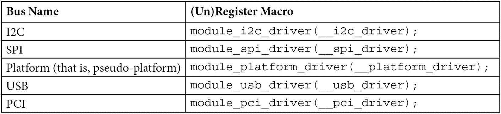

# 第六章：*第六章*：设备、驱动程序与平台抽象简介

**Linux 设备模型**（**LDM**）是 Linux 内核中引入的一个概念，用于描述和管理内核对象（例如需要引用计数的对象，如文件、设备、总线甚至驱动程序），以及它们的层级关系和如何与其他对象绑定。LDM 引入了对象生命周期管理、引用计数、内核中的**面向对象**（**OO**）编程风格和其他优势（如代码重用与重构、自动资源释放等），这些内容在此不做讨论。

由于引用计数和生命周期管理位于 LDM 的最低层次，我们将讨论更高级的表示方式，如处理常见的内核数据对象和结构，包括**设备**、**驱动程序**和**总线**。

本章将涵盖以下主题：

+   Linux 内核平台抽象和数据结构

+   设备与驱动程序匹配机制的解释

# Linux 内核平台抽象和数据结构

Linux 设备模型基于一些基本数据结构构建，包括`struct device`、`struct device_driver`和`struct bus_type`。第一个数据结构表示要驱动的设备，第二个是每个驱动设备的软件实体的数据结构，后者表示设备与 CPU 之间的通道。

## 设备基本结构

设备有助于提取物理或虚拟设备。它们是基于`struct device`结构构建的，值得先介绍该结构，具体内容可见`include/linux/device.h`：

```
struct device {
    struct device         *parent;
    struct kobject        kobj;
    struct bus_type       *bus;
    struct device_driver  *driver;
    void *platform_data;
    void *driver_data;
    struct dev_pm_domain  *pm_domain;
    struct device_node    *of_node; 
    struct fwnode_handle  *fwnode;
    dev_t       devt;
    u32         id;
    [...]
};
```

让我们看一下这个结构中的每个元素：

+   `parent`：这是设备的“父”设备，即该设备所附着的设备。在大多数情况下，父设备是某种总线或主控制器。如果`parent`为`NULL`，则说明该设备是顶级设备。例如，总线控制器设备就是这种情况。

+   `kobj`：这是最低级的数据结构，用于跟踪内核对象（如总线、驱动程序、设备等）。这是 LDM 的核心部分。我们将在*第十四章*中讨论这一点，*Linux 设备模型简介*。

+   `bus`：这指定了设备所在的总线类型。它是设备与 CPU 之间的通道。

+   `driver`：这指定了哪个驱动程序分配了此设备。

+   `platform_data`：这是设备特定的、提供平台数据的字段。当设备在板级文件中声明时，该字段会自动设置。换句话说，它指向板级设置文件中描述设备及其接线方式的特定结构。它有助于减少设备驱动代码中的`#ifdef`使用。它包含诸如芯片变体、GPIO 引脚角色和中断线等资源。

+   `driver_data`：这是一个私有指针，用于存储与驱动程序相关的信息。总线控制器驱动程序负责提供辅助函数，这些访问器用于获取/设置此字段。

+   `pm_domain`：此字段指定在系统电源状态变化时执行的电源管理特定回调：挂起、休眠、系统恢复以及在运行时 PM 过渡期间，包含子系统级和驱动程序级的回调。

+   `of_node`：这是与该设备关联的设备树节点。此字段由`platform_data`自动填充，或者`of_node`设置为确定设备声明的位置。

+   `id`：这是设备实例。

设备通常不是通过裸设备结构表示的，因为大多数子系统会追踪它们所托管的设备的额外信息；相反，该结构通常嵌入在设备的更高级表示中。`struct i2c_client`、`struct spi_device`、`struct usb_device`和`struct platform_device`结构都嵌入了一个`struct device`元素（`spi_device->dev`、`i2c_client->dev`、`usb_device->dev`和`platform_device->dev`）。

## 设备驱动程序基础结构

接下来我们需要介绍的是`struct device_driver`结构。此结构是任何设备驱动程序的基本元素。在面向对象的编程语言中，这个结构就像基类，每个设备驱动程序都将继承它。

此数据结构在`include/linux/device/driver.h`中定义，如下所示：

```
struct device_driver {
    const char        *name;
    struct bus_type   *bus;
     struct module    *owner;
     const struct of_device_id   *of_match_table;
     const struct acpi_device_id *acpi_match_table;
     int (*probe) (struct device *dev);
     int (*remove) (struct device *dev);
    void (*shutdown) (struct device *dev);
    int (*suspend) (struct device *dev,
                      pm_message_t state);
    int (*resume) (struct device *dev);
    const struct dev_pm_ops *pm;
};
```

让我们来看一下这个结构中的每个元素：

+   `name`：这是设备驱动程序的名称。当没有匹配方法成功时，它会作为回退（即，它会将此名称与设备名称匹配）。

+   `bus`：此字段是必填项。它表示此驱动程序所属设备的总线。如果此字段未设置，驱动程序注册将失败，因为正是其`probe`方法负责将驱动程序与设备匹配。

+   `owner`：此字段指定模块所有者。

+   `of_match_table`：这是开放固件表。它表示用于设备树匹配的`struct of_device_id`元素数组。

+   `acpi_match_table`：这是 ACPI 匹配表。它与`of_match_table`相同，但用于 ACPI 匹配，在本教程中不会讨论该内容。

+   `probe`：此函数用于查询特定设备是否存在，驱动程序是否可以与其配合工作，然后将驱动程序绑定到特定设备上。总线驱动程序负责在特定时刻调用此函数，我们稍后将讨论此内容。

+   `remove`：当设备从系统中移除时，会调用此方法将其与驱动程序解绑。

+   `shutdown`：当设备即将关闭时，会发出此命令。

+   `suspend`：这是一个回调函数，允许将设备置于睡眠模式，通常是低功耗状态。

+   `resume`：这是由驱动程序核心调用，用于唤醒处于睡眠模式的设备。

+   `pm`：这表示一组与该驱动程序匹配的设备相关的电源管理回调函数。

在前述数据结构中，`shutdown`、`suspend`、`resume` 和 `pm` 元素是可选的，因为它们用于电源管理目的。是否提供这些元素取决于底层设备的能力（例如，设备是否可以关闭、挂起或执行其他与电源管理相关的功能）。

### 驱动程序注册

首先，你应该记住，注册设备包括将设备插入到由其总线驱动程序维护的设备列表中。同样，注册设备驱动程序是将该驱动程序推入由其所在总线驱动程序维护的驱动程序列表中。例如，注册 USB 设备驱动程序会将该驱动程序插入到由 USB 控制器驱动程序维护的驱动程序列表中。注册 SPI 设备驱动程序的过程也是一样，它会将该驱动程序排入由 SPI 控制器驱动程序维护的驱动程序列表中。`driver_register()` 是一个低级函数，用于将设备驱动程序注册到总线中。它会将驱动程序添加到总线的驱动程序列表中。当设备驱动程序与总线注册后，内核会遍历总线的设备列表，对于每个没有关联驱动程序的设备，调用总线的 `match()` 回调函数，以查看该驱动程序是否可以处理这些设备。当匹配成功时，设备与设备驱动程序将被绑定在一起。将设备与设备驱动程序关联的过程称为绑定。

你可能永远不想直接使用 `driver_register()`；由总线驱动程序提供特定总线的注册函数，通常是基于 `driver_register()` 的包装函数。到目前为止，特定总线的注册函数一直遵循 `{bus_name}_register_driver()` 模式。例如，USB、SPI、I2C 和 PCI 驱动程序的注册函数分别为 `usb_register_driver()`、`spi_register_driver()`、`i2c_register_driver()` 和 `pci_register_driver()`。

推荐在模块的`init`/`exit`函数中注册/反注册驱动程序，这些函数分别在模块加载/卸载阶段执行。在许多情况下，注册/反注册驱动程序是你在这些`init`/`exit`函数中唯一需要执行的操作。在这种情况下，每个总线核心提供一个特定的辅助宏，它将被扩展为模块的`init`/`exit`函数，并内部调用总线特定的注册/反注册函数。这些总线宏遵循`module_{bus_name}_driver(__{bus_name}_driver);`模式，其中`__{bus_name}_driver`是相应总线的驱动程序结构。下表展示了 Linux 支持的一些总线及其宏（此表并不详尽）：



表 6.1 – 一些总线及其（反）注册宏

总线控制器代码负责提供这些宏，但并非总是如此。例如，MDIO 总线驱动程序（用于控制网络设备的 2 线串行总线）并未提供`module_mdio_driver()`宏。在编写驱动程序之前，你应该检查该宏是否存在于设备所在的总线上。以下代码块展示了两个不同总线的示例——一个使用总线提供的注册/反注册宏，另一个则没有使用。我们来看一下不使用宏时的代码：

```
static struct platform_driver mypdrv = {
    .probe = my_pdrv_probe,
    .remove = my_pdrv_remove,
    .driver = {
        .name = KBUILD_MODNAME,
        .owner = THIS_MODULE,
    },
};
static int __init my_drv_init(void)
{
    /* Registering with Kernel */
    platform_driver_register(&mypdrv);
    return 0;
}
static void __exit my_pdrv_remove (void)
{
    /* Unregistering from Kernel */
    platform_driver_unregister(&my_driver);
}
module_init(my_drv_init);
module_exit(my_pdrv_remove);
```

上述示例完全没有使用宏。现在，让我们来看一个使用宏的示例：

```
static struct platform_driver mypdrv = {
    .probe = my_pdrv_probe,
    .remove = my_pdrv_remove,
    .driver = {
        .name = KBUILD_MODNAME,
        .owner = THIS_MODULE,
    },
};
module_platform_driver(my_driver);
```

在这里，你可以看到代码是如何进行因式分解的，这在编写驱动程序时是一个很大的优势。

### 在驱动程序中暴露支持的设备

内核必须了解由给定驱动程序支持的设备及其是否存在于系统中，以便当它们出现在系统（总线）上时，内核知道哪个驱动程序负责它，并运行其探测函数。也就是说，驱动程序的`probe()`函数只有在该驱动程序已加载时才会运行（这是用户空间操作）；否则，什么也不会发生。下一节将解释如何管理驱动程序的自动加载，以便当设备出现时，驱动程序会自动加载，并调用其探测函数。

如果我们查看每个总线特定的设备驱动程序结构（`struct platform_driver`、`struct i2c_driver`、`struct spi_driver`、`struct pci_driver` 和 `struct usb_driver`），我们会看到有一个`id_table`字段，其类型取决于总线类型。该字段应包含与驱动程序支持的设备 ID 对应的数组。下表展示了常见总线及其设备 ID 结构：


表 6.2 – 一些总线及其设备识别数据结构

我故意省略了两个特殊情况：设备树和 ACPI。它们可以暴露设备，以便可以通过`driver.of_match_table`或`driver.acpi_match_table`字段在设备树或 ACPI 中声明设备，这些字段并不是总线特定驱动结构的直接元素：


表 6.3 – 仿真总线及其设备识别数据结构

这些结构体都定义在内核源码中的`include/linux/mod_devicetable.h`文件中，它们的名称遵循`{bus_name}_device_id`的模式。我们已经在相应的章节中讨论了每个结构体。因此，让我们来看一个示例，它使用`struct spi_device_id`和`struct of_device_id`来声明该驱动的设备树（新的并且推荐的），并暴露 SPI 设备（[`elixir.free-electrons.com/linux/v4.10/source/drivers/gpio/gpio-mcp23s08.c`](http://elixir.free-electrons.com/linux/v4.10/source/drivers/gpio/gpio-mcp23s08.c)）：

```
static const struct spi_device_id mcp23s08_ids[] = {
    { "mcp23s08", MCP_TYPE_S08 },
    { "mcp23s17", MCP_TYPE_S17 },
    { "mcp23s18", MCP_TYPE_S18 },
    { },
};
static const struct of_device_id mcp23s08_spi_of_match[] = {
    {
        .compatible = "microchip,mcp23s08",
        .data = (void *) MCP_TYPE_S08,
    },
    {
        .compatible = "microchip,mcp23s17",
        .data = (void *) MCP_TYPE_S17,
    },
    {
        .compatible = "microchip,mcp23s18",
        .data = (void *) MCP_TYPE_S18,
    },
    { },
};
static struct spi_driver mcp23s08_driver = {
    .probe  = mcp23s08_probe, /* don't care about this */
    .remove = mcp23s08_remove, /* don't care about this */
    .id_table = mcp23s08_ids,
    .driver = {
        .name    = "mcp23s08",
        .of_match_table =
                of_match_ptr(mcp23s08_spi_of_match),
    },
};
```

上面的摘录展示了驱动如何声明它支持的设备。由于我们的示例是 SPI 驱动，涉及的结构体是`struct spi_device_id`，此外还有`struct of_device_id`，它用于任何需要根据驱动中的`compatible`字符串来匹配设备的驱动。

现在我们已经学习了驱动如何暴露它支持的设备，接下来让我们深入了解设备与驱动绑定的机制，理解当设备与驱动匹配时，底层发生了什么。

## 设备/驱动匹配和模块（自动）加载

请注意这一部分，尽管我们将部分重复之前讨论的内容。**总线**是设备驱动和设备依赖的基本元素。从硬件的角度来看，总线是设备与 CPU 之间的连接，而从软件的角度来看，总线驱动是设备与其驱动之间的连接。每当设备或驱动被添加/注册到系统时，它会自动被添加到一个由总线驱动维护的列表中。例如，注册一个可以由给定驱动（i2c，当然是）管理的 I2C 设备列表时，会将这些设备排入一个全局列表，这个列表由 I2C 适配器驱动维护，并提供一个 USB 设备表，该表会将这些设备插入到 USB 控制器驱动维护的设备列表中。另一个例子是注册一个新的 SPI 驱动，它会将该驱动插入到由 SPI 控制器驱动维护的驱动列表中。没有这些，内核将无法知道哪个驱动应该处理哪个设备。

每个设备驱动程序应该暴露它支持的设备列表，并且应该让驱动核心（特别是总线驱动程序）能够访问该列表。这个设备列表叫做`id_table`，它在驱动程序代码中声明并填充。这个表格是一个设备 ID 的数组，其中每个 ID 的类型取决于设备的类型（如 I2C、SPI、USB 等）。通过这种方式，每当设备出现在总线上时，总线驱动程序会遍历其设备驱动程序的列表，并查看每个 ID 表中的条目，以寻找与新设备对应的条目。所有包含该设备 ID 的驱动程序的`probe()`函数都会运行，并将新设备作为参数传递。这个过程被称为匹配循环。对于驱动程序，它的工作方式类似。每当一个新的驱动程序被注册到总线时，总线驱动程序会遍历其设备列表，并查找已注册驱动程序的`id_table`中出现的设备 ID。对于每次匹配，总线驱动程序都会将相应的设备作为参数传递给驱动程序的`probe()`函数，并根据匹配的次数运行该函数。

匹配循环的问题在于只有已加载的模块才会调用它们的探测函数。换句话说，如果相应的模块未加载（通过`insmod`、`modprobe`）或是内置的，匹配循环将变得无用。在设备出现在总线之前，您必须手动加载该模块。解决这个问题的方法是模块自动加载。由于大多数情况下，模块加载是用户空间的操作（当内核没有通过`request_module()`函数请求该模块时），因此内核必须找到一种方法，将驱动程序及其设备表暴露给用户空间。因此，出现了一个名为`MODULE_DEVICE_TABLE()`的宏：

```
MODULE_DEVICE_TABLE(<bus_type_name>,  <array_of_ids>)
```

这个宏用于支持热插拔，描述了每个特定驱动程序可以支持哪些设备。在编译时，构建过程从驱动程序中提取这些信息，并生成一个可读的表格，名为`modules.alias`，该表格位于`/lib/modules/kernel_version/`目录下。

`<bus_type_name>`参数应该是需要添加模块自动加载支持的总线的通用名称。对于 SPI 总线，应该是`spi`；对于设备树，应该是`of`；对于 I2C，应该是`i2c`，以此类推。换句话说，它应该是前一个表格中**总线类型**第一列的元素之一（注意，并非所有总线都列出）。让我们为之前使用的相同驱动程序（gpio-mcp23s08）添加模块自动加载支持：

```
MODULE_DEVICE_TABLE(spi, mcp23s08_ids);
MODULE_DEVICE_TABLE(of, mcp23s08_spi_of_match);
```

现在，让我们看看将这两行添加到运行基于 Yocto 的镜像的 i.MX6 板上的`modules.alias`文件时会发生什么：

```
root:/lib/modules/5.10.10+fslc+g8dc0fcb# cat modules.alias
# Aliases extracted from modules themselves.
alias fs-msdos msdos
alias fs-binfmt_misc binfmt_misc
alias fs-configfs configfs
alias iso9660 isofs
alias fs-iso9660 isofs
alias fs-udf udf
alias of:N*T*Cmicrochip,mcp23s17* gpio_mcp23s08
alias of:N*T*Cmicrochip,mcp23s18* gpio_mcp23s08
alias of:N*T*Cmicrochip,mcp23s08* gpio_mcp23s08
alias spi:mcp23s17 gpio_mcp23s08
alias spi:mcp23s18 gpio_mcp23s08
alias spi:mcp23s08 gpio_mcp23s08
alias usb:v0C72p0011d*dc*dsc*dp*ic*isc*ip*in* peak_usb
alias usb:v0C72p0012d*dc*dsc*dp*ic*isc*ip*in* peak_usb
alias usb:v0C72p000Dd*dc*dsc*dp*ic*isc*ip*in* peak_usb
alias usb:v0C72p000Cd*dc*dsc*dp*ic*isc*ip*in* peak_usb
alias pci:v00008086d000015B8sv*sd*bc*sc*i* e1000e
alias pci:v00008086d000015B7sv*sd*bc*sc*i* e1000e
[...]
alias usb:v0416pA91Ad*dc*dsc*dp*ic0Eisc01ip00in* uvcvideo
alias of:N*T*Ciio-hwmon* iio_hwmon
alias i2c:lm73 lm73
alias spi:ad7606-4 ad7606_spi
alias spi:ad7606-6 ad7606_spi
alias spi:ad7606-8 ad7606_spi
```

解决方案的第二部分是内核通知用户空间某些事件（称为`pci:v00008086d000015B8sv*sd*bc*sc*i*`）。该事件将由系统热插拔管理器捕获（通过查找具有相同别名的条目并加载相应的模块（例如，e1000））。一旦模块被加载，设备将会被探测。这就是简单的`MODULE_DEVICE_TABLE()`宏如何改变你的生活。

## 设备声明 – 填充设备

设备声明不属于 LDM 的一部分。它包括声明系统中存在（或不存在）的设备，而模块设备表则涉及将驱动程序与其支持的设备进行匹配。有三个地方可以声明/填充设备：

+   来自板文件或独立模块（较旧且现在已弃用）

+   来自**设备树**（新的推荐方法）

+   来自**高级配置和电源接口**（**ACPI**），此部分内容在此不讨论

为了由驱动程序处理，任何已声明的设备应该至少存在于一个模块设备表中；否则，设备将被忽略，除非一个包含该设备 ID 的驱动程序模块设备表被加载或已经被加载。

## 总线结构

最后，存在`struct bus_type`结构，这是内核内部表示总线的结构（无论是物理总线还是虚拟总线）。`struct bus_type`是设备（`struct device`）和驱动程序（`struct device_driver`）之间的连接。如果没有它，系统中将不会附加任何内容，因为总线（`bus_type`）负责匹配设备和驱动程序：

```
struct bus_type {
    const char    *name;
    struct device    *dev_root;
    int (*match)(struct device *dev,
                   struct device_driver *drv);
    int (*probe)(struct device *dev);
    int (*remove)(struct device *dev);
    /* [...] */
};
```

让我们看一下此结构中的元素：

+   `name`：这是总线的名称，它将出现在`/sys/bus/`中。

+   `match`：这是一个回调函数，当一个新设备或驱动程序被添加到总线时会被调用。该回调函数必须足够智能，当设备和驱动程序匹配时，返回一个非零值。设备和驱动程序作为参数传递。匹配回调函数的主要目的是允许总线确定是否可以通过给定的驱动程序处理特定设备，或者如果给定的驱动程序支持该设备，则进行其他逻辑处理。通常，验证过程通过简单的字符串比较（设备和驱动程序名称，或表格和**设备树**（**DT**）兼容属性）来完成。对于枚举设备（如 PCI 和 USB），验证过程是通过比较驱动程序支持的设备 ID 与给定设备的设备 ID 来完成的，而不会牺牲总线特定功能。

+   `probe`：这是一个回调函数，当一个新设备或驱动程序被添加到总线时，并且一旦匹配发生时，都会调用此函数。此函数负责分配特定的总线设备结构，并调用给定驱动程序的探测函数，该函数应该管理设备（我们之前已分配过）。

+   `remove`：当设备从总线中移除时，会调用此回调函数。

当你为一个设备编写驱动程序时，如果该设备位于一个名为**总线控制器**的物理总线上，它必须依赖该总线的驱动程序，该驱动程序被称为**控制器驱动程序**，它负责在设备之间共享总线访问权限。控制器驱动程序提供了一个抽象层，位于你的设备和总线之间。每当你在 I2C 或 USB 总线上执行事务（读取或写入）时，I2C/USB 总线控制器将在后台透明地处理这些事务（管理时钟、数据移位等）。每个总线控制器驱动都会导出一组函数，以简化为位于该总线上的设备编写驱动程序的工作。这适用于每种总线（I2C、SPI、USB、PCI、SDIO 等）。

现在我们已经了解了总线驱动程序以及模块如何加载，我们将讨论匹配机制，它尝试将特定设备绑定到其驱动程序。

# 设备与驱动匹配机制说明

设备驱动和设备总是与总线一起注册。对于导出由驱动程序支持的设备，您可以使用`driver.of_match_table`、`driver.of_match_table`或`<bus>_driver.id_table`（该表特定于设备类型；例如，`i2c_device.id_table`或`platform_device.id_table`）。

每个总线驱动都负责提供其匹配函数，每当有新的设备或设备驱动程序注册到该总线时，内核会运行该函数。也就是说，平台设备有三种匹配机制，所有这些机制都基于字符串比较。这些匹配机制分别基于 DT 表、ACPI 表、设备和驱动程序名称。让我们看看伪平台和 i2c 总线是如何使用这些机制实现匹配函数的：

```
static int platform_match(struct device *dev,
                           struct device_driver *drv)
{
    struct platform_device *pdev =
                         to_platform_device(dev);
    struct platform_driver *pdrv =
                         to_platform_driver(drv);
     /* Only bind to the matching driver when
     * driver_override is set
     */
    if (pdev->driver_override)
        return !strcmp(pdev->driver_override, drv->name);
    /* Attempt an OF style match first */
    if (of_driver_match_device(dev, drv))
        return 1;
    /* Then try ACPI style match */
    if (acpi_driver_match_device(dev, drv))
    return 1;
    /* Then try to match against the id table */
    if (pdrv->id_table)
        return platform_match_id(pdrv->id_table,
                                       pdev) != NULL;
    /* fall-back to driver name match */
    return (strcmp(pdev->name, drv->name) == 0);
}
```

上述代码展示了`drivers/base/platform.c`。下面的代码展示了 I2C 总线匹配函数，该函数在`drivers/i2c/i2c-core.c`中定义：

```
static const struct i2c_device_id *i2c_match_id(
            const struct i2c_device_id *id,
            const struct i2c_client *client)
{
    while (id->name[0]) {
        if (strcmp(client->name, id->name) == 0)
            return id;
        id++;
    }
    return NULL;
}
static int i2c_device_match(struct device *dev, struct
          device_driver *drv)
{
    struct i2c_client *client = i2c_verify_client(dev);
    struct i2c_driver *driver;
    if (!client)
        return 0;
    /* Attempt an OF style match */
    if (of_driver_match_device(dev, drv))
        return 1;
    /* Then ACPI style match */
    if (acpi_driver_match_device(dev, drv))
        return 1;
    driver = to_i2c_driver(drv);
    /* match on an id table if there is one */
    if (driver->id_table)
        return i2c_match_id(driver->id_table,
                               client) != NULL;
    return 0;
}
```

## 案例研究 – OF 匹配机制

在设备树中，每个设备都由一个节点表示，并声明为其总线节点的子节点。在启动时，内核（**OF**核心）解析设备树中的每个总线节点（以及它们的子节点，即坐落在其上的设备）。对于每个设备节点，内核将执行以下操作：

+   确定该节点所属的总线。

+   分配一个平台设备，并使用`of_device_alloc()`函数根据节点中包含的属性进行初始化。`built_pdev->dev.of_node`将设置为当前设备树节点。

+   使用`bus_for_each_drv()`函数遍历与之前识别的总线相关的（由其维护的）设备驱动列表。

+   对于列表中的每个驱动，核心将执行以下操作：

    1.  调用总线匹配函数，传入作为参数的已找到的驱动程序和先前构建的设备结构；即`bus_found->match(cur_drv, cur_dev);`。

    1.  如果此总线驱动程序支持 DT 匹配机制，则总线匹配功能将调用 `of_driver_match_device()`，并传入前面提到的相同参数；即 `of_driver_match_device(ur_drv, cur_dev)`。

    1.  `of_driver_match_device` 将遍历与当前驱动程序相关联的 `of_match_table` 表（它是一个 `of_device_id` 结构体元素的数组）。对于数组中的每个 `of_device_id`，内核将比较当前 `of_device_id` 元素与 `built_pdev->dev.of_node` 的兼容性属性。如果它们相同（假设匹配成功），当前驱动程序的探测函数将被执行。

+   如果没有找到支持该设备的驱动程序，该设备仍将与总线注册。然后，探测机制将推迟到稍后执行，以便每当有新驱动程序与该总线注册时，核心将遍历由总线维护的设备列表；任何没有与之关联驱动程序的设备将再次被探测。对于每个设备，将比较其关联的 `of_node` 的兼容性属性与新注册驱动程序的 `of_match_table` 数组中每个 `of_device_id` 的兼容性属性。

驱动程序是如何与设备匹配的，这些设备是在设备树中声明的。对于每种类型的设备声明（如板文件、ACPI 等），其匹配方式是相同的。

# 总结

在本章中，你学习了如何处理设备和驱动程序，以及它们之间的关联方式。我们还揭示了匹配机制。确保在继续学习 *第七章*，《理解平台设备和驱动程序的概念》、*第八章*，《编写 I2C 设备驱动程序》和 *第九章*，《编写 SPI 设备驱动程序》之前，理解这一部分内容，这些章节将涉及设备驱动程序开发，主要包括与设备、驱动程序和总线结构的交互。

在下一章，我们将深入探讨 *平台驱动程序开发*。
