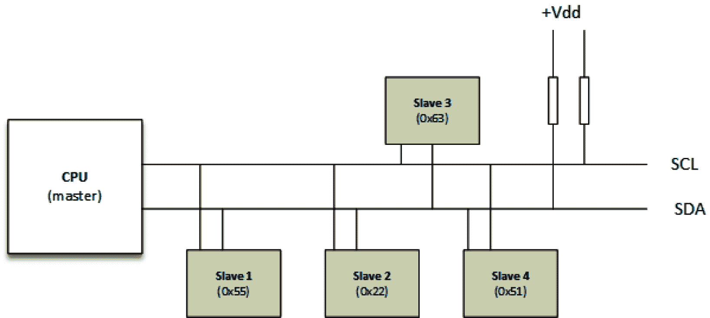

# 第八章：*第八章*：编写 I2C 设备驱动程序

**I2C**代表**集成电路互联**。它是由 Philips（现在是 NXP）发明的串行、支持多主机的异步总线，尽管多主机模式并不广泛使用。I2C 是一个双线总线，分别称为**串行数据**（**SDA**）和**串行时钟**（**SCL**，或**SCK**）。I2C 设备是通过 I2C 总线与其他设备进行交互的芯片。在此总线上，SDA 和 SCL 都是开漏/开集电极，这意味着每个设备可以将其输出拉低，但都不能将输出拉高，而是需要上拉电阻。SCL 由主设备生成，用于同步数据（通过 SDA 传输）在总线上的传输。主设备和从设备都可以发送数据（当然不是同时），因此 SDA 是双向线。也就是说，SCL 信号也是双向的，因为从设备可以通过保持 SCL 线低电平来*拉伸*时钟。总线由主设备控制，在我们的案例中，主设备是**系统级芯片**（**SoC**）的一部分。该总线在嵌入式系统中广泛使用，用于连接串行 EEPROM、RTC 芯片、GPIO 扩展器、温度传感器等设备。

以下图示展示了连接到 I2C 总线的各种设备（也称为从设备）：



图 8.1 – I2C 总线和设备表示

从上面的示意图来看，我们可以将 Linux 内核的 I2C 框架表示如下：

```
CPU <--platform bus-->i2c adapter<---i2c bus---> i2c slave
```

CPU 是主机，负责管理 I2C 控制器，也叫做 I2C 适配器，它实现了 I2C 协议，并管理承载 I2C 设备的总线段。在内核 I2C 框架中，适配器由平台驱动管理，而从设备由 I2C 驱动管理。然而，两个驱动程序都使用 I2C 核心提供的 API。在本章中，我们将重点介绍 I2C（从设备）驱动程序，尽管如果有需要，也会提到适配器。

回到硬件，I2C 时钟速度从 10 kHz 到 100 kHz 不等，也可以从 400 kHz 到 2 MHz。I2C 没有严格的数据传输速度要求，所有连接在特定总线上的从设备将使用该总线配置的相同时钟速度。这与内核源代码中的`drivers/i2c/busses/i2c-imx.c`不同，I2C 的规范可以在[`www.nxp.com/docs/en/user-guide/UM10204.pdf`](https://www.nxp.com/docs/en/user-guide/UM10204.pdf)找到。

现在我们知道将要处理 I2C 设备驱动程序，本章将涉及以下主题：

+   Linux 内核中的 I2C 框架抽象

+   I2C 驱动程序的抽象和架构

+   如何不编写 I2C 设备驱动程序

# Linux 内核中的 I2C 框架抽象

Linux 内核 I2C 框架由几个数据结构组成，其中最重要的是以下内容：

+   `i2c_adapter`：用于抽象 I2C 主设备。它用于标识一个物理 I2C 总线。

+   `i2c_algorithm`：它抽象了 I2C 总线事务接口。这里的事务意味着传输，例如读取或写入操作。

+   `i2c_client`：用于抽象表示位于 I2C 总线上的从设备。

+   `i2c_driver`：从设备的驱动程序。它包含一组特定的驱动功能，用于处理该设备。

+   `i2c_msg`：这是 I2C 事务一个段的低级表示。该数据结构定义了设备地址、事务标志（例如，它是传输还是接收）、指向要发送/接收的数据的指针，以及数据的大小。

由于本章的范围仅限于从设备驱动程序，我们将重点关注最后三个数据结构。不过，为了帮助您理解这一点，我们需要介绍适配器和算法数据结构。

## 对 `struct i2c_adapter` 的简要介绍

内核使用 `struct i2c_adapter` 来表示一个物理的 I2C 总线，并包含访问该总线所需的算法。它的定义如下：

```
struct i2c_adapter {
    struct module *owner;
    const struct i2c_algorithm *algo;
    [...]
};
```

在前面的数据结构中，我们有以下内容：

+   `owner`：大多数情况下，这个值被设置为 `THIS_MODULE`。它是所有者，并用于引用计数。

+   `algo`：这是一个回调函数集，由控制器（主设备）驱动程序用于驱动 I2C 线路。这些回调允许你生成访问 I2C 总线所需的信号。

算法的数据结构有如下定义：

```
struct i2c_algorithm {
    int (*master_xfer)(struct i2c_adapter *adap,
                       struct i2c_msg *msgs, int num);
    int (*smbus_xfer)(struct i2c_adapter *adap, u16 addr,
              unsigned short flags, char read_write,
              u8 command, int size, 
              union i2c_smbus_data *data);
    /* To determine what the adapter supports */
    u32 (*functionality)(struct i2c_adapter *adap);
[...]
};
```

在前面的数据结构中，已省略不重要的字段。让我们看一下摘录中的每个元素：

+   `master_xfer`：这是核心传输函数。对于该算法驱动程序提供的基本 I2C 访问，必须提供此函数。当 I2C 设备驱动程序需要与底层 I2C 设备通信时，会调用此函数。然而，如果它未实现（如果是 `NULL`），则会调用 `smbus_xfer` 函数。

+   `smbus_xfer`：这是一个函数指针，如果 I2C 控制器驱动程序的算法驱动程序可以执行 SMBus 访问，它会被 I2C 控制器驱动程序设置。每当 I2C 芯片驱动程序希望使用 SMBus 协议与芯片设备通信时，就会使用它。如果它是 `NULL`，则使用 `master_xfer` 函数，SMBus 会被模拟。

+   `functionality`：这是一个函数指针，由 I2C 核心调用，用于确定适配器的功能。它通知您该 I2C 适配器驱动程序可以进行何种类型的读取和写入操作。

在前面的代码中，`functionality` 是一个健全性回调函数。核心或设备驱动程序可以调用它（通过 `i2c_check_functionality()`）来检查在我们启动访问之前，给定的适配器是否能够提供所需的 I2C 访问。例如，并不是所有的适配器都支持 10 位寻址模式。因此，在芯片驱动中调用 `i2c_check_functionality(client->adapter, I2C_FUNC_10BIT_ADDR)` 来检查适配器是否支持这一功能是安全的。所有的标志都是以 `I2C_FUNC_XXX` 的形式表示的。虽然每个标志可以单独检查，但 I2C 核心已经将它们拆分为逻辑功能，如下所示：

```
#define I2C_FUNC_I2C              0x00000001
#define I2C_FUNC_10BIT_ADDR       0x00000002
#define I2C_FUNC_SMBUS_BYTE   (I2C_FUNC_SMBUS_READ_BYTE | \
                         I2C_FUNC_SMBUS_WRITE_BYTE)
#define I2C_FUNC_SMBUS_BYTE_DATA \
                      (I2C_FUNC_SMBUS_READ_BYTE_DATA | \
                       I2C_FUNC_SMBUS_WRITE_BYTE_DATA)
#define I2C_FUNC_SMBUS_WORD_DATA \
                     (I2C_FUNC_SMBUS_READ_WORD_DATA | \
                      I2C_FUNC_SMBUS_WRITE_WORD_DATA)
#define I2C_FUNC_SMBUS_BLOCK_DATA \
                     (I2C_FUNC_SMBUS_READ_BLOCK_DATA | \
                      I2C_FUNC_SMBUS_WRITE_BLOCK_DATA)
#define I2C_FUNC_SMBUS_I2C_BLOCK \
                     (I2C_FUNC_SMBUS_READ_I2C_BLOCK | \
                      I2C_FUNC_SMBUS_WRITE_I2C_BLOCK)
```

在前面的代码中，您可以检查 `I2C_FUNC_SMBUS_BYTE` 标志，以确保适配器支持 SMBus 字节定向命令。

本介绍关于 I2C 控制器的内容将在后续章节中根据需要进行参考。尽管本章的主要目的是讨论 I2C 客户端驱动程序（我们将在下一节中讨论），但理解这些内容可能会更有意义。

## I2C 客户端和驱动程序数据结构

第一个也是最明显的数据结构是 `struct i2c_client` 结构，它的声明方式如下：

```
struct i2c_client {
    unsigned short flags;
    unsigned short addr;
    char name[I2C_NAME_SIZE];
    struct i2c_adapter *adapter;
    struct device dev;
    int irq;
};
```

在前面的数据结构中，包含 I2C 设备的属性，`flags` 表示设备标志，其中最重要的是表示是否为 10 位芯片地址的标志。`addr` 包含芯片地址。对于 7 位地址芯片，它将存储在最低的 7 位中。`name` 包含设备名称，限制为 `I2C_NAME_SIZE` （在 `include/linux/mod_devicetable.h` 中设置为 `20`）个字符。`adapter` 是设备所在的适配器（记住，它是 I2C 总线）。`dev` 是设备模型的底层设备结构，`irq` 是分配给设备的中断线。

现在我们已经熟悉了 I2C 设备的数据结构，让我们关注它的驱动程序，它由 `struct i2c_driver` 抽象表示。它可以这样声明：

```
struct i2c_driver {
    unsigned int class;
    /* Standard driver model interfaces */
    int (*probe)(struct i2c_client *client,
                  const struct i2c_device_id *id);
    int (*remove)(struct i2c_client *client);
    int (*probe_new)(struct i2c_client *client);
    void (*shutdown)(struct i2c_client *client);
    struct device_driver driver;
    const struct i2c_device_id *id_table;
};
```

让我们看看数据结构中的每个元素：

+   `probe`：设备绑定的回调函数，成功时应返回 0，失败时返回相应的错误代码。

+   `remove`：设备解绑的回调函数。它必须撤销在 `probe` 中所做的操作。

+   `shutdown`：设备关闭的回调函数。

+   `probe_new`：新的驱动程序模型接口。它将废弃传统的 `probe` 方法，以去除其常用的未使用第二个参数（即 `struct i2c_device_id` 参数）。

+   `driver`：底层设备驱动模型的驱动程序结构。

+   `id_table`：该驱动程序支持的 I2C 设备列表。

该系列的第三个也是最后一个数据结构是 `struct i2c_msg`，它代表一次 I2C 事务的一个操作。它的声明方式如下：

```
struct i2c_msg { 
    __u16 addr; 
    __u16 flags; 
#define I2C_M_TEN 0x0010 
#define I2C_M_RD 0x0001 
    __u16 len; 
    __u8 * buf; 
};
```

这个数据结构中的每个元素都可以自我解释。让我们更详细地看看它们：

+   `addr`：这始终是从设备地址。

+   `flags`：因为一个事务可能由多个操作组成，因此该元素表示此操作的标志。如果是写操作（主设备发送给从设备），则应将其设置为 `0`。但是，如果是读操作（主设备从从设备读取数据），则可以将其与 `I2C_M_RD` 或 `I2C_M_TEN` 进行或运算，`I2C_M_TEN` 适用于 10 位芯片地址的设备。

+   `length`：这是缓冲区中数据的大小。在读取操作中，它对应于要从设备读取的字节数，并存储在 `buf` 中。在写操作中，它表示要写入设备的 `buf` 中的字节数。

+   `buf`：这是读/写缓冲区，必须根据 `length` 分配。

    注意

    由于 `i2c_msg.len` 是 `u16` 类型，您必须确保您的读/写缓冲区的大小始终小于 216（64k）。

现在我们已经讨论了最重要的 I2C 数据结构，让我们看看 I2C 核心暴露的 API（大多数涉及 I2C 适配器的底层实现），以便充分利用我们的设备。

## I2C 通信 API

一旦驱动程序和数据结构初始化完成，从属设备和主设备之间的通信就可以开始。串行总线事务仅仅是简单的寄存器访问问题，无论是读取还是写入其内容。I2C 设备遵循这一原则。

### 普通 I2C 通信

我们将从最低层开始——`i2c_transfer()` 是用于传输 I2C 消息的核心函数。其他 API 封装了此函数，背后由适配器的 `algo->master_xfer` 支持。以下是其原型：

```
int i2c_transfer(struct i2c_adapter *adap,
              struct i2c_msg *msg, int num);
```

使用 `i2c_transfer()` 时，在同一事务的相同读/写操作中，字节之间不会发送停止位。这对于那些在地址写入和数据读取之间不需要停止位的设备很有用，例如。以下代码展示了它的使用方式：

```
static int i2c_read_bytes(struct i2c_client *client, 
                          u8 cmd, u8 *data, u8 data_len)
{
    struct i2c_msg msgs[2];
    int ret;
    u8 *buffer;
    buffer = kzalloc(data_len, GFP_KERNEL);
    if (!buffer)
        return -ENOMEM;;
    msgs[0].addr = client->addr;
    msgs[0].flags = client->flags;
    msgs[0].len = 1;
    msgs[0].buf = &cmd;
    msgs[1].addr = client->addr;
    msgs[1].flags = client->flags | I2C_M_RD;
    msgs[1].len = data_len;
    msgs[1].buf = buffer;
    ret = i2c_transfer(client->adapter, msgs, 2);
    if (ret < 0)
        dev_err(&client->adapter->dev,
                 "i2c read failed\n");
    else
        memcpy(data, buffer, data_len);
    kfree(buffer);
    return ret;
}
```

如果设备在读取序列中间需要一个停止位，您应该将事务拆分为两部分（两个操作）——`i2c_transfer` 用于地址写入（包含单次写操作的事务），另一个 `i2c_transfer` 用于数据读取（包含单次读操作的事务），如下所示：

```
static int i2c_read_bytes(struct i2c_client *client, 
                          u8 cmd, u8 *data, u8 data_len)
{
    struct i2c_msg msgs[2];
    int ret;
    u8 *buffer;
    buffer = kzalloc(data_len, GFP_KERNEL);
    if (!buffer)
        return -ENOMEM;;
    msgs[0].addr = client->addr;
    msgs[0].flags = client->flags;
    msgs[0].len = 1;
    msgs[0].buf = &cmd;
    ret = i2c_transfer(client->adapter, msgs, 1);
    if (ret < 0) {
        dev_err(&client->adapter->dev, 
                "i2c read failed\n");
        kfree(buffer);
        return ret;
    }
    msgs[1].addr = client->addr;
    msgs[1].flags = client->flags | I2C_M_RD;
    msgs[1].len = data_len;
    msgs[1].buf = buffer;
    ret = i2c_transfer(client->adapter, &msgs[1], 1);
    if (ret < 0)
        dev_err(&client->adapter->dev, 
                "i2c read failed\n");
    else
        memcpy(data, buffer, data_len);
    kfree(buffer);
    return ret;
}
```

否则，您可以使用其他替代 API，如 `i2c_master_send` 和 `i2c_master_recv`，分别用于发送和接收数据：

```
int i2c_master_send(struct i2c_client *client,
             const char *buf, int count);
int i2c_master_recv(struct i2c_client *client,
             char *buf, int count);
```

这些 API 都是在 `i2c_transfer()` 的基础上实现的。`i2c_master_send()` 实际上实现了一个包含单次写操作的 I2C 事务，而 `i2c_master_recv()` 则实现了一个包含单次读操作的 I2C 事务。

第一个参数是要访问的 I2C 设备。第二个参数是读/写缓冲区，第三个参数表示要读取或写入的字节数。返回值是读取/写入的字节数。以下代码是我们之前摘录的简化版：

```
static int i2c_read_bytes(struct i2c_client *client, 
                          u8 cmd, u8 *data, u8 data_len)
{
    struct i2c_msg msgs[2];
    int ret;
    u8 *buffer;
    buffer = kzalloc(data_len, GFP_KERNEL);
    if (!buffer)
        return -ENOMEM;;
    ret = i2c_master_send(client, &cmd, 1);
    if (ret < 0) {
        dev_err(&client->adapter->dev, 
                "i2c read failed\n");
        kfree(buffer);
        return ret;
    }
    ret = i2c_master_recv(client, buffer, data_len);
    if (ret < 0)
        dev_err(&client->adapter->dev, 
                "i2c read failed\n");
    else
        memcpy(data, buffer, data_len);
    kfree(buffer);
    return ret;
}
```

至此，我们已经熟悉了内核中如何实现普通的 I2C API。然而，我们还需要处理一类设备——SMBus 兼容设备——这些设备不能与 I2C 设备混淆，尽管它们位于同一物理总线上。

### 系统管理总线（SMBus）兼容的函数

SMBus 是由英特尔开发的双线总线，与 I2C 非常相似。更重要的是，SMBus 是 I2C 的子集，这意味着 I2C 设备兼容 SMBus，但反之则不然。SMBus 是 I2C 的子集，这意味着 I2C 控制器支持大多数 SMBus 操作。然而，对于 SMBus 控制器来说并非如此，因为它们可能不支持 I2C 控制器所支持的所有协议选项。因此，如果你对所编写驱动的芯片有疑问，最好使用 SMBus 方法。

以下是一些 SMBus API 的示例：

```
s32 i2c_smbus_read_byte_data(struct i2c_client *client, 
                             u8 command);
s32 i2c_smbus_write_byte_data(struct i2c_client *client,
                               u8 command, u8 value);
s32 i2c_smbus_read_word_data(struct i2c_client *client, 
                             u8 command);
s32 i2c_smbus_write_word_data(struct i2c_client *client,
                              u8 command, u16 value);
s32 i2c_smbus_read_block_data(struct i2c_client *client,
                              u8 command, u8 *values);
s32 i2c_smbus_write_block_data(struct i2c_client *client,
                               u8 command, u8 length, 
                               const u8 *values);
```

完整的 SMBus API 列表可以在内核源代码的 `include/linux/i2c.h` 中找到。每个函数都是自解释的。以下示例展示了一个简单的读写操作，使用 SMBus 兼容的 API 访问 I2C GPIO 扩展器：

```
struct mcp23016 {
    struct i2c_client   *client;
    struct gpio_chip    chip;
    struct mutex        lock;
};
[...]
static int mcp23016_set(struct mcp23016 *mcp,
             unsigned offset, intval)
{
    s32 value;
    unsigned bank = offset / 8;
    u8 reg_gpio = (bank == 0) ? GP0 : GP1;
    unsigned bit = offset % 8;
    value = i2c_smbus_read_byte_data(mcp->client, 
                                     reg_gpio);
    if (value >= 0) {
        if (val)
            value |= 1 << bit;
        else
            value &= ~(1 << bit);
        return i2c_smbus_write_byte_data(mcp->client,
                                         reg_gpio, value);
    } else
        return value;
}
```

SMBus 部分非常简单，仅包含可用的 API 列表。现在，我们可以使用普通的 I2C 函数或 SMBus 函数访问设备，接下来我们可以开始实现 I2C 驱动程序的主体部分。

# I2C 驱动程序抽象和架构

如前一节所示，`struct i2c_driver` 结构体包含了处理其负责的 I2C 设备所需的驱动方法。一旦设备被添加到总线上，它就需要被探测，这使得 `i2c_driver.probe_new` 方法成为驱动程序的入口点。

## 探测 I2C 设备

`struct i2c_driver` 结构中的 `probe()` 回调函数每次当一个 I2C 设备在总线上实例化并声明使用该驱动程序时都会被调用。它负责以下任务：

+   使用 `i2c_check_functionality()` 函数检查 I2C 总线控制器（I2C 适配器）是否支持设备所需的功能。

+   检查设备是否是我们预期的设备

+   初始化设备

+   如果需要，设置特定设备的数据

+   注册到适当的内核框架中

以前，探测回调函数是分配给 `struct i2c_driver` 的 `probe` 元素，并且具有以下原型：

```
int foo_probe(struct i2c_client *client,
            const struct i2c_device_id *id)
```

由于第二个参数很少使用，这个回调函数已经被弃用，取而代之的是 `probe_new`，其原型如下：

```
int probe(struct i2c_client *client)
```

在前面的原型中，`struct i2c_client` 指针代表了 I2C 设备本身。这个参数由内核根据设备的描述预构建并初始化，这些描述可以在设备树或板文件中完成。

不建议在 `probe` 方法中过早地访问设备。由于每个 I2C 适配器具有不同的能力，因此最好先请求设备以了解其支持的功能，并根据这些信息调整驱动程序的行为：

```
#define CHIP_ID 0x13
#define DA311_REG_CHIP_ID  0x000f
static int fake_i2c_probe(struct i2c_client *client)
{
    int err;
    int ret;
    if (!i2c_check_functionality(client->adapter,
            I2C_FUNC_SMBUS_BYTE_DATA))
        return -EIO;
    /* read family id */
    ret = i2c_smbus_read_byte_data(client, REG_CHIP_ID);
    if (ret != CHIP_ID)
        return (ret < 0) ? ret : -ENODEV;
    /* register with other frameworks */
    [...]
    return 0;
}
```

在前面的示例中，我们检查了底层适配器是否支持设备所需的类型/命令。只有在通过了成功的健全性检查后，我们才能安全地访问设备，并在必要时进一步分配资源并与其他框架注册。

## 实现`i2c_driver.remove`方法

`i2c_driver.remove`回调必须撤销在`probe`函数中所做的工作。它必须从每个在`probe`中注册的框架中注销，并释放请求的每个资源。该回调具有以下原型：

```
static int remove(struct i2c_device *client)
```

在前面的代码行中，`client`是核心传递给`probe`方法的相同 I2C 设备数据结构。这意味着你在探测时存储的任何数据都可以在这里检索。例如，你可能需要根据在`probe`函数中设置的私有数据来处理一些清理工作或其他操作：

```
static int mc9s08dz60_remove(struct i2c_client *client)
{
    struct mc9s08dz60 *mc9s;
    /* We retrieve our private data */
    mc9s = i2c_get_clientdata(client);
   /* Which hold gpiochip we want to work on */
    return gpiochip_remove(&mc9s->chip);
}
```

前面的示例简单且可能代表你在驱动程序中看到的大多数情况。由于此回调应在成功时返回零，失败的原因可能包括设备无法关机、设备仍在使用中等。这意味着可能会有一些情况，在这些情况下你需要查询设备并在此回调函数中执行一些额外的操作。

在开发过程的这个阶段，所有回调都已准备好。现在，是时候让驱动程序向 I2C 核心注册了，我们将在下一节中看到这一点。

## 驱动程序初始化和注册

I2C 驱动程序通过`i2c_add_driver()`和`i2c_del_driver()`API 与核心进行注册和注销。前者是一个宏，背后由`i2c_register_driver()`函数实现。以下代码展示了它们各自的原型：

```
int i2c_add_driver(struct i2c_driver *drv);
void i2c_del_driver(struct i2c_driver *drv);
```

在这两个函数中，`drv`是先前设置的 I2C 驱动程序结构。注册 API 在成功时返回零，失败时返回负错误代码。

驱动程序的注册通常发生在模块初始化中，而注销此驱动程序通常在模块退出方法中完成。以下是 I2C 驱动程序注册的典型示例：

```
static int __init foo_init(void)
{
    [...] /*My init code */
      return i2c_add_driver(&foo_driver);
}
module_init(foo_init);
static void __exit foo_cleanup(void)
{
    [...] /* My clean up code */
      i2c_del_driver(&foo_driver);
}
module_exit(foo_cleanup);
```

如果驱动程序在模块初始化/清理过程中只需要注册/注销驱动程序，那么可以使用`module_i2c_driver()`宏来简化前面的代码，如下所示：

```
module_i2c_driver(foo_driver);
```

此宏将在构建时扩展为模块中的适当初始化/退出方法，这些方法将处理 I2C 驱动程序的注册/注销。

## 在驱动程序中配置设备

为了让匹配循环在我们的 I2C 驱动程序中被调用，`i2c_driver.id_table`字段必须设置为 I2C 设备 ID 的列表，每个 ID 由`struct i2c_device_id`数据结构的一个实例描述，其定义如下：

```
struct i2c_device_id {
   char name[I2C_NAME_SIZE];
   kernel_ulong_t driver_data;
};
```

在上述数据结构中，`name`是设备的描述性名称，而`driver_data`是驱动程序状态数据，它是驱动程序私有的。它可以设置为指向每个设备的数据结构，例如。此外，为了设备匹配和模块（自动）加载的目的，这个设备 ID 数组还需要传递给`MODULE_DEVICE_TABLE`宏。

然而，这与设备树匹配无关。为了使设备树中的设备节点与我们的驱动程序匹配，我们的驱动程序的`i2c_driver.device.of_match_table`元素必须设置为一个包含`struct of_device_id`类型元素的列表。该列表中的每个条目将描述一个可以从设备树中匹配的 I2C 设备。以下是该数据结构的定义：

```
struct of_device_id {
[...]
    char  compatible[128];
    const void *data;
};
```

在上述数据结构中，`compatible`是一个相当描述性的字符串，可以用于设备树中匹配该驱动程序，而`data`则可以指向任何内容，例如每个设备的资源。同样，为了设备树匹配后的模块（自动）加载，这个列表必须传递给`MODULE_DEVICE_TABLE`宏。

以下是一个示例：

```
#define ID_FOR_FOO_DEVICE  0
#define ID_FOR_BAR_DEVICE  1 
static struct i2c_device_id foo_idtable[] = {
   { "foo", ID_FOR_FOO_DEVICE },
   { "bar", ID_FOR_BAR_DEVICE },
   { },
};
MODULE_DEVICE_TABLE(i2c, foo_idtable);
```

现在，对于设备树匹配后的模块加载，我们需要做以下工作：

```
static const struct of_device_id foobar_of_match[] = {
        { .compatible = "packtpub,foobar-device" },
        { .compatible = "packtpub,barfoo-device" },
        {},
};
MODULE_DEVICE_TABLE(of, foobar_of_match);
```

该摘录展示了`i2c_driver`的最终内容，设置了相应的设备表指针：

```
static struct i2c_driver foo_driver = {
    .driver         = {
        .name   = "foo",
        /* The below line adds Device Tree support */
        .of_match_table = of_match_ptr(foobar_of_match),
    },
    .probe          = fake_i2c_probe,
    .remove         = fake_i2c_remove,
    .id_table       = foo_idtable,
};
```

在上述代码中，我们可以看到一旦设置完毕，I2C 驱动程序结构将是什么样子。

## 实例化 I2C 设备

我们将使用设备树声明，因为尽管板文件目前还在旧驱动程序中使用，但它已经是一个远离我们的时代。I2C 设备必须作为它们所在总线节点的子节点（子节点）进行声明。以下是它们绑定所需的属性：

+   `reg`：表示设备在总线上的地址。

+   `compatible`：这是一个用于将设备与驱动程序匹配的字符串。它必须与驱动程序的`of_match_table`中的一个条目匹配。

以下是同一适配器上声明的两个 I2C 设备的示例：

```
&i2c2 { /* Phandle of the bus node */
    pcf8523: rtc@68 {
        compatible = "nxp,pcf8523";
        reg = <0x68>;
    };
    eeprom: ee24lc512@55 { /* eeprom device */
        compatible = "labcsmart,ee24lc512";
        reg = <0x55>;
    };
};
```

上述示例声明了一个地址为`0x68`的 RTC 芯片和一个地址为`0x55`的 EEPROM，它们都位于同一个总线上，即 SoC 的 I2C 总线 2。I2C 核心将依赖于`compatible`字符串属性和`i2c_device_id`表来绑定设备和驱动程序。第一次尝试是通过兼容字符串（即`OF`样式，即设备树）来匹配设备；如果失败，I2C 核心将尝试通过`id`表来匹配设备。

# 如何不编写 I2C 设备驱动程序

决定不编写设备驱动程序的做法是编写适当的用户代码来处理底层硬件。尽管这是用户代码，但内核始终会介入以简化开发过程。I2C 适配器在用户空间由内核以字符设备的形式暴露，路径为`/dev/i2c-<X>`，其中`<X>`是总线号。一旦你打开了与设备所在适配器相对应的字符设备文件，你就可以执行一系列命令。

首先，用于从用户空间处理 I2C 设备的所需头文件如下：

```
#include <linux/i2c-dev.h>
#include <i2c/smbus.h>
#include <linux/i2c.h>
```

以下是可能的命令：

+   `ioctl(file, I2C_FUNCS, unsigned long *funcs)`：此命令可能是您应该发出的第一个命令。它相当于内核中的 `i2c_check_functionality()`，用于返回所需的适配器功能（在 `*funcs` 参数中）。返回的标志也以 `I2C_FUNC_*` 形式表示：

    ```
    unsigned long funcs;
    if (ioctl(file, I2C_FUNCS, &funcs) < 0)
            return -errno;
    if (!(funcs & I2C_FUNC_SMBUS_QUICK)) {
        /* Oops, SMBus write_quick) not available! */
        exit(1);
    }
    /* Now it is safe to use SMBus write_quick command */
    ```

+   `ioctl(file, I2C_TENBIT, long select)`：在这里，您可以选择与之通信的从设备是否是 10 位地址芯片（`select = 1`）或不是（`select = 0`）。

+   `ioctl(file, I2C_SLAVE, long addr)`：此命令用于设置您需要在此适配器上与之通信的芯片地址。地址存储在 `addr` 的低 7 位中（对于 10 位地址，地址会传递在低 10 位中）。该芯片可能已在使用中，此时您可以使用 `I2C_SLAVE_FORCE` 强制使用。

+   `ioctl(file, I2C_RDWR, struct i2c_rdwr_ioctl_data *msgset)`：您可以使用此命令执行不间断的 I2C 读写操作。感兴趣的结构体是 `struct i2c_rdwr_ioctl_data`，其定义如下：

    ```
    struct i2c_rdwr_ioctl_data {
      struct i2c_msg *msgs; /* ptr to array of messages */
      int nmsgs; /* number of messages to exchange */
    }
    ```

以下是使用此 IOCTL 的示例：

```
    int ret;
    uint8_t buf [5] = {regaddr, '0x55', '0x65', 
                       '0x88', '0x14'};
    struct i2c_msg messages[] = {
        {
            .addr = dev,
            .buf = buf,
            .len = 5, /* buf size is 5 */
        },
    };
    struct i2c_rdwr_ioctl_data payload = {
        .msgs = messages,
        .nmsgs = sizeof(messages) 
                 /sizeof(messages[0]),
    };
    ret = ioctl(file, I2C_RDWR, &payload);
```

您还可以使用 `read()` 和 `write()` 调用进行简单的 I2C 事务（在使用 `I2C_SLAVE` 设置地址后）。

+   `ioctl(file, I2C_SMBUS, struct i2c_smbus_ioctl_data *args)`：此命令用于发起 SMBus 传输。主要的结构体参数具有如下原型：

    ```
    struct i2c_smbus_ioctl_data {
        __u8 read_write;
        __u8 command;
        __u32 size;
        union i2c_smbus_data __user *data;
    };
    ```

在上述数据结构中，`read_write` 决定传输方向——`I2C_SMBUS_READ` 为读取，`I2C_SMBUS_WRITE` 为写入。`command` 是芯片可以解释的命令，例如可能是寄存器地址。`size` 是消息的长度，而 `buf` 是消息缓冲区。请注意，I2C 核心已经暴露了标准化的大小。这些大小分别是 `I2C_SMBUS_BYTE`、`I2C_SMBUS_BYTE_DATA`、`I2C_SMBUS_WORD_DATA`、`I2C_SMBUS_BLOCK_DATA` 和 `I2C_SMBUS_I2C_BLOCK_DATA`，用于 1、2、3、5 和 8 字节。完整列表请参见 `include/uapi/linux/i2c.h`。以下是一个示例，展示了如何在用户空间进行 SMBus 传输：

```
    uint8_t buf [5] = {'0x55', '0x65', '0x88'};
    struct i2c_smbus_ioctl_data payload = {
        .read_write = I2C_SMBUS_WRITE,
        .size = I2C_SMBUS_WORD_DATA,
        .command = regaddr,
        .data = (void *) buf,
    };
    ret = ioctl (fd, I2C_SLAVE_FORCE, dev);
    if (ret < 0)
        /* handle errors */
    ret = ioctl (fd, I2C_SMBUS, &payload);
    if (ret < 0)
        /* handle errors */
```

由于您可以使用简单的 `read()`/`write()` 系统调用来执行基本的 I2C 传输（尽管每次传输后都会发送停止位），I2C 核心提供了以下 API 来执行 SMBus 传输：

```
__s32 i2c_smbus_write_quick(int file, __u8 value);
__s32 i2c_smbus_read_byte(int file);
__s32 i2c_smbus_write_byte(int file, __u8 value);
__s32 i2c_smbus_read_byte_data(int file, __u8 command);
__s32 i2c_smbus_write_byte_data(int file, __u8 command,
                                 __u8 value);
__s32 i2c_smbus_read_word_data(int file, __u8 command);
__s32 i2c_smbus_write_word_data(int file, __u8 command,
                                 __u16 value);
__s32 i2c_smbus_read_block_data(int file, __u8 command,
                                 __u8 *values);
__s32 i2c_smbus_write_block_data(int file, __u8 command,
                              __u8 length, __u8 *values);
```

建议您使用这些函数，而不是使用 IOCTL。如果发生错误，所有这些事务将返回 `-1`；您可以检查 `errno` 以更好地理解出了什么问题。在成功的情况下，`*_write_*` 事务将返回 0，而 `*_read_*` 事务将返回读取的值，除了 `*_read_block_*`，它将返回已读取的值的数量。在面向块的操作中，缓冲区不需要超过 32 字节。

除了需要编写代码的 API，你还可以使用 CLI 包 `i2ctools`，它附带了以下工具：

+   `i2cdetect`：一个命令，用于列举给定适配器上的 I2C 设备。

+   `i2cget`：用于转储设备寄存器的内容。

+   `i2cset`：用于设置设备寄存器的内容。

在这一节中，我们学习了如何使用用户空间的 API 和命令行工具与 I2C 设备进行通信。尽管这些方法对于原型开发非常有用，但处理支持中断或其他基于内核的资源（如时钟）的设备可能会变得比较困难。

# 总结

在这一章中，我们讨论了 I2C 设备驱动程序。现在，是时候选择市场上的任何 I2C 设备，并编写相应的驱动程序以及必要的设备树支持了。本章讲解了内核 I2C 核心及其相关 API，包括设备树支持，帮助你掌握与 I2C 设备通信所需的技能。你现在应该能够编写高效的探测函数并将其注册到内核 I2C 核心中。

在下一章中，我们将使用本章所学的技能来开发一个 SPI 设备驱动程序。
