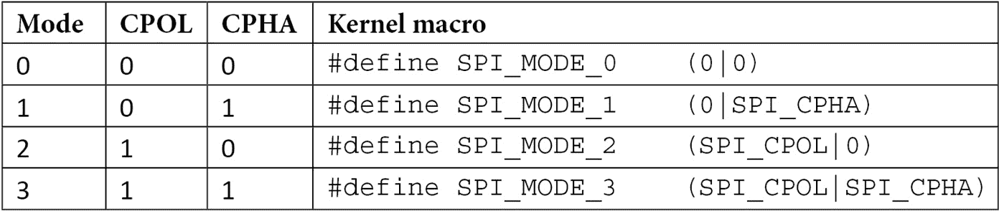

# 第九章：*第九章*：编写 SPI 设备驱动程序

**串行外围接口** (**SPI**) 至少是一个 4 线总线 – **主机输入从机输出** (**MISO**), **主机输出从机输入** (**MOSI**), **串行时钟** (**SCK**), 和 **芯片选择** (**CS**) – 用于连接串行闪存和模数/数模转换器。主机始终生成时钟。其速度可达到 80 MHz，但实际上没有速度限制（这比 I2C 快得多）。同样适用于 CS 线，始终由主机管理。

每个这些信号名称都有一个同义词：

+   每当你看到 **从机输入主机输出** (**SIMO**), **从机数据输入** (**SDI**), 或 **数据输入** (**DI**), 它们指的是 MOSI。

+   **从机输出主机输入** (**SOMI**), **从机数据输出** (**SDO**), 和 **数据输出** (**DO**) 指的是 MISO。

+   **串行时钟** (**SCK**), **时钟** (**CLK**), 和 **串行时钟** (**SCL**) 是指 SCK。

+   S̅ S̅ 是从机选择线，也称为 CS。可以使用 CSx（其中 *x* 是索引，如 CS0、CS1）、EN 和 ENB，意思是使能。CS 通常是一个低有效信号。

下图显示了 SPI 设备通过其暴露的总线连接到控制器的方式：


图 9.1 – SPI 从机设备和主机互连

从上图可以看出，我们可以将 Linux 内核中的 SPI 框架表示如下：

```
CPU <--platform bus--> SPI master <---SPI bus---> SPI slave
```

CPU 是托管 SPI 控制器的主机，也称为 SPI 主控，负责管理托管 SPI 从机设备的总线段。在内核 SPI 框架中，总线由平台驱动程序管理，而从机则由 SPI 设备驱动程序驱动。但是，这两种驱动程序都使用 SPI 核心提供的 API。在本章中，我们将重点关注 SPI（从机）设备驱动程序，但如有必要，也会提及控制器。

本章将介绍诸如以下的 SPI 驱动程序概念：

+   理解 Linux 内核中的 SPI 框架抽象

+   处理 SPI 驱动程序抽象和架构

+   学习如何不编写 SPI 设备驱动程序

# 理解 Linux 内核中的 SPI 框架抽象

Linux 内核 SPI 框架由几个数据结构组成，其中最重要的是以下内容：

+   `spi_controller`，用于抽象 SPI 主设备。

+   `spi_device`，用于抽象连接到 SPI 总线上的从机设备。

+   `spi_driver`，从机设备的驱动程序。

+   `spi_transfer`，这是协议的低级表示中的一个片段。它表示主机与从机之间的单个操作。它期望 Tx 和/或 Rx 缓冲区以及要交换的数据长度和可选的 CS 行为。

+   `spi_message`，这是一个原子传输序列。

现在让我们逐个介绍这些数据结构，从最复杂的开始，即代表 SPI 控制器数据结构。

## 简要介绍 `struct spi_controller`

在本章中，我们将引用控制器，因为它与 SPI 框架中由从设备和其他数据结构深度耦合。因此，有必要介绍其数据结构，表示为 `struct spi_controller`，并定义如下：

```
struct spi_controller {
    struct device     dev;
    u16               num_chipselect;
    u32               min_speed_hz;
    u32               max_speed_hz;
    int               (*setup)(struct spi_device *spi);
    int (*set_cs_timing)(struct spi_device *spi,
                          struct spi_delay *setup,
                          struct spi_delay *hold,
                          struct spi_delay *inactive);
    int    (*transfer)(struct spi_device *spi,
                         struct spi_message *mesg);
    bool    (*can_dma)(struct spi_controller *ctlr,
                        struct spi_device *spi,
                        struct spi_transfer *xfer);
    struct kthread_worker  *kworker;
    struct kthread_work    pump_messages;
    spinlock_t             queue_lock;
    struct list_head       queue;
    struct spi_message     *cur_msg;
    bool                   busy;
    bool                   running;
    bool                   rt;
    int (*transfer_one_message)(
                      struct spi_controller *ctlr,
                      struct spi_message *mesg);
[...]
    int (*transfer_one_message)(
            struct spi_controller *ctlr,
            struct spi_message *mesg);
    void (*set_cs)(struct spi_device *spi, bool enable);
    int (*transfer_one)(struct spi_controller *ctlr,
                    struct spi_device *spi,
                    struct spi_transfer *transfer);
[...]
    /* DMA channels for use with core dmaengine helpers */
    struct dma_chan    *dma_tx;
    struct dma_chan    *dma_rx;
    /* dummy data for full duplex devices */
    Void              *dummy_rx;
    Void              *dummy_tx;
};
```

仅列出了本章用于更好理解数据结构的关键元素。以下列表解释了它们的用途：

+   `num_chipselect` 表示分配给此控制器的 CS 数量。CS 用于区分单独的 SPI 从设备，并从 0 开始编号。

+   `min_speed_hz` 和 `max_speed_hz` 分别是此控制器支持的最低和最高传输速度。

+   `set_cs_timing` 是一个方法，当 SPI 控制器支持 CS 时序配置时提供，在这种情况下，客户端驱动程序将调用 `spi_set_cs_timing()` 来设置请求的时序。该方法已在最近的内核版本中被该补丁弃用：[`lore.kernel.org/lkml/20210609071918.2852069-1-gregkh@linuxfoundation.org/`](https://lore.kernel.org/lkml/20210609071918.2852069-1-gregkh@linuxfoundation.org/))。

+   `transfer` 将消息添加到控制器的传输队列中。在控制器注册路径中（感谢 `spi_register_controller()`），SPI 核心会检查该字段是否为 `NULL`：

    +   如果为 `NULL`，SPI 核心将检查 `transfer_one` 或 `transfer_one_message` 是否已设置，在这种情况下，假设该控制器支持消息排队，并调用 `spi_controller_initialize_queue()`，该函数将把此字段设置为 `spi_queued_transfer`（这是 SPI 核心帮助程序，用于将 SPI 消息排入控制器的队列，并在 `kworker` 没有运行或繁忙时调度消息泵）。

        +   此外，`spi_controller_initialize_queue()` 将为该控制器创建一个专用的 kthread 工作线程（`kworker` 元素）和一个工作结构体（`pump_messages` 元素）。这个工作线程将被频繁调度，以按照 FIFO 顺序处理消息队列。

        +   接下来，SPI 核心将控制器的 `queued` 元素设置为 true。

        +   最后，如果驱动程序在调用注册 API 之前已将控制器的 `rt` 元素设置为 true，则 SPI 核心将把工作线程的调度策略设置为实时 FIFO 策略，优先级为 50。

    +   如果为 `NULL`，并且 `transfer_one` 和 `transfer_one_message` 也都是 `NULL`，则发生错误，且控制器未注册。

    +   如果不是 `NULL`，SPI 核心假定控制器不支持队列，也不会调用 `spi_controller_initialize_queue()`。

+   `transfer_one`和`transfer_one_message`是互斥的。如果两者都设置，SPI 核心将不会调用前者。`transfer_one`传输单个 SPI 传输，并没有`spi_message`的概念。如果驱动程序提供了`transfer_one_message`，它必须基于`spi_message`工作，并将负责处理消息中的所有传输。那些不需要处理消息算法的控制器驱动程序只需要设置`transfer_one`回调，在这种情况下，SPI 核心将会设置`transfer_one_message`为`spi_transfer_one_message`。`spi_transfer_one_message`将在调用驱动程序提供的`transfer_one`回调之前，处理所有的消息逻辑、时序、CS 以及其他硬件相关的属性。除非传输中有`spi_transfer.cs_change = 1`的传输修改了它，否则 CS 将在整个消息传输过程中保持活动状态。消息传输将使用之前通过`setup()`为此设备应用的时钟和 SPI 模式参数来执行。

+   `kworker`：这是专门用于消息泵处理的内核线程。

+   `pump_messages`：这是一个工作结构数据结构的抽象，用于调度处理 SPI 消息队列的函数。它被调度在`kworker`中。该工作结构由`spi_pump_messages()`方法支持，后者会检查队列中是否有需要处理的 SPI 消息，如果有，则调用驱动程序来初始化硬件并传输每个消息。

+   `queue_lock`：用于同步访问消息队列的自旋锁。

+   `queue`：此控制器的消息队列。

+   `idling`：这表示控制器设备是否进入空闲状态。

+   `cur_msg`：当前正在传输的 SPI 消息。

+   `busy`：这表示消息泵的忙碌状态。

+   `running`：这表示消息泵正在运行。

+   `Rt`：这表示`kworker`是否会以实时优先级运行消息泵。

+   `dma_tx`：DMA 传输通道（当控制器支持时）。

+   `dma_rx`：DMA 接收通道（当控制器支持时）。

SPI 传输始终读取和写入相同数量的字节，这意味着即使客户端驱动程序发起的是半双工传输，SPI 核心也会通过使用`dummy_rx`和`dummy_tx`来模拟全双工，从而实现这一目的：

+   `dummy_rx`：这是一个虚拟接收缓冲区，用于全双工设备。当传输的接收缓冲区为`NULL`时，接收到的数据将首先被转移到此虚拟接收缓冲区，然后再被丢弃。

+   `dummy_tx`：这是一个虚拟传输缓冲区，用于全双工设备。当传输的发送缓冲区为`NULL`时，这个虚拟发送缓冲区将被填充为零，并作为传输的发送缓冲区使用。

请注意，SPI 核心将 SPI 消息泵工作任务命名为控制器设备名称（dev->name），该名称在`spi_register_controller()`中设置，如下所示：

```
dev_set_name(&ctlr->dev, "spi%u", ctlr->bus_num);
```

后来，当工作线程在队列初始化期间创建时（记住，`spi_controller_initialize_queue()`），它将被赋予以下名称：

```
ctlr->kworker = kthread_create_worker(0, dev_name(&ctlr->dev));
```

要识别系统中的 SPI 消息泵工作线程，你可以运行以下命令：

```
root@yocto-imx6:~# ps | grep spi
65 root         0 SW   [spi1]
```

在前面的代码片段中，我们可以看到工作线程的名称由总线名称和总线编号组成。

在本节中，我们分析了控制器端的概念，以帮助理解 Linux 内核中整个 SPI 从设备的实现。这个数据结构的重要性非常大，我建议每当你在后续章节中遇到不理解的机制时，都可以回过头来阅读本节内容。现在我们可以真正转向 SPI 设备的数据结构了。

## `struct spi_device` 结构体

第一个也是最明显的数据结构，`struct spi_device` 表示一个 SPI 设备，并在 `include/linux/spi/spi.h` 中定义：

```
struct spi_device {
    struct device dev;
    struct spi_controller  *controller;
    struct spi_master *master;
    u32         max_speed_hz;
    u8          chip_select;
    u8          bits_per_word;
    bool        rt;
    u16         mode;
    int          irq;
    [...]
    int cs_gpio; /* LEGACY: chip select gpio */
    struct gpio_desc *cs_gpiod; /* chip select gpio desc */
    struct spi_delay word_delay; /* inter-word delay */
    /* the statistics */
    struct spi_statistics statistics;
};
```

为了可读性，列出的字段数减少到本书目的所需的最少数量。以下列表详细说明了此结构中每个元素的含义：

+   `controller` 表示该从设备所属的 SPI 控制器。换句话说，它表示设备连接的 SPI 控制器（总线）。

+   `master` 元素仍然存在，是为了兼容性原因，并且很快会被弃用。它曾是控制器的旧名称。

+   `max_speed_hz` 是与此从设备一起使用的最大时钟速率；此参数可以通过驱动程序内部进行更改。我们可以使用 `spi_transfer.speed_hz` 来覆盖该参数，应用于每个传输。稍后我们将讨论 SPI 传输。

+   `chip_select` 是分配给该设备的 CS 线。默认情况下，它是低电平有效的。可以通过在 `mode` 中添加 `SPI_CS_HIGH` 标志来更改此行为。

+   `rt`，如果为 `true`，将使 `controller` 的消息泵工作线程作为实时任务运行。

+   `mode` 定义了数据如何时钟化。设备驱动程序可以更改此设置。数据时钟化默认是每个字传输时的 MSB。此行为可以通过指定 `SPI_LSB_FIRST` 来覆盖。

+   `irq` 表示中断号（在你的板初始化文件中注册为设备资源，或者通过设备树进行注册），你应该将其传递给 `request_irq()` 来接收该设备的中断。

+   `cs_gpio` 和 `cs_gpiod` 都是可选的。前者是基于整数的传统 GPIO 号，表示 CS 线，而后者是新的、推荐的接口，基于 GPIO 描述符。

关于 SPI 模式的一点说明——它们是通过两个特性构建的：

+   CPOL，即初始时钟极性：

    +   `0`：初始时钟状态为低电平，第一个边沿为上升。

    +   `1`：初始时钟状态为高电平，第一个状态为下降。

+   CPHA 是时钟相位，决定数据在何种边沿被采样：

    +   `0`：数据在下降沿（高到低过渡）时被锁存，而输出在上升沿变化。

    +   `1`：数据在上升沿（低到高的转换）时锁存，输出在下降沿时变化。

这使我们能够区分四种 SPI 模式，这些模式是由两个主要宏的混合衍生而来，这些宏在 `include/linux/spi/spi.h` 中定义如下：

```
#define    SPI_CPHA    0x01
#define    SPI_CPOL    0x02
```

这些宏的组合给出了以下 SPI 模式：



表 9.1 – SPI 模式内核定义

以下图表表示了每个 SPI 模式，顺序与前面的数组定义一致。也就是说，仅表示了 MOSI 线，但 MISO 线的原理是相同的。


图 9.2 – SPI 操作模式

现在我们已经熟悉了 SPI 设备数据结构及其操作模式，我们可以切换到第二重要的数据结构，即表示 SPI 设备驱动程序的结构。

## spi_driver 结构体

也叫做协议驱动程序，SPI 设备驱动程序负责驱动连接在 SPI 总线上的设备。它通过 `struct spi_driver` 在内核中进行抽象，声明如下：

```
struct spi_driver {
   const struct spi_device_id *id_table;
   int         (*probe)(struct spi_device *spi);
   int         (*remove)(struct spi_device *spi);
   void        (*shutdown)(struct spi_device *spi);
   struct device_driver    driver;
};
```

以下列表概述了此数据结构中元素的含义：

+   `id_table`：这是此驱动程序支持的 SPI 设备列表。

+   `probe`：此方法将此驱动程序绑定到 SPI 设备。此函数会在任何声明为该驱动程序的设备上调用，并决定该驱动程序是否负责该设备。如果是，则发生绑定过程。

+   `remove`：将此驱动程序从 SPI 设备中解绑。

+   `shutdown`：此方法在系统状态变更时调用，例如关闭电源和停止操作。

+   `driver`：这是设备和驱动模型的低级驱动程序结构。

目前我们只能说这些数据结构的情况，除了每个 SPI 设备驱动程序必须填充并暴露该类型的一个实例之外。

## 消息传输数据结构

SPI I/O 模型由一组排队的消息组成，每条消息可以包含一个或多个 SPI 传输。单个消息由一个或多个 `struct spi_transfer` 对象组成，每个传输代表一个全双工的 SPI 事务。消息可以同步或异步提交和处理。以下是解释消息和传输概念的示意图：


图 9.3 – 示例 SPI 消息结构

现在我们已经了解了理论方面的内容，可以介绍 SPI 传输数据结构，其声明如下：

```
struct spi_transfer {
    const void    *tx_buf;
    void          *rx_buf;
    unsigned    len;
    dma_addr_t    tx_dma;
    dma_addr_t    rx_dma;
    struct sg_table tx_sg;
    struct sg_table rx_sg;
    unsigned    cs_change:1;
    unsigned    tx_nbits:3;
    unsigned    rx_nbits:3;
#define    SPI_NBITS_SINGLE 0x01 /* 1bit transfer */
#define    SPI_NBITS_DUAL        0x02 /* 2bits transfer */
#define    SPI_NBITS_QUAD        0x04 /* 4bits transfer */
    u8        bits_per_word;
    u16       delay_usecs;
    struct    spi_delay    delay;
    struct spi_delay  cs_change_delay;
    struct spi_delay  word_delay;
    u32        speed_hz;
    u32        effective_speed_hz;
[...]
    struct list_head transfer_list;
#define SPI_TRANS_FAIL_NO_START  BIT(0)
    u16        error;
};
```

以下是数据结构中每个元素的含义：

+   `tx_buf` 是指向包含待写入数据的缓冲区的指针。如果设置为 `NULL`，则此传输将被视为半双工读取事务。需要通过 DMA 执行 SPI 事务时，它应该是 DMA 安全的。

+   `rx_buf`是一个数据缓冲区，用于读取数据（具有与`tx_buf`相同的属性），或者在只写事务中为`NULL`。

+   `tx_dma`是`tx_buf`，前提是`spi_message.is_dma_mapped`被设置为`1`。

+   `rx_dma`与`tx_dma`相同，但用于`rx_buf`。

+   `len`表示`rx`和`tx`缓冲区的字节大小。只有`len`字节会被移出（或移入），并且尝试移出部分字会导致错误。

+   `speed_hz`覆盖了`spi_device.max_speed_hz`中指定的默认速度，但仅适用于当前的传输。如果为`0`，则使用默认值（来自`spi_device`）。

+   `bits_per_word`：数据传输涉及一个或多个字。字是数据单元，其大小（以位为单位）根据需求而变化。在这里，`bits_per_word`表示此 SPI 传输中一个字的位数大小。这将覆盖`spi_device.bits_per_word`中提供的默认值。如果为`0`，则使用默认值（来自`spi_device`）。

+   `cs_change`决定在此传输完成后 CS 是否变为不活动。所有 SPI 传输都以适当的 CS 信号激活开始。通常，它会保持选中状态，直到消息中的最后一个传输完成。通过使用`cs_change`，驱动程序可以改变 CS 信号。

该标志用于在消息的中间使 CS 暂时失效（即在处理指定的`spi_transfer`之前），如果该传输不是消息中的最后一个。以这种方式切换 CS 可能是完成芯片命令所必需的，从而允许单个 SPI 消息处理整个芯片事务集。

+   `delay_usecs`表示在此传输之后，延迟（以微秒为单位），然后（可选地）更改`chip_select`状态，接着开始下一个传输或完成此`spi_message`。

    注意

    SPI 传输总是写入与读取相同数量的字节，即使在半双工传输中也是如此。SPI 核心通过控制器的`dummy_rx`和`dummy_tx`元素实现这一点。当传输缓冲区为 null 时，`spi_transfer->tx_buf`将被设置为控制器的`dummy_tx`。然后，零将被移出，同时将从从设备接收到的数据填充到`rx_buf`中。如果接收缓冲区为 null，则`spi_transfer->rx_buf`将被设置为控制器的`dummy_rx`，并且接收到的数据将被丢弃。

### struct spi_message

`spi_message`用于原子地发出一系列传输，每个传输由一个`struct spi_transfer`实例表示。我们之所以称之为*原子*，是因为在进行中的序列完成之前，其他任何`spi_message`都不能使用该 SPI 总线。需要注意的是，有些平台能够通过单个编程 DMA 传输处理多个此类序列。SPI 消息结构具有以下声明：

```
struct spi_message {
       struct list_head     transfers;
       struct spi_device    *spi;
       unsigned       is_dma_mapped:1;
       /* completion is reported through a callback */
       void                 (*complete)(void *context);
       void                 *context;
       unsigned       frame_length;
       unsigned       actual_length;
       int                  status;
    };
```

以下列表概述了此数据结构中各元素的含义：

+   `transfers` 是构成消息的传输列表。我们稍后会看到如何将传输添加到此列表。在该原子组中的最后一个传输使用 `spi_transfer.cs_change` 标志，可能会减少芯片取消选择和选择操作的成本。

+   `is_dma_mapped` 向控制器指示是否使用 DMA（或不使用 DMA）来执行事务。你的代码需要为每个传输缓冲区提供 DMA 和 CPU 虚拟地址。

+   `complete` 是在事务完成时调用的回调，`context` 是传递给回调的参数。

+   `frame_length` 会自动设置为消息中所有字节的总数。

+   `actual_length` 是所有成功片段中传输的字节数。

+   `status` 报告传输的状态。成功时为`0`，否则为`-errno`。

`spi_transfer` 元素在消息中按 FIFO 顺序处理。在消息完成之前（即在完成回调执行之前），你必须确保不使用传输缓冲区，以避免数据损坏。提交 `spi_message`（及其 `spi_transfers`）到下层的代码负责管理其内存。驱动程序一旦提交消息（及其传输），必须忽略该消息（及其传输），至少要等到其完成回调被调用。

## 访问 SPI 设备

一个 SPI 控制器能够与一个或多个从设备进行通信，也就是说，与一个或多个 `struct spi_device` 进行通信。它们构成一个小型总线，共享 MOSI、MISO 和 SCK 信号，但不共享 CS 信号。由于这些共享信号在芯片未被选择时会被忽略，因此每个设备都可以被编程以使用不同的时钟速率。SPI 控制器驱动程序通过 `spi_message` 事务队列来管理与这些设备的通信，将数据在 CPU 内存和 SPI 从设备之间传输。对于它排队的每个消息实例，它会在事务完成时调用该消息的完成回调。

在消息提交到总线之前，它必须通过 `spi_message_init()` 进行初始化，该函数的原型如下：

```
void spi_message_init(struct spi_message *message)
```

该函数将零初始化结构中的每个元素，并初始化传输列表。对于要添加到消息中的每个传输，你应当对该传输调用 `spi_message_add_tail()`，这将导致该传输被排入消息的传输列表。它具有如下声明：

```
spi_message_add_tail(struct spi_transfer *t, struct spi_message *m)
```

一旦完成此操作，你有两种选择来开始事务：

+   `int spi_sync(struct spi_device *spi, struct spi_message *message)`，成功时返回`0`，否则返回负的错误代码。该函数可能会休眠，且不能在中断上下文中使用。需要注意的是，该函数可能会以不可中断的方式休眠，并且不允许指定超时。具有 DMA 能力的控制器驱动程序可能会利用该 DMA 特性，直接将数据推送或拉取到/从消息缓冲区。

SPI 设备的 CS 会在整个消息期间（从第一个传输到最后一个）由核心激活，然后通常在消息之间禁用。有些驱动程序为了最小化选择芯片的影响（例如为了节省电力），会保持芯片处于选中状态，预期下一个消息会发送到同一芯片。

+   `spi_async()`函数可以在任何上下文中使用（无论是否为原子上下文），其原型为`int spi_async(struct spi_device *spi, struct spi_message *message)`。此函数与上下文无关，因为它只进行提交，处理是异步的。然而，完成回调会在无法休眠的上下文中调用。在调用此回调之前，`message->status`的值是未定义的。回调调用时，`message->status`保存完成状态，状态为`0`表示完全成功，或者是负的错误代码。

在回调返回后，发起传输请求的驱动程序可以释放相关的内存，因为它不再被任何 SPI 核心或控制器驱动代码使用。直到当前处理的消息的完成回调返回，排队到该设备的任何后续`spi_message`才会被处理。这条规则同样适用于同步传输调用，因为它们是该核心异步原语的封装。此函数成功时返回`0`，否则返回负的错误代码。

以下是一个驱动程序的摘录，演示了 SPI 消息和传输的初始化与提交：

```
Static int regmap_spi_gather_write(
                    void *context, const void *reg,
                    size_t reg_len, const void *val,
                    size_t val_len)
{
    struct device *dev = context;
    struct spi_device *spi = to_spi_device(dev);
    struct spi_message m;
    u32 addr;
    struct spi_transfer t[2] = {
      { .tx_buf = &addr, .len = reg_len, .cs_change = 0,},
      { .tx_buf = val, .len = val_len, },
    };
    addr = TCAN4X5X_WRITE_CMD  |
             (*((u16 *)reg) << 8) | val_len >> 2;
    spi_message_init(&m);
    spi_message_add_tail(&t[0], &m);
    spi_message_add_tail(&t[1], &m);
    return spi_sync(spi, &m);
}
```

然而，前面的摘录展示了静态初始化，在执行时，消息和传输会在函数返回路径中被丢弃。有些情况下，驱动程序可能希望在驱动生命周期内预分配消息及其传输，以避免频繁的初始化开销。在这种情况下，可以通过`spi_message_alloc()`使用动态分配，并通过`spi_message_free()`释放。它们具有以下原型：

```
struct spi_message *spi_message_alloc(unsigned ntrans,
                                      gfp_t flags)
void spi_message_free(struct spi_message *m)
```

在前面的代码片段中，`ntrans`是分配给这个新`spi_message`的传输次数，`flags`代表新分配内存的标志，使用`GFP_KERNEL`就足够了。如果成功，这个函数会返回新分配的消息结构及其传输。你可以使用内核列表相关宏来访问传输元素，例如`list_first_entry`、`list_next_entry`，甚至是`list_for_each_entry`。以下是展示这些宏使用的示例：

```
/* Completion handler for async SPI transfers */
static void my_complete(void *context)
{
    struct spi_message *msg = context;
    /* doing some other stuffs */
    […]
    spi_message_free(m);
}
static int example_spi_async(struct spi_device *spi,
              struct my_fake_spi_reg *cmds, unsigned len)
{
    struct spi_transfer *xfer;
    struct spi_message *msg;
    msg = spi_message_alloc(len, GFP_KERNEL);
    if (!msg)
         return -ENOMEM;
    msg->complete = my_complete;
    msg->context = msg;
    list_for_each_entry(xfer, &msg->transfers,
               transfer_list) {
        xfer->tx_buf = (u8 *)cmds;
        /* feel free to handle .rx_buf, and so on */
        [...]
        xfer->len = 2;
        xfer->cs_change = true;
         cmds++;
    }
    return spi_async(spi, msg);
}
```

在前面的摘录中，我们不仅展示了如何使用动态的消息和传输分配，还展示了如何使用`spi_async()`。这个示例其实没多大用处，因为分配的消息和传输在完成后立即被释放。使用动态分配的最佳实践是动态分配发送和接收缓冲区，并将它们保持在驱动程序生命周期内易于访问的位置。

但请注意，设备驱动程序负责以最合适的方式组织消息和传输，如下所示：

+   何时开始双向读写，以及如何安排其一系列 `spi_transfer` 请求

+   I/O 缓冲区准备，了解每个 `spi_transfer` 都为每个传输方向包装一个缓冲区，支持全双工传输（即使一个指针为 `NULL`，在这种情况下控制器将使用其中一个虚拟缓冲区）

+   可选地使用 `spi_transfer.delay_usecs` 来定义传输后的短延迟

+   是否在传输后通过使用 `spi_transfer.cs_change` 标志来改变（使之不活跃）CS 信号

使用 `spi_async` 时，设备驱动程序将消息排队，注册完成回调，唤醒消息泵并立即返回。完成回调将在传输完成时被调用。由于消息排队和消息泵调度都不能阻塞，`spi_async` 函数被认为是与上下文无关的。然而，它要求你在访问提交的 `spi_transfer` 指针中的缓冲区之前等待完成回调。另一方面，`spi_sync` 排队消息并在完成之前阻塞。它不需要完成回调。当 `spi_sync` 返回时，访问数据缓冲区是安全的。如果你查看 `drivers/spi/spi.c` 中的实现，你会看到它使用 `spi_async` 将调用线程置于休眠状态，直到完成回调被调用。自 4.0 内核以来，`spi_sync` 有了改进，当队列中没有内容时，消息泵将在调用者的上下文中执行，而不是在消息泵线程中执行，从而避免了上下文切换的开销。

在介绍了 SPI 框架的最重要数据结构和 API 之后，我们可以讨论实际的驱动程序实现。

# 处理 SPI 驱动程序抽象和架构

这是驱动程序逻辑发生的地方。它包括用一组驱动函数填充 `struct spi_driver`，这些函数允许探测并控制底层设备。

## 探测设备

SPI 设备由 `spi_driver.probe` 回调函数探测。该探测回调函数负责确保驱动程序在设备绑定之前能够识别该设备。此回调函数具有以下原型：

```
int probe(struct spi_device *spi)
```

该方法在成功时必须返回 `0`，否则返回负数错误码。唯一的参数是要探测的 SPI 设备，其结构已由内核根据设备树中的描述进行预初始化。

然而，正如我们在描述其数据结构时所看到的，大多数（如果不是所有）SPI 设备的属性都可以被覆盖。SPI 协议驱动可能需要更新传输模式，如果设备无法使用其默认设置。它们也可能需要根据初始值更新时钟频率或字长。这是通过`spi_setup()`辅助函数实现的，原型如下：

```
int spi_setup(struct spi_device * spi)
```

此函数必须在能够独占休眠的上下文中调用。它期望传入一个 SPI 设备结构体，该结构体的属性必须在各自的字段中设置，以便进行覆盖。更改将在下次访问设备时生效（无论是读取操作还是写入操作，前提是该设备已被选中），但`SPI_CS_HIGH`会立即生效。此函数在返回时会取消选择 SPI 设备。此函数成功时返回`0`，失败时返回负值。值得注意的是，它的返回值，因为如果驱动程序提供了底层控制器或其驱动程序不支持的选项，则该调用将不会成功。例如，一些硬件使用九位字、**最低有效位**（**LSB**）优先的线编码或高电平有效的 CS 来处理线传输，而其他硬件则不支持。

你可能希望在`probe()`中调用`spi_setup()`，在向设备提交任何 I/O 请求之前。然而，只要该设备没有挂起的消息，它可以在代码中的任何位置被调用。

以下是一个探测示例，它设置 SPI 设备，检查其家庭 ID，并在成功时返回`0`（设备已识别）：

```
#define FAMILY_ID 0x57
static int fake_probe(struct spi_device *spi)
{
    int err;
    u8 id;
    spi->max_speed_hz =
               min(spi->max_speed_hz, DEFAULT_FREQ);
    spi->bits_per_word = 8;
    spi->mode = SPI_MODE_0;
    spi->rt = true;
    err = spi_setup(spi);
    if (err)
        return err;
    /* read family id */
    err = get_chip_version(spi, &id);
    if (err)
         return -EIO;
    /* verify family id */
    if (id != FAMILY_ID) {
        dev_err(&spi->dev"
    "chip family: expected 0x%02x but 0x%02x rea"\n",
               FAMILY_ID, id);
          return -ENODEV;
    }
    /* register with other frameworks */
    [...]
    return 0;
}
```

一个实际的探测方法可能还需要处理一些驱动状态数据结构或其他每个设备的特定数据结构。关于`get_chip_version()`函数，它可能有以下实现：

```
#define REG_FAMILY_ID 0x2445
#define DEFAULT_FREQ 10000000
static int get_chip_version(spi_device *spi, u8 *id)
{
    struct spi_transfer t[2];
    struct spi_message m;
    u16 cmd;
    int err;
    cmd = REG_FAMILY_ID;
    spi_message_init(&m);
    memset(&t, 0, sizeof(t));
    t[0].tx_buf = &cmd;
    t[0].len = sizeof(cmd);
    spi_message_add_tail(&t[0], &m);
    t[1].rx_buf = id;
    t[1].len = 1;
    spi_message_add_tail(&t[1], &m);
    return spi_sync(spi, &m);
}
```

现在我们已经了解了如何探测 SPI 设备，接下来讨论如何告诉 SPI 核心驱动程序可以支持哪些设备将会很有用。

注意

SPI 核心允许使用`spi_get_drvdata()`和`spi_set_drvdata()`来设置/获取驱动程序状态数据，就像我们在讨论 I2C 设备驱动时在*第八章**，编写 I2C 设备驱动*中所做的那样。

## 在驱动中配置设备

正如我们需要一个`i2c_device_id`列表来告知 I2C 核心我们的 I2C 驱动可以支持哪些设备一样，我们也必须提供一个`spi_device_id`数组来通知 SPI 核心我们的 SPI 驱动支持哪些设备。填充该数组后，必须将其分配给`spi_driver.id_table`字段。此外，为了设备匹配和模块加载目的，这个数组还需要传递给`MODULE_DEVICE_TABLE`宏。`struct spi_device_id`在`include/linux/mod_devicetable.h`中有如下声明：

```
struct spi_device_id {
   char name[SPI_NAME_SIZE];
   kernel_ulong_t driver_data;
};
```

在前面的数据结构中，`name`是设备的描述性名称，`driver_data`是驱动程序的状态值。它可以通过指向每个设备数据结构的指针来设置。以下是一个示例：

```
#define ID_FOR_FOO_DEVICE   0
#define ID_FOR_BAR_DEVICE   1 
static struct spi_device_id foo_idtable[] = {
  "{ ""oo", ID_FOR_FOO_DEVICE },
  "{ ""ar", ID_FOR_BAR_DEVICE },
   { },
};
MODULE_DEVICE_TABLE(spi, foo_idtable);
```

为了能够匹配设备树中声明的设备，我们需要定义一个`struct of_device_id`元素的数组，并将其赋值给`spi_driver.of_match_table`，同时在其上调用`MODULE_DEVICE_TABLE`宏。以下是一个示例，示例还展示了在设置好后的`spi_driver`结构体的样子：

```
static const struct of_device_id foobar_of_match[] = {
        { .compatible"= "packtpub,foobar-dev"ce" },
        { .compatible"= "packtpub,barfoo-dev"ce" },
        {},
};
MODULE_DEVICE_TABLE(of, foobar_of_match);
```

以下摘录展示了最终的`spi_driver`内容：

```
static struct spi_driver foo_driver = {
    .driver         = {
        .name  "= ""oo",
        /* The below line adds Device Tree support */
        .of_match_table = of_match_ptr(foobar_of_match),
    },
    .probe          = my_spi_probe,
    .id_table       = foo_idtable,
};
```

在前面，我们可以看到设置好的 SPI 驱动结构是怎样的。然而，还有一个缺失的元素——`spi_driver.remove`回调，它用于撤销探测函数中所做的操作。

## 实现`spi_driver.remove`方法

`remove`回调必须用于释放所有获取的资源，并撤销探测时所做的操作。该回调有以下原型：

```
static int remove(struct spi_device *spi)
```

在前面的代码片段中，`spi`是 SPI 设备数据结构，和传递给`probe`回调的结构相同，这简化了设备状态数据结构在探测和设备移除之间的跟踪。该方法成功时返回`0`，失败时返回负的错误码。你必须确保设备保持一致且稳定的状态。以下是一个示例实现：

```
static int mc33880_remove(struct spi_device *spi)
{
    struct mc33880 *mc;
    mc = spi_get_drvdata(spi); /* Get our data back */
    if (!mc)
        return -ENODEV;
    /*
     * unregister from frameworks with which we
     * registered in the probe function
     */
    gpiochip_remove(&mc->chip);
    [...]
    /* releasing any resource */
    mutex_destroy(&mc->lock);
    return 0;
}
```

在前面的示例中，代码处理了从框架中注销和释放资源的工作。这是你在 90%的情况下会遇到的经典场景。

## 驱动初始化和注册

在这个实现步骤中，你的代码几乎完成了，并且你希望通知 SPI 核心你的 SPI 驱动。这就是驱动注册。对于 SPI 设备驱动，SPI 核心提供了`spi_register_driver()`和`spi_unregister_driver()`来分别注册和注销 SPI 设备驱动。它们的原型如下：

```
int spi_register_driver(struct spi_driver *sdrv);
void spi_unregister_driver(struct spi_driver *sdrv);
```

在这两个函数中，`sdrv`是先前设置好的 SPI 驱动结构。注册 API 成功时返回 0，失败时返回负的错误码。

驱动注册和注销通常发生在模块初始化和模块退出方法中。以下是一个典型的 SPI 驱动注册示例：

```
static int __init foo_init(void)
{
   [...] /*My init code */
   return spi_register_driver(&foo_driver);
}
module_init(foo_init);
static void __exit foo_cleanup(void)
{
   [...] /* My clean up code */
   spi_unregister_driver(&foo_driver);
}
module_exit(foo_cleanup);
```

如果你在模块初始化时仅进行驱动的注册/注销操作，你可以像下面这样使用`module_spi_driver()`来简化代码：

```
module_spi_driver(foo_driver);
```

该宏将填充模块初始化和清理函数，并会在其中调用`spi_register_driver`和`spi_unregister_driver`。

## 实例化 SPI 设备

SPI 从节点必须是 SPI 控制器节点的子节点。在主模式下，可以有一个或多个从节点（最多与 CS 数量相同）。

所需的属性如下：

+   `compatible`：在驱动中定义的用于匹配的兼容字符串

+   `reg`：设备相对于控制器的 CS 索引

+   `spi-max-frequency`：设备的最大 SPI 时钟速度（单位：Hz）

所有从属节点都可以包含以下可选属性：

+   `spi-cpol`：布尔属性，如果存在，表示设备需要反向**时钟极性**（**CPOL**）模式。

+   `spi-cpha`：布尔属性，表示该设备需要偏移的**时钟相位**（**CPHA**）模式。

+   `spi-cs-hi–h`：空属性，表示设备需要 CS 高电平激活。

+   `spi-3wire`：布尔属性，表示该设备需要 3 线模式才能正常工作。

+   `spi-lsb-first`：布尔属性，表示该设备需要 LSB 优先模式。

+   `spi-tx-bus-width`：该属性表示用于 MOSI 的总线宽度。如果没有该属性，则默认为`1`。

+   `spi-rx-bus-width`：该属性用于表示用于 MISO 的总线宽度。如果没有该属性，则默认为`1`。

+   `spi-rx-delay-–s`：用于指定读取传输后的微秒延迟。

+   `spi-tx-delay-us`：用于指定写入传输后的微秒延迟。

以下是 SPI 设备的实际设备树列表：

```
ecspi1 {
    fsl,spi-num-CSs = <3>;
    cs-gpios = <&gpio5 17 0>, <&gpio5 17 0>, <&gpio5 17 0>;
    pinctrl-0 = <&pinctrl_ecspi1 &pinctrl_ecspi1_cs>;
    #address-cells = <1>;
    #size-cells = <0>;
    compatible"= "fsl,imx6q-ec"pi", "fsl,imx51-ec"pi";
    reg = <0x02008000 0x4000>;
    status"= "o"ay";
    ad7606r8_0: ad7606r8@0 {
        compatible"= "ad760"-8";
        reg = <0>;
        spi-max-frequency = <1000000>;
        interrupt-parent = <&gpio4>;
        interrupts = <30 0x0>;
   };
   label: fake_spi_device@1 {
        compatible"= "packtpub,foobar-dev"ce";
        reg = <1>;
        a-string-param"= "stringva"ue";
        spi-cs-high;
   };
   mcp2515can: can@2 {
        compatible"= "microchip,mcp2"15";
        reg = <2>;
        spi-max-frequency = <1000000>;
        clocks = <&clk8m>;
        interrupt-parent = <&gpio4>;
        interrupts = <29 IRQ_TYPE_LEVEL_LOW>;
    };
};
```

在前面的设备树片段中，`ecspi1`表示主 SPI 控制器。`fake_spi_device`和`mcp2515can`表示 SPI 从设备，它们的`reg`属性表示相对于主设备的 CS 索引。

现在我们已经熟悉了 SPI 从设备框架的所有内核方面，接下来让我们看看如何避免处理内核并尝试在用户空间实现所有功能。

# 学习如何避免编写 SPI 设备驱动程序

处理 SPI 设备的常见方法是编写内核代码来驱动该设备。如今，`spidev`接口使得即使不编写一行内核代码，也可以处理此类设备。然而，使用此接口应仅限于简单的用例，例如与从属微控制器通信或原型开发。使用此接口时，您将无法处理设备可能支持的各种**中断**（**IRQ**），也无法利用其他内核框架。

`spidev`接口以`/dev/spidevX.Y`的形式暴露字符设备节点，其中`X`表示设备所在的总线，`Y`表示在设备树中分配给该设备节点的 CS 索引（相对于控制器）。例如，`/dev/spidev1.0`表示 SPI 总线`1`上的设备`0`。同样适用于 sysfs 目录条目，其形式为`/sys/class/spidev/spidevX.Y`。

在字符设备出现在用户空间之前，设备节点必须在设备树中声明为 SPI 控制器节点的子节点。以下是一个示例：

```
&ecspi2 {
    pinctrl-names"= "defa"lt";
    pinctrl-0 = <&pinctrl_teoulora_ecspi2>;
    cs-gpios = <&gpio2 26 1
                &gpio2 27 1>;
    num-cs = <2>;
    status"= "o"ay";
    spidev@0 {
        reg = <0>;
        compatib"e="semtech,sx1"01";
        spi-max-frequency = <20000000>;
    };
};
```

在前面的代码片段中，`spidev@0` 对应我们的 SPI 设备节点。`reg = <0>` 告诉控制器该设备使用的是第一个 CS 引脚（索引从 0 开始）。`compatible="semtech,sx1301"` 属性用于匹配 `spidev` 驱动程序中的一个条目。现在不再推荐使用 `"spidev"` 作为兼容字符串——如果尝试使用它，你会收到警告。最后，`spi-max-frequency = <20000000>` 设置了我们设备的默认时钟频率（此处为 20 MHz），除非通过相应的 API 进行更改。

从用户空间开始，处理 `spidev` 接口所需的头文件如下：

```
#include <fcntl.h>
#include <unistd.h>
#include <sys/ioctl.h>
#include <linux/types.h>
#include <linux/spi/spidev.h>
```

由于它是一个字符设备，允许（事实上这是唯一的选择）使用基本的系统调用，如 `open()`、`read()`、`write()`、`ioctl()` 和 `close()`。以下示例展示了一些基本用法，仅使用 `read()` 和 `write()` 操作：

```
#include <stdio.h>
#include <stdlib.h>
int main(int argc, char **argv) 
{
   int i,fd;
   char *device = "/dev/spidev0.0";
   char wr_buf[]={0xff,0x00,0x1f,0x0f};
   char rd_buf[10]; 

   fd = open(device, O_RDWR);
   if (fd <= 0) { 
         printf("Failed to open SPI device %s\n", device);
         exit(1);
   }

   if (write(fd, wr_buf, sizeof(wr_buf)) != sizeof(wr_buf))
         perror("Write Error");
   if (read(fd, rd_buf, sizeof(rd_buf)) != sizeof(rd_buf))
         perror("Read Error");
   else
         for (i = 0; i < sizeof(rd_buf); i++)
             printf("0x%02X ", rd_buf[i]);
   close(fd);
   return 0;
}
```

在前面的代码中，需要注意的是，标准的 `read()` 和 `write()` 操作仅支持半双工，而且每次操作之间都会禁用 CS。要实现全双工工作，唯一的选择是使用 `ioctl()` 接口，在该接口中可以随意传递输入和输出缓冲区。此外，借助 `ioctl()` 接口，你可以使用一组 `SPI_IOC_RD_*` 和 `SPI_IOC_WR_*` 命令来获取 `RD` 并设置 `WR`，从而覆盖设备的当前设置。有关这些命令的完整列表和文档，可以在内核源码中的 `Documentation/spi/spidev` 找到。

`ioctl()` 接口允许在不禁用 CS 的情况下执行复合操作，并通过 `SPI_IOC_MESSAGE(N)` 请求实现。一个新的数据结构被引入，即 `struct spi_ioc_transfer`，它是用户空间中 `struct spi_transfer` 的等效结构。以下是 ioctl 命令的示例：

```
#include <stdint.h>
#include <stdio.h>
#include <stdlib.h>
#include <string.h>
/* include required headers, listed early in the section */
[...]
static int pabort(const char *s)
{
    perror(s);
    return -1;
}
static int spi_device_setup(int fd)
{
    int mode, speed, a, b, i;
    int bits = 8;
    /* spi mode: mode 0 */
    mode = SPI_MODE_0;
    a = ioctl(fd, SPI_IOC_WR_MODE, &mode); /* set mode */
    b = ioctl(fd, SPI_IOC_RD_MODE, &mode); /* get mode */
    if ((a < 0) || (b < 0)) {
        return pabort("can't set spi mode");
    }
    /* Clock max speed in Hz */
    speed = 8000000; /* 8 MHz */
    a = ioctl(fd, SPI_IOC_WR_MAX_SPEED_HZ, &speed); /* set */
    b = ioctl(fd, SPI_IOC_RD_MAX_SPEED_HZ, &speed); /* get */
    if ((a < 0) || (b < 0))
        return pabort("fail to set max speed hz");
    /*
     * Set SPI to MSB first.
     * Here, 0 means "not to use LSB first".
     * To use LSB first, argument should be > 0
     */
    i = 0;
    a = ioctl(dev, SPI_IOC_WR_LSB_FIRST, &i);
    b = ioctl(dev, SPI_IOC_RD_LSB_FIRST, &i);
    if ((a < 0) || (b < 0))
        pabort("Fail to set MSB first\n");

    /* setting SPI to 8 bits per word */
    bits = 8;
    a = ioctl(dev, SPI_IOC_WR_BITS_PER_WORD, &bits); /* set */
    b = ioctl(dev, SPI_IOC_RD_BITS_PER_WORD, &bits); /* get */
    if ((a < 0) || (b < 0))
        pabort("Fail to set bits per word\n");

    return 0;
}
```

在前面的例子中，getter 仅用于演示目的。执行 `SPI_IOC_WR_*` 命令后，使用 `SPI_IOC_RD_*` 命令并非强制性的。现在我们已经了解了大多数这些 ioctl 命令，接下来我们来看看如何开始传输：

```
static void do_transfer(int fd)
{
    int ret;
    char txbuf[] = {0x0B, 0x02, 0xB5};
    char rxbuf[3] = {0, };
    char cmd_buff = 0x9f;
    struct spi_ioc_transfer tr[2] = {
        0 = {
          .tx_buf = (unsigned long)&cmd_buff,
          .len = 1,
          .cs_change = 1;    /* We need CS to change */
          .delay_usecs = 50, /* wait after this transfer */
          .bits_per_word = 8,
        },
        [1] = {
          .tx_buf = (unsigned long)tx,
          .rx_buf = (unsigned long)rx,
          .len = txbuf(tx),
          .bits_per_word = 8,
        },
    };
    ret = ioctl(fd, SPI_IOC_MESSAGE(2), &tr);
    if (ret == 1){
        perror("can't send spi message");
        exit(1);
    }
    for (ret = 0; ret < sizeof(tx); ret++)
        printf("%.2X ", rx[ret]);
    printf("\n");
}
```

上述内容展示了用户空间中消息和传输事务的概念。现在我们的帮助程序已定义，我们可以编写主代码来使用它们，如下所示：

```
int main(int argc, char **argv)
{
    char *device = "/dev/spidev0.0";
    int fd;
    int error;
    fd = open(device, O_RDWR);
    if (fd < 0)
        return pabort("Can't open device ");
    error = spi_device_setup(fd);
    if (error)
        exit (1);

    do_transfer(fd);

    close(fd);
    return 0;
}
```

我们现在已经完成了主函数的部分。本节内容教我们如何使用用户空间的 SPI API 和命令与设备进行交互。然而，我们受到一些限制，无法利用设备中断线或其他内核框架。

# 总结

在本章中，我们处理了 SPI 驱动程序，并且现在可以利用这个比 I2C 快得多的串行（全双工）总线。我们走遍了这个框架中的所有数据结构，并讨论了如何通过 SPI 进行数据传输，这是我们涵盖的最重要部分。也就是说，我们通过这些总线访问的内存是外部存储器——为了避免 SPI 和 I2C API 的使用，我们可能需要更多的抽象层。

这就是下一章的内容，它讲解了 regmap API，该 API 提供了更高、更统一的抽象层次，使得 SPI（和 I2C）命令对你变得透明。
